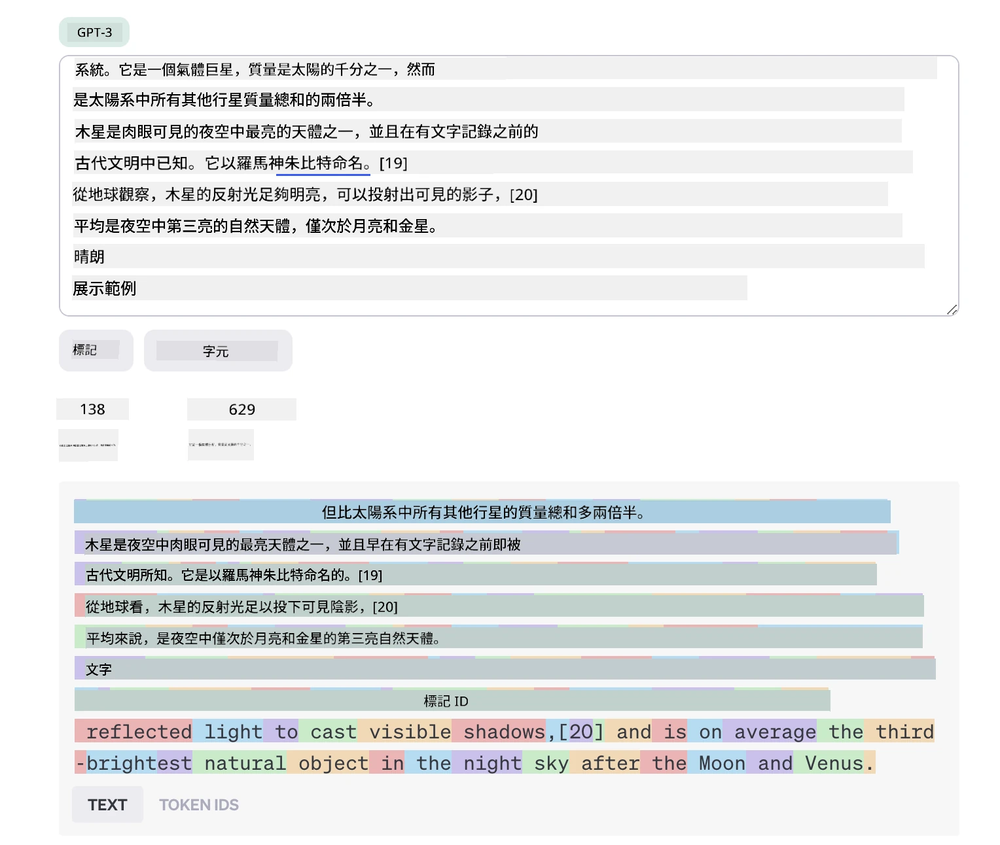
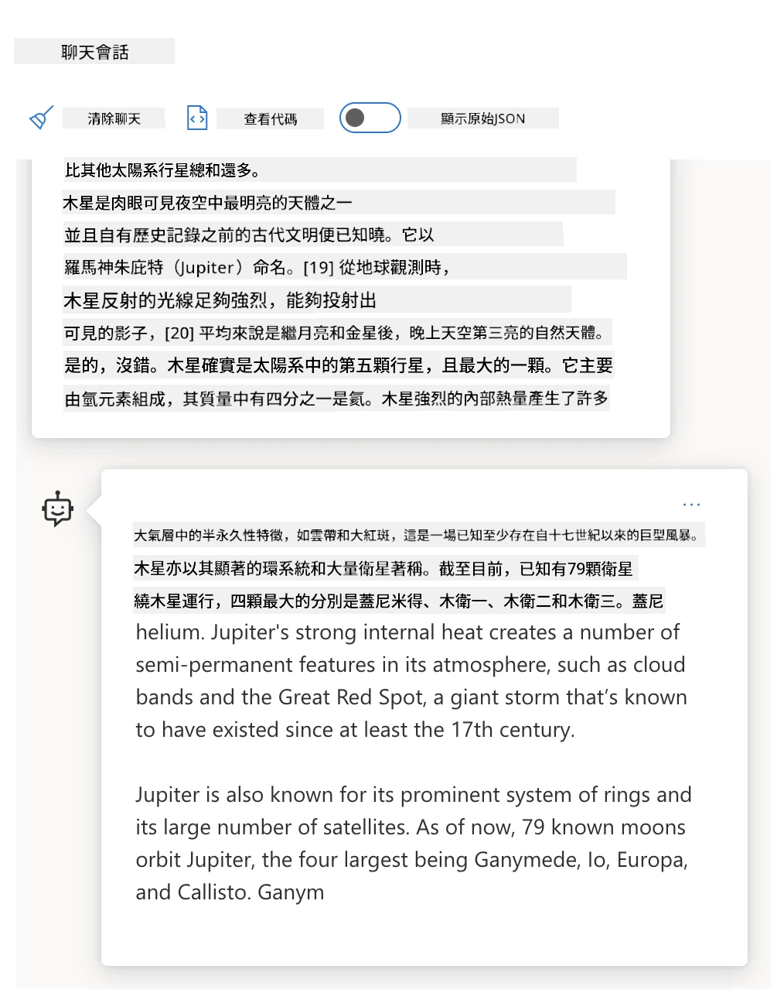
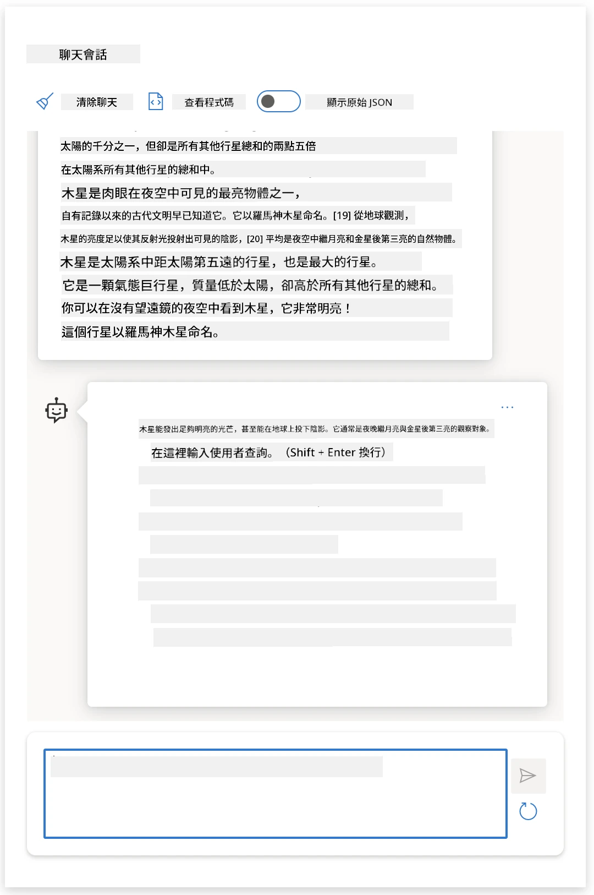
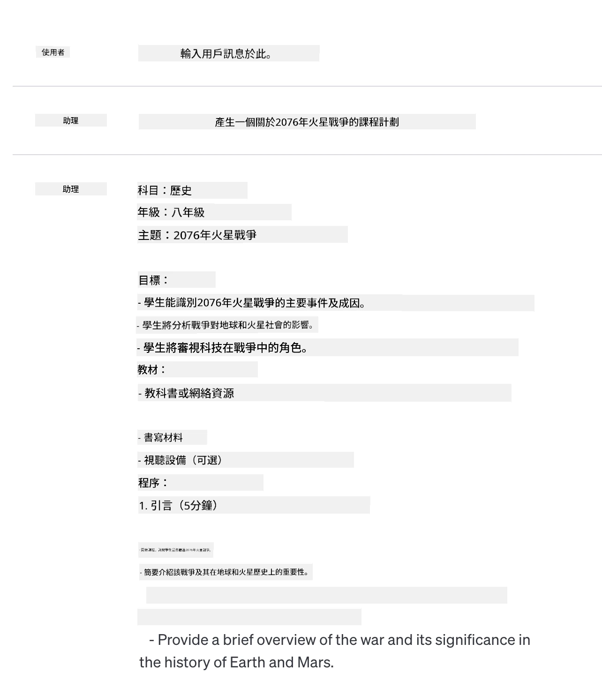
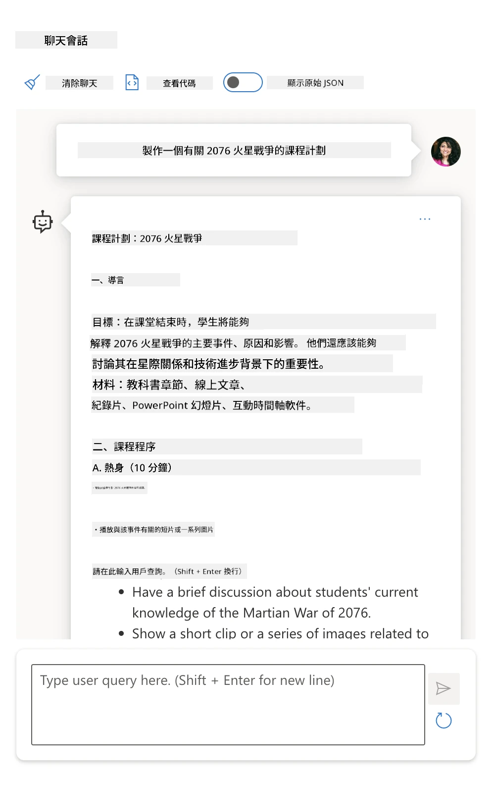
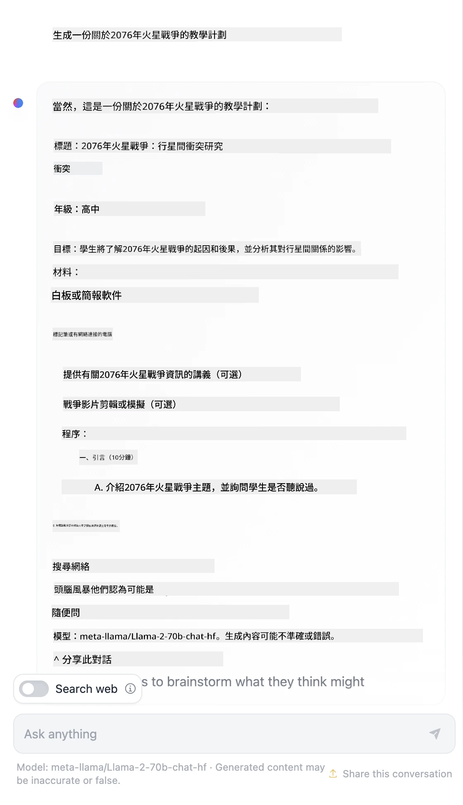

# Prompt 工程基礎

[](https://youtu.be/GElCu2kUlRs?si=qrXsBvXnCW12epb8)

## 導言
本模組涵蓋在生成式 AI 模型中創建有效提示詞的基本概念和技術。你寫給大型語言模型（LLM）的提示詞方式同樣重要，精心設計的提示詞能夠獲得更高質量的回應。但像 _提示詞_ 和 _提示工程_ 這些詞究竟意味著什麼？以及我該如何改進傳送給 LLM 的提示詞 _輸入_？這些都是我們將在本章和下一章嘗試解答的問題。

_生成式 AI_ 能夠根據用戶請求創造新內容（如文字、圖像、音頻、代碼等）。它透過像 OpenAI 的 GPT（「生成預訓練轉換器」）系列這類被訓練使用自然語言和代碼的大型語言模型來實現。

用戶如今可以通過熟悉的聊天範式與這些模型互動，無需任何技術專業知識或培訓。這些模型基於 _提示詞_ 運作——用戶傳送一段文字輸入（提示詞）並獲得 AI 回應（完成）。用戶可以進行多輪對話，逐步完善提示詞，直到回應符合預期。

「提示詞」現在成為生成式 AI 應用最主要的 _程式設計介面_，指示模型要做什麼並影響回應的質量。「提示工程」是一個快速發展的研究領域，專注於 _設計與優化_ 提示詞，以大規模地實現一致且優質的回應。

## 學習目標

在本課程中，我們將學習提示工程是什麼、為什麼重要，以及如何為特定模型和應用目標設計更有效的提示詞。我們會理解提示工程的核心概念和最佳實踐—並了解一個互動式 Jupyter 筆記本「沙盒」環境，讓我們能看到這些概念如何應用於實際範例。

本課結束時，我們將能：

1. 解釋什麼是提示工程及其重要性。
2. 描述提示詞的組成部分以及它們的用途。
3. 學習提示工程的最佳實踐和技巧。
4. 運用所學技巧於實際範例，使用 OpenAI 端點。

## 關鍵術語

提示工程：設計和改進輸入以引導 AI 模型產生期望輸出的實務。
斷詞：將文字轉換成模型能理解和處理的較小單位（稱為標記 tokens）的過程。
指令調整大型語言模型（Instruction-Tuned LLM）：經過特定指令微調以提升回應準確性和相關性的 LLM。

## 學習沙盒

提示工程目前更多是藝術而非科學。提升對它的直覺最好的方法是_多練習_，採用結合應用領域專業知識與推薦技巧及模型特定優化的反覆試錯法。

本課程附帶的 Jupyter 筆記本提供一個_沙盒_環境，讓你邊學邊試，也可用於最後的程式挑戰。執行練習你需要：

1. **Azure OpenAI API 金鑰** - 用於已部署 LLM 之服務端點。
2. **Python 運行環境** - 可以執行筆記本的環境。
3. <strong>本地環境變數</strong> - _請現在完成[設定](./../00-course-setup/02-setup-local.md?WT.mc_id=academic-105485-koreyst)步驟準備。_

筆記本內置了_入門_練習，但鼓勵你自己添加 _Markdown_（說明）和 _Code_（提示請求）段落，試試更多範例和想法，建立對提示設計的直覺。

## 圖解指南

想在深入學習前先掌握本課大綱？觀看此圖解指南，讓你對主要主題和重要重點有初步認識。課程路線圖從核心概念與挑戰說起，再介紹相關提示工程技術和最佳實踐。注意，本指南中「進階技術」章節內容，是本課程 _下一章_ 將涵蓋的。


## 我們的創業公司

現在，讓我們談談_本主題_如何與我們的創業使命——[將 AI 創新帶入教育](https://educationblog.microsoft.com/2023/06/collaborating-to-bring-ai-innovation-to-education?WT.mc_id=academic-105485-koreyst)相關。我們希望打造 AI 支援的_個人化學習_應用，讓我們思考不同使用者如何「設計」提示詞：

- <strong>管理者</strong> 可能要求 AI _分析課程資料找出覆蓋缺口_，AI 能總結結果或用程式碼視覺化。
- <strong>教育者</strong> 可能請 AI _為目標群體和主題生成教案_，AI 可依指定格式建立個人化課程計劃。
- <strong>學生</strong> 可能請 AI _在困難科目上擔任導師_，AI 現能依學生層級，提供課程、提示與範例指導。

這只是冰山一角。參考 [教育專用提示詞](https://github.com/microsoft/prompts-for-edu/tree/main?WT.mc_id=academic-105485-koreyst)—由教育專家策劃的開源提示詞庫，了解更廣泛的可能！_試試在沙盒或 OpenAI Playground 執行這些提示詞看結果！_

<!--
課程範本：
本單元應涵蓋核心概念 #1。
以範例和參考加強該概念。

核心概念 #1：
提示工程。
定義它並說明為何必要。
-->

## 什麼是提示工程？

我們從定義 <strong>提示工程</strong> 開始，指設計和優化文本輸入（提示詞）以提供一致且高質量回應（完成）給定應用目標和模型的過程。我們可以用兩步來看待此過程：

- 為特定模型和目標 _設計_ 初始提示詞
- 反覆 _優化_ 提示詞以提升回應品質

這必然是反覆試錯的過程，需要使用者直覺和努力來達到最佳結果。那麼為什麼這重要？回答此問題前，我們需理解三個概念：

- _斷詞_ = 模型如何「閱讀」提示詞
- _基礎 LLM_ = 基礎模型如何「處理」提示詞
- _指令調整 LLM_ = 模型如何理解「任務」

### 斷詞

LLM 將提示詞視為一串 _標記 tokens_，不同模型（或相同模型的不同版本）對同一提示詞的斷詞方式可能不同。因 LLM 是用標記而非原始文本訓練的，提示詞的斷詞方式會直接影響生成回應的質量。

想了解斷詞如何運作，可以試用下方示例的[OpenAI Tokenizer](https://platform.openai.com/tokenizer?WT.mc_id=academic-105485-koreyst)工具。複製你的提示詞，觀察其如何轉換為 tokens，注意空白字元和標點符號的處理方式。此例展示較舊 LLM（GPT-3），在較新模型上結果可能不同。



### 概念：基礎模型

一旦提示詞被斷詞，["基礎 LLM"](https://blog.gopenai.com/an-introduction-to-base-and-instruction-tuned-large-language-models-8de102c785a6?WT.mc_id=academic-105485-koreyst)（或稱基礎模型）的主要功能是預測序列中下一個 token。由於 LLM 充份訓練於龐大文本資料，它能掌握 tokens 之間的統計關係，並對預測結果充滿信心。注意，它們不理解提示詞中單字的 _意義_；它們只看到一個可以用下一預測「補全」的模式。模型能繼續預測序列，直到被使用者終止或達成預設條件。

想看看基於提示詞的完成如何運作？將上述提示詞輸入 [Microsoft Foundry playground](https://ai.azure.com?WT.mc_id=academic-105485-koreyst)（預設設定），系統將視提示詞為資訊請求，你應能看到相應的完成結果。

但如果使用者想看符合特定條件或任務目標的內容呢？這時 _指令調整_ 的 LLM 就派上用場。



### 概念：指令調整 LLM

[指令調整 LLM](https://blog.gopenai.com/an-introduction-to-base-and-instruction-tuned-large-language-models-8de102c785a6?WT.mc_id=academic-105485-koreyst)是建立在基礎模型上，藉由示例或輸入/輸出配對（如多輪「訊息」）進行微調，其中含有明確指令，AI 回應會嘗試遵照該指令。

它使用類似「人類反饋強化學習」（RLHF）的技術，訓練模型 _遵從指令_ 並 _從反饋學習_，從而讓回應更切合實際應用，更符合使用者目標。

我們來試試——重用上述提示詞，並將 _系統訊息_ 改為包含以下指令作為上下文：

> _將所提供內容以二年級學生能理解的方式摘要，結果保持一段文字並列出 3-5 點要點。_

看看結果如何調整以符合所需目標和格式？教育者現在可直用此回應於該堂課的投影片中。



## 為什麼需要提示工程？

了解提示詞如何被 LLM 處理後，接下來談談 _為什麼_ 需要提示工程。原因在於，目前的 LLM 存在多項挑戰，使得不投注心於提示詞構造與優化，很難達成 _穩定且一致的完成_。例如：

1. **模型回應具隨機性。** 即使 _相同提示詞_，不同模型或模型版本可能產生不同回應。即使在 _同一模型_ 不同時間也可能有不同結果。_提示工程技巧可幫助我們最大程度減少這些變異，提供更好的護欄。_

1. **模型可能捏造回應。** 模型是用 _大且有限_ 的資料集預訓練，對訓練範圍外的概念缺乏認知。結果，它們可能產生不準確、虛構或與已知事實直接矛盾的回應。_提示工程技術幫助使用者識別並減輕此類捏造，如要求 AI 引用來源或推理。_

1. **模型能力各異。** 較新模型或新一代模型有更豐富能力，但也帶來獨特怪癖及成本與複雜性上的權衡。_提示工程能幫助我們制定最佳實踐與流程，抽象差異、並依模型特定需求擴展且順暢地調整。_

讓我們在 OpenAI 或 Azure OpenAI Playground 實地看看：

- 對比使用相同提示詞於不同 LLM 部署（如 OpenAI、Azure OpenAI、Hugging Face）——你有看到差異嗎？
- 反覆對同一 LLM 部署使用相同提示詞（如 Azure OpenAI playground）——這些差異有何不同？

### 捏造範例

本課程使用「<strong>捏造</strong>」一詞，指 LLM 因訓練或其他限制，有時生成事實錯誤資訊的現象。你可能在通俗文章或研究論文中聽過此稱為 _「幻覺」_。但我們強烈建議用 _「捏造」_，避免不小心將機器行為擬人化，將人類特質套用於機器結果。此用詞選擇也符合 [負責任 AI 指南](https://www.microsoft.com/ai/responsible-ai?WT.mc_id=academic-105485-koreyst)的術語指引，避除可能在某些語境被視為冒犯或不包容的用語。

想了解捏造如何發生？想像一個指令讓 AI 針對不存在的主題創作內容（確保該主題不在訓練資料中）。例如，我試了這個提示詞：

> **提示詞：** 生成一個關於 2076 年火星戰爭的教案。

網路搜尋顯示曾有關於火星戰爭的虛構作品（例如影集或書籍）——但沒有 2076 年的相關內容。常識告訴我們 2076 年是 _未來_ 時間，因此不可能是真實事件。


當我們使用不同的 LLM 供應商執行此提示時會發生什麼？

> **回應 1**：OpenAI Playground (GPT-35)



> **回應 2**：Azure OpenAI Playground (GPT-35)



> **回應 3**：Hugging Face Chat Playground (LLama-2)



如預期，每個模型（或模型版本）因隨機行為和模型能力差異，產生稍有不同的回應。例如，有一個模型針對八年級學生，而另一個假設是高中生。但這三個模型都產生了能讓未經資訊的使用者相信事件是真實的回應。

提示工程技術如 _metaprompting_ 和 _temperature 設定_ 可能在某程度上減少模型造假。新的提示工程 _架構_ 也順利地將新工具和技術整合到提示流程中，以緩解或減少部分這些影響。

## 案例研究：GitHub Copilot

讓我們透過一個案例研究來瞭解提示工程如何被應用於現實解決方案：[GitHub Copilot](https://github.com/features/copilot?WT.mc_id=academic-105485-koreyst)。

GitHub Copilot 是你的「AI 配對程式員」— 它將文字提示轉換成程式碼補全，並整合進你的開發環境（例如 Visual Studio Code），提供無縫的使用體驗。如以下一系列部落格紀錄，最初版本基於 OpenAI Codex 模型— 工程師很快意識到需要微調模型及開發更好的提示工程技術來提升程式碼質量。今年七月，他們[推出超越 Codex 的改良 AI 模型](https://github.blog/2023-07-28-smarter-more-efficient-coding-github-copilot-goes-beyond-codex-with-improved-ai-model/?WT.mc_id=academic-105485-koreyst)，以提供更快速的建議。

請按順序閱讀這些文章，跟隨他們的學習歷程。

- **2023年5月** | [GitHub Copilot 在理解你的程式碼方面越來越好](https://github.blog/2023-05-17-how-github-copilot-is-getting-better-at-understanding-your-code/?WT.mc_id=academic-105485-koreyst)
- **2023年5月** | [深入 GitHub：與 GitHub Copilot 背後的 LLMs 一起工作](https://github.blog/2023-05-17-inside-github-working-with-the-llms-behind-github-copilot/?WT.mc_id=academic-105485-koreyst)
- **2023年6月** | [如何為 GitHub Copilot 撰寫更好的提示](https://github.blog/2023-06-20-how-to-write-better-prompts-for-github-copilot/?WT.mc_id=academic-105485-koreyst)
- **2023年7月** | [GitHub Copilot 透過改良 AI 模型超越 Codex](https://github.blog/2023-07-28-smarter-more-efficient-coding-github-copilot-goes-beyond-codex-with-improved-ai-model/?WT.mc_id=academic-105485-koreyst)
- **2023年7月** | [開發者的提示工程與 LLM 指南](https://github.blog/2023-07-17-prompt-engineering-guide-generative-ai-llms/?WT.mc_id=academic-105485-koreyst)
- **2023年9月** | [如何建造企業級 LLM 應用程式：GitHub Copilot 的課程](https://github.blog/2023-09-06-how-to-build-an-enterprise-llm-application-lessons-from-github-copilot/?WT.mc_id=academic-105485-koreyst)

你也可以瀏覽他們的[工程部落格](https://github.blog/category/engineering/?WT.mc_id=academic-105485-koreyst)，如這篇[文章](https://github.blog/2023-09-27-how-i-used-github-copilot-chat-to-build-a-reactjs-gallery-prototype/?WT.mc_id=academic-105485-koreyst)，展示這些模型和技術如何被 _應用_ 在推動現實世界應用中。

---

<!--
LESSON TEMPLATE:
這單元應涵蓋核心概念 #2。
以範例與參考強化此概念。

核心概念 #2:
提示設計。
以範例說明。
-->

## 提示建構

我們已知道提示工程的重要性 - 現在讓我們理解提示是如何 _建構_ 的，這樣我們就能評估不同技術以設計更有效的提示。

### 基本提示

先從基本提示開始：一個不帶其他上下文的純文字輸入送至模型。這是個例子－當我們把美國國歌開頭幾個字送到 OpenAI 的 [Completion API](https://platform.openai.com/docs/api-reference/completions?WT.mc_id=academic-105485-koreyst)，它會立刻用接下來的歌詞完成回應，展現基本的預測行為。

| 提示（輸入）       | 補全（輸出）                                                                                                                            |
| :----------------- | :-------------------------------------------------------------------------------------------------------------------------------------- |
| Oh say can you see | 聽起來你正在開始唱「星條旗永不落」，這是美國的國歌。完整歌詞是...                                                                                  |

### 複雜提示

現在讓我們給該基本提示添加上下文和指令。[Chat Completion API](https://learn.microsoft.com/azure/ai-foundry/openai/how-to/chatgpt?WT.mc_id=academic-105485-koreyst)讓我們將複雜提示建構成一組 _訊息_，包括：

- 輸入/輸出對，反映 _使用者_ 輸入和 _助理_ 回應。
- 系統訊息，設定助理行為或個性背景。

請求現以如下形式呈現，其中 _分詞_ 能有效捕捉上下文和對話中的相關資訊。變更系統上下文對補全的品質影響可與使用者輸入同等重要。

```python
response = client.responses.create(
    model="gpt-5-mini",
    input=[
        {"role": "system", "content": "You are a helpful assistant."},
        {"role": "user", "content": "Who won the world series in 2020?"},
        {"role": "assistant", "content": "The Los Angeles Dodgers won the World Series in 2020."},
        {"role": "user", "content": "Where was it played?"}
    ]
)
```

### 指令提示

上述例子中，使用者提示是可以解讀為查詢資訊的簡單文字。透過 _指令_ 提示，我們可以用該文字更詳細指定任務，給 AI 更佳指導。這是個例子：

| 提示（輸入）                                                                                                                                                                                                                                       | 補全（輸出）                                                                                                | 指令類型         |
| :--------------------------------------------------------------------------------------------------------------------------------------------------------------------------------------------------------------------------------------------- | :--------------------------------------------------------------------------------------------------------- | :--------------- |
| Write a description of the Civil War                                                                                                                                                                                                             | _回傳一段簡短描述_                                                                                           | 簡單              |
| Write a description of the Civil War. Provide key dates and events and describe their significance                                                                                                                                                | _回傳一段描述及關鍵事件日期與說明的清單_                                                                    | 複雜              |
| Write a description of the Civil War in 1 paragraph. Provide 3 bullet points with key dates and their significance. Provide 3 more bullet points with key historical figures and their contributions. Return the output as a JSON file                       | _回傳更詳細資訊於文字框中，格式為 JSON，方便複製貼上至檔案並進行驗證_                                    | 複雜。格式化       |

## 主要內容

上述例子中，提示仍相當開放式，讓 LLM 決定其預先訓練數據中哪些部分是相關的。用 _主要內容_ 設計模式，輸入文字分為兩部分：

- 一條指令（行動）
- 相關內容（影響行動）

這是一個例子，指令是「用兩句話摘要這段內容」。

| 提示（輸入）                                                                                                                                                                                                                                                                                                                                                                                                                                                                                                                                                                                                                                                                                 | 補全（輸出）                                                                                                                                                                                                                                                                                   |
| :----------------------------------------------------------------------------------------------------------------------------------------------------------------------------------------------------------------------------------------------------------------------------------------------------------------------------------------------------------------------------------------------------------------------------------------------------------------------------------------------------------------------------------------------------------------------------------------------------------------------------------------------------------------------------------------- | :---------------------------------------------------------------------------------------------------------------------------------------------------------------------------------------------------------------------------------------------------------------------------------------------- |
| 木星是太陽系中的第五顆行星，也是最大的一顆。它是一顆氣體巨星，質量約為太陽的千分之一，但卻是太陽系中其他所有行星質量總和的兩倍半。木星是肉眼在夜空中可見的最亮天體之一，自古以來便為古文明所知。木星以羅馬神朱比特命名。[19] 從地球觀察，木星反射的光線足以投射出可見陰影，[20] 並且平均來說是夜空中繼月亮、金星之後第三亮的自然天體。<br/><strong>用兩句短句摘要此內容</strong> | 木星是距太陽第五顆，也是太陽系中最大的行星，為夜空中最亮的天體之一。它以羅馬神朱比特命名，是一顆氣體巨星，質量是其他所有行星質量總和的兩倍半。 |

主要內容片段可以用多種方式，來推動更有效的指令：

- <strong>範例</strong> – 不直接叫模型做某事，而是給模型示範範例並讓其推斷模式。
- <strong>提示</strong> – 在指令後加上「提示語」，引導補全，幫助模型朝更相關回應發展。
- <strong>範本</strong> – 這是重覆可用的提示「配方」，包含可用資料自訂的佔位符（變數），適用不同應用場景。

我們來看看這些實際操作。

### 使用範例

這是一種用主要內容提供一些期望輸出範例的方式，讓模型推斷期望輸出模式。根據範例數量，我們有零次提示、一次提示、少次提示等說法。

提示現在包含三部分：

- 任務描述
- 幾個期望輸出範例
- 新範例開始（成為隱含任務描述）

| 學習類型   | 提示（輸入）                                                                             | 補全（輸出）                  |
| :--------- | :--------------------------------------------------------------------------------------- | :----------------------------- |
| 零次提示   | "The Sun is Shining". 翻譯成西班牙文                                                  | "El Sol está brillando".       |
| 一次提示   | "The Sun is Shining" => "El Sol está brillando". <br> "It's a Cold and Windy Day" =>      | "Es un día frío y ventoso".    |
| 少次提示   | 選手跑壘壘包 => 棒球 <br/> 選手擊出王牌球 => 網球 <br/> 選手擊出六分球 => 板球 <br/> 選手完成大灌籃 => | 籃球                          |
|            |                                                                                         |                               |

注意零次提示時需明確指令（「翻譯成西班牙文」），但一次提示例子可隱含該指令。少次提示透過更多範例使模型能更準確推論，且不需額外指令。

### 提示語

用主要內容另一技巧是提供 _提示語_，非範例。此時，我們藉由 _起頭_ 一段反映期望回應格式的文字片段，給模型一個正確方向的小提示。模型接著「接收提示」並沿該方向繼續。

| 提示語數量 | 提示（輸入）                                                                                                                                                                                                                                                                                                                                                                                                                                               | 補全（輸出）                                                                                                                                                                                                                                                                                       |
| :--------- | :----------------------------------------------------------------------------------------------------------------------------------------------------------------------------------------------------------------------------------------------------------------------------------------------------------------------------------------------------------------------------------------------------------------------------------------------------------- | :-------------------------------------------------------------------------------------------------------------------------------------------------------------------------------------------------------------------------------------------------------------------------------------------------------- |
| 0          | 木星是太陽系中的第五顆行星，也是最大的一顆。它是一顆氣體巨星，質量約為太陽的千分之一，但卻是太陽系中其他所有行星質量總和的兩倍半。木星是肉眼在夜空中可見的最亮天體之一，自古以來便為古文明所知。<br/><strong>摘要此內容</strong>                                       | 木星是太陽系中最大的行星，也是距離太陽第五顆。它是一顆氣體巨星，質量是太陽的千分之一，但比所有其他行星加起來都重。古代文明早已知木星，在夜空中容易被看到。  |
| 1          | 木星是太陽系中的第五顆行星，也是最大的一顆。它是一顆氣體巨星，質量約為太陽的千分之一，但卻是太陽系中其他所有行星質量總和的兩倍半。木星是肉眼在夜空中可見的最亮天體之一，自古以來便為古文明所知。<br/><strong>摘要此內容</strong> <br/> 我們知道木星 | 是太陽系第五顆，也是最大的一顆行星。它是一顆氣體巨星，質量約為太陽的千分之一，卻是其他所有行星質量加總之兩倍半。它肉眼可見，古時即為人所知。                                         |

| 2              | 木星是太陽系中距離太陽第五顆行星，也是最大的行星。它是一顆氣態巨星，質量約為太陽的千分之一，但卻是太陽系中其他所有行星質量總和的兩倍半。木星是夜空中肉眼可見的最亮天體之一，自有歷史記載前，古代文明便已知曉。<br/><strong>摘要重點</strong> <br/> 我們學到的前三個事實：         | 1. 木星是太陽系中距離太陽第五顆行星，也是最大的行星。 <br/> 2. 它是一顆氣態巨星，質量約為太陽的千分之一...<br/> 3. 木星自古代以來便可以用肉眼看見 ...                                                                       |
|                |                                                                                                                                                                                                                                                                                                                                                                                                                                                              |                                                                                                                                                                                                                                                                                                           |

### 提示模板

提示模板是一個_預先定義的提示製作「配方」_，可以存儲並按需重用，以推動更一致的大規模用戶體驗。它最簡單的形式，是像[OpenAI這個例子](https://cookbook.openai.com/examples/gpt4-1_prompting_guide?WT.mc_id=academic-105485-koreyst)那樣的提示範例集合，既提供了互動提示組件（用戶和系統訊息），也提供了 API 端的請求格式—支持重用。

在更複雜的形式中，比如[LangChain的例子](https://python.langchain.com/docs/concepts/prompt_templates/?WT.mc_id=academic-105485-koreyst)，它包含_可替換占位符_，這些占位符可以用來自多種來源（用戶輸入、系統上下文、外部數據源等）的資料動態生成提示。這讓我們可以建立一套可重用的提示庫，以<strong>程式化</strong>方式大規模推動一致的用戶體驗。

最後，模板的真正價值在於能夠為垂直應用領域建立和發布_提示庫_—其提示模板經過_優化_，以反映應用專屬的上下文或範例，使回應對目標用戶群更貼切和精確。[Prompts For Edu](https://github.com/microsoft/prompts-for-edu?WT.mc_id=academic-105485-koreyst) 倉庫便是此方法的優秀示例，策劃了一套教育領域提示庫，著重於課程規劃、大綱設計、學生輔導等核心目標。

## 支持內容

如果我們認為提示構建有一個指令（任務）和一個目標（主要內容），那麼_次要內容_就像我們提供的額外上下文，來<strong>以某種方式影響輸出</strong>。這可能是調整參數、格式指令、主題分類等，有助於模型根據期望的用戶目標或預期來_量身定制_回應。

例如：給定一個包含全部課程名稱、描述、等級、標籤、講師等詳盡元資料的課程目錄：

- 我們可以定義一個指令為「總結2023年秋季課程目錄」
- 我們可以用主要內容提供一些期望輸出的範例
- 我們可以用次要內容指定前5個「標籤」重點

現在，模型可以以範例顯示的格式提供摘要—但若結果包含多重標籤，它會優先考慮次要內容中標明的5個標籤。

---

<!--
課程範本：
本單元應該涵蓋核心概念 #1。
用範例和參考來強化該概念。

概念 #3：
提示工程技巧。
基本提示工程有哪些技巧？
用練習來說明。
-->

## 提示最佳實踐

既然我們知道如何_建構_提示，現在可以開始思考如何_設計_它們以呈現最佳實踐。我們可分為兩部分來看—擁有正確的_心態_和應用正確的_技巧_。

### 提示工程心態

提示工程是一個嘗試與錯誤的過程，請記住三個大方向的指導因素：

1. **領域理解很重要。** 回應的準確度與相關性取決於該應用或使用者所處的_領域_。運用你的直覺和領域專業知識來<strong>進一步自訂技巧</strong>。例如，在系統提示中定義_領域特定的人格設定_，或在用戶提示中使用_領域特定模板_。提供反映領域情境的次要內容，或使用_領域特定的線索和範例_來引導模型習慣熟悉的用法模式。

2. **模型理解很重要。** 我們知道模型本質上帶有隨機性，但模型實作也會因所用訓練數據集（預訓練知識）、所能提供能力（如API或SDK）及最佳化內容類型（程式碼、圖片、文本等）有所不同。理解你正在使用的模型的強項與限制，利用該知識來_優先排序任務_或建立_客製化模板_，以符合模型的能力。

3. **迭代與驗證很重要。** 模型迅速演進，提示工程技巧也在更新。作為領域專家，你可能有特定應用的其他背景或準則，這些未必適用於更廣泛的社群。使用提示工程工具和技巧來「啟動」提示建構，再利用自身直覺和專業知識迭代並驗證結果。紀錄心得，建立一個<strong>知識庫</strong>（如提示庫），可作他人未來更快迭代的新基線。

## 最佳實踐

現在讓我們看看由[OpenAI](https://help.openai.com/en/articles/6654000-best-practices-for-prompt-engineering-with-openai-api?WT.mc_id=academic-105485-koreyst)和[Azure OpenAI](https://learn.microsoft.com/azure/ai-foundry/openai/concepts/prompt-engineering#best-practices?WT.mc_id=academic-105485-koreyst)從業者推薦的常見最佳實踐。

| 做什麼                              | 為何                                                                                                                                                                                                                                               |
| :-------------------------------- | :------------------------------------------------------------------------------------------------------------------------------------------------------------------------------------------------------------------------------------------------ |
| 評估最新模型                       | 新世代模型可能帶來更優特性和品質，但也可能成本更高。評估影響後再決定是否遷移。                                                                                                                                                 |
| 分開指令與上下文                 | 檢查你的模型/供應商是否定義了_分隔符_，讓指令、主要及次要內容更清楚區分。這有助模型更精確地賦予權重給不同標記。                                                                                                           |
| 具體明確                         | 提供更多關於期望上下文、結果、長度、格式、風格的細節，提升回應品質與一致性。將配方記錄在可重用模板中。                                                                                                                 |
| 具描述性，使用範例               | 模型可能更易回應「示範講解」的做法。先用「零次示範（zero-shot）」給出指令（無範例），再用「少次示範（few-shot）」細化，提供幾個期望輸出範例。可用類比說明。                                                        |
| 利用線索快速啟動完成             | 給模型一些開頭詞或片語，引導其朝期望結果開始回應。                                                                                                                               |
| 加強重複                         | 有時需對模型重複指令。主內容前後都給指令，使用指令加謎底，等。迭代並驗證找出最佳策略。                                                                                                                   |
| 順序很重要                       | 資訊呈現給模型的順序會影響輸出，包含示範範例，因為模型有新近偏好（recency bias）。嘗試不同選項看看何者最佳。                                                                                                       |
| 給模型一個「出口」               | 提供一個模型可以用作後備的回應，當無法完成任務時使用。能減少模型生成虛假或捏造回答的可能。                                                                                                                       |
|                                   |                                                                                                                                                                                                                                                   |

和任何最佳實踐一樣，請記得_實際效果可能因模型、任務及領域不同而異_。將其作為起點，並經常迭代尋找最適合你的方法。隨著新模型和工具發佈，不斷重新評估你的提示工程流程，專注於流程擴展性和回應品質。

<!--
課程範本：
如果適用，本單元應提供程式碼挑戰

挑戰：
提供一個 Jupyter Notebook，指令中只有程式碼註解（程式碼區塊為空）。

解答：
提供同一個 Notebook 的副本，填入提示並執行，展示一個範例輸出。
-->

## 作業

恭喜！你完成了課程！現在是時候用真實範例來測試這些概念和技巧了！

在作業中，我們將使用一個 Jupyter Notebook，內有可互動完成的練習。你也可以新增自己的 Markdown 和程式碼區塊，自行探索想法和技巧。

### 開始前，先 fork 該 repo，然後

- （推薦）啟動 GitHub Codespaces
- （替代方案）將 repo 克隆至本地設備並用 Docker Desktop
- （替代方案）用你偏好的 Notebook 運行環境開啟該 Notebook。

### 接著，設定你的環境變數

- 複製 repo 根目錄的 `.env.copy` 檔案成 `.env`，填入 `AZURE_OPENAI_API_KEY`、`AZURE_OPENAI_ENDPOINT` 和 `AZURE_OPENAI_DEPLOYMENT`。回到[學習沙盒章節](#學習沙盒)了解如何操作。

### 然後，開啟 Jupyter Notebook

- 選擇運行核心。若使用方案1或2，直接選擇 dev container 預設的 Python 3.10.x 核心即可。

你已準備好執行練習。請注意，這裡沒有_正確或錯誤_答案—只是透過嘗試錯誤探索選擇，培養對特定模型和應用領域有效策略的直覺。

_因此本課程沒有程式碼解答分段。Notebook 將以標題為「我的解答：」的 Markdown 區塊呈現，一個範例輸出供參考。_

 <!--
課程範本：
在章節結尾附上自學總結與資源。
-->

## 知識檢測

下列哪一項是符合合理最佳實踐的好提示？

1. 給我一張紅色車的圖片
2. 給我一張在懸崖邊停著，夕陽西下的紅色 Volvo XC90 轎車的圖片
3. 給我一張紅色 Volvo XC90 轎車的圖片

答案：2，這是最佳提示，因為它說明了「什麼」並且具體（不僅是任何車，而是特定品牌和型號），且描述了整個場景。3次之，因為也包含很多描述。

## 🚀 挑戰

試著利用「線索」技巧，用提示語：「完成句子‘給我一張紅色 Volvo 轎車和’」。它會如何回應？你會如何改進它？

## 幹得好！繼續你的學習

想了解更多提示工程的概念？請前往[進階學習頁面](https://aka.ms/genai-collection?WT.mc_id=academic-105485-koreyst)尋找本主題的更多優秀資源。

前往第五課，我們將探討[進階提示技巧](../05-advanced-prompts/README.md?WT.mc_id=academic-105485-koreyst)！

---

<!-- CO-OP TRANSLATOR DISCLAIMER START -->
**免責聲明**：
本文件使用 AI 翻譯服務 [Co-op Translator](https://github.com/Azure/co-op-translator) 進行翻譯。雖然我們力求準確，但請注意，自動翻譯可能包含錯誤或不準確之處。原始文件的母語版本應被視為權威來源。對於重要資訊，建議尋求專業人工翻譯。我們不對因使用本翻譯而引起的任何誤解或曲解承擔責任。
<!-- CO-OP TRANSLATOR DISCLAIMER END -->