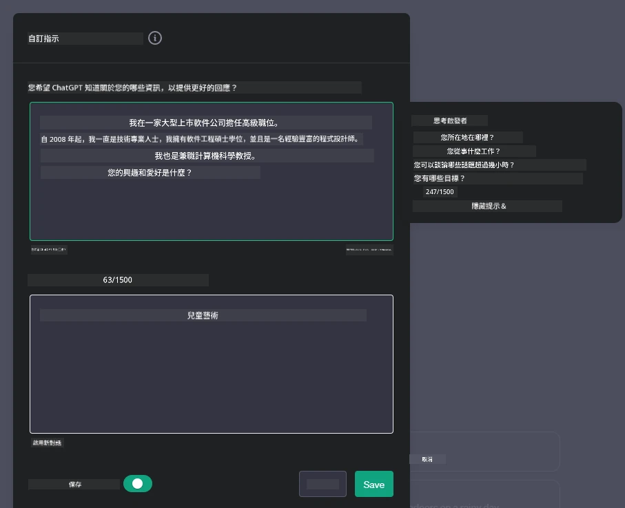
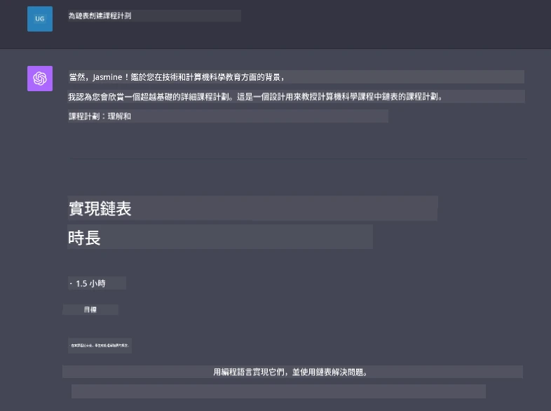

# 建立生成式 AI 驅動的聊天應用程式

[](https://youtu.be/R9V0ZY1BEQo?si=IHuU-fS9YWT8s4sA)

> _(點擊上方圖片觀看本課程影片)_

現在我們已經了解如何建立文字生成的應用程式，接下來讓我們來看看聊天應用程式。

聊天應用程式已融入我們的日常生活，不僅是閒聊的工具。它們是客服、技術支援，甚至是複雜諮詢系統的重要組成部分。你很可能不久前還使用過聊天應用程式獲得幫助。隨著我們將生成式 AI 等先進技術整合進這些平台，複雜度和挑戰也隨之增加。

我們需要回答的一些問題包括：

- <strong>建立應用程式</strong>。我們如何有效且無縫地建立並整合這些 AI 驅動的應用程式以針對特定使用情境？
- <strong>監控</strong>。部署後，我們如何監控並確保應用程式在功能和遵守[負責任 AI 六大原則](https://www.microsoft.com/ai/responsible-ai?WT.mc_id=academic-105485-koreyst)方面的最高品質？

隨著我們進入一個由自動化和人機無縫互動定義的時代，了解生成式 AI 如何改變聊天應用的範圍、深度與適應性變得至關重要。本課程將探討支援這些複雜系統的架構面向，深入說明如何針對特定領域任務進行微調方法，並評估確保負責任 AI 部署的指標與考量。

## 介紹

本課程涵蓋：

- 高效建立及整合聊天應用程式的技術。
- 如何對應用程式套用自訂化與微調。
- 有效監控聊天應用程式的策略與考量。

## 學習目標

在本課程結束時，你將能夠：

- 描述在既有系統中建立及整合聊天應用程式時的考量。
- 針對特定使用案例自訂聊天應用程式。
- 識別關鍵指標及考量以有效監控及維護 AI 驅動聊天應用的品質。
- 確保聊天應用程式負責任地運用 AI。

## 將生成式 AI 整合進聊天應用程式

利用生成式 AI 提升聊天應用程式不僅是為了讓其更智能，而是優化其架構、效能及使用者介面，以提供高品質的使用體驗。這涉及調查架構基礎、API 整合與使用者介面考量。本節旨在為你提供一條完整的路線圖，幫助你在將它們嵌入現有系統或建構獨立平台時，駕馭這些複雜領域。

本節結束時，你將具備有效構建及整合聊天應用程式的專業知識。

### 聊天機器人還是聊天應用程式？

在深入建立聊天應用程式之前，讓我們比較一下「聊天機器人」與「AI 驅動聊天應用程式」的差異，這兩者有不同的角色和功能。聊天機器人的主要目的是自動執行特定對話任務，如回答常見問題或追蹤包裹。它通常由基於規則的邏輯或複雜 AI 演算法控制。相比之下，AI 驅動的聊天應用程式是一個更廣泛的環境，旨在促進人與人之間多種數位通訊形式，比如文字、語音和影片聊天。其定義性特點是整合了一個能模擬細膩、人類般對話的生成式 AI 模型，根據多樣輸入和情境線索生成對話回應。生成式 AI 驅動的聊天應用程式能夠進行開放領域對話，適應持續演變的對話情境，甚至產生創意或複雜的對話。

下表列出主要差異與相似處，幫助我們理解它們在數位交流中的獨特角色。

| 聊天機器人                           | 生成式 AI 驅動的聊天應用程式                |
| ------------------------------------- | -------------------------------------- |
| 任務導向且基於規則                   | 情境感知                              |
| 通常整合於較大系統                   | 可包含一個或多個聊天機器人              |
| 限於預設功能                       | 採用生成式 AI 模型                    |
| 專門且結構化的互動                   | 能進行開放領域討論                    |

### 利用 SDK 和 API 的預建功能

建立聊天應用程式時，一個很好的起點是評估現有資源。利用 SDK 和 API 來建置聊天應用是具多重優勢的策略。整合完善文件的 SDK 和 API，可使你的應用程式在長期成功、擴展性和維護方面具備良好條件。

- <strong>加速開發過程並降低工作量</strong>：依賴預建功能，省去自行構建的昂貴過程，讓你能專注於應用程式中你認為更重要的部分，如商業邏輯。
- <strong>更佳效能</strong>：自行從頭構建功能時，終將面臨「如何擴展？應用程式能否應付瞬間大量用戶？」等問題。維護良好的 SDK 和 API 通常內建這些解決方案。
- <strong>更容易維護</strong>：更新與改進較易管理，大多數 API 和 SDK 僅需在新版本釋出時更新程式庫。
- <strong>取得尖端技術</strong>：利用經微調且以大量資料集訓練的模型為你的應用程式提供自然語言處理能力。

存取 SDK 或 API 功能通常涉及取得使用服務的許可，常透過唯一金鑰或驗證令牌。以下將用 OpenAI Python 函式庫示範這個流程。你也可以在本課程的 [OpenAI 筆記本](./python/oai-assignment.ipynb?WT.mc_id=academic-105485-koreyst) 或 [Azure OpenAI 服務筆記本](./python/aoai-assignment.ipynb?WT.mc_id=academic-105485-koreys) 嘗試。

```python
import os
from openai import OpenAI

API_KEY = os.getenv("OPENAI_API_KEY","")

client = OpenAI(
    api_key=API_KEY
    )

response = client.responses.create(model="gpt-4o-mini", input="Suggest two titles for an instructional lesson on chat applications for generative AI.", store=False)
print(response.output_text)
```

上述範例使用 GPT-4o mini 模型及 Responses API 來完成提示，但請注意必須先設定 API 金鑰，否則會報錯。

## 使用者體驗 (UX)

一般 UX 原則適用於聊天應用程式，不過下列因機器學習元件而特別重要的考量值得注意。

- <strong>處理模糊性的機制</strong>：生成式 AI 模型偶爾會產生模稜兩可的回答。提供使用者請求澄清的功能，在遇到此問題時相當有用。
- <strong>情境保留</strong>：進階生成式 AI 模型能記憶對話上下文，這對使用者體驗是重要資產。允許使用者控制和管理上下文可以提升體驗，但也帶來保留敏感資訊的風險。考量資料保存時間，例如訂定保留政策，能在保持上下文需要與隱私間取得平衡。
- <strong>個人化</strong>：由於 AI 模型具學習和適應能力，能為使用者提供個人化體驗。透過用戶檔案等功能打造個性化使用體驗，不僅讓使用者感到被理解，也有助於加速找到特定答案，創造更有效率且滿意的互動。

OpenAI ChatGPT 的「自訂指令」設定是個個人化例子，它允許你提供有關你自己的重要上下文資訊。以下是一個自訂指令範例。



這個「檔案」提示 ChatGPT 建立關於鏈結串列的課程計畫。注意 ChatGPT 會考慮該使用者希望基於她的經驗得到更深入的課程計畫。



### 微軟針對大型語言模型的系統訊息框架

[微軟提供了指導方針](https://learn.microsoft.com/azure/ai-services/openai/concepts/system-message#define-the-models-output-format?WT.mc_id=academic-105485-koreyst)，說明如何撰寫有效的系統訊息以生成 LLM 回應，分為四個方面：

1. 定義模型的目標對象、能力和限制。
2. 定義模型的輸出格式。
3. 提供顯示模型預期行為的具體範例。
4. 提供額外的行為護欄。

### 無障礙設計

無論使用者有視覺、聽覺、肢體或認知障礙，設計良好的聊天應用程式都應該能被所有人使用。以下清單列出針對提升不同障礙使用者無障礙性的特定功能。

- <strong>視覺障礙功能</strong>：高對比主題、可調整字體大小、螢幕閱讀器相容性。
- <strong>聽覺障礙功能</strong>：文字轉語音與語音轉文字功能、音訊通知的視覺提示。
- <strong>肢體障礙功能</strong>：鍵盤導航支援、語音指令。
- <strong>認知障礙功能</strong>：簡化語言選項。

## 針對特定領域語言模型的自訂與微調

想像一個能理解你的公司行話，並預測其使用者常見特定問題的聊天應用程式。有幾種方法值得一提：

- **利用 DSL 模型**。DSL 代表特定領域語言。你可以利用在特定領域訓練的 DSL 模型，理解該領域的概念和情境。
- <strong>套用微調</strong>。微調是進一步用特定資料訓練模型的過程。

## 自訂：使用 DSL

利用特定領域語言模型（DSL 模型）可透過提供專業且具情境關聯的互動，提升使用者參與度。這種模型是針對特定領域、產業或主題訓練或微調的。使用 DSL 模型的選項從從頭訓練到通過 SDK 和 API 使用現有模型不等。另一個選項是微調，指將現有預訓練模型調整為特定領域。

## 自訂：進行微調

當預訓練模型在專門領域或特定任務中表現不足時，通常會考慮微調。

例如，醫療查詢極其複雜且需大量情境。醫療專業人員診斷患者時會基於生活習慣、既往病史等多種因素，甚至可能仰賴最新醫學期刊來驗證診斷。在此類細膩情境下，通用 AI 聊天應用程式無法成為可靠來源。

### 情境範例：醫療應用程式

想像一個設計來協助醫療從業者，能迅速查詢治療指引、藥物相互作用或最新研究成果的聊天應用程式。

通用模型可能適合回答基本醫療問題或提供一般建議，但可能在以下情況遇到困難：

- <strong>高度特定或複雜案例</strong>。例如神經科醫師詢問：「目前治療兒童藥物抗性癲癇的最佳實踐為何？」
- <strong>缺乏最新進展</strong>。通用模型可能無法給出涵蓋神經學及藥理學最新進展的答覆。

在這些情況下，利用專業醫療數據集對模型進行微調，可大幅提升其處理複雜醫療查詢的準確性與可靠度。這需要取得大量且相關的數據集，代表需解決的領域特定問題與疑問。

## 高品質 AI 驅動聊天體驗的考量

本節列出「高品質」聊天應用程式的標準，包括可衡量的指標和負責任運用 AI 技術的框架。

### 關鍵指標

為維持應用程式的高品質性能，必須追蹤關鍵指標和考量。這些衡量不僅確保應用程式的功能，也評估 AI 模型與使用者體驗的品質。下列表涵蓋基礎指標、AI 指標及使用者體驗指標。

| 指標                          | 定義                                                                                                                 | 聊天應用開發者的考量                                              |
| ----------------------------- | -------------------------------------------------------------------------------------------------------------------- | ---------------------------------------------------------------- |
| <strong>正常運作時間</strong>               | 測量應用程式可供使用且運作的時間比例。                                                                              | 如何減少停機時間？                                                |
| <strong>回應時間</strong>                   | 應用程式回覆使用者查詢所需的時間。                                                                                  | 如何優化查詢處理以提升回應速度？                                |
| <strong>精確度</strong>                   | 真陽性預測占所有陽性預測的比例。                                                                                      | 如何驗證模型的精確度？                                            |
| **召回率（敏感度）**            | 真陽性預測占實際陽性數量的比例。                                                                                      | 如何衡量並改善召回率？                                            |
| **F1 分數**                    | 精確度和召回率的調和平均數，平衡兩者的權衡。                                                                          | 目標 F1 分數是多少？如何平衡精確度與召回率？                    |
| <strong>困惑度</strong>                   | 衡量模型所預測的機率分布與資料的實際分布相符程度。                                                                    | 如何降低困惑度？                                                  |
| <strong>使用者滿意度指標</strong>           | 測量使用者對應用程式的感知，通常透過調查收集。                                                                        | 多頻繁收集用戶反饋？如何根據回饋調整？                          |
| <strong>錯誤率</strong>                   | 模型在理解或輸出時的錯誤比例。                                                                                        | 有哪些策略可減少錯誤率？                                          |
| <strong>再訓練週期</strong>                 | 模型更新以加入新數據與見解的頻率。                                                                                    | 多頻繁進行再訓練？什麼情況觸發再訓練？                          |

| <strong>異常檢測</strong>               | 用於識別與預期行為不符的異常模式的工具和技術。                         | 你會如何回應異常？                                                      |

### 在聊天應用中實施負責任的 AI 實踐

微軟對負責任 AI 的方法確立了六項指導原則，應引導 AI 的開發和使用。以下是這些原則、其定義，以及聊天應用開發者應考慮的事項和為何應重視它們。

| 原則                   | 微軟定義                                              | 聊天開發者考慮事項                                                  | 為何重要                                                                              |
| ---------------------- | ----------------------------------------------------- | ------------------------------------------------------------------ | ------------------------------------------------------------------------------------ |
| 公平性                 | AI 系統應公平對待所有人。                              | 確保聊天應用不會基於用戶資料有歧視情況。                            | 建立用戶間的信任和包容；避免法律風險。                                            |
| 可靠性與安全           | AI 系統應可靠且安全執行。                              | 實施測試和保護措施以將錯誤和風險降至最低。                          | 確保用戶滿意並防止潛在傷害。                                                      |
| 隱私與安全             | AI 系統應安全並尊重隱私。                              | 實施強加密及資料保護措施。                                          | 保障敏感用戶資料並符合法律規範。                                                  |
| 包容性                 | AI 系統應賦能所有人並促進參與。                        | 設計可供多元族群輕鬆使用的 UI/UX。                                  | 確保更多人群能有效地使用應用。                                                    |
| 透明度                 | AI 系統應可被理解。                                    | 提供明確文件和 AI 回應的理據。                                      | 用戶能理解決策過程時，更容易信任系統。                                            |
| 責任制                 | 人員應對 AI 系統負責。                                | 建立明確審核和改進 AI 決策的流程。                                  | 促進持續改進及出錯時的糾正措施。                                                  |

## 作業

請參閱 [assignment](../../../07-building-chat-applications/python)。它將引導你完成一系列練習，從運行第一個聊天提示，到分類與摘要文本等。請注意作業有多種程式語言版本！

## 很棒的成果！繼續前進

完成本課程後，請參閱我們的 [Generative AI Learning collection](https://aka.ms/genai-collection?WT.mc_id=academic-105485-koreyst) 繼續提升你的生成式 AI 知識！

請前往第 8 課，了解如何開始[建構搜尋應用](../08-building-search-applications/README.md?WT.mc_id=academic-105485-koreyst)！

---

<!-- CO-OP TRANSLATOR DISCLAIMER START -->
**免責聲明**：
本文件使用 AI 翻譯服務 [Co-op Translator](https://github.com/Azure/co-op-translator) 進行翻譯。雖然我們力求準確，但請注意，自動翻譯可能包含錯誤或不準確之處。原始文件的母語版本應被視為權威來源。對於重要資訊，建議尋求專業人工翻譯。我們不對因使用本翻譯而引起的任何誤解或曲解承擔責任。
<!-- CO-OP TRANSLATOR DISCLAIMER END -->