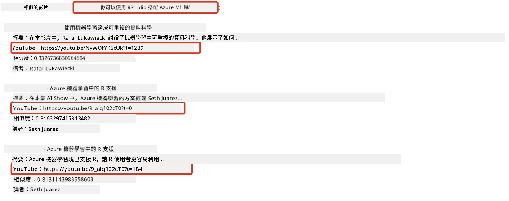
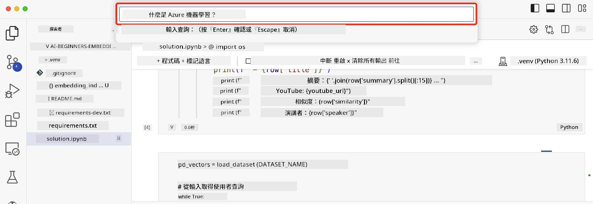

# 建立搜尋應用程式

[](https://youtu.be/W0-nzXjOjr0?si=GcsqiTTvd7RKbo7V)

> > _點擊上方圖片觀看本課程影片_

LLM 不只是聊天機器人和文字生成，還可以利用 Embeddings 建立搜尋應用程式。Embeddings 是資料的數值表示，也稱為向量，可用於資料的語意搜尋。

在本課程中，您將為我們的教育新創公司建立搜尋應用程式。該新創公司是一個非牟利組織，提供開發中國家學生免費教育。我們擁有大量 YouTube 影片，讓學生學習 AI。我們想建構一個搜尋應用程式，讓學生可以透過輸入問題搜尋 YouTube 影片。

例如，學生可能輸入「什麼是 Jupyter 筆記本？」或「什麼是 Azure ML」，搜尋應用程式會回傳與問題相關的 YouTube 影片清單，更棒的是，應用程式會回傳影片中答案所在位置的連結。

## 介紹

本課程內容包括：

- 語意搜尋與關鍵字搜尋的比較。
- 何謂文字 Embeddings。
- 建立文字 Embeddings 索引。
- 搜尋文字 Embeddings 索引。

## 學習目標

完成本課程後，您將能夠：

- 分辨語意搜尋與關鍵字搜尋的差異。
- 解釋什麼是文字 Embeddings。
- 使用 Embeddings 建立搜尋資料的應用程式。

## 為什麼要建立搜尋應用程式？

建立搜尋應用程式可幫助您了解如何使用 Embeddings 搜尋資料，也學會如何打造能讓學生快速找到資訊的搜尋工具。

本課程附有 Microsoft [AI Show](https://www.youtube.com/playlist?list=PLlrxD0HtieHi0mwteKBOfEeOYf0LJU4O1) YouTube 頻道的影片轉錄 Embedding 索引。AI Show 是一個教授 AI 與機器學習的 YouTube 頻道。Embedding 索引收錄截至 2023 年 10 月的各影片轉錄 Embeddings。您將使用此索引建置搜尋應用程式，該應用程式可以回傳影片中問題答案所在位置的連結，讓學生迅速找到所需資訊。

以下是針對問題「你可以在 Azure ML 中使用 RStudio 嗎？」的語意查詢範例。查看 YouTube 連結即可看到包含時間戳記的 URL，會直接帶您到影片中答案所在位置。



## 什麼是語意搜尋？

您可能會想知道，什麼是語意搜尋？語意搜尋是一種使用查詢中詞彙語意（意義）來回傳相關結果的搜尋技術。

這裡舉個語意搜尋的例子。假如您想買車，搜尋「我的夢想車」，語意搜尋會理解您不是在「夢想」一輛車，而是在尋找您「理想」的車。語意搜尋理解您的意圖並回傳相關結果；相對而言，「關鍵字搜尋」則會字面搜尋與「夢想」和「車」相關的內容，經常會出現不相關的結果。

## 什麼是文字 Embeddings？

[文字 Embeddings](https://en.wikipedia.org/wiki/Word_embedding?WT.mc_id=academic-105485-koreyst)是一種用於[自然語言處理](https://en.wikipedia.org/wiki/Natural_language_processing?WT.mc_id=academic-105485-koreyst)的文字表示技術。文字 Embeddings 是文字的語意數值表示。Embeddings 用來將資料表示成機器易於理解的形式。有許多模型可用以建構文字 Embeddings，本課程將專注於使用 OpenAI Embedding 模型產生 Embeddings。

舉例來說，假設下列文字來自 AI Show YouTube 頻道某集影片的轉錄：

```text
Today we are going to learn about Azure Machine Learning.
```

我們會把文字傳給 OpenAI Embedding API，API 回傳由 1536 個數字組成的 Embedding（即向量）。向量中的每個數字代表文字的不同面向。為簡潔起見，下方僅列出向量的前 10 個數字。

```python
[-0.006655829958617687, 0.0026128944009542465, 0.008792596869170666, -0.02446001023054123, -0.008540431968867779, 0.022071078419685364, -0.010703742504119873, 0.003311325330287218, -0.011632772162556648, -0.02187200076878071, ...]
```

## 如何建立 Embedding 索引？

本課程的 Embedding 索引是利用一連串 Python 腳本建立。腳本與說明可在本課程的 `scripts` 資料夾中的 [README](./scripts/README.md?WT.mc_id=academic-105485-koreyst) 找到。您無需執行這些腳本即可完成本課程，因為已提供 Embedding 索引。

腳本執行以下操作：

1. 下載 [AI Show](https://www.youtube.com/playlist?list=PLlrxD0HtieHi0mwteKBOfEeOYf0LJU4O1) 播放清單中每支 YouTube 影片的轉錄稿。
2. 使用 [OpenAI Functions](https://learn.microsoft.com/azure/ai-foundry/openai/how-to/function-calling?WT.mc_id=academic-105485-koreyst)嘗試從影片前 3 分鐘轉錄中擷取講者名稱。每支影片的講者名稱存於名為 `embedding_index_3m.json` 的 Embedding 索引中。
3. 轉錄文字切分為 **3 分鐘文字段落**。段落間會重疊約 20 個字，以確保向量不被截斷並提供更佳搜尋上下文。
4. 將每個文字段落傳給 OpenAI Chat API，摘要文字精簡為 60 字。摘要結果也存入 Embedding 索引 `embedding_index_3m.json`。
5. 最後將段落文字傳給 OpenAI Embedding API，API 回傳 1536 維向量，表徵該段落的語意。段落與 Embedding 向量存於 `embedding_index_3m.json` 索引中。

### 向量資料庫

為簡化教學，Embedding 索引存於名為 `embedding_index_3m.json` 的 JSON 檔案，並載入 Pandas DataFrame。生產環境中，Embedding 索引通常儲存在向量資料庫，如 [Azure Cognitive Search](https://learn.microsoft.com/training/modules/improve-search-results-vector-search?WT.mc_id=academic-105485-koreyst)、[Redis](https://cookbook.openai.com/examples/vector_databases/redis/readme?WT.mc_id=academic-105485-koreyst)、[Pinecone](https://cookbook.openai.com/examples/vector_databases/pinecone/readme?WT.mc_id=academic-105485-koreyst)、[Weaviate](https://cookbook.openai.com/examples/vector_databases/weaviate/readme?WT.mc_id=academic-105485-koreyst) 等等。

## 了解余弦相似度

了解文字 Embeddings 後，接著將學習如何使用 Embeddings 搜尋資料，尤其是利用余弦相似度尋找與查詢最相似的 Embeddings。

### 什麼是余弦相似度？

余弦相似度是衡量兩個向量相似度的方法，有時稱為「最近鄰搜尋」。執行余弦相似度搜尋時，需使用 OpenAI Embedding API 將查詢文字「向量化」，然後計算查詢向量與 Embedding 索引中每個向量的余弦相似度。索引中每個向量代表一個 YouTube 轉錄文字段落。最後依余弦相似度排序，得分最高的文字段落即最相似於查詢。

從數學角度看，余弦相似度量測多維空間中兩向量間夾角的餘弦。此量測有助於克服大小導致歐氏距離偏大的問題，即使兩文件因大小相差大而歐氏距離遠，但若夾角較小則余弦相似度高。更多詳情請參考[余弦相似度](https://en.wikipedia.org/wiki/Cosine_similarity?WT.mc_id=academic-105485-koreyst)。

## 建立您的第一個搜尋應用程式

接下來我們將學習如何使用 Embeddings 建立搜尋應用程式。該應用程式允許學生輸入問題搜尋影片，並回傳與問題相關的影片清單，還會提供影片中答案的連結位置。

此方案已在 Windows 11、macOS 和 Ubuntu 22.04 上以 Python 3.10 或以上版本開發測試。您可從 [python.org](https://www.python.org/downloads/?WT.mc_id=academic-105485-koreyst) 下載 Python。

## 作業 - 建立搜尋應用程式，方便學生使用

我們在課程開頭介紹了新創公司，現在該讓學生動手建立搜尋應用程式以完成評估任務。

本作業中，您將建立用於搜尋應用程式的 Azure OpenAI 服務。您需要建立以下 Azure OpenAI 服務，並需有 Azure 訂閱才能完成作業。

### 啟動 Azure 雲端 Shell

1. 登入 [Azure 入口網站](https://portal.azure.com/?WT.mc_id=academic-105485-koreyst)。
2. 點選 Azure 入口網站右上角的 Cloud Shell 圖示。
3. 選擇 **Bash** 作為執行環境。

#### 建立資源群組

> 本說明使用位於 East US 的名為 "semantic-video-search" 的資源群組。
> 您可更改資源群組名稱，但更改資源位置時，
> 請查閱 [模型可用性表](https://aka.ms/oai/models?WT.mc_id=academic-105485-koreyst)。

```shell
az group create --name semantic-video-search --location eastus
```

#### 建立 Azure OpenAI 服務資源

在 Azure Cloud Shell 執行下列指令，以建立 Azure OpenAI 服務資源。

```shell
az cognitiveservices account create --name semantic-video-openai --resource-group semantic-video-search \
    --location eastus --kind OpenAI --sku s0
```

#### 取得本應用程式使用的端點與金鑰

在 Azure Cloud Shell 執行下列指令，取得 Azure OpenAI 服務資源的端點與金鑰。

```shell
az cognitiveservices account show --name semantic-video-openai \
   --resource-group  semantic-video-search | jq -r .properties.endpoint
az cognitiveservices account keys list --name semantic-video-openai \
   --resource-group semantic-video-search | jq -r .key1
```

#### 部署 OpenAI Embedding 模型

在 Azure Cloud Shell 執行下列指令，部署 OpenAI Embedding 模型。

```shell
az cognitiveservices account deployment create \
    --name semantic-video-openai \
    --resource-group  semantic-video-search \
    --deployment-name text-embedding-ada-002 \
    --model-name text-embedding-ada-002 \
    --model-version "2"  \
    --model-format OpenAI \
    --sku-capacity 100 --sku-name "Standard"
```

## 解決方案

打開 GitHub Codespaces 中的 [解決方案筆記本](./python/aoai-solution.ipynb?WT.mc_id=academic-105485-koreyst)，並依照 Jupyter 筆記本指示操作。

執行筆記本時，系統會提示您輸入查詢，輸入框如下所示：



## 做得好！繼續學習

完成本課程後，請查閱我們的[生成式 AI 學習合輯](https://aka.ms/genai-collection?WT.mc_id=academic-105485-koreyst)，繼續提升您的生成式 AI 知識！

接著前往第九課，我們將介紹如何[建立影像生成應用程式](../09-building-image-applications/README.md?WT.mc_id=academic-105485-koreyst)！

---

<!-- CO-OP TRANSLATOR DISCLAIMER START -->
**免責聲明**：
本文件使用 AI 翻譯服務 [Co-op Translator](https://github.com/Azure/co-op-translator) 進行翻譯。雖然我們力求準確，但請注意，自動翻譯可能包含錯誤或不準確之處。原始文件的母語版本應被視為權威來源。對於重要資訊，建議尋求專業人工翻譯。我們不對因使用本翻譯而引起的任何誤解或曲解承擔責任。
<!-- CO-OP TRANSLATOR DISCLAIMER END -->