# 建立低代碼 AI 應用程式

> _(點擊上方圖片觀看本課程影片)_

## 介紹

現在我們已經學會如何建立圖片生成應用程式，讓我們來談談低代碼。生成式 AI 可用於多個不同領域，包括低代碼，但何謂低代碼，以及我們如何將 AI 加入其中？

透過低代碼開發平台，傳統開發者與非開發者建立應用程式與解決方案變得更簡單。低代碼開發平台讓您幾乎不需撰寫程式碼即可建立應用程式與解決方案。這是透過提供視覺化開發環境實現的，允許您拖放組件來建立應用程式與解決方案。這使您能更快且用更少資源建立應用程式和方案。在本課程中，我們將深入了解如何使用低代碼，以及如何利用 Power Platform 中的 AI 來增強低代碼開發。

Power Platform 為各組織提供機會，使其團隊能透過直觀的低代碼或無代碼環境構建自己的解決方案。此環境有助於簡化建立解決方案的流程。利用 Power Platform，解決方案可在數天或數週內完成，而非數月或數年。Power Platform 包含五大關鍵產品：Power Apps、Power Automate、Power BI、Power Pages 與 Copilot Studio。

本課程涵蓋：

- Power Platform 中的生成式 AI 介紹
- Copilot 介紹及如何使用
- 使用生成式 AI 建立 Power Platform 中的應用程式與流程
- 透過 AI Builder 理解 Power Platform 中的 AI 模型
- 使用 Microsoft Copilot Studio 建立智能代理人

## 學習目標

本課程結束後，您將能：

- 了解 Copilot 在 Power Platform 中的運作方式。

- 為我們的教育初創公司建立學生作業追蹤器應用程式。

- 建立使用 AI 從發票中擷取信息的發票處理流程。

- 在使用 GPT 的 Create Text AI 模型時應用最佳實務。

- 了解 Microsoft Copilot Studio 是甚麼及如何利用它建立智能代理人。

本課程中您將使用的工具與技術：

- **Power Apps**，用於建立學生作業追蹤器應用程式，提供低代碼開發環境以建立可追蹤、管理並與資料互動的應用程式。

- **Dataverse**，用於存儲學生作業追蹤器應用程式的資料，Dataverse 提供低代碼數據平台用以儲存應用程式的數據。

- **Power Automate**，用於建立發票處理工作流程，提供低代碼開發環境以建立自動化發票處理流程。

- **AI Builder**，用於發票處理 AI 模型，您將使用預建 AI 模型來處理我們初創公司的發票。

## Power Platform 中的生成式 AI

利用生成式 AI 強化低代碼開發及應用是 Power Platform 的重點方向。目標是讓每個人都能建立 AI 驅動的應用程式、網站、儀表板，並利用 AI 自動化流程，_無需任何數據科學專業知識_。此目標透過將生成式 AI 以 Copilot 與 AI Builder 形式整合進 Power Platform 的低代碼開發體驗中來實現。

### 這是如何運作的？

Copilot 是一個 AI 助理，讓您透過一系列自然語言的對話步驟描述需求，即可建立 Power Platform 解決方案。例如，您可以指示 AI 助理說明應用程式將使用的欄位，它將建立應用與底層的數據模型，或您可以指定如何在 Power Automate 中設置流程。

您可以在應用畫面中使用 Copilot 功能作為特色，讓使用者透過對話互動發掘見解。

AI Builder 是 Power Platform 提供的低代碼 AI 能力，幫助您利用 AI 模型自動化流程和預測結果。透過 AI Builder，您可以將 AI 加入連接到 Dataverse 或其他雲端資料來源（如 SharePoint、OneDrive 或 Azure）的應用和流程中。

Copilot 在 Power Platform 所有產品中皆可使用：Power Apps、Power Automate、Power BI、Power Pages 與 Copilot Studio（前身為 Power Virtual Agents）。AI Builder 則在 Power Apps 與 Power Automate 中提供。本課程將專注於如何在 Power Apps 與 Power Automate 中使用 Copilot 和 AI Builder，為我們的教育初創公司建立解決方案。

### Power Apps 中的 Copilot

作為 Power Platform 的一部分，Power Apps 提供低代碼開發環境，用於建立追蹤、管理及與資料互動的應用程式。它是一套結合可擴展數據平台與能連接雲端服務及本機數據的應用開發服務。Power Apps 讓您能建立在瀏覽器、平板和手機上執行，並可與同事共享的應用。Power Apps 透過簡易界面幫助用戶進入應用開發，使每個商業用戶或專業開發者都能建立自訂應用。應用開發體驗還因 Copilot 的生成式 AI 而提升。

Power Apps 中的 Copilot AI 助理功能讓您描述需要什麼樣的應用以及想要追蹤、蒐集或顯示哪些資訊。Copilot 接著根據您的描述產生響應式 Canvas 應用，您可隨後自訂應用以符合需求。AI Copilot 也會生成並建議包含所需儲存欄位和部分範例數據的 Dataverse 表格。本課程稍後將介紹 Dataverse 是什麼以及如何在 Power Apps 中使用它。您也可透過對話步驟，使用 AI Copilot 助理功能自訂該表格。此功能可直接從 Power Apps 主頁面啟用。

### Power Automate 中的 Copilot

作為 Power Platform 的一部分，Power Automate 讓使用者建立應用程式與服務之間的自動化工作流程。它協助自動化重複的商務流程，如通信、數據收集和決策核准。其簡易界面讓技術水平各異的使用者（從初學者到資深開發者）皆可自動化工作任務。工作流程開發體驗也因 Copilot 的生成式 AI 而加強。

Power Automate 中的 Copilot AI 助理功能讓您描述需要什麼樣的流程以及希望流程執行哪些動作。Copilot 接著根據您的描述建立流程，您可隨後自訂流程以符合需求。AI Copilot 也會生成並建議完成您想自動化任務所需的動作。本課程稍後將介紹流程是什麼以及如何在 Power Automate 中使用流程。您也可透過對話步驟，使用 AI Copilot 助理功能自訂這些動作。此功能可直接從 Power Automate 主頁面啟用。

## 使用 Microsoft Copilot Studio 建立智能代理人

[Microsoft Copilot Studio](https://learn.microsoft.com/microsoft-copilot-studio/fundamentals-what-is-copilot-studio?WT.mc_id=academic-105485-koreyst)（前身為 Power Virtual Agents）是 Power Platform 中的低代碼成員，用於建立<strong>AI 代理人</strong>——能夠回答問題、執行動作和代使用者自動化任務的對話副駕駛。與 Power Platform 其他部分一樣，您在視覺化、以自然語言為核心的體驗中建立這些代理人：您描述想讓代理人執行的工作，Copilot Studio 則協助搭建指令、知識與動作。

對於我們的教育初創公司，您可以建立一個代理人來回答學生關於課程的問題，查核作業截止日期，甚至幫助發電郵給教師——全程無需撰寫程式碼。

以下是使 Copilot Studio 強大的部分最新功能：

- <strong>從您的知識中生成答案</strong>。您無須手工撰寫每段對話，可以連接<strong>知識來源</strong>——公開網站、SharePoint、OneDrive、Dataverse、上傳文件，或透過連接器使用企業資料——代理人將從中生成有根據的答案。

- <strong>生成式編排</strong>。代理人不依賴僵硬的觸發語句，而是使用 AI 理解請求並動態決定結合哪些知識、主題和動作來完成，甚至連結多個步驟。

- <strong>動作與連接器</strong>。代理人不僅是聊天。您可以讓代理人執行動作，這些動作由 1,500 多個預建 Power Platform 連接器、Power Automate 流程、自訂 REST API、提示詞，或<strong>模型上下文協定 (MCP)</strong> 伺服器支援。

- <strong>自主代理人</strong>。代理人不限於回應聊天視窗。您可以建立<strong>自主代理人</strong>，由事件觸發，例如新郵件、Dataverse 新筆記錄或文件上傳，然後在背景執行任務。

- <strong>多代理人編排</strong>。代理人可以呼叫其他代理人。Copilot Studio 代理人可交付給或由其他代理人擴展，包括發佈至 Microsoft 365 Copilot 的代理人和在 Microsoft Foundry 建立的代理人。

- <strong>模型選擇</strong>。除內建模型外，您還可帶入 Microsoft Foundry 模型目錄中的模型，自訂代理人的推理與回應方式。

- <strong>多通路發佈</strong>。建立完成後，代理人能發佈至多個通道——Microsoft Teams、Microsoft 365 Copilot、網站或自訂應用等，且安全認證與分析皆透過 Power Platform 管理經驗管理。

您可在 [copilotstudio.microsoft.com](https://copilotstudio.microsoft.com?WT.mc_id=academic-105485-koreyst) 開始建立您的第一個代理人，並在 [Microsoft Copilot Studio 文件](https://learn.microsoft.com/microsoft-copilot-studio/?WT.mc_id=academic-105485-koreyst) 了解更多。

## 作業：使用 Copilot 管理我們初創公司的學生作業與發票

我們的初創公司為學生提供網上課程。公司迅速成長，目前難以應付旺盛的課程需求。公司聘請您作為 Power Platform 開發者，協助他們建立低代碼解決方案，幫助管理學生作業與發票。他們的解決方案應能透過應用程式追蹤與管理學生作業，並透過工作流程自動處理發票。他們要求您使用生成式 AI 來開發此解決方案。

開始使用 Copilot 時，您可以利用 [Power Platform Copilot Prompt Library](https://github.com/pnp/powerplatform-prompts?WT.mc_id=academic-109639-somelezediko) 來快速上手。此庫包含可用於使用 Copilot 建立應用與流程的提示語列表，您也可以用庫中的提示語了解如何向 Copilot 描述需求。

### 為我們的初創公司建立學生作業追蹤器應用程式

我們的教育人員一直難以追蹤學生作業。他們之前使用試算表來追蹤作業，但隨著學生人數增加，管理上變得困難。他們要求您建立一個應用程式以幫助他們追蹤及管理學生作業。該應用程式應允許新增作業、查看作業、更新作業及刪除作業。還應允許教育人員及學生查看已評分及未評分的作業。

您將依照以下步驟使用 Power Apps 中的 Copilot 建立此應用程式：

1. 前往 [Power Apps](https://make.powerapps.com?WT.mc_id=academic-105485-koreyst) 首頁。

1. 使用首頁上的文字區域描述您想建立的應用程式。例如，**_我要建立一個用來追蹤與管理學生作業的應用程式_**。點擊 <strong>送出</strong> 按鈕以將提示發送給 AI Copilot。

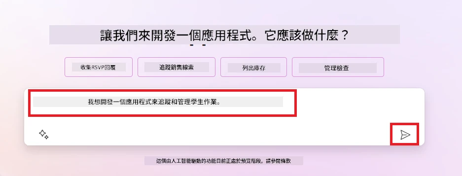

1. AI Copilot 將建議一個 Dataverse 表格，其中包含您追蹤所需數據的欄位和一些範例數據。您可透過對話步驟，使用 AI Copilot 助理功能自訂該表格以符合需求。

   > <strong>重要提示</strong>：Dataverse 是 Power Platform 的底層數據平台。它是一個低代碼數據平台，用於儲存應用程式的數據。它是完全託管的服務，在 Microsoft 雲端安全儲存數據，並在您的 Power Platform 環境中配置。具備內建的數據治理功能，如數據分類、數據血統、細粒度存取控制等。您可在此處了解更多關於 Dataverse 的資訊：[這裡](https://docs.microsoft.com/powerapps/maker/data-platform/data-platform-intro?WT.mc_id=academic-109639-somelezediko)。

   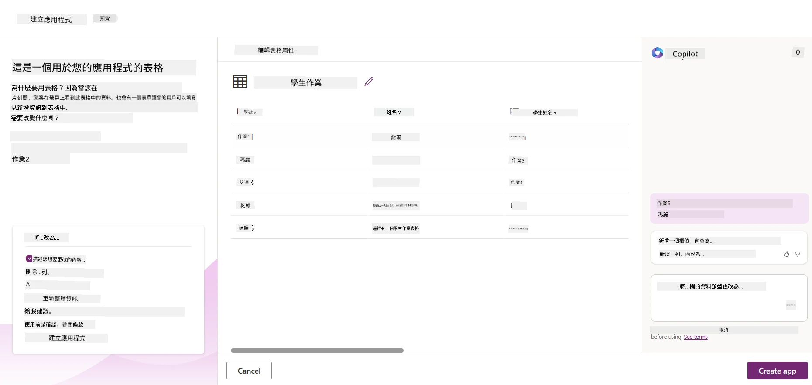

1. 教育人員想給已提交作業的學生發送電郵，以便通知他們作業進度。您可以使用 Copilot 向表格添加新欄位以儲存學生電郵。例如，您可以使用以下提示新增欄位：**_我要新增一個用來儲存學生電郵的欄位_**。點擊 <strong>送出</strong> 按鈕將提示發送給 AI Copilot。

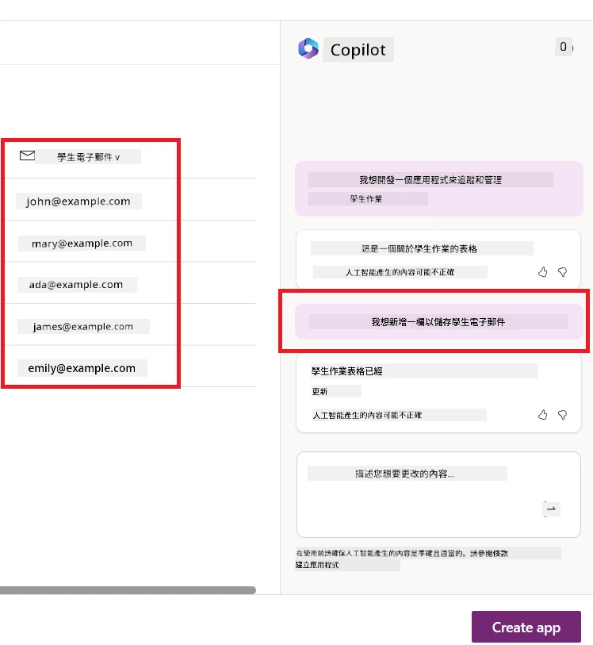

1. AI Copilot 將生成新欄位，您可隨後自訂該欄位以符合需求。

1. 完成表格後，點擊 **Create app** 按鈕以建立應用程式。

1. AI 助理將根據您的描述生成一個響應式 Canvas 應用程式，然後您可以自訂該應用程式以符合您的需求。

1. 教育工作者若想發送電子郵件給學生，您可以使用 Copilot 為應用程式新增一個畫面。例如，您可以使用以下提示來新增一個畫面：**_我想新增一個畫面以發送電子郵件給學生_**。點擊 **Send** 按鈕將提示發送到 AI 助理。

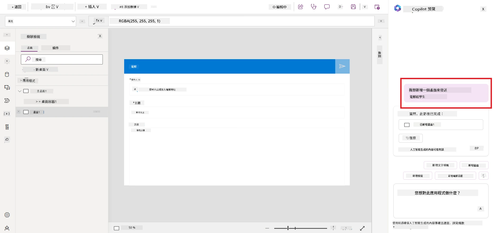

1. AI 助理會生成一個新畫面，然後您可以依需求自訂該畫面。

1. 完成應用程式後，點擊 **Save** 按鈕以保存應用程式。

1. 若要與教育工作者分享應用程式，點擊 **Share** 按鈕，然後再次點擊 **Share** 按鈕。您可以通過輸入其電子郵件地址來分享應用程式。

> <strong>您的作業</strong>：您剛建立的應用程式是一個很好的開始，但還可以改進。使用電子郵件功能時，教育工作者只能手動輸入學生的電子郵件地址來發送郵件。您能否使用 Copilot 建立一個自動化流程，讓教育工作者能夠在學生提交作業時自動發送電子郵件？提示：您可以使用正確的提示詞在 Power Automate 中使用 Copilot 建立這個功能。

### 為我們的初創公司建立發票資訊表

我們初創公司的財務團隊一直在努力追蹤發票。他們使用試算表來追蹤發票，但隨著發票數量增加，管理變得困難。他們請您建立一個表格，幫助他們儲存、追蹤和管理已收到的發票資訊。該表將用於建立一個自動化流程，從發票中提取所有資訊並儲存到表格中。此表也應讓財務團隊能查看已付款與未付款的發票。

Power Platform 擁有一個基礎數據平台稱為 Dataverse，能讓您為您的應用程式和解決方案儲存資料。Dataverse 提供低程式碼資料平台，能存放應用的資料。它是一項全管理服務，安全地將資料儲存在 Microsoft 雲端中，並在您的 Power Platform 環境中配置。它附帶內建的資料治理功能，如資料分類、資料來源追蹤、細粒度存取控制等。您可以在[此處了解更多關於 Dataverse 的資訊](https://docs.microsoft.com/powerapps/maker/data-platform/data-platform-intro?WT.mc_id=academic-109639-somelezediko)。

為什麼我們的初創公司應該使用 Dataverse？Dataverse 內的標準和自訂表格提供了安全的雲端存儲選項。表格讓您儲存不同類型的資料，類似您在單一 Excel 活頁簿中使用多個工作表。您可以使用表格來存放組織或業務需求特定的資料。我們的初創公司使用 Dataverse 可享有的好處包括（但不限於）：

- <strong>易於管理</strong>：元資料和資料皆存放於雲端，無需擔心它們如何存放與管理。您可以專注於建立應用和解決方案。

- <strong>安全</strong>：Dataverse 提供安全且雲端的資料存儲選項。您可以使用基於角色的安全性，控制誰可存取資料及存取方式。

- <strong>豐富的元資料</strong>：資料類型和關聯可直接在 Power Apps 內使用。

- <strong>邏輯與驗證</strong>：您可使用商業規則、計算欄位和驗證規則來強制執行業務邏輯及維持資料準確性。

現在您已瞭解 Dataverse 是什麼以及為何使用它，讓我們來看看如何使用 Copilot 在 Dataverse 中建立一個表格，以滿足財務團隊的需求。

> <strong>注意</strong> ：您將在下一節使用此表格，建立一個自動化流程，從發票提取所有資訊並儲存至表格中。

使用 Copilot 在 Dataverse 建立表格，請按照以下步驟：

1. 前往 [Power Apps](https://make.powerapps.com?WT.mc_id=academic-105485-koreyst) 主頁面。

2. 在左側導航欄，選擇 **Tables**，然後點擊 **Describe the new Table**。

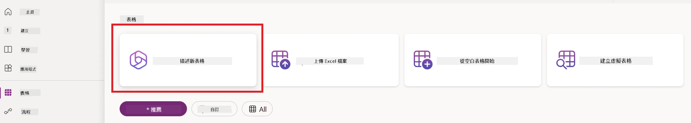

1. 在 **Describe the new Table** 頁面中，使用文字區描述您想建立的表格。例如，**_我想建立一個用於存放發票資訊的表格_**。點擊 **Send** 按鈕將提示發送給 AI 助理。

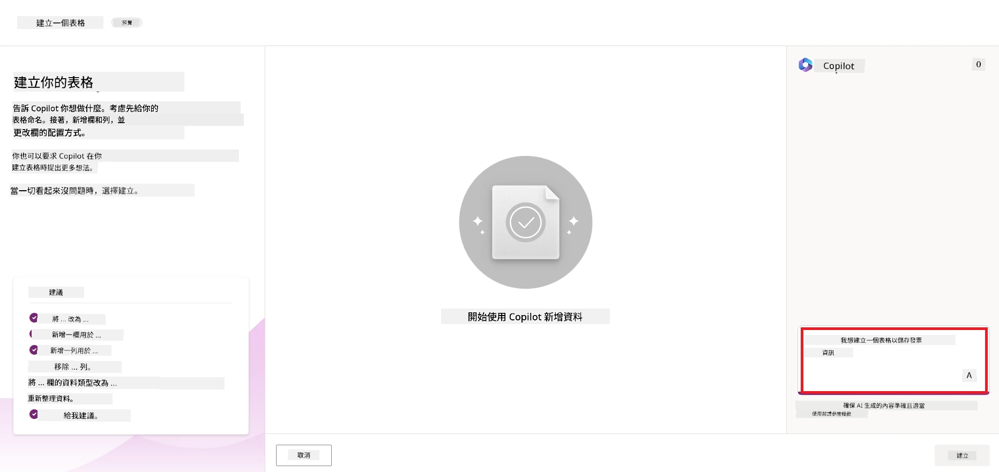

1. AI 助理會建議一個 Dataverse 表格，其中包含您需要的欄位和一些範例資料。您可以透過對話方式使用 AI 助理功能來進一步自訂表格，讓它符合您的需求。

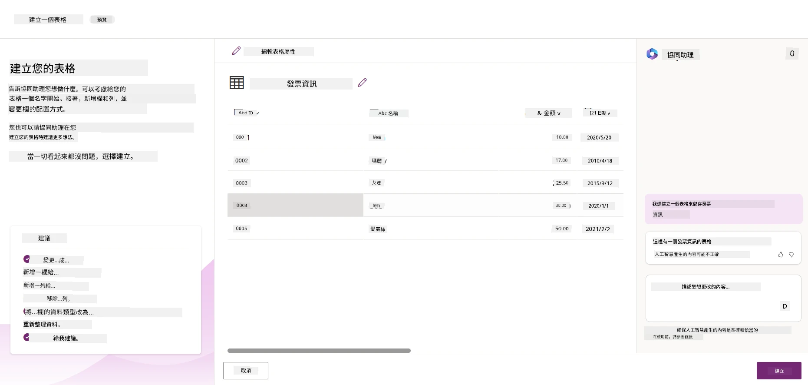

1. 財務團隊想發送電子郵件給供應商，更新他們發票的現況。您可以使用 Copilot 為表格新增一個欄位來儲存供應商的電子郵件。例如，您可以使用以下提示新增一個欄位：**_我想新增一個欄以儲存供應商電子郵件_**。點擊 **Send** 按鈕將提示發送給 AI 助理。

1. AI 助理會生成一個新欄位，然後您可以自訂這個欄位以符合您的需求。

1. 完成表格後，點擊 **Create** 按鈕以建立表格。

## Power Platform 中搭配 AI Builder 的 AI 模型

AI Builder 是 Power Platform 中的低程式碼 AI 功能，可讓您使用 AI 模型來協助自動化流程並預測結果。使用 AI Builder，您可以將 AI 技術整合進連結 Dataverse 或其他雲端資料來源（如 SharePoint、OneDrive 或 Azure）資料的應用程式和流程中。

## 預建 AI 模型 vs 自訂 AI 模型

AI Builder 提供兩種類型的 AI 模型：預建 AI 模型和自訂 AI 模型。預建 AI 模型是由微軟訓練並在 Power Platform 中即可使用的現成模型，幫助您無需自行收集資料，也無需建立、訓練和發布自己的模型，就能為應用程式和流程增加智慧功能。您可以使用這些模型來自動化流程及預測結果。

Power Platform 提供的一些預建 AI 模型包括：

- <strong>關鍵短語擷取</strong>：從文字中擷取關鍵短語。
- <strong>語言偵測</strong>：偵測文字所使用的語言。
- <strong>情感分析</strong>：辨識文字的正面、負面、中性或混合情感。
- <strong>名片讀取</strong>：從名片中擷取資訊。
- <strong>文字辨識</strong>：從影像中擷取文字。
- <strong>物件偵測</strong>：偵測並擷取影像中的物件。
- <strong>文件處理</strong>：從表單中擷取資訊。
- <strong>發票處理</strong>：從發票中擷取資訊。

使用自訂 AI 模型，您可以將自己的模型引入 AI Builder，使其像任何 AI Builder 自訂模型一樣運作，允許您使用自己的資料來訓練模型。您可以在 Power Apps 和 Power Automate 中使用這些模型，自動化流程並預測結果。當使用自己的模型時，會有一些限制。更多資訊請參閱這裡的[限制說明](https://learn.microsoft.com/ai-builder/byo-model#limitations?WT.mc_id=academic-105485-koreyst)。

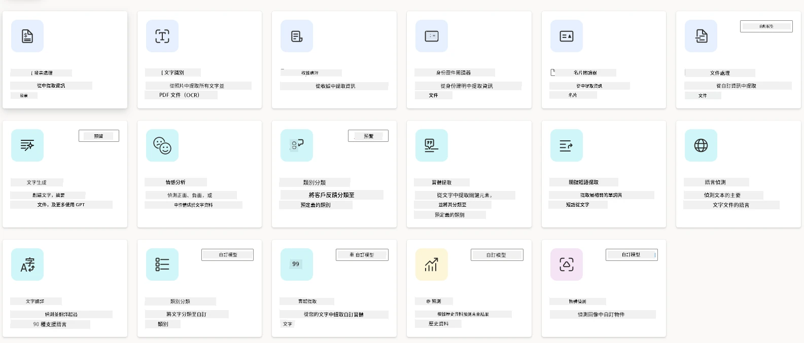

## 作業 #2 - 為我們的初創公司建立發票處理流程

財務團隊一直在努力處理發票。他們使用試算表來追蹤發票，但隨著發票數量增加，管理變得困難。他們請您建立一個流程，使用 AI 協助處理發票。此流程應能從發票中提取資訊並將其儲存在 Dataverse 表格中，也應能將提取的資訊以電郵方式發送給財務團隊。

現在您已瞭解 AI Builder 是什麼及為何使用它，讓我們來看看如何使用之前介紹過的 AI Builder 發票處理模型來建立一個流程，幫助財務團隊處理發票。

若要建立幫助財務團隊處理發票的流程，請依照下列步驟使用 AI Builder 中的發票處理 AI 模型：

1. 前往 [Power Automate](https://make.powerautomate.com?WT.mc_id=academic-105485-koreyst) 主頁面。

2. 在主頁面的文字區描述您想建立的流程。例如，**_當我的郵箱收到發票時，處理該發票_**。點擊 **Send** 按鈕將提示發送給 AI 助理。

   

3. AI 助理將建議完成您想自動化任務所需的動作。您可以點選 **Next** 按鈕繼續後續步驟。

4. 下一步，Power Automate 將提示您設定流程所需的連接。完成後，點選 **Create flow** 建立流程。

5. AI 助理會生成一個流程，您可以隨後自訂該流程以符合需求。

6. 更新流程占用的觸發器，將 **Folder** 設定至存放發票的資料夾。例如，設定成 **Inbox**。點選 **Show advanced options** 並將 **Only with Attachments** 設為 **Yes**，確保流程只在收取含附件的郵件時執行。

7. 從流程中移除下列動作：**HTML to text**、**Compose**、**Compose 2**、**Compose 3** 及 **Compose 4**，因為您不會使用它們。

8. 移除流程中的 **Condition** 動作，因為您不會使用它。流程應看起來如下截圖：

   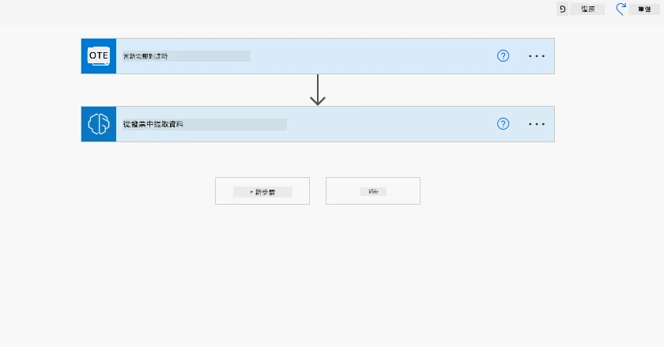

9. 點擊 **Add an action** 按鈕並搜尋 **Dataverse**，選擇 **Add a new row** 動作。

10. 在 **Extract Information from invoices** 動作中，將 **Invoice File** 更新為指向郵件的 **Attachment Content**，確保流程可從發票附件中提取資訊。

11. 選擇您先前建立的 **Table**。例如選擇 **Invoice Information** 表格。從先前的動作中選擇動態內容填充以下欄位：

    - ID
    - Amount
    - Date
    - Name
    - Status - 將 **Status** 設為 **Pending**。
    - Supplier Email - 使用 **When a new email arrives** 觸發器中的 **From** 動態內容。

    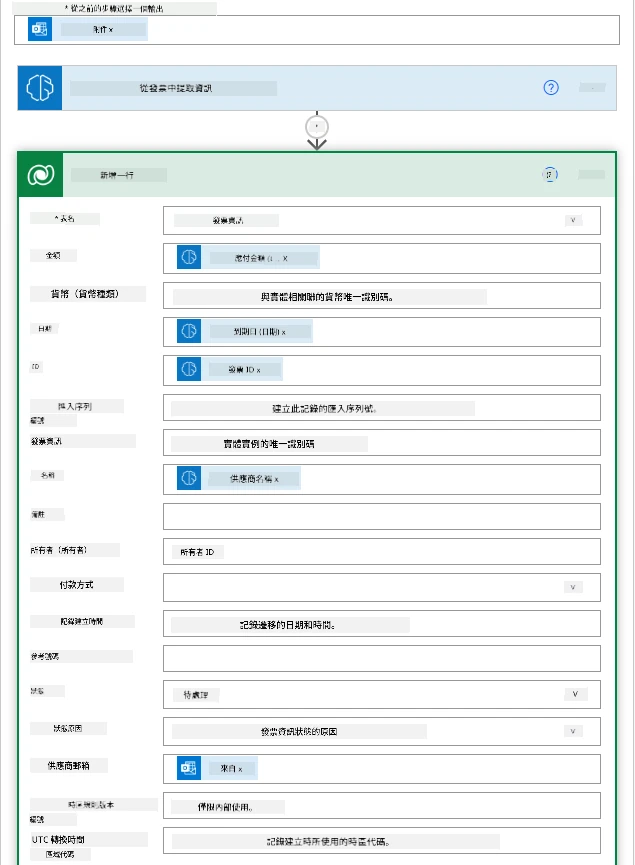

12. 完成流程後，點擊 **Save** 按鈕保存流程。您可以透過向觸發器所指定的資料夾發送包含發票的郵件來測試此流程。

> <strong>您的作業</strong>：您剛建立的流程是一個良好開端，現在請思考如何建立一個自動化流程，讓財務團隊能在發票狀態更新時自動發送電子郵件給供應商，通知其發票的最新狀態。提示：流程必須在發票狀態變更時執行。

## 在 Power Automate 中使用文字生成 AI 模型

AI Builder 中的 Create Text with GPT AI 模型能根據提示生成文字，並由 Microsoft Azure OpenAI 服務驅動。借助此功能，您可以將 GPT（生成式預訓練轉換器）技術融入應用程式和流程，打造多種自動化流程和智能應用。

GPT 模型透過大量資料訓練，使它們能根據輸入提示產生近似於人類語言的文字。與流程自動化結合時，像 GPT 這樣的 AI 模型能被用來簡化並自動化各種任務。

例如，您可以建立流程自動生成各種用途的文字，如電子郵件草稿、產品描述等。您也可以使用此模型為不同應用產生文字，如聊天機器人與客服應用，幫助客服人員有效且高效回應客戶查詢。

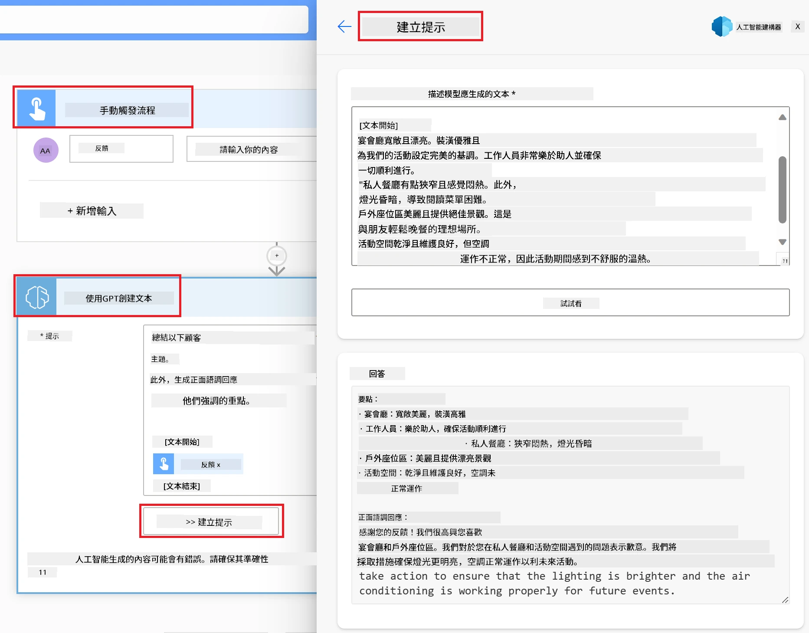

如欲了解如何在 Power Automate 中使用此 AI 模型，請瀏覽 [使用 AI Builder 和 GPT 增強智能](https://learn.microsoft.com/training/modules/ai-builder-text-generation/?WT.mc_id=academic-109639-somelezediko) 模組。

## 做得好！繼續學習

完成本課後，請查看我們的 [生成式 AI 學習合集](https://aka.ms/genai-collection?WT.mc_id=academic-105485-koreyst)，繼續提升您的生成式 AI 知識！

想自訂並充分利用 Copilot 嗎？探索 [Awesome Copilot](https://github.com/github/awesome-copilot?WT.mc_id=academic-105485-koreyst) — 這是一個由社群貢獻的指令、代理人、技能及配置合集，幫助您最大化 GitHub Copilot 的效用。

前往第 11 課，我們將探討如何 [將生成式 AI 與 Function Calling 整合](../11-integrating-with-function-calling/README.md?WT.mc_id=academic-105485-koreyst)！

---

<!-- CO-OP TRANSLATOR DISCLAIMER START -->
**免責聲明**：
本文件使用 AI 翻譯服務 [Co-op Translator](https://github.com/Azure/co-op-translator) 進行翻譯。雖然我們力求準確，但請注意，自動翻譯可能包含錯誤或不準確之處。原始文件的母語版本應被視為權威來源。對於重要資訊，建議尋求專業人工翻譯。我們不對因使用本翻譯而引起的任何誤解或曲解承擔責任。
<!-- CO-OP TRANSLATOR DISCLAIMER END -->