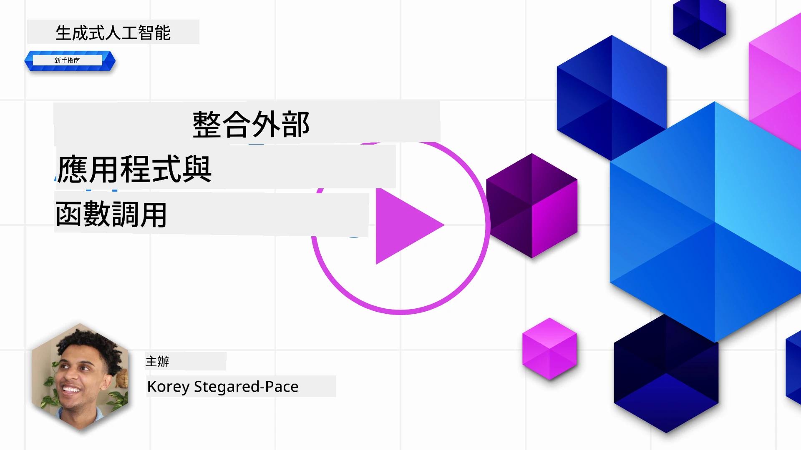
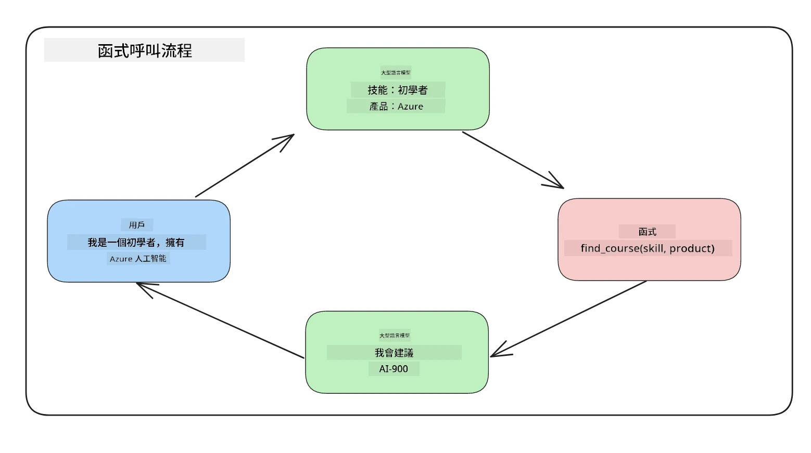
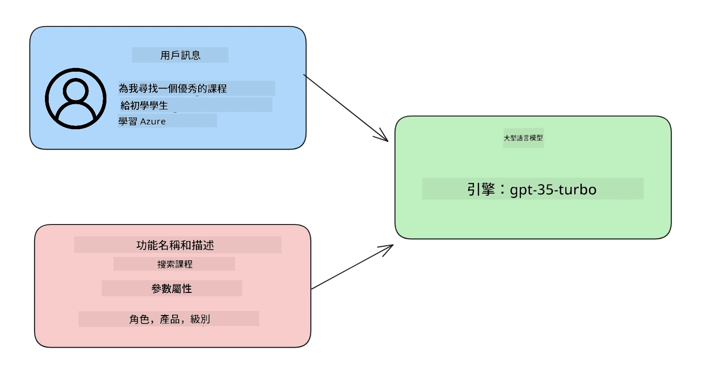

# 整合函式呼叫

[](https://youtu.be/DgUdCLX8qYQ?si=f1ouQU5HQx6F8Gl2)

你在之前的課程中已經學習了不少內容。然而，我們還可以進一步改進。我們可以解決的一些問題是如何獲得更一致的回應格式，以便更容易處理後續的回應。同時，我們可能還想從其他來源添加數據，以進一步豐富我們的應用程式。

上述問題正是本章節想要解決的。

## 介紹

本課程將涵蓋：

- 解釋什麼是函式呼叫及其使用場景。
- 使用 Azure OpenAI 建立函式呼叫。
- 如何將函式呼叫整合進應用程式中。

## 學習目標

完成本課程後，你將能夠：

- 說明使用函式呼叫的目的。
- 使用 Azure OpenAI 服務設定函式呼叫。
- 根據應用程式的使用情境設計有效的函式呼叫。

## 情境：用函式改善我們的聊天機器人

在本課程中，我們想為教育初創企業構建一個功能，讓用戶能使用聊天機器人尋找技術課程。我們會根據他們的技能水平、當前職位和感興趣的技術推薦課程。

完成此情境，我們將結合使用：

- `Azure OpenAI` 為使用者創建聊天體驗。
- `Microsoft Learn Catalog API` 以協助使用者依據請求尋找課程。
- `函式呼叫` 將使用者的查詢送出至函式以發出 API 請求。

先來看看為何我們首先想使用函式呼叫：

## 為什麼使用函式呼叫

在有函式呼叫之前，LLM 的回應是非結構化且不一致的。開發人員必須撰寫複雜的驗證程式碼以確保能處理每種回應變化。使用者無法得到像「斯德哥爾摩目前的天氣如何？」這樣的答案。這是因為模型的資料僅限於訓練時的時間點。

函式呼叫是 Azure OpenAI 服務的一項功能，能克服以下限制：

- <strong>一致的回應格式</strong>。如果我們能更好地控制回應格式，便能更輕鬆地整合該回應至下游系統。
- <strong>外部數據</strong>。能在聊天情境中使用應用程式的其他來源數據。

## 透過情境說明問題

> 如果你想運行以下情境，我們建議你使用[附帶的 notebook](./python/aoai-assignment.ipynb?WT.mc_id=academic-105485-koreyst)。你也可以直接閱讀，我們試圖說明一個函式能如何協助解決問題的情況。

來看一個說明回應格式問題的範例：

假如我們想建立學生資料庫，便能為他們推薦合適的課程。以下有兩份學生描述，數據內容相當相似。

1. 建立與 Azure OpenAI 資源的連接：

   ```python
   import os
   import json
   from openai import OpenAI
   from dotenv import load_dotenv
   load_dotenv()

   # 回應 API 是由 Azure OpenAI（Microsoft Foundry）v1 端點提供服務
   # 所以我們將 OpenAI 用戶端指向 <your-endpoint>/openai/v1/。
   endpoint = os.environ['AZURE_OPENAI_ENDPOINT']
   client = OpenAI(
   api_key=os.environ['AZURE_OPENAI_API_KEY'],
   base_url=f"{endpoint.rstrip('/')}/openai/v1/",
   )

   deployment=os.environ['AZURE_OPENAI_DEPLOYMENT']
   ```

   以下是一些 Python 程式碼用於配置我們的 Azure OpenAI 連接。因為使用 v1 端點，所以只需設定 `api_key` 與 `base_url`（不需 `api_version`）。

1. 使用變數 `student_1_description` 與 `student_2_description` 建立兩份學生描述。

   ```python
   student_1_description="Emily Johnson is a sophomore majoring in computer science at Duke University. She has a 3.7 GPA. Emily is an active member of the university's Chess Club and Debate Team. She hopes to pursue a career in software engineering after graduating."

   student_2_description = "Michael Lee is a sophomore majoring in computer science at Stanford University. He has a 3.8 GPA. Michael is known for his programming skills and is an active member of the university's Robotics Club. He hopes to pursue a career in artificial intelligence after finishing his studies."
   ```

   我們想將上述學生描述發送給 LLM 以解析資料。這些資料稍後可以在應用程式中使用，並發送至 API 或儲存進資料庫。

1. 建立兩個相同的提示，指示 LLM 我們感興趣的是哪些資訊：

   ```python
   prompt1 = f'''
   Please extract the following information from the given text and return it as a JSON object:

   name
   major
   school
   grades
   club

   This is the body of text to extract the information from:
   {student_1_description}
   '''

   prompt2 = f'''
   Please extract the following information from the given text and return it as a JSON object:

   name
   major
   school
   grades
   club

   This is the body of text to extract the information from:
   {student_2_description}
   '''
   ```

   上述提示指示 LLM 擷取資訊並以 JSON 格式回應。

1. 設定好提示與 Azure OpenAI 連接後，我們將用 `client.responses.create` 傳送提示至 LLM。我們將訊息存到 `input` 變數，並將角色設為 `user`。這是模擬使用者向聊天機器人發訊息。

   ```python
   # 從提示一得到的回應
   openai_response1 = client.responses.create(
   model=deployment,
   input = [{'role': 'user', 'content': prompt1}],
   store=False,
   )
   openai_response1.output_text

   # 從提示二得到的回應
   openai_response2 = client.responses.create(
   model=deployment,
   input = [{'role': 'user', 'content': prompt2}],
   store=False,
   )
   openai_response2.output_text
   ```

現在我們可以同時發送兩個請求至 LLM，並透過 `openai_response1.output_text` 來檢視所得到的回應。

1. 最後，我們可以用 `json.loads` 將回應轉成 JSON 格式：

   ```python
   # 將回應加載為 JSON 物件
   json_response1 = json.loads(openai_response1.output_text)
   json_response1
   ```

   回應 1：

   ```json
   {
     "name": "Emily Johnson",
     "major": "computer science",
     "school": "Duke University",
     "grades": "3.7",
     "club": "Chess Club"
   }
   ```

   回應 2：

   ```json
   {
     "name": "Michael Lee",
     "major": "computer science",
     "school": "Stanford University",
     "grades": "3.8 GPA",
     "club": "Robotics Club"
   }
   ```

   雖然提示相同且描述相似，但我們發現 `Grades` 屬性的值格式不一致，可能是 `3.7` 或 `3.7 GPA` 等格式。

   這個結果是因為 LLM 接收的是非結構化的文字提示，且回傳的也是非結構化資料。我們需要有結構化格式，才能知道儲存或使用資料時會是什麼樣態。

那麼，我們如何解決格式問題呢？利用函式呼叫，我們能確保得到結構化資料。使用函式呼叫時，LLM 實際上並不會呼叫或執行任何函式，而是給出一個結構供 LLM 回應。接著，我們利用那些結構化回應來知道應該在應用程式中執行哪個函式。



我們可以將函式回傳的內容再送回 LLM，LLM 將以自然語言回答使用者的查詢。

## 函式呼叫使用場景

函式呼叫能在多個不同應用場景中提升你的應用程式，比如：

- <strong>呼叫外部工具</strong>。聊天機器人擅長回答使用者問題，透過函式呼叫，可以用使用者訊息完成特定任務。例如，學生可以請聊天機器人「發送郵件給我的老師，說我需要更多這門科目的協助」，這就能呼叫函式 `send_email(to: string, body: string)`。

- **建立 API 或資料庫查詢**。使用者用自然語言查詢資訊，轉換成格式化的查詢或 API 請求。例如，老師請求「哪些學生完成了上次作業」，可以呼叫 `get_completed(student_name: string, assignment: int, current_status: string)` 函式。

- <strong>建立結構化資料</strong>。使用者可以拿一段文字或 CSV，並用 LLM 擷取重要資訊。例如，學生可將維基百科上關於和平協議的文章轉成 AI 快閃卡，這可透過 `get_important_facts(agreement_name: string, date_signed: string, parties_involved: list)` 函式完成。

## 建立你的第一個函式呼叫

建立函式呼叫包含三個主要步驟：

1. 使用函式列表（工具）及使用者訊息呼叫 Responses API。
2. 讀取模型的回應以執行動作，例如呼叫函式或 API。
3. 使用函式回應再次呼叫 Responses API，利用該資訊建立對使用者的回答。



### 步驟 1 - 建立訊息

第一步是建立使用者訊息。此訊息可以動態從文字輸入取得，也可以在此直接指定值。若是第一次使用 Responses API，我們需要定義訊息的 `role` 與 `content`。

`role` 可以是 `system`（建立規則）、`assistant`（模型）、或 `user`（終端使用者）。對函式呼叫而言，我們會指定為 `user` 及範例問題。

```python
messages= [ {"role": "user", "content": "Find me a good course for a beginner student to learn Azure."} ]
```

指定不同的角色，有助 LLM 明確了解講話的是系統還是使用者，方便構建對話歷史。

### 步驟 2 - 建立函式

接著，我們會定義函式以及函式參數。這裡只用一個函式 `search_courses`，但你可以建立多個函式。

> <strong>重要</strong> ：函式會包含在發送給 LLM 的系統訊息中，會佔用可用的 token 配額。

以下是我們將函式建立為項目陣列。每個項目是 Responses API 扁平結構格式的工具，擁有 `type`、`name`、`description` 與 `parameters` 屬性：

```python
functions = [
   {
      "type":"function",
      "name":"search_courses",
      "description":"Retrieves courses from the search index based on the parameters provided",
      "parameters":{
         "type":"object",
         "properties":{
            "role":{
               "type":"string",
               "description":"The role of the learner (i.e. developer, data scientist, student, etc.)"
            },
            "product":{
               "type":"string",
               "description":"The product that the lesson is covering (i.e. Azure, Power BI, etc.)"
            },
            "level":{
               "type":"string",
               "description":"The level of experience the learner has prior to taking the course (i.e. beginner, intermediate, advanced)"
            }
         },
         "required":[
            "role"
         ]
      }
   }
]
```

下面詳細說明每個函式實例屬性：

- `name` — 想被呼叫的函式名稱。
- `description` — 函式的功能描述，在此需清楚、具體。
- `parameters` — 模型生成回應時應包含的值與格式列表。`parameters` 陣列包含項目，這些項目有以下屬性：
  1. `type` — 屬性資料類型。
  2. `properties` — 模型將用於回應的具體值清單。
      1. `name` — key 名稱，模型回應中會使用這個屬性名稱，例如 `product`。
      1. `type` — 這個屬性的資料類型，例如 `string`。
      1. `description` — 具體屬性說明。

此外還有一個可選屬性 `required` — 代表函式呼叫時該屬性是必須的。

### 步驟 3 - 執行函式呼叫

定義函式後，我們要在呼叫 Responses API 時包含它。透過在請求中加入 `tools`，此例中設為 `tools=functions`。

也可設定 `tool_choice` 為 `auto`，這表示讓 LLM 判斷根據使用者訊息應該呼叫哪個函式，而非我們手動指定。

下方程式碼示範呼叫 `client.responses.create`，可見我們設定了 `tools=functions` 與 `tool_choice="auto"`，因此給 LLM 決定何時呼叫所提供函式的權限：

```python
response = client.responses.create(model=deployment,
                                        input=messages,
                                        tools=functions,
                                        tool_choice="auto",
                                        store=False)

print(response.output)
```

回應結果現在包含了 `response.output` 內的 `function_call` 項目，如下所示：

```json
{
  "type": "function_call",
  "name": "search_courses",
  "call_id": "call_abc123",
  "arguments": "{\n  \"role\": \"student\",\n  \"product\": \"Azure\",\n  \"level\": \"beginner\"\n}"
}
```

從中我們能看到函式 `search_courses` 被呼叫，及用於 `arguments` 屬性的參數。

LLM 能根據給予 `input` 參數的內容，找到符合函式輸入的資料。下面是 `messages` 的提醒：

```python
messages= [ {"role": "user", "content": "Find me a good course for a beginner student to learn Azure."} ]
```

如你所見，`student`、`Azure` 與 `beginner` 是從 `messages` 提取並作為函式輸入。這種用函式的方式，不僅能從提示中擷取資料，還能給 LLM 加上結構並打造可重用功能。

接下來我們看看如何在應用程式中使用這個功能。

## 將函式呼叫整合至應用程式

在測試完 LLM 格式化的回應後，我們現在可以將它整合至應用程式中。

### 管理流程

要整合至應用，我們採取以下幾步：

1. 首先呼叫 OpenAI 服務，從回應的 `output` 裡取得函式呼叫項目。

   ```python
   response_items = response.output
   tool_calls = [item for item in response_items if item.type == "function_call"]
   ```

1. 接著定義呼叫 Microsoft Learn API 的函式，取得課程清單：

   ```python
   import requests

   def search_courses(role, product, level):
     url = "https://learn.microsoft.com/api/catalog/"
     params = {
        "role": role,
        "product": product,
        "level": level
     }
     response = requests.get(url, params=params)
     modules = response.json()["modules"]
     results = []
     for module in modules[:5]:
        title = module["title"]
        url = module["url"]
        results.append({"title": title, "url": url})
     return str(results)
   ```

   注意，我們現在建立一個真實的 Python 函式，對應先前在 `functions` 變數中定義的函式名稱。我們也在呼叫真實的外部 API 來取得所需資料，此例中是向 Microsoft Learn API 搜尋訓練模組。

好的，我們建立了 `functions` 變數與相應的 Python 函式，如何讓 LLM 知道兩者對應，從而呼叫這個 Python 函式呢？

1. 要判斷是否需要呼叫 Python 函式，我們需查看 LLM 回應是否包含 `function_call` 項目，並執行對應函式。下面是檢查的程式碼示範：

   ```python
   # 檢查模型是否想呼叫函數
   if tool_calls:
    for tool_call in tool_calls:
     print("Recommended Function call:")
     print(tool_call.name)
     print()

     # 呼叫該函數。
     function_name = tool_call.name

     available_functions = {
             "search_courses": search_courses,
     }
     function_to_call = available_functions[function_name]

     function_args = json.loads(tool_call.arguments)
     function_response = function_to_call(**function_args)

     print("Output of function call:")
     print(function_response)
     print(type(function_response))

     # 將函數呼叫及其結果加入對話中。
     # 模型的 function_call 項目必須在其輸出之前附加。
     messages.append(tool_call)  # 助手的 function_call 項目
     messages.append( # 函數結果
         {
             "type": "function_call_output",
             "call_id": tool_call.call_id,
             "output": function_response,
         }
     )
   ```

   這三行程式碼確保我們提取函式名稱、參數並執行呼叫：

   ```python
   function_to_call = available_functions[function_name]

   function_args = json.loads(tool_call.arguments)
   function_response = function_to_call(**function_args)
   ```

   以下是執行程式碼後的輸出：

   <strong>輸出</strong>

   ```Recommended Function call:
   {
     "name": "search_courses",
     "arguments": "{\n  \"role\": \"student\",\n  \"product\": \"Azure\",\n  \"level\": \"beginner\"\n}"
   }

   Output of function call:
   [{'title': 'Describe concepts of cryptography', 'url': 'https://learn.microsoft.com/training/modules/describe-concepts-of-cryptography/?
   WT.mc_id=api_CatalogApi'}, {'title': 'Introduction to audio classification with TensorFlow', 'url': 'https://learn.microsoft.com/en-
   us/training/modules/intro-audio-classification-tensorflow/?WT.mc_id=api_CatalogApi'}, {'title': 'Design a Performant Data Model in Azure SQL
   Database with Azure Data Studio', 'url': 'https://learn.microsoft.com/training/modules/design-a-data-model-with-ads/?
   WT.mc_id=api_CatalogApi'}, {'title': 'Getting started with the Microsoft Cloud Adoption Framework for Azure', 'url':
   'https://learn.microsoft.com/training/modules/cloud-adoption-framework-getting-started/?WT.mc_id=api_CatalogApi'}, {'title': 'Set up the
   Rust development environment', 'url': 'https://learn.microsoft.com/training/modules/rust-set-up-environment/?WT.mc_id=api_CatalogApi'}]
   <class 'str'>
   ```

1. 現在我們將更新的訊息 `messages` 傳回給 LLM，以獲得自然語言回應，而非 API 的 JSON 格式回應。

   ```python
   print("Messages in next request:")
   print(messages)
   print()

   second_response = client.responses.create(
      input=messages,
      model=deployment,
      tool_choice="auto",
      tools=functions,
      temperature=0,
      store=False,
         )  # 從模型取得一個新回應，使其能看到函數回應


   print(second_response.output_text)
   ```

   <strong>輸出</strong>

   ```text
   I found some good courses for beginner students to learn Azure:

   1. [Describe concepts of cryptography](https://learn.microsoft.com/training/modules/describe-concepts-of-cryptography/?WT.mc_id=api_CatalogApi)
   2. [Introduction to audio classification with TensorFlow](https://learn.microsoft.com/training/modules/intro-audio-classification-tensorflow/?WT.mc_id=api_CatalogApi)
   3. [Design a Performant Data Model in Azure SQL Database with Azure Data Studio](https://learn.microsoft.com/training/modules/design-a-data-model-with-ads/?WT.mc_id=api_CatalogApi)
   4. [Getting started with the Microsoft Cloud Adoption Framework for Azure](https://learn.microsoft.com/training/modules/cloud-adoption-framework-getting-started/?WT.mc_id=api_CatalogApi)
   5. [Set up the Rust development environment](https://learn.microsoft.com/training/modules/rust-set-up-environment/?WT.mc_id=api_CatalogApi)

   You can click on the links to access the courses.
   ```

## 作業

若要繼續學習 Azure OpenAI 函式呼叫，你可以構建：

- 更多函式參數，可能幫助學習者尋找更多課程。

- 建立另一個函式呼叫，以取得學習者更多資訊，例如他們的母語
- 建立當函式呼叫和/或 API 呼叫未回傳任何合適課程時的錯誤處理

提示：請參考 [Learn API 參考文件](https://learn.microsoft.com/training/support/catalog-api-developer-reference?WT.mc_id=academic-105485-koreyst) 頁面，了解此資料如何及在哪裡可用。

## 很棒！繼續旅程

完成本課程後，請查看我們的[生成式 AI 學習集合](https://aka.ms/genai-collection?WT.mc_id=academic-105485-koreyst)，持續提升你的生成式 AI 知識！

前往第 12 課，我們將探討如何[設計 AI 應用的 UX](../12-designing-ux-for-ai-applications/README.md?WT.mc_id=academic-105485-koreyst)！

---

<!-- CO-OP TRANSLATOR DISCLAIMER START -->
**免責聲明**：
本文件使用 AI 翻譯服務 [Co-op Translator](https://github.com/Azure/co-op-translator) 進行翻譯。雖然我們力求準確，但請注意，自動翻譯可能包含錯誤或不準確之處。原始文件的母語版本應被視為權威來源。對於重要資訊，建議尋求專業人工翻譯。我們不對因使用本翻譯而引起的任何誤解或曲解承擔責任。
<!-- CO-OP TRANSLATOR DISCLAIMER END -->