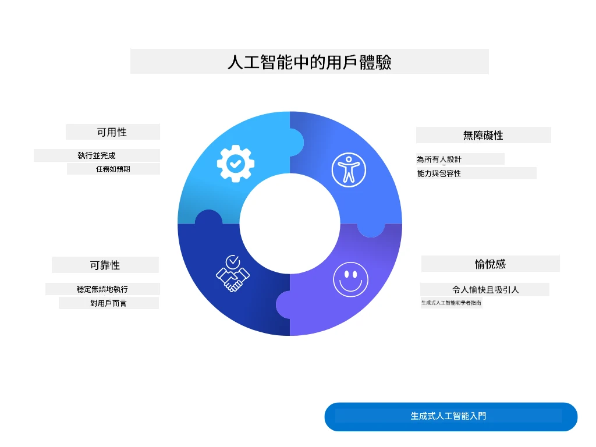
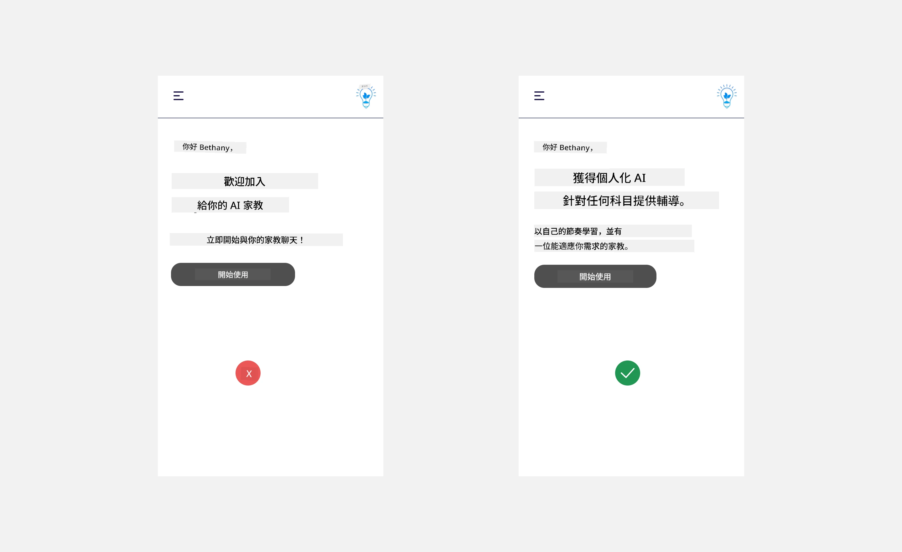
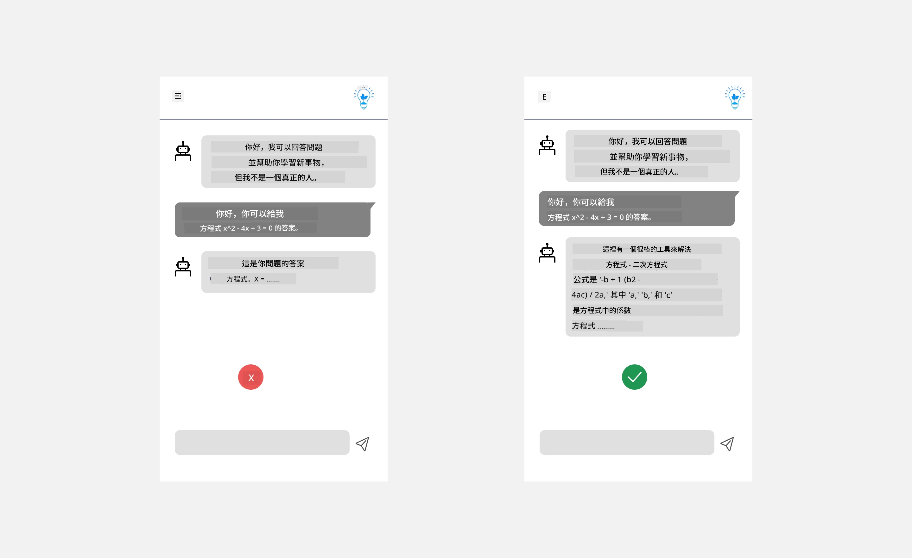
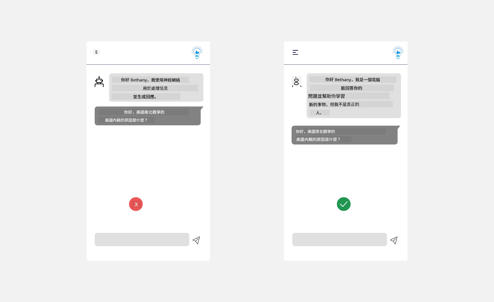
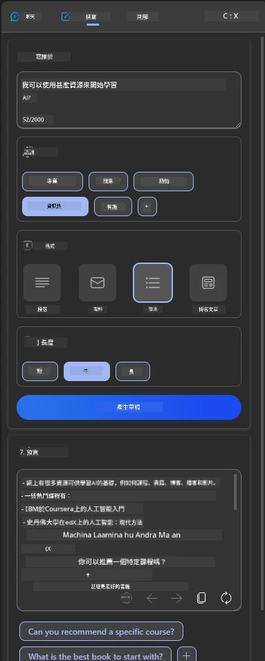
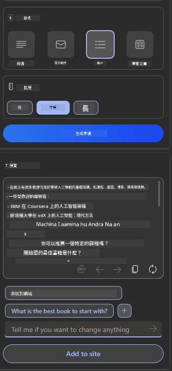
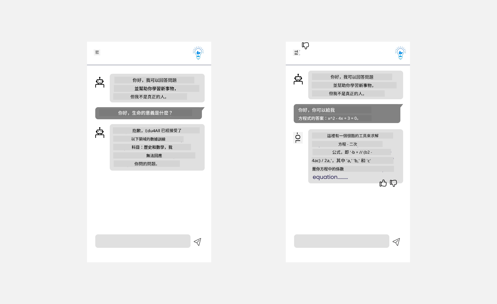

# 為 AI 應用程式設計使用者體驗

> _(點擊上方圖片觀看本課影片)_

使用者體驗是建構應用程式中非常重要的一環。使用者需能有效率地使用您的應用程式來完成工作。效率是一方面，但您同時還需設計出能被所有人使用的應用程式，使其具備_無障礙性_。本章將聚焦於這個領域，希望能讓您設計出人們願意且能使用的應用程式。

## 簡介

使用者體驗是指使用者如何與特定產品或服務（無論是系統、工具或設計）互動和使用。開發 AI 應用程式時，開發者不僅關注確保使用者體驗的有效性，也重視其倫理性。本課將涵蓋如何建構滿足使用者需求的人工智慧（AI）應用程式。

本課將涵蓋以下主題：

- 使用者體驗簡介與理解使用者需求
- 為信任與透明性設計 AI 應用程式
- 為協作與回饋設計 AI 應用程式

## 學習目標

參加本課後，您將能夠：

- 理解如何打造符合使用者需求的 AI 應用程式。
- 設計促進信任與協作的 AI 應用程式。

### 先決條件

花點時間深入閱讀[使用者體驗與設計思考](https://learn.microsoft.com/training/modules/ux-design?WT.mc_id=academic-105485-koreyst)。

## 使用者體驗簡介與理解使用者需求

在我們虛構的教育新創中，有兩種主要使用者，老師和學生。這兩類使用者各有其獨特需求。以使用者為中心的設計優先考量使用者，確保產品與目標受眾相關且有益。

應用程式應該具備 **實用、可靠、無障礙且令人愉悅**，以提供良好的使用者體驗。

### 易用性

實用意味著應用程式具備符合預期目的的功能，例如自動批改作業或生成複習用的抽認卡。能自動批改作業的應用程式應能根據預設標準準確且高效地為學生作品評分。同樣地，生成複習抽認卡的應用程式應能根據資料產出相關且多樣的問題。

### 可靠性

可靠意味著應用程式能持續且無錯誤地執行任務。然而，AI 和人類一樣並不完美，可能會出錯。應用程式可能遇到錯誤或意外情況，需要人為干預或更正。您會如何處理錯誤？本課最後一節將介紹如何為 AI 系統和應用程式設計協作與回饋機制。

### 無障礙性

無障礙意味著將使用者體驗延伸至各種能力的使用者，包括身心障礙者，確保無人被排除在外。遵循無障礙指引與原則，AI 解決方案變得更具包容性、實用性並惠及所有使用者。

### 愉悅性

愉悅意味著應用程式使用起來令人愉快。吸引人的使用者體驗能積極影響使用者，鼓勵他們回流應用程式並提升業務收入。

並非所有挑戰都能用 AI 解決。AI 可用來增強使用者體驗，無論是自動化手動任務，或是個人化使用者體驗。

## 為信任與透明性設計 AI 應用程式

建構信任對於設計 AI 應用程式至關重要。信任確保使用者有信心應用程式能完成工作、穩定交付結果，且結果正是使用者所需。此方面的風險有不信任和過度信任。不信任指使用者對 AI 系統幾乎沒有信心，導致拒絕您的應用程式；過度信任則是使用者過度高估 AI 系統能力，導致過度信賴。例如過度信任自動批改系統可能導致教師未能檢查部分試卷，影響評分公正準確，或錯失回饋與改進機會。

確保信任成為設計核心的兩個方法是可解釋性與控制。

### 可解釋性

當 AI 協助做出決策，例如向未來世代傳授知識時，教師與家長理應理解 AI 如何做決定。這就是可解釋性——理解 AI 應用程式做決策的過程。為可解釋性而設計包含加入細節說明 AI 如何產生結果。受眾必須清楚這是 AI 所產生的結果，而非人為。例如，不說「現在開始與您的導師聊天」，而說「使用會依需求調整並幫助您依進度學習的 AI 導師」。

另一個例子是 AI 如何使用使用者及個人資料。例如，具有學生角色的使用者可能因其角色限制而無法直接得到答案，但 AI 會引導使用者思考解決問題的方法。

可解釋性的最後一個重點是簡化說明。學生與老師可能非 AI 專家，因此說明應用程式能做什麼或不能做什麼的內容應簡單易懂。

### 控制

生成式 AI 促成 AI 與使用者間的協作，例如使用者能修改提示詞以獲得不同結果。除此之外，生成結果後，使用者應能修訂結果，讓他們感受到掌控感。例如使用 Microsoft Copilot（前身為 Bing Chat）時，您可以根據格式、語氣與長度調整提示詞，亦可對輸出結果進行修改，如下所示：

Microsoft Copilot 的另一項功能是允許使用者控制 AI 使用的資料，能選擇加入或退出資料使用。對於學校應用程式，學生可能想使用自己的筆記以及老師的資源作為複習材料。

> 設計 AI 應用程式時，意圖性是確保使用者不會因對其能力有不切實際的期待而過度信任的關鍵。一種方法是在提示詞與結果間產生摩擦，提醒使用者這是 AI，而非真人。

## 為協作與回饋設計 AI 應用程式

如前所述，生成式 AI 創造使用者與 AI 之間的協作。多數互動是使用者輸入提示詞，AI 產出結果。若結果錯誤，應用程式如何處理？若發生錯誤，AI 是責怪使用者，還是花時間解釋錯誤？

AI 應用程式應該設計為能夠接受並給予回饋。這不僅有助於提升 AI 系統，也建立使用者信任。設計中應包含回饋機制，例如對結果的簡單按讚或不喜歡。

另一種方法是明確傳達系統的功能限制。當使用者執行超出 AI 能力範圍的請求時，應設法妥善處理，如下示範。

系統錯誤是應用程式常見情況，例如使用者需協助於 AI 範圍外的資訊，或應用程式限制使用者可產出摘要的問題/主題數量。舉例來說，一款主要訓練於歷史和數學資料的 AI 應用程式，可能無法處理地理問題。為了緩解此狀況，AI 系統可回覆：「抱歉，我們的產品只使用以下主題的資料訓練......，無法回應您所提的問題。」

AI 應用程式並非完美，難免會出錯。設計時應確保有空間讓使用者提供回饋，並建立簡單且易於解釋的錯誤處理。

## 作業

選擇您至今建置的任何 AI 應用程式，考慮在您的應用中實施以下步驟：

- **愉悅性：** 深思如何讓應用程式更令人愉快。您是否處處添加說明？是否鼓勵使用者探索？錯誤訊息是如何表達的？

- **易用性：** 建置網頁應用程式。確保您的應用程式既可使用滑鼠也可用鍵盤操作。

- **信任與透明性：** 不要完全信任 AI 及其輸出，考慮如何加入人工審核流程以核實結果。另外，也考量並實作其他方法以達到信任與透明性。

- **控制：** 賦予使用者控制他們提供給應用程式的資料。實作使用者能選擇加入及退出資料收集的機制。

<!-- ## [課後測驗](../../../12-designing-ux-for-ai-applications/quiz-url) -->

## 繼續學習！

完成本課後，請參閱我們的[生成式 AI 學習合集](https://aka.ms/genai-collection?WT.mc_id=academic-105485-koreyst)，持續提升您的生成式 AI 知識！

請前往第 13 課，了解如何[保護 AI 應用程式](../13-securing-ai-applications/README.md?WT.mc_id=academic-105485-koreyst)！

---

<!-- CO-OP TRANSLATOR DISCLAIMER START -->
**免責聲明**：
本文件使用 AI 翻譯服務 [Co-op Translator](https://github.com/Azure/co-op-translator) 進行翻譯。雖然我們力求準確，但請注意，自動翻譯可能包含錯誤或不準確之處。原始文件的母語版本應被視為權威來源。對於重要資訊，建議尋求專業人工翻譯。我們不對因使用本翻譯而引起的任何誤解或曲解承擔責任。
<!-- CO-OP TRANSLATOR DISCLAIMER END -->