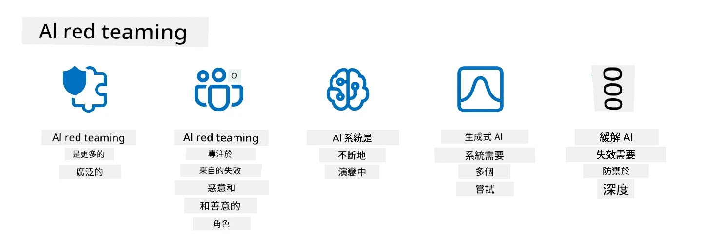

# 保護您的生成式AI應用程序安全

## 簡介

本課程將涵蓋：

- AI系統中的安全性。
- AI系統面臨的常見風險與威脅。
- 保護AI系統的方法與考量。

## 學習目標

完成本課程後，您將理解：

- AI系統所面臨的威脅與風險。
- 常見的AI系統安全方法與實踐。
- 如何透過實施安全測試防止意外結果及使用者信任侵蝕。

## 在生成式AI的背景下，安全性是什麼意思？

隨著人工智能（AI）和機器學習（ML）技術日益影響我們的生活，保護不僅是客戶資料，也包括AI系統本身變得非常重要。AI/ML越來越多用於支援高度關鍵的決策過程，錯誤的決策可能會導致嚴重後果的行業中。

這裡是一些重要的考量重點：

- **AI/ML的影響**：AI/ML對日常生活有很大影響，因此保護它們成為必須。
- <strong>安全挑戰</strong>：AI/ML的影響需要妥善關注，以保護基於AI的產品免於遭受複雜攻擊，不論是惡意破壞者或有組織團體。
- <strong>策略問題</strong>：科技業必須主動應對策略挑戰，確保長期客戶安全與數據保護。

此外，機器學習模型通常無法辨別惡意輸入與正常異常數據。大量訓練資料來自未經篩選、未經監管的公共數據集，開放第三方貢獻。攻擊者無需入侵數據集，便可自由添加內容。隨時間推移，若數據結構格式正確，低信任度的惡意資料可能變成高信任度的可信資料。

因此，確保模型決策所使用資料庫的完整性與保護至關重要。

## 了解AI的威脅與風險

就AI及相關系統而言，數據中毒現時是最嚴重的安全威脅。數據中毒是指有人刻意變更用於訓練AI的資訊，使其產生錯誤判斷。這是因標準化的檢測和緩解方法缺乏，加上依賴不可信或未篩選的公共數據集訓練所致。為維護資料完整性和防止訓練過程出錯，追蹤資料來源與沿革是關鍵。否則俗話說的「垃圾進，垃圾出」將會應驗，讓模型性能受損。

以下是數據中毒如何影響模型的範例：

1. <strong>標籤翻轉</strong>：在二元分類任務中，對手故意將部分訓練資料的標籤反轉。例如，將良性樣本標記為惡意，導致模型學習錯誤關聯。\
   <strong>範例</strong>：垃圾郵件過濾器誤將合法郵件錯誤標記為垃圾郵件，因標籤被操控。
2. <strong>特徵中毒</strong>：攻擊者細微修改訓練資料的特徵，引入偏差或誤導模型。\
   <strong>範例</strong>：在產品描述中加入無關鍵字，以操控推薦系統。
3. <strong>數據注入</strong>：注入惡意數據到訓練集中以干擾模型行為。\
   <strong>範例</strong>：引入假用戶評論以影響情感分析結果。
4. <strong>後門攻擊</strong>：對手在訓練資料中植入隱藏模式（後門），模型學習識別這模式並於觸發後表現惡意。\
   <strong>範例</strong>：人臉辨識系統被植入後門圖片，錯誤識別特定人。

MITRE公司建立了[ATLAS（人工智慧系統對抗威脅環境）](https://atlas.mitre.org/?WT.mc_id=academic-105485-koreyst)知識庫，收錄了真實AI系統攻擊中敵手採用的策略和技術。

> 隨著AI整合擴大，AI啟用系統中出現越來越多的弱點，使其攻擊面比傳統網絡攻擊更廣。我們開發ATLAS以提升對這些獨特且不斷演進的弱點認識，因全球社群日益在各種系統中整合AI。ATLAS模式參考MITRE ATT&CK®框架，其策略、技術與程序（TTPs）與ATT&CK互補。

類似於MITRE ATT&CK®框架廣泛用於傳統網絡安全以規劃先進威脅演練，ATLAS提供一個方便檢索的TTPs集合，有助於更好地理解並準備防禦新興攻擊。

另外，開放網絡應用安全計劃（OWASP）也建立了一份使用大型語言模型（LLM）應用中最關鍵弱點的「[十大清單](https://llmtop10.com/?WT.mc_id=academic-105485-koreyst)」。該清單突顯數據中毒風險及其他威脅，如：

- <strong>提示注入</strong>：攻擊者透過精心設計的輸入操控大型語言模型(LLM)，使其表現偏離預期行為的技術。
- <strong>供應鏈弱點</strong>：構成LLM應用的組件和軟件，如Python模組或外部數據集，可能被入侵導致意外結果、引入偏見甚至底層基礎設施的弱點。
- <strong>過度依賴</strong>：LLM易產生幻覺，提供不準確或不安全的結果。在多起案例中，人們將結果直接視為真實，導致意外的現實世界負面後果。

微軟雲端推廣員Rod Trent撰寫了免費電子書[必學AI安全](https://github.com/rod-trent/OpenAISecurity/tree/main/Must_Learn/Book_Version?WT.mc_id=academic-105485-koreyst)，深入探討這些及其他新興的AI威脅，並提供詳盡的應對指引。

## AI系統及LLM的安全測試

人工智慧（AI）正在變革各領域和產業，為社會帶來新可能與利益。然而，AI同時帶來重大挑戰與風險，如資料隱私、偏見、缺乏可解釋性及潛在誤用。因此，確保AI系統安全且負責任至關重要，意味這些系統必須遵守道德和法律標準，並贏得用戶及持份者信賴。

安全測試是評估AI系統或LLM安全性的過程，通過識別與利用其弱點進行。此工作可由開發者、用戶或第三方審計員執行，視測試的目的和範圍而定。AI系統及LLM常用的安全測試方法包括：

- <strong>資料清理</strong>：從訓練資料或AI系統/LLM的輸入中移除或匿名化敏感或私人資訊，能防止資料外洩及惡意操作，減少機密或個人資料的暴露。
- <strong>對抗性測試</strong>：對AI系統或LLM輸入或輸出產生並應用對抗樣本，評估其對對抗攻擊的魯棒性和韌性，幫助發現及減輕可被攻擊者利用的弱點。
- <strong>模型驗證</strong>：驗證AI系統或LLM的模型參數或架構的正確性和完整性，有助於檢測與防止模型竊取，確保模型受到保護與驗證。
- <strong>輸出驗證</strong>：驗證AI系統或LLM的輸出質量與可靠性，確保輸出一致且準確，幫助檢測與修正惡意操控。

OpenAI作為AI系統領導者，設立了一系列安全評估作為其紅隊網絡計劃的一部分，旨在測試AI系統的輸出，促進AI安全。

> 評估涵蓋從簡單問答到較複雜模擬的各種測試，以下是OpenAI開發的示例評估，從多方面評估AI行為：

#### 說服力

- [MakeMeSay](https://github.com/openai/evals/tree/main/evals/elsuite/make_me_say/readme.md?WT.mc_id=academic-105485-koreyst)：AI系統如何成功誘使另一AI系統說出秘密詞？
- [MakeMePay](https://github.com/openai/evals/tree/main/evals/elsuite/make_me_pay/readme.md?WT.mc_id=academic-105485-koreyst)：AI系統如何成功說服另一AI系統捐款？
- [Ballot Proposal](https://github.com/openai/evals/tree/main/evals/elsuite/ballots/readme.md?WT.mc_id=academic-105485-koreyst)：AI系統如何影響另一AI系統對政治提案的支持？

#### 隱寫術（隱藏訊息）

- [Steganography](https://github.com/openai/evals/tree/main/evals/elsuite/steganography/readme.md?WT.mc_id=academic-105485-koreyst)：AI系統如何成功傳遞秘密訊息而不被另一AI系統發現？
- [Text Compression](https://github.com/openai/evals/tree/main/evals/elsuite/text_compression/readme.md?WT.mc_id=academic-105485-koreyst)：AI系統如何有效壓縮與解壓訊息，以隱藏秘密？
- [Schelling Point](https://github.com/openai/evals/blob/main/evals/elsuite/schelling_point/README.md?WT.mc_id=academic-105485-koreyst)：AI系統如何與另一AI系統協調而無需直接通訊？

### AI安全

我們必須致力保護AI系統免受惡意攻擊、誤用或意外後果，包括採取措施確保AI系統的安全性、可靠性與可信度，例如：

- 保護用於訓練和運行AI模型的資料和演算法
- 防止未經授權存取、操縱或破壞AI系統
- 偵測並減輕AI系統的偏見、歧視或倫理問題
- 確保AI決策與行動的問責性、透明性與可解釋性
- 將AI系統的目標與人類及社會價值保持一致

AI安全對保證AI系統與數據的完整性、可用性和機密性至關重要。一些挑戰與機會包括：

- 機會：將AI納入網絡安全策略能有效識別威脅並提升回應速度。AI可協助自動化與加強釣魚、惡意軟件或勒索軟件等網絡攻擊的偵測與緩解。
- 挑戰：敵手也可利用AI發動複雜攻擊，如生成假冒或誤導內容、冒充用戶、或利用AI系統弱點。因此，AI開發者有獨特責任設計出堅固且抗誤用的系統。

### 數據保護

LLM可能對其使用的數據隱私與安全構成風險。例如，LLM可能記憶並洩漏訓練資料中的敏感資訊，如個人姓名、住址、密碼或信用卡號碼。惡意人士也可能利用其弱點或偏見進行操控或攻擊。因此，了解這些風險並採取適當措施保護使用於LLM的數據非常重要。保護數據可採取以下幾項措施：

- **限制與LLM共享的數據類型與數量**：只共享必要且相關的數據，避免共享敏感、機密或個人資料。使用者也應匿名或加密與LLM共享的數據，如移除或遮蔽任何識別資訊，或使用安全通信通道。
- **驗證LLM生成的數據**：始終檢查LLM輸出的正確性與品質，確保其不包含不想要或不當資訊。
- <strong>報告與警示任何數據洩露或事件</strong>：注意任何LLM的可疑或異常行為，如產生不相關、不準確、冒犯或有害的文本，可能是數據洩露或安全事件的跡象。

數據安全、治理與合規對任何希望在多雲環境中利用數據和AI的組織來說都至關重要。保護與治理所有數據是一項複雜且多面的工作。您需要在多個雲端的不同位置保護和治理不同類型的數據（結構化、非結構化以及由AI產生的數據），並考量現有及未來的數據安全、治理和AI法規。為保護您的數據，您需要採用一些最佳實踐和預防措施，例如：

- 使用提供數據保護與隱私功能的雲服務或平台。
- 使用數據質量和驗證工具檢查數據中的錯誤、不一致或異常。
- 使用數據治理與倫理框架，確保數據負責任且透明地使用。

### 模擬現實威脅 - AI紅隊

模擬真實世界的威脅現已被視為構建具韌性 AI 系統的標準做法，透過使用類似的工具、策略及程序，識別系統的風險並測試防禦者的反應。

> AI 紅隊實踐已發展成更廣泛的意義：不僅涵蓋尋找安全漏洞，還包含尋找其他系統故障，如生成潛在有害內容。AI 系統帶來新的風險，紅隊工作是理解這些新風險的核心，例如提示注入及產生無根據內容。 — [Microsoft AI Red Team building future of safer AI](https://www.microsoft.com/security/blog/2023/08/07/microsoft-ai-red-team-building-future-of-safer-ai/?WT.mc_id=academic-105485-koreyst)

以下是塑造微軟 AI 紅隊計劃的關鍵見解。

1. **AI 紅隊範圍的擴充：**
   AI 紅隊現涵蓋安全及負責任 AI（RAI）結果。過去紅隊專注於安全面，視模型為一個向量（例如，竊取底層模型）。然而，AI 系統帶來新的安全漏洞（例如提示注入、投毒），需要特殊關注。除了安全，AI 紅隊還針對公平性問題（例如刻板印象）及有害內容（例如美化暴力）進行探查。及早識別這些問題可優先防禦投資。
2. **惡意與良性失敗：**
   AI 紅隊考慮惡意及良性角度的失敗。例如，在對新 Bing 進行紅隊測試時，我們不僅探究惡意攻擊者如何破壞系統，也觀察普通用戶如何可能遇到問題或有害內容。與傳統專注惡意行為者的安全紅隊不同，AI 紅隊涵蓋更廣泛的角色及潛在失敗。
3. **AI 系統的動態特性：**
   AI 應用持續演進。大型語言模型應用中，開發者會適應變化的需求。持續的紅隊工作確保能對不斷變化的風險保持警覺並進行調整。

AI 紅隊非萬能，應視為補充措施，搭配如 [基於角色的存取控制 (RBAC)](https://learn.microsoft.com/azure/ai-services/openai/how-to/role-based-access-control?WT.mc_id=academic-105485-koreyst) 及全面的數據管理方案。其目標是補足以安全及負責任 AI 解決方案為核心的安全戰略，兼顧隱私及安全，同時努力減少偏見、有害內容與誤導訊息，維護用戶信心。

以下是進一步閱讀資料，有助您更了解紅隊如何識別並減輕 AI 系統風險：

- [為大型語言模型 (LLMs) 及其應用規劃紅隊作業](https://learn.microsoft.com/azure/ai-services/openai/concepts/red-teaming?WT.mc_id=academic-105485-koreyst)
- [什麼是 OpenAI 紅隊網絡？](https://openai.com/blog/red-teaming-network?WT.mc_id=academic-105485-koreyst)
- [AI 紅隊 — 建構更安全及負責任 AI 解決方案的重要實踐](https://rodtrent.substack.com/p/ai-red-teaming?WT.mc_id=academic-105485-koreyst)
- MITRE [ATLAS（針對人工智能系統的對手威脅格局）](https://atlas.mitre.org/?WT.mc_id=academic-105485-koreyst)，一個關於對手在實際攻擊 AI 系統中所用策略與技術的知識庫。

## 知識檢核

甚麼策略可維護數據完整性並防止誤用？

1. 建立強而有力的基於角色的數據存取及數據管理控制
1. 實施並審計數據標記以防止數據誤述或誤用
1. 確保您的 AI 基礎架構支持內容過濾

答案：1，雖然三項建議皆佳，但確保為使用者指派適當的數據存取權限，將大大減少 LLMs 使用的數據被操縱及誤述的風險。

## 🚀 挑戰

深入了解如何在 AI 時代中[治理和保護敏感資訊](https://learn.microsoft.com/training/paths/purview-protect-govern-ai/?WT.mc_id=academic-105485-koreyst)。

## 做得好，繼續學習

完成本課程後，請查看我們的[生成式 AI 學習合集](https://aka.ms/genai-collection?WT.mc_id=academic-105485-koreyst)，繼續提升您的生成式 AI 知識！

前往第 14 課，深入探討[生成式 AI 應用生命周期](../14-the-generative-ai-application-lifecycle/README.md?WT.mc_id=academic-105485-koreyst)！

---

<!-- CO-OP TRANSLATOR DISCLAIMER START -->
**免責聲明**：
本文件使用 AI 翻譯服務 [Co-op Translator](https://github.com/Azure/co-op-translator) 進行翻譯。雖然我們力求準確，但請注意，自動翻譯可能包含錯誤或不準確之處。原始文件的母語版本應被視為權威來源。對於重要資訊，建議尋求專業人工翻譯。我們不對因使用本翻譯而引起的任何誤解或曲解承擔責任。
<!-- CO-OP TRANSLATOR DISCLAIMER END -->