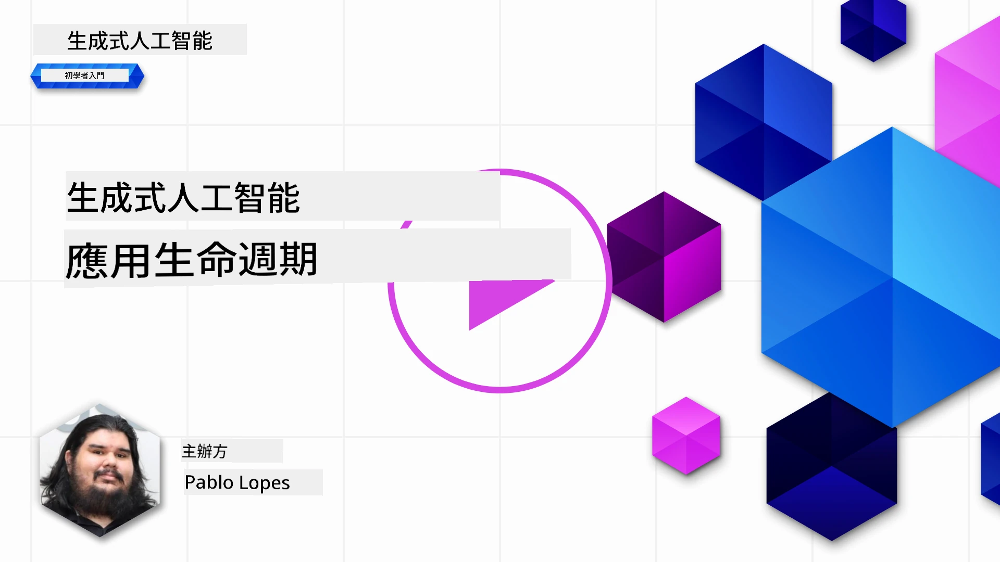
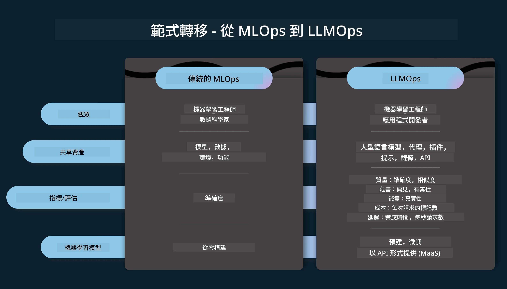
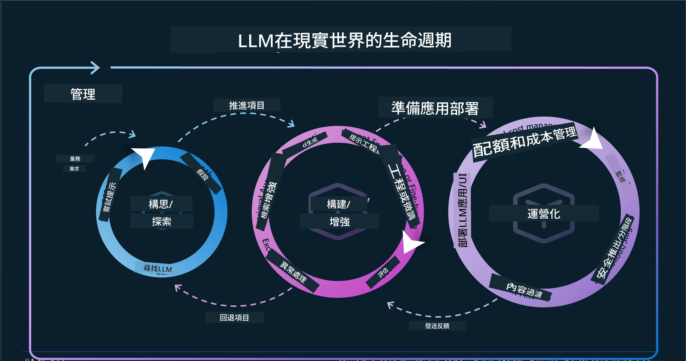
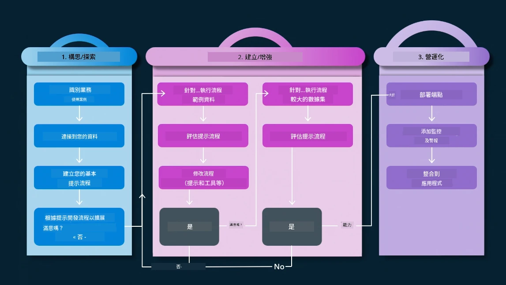
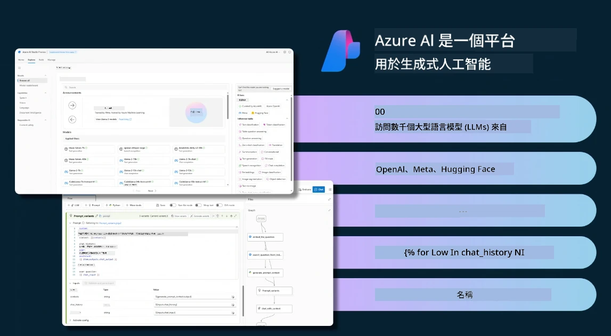
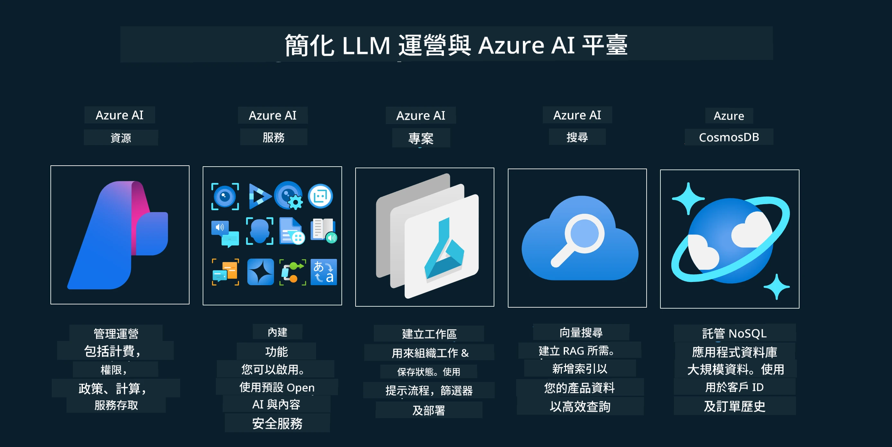
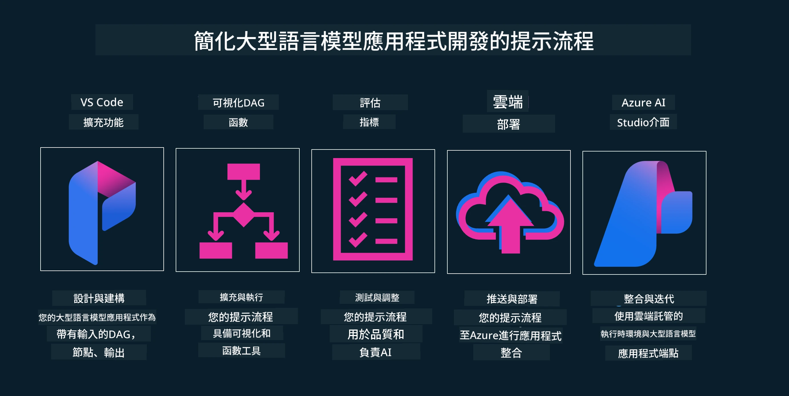

# 生成式 AI 應用程式生命週期

對所有 AI 應用程式來說，一個重要的問題是 AI 功能的相關性，因為 AI 是一個快速發展的領域，為確保您的應用程式保持相關、可靠且穩健，您需要持續監控、評估和改進它。這就是生成式 AI 生命週期的用武之地。

生成式 AI 生命週期是一個指導您通過開發、部署及維護生成式 AI 應用程式各階段的框架。它幫助您定義目標、衡量績效、識別挑戰並實施解決方案。它也幫助您使應用程式符合您領域及利益相關者的倫理和法律標準。藉由遵循生成式 AI 生命週期，您可以確保您的應用程式持續提供價值並滿足使用者需求。

## 簡介

本章節您將會：

- 了解從 MLOps 到 LLMOps 的範式轉移
- LLM 生命週期
- 生命週期工具
- 生命週期指標化與評估

## 了解從 MLOps 到 LLMOps 的範式轉移

大型語言模型（LLM）是人工智能武器庫中的新工具，它們在分析和生成任務上功能強大，應用於不同場景，但這種強大功能對如何簡化 AI 與經典機器學習任務帶來了一些影響。

因此，我們需要一個新範式，才能以正確激勵方式動態適應這個工具。我們可以將舊的 AI 應用稱為「機器學習應用」（ML Apps），而新的 AI 應用稱為「生成式 AI 應用」（GenAI Apps）或簡稱「AI 應用」，以反映當前主流技術和方法。這在多方面改變了我們的敘事方式，請參考以下比較。

注意，在 LLMOps 中，我們更聚焦於應用程式開發者，使用整合作為關鍵點，採用「模型即服務」，並在指標上考慮以下幾點：

- 品質：回應品質
- 風險：負責任的 AI
- 誠實度：回應的根據性（是否有道理？是否正確？）
- 成本：解決方案預算
- 延遲：平均回應時間（每個 token）

## LLM 生命週期

首先，為了理解生命週期及其修改，我們來看看下方資訊圖表。

正如您所見，這與傳統 MLOps 的生命週期不同。LLM 有許多新需求，例如提示工程、改進品質的不同技術（微調、檢索增強生成（RAG）、元提示）、擔負負責任 AI 的不同評估，以及新評估指標（品質、風險、誠實度、成本和延遲）。

例如，看看我們如何構思。使用提示工程來試驗各種 LLM，探索可能性以測試它們的假設是否正確。

請注意這不是線性過程，而是整合循環、迭代並帶有一個總體循環。

我們如何探索這些步驟？讓我們詳細了解如何構建生命週期。

這看起來可能有點複雜，我們先聚焦於三大步驟。

1. 構思/探索：探索階段，根據業務需求進行探索。快速原型開發，創建 [PromptFlow](https://microsoft.github.io/promptflow/index.html?WT.mc_id=academic-105485-koreyst)，並測試其是否對假設有效。
1. 建構/增強：實作階段，開始評估較大數據集，實施技術如微調和 RAG 以檢查解決方案的穩健性。如果不行，重新實作、在流程中加入新步驟或重構數據可能有助。測試流程和規模後，確認可行且指標正常，準備進入下一階段。
1. 運營化：整合階段，加入監控及警示系統，部署並整合到應用程式中。

其後，是管理的總體循環，著重安全、合規和治理。

恭喜，您現在已擁有可運行的 AI 應用程式。想體驗實作，請參考 [Contoso Chat Demo.](https://nitya.github.io/contoso-chat/?WT.mc_id=academic-105485-koreyst)

那麼，我們可以使用哪些工具？

## 生命週期工具

在工具方面，微軟提供 [Azure AI 平台](https://azure.microsoft.com/solutions/ai/?WT.mc_id=academic-105485-koreyst) 和 [PromptFlow](https://microsoft.github.io/promptflow/index.html?WT.mc_id=academic-105485-koreyst)，讓您的生命週期更容易實現並快速啟動。

[Azure AI 平台](https://azure.microsoft.com/solutions/ai/?WT.mc_id=academic-105485-koreyst) 允許您使用 [AI Studio](https://ai.azure.com/?WT.mc_id=academic-105485-koreyst)。AI Studio 是一個網頁入口，可讓您探索模型、範例和工具，管理資源、UI 開發流程，以及提供 SDK/CLI 選項以進行以代碼為主的開發。

Azure AI 讓您使用多種資源，管理您的運營、服務、專案、向量搜尋和資料庫需求。

從概念驗證 (POC) 到大規模應用，使用 PromptFlow：

- 從 VS Code 設計與建構應用，具備視覺和功能工具
- 輕鬆測試並微調應用，提升 AI 質量
- 利用 Azure AI Studio 與雲端整合迭代，推送部署以便快速整合

## 太好了！繼續您的學習！

很棒，現在進一步了解如何結構化應用程式以使用這些概念，參考 [Contoso Chat App](https://nitya.github.io/contoso-chat/?WT.mc_id=academic-105485-koreyst)，看看 Cloud Advocacy 如何在示範中加入這些概念。如需更多內容，請參考我們的 [Ignite 斷點會議！](https://www.youtube.com/watch?v=DdOylyrTOWg)

接著，請查看第 15 課，了解 [檢索增強生成與向量資料庫](../15-rag-and-vector-databases/README.md?WT.mc_id=academic-105485-koreyst) 如何影響生成式 AI，並打造更具吸引力的應用程式！

---

<!-- CO-OP TRANSLATOR DISCLAIMER START -->
**免責聲明**：  
本文件係使用人工智能翻譯服務 [Co-op Translator](https://github.com/Azure/co-op-translator) 所翻譯。雖然我們致力於準確性，但請注意，自動翻譯可能包含錯誤或不準確之處。原始文件之母語版本應被視為具權威性的來源。對於重要資訊，建議採用專業人工翻譯。本公司不對因使用本翻譯所引起之任何誤解或誤釋負責。
<!-- CO-OP TRANSLATOR DISCLAIMER END -->