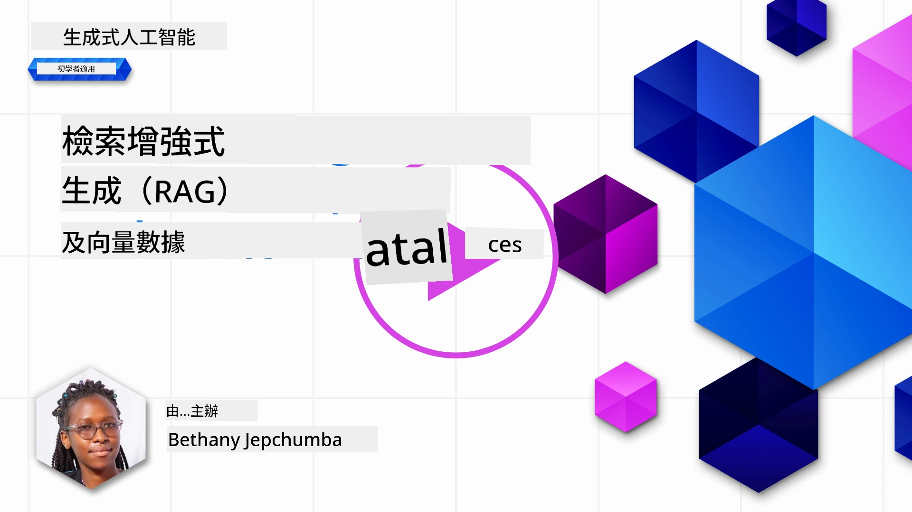
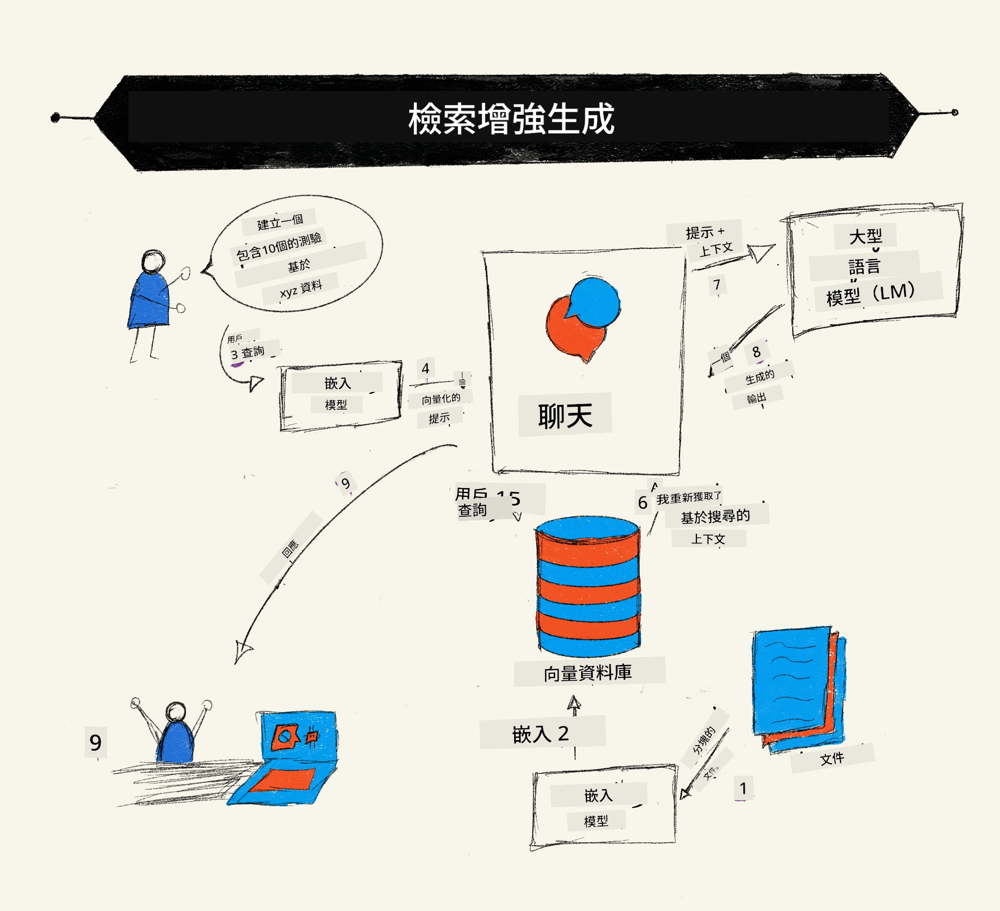
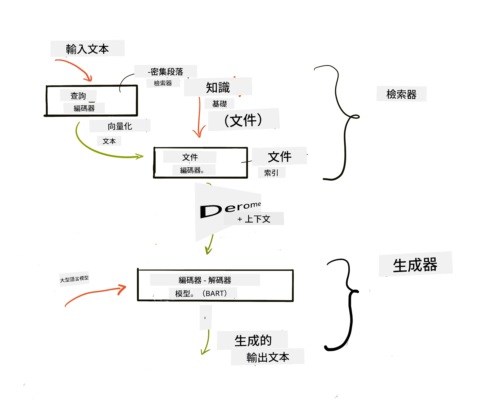
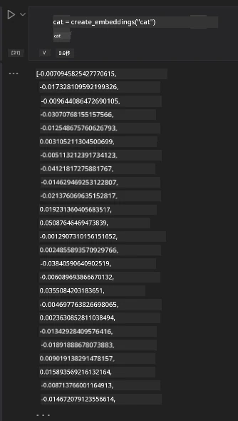

# 檢索增強生成（RAG）與向量資料庫

[](https://youtu.be/4l8zhHUBeyI?si=BmvDmL1fnHtgQYkL)

在搜尋應用程式課程中，我們簡要學習了如何將您自己的數據整合至大型語言模型（LLM）。在本課程中，我們將更深入探討在LLM應用中將您的數據接地的概念、過程機制及數據儲存方法，包括向量嵌入與文本。

> <strong>影片即將推出</strong>

## 介紹

在本課程中，我們將涵蓋以下內容：

- 介紹RAG是什麼以及為何在人工智能（AI）中使用。

- 了解什麼是向量資料庫並建立一個用於我們應用程式的資料庫。

- 介紹如何把RAG整合到應用程式的實際範例。

## 學習目標

完成本課程後，您將能夠：

- 解釋RAG在資料檢索與處理中的重要性。

- 設定RAG應用並將您的數據接地至LLM。

- 有效整合RAG與向量資料庫於LLM應用中。

## 我們的情境：利用我們自己的數據增強LLM

在本課程中，我們想將我們自己的筆記加入教育初創企業，讓聊天機器人可以獲得更多不同主題的資訊。利用我們現有的筆記，學習者能更有效學習並理解不同主題，方便他們複習考試。為了創建此情境，我們將使用：

- `Azure OpenAI:` 我們將用來建立聊天機器人的LLM

- `AI for beginners' lesson on Neural Networks`: 作為我們接地LLM的數據

- `Azure AI Search` 與 `Azure Cosmos DB:` 用於儲存數據與建立搜尋索引的向量資料庫

使用者將能根據筆記創建練習測驗、複習提示卡並將其摘要成簡潔概述。開始之前，先來看什麼是RAG及其運作方式：

## 檢索增強生成（RAG）

LLM驅動的聊天機器人處理用戶提示以生成回應。它設計成具有互動性，並能涵蓋廣泛主題。但回應僅限於提供的上下文及其基礎訓練資料。例如，GPT-4的知識截止於2021年9月，代表它不具備該期間後的事件知識。此外，用於訓練LLM的數據排除了機密資訊，如個人筆記或公司的產品手冊。

### RAG如何運作



假設您想部署一個能從您的筆記建立測驗的聊天機器人，則需要連接知識庫。這就是RAG大顯神通之處。RAG的運作如下：

- **知識庫:** 檢索前，這些文件需先被吸收並預處理，通常是將大型文件拆分成較小的區塊，轉換為文本嵌入並儲存在資料庫中。

- **用戶查詢:** 用戶提出問題。

- **檢索:** 當用戶提出問題時，嵌入模型從知識庫中檢索相關資訊，以提供更多上下文，並將其納入提示中。

- **增強生成:** LLM根據檢索到的資料增強其回應。它使得生成的回答不僅基於預訓練資料，也結合了新增上下文的相關資訊。檢索到的資料用於增強LLM的回應。然後LLM回答用戶的問題。



RAG架構以transformers實現，包含兩部分：編碼器與解碼器。舉例來說，當用戶提出問題時，輸入文本「編碼」成捕捉詞義的向量，這些向量被「解碼」進入文件索引並根據用戶查詢生成新文本。LLM使用編碼器-解碼器模型來生成輸出。

根據提議論文 [Retrieval-Augmented Generation for Knowledge intensive NLP (natural language processing software) Tasks](https://arxiv.org/pdf/2005.11401.pdf?WT.mc_id=academic-105485-koreyst)，實作RAG有兩種方法：

- **_RAG-Sequence_** 利用檢索到的文件預測對用戶查詢的最佳答案

- **RAG-Token** 使用文件來生成下一個標記，然後檢索它們以回答用戶查詢

### 為何要使用RAG？ 

- **資訊豐富度：** 確保文本回應是最新且時效的，通過存取內部知識庫提升特定領域任務表現。

- 藉由利用知識庫內的<strong>可驗證數據</strong>提供查詢上下文，減少了憑空捏造的情況。

- 它是<strong>成本效益高</strong>的，較起微調LLM來說更經濟實惠。

## 建立知識庫

我們的應用程式基於我們的個人數據，也就是AI初學者課程的神經網路課程。

### 向量資料庫

向量資料庫與傳統資料庫不同，它是專門設計來儲存、管理及搜尋嵌入向量的資料庫。它存儲文件的數值表示。將資料拆解為數值嵌入，能讓我們的AI系統更容易理解與處理數據。

我們將嵌入儲存在向量資料庫中，因為LLM對輸入的token數量有限制。無法將整個嵌入一次性輸入LLM，因此我們需拆分成多個區塊，當用戶提出問題時，最相關的嵌入會連同提示一同回傳。拆塊也能降低傳入LLM的token數，降低成本。

常見的向量資料庫包括Azure Cosmos DB、Clarifyai、Pinecone、Chromadb、ScaNN、Qdrant及DeepLake。您可以使用Azure CLI透過以下指令建立Azure Cosmos DB模型：

```bash
az login
az group create -n <resource-group-name> -l <location>
az cosmosdb create -n <cosmos-db-name> -r <resource-group-name>
az cosmosdb list-keys -n <cosmos-db-name> -g <resource-group-name>
```

### 從文本到嵌入

在儲存數據前，我們需將其轉換為向量嵌入。若處理大型文件或長文本，可根據預期查詢拆分成不同區塊。拆分可在句子層級或段落層級進行。由於拆分是根據周遭詞彙意義，因此可為區塊加入上下文，例如文件標題或前後文本。您可以這樣拆分數據：

```python
def split_text(text, max_length, min_length):
    words = text.split()
    chunks = []
    current_chunk = []

    for word in words:
        current_chunk.append(word)
        if len(' '.join(current_chunk)) < max_length and len(' '.join(current_chunk)) > min_length:
            chunks.append(' '.join(current_chunk))
            current_chunk = []

    # 如果最後一個區塊未達到最小長度，仍然添加它
    if current_chunk:
        chunks.append(' '.join(current_chunk))

    return chunks
```

拆分後，我們使用不同的嵌入模型進行文本嵌入。一些您可以使用的模型包括word2vec、OpenAI的ada-002、Azure Computer Vision等。選擇模型依語言、內容類型（文本/圖片/音訊）、可編碼的輸入大小及嵌入輸出長度而定。

使用OpenAI的 `text-embedding-ada-002` 模型嵌入文本的範例如下：


## 檢索與向量搜尋

當用戶提出問題時，檢索器會使用查詢編碼器將其轉成向量，然後在文件搜尋索引中尋找與輸入相關的向量。一旦找到，會將輸入向量與文件向量轉回文本，並傳送給LLM。

### 檢索

檢索指系統快速尋找符合搜尋條件的索引文件。檢索器目標是獲取用於提供上下文、將LLM接地在數據上的文件。

對資料庫進行搜尋的方法有：

- <strong>關鍵字搜尋</strong> - 用於文字搜尋

- <strong>向量搜尋</strong> - 將文件由文字轉成向量表示，使用嵌入模型，使得搜尋能根據詞義進行<strong>語意搜尋</strong>。檢索過程透過查找與用戶提問向量最相近的文件向量完成。

- <strong>混合搜尋</strong> - 結合關鍵字搜尋與向量搜尋。

檢索的挑戰在於，若資料庫中無相似答案，系統仍會回傳最佳資訊。可設定最大距離判斷相關性，或用混合搜尋結合關鍵字與向量搜尋。本課程中，我們使用混合搜尋，將數據存於包含區塊與嵌入的資料表中。

### 向量相似性

檢索器會在知識庫中搜尋相近的嵌入，即最近鄰，因為它們代表相似文本。用戶提問時，系統首先將查詢嵌入，再與嵌入庫做匹配。常用的相似度衡量方法是餘弦相似度，基於兩向量之間的夾角。

我們也可用其他方法衡量相似性，如歐氏距離（向量端點間的直線距離）和點積（兩向量對應元素乘積之和）。

### 搜尋索引

執行檢索前，我們需要為知識庫建立搜尋索引。索引會儲存嵌入，能在龐大資料庫中快速定位最相似的區塊。我們可使用以下指令在本地創建索引：

```python
from sklearn.neighbors import NearestNeighbors

embeddings = flattened_df['embeddings'].to_list()

# 建立搜尋索引
nbrs = NearestNeighbors(n_neighbors=5, algorithm='ball_tree').fit(embeddings)

# 要查詢索引，可以使用 kneighbors 方法
distances, indices = nbrs.kneighbors(embeddings)
```

### 重新排序

查詢資料庫後，可能需要依相關性排序結果。重新排序的LLM利用機器學習提升搜尋結果的相關性，從最相關的開始排序。使用Azure AI Search，重新排序會自動透過語義重新排序器完成。以下示例說明鄰近重排序的運作方式：

```python
# 尋找最相似的文件
distances, indices = nbrs.kneighbors([query_vector])

index = []
# 列印最相似的文件
for i in range(3):
    index = indices[0][i]
    for index in indices[0]:
        print(flattened_df['chunks'].iloc[index])
        print(flattened_df['path'].iloc[index])
        print(flattened_df['distances'].iloc[index])
    else:
        print(f"Index {index} not found in DataFrame")
```

## 整合應用

最後一步是將LLM加入，以便獲得基於我們數據的回應。我們可按如下實作：

```python
user_input = "what is a perceptron?"

def chatbot(user_input):
    # 將問題轉換為查詢向量
    query_vector = create_embeddings(user_input)

    # 找出最相似的文件
    distances, indices = nbrs.kneighbors([query_vector])

    # 將文件加入查詢以提供上下文
    history = []
    for index in indices[0]:
        history.append(flattened_df['chunks'].iloc[index])

    # 合併歷史記錄和用戶輸入
    history.append(user_input)

    # 建立訊息對象
    messages=[
        {"role": "system", "content": "You are an AI assistant that helps with AI questions."},
        {"role": "user", "content": "\n\n".join(history) }
    ]

    # 使用回應 API 生成回應
    response = client.responses.create(
        model="gpt-4o-mini",
        temperature=0.7,
        max_output_tokens=800,
        input=messages,
        store=False,
    )

    return response.output_text

chatbot(user_input)
```

## 評估我們的應用程式

### 評估指標

- 回應的質量，確保語句自然、流暢且具人類風格

- 數據接地性：評估回應是否確實來自提供的文件

- 相關性：評估回應是否符合且與所提問題相關

- 流暢度：評估回應是否文法通順

## RAG（檢索增強生成）與向量資料庫的應用場景

函式呼叫能提升您的應用程式的多種場景，包括：

- 問答系統：將公司數據接地至聊天機器人，方便員工提出問題。

- 推薦系統：建立系統匹配最相似的項目，如電影、餐廳等。

- 聊天機器人服務：儲存聊天記錄，根據用戶數據個人化對話。

- 基於向量嵌入的圖片搜尋，適用於影像識別與異常偵測。

## 總結

我們涵蓋了RAG的基本範疇，包括將數據加進應用、用戶查詢及輸出。為簡化創建RAG，您可使用如Semanti Kernel、Langchain或Autogen等框架。

## 作業

延續您對檢索增強生成（RAG）的學習，您可以建立：

- 使用您選擇的框架建立應用程式前端

- 使用LangChain或Semantic Kernel框架重建您的應用程式。

恭喜完成本課程 👏。

## 學習永不止步，繼續前行

完成本課程後，請瀏覽我們的[生成式AI學習合集](https://aka.ms/genai-collection?WT.mc_id=academic-105485-koreyst)，持續提升您的生成式AI知識！

---

<!-- CO-OP TRANSLATOR DISCLAIMER START -->
**免責聲明**：
本文件使用 AI 翻譯服務 [Co-op Translator](https://github.com/Azure/co-op-translator) 進行翻譯。雖然我們力求準確，但請注意，自動翻譯可能包含錯誤或不準確之處。原始文件的母語版本應被視為權威來源。對於重要資訊，建議尋求專業人工翻譯。我們不對因使用本翻譯而引起的任何誤解或曲解承擔責任。
<!-- CO-OP TRANSLATOR DISCLAIMER END -->