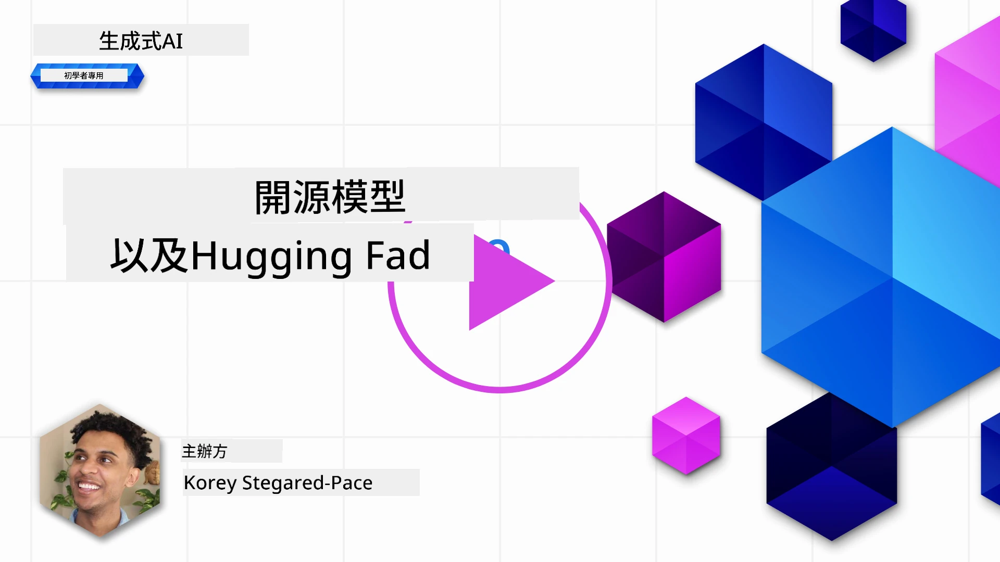

## 介紹

開源大型語言模型（LLMs）的世界令人興奮且不斷演變。本課程旨在深入探討開源模型。如果您想了解專有模型與開源模型的比較，請前往[「探索與比較不同的LLMs」課程](../02-exploring-and-comparing-different-llms/README.md?WT.mc_id=academic-105485-koreyst)。本課程亦會涵蓋微調的主題，但更詳細的說明可參考[「微調LLMs」課程](../18-fine-tuning/README.md?WT.mc_id=academic-105485-koreyst)。

## 學習目標

- 了解開源模型
- 理解使用開源模型的好處
- 探索 Hugging Face 與 Azure AI Studio 上可用的開源模型

## 什麼是開源模型？

開源軟件在各個領域的技術發展中扮演了關鍵角色。開源倡議組織（OSI）定義了[軟件開源的10項標準](https://web.archive.org/web/20241126001143/https://opensource.org/osd?WT.mc_id=academic-105485-koreyst)，源代碼必須在OSI批准的許可證下公開共享。

雖然大型語言模型的開發與軟件開發有相似之處，但過程並不完全相同。這在社群中引發了關於LLMs開源定義的廣泛討論。若要符合傳統開源定義，模型應公開以下資訊：

- 用於訓練模型的數據集。
- 作為訓練一部分的完整模型權重。
- 評估代碼。
- 微調代碼。
- 完整模型權重與訓練指標。

目前只有少數模型符合這些標準。[由艾倫人工智能研究所（AllenAI）創建的 OLMo 模型](https://huggingface.co/allenai/OLMo-7B?WT.mc_id=academic-105485-koreyst) 就屬於此類。

在本課程中，我們將稱這些模型為「開源模型」，因為它們在撰寫時可能尚未完全符合上述標準。

## 開源模型的好處

**高度可定制** — 由於開源模型附帶詳細的訓練資訊，研究人員和開發者可以修改模型內部結構，從而創建針對特定任務或研究領域微調的專門模型。例如代碼生成、數學運算和生物學等。

**成本** — 使用和部署這些模型的每個標記成本低於專有模型。構建生成式AI應用時，應根據您的使用案例評估性能與價格的平衡。

來源：Artificial Analysis

**靈活性** — 使用開源模型讓您在使用不同模型或將它們結合時更具彈性。例如，[HuggingChat 助手](https://huggingface.co/chat?WT.mc_id=academic-105485-koreyst)允許用戶直接在介面中選擇使用的模型：

## 探索不同的開源模型

### Llama 2

[Meta 開發的 Llama 2](https://huggingface.co/meta-llama?WT.mc_id=academic-105485-koreyst)是一款針對聊天應用優化的開源模型。這得益於其微調方法，包含大量對話和人類反饋，使模型產出更符合人類期望，提升用戶體驗。

Llama 的微調版本包括專注於日語的[Japanese Llama](https://huggingface.co/elyza/ELYZA-japanese-Llama-2-7b?WT.mc_id=academic-105485-koreyst)和基礎模型的增強版[Llama Pro](https://huggingface.co/TencentARC/LLaMA-Pro-8B?WT.mc_id=academic-105485-koreyst)。

### Mistral

[Mistral](https://huggingface.co/mistralai?WT.mc_id=academic-105485-koreyst)是一款注重高效能與效率的開源模型。它採用專家混合（Mixture-of-Experts）方法，將多個專門模型組合成一個系統，根據輸入選擇特定模型使用，使計算更有效率，僅處理其專長的輸入。

Mistral 的微調版本包括專注醫療領域的[BioMistral](https://huggingface.co/BioMistral/BioMistral-7B?text=Mon+nom+est+Thomas+et+mon+principal?WT.mc_id=academic-105485-koreyst)和執行數學運算的[OpenMath Mistral](https://huggingface.co/nvidia/OpenMath-Mistral-7B-v0.1-hf?WT.mc_id=academic-105485-koreyst)。

### Falcon

[Falcon](https://huggingface.co/tiiuae?WT.mc_id=academic-105485-koreyst)是由科技創新研究所（**TII**）開發的LLM。Falcon-40B擁有400億參數，據稱在較低計算資源下表現優於GPT-3。這得益於其使用的FlashAttention算法和多查詢注意力機制，減少推理時的記憶體需求。推理時間縮短使 Falcon-40B 適合聊天應用。

Falcon 的微調版本包括基於開源模型打造的[OpenAssistant](https://huggingface.co/OpenAssistant/falcon-40b-sft-top1-560?WT.mc_id=academic-105485-koreyst)助理和性能優於基礎模型的[GPT4ALL](https://huggingface.co/nomic-ai/gpt4all-falcon?WT.mc_id=academic-105485-koreyst)。

## 如何選擇

選擇開源模型沒有唯一答案。建議先使用 Azure AI Studio 的任務篩選功能，了解模型訓練的任務類型。Hugging Face 也維護一個LLM排行榜，根據特定指標展示最佳表現模型。

若想比較不同類型的LLMs，[Artificial Analysis](https://artificialanalysis.ai/?WT.mc_id=academic-105485-koreyst)是另一個很好的資源：

來源：Artificial Analysis

針對特定使用案例，尋找專注於相同領域的微調版本會很有效。嘗試多個開源模型，根據您和用戶的期望評估其表現，也是良好做法。

## 下一步

開源模型的最大優點是您可以很快開始使用。請查看[Azure AI Foundry 模型目錄](https://ai.azure.com?WT.mc_id=academic-105485-koreyst)，其中包含我們在此討論的 Hugging Face 模型集合。

## 學習不止於此，繼續您的旅程

完成本課程後，請參考我們的[生成式AI學習合集](https://aka.ms/genai-collection?WT.mc_id=academic-105485-koreyst)，持續提升您的生成式AI知識！

---

<!-- CO-OP TRANSLATOR DISCLAIMER START -->
**免責聲明**：  
本文件係使用人工智能翻譯服務 [Co-op Translator](https://github.com/Azure/co-op-translator) 進行翻譯。雖然我哋致力於確保準確性，但請注意，自動翻譯可能包含錯誤或不準確之處。原始文件之母語版本應被視為權威來源。對於重要資訊，建議採用專業人工翻譯。我哋對因使用本翻譯而引致之任何誤解或誤釋概不負責。
<!-- CO-OP TRANSLATOR DISCLAIMER END -->