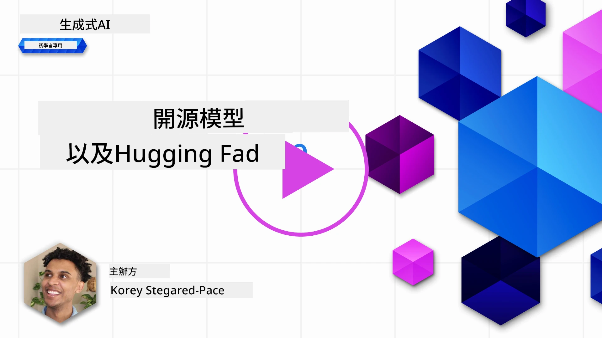
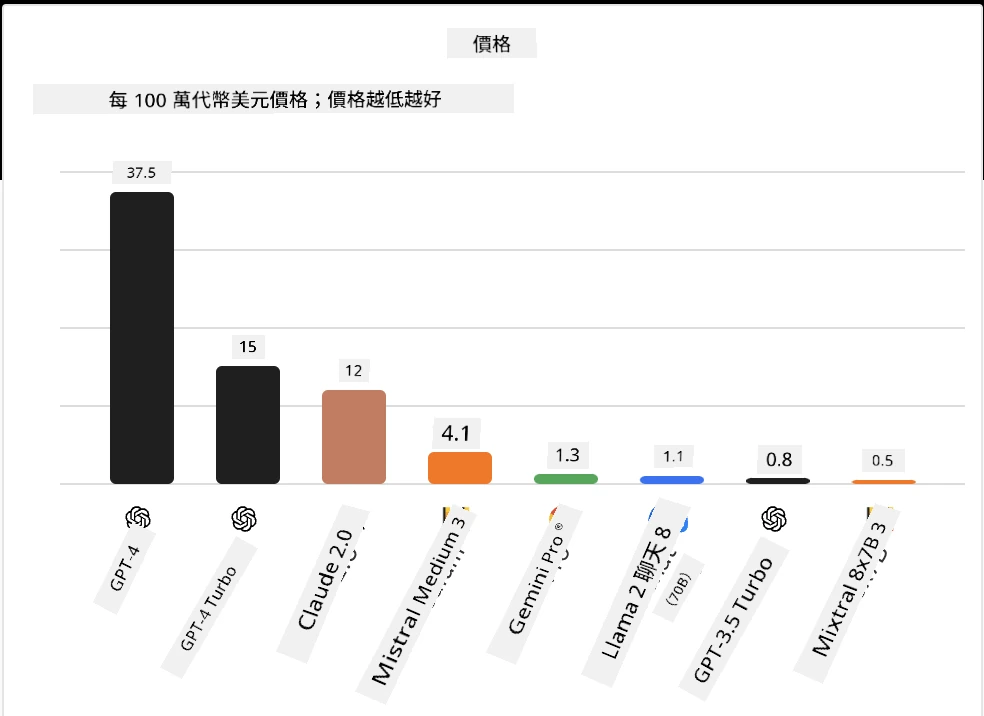
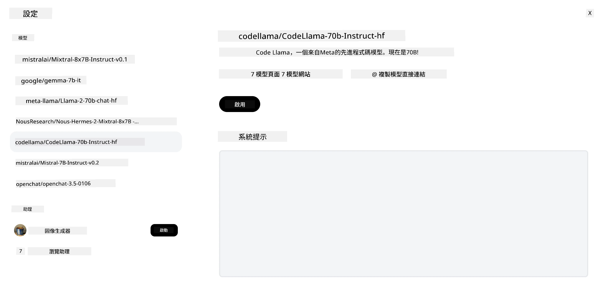
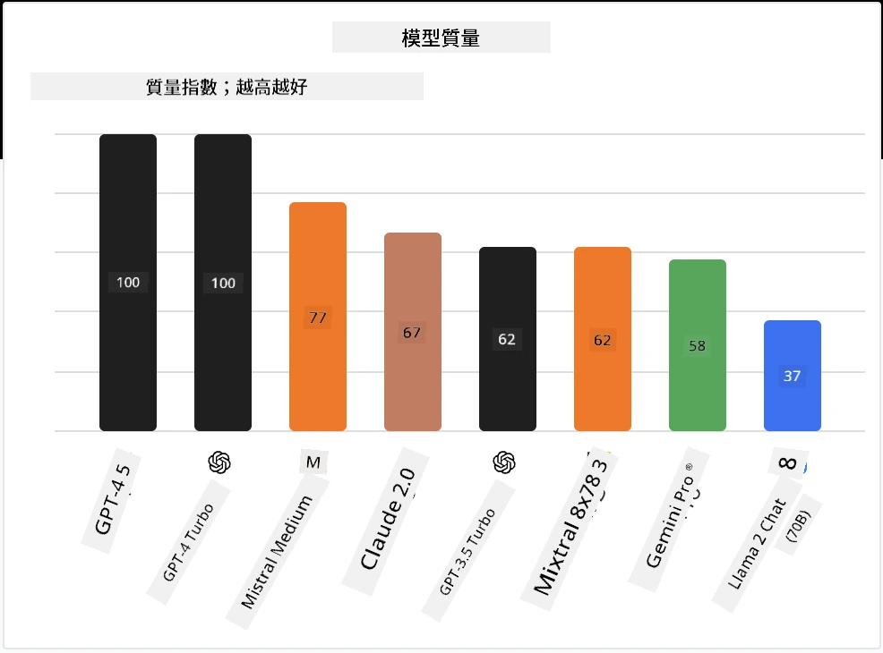

## 介紹

開源大型語言模型的世界令人振奮且不斷演變。本課程旨在深入探討開源模型。如果你正在尋找有關專有模型與開源模型比較的資訊，請參閱[「探索與比較不同大型語言模型」課程](../02-exploring-and-comparing-different-llms/README.md?WT.mc_id=academic-105485-koreyst)。本課程亦會涵蓋微調的主題，但更詳細的解釋可參考[「大型語言模型微調」課程](../18-fine-tuning/README.md?WT.mc_id=academic-105485-koreyst)。

## 學習目標

- 瞭解開源模型
- 理解使用開源模型的好處
- 探索 Hugging Face 和 Microsoft Foundry 模型目錄上可用的開源模型

## 什麼是開源模型？

開源軟體在促進各領域技術發展上扮演重要角色。開源倡議組織 (OSI) 定義了[開源軟體的 10 條標準](https://web.archive.org/web/20241126001143/https://opensource.org/osd?WT.mc_id=academic-105485-koreyst)，源代碼必須在 OSI 認可的授權下公開分享。

儘管大型語言模型的開發與軟體開發有相似之處，但過程並不完全相同。這在社群中引發對大型語言模型開源定義的討論。若要符合傳統開源定義，模型須公開下列資訊：

- 用於訓練模型的數據集
- 完整的模型權重作為訓練資料的一部分
- 評估代碼
- 微調代碼
- 完整的模型權重與訓練指標

目前只有少數模型符合此標準。[Allen AI 所開發的 OLMo 模型](https://huggingface.co/allenai/OLMo-7B?WT.mc_id=academic-105485-koreyst) 就屬於這類。

在本課程中，我們將稱這些模型為「開放模型」，因為在撰寫時他們可能尚未完全符合上述標準。

## 開放模型的好處

<strong>高度可定制</strong> — 由於開放模型釋出時包含詳細的訓練資訊，研究人員和開發者可以修改模型內部結構，從而創建為特定任務或領域精細調整的專門模型。例如代碼生成、數學運算和生物學等領域。

<strong>成本</strong> — 使用與部署這些模型的每個 token 成本低於專有模型。在建立生成式人工智能應用時，應評估這些模型在你的使用案例中的效能與價格比。

資料來源：Artificial Analysis

<strong>彈性</strong> — 使用開放模型可讓你在使用不同模型或結合多模型方面更加靈活。舉例來說，[HuggingChat 助手](https://huggingface.co/chat?WT.mc_id=academic-105485-koreyst) 用戶可以直接在介面中選擇使用的模型：

## 探索不同的開放模型

### Llama 2

[Llama 2](https://huggingface.co/meta-llama?WT.mc_id=academic-105485-koreyst) 是由 Meta 開發的開放模型，優化用於聊天應用。這得益於其微調方法，包含大量對話與人類反饋，使模型能生成更符合人類期望的結果，提供更好的使用者體驗。

一些微調版本的例子包括專長於日語的 [Japanese Llama](https://huggingface.co/elyza/ELYZA-japanese-Llama-2-7b?WT.mc_id=academic-105485-koreyst) ，以及基礎模型的加強版 [Llama Pro](https://huggingface.co/TencentARC/LLaMA-Pro-8B?WT.mc_id=academic-105485-koreyst)。

### Mistral

[Mistral](https://huggingface.co/mistralai?WT.mc_id=academic-105485-koreyst) 是一個強調高效與高效能的開放模型。它採用專家混合（Mixture-of-Experts）方法，將一組專門模型整合成一個系統，根據輸入選擇使用相應模型。這使計算更有效率，因為每個模型只處理自己專長的輸入。

Mistral 的微調版本例子包括專注醫療領域的 [BioMistral](https://huggingface.co/BioMistral/BioMistral-7B?text=Mon+nom+est+Thomas+et+mon+principal?WT.mc_id=academic-105485-koreyst) 和執行數學運算的 [OpenMath Mistral](https://huggingface.co/nvidia/OpenMath-Mistral-7B-v0.1-hf?WT.mc_id=academic-105485-koreyst)。

### Falcon

[Falcon](https://huggingface.co/tiiuae?WT.mc_id=academic-105485-koreyst) 由科技創新研究院（**TII**）打造。Falcon-40B 以 400 億參數訓練，據報告在較低計算資源下性能超越 GPT-3。這得益於其使用 FlashAttention 演算法和多查詢注意力機制，降低推論時的記憶體需求。推論時間降低使 Falcon-40B 適合聊天應用。

Falcon 的微調版本例子包括基於開放模型構建的助理 [OpenAssistant](https://huggingface.co/OpenAssistant/falcon-40b-sft-top1-560?WT.mc_id=academic-105485-koreyst) 和性能超越基礎模型的 [GPT4ALL](https://huggingface.co/nomic-ai/gpt4all-falcon?WT.mc_id=academic-105485-koreyst)。

## 如何選擇

選擇開放模型沒有唯一答案。可以先使用 Microsoft Foundry 模型目錄的「按任務篩選」功能，幫助了解模型所訓練的任務類型。Hugging Face 也維護大型語言模型排行榜，展示在特定指標上表現最佳的模型。

想要跨不同類型比較大型語言模型，[Artificial Analysis](https://artificialanalysis.ai/?WT.mc_id=academic-105485-koreyst) 是另一個很棒的資源：

資料來源：Artificial Analysis

若針對特定使用案例，尋找專注相同領域的微調版本會很有效。嘗試多款開放模型，觀察它們在你與使用者期望上的表現也是個好方法。

## 下一步

開放模型最大好處是能快速開始使用。查看[Microsoft Foundry 模型目錄](https://ai.azure.com?WT.mc_id=academic-105485-koreyst)，裡面有我們在此討論的模型的 Hugging Face 專屬集合。

## 學習不止於此，繼續探索之旅

完成本課程後，歡迎參考我們的[生成式人工智能學習合集](https://aka.ms/genai-collection?WT.mc_id=academic-105485-koreyst)，持續提升你在生成式人工智能領域的知識！

---

<!-- CO-OP TRANSLATOR DISCLAIMER START -->
**免責聲明**：
本文件使用 AI 翻譯服務 [Co-op Translator](https://github.com/Azure/co-op-translator) 進行翻譯。雖然我們力求準確，但請注意，自動翻譯可能包含錯誤或不準確之處。原始文件的母語版本應被視為權威來源。對於重要資訊，建議尋求專業人工翻譯。我們不對因使用本翻譯而引起的任何誤解或曲解承擔責任。
<!-- CO-OP TRANSLATOR DISCLAIMER END -->