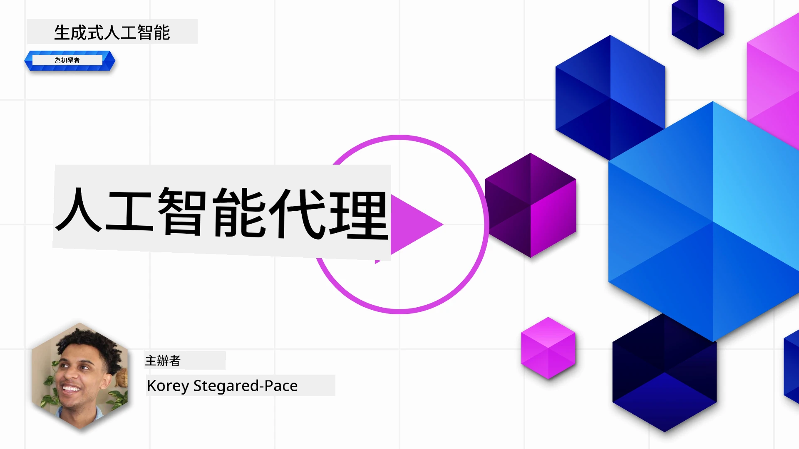
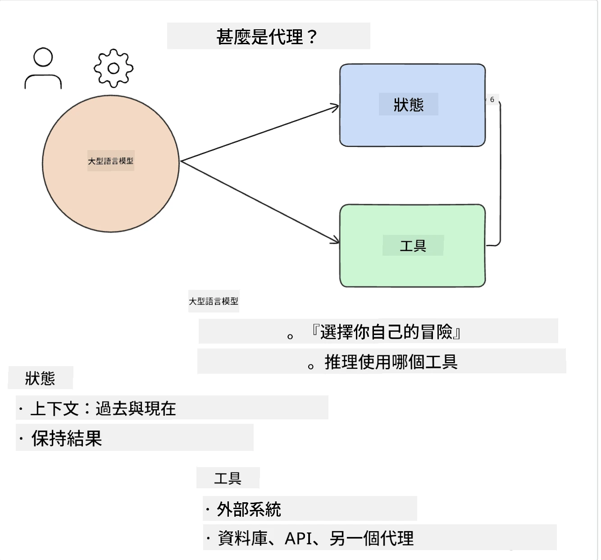
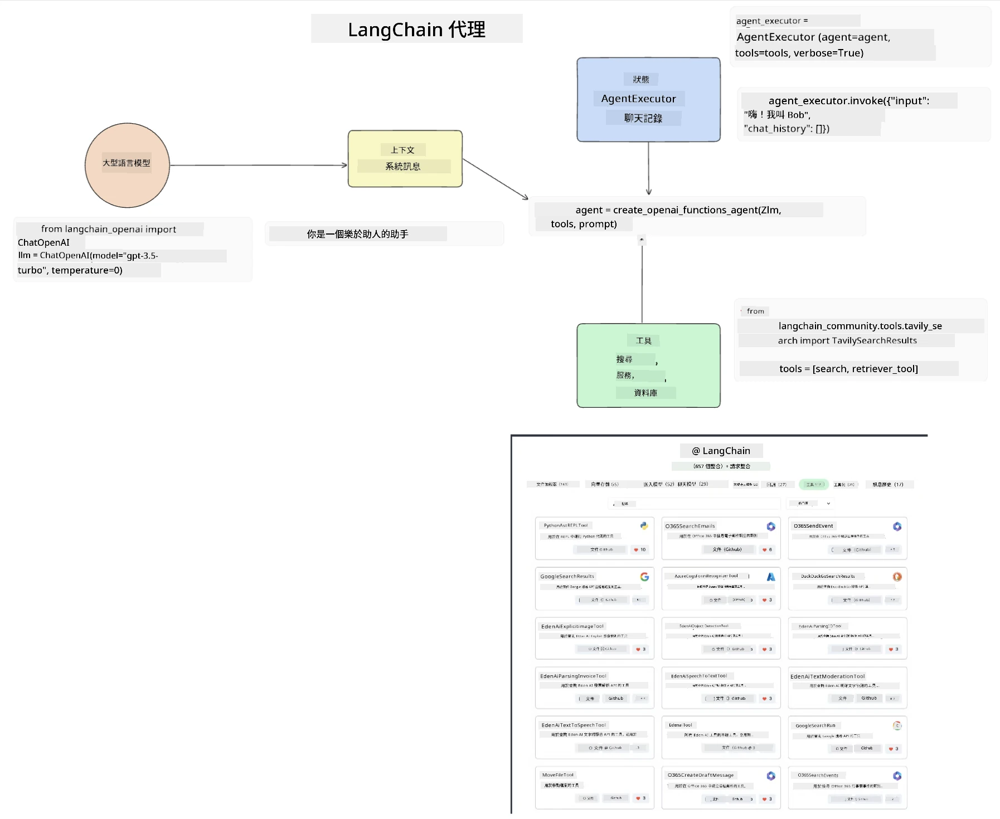
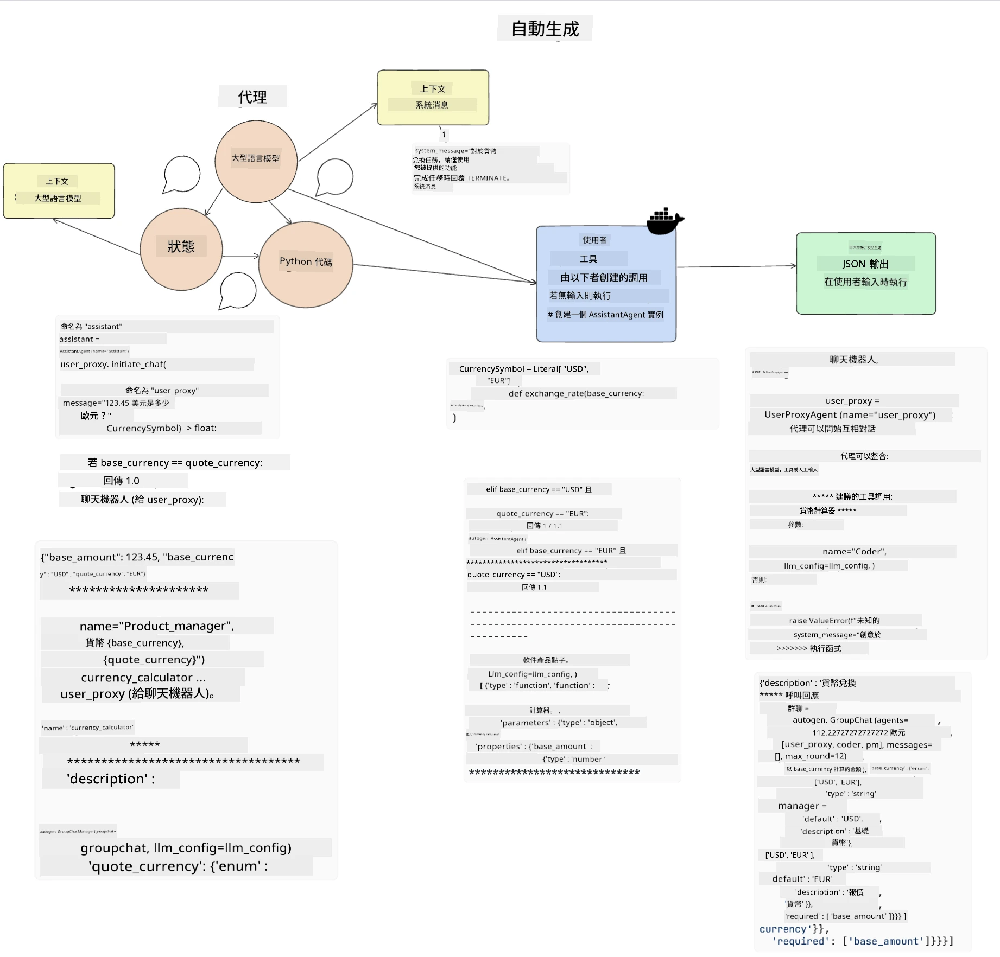
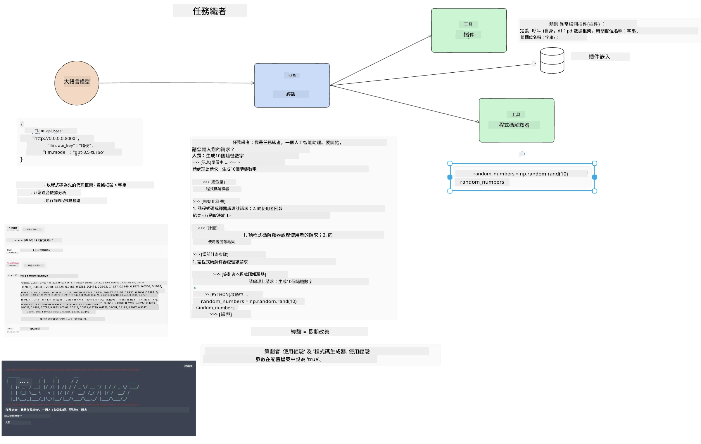
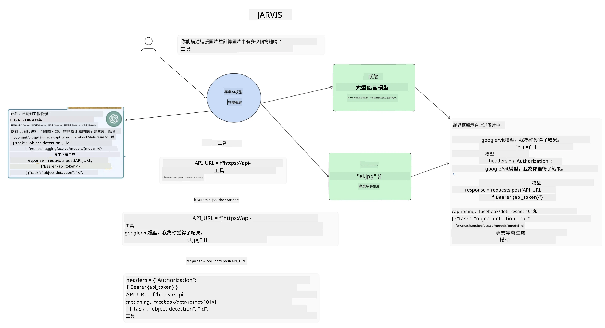

[](https://youtu.be/yAXVW-lUINc?si=bOtW9nL6jc3XJgOM)

## 介紹

AI Agents 代表了生成式 AI 的一個令人振奮的發展，使大型語言模型（LLMs）從助理演變為能夠採取行動的代理。AI Agent 框架讓開發人員創建應用程式，使 LLMs 能夠存取工具和狀態管理。這些框架還增強了可視性，讓用戶和開發者能監控 LLMs 計劃的行動，從而改善體驗管理。

本課程將涵蓋以下範疇：

- 了解什麼是 AI Agent — AI Agent 究竟是什麼？
- 探索四種不同的 AI Agent 框架 — 它們有什麼獨特之處？
- 將這些 AI Agents 應用於不同的使用場景 — 何時應該使用 AI Agents？

## 學習目標

完成本課程後，您將能夠：

- 解釋 AI Agents 是什麼以及它們如何被使用。
- 理解一些流行的 AI Agent 框架之間的差異及其不同之處。
- 了解 AI Agents 的運作方式，從而構建相關應用程式。

## 什麼是 AI Agents？

AI Agents 是生成式 AI 世界中非常令人振奮的領域。隨著這股熱潮，有時術語和應用會令人混淆。為了簡化並涵蓋大部分稱為 AI Agents 的工具，我們將使用以下定義：

AI Agents 讓大型語言模型（LLMs）透過取得 **狀態** 和 **工具** 來執行任務。



讓我們定義這些術語：

**大型語言模型** — 這指的是本課程中提及的模型，如 GPT-3.5、GPT-4、Llama-2 等。

**狀態** — 指的是 LLM 所處的上下文。LLM 使用其過去行動和當前上下文的資訊，指導其後續行動的決策。AI Agent 框架讓開發者更容易維護這個上下文。

**工具** — 為完成用戶請求並由 LLM 規劃的任務，LLM 需要取得工具的存取權。一些工具的例子包括資料庫、API、外部應用程序甚至其他 LLM！

這些定義將在我們探討它們如何被實現時，為您奠定良好的基礎。接下來讓我們探索幾個不同的 AI Agent 框架：

## LangChain Agents

[LangChain Agents](https://python.langchain.com/docs/how_to/#agents?WT.mc_id=academic-105485-koreyst) 是上述定義的實作。

為管理 **狀態**，它使用一個內建函式稱為 `AgentExecutor`。這個函式接受已定義的 `agent` 以及可用的 `tools`。

`Agent Executor` 同時儲存聊天記錄，以提供聊天的上下文。



LangChain 提供一個[工具目錄](https://integrations.langchain.com/tools?WT.mc_id=academic-105485-koreyst)，可匯入你的應用程式讓 LLM 獲得存取權。這些工具由社群及 LangChain 團隊製作。

您可以定義這些工具並傳給 `Agent Executor`。

可視性是談論 AI Agents 時另一個重要面向。對應用程式開發者來說，了解 LLM 使用哪個工具及其原因非常重要。為此，LangChain 團隊開發了 LangSmith。

## AutoGen

下一個我們將討論的 AI Agent 框架是 [AutoGen](https://microsoft.github.io/autogen/?WT.mc_id=academic-105485-koreyst)。AutoGen 的主要焦點是對話。Agents 同時是 **可對話的** 和 **可定制的**。

**可對話 —** LLMs 能與另一個 LLM 開始並持續對話，以完成任務。這是透過建立 `AssistantAgents` 並給予特定的系統訊息完成的。

```python

autogen.AssistantAgent( name="Coder", llm_config=llm_config, ) pm = autogen.AssistantAgent( name="Product_manager", system_message="Creative in software product ideas.", llm_config=llm_config, )

```
  
**可定制 —** Agents 不僅可以定義為 LLM，同時也可以是用戶或工具。作為開發者，你可以定義一個 `UserProxyAgent`，負責與用戶互動以提供任務完成的反饋。這些反饋可以決定是否繼續執行任務或停止。

```python
user_proxy = UserProxyAgent(name="user_proxy")
```
  
### 狀態和工具

要變更和管理狀態，一個助理 Agent 會生成 Python 代碼來完成任務。

以下是一個流程範例：



#### 以系統訊息定義 LLM

```python
system_message="For weather related tasks, only use the functions you have been provided with. Reply TERMINATE when the task is done."
```
  
該系統訊息指示此特定 LLM 哪些函數與其任務相關。記住，使用 AutoGen 時，你可以定義多個具有不同系統訊息的 AssistantAgents。

#### 聊天由用戶發起

```python
user_proxy.initiate_chat( chatbot, message="I am planning a trip to NYC next week, can you help me pick out what to wear? ", )

```
  
這條來自 user_proxy（人類）的訊息將啟動 Agent 探索應執行的可能函數過程。

#### 函數執行

```bash
chatbot (to user_proxy):

***** Suggested tool Call: get_weather ***** Arguments: {"location":"New York City, NY","time_periond:"7","temperature_unit":"Celsius"} ******************************************************** --------------------------------------------------------------------------------

>>>>>>>> EXECUTING FUNCTION get_weather... user_proxy (to chatbot): ***** Response from calling function "get_weather" ***** 112.22727272727272 EUR ****************************************************************

```
  
初始聊天處理後，Agent 將建議調用的工具。在此案例中，是名為 `get_weather` 的函數。根據你的配置，該函數可以自動執行並由 Agent 讀取，或依用戶輸入執行。

您可參考一份 [AutoGen 代碼範例](https://microsoft.github.io/autogen/docs/Examples/?WT.mc_id=academic-105485-koreyst)，以進一步了解如何開始構建。

## Taskweaver

下一個要探索的代理框架是 [Taskweaver](https://microsoft.github.io/TaskWeaver/?WT.mc_id=academic-105485-koreyst)。它被稱為「以代碼為先」的代理，因為它不僅是處理 `strings`，還能操作 Python 中的 DataFrames。這對數據分析和生成任務非常有用，例如製作圖表或生成隨機數字。

### 狀態和工具

為管理對話狀態，TaskWeaver 使用一個稱為 `Planner` 的概念。`Planner` 是一個 LLM，負責接收用戶請求並規劃完成請求所需的任務。

完成任務時，`Planner` 可使用稱為 `Plugins` 的工具集合。這些可以是 Python 類別或一般代碼解析器。這些插件會被存為嵌入，以利 LLM 更好地搜尋正確的插件。



以下是一個處理異常偵測的插件範例：

```python
class AnomalyDetectionPlugin(Plugin): def __call__(self, df: pd.DataFrame, time_col_name: str, value_col_name: str):
```
  
代碼會在執行前進行驗證。Taskweaver 另一個管理上下文的特色是 `experience`。Experience 允許將對話上下文長期儲存在 YAML 檔案中。這可以配置讓 LLM 隨時間在特定任務上透過先前對話持續學習改進。

## JARVIS

最後一個我們要探索的代理框架是 [JARVIS](https://github.com/microsoft/JARVIS?tab=readme-ov-file&WT.mc_id=academic-105485-koreyst)。JARVIS 的獨特之處在於它使用 LLM 來管理對話的 `state`，而 `tools` 則是其他 AI 模型。這些 AI 模型是專門執行特定任務的模型，如物件偵測、語音轉錄或圖像說明。



這個通用模型 LLM 接收用戶的請求，識別具體任務及完成任務所需的參數/資料。

```python
[{"task": "object-detection", "id": 0, "dep": [-1], "args": {"image": "e1.jpg" }}]
```
  
LLM 將請求格式化為專門的 AI 模型能理解的格式，如 JSON。AI 模型根據任務返回預測結果後，LLM 接收回應。

若任務需多個模型合作，它也會解讀這些模型的回應，然後整合以產生對用戶的最終回應。

以下範例展示當用戶請求圖像中的物件描述及計數時系統如何運作：

## 作業

若要繼續學習 AI Agents，您可以使用 AutoGen 構建：

- 一個模擬教育初創企業不同部門的商業會議應用程式。
- 建立系統訊息，引導 LLM 理解不同人設和優先事項，並讓用戶推銷新產品構想。
- LLM 接著應從每個部門生成跟進問題，以細化和改進推銷及產品構想。

## 學習不止於此，繼續啟程

完成本課程後，請參考我們的 [生成式 AI 學習集](https://aka.ms/genai-collection?WT.mc_id=academic-105485-koreyst)，持續提升您的生成式 AI 知識！

---

<!-- CO-OP TRANSLATOR DISCLAIMER START -->
**免責聲明**：  
本文件經由 AI 翻譯服務 [Co-op Translator](https://github.com/Azure/co-op-translator) 翻譯而成。儘管我們努力確保準確性，請注意自動翻譯可能存在錯誤或不準確之處。原文文件應視為權威來源。對於重要資訊，建議採用專業人工翻譯。我們不對因使用本翻譯所產生的任何誤解或誤釋負責。
<!-- CO-OP TRANSLATOR DISCLAIMER END -->