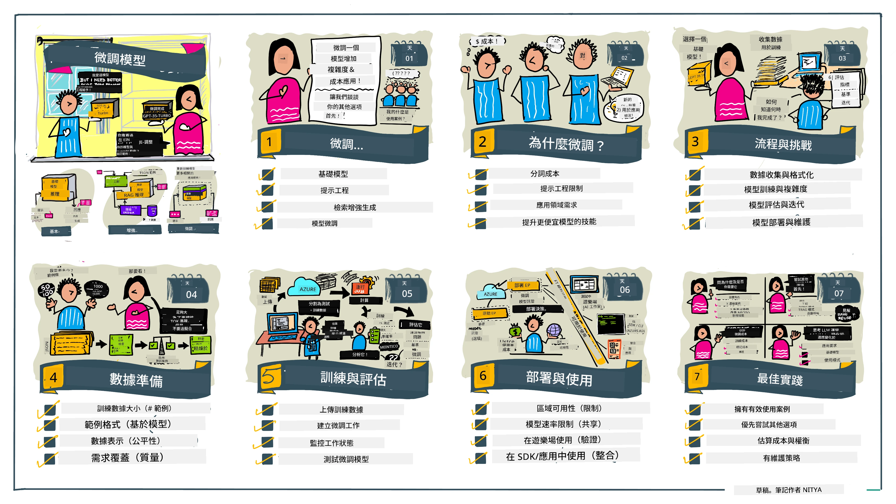

# 微調您的大型語言模型

使用大型語言模型來構建生成式人工智能應用程式帶來了新的挑戰。一個關鍵問題是確保模型根據用戶請求生成的內容的回應質量（準確性和相關性）。在之前的課程中，我們討論了像提示工程和檢索增強生成這些嘗試通過_修改現有模型的提示輸入_來解決問題的技術。

在今天的課程中，我們將討論第三種技術，**微調**，這種方法嘗試通過_用額外資料重新訓練模型自身_來解決挑戰。讓我們深入了解細節。

## 學習目標

本課程介紹了預訓練語言模型的微調概念，探討這種方法的優點與挑戰，並提供何時及如何使用微調來提升生成式人工智能模型性能的指導。

完成本課程後，您應該能回答以下問題：

- 什麼是語言模型的微調？
- 何時以及為什麼微調是有用的？
- 如何微調預訓練模型？
- 微調有哪些限制？

準備好了嗎？讓我們開始吧。

## 圖解指南

想在深入之前先了解我們將涵蓋的整體概念嗎？查看這個圖解指南，描述了本課程的學習旅程——從學習微調的核心概念與動機，到理解微調過程和執行微調任務的最佳實踐。這是個引人入勝的主題，不要忘了查看[資源](./RESOURCES.md?WT.mc_id=academic-105485-koreyst)頁面，獲取更多支持您自主學習的鏈接！

## 什麼是語言模型的微調？

按定義，大型語言模型是基於來自多元來源（包括網絡）的海量文本進行_預訓練_。正如我們在之前課程中學到的，我們需要像_提示工程_和_檢索增強生成_這類技術來提升模型對用戶問題（“提示”）的回應品質。

一種流行的提示工程技術是給模型更多指引，說明在回應中期待什麼，例如透過提供_指令_（明確指導）或_給幾個範例_（隱式指導）。這被稱為_少量示例學習_，但有兩個限制：

- 模型的字元令牌限制可能限制您能給出的範例數量，從而限制效果。
- 模型的令牌成本可能使每個提示增加範例變得昂貴，限制彈性。

微調是機器學習系統中的常見做法，我們會拿一個預訓練模型，並用新的資料重新訓練它，以提升它在特定任務上的表現。在語言模型的背景中，我們可以用_為特定任務或應用領域策劃的一組示例_來微調預訓練模型，從而創建一個**定製模型**，它可以在該特定任務或領域上更準確、更相關。微調的附帶好處還包括可減少少量示例學習所需的示例數量，從而減少令牌使用和相關成本。

## 何時以及為什麼要微調模型？

在_本_語境中，當我們談論微調時，指的是**有監督的**微調，該方法通過**添加原始訓練數據外的新數據**進行重新訓練。這與無監督微調方法不同，後者是對原始數據用不同超參數進行再訓練。

需要記住的關鍵是，微調是一種進階技術，需要一定專業知識才能達到預期效果。如果做得不正確，可能不會帶來預期的改進，甚至可能降低模型在目標領域的表現。

所以，在您學習「如何」微調語言模型之前，您需要知道「為什麼」要採用這條路，以及「何時」開始微調過程。先問自己這些問題：

- **使用案例**：您的微調_使用案例_是什麼？您想改進當前預訓練模型的哪方面？
- **替代方案**：您是否嘗試過_其他技術_來達成預期結果？利用它們建立基準比較。
  - 提示工程：嘗試使用相關提示回應範例的少量示例提示，評估回應品質。
  - 檢索增強生成：嘗試用從您數據中檢索的查詢結果增強提示，評估回應品質。
- **成本**：您是否評估過微調的成本？
  - 可調整性——預訓練模型是否可供微調？
  - 工作用量——準備訓練資料、評估與優化模型所需。
  - 運算——執行微調作業及部署微調模型所需。
  - 數據——是否可取得足夠質量的示例以發揮微調效果。
- **效益**：您是否確認過微調帶來的效益？
  - 質量——微調模型是否優於基準？
  - 成本——是否通過簡化提示減少令牌使用？
  - 可擴展性——您是否能將基模型重用於新領域？

回答這些問題後，您應該能判斷微調是否適合您的使用案例。理想情況下，只有當效益超過成本時，此方法才合理。一旦您決定繼續，就要開始思考_如何_微調預訓練模型。

想深入了解決策過程嗎？請觀看 [To fine-tune or not to fine-tune](https://www.youtube.com/watch?v=0Jo-z-MFxJs)

## 我們如何微調預訓練模型？

要微調預訓練模型，您需要：

- 一個可供微調的預訓練模型
- 用來微調的數據集
- 執行微調作業的訓練環境
- 部署微調模型的托管環境

## 微調實務

以下資源提供逐步教學，引導您通過使用選定模型和策劃數據集的實際範例來操作。要完成這些教學，您需要在相應服務提供商註冊帳戶，並能訪問相關模型和數據集。

| 服務提供者    | 教學                                                                                                                                                                        | 說明                                                                                                                                                                                                                                                                                                                                                                                                                             |
| ------------ | -------------------------------------------------------------------------------------------------------------------------------------------------------------------------- | -------------------------------------------------------------------------------------------------------------------------------------------------------------------------------------------------------------------------------------------------------------------------------------------------------------------------------------------------------------------------------------------------------------------------------- |
| OpenAI       | [如何微調聊天模型](https://github.com/openai/openai-cookbook/blob/main/examples/How_to_finetune_chat_models.ipynb?WT.mc_id=academic-105485-koreyst)                       | 學習如何為特定領域（「食譜助手」）微調 `gpt-35-turbo`，包括準備訓練資料、執行微調作業及使用微調後模型進行推理。                                                                                                                                                                                                                                                                                                                       |
| Azure OpenAI | [GPT 3.5 Turbo 微調教程](https://learn.microsoft.com/azure/ai-services/openai/tutorials/fine-tune?tabs=python-new%2Ccommand-line&WT.mc_id=academic-105485-koreyst)          | 學習如何在 **Azure** 上微調 `gpt-35-turbo-0613` 模型，涵蓋創建並上傳訓練資料、運行微調作業，部署並使用新模型。                                                                                                                                                                                                                                                                                                                         |
| Hugging Face | [使用 Hugging Face 微調大型語言模型](https://www.philschmid.de/fine-tune-llms-in-2024-with-trl?WT.mc_id=academic-105485-koreyst)                                        | 這篇部落格教您如何利用 [transformers](https://huggingface.co/docs/transformers/index?WT.mc_id=academic-105485-koreyst) 程式庫與 [Transformer Reinforcement Learning (TRL)](https://huggingface.co/docs/trl/index?WT.mc_id=academic-105485-koreyst)，並用 Hugging Face 的開放 [datasets](https://huggingface.co/docs/datasets/index?WT.mc_id=academic-105485-koreyst) 來微調開放大型語言模型（例如 `CodeLlama 7B`）。          |
|              |                                                                                                                                                                            |                                                                                                                                                                                                                                                                                                                                                                                                                                 |
| 🤗 AutoTrain | [使用 AutoTrain 微調大型語言模型](https://github.com/huggingface/autotrain-advanced/?WT.mc_id=academic-105485-koreyst)                                                    | AutoTrain（或 AutoTrain Advanced）是 Hugging Face 開發的 Python 函式庫，支持多種任務的微調，包括大型語言模型微調。AutoTrain 是一個免編碼解決方案，微調可在您自己的雲端、Hugging Face Spaces或本地完成。它支持網頁 GUI、命令列介面及使用 yaml 配置文件進行訓練。                                                                                                                                |
|              |                                                                                                                                                                            |                                                                                                                                                                                                                                                                                                                                                                                                                                 |
| 🦥 Unsloth   | [使用 Unsloth 微調大型語言模型](https://github.com/unslothai/unsloth)                                                                                                     | Unsloth 是一個開源框架，支持大型語言模型的微調和強化學習（RL）。Unsloth 精簡了本地訓練、評估和部署，並提供現成的[筆記本](https://github.com/unslothai/notebooks)。同時支持文字轉語音（TTS）、BERT 及多模態模型。開始之前，請閱讀他們的分步驟[微調大型語言模型指南](https://docs.unsloth.ai/get-started/fine-tuning-llms-guide)。                                                                                         |
|              |                                                                                                                                                                            |                                                                                                                                                                                                                                                                                                                                                                                                                                 |
## 作業

請選擇以上一個教學並跟著完成。_我們可能會在本儲存庫中以 Jupyter 筆記本形式複製這些教程的版本，僅作參考。請直接使用原始來源以獲得最新版本_。

## 很棒！繼續您的學習。

完成本課程後，請查看我們的[生成式人工智能學習合集](https://aka.ms/genai-collection?WT.mc_id=academic-105485-koreyst)，持續提升生成式人工智能知識！

恭喜！！您已完成此課程 v2 系列的最後一課！別停止學習與構建。**查看[資源](RESOURCES.md?WT.mc_id=academic-105485-koreyst)頁面，獲取更多關於此主題的附加建議。**

我們的 v1 系列課程也已更新，加入更多作業及概念。花點時間複習您的知識——並請[分享您的問題與反饋](https://github.com/microsoft/generative-ai-for-beginners/issues?WT.mc_id=academic-105485-koreyst)，幫助我們為社群改進這些課程。

---

<!-- CO-OP TRANSLATOR DISCLAIMER START -->
**免責聲明**：  
本文件由 AI 翻譯服務 [Co-op Translator](https://github.com/Azure/co-op-translator) 進行翻譯。雖然我們致力於準確性，但請注意，自動翻譯可能包含錯誤或不準確之處。原始文件的母語版本應視為權威來源。對於重要資訊，建議採用專業人工翻譯。本公司不對因使用此翻譯而產生的任何誤解或誤譯負責。
<!-- CO-OP TRANSLATOR DISCLAIMER END -->