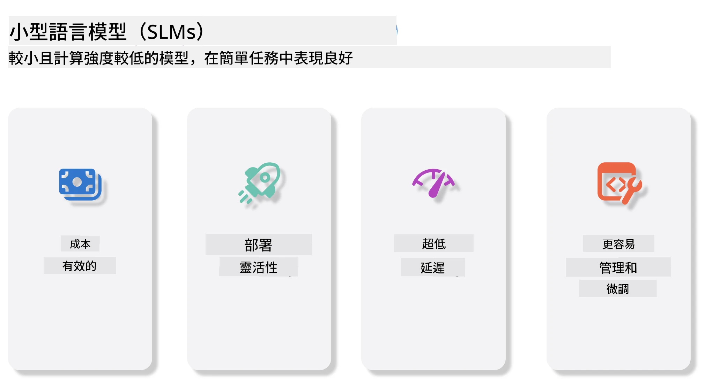
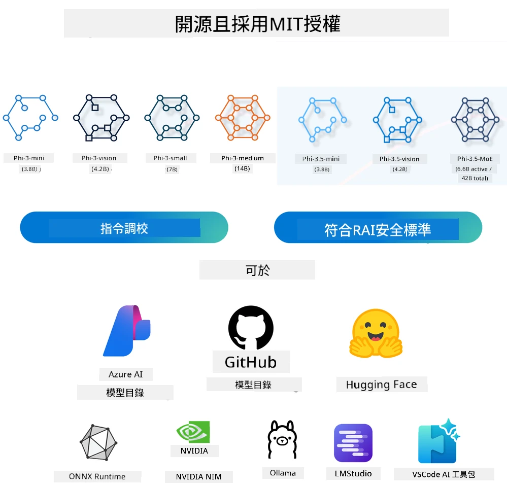
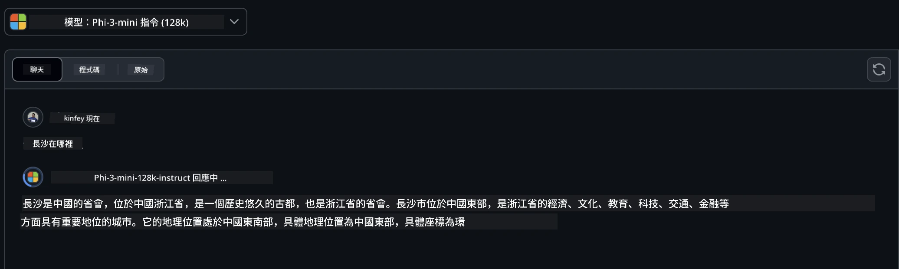
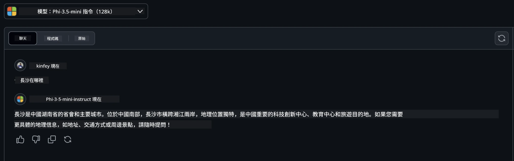

# 初學者生成式人工智能的小型語言模型介紹
生成式人工智能是人工智能領域中一個引人入勝的分支，專注於創建能夠生成新內容的系統。這些內容可以涵蓋文字、圖片、音樂，甚至整個虛擬環境。生成式人工智能最令人興奮的應用之一，就是語言模型的領域。

## 甚麼是小型語言模型？

小型語言模型（SLM）代表了大型語言模型（LLM）的縮小版本，採用了很多大型語言模型的架構原理和技術，同時大幅減少了運算資源的消耗。

SLM 是一種設計用於生成類似人類文字的語言模型子集。與 GPT-4 等大型模型相比，SLM 體積更小、效率更高，非常適合資源有限的應用場景。儘管體積較小，它們仍能執行多種任務。通常，SLM 是通過壓縮或蒸餾大型語言模型來構建的，目的是保留原始模型的大部分功能和語言能力。模型規模的縮小降低了整體複雜度，使 SLM 在記憶體使用和計算資源需求上更為高效。即使經過這些優化，SLM 仍可完成各類自然語言處理（NLP）任務：

- 文字生成：創建連貫且語境相關的句子或段落。
- 文字補全：根據給定提示預測並完成句子。
- 翻譯：將文本從一種語言轉換為另一種語言。
- 摘要：將長文本壓縮為更短、更易理解的摘要。

儘管在效能或理解深度方面，與大型模型相比存在一些取捨。

## 小型語言模型如何運作？
SLM 透過大量文字數據進行訓練。在訓練過程中，它們學習語言的模式和結構，使其能夠生成語法正確且語境適當的文字。訓練過程包括：

- 數據收集：從各種來源收集大量文本數據。
- 預處理：清理和組織數據，使其適合訓練。
- 訓練：使用機器學習算法教模型如何理解和生成文字。
- 微調：調整模型以提升特定任務中的性能。

SLM 的發展符合在資源受限環境（如移動設備或邊緣計算平台）中部署模型的需求，因為大型語言模型對資源消耗較大，往往不切實際。SLM 著重於效率，平衡效能與可用性，推動其在各領域的廣泛應用。



## 學習目標

本課程希望介紹 SLM 的知識，並結合 Microsoft Phi-3 學習文本內容、視覺和 MoE 的不同應用場景。

課程結束後，您應該能回答以下問題：

- 甚麼是 SLM？
- SLM 與 LLM 有甚麼不同？
- Microsoft Phi-3/3.5 家族是甚麼？
- 如何使用 Microsoft Phi-3/3.5 家族進行推理？

準備好了嗎？開始吧。

## 大型語言模型（LLM）與小型語言模型（SLM）的區別

LLM 和 SLM 都基於機率機器學習的基礎原則，並在架構設計、訓練方法、數據生成過程以及模型評估技術上採用相似做法。但有幾個關鍵因素區分了這兩種類型的模型。

## 小型語言模型的應用

SLM 有廣泛的應用領域，包括：

- 聊天機器人：提供客戶支持和與用戶進行對話。
- 內容創作：幫助寫作者生成想法或起草全文。
- 教育：協助學生完成寫作任務或學習新語言。
- 無障礙服務：為殘障人士創建工具，例如文字轉語音系統。

**尺寸**

LLM 與 SLM 最大的區別在於模型規模。LLM 如 ChatGPT（GPT-4）擁有約 1.76 兆參數，而開源的 SLM 如 Mistral 7B 則僅設計約 70 億參數。此差異主要來自模型架構和訓練流程的不同。例如，ChatGPT 採用編碼器-解碼器架構中的自注意力機制，而 Mistral 7B 採用滑動窗口注意力，讓解碼器專用模型更有效率訓練。這種架構差異對模型的複雜性和性能有深遠影響。

**理解能力**

SLM 通常優化於特定領域表現，使其非常專門化，但在提供跨多領域廣泛背景理解上可能有限。相對地，LLM 致力模擬更全面的人類智慧，因為它們在龐大且多元的數據集上訓練，能適應不同領域，提供更高的靈活性和適應性。因此，LLM 更適合於自然語言處理和程式設計等多樣化下游任務。

**計算需求**

訓練和部署 LLM 是資源密集型的過程，通常需要龐大的計算基礎設施，例如大規模 GPU 群集。以 ChatGPT 為例，從零開始訓練可能需動用數千 GPU，長期運行。相比之下，SLM 的較小參數量使其在計算資源方面更易取得。像 Mistral 7B 這類模型可以在配備中等 GPU 能力的本地機器上進行訓練和運行，但訓練仍需多 GPU 幾小時。

**偏見**

偏見是 LLM 中眾所周知的問題，主要源自訓練數據的性質。這些模型往往依賴來自互聯網的大量原始公開資料，可能造成某些群體的代表性不足或錯誤標示，同時也會反映方言、地理差異和文法規則所帶來的語言偏見。LLM 複雜的架構也可能無意中加劇這些偏見，若無細心微調，問題可能不易被察覺。相比之下，SLM 受限於更多束縛且領域特定的數據集，天然較不容易受上述偏見影響，但並非完全免疫。

**推理速度**

SLM 藉由體積縮小，在推理速度上具有明顯優勢，能在本地硬件上高效率生成結果，無須大量並行處理。相比之下，LLM 因其規模和複雜度，往往需要大量並行計算資源以實現可接受的推理時間。在多用戶併發的情況下，LLM 的響應速度還會進一步下降，尤其是大規模部署時。

總結來說，LLM 與 SLM 雖同根於機器學習，但在模型大小、資源需求、語境理解、偏見敏感度和推理速度等方面存在顯著差異。這些區別反映了它們對不同用例的適用性：LLM 具備更強大和多面向能力，但資源消耗昂貴；而 SLM 在特定領域提供更高效的運算需求和應用效率。

***注意：本課程將以 Microsoft Phi-3 / 3.5 為例介紹 SLM。***

## 介紹 Phi-3 / Phi-3.5 家族

Phi-3 / 3.5 家族主要針對文本、視覺和 Agent（專家混合，MoE）應用場景：

### Phi-3 / 3.5 指令型

主要用於文本生成、聊天補全及內容信息抽取等。

**Phi-3-mini**

這款 38 億參數語言模型可在 Microsoft Azure AI Studio、Hugging Face 及 Ollama 上取得。Phi-3 模型在多項基準測試中顯著優於同等或更大型的語言模型（以下基準數字越高越好）。Phi-3-mini 超越了規模是其兩倍的模型，Phi-3-small 和 Phi-3-medium 更勝過包括 GPT-3.5 在內的更大模型。

**Phi-3-small 與 medium**

僅有 70 億參數的 Phi-3-small 在多個語言、推理、程式碼和數學基準上擊敗 GPT-3.5T。

Phi-3-medium 擁有 140 億參數，延續這一趨勢，性能超越 Gemini 1.0 Pro。

**Phi-3.5-mini**

可看作是 Phi-3-mini 的升級版。參數數量保持不變，但增強了多語言支持能力（涵蓋 20 多種語言：阿拉伯語、中文、捷克語、丹麥語、荷蘭語、英語、芬蘭語、法語、德語、希伯來語、匈牙利語、義大利語、日語、韓語、挪威語、波蘭語、葡萄牙語、俄語、西班牙語、瑞典語、泰語、土耳其語、烏克蘭語）以及強化長上下文支持。

具有 38 億參數的 Phi-3.5-mini 在同等規模語言模型中表現出色，且相當於規模兩倍的模型。

### Phi-3 / 3.5 視覺

可以理解為 Phi-3/3.5 指令型模型是 Phi 的理解能力，而 Vision 模組則賦予 Phi 觀察世界的「眼睛」。

**Phi-3-Vision**

Phi-3-vision 僅有 42 億參數，依然延續優良表現，超越了如 Claude-3 Haiku 和 Gemini 1.0 Pro V 等較大模型，在通用視覺推理、光學字符識別（OCR）、表格與圖表理解任務上表現尤佳。

**Phi-3.5-Vision**

Phi-3.5-Vision 是對 Phi-3-Vision 的升級，新增多圖像支援。您可以理解為視覺能力的提升，不僅能看圖，還能處理影片。

Phi-3.5-vision 在 OCR、表格和圖表理解上超越較大模型如 Claude-3.5 Sonnet 和 Gemini 1.5 Flash，並在一般視覺知識推理任務中達到相近水平。支持多幀輸入，即對多張圖像執行推理。

### Phi-3.5-MoE

***專家混合模型（MoE）*** 使模型可以使用大幅減少的計算資源進行預訓練，意味著您可以以與致密模型同等的計算預算，大幅提升模型或數據集規模。MoE 模型尤其能在預訓練期間更快速達到同等質量。

Phi-3.5-MoE 包含 16 個 38 億參數專家模組。擁有僅 66 億有效參數的 Phi-3.5-MoE，在推理、語言理解與數學能力方面，達到與更大型模型相似的水準。

我們可以根據不同場景使用 Phi-3/3.5 家族模型。與 LLM 不同，Phi-3/3.5-mini 或 Phi-3/3.5-Vision 可部署於邊緣設備上。

## 如何使用 Phi-3/3.5 家族模型

我們希望在不同場景下使用 Phi-3/3.5。接下來將基於不同應用場景演示如何使用 Phi-3/3.5。



### 通過雲端 API 進行推理

**GitHub Models**

GitHub Models 是最直接的途徑。您可以快速透過 GitHub Models 訪問 Phi-3/3.5-Instruct 模型。結合 Azure AI 推理 SDK 或 OpenAI SDK，可透過程式碼調用 API，完成 Phi-3/3.5-Instruct 的調用。也可通過 Playground 測試不同效果。

- 演示：Phi-3-mini 與 Phi-3.5-mini 在中文場景效果比較





**Azure AI Studio**

若想使用視覺和 MoE 模型，可通過 Azure AI Studio 完成調用。如果您感興趣，可參閱 Phi-3 使用手冊，學習如何通過 Azure AI Studio 調用 Phi-3/3.5 指令型、視覺和 MoE 模型 [點此連結](https://github.com/microsoft/Phi-3CookBook/blob/main/md/02.QuickStart/AzureAIStudio_QuickStart.md?WT.mc_id=academic-105485-koreyst)

**NVIDIA NIM**

除了 Azure 和 GitHub 提供的雲端模型目錄解決方案外，您也可以使用 [NVIDIA NIM](https://developer.nvidia.com/nim?WT.mc_id=academic-105485-koreyst) 完成相關調用。您可以瀏覽 NVIDIA NIM 以完成 Phi-3/3.5 家族的 API 調用。NVIDIA NIM（NVIDIA 推理微服務）是一套加速的推理微服務集，旨在幫助開發者高效地在雲端、數據中心和工作站等多種環境中部署 AI 模型。

以下是 NVIDIA NIM 的一些主要特點：
- **簡易部署：** NIM 允許用一條命令部署 AI 模型，使其易於整合到現有工作流程中。
- **優化性能：** 它利用 NVIDIA 預優化的推理引擎，如 TensorRT 和 TensorRT-LLM，確保低延遲及高吞吐量。
- **可擴展性：** NIM 支援 Kubernetes 自動擴展，使其能有效處理不同工作負載。
- **安全與控制：** 組織可透過在自家管理的基礎架構上自我托管 NIM 微服務，維持對數據和應用的控制權。
- **標準 API：** NIM 提供行業標準 API，使構建和整合聊天機器人、AI 助理等 AI 應用變得容易。

NIM 是 NVIDIA AI Enterprise 的一部分，旨在簡化 AI 模型的部署和運營，確保其在 NVIDIA GPU 上高效運行。

- 演示：使用 NVIDIA NIM 呼叫 Phi-3.5-Vision-API [[點擊此連結](./python/Phi-3-Vision-Nividia-NIM.ipynb?WT.mc_id=academic-105485-koreyst)]


### 本地運行 Phi-3/3.5
與 Phi-3 或任何如 GPT-3 的語言模型相關的推理，指的是根據輸入生成回應或預測的過程。當你給 Phi-3 提供提示或問題時，它會使用其訓練過的神經網絡，透過分析訓練數據中的模式和關聯，推斷出最有可能且相關的回應。

**Hugging Face Transformer**
Hugging Face Transformers 是一個功能強大的庫，設計用於自然語言處理（NLP）及其他機器學習任務。以下是一些重點：

1. **預訓練模型：** 提供成千上萬的預訓練模型，用於文本分類、命名實體識別、問答、摘要、翻譯及文本生成等任務。
2. **框架互通性：** 支援多種深度學習框架，包括 PyTorch、TensorFlow 和 JAX，允許你在一個框架訓練模型，再在另一個框架使用它。
3. **多模態能力：** 除 NLP 外，還支援計算機視覺（如圖像分類、物件檢測）和音訊處理（如語音識別、音訊分類）任務。
4. **易用性：** 提供簡便的 API 和工具來下載及微調模型，讓初學者和專家都能輕鬆使用。
5. **社群與資源：** 擁有活躍社群與豐富的文件、教學和指南，幫助使用者迅速上手及充分利用該庫。
[官方文件](https://huggingface.co/docs/transformers/index?WT.mc_id=academic-105485-koreyst) 或其 [GitHub 倉庫](https://github.com/huggingface/transformers?WT.mc_id=academic-105485-koreyst)。

這是最常用的方法，但同時也需要 GPU 加速。畢竟，像是 Vision 與 MoE 等場景需要大量運算，若未經量化，CPU 執行會非常緩慢。


- 演示：使用 Transformer 呼叫 Phi-3.5-Instruct [點擊此連結](./python/phi35-instruct-demo.ipynb?WT.mc_id=academic-105485-koreyst)

- 演示：使用 Transformer 呼叫 Phi-3.5-Vision [點擊此連結](./python/phi35-vision-demo.ipynb?WT.mc_id=academic-105485-koreyst)

- 演示：使用 Transformer 呼叫 Phi-3.5-MoE [點擊此連結](./python/phi35_moe_demo.ipynb?WT.mc_id=academic-105485-koreyst)

**Ollama**
[Ollama](https://ollama.com/?WT.mc_id=academic-105485-koreyst) 是一個平台，旨在讓你更輕鬆地在機器本地運行大型語言模型（LLM）。它支援 Llama 3.1、Phi 3、Mistral 和 Gemma 2 等多種模型。該平台將模型權重、配置和數據打包成一個整合包，讓用戶更方便地自定義和創建自己的模型。Ollama 支援 macOS、Linux 和 Windows。如果你想在不依賴雲服務的情況下實驗或部署 LLM，它是一個極佳工具。Ollama 是最直接的方式，你只需執行以下命令。


```bash

ollama run phi3.5

```


**ONNX Runtime for GenAI**

[ONNX Runtime](https://github.com/microsoft/onnxruntime-genai?WT.mc_id=academic-105485-koreyst) 是一款跨平台的推理及訓練機器學習加速器。 ONNX Runtime for Generative AI（GENAI）是個強大工具，幫助你有效率地在多種平台上運行生成式 AI 模型。

## 什麼是 ONNX Runtime？
ONNX Runtime 是一個開源專案，可實現機器學習模型的高效推理。它支援用於表示機器學習模型的標準格式——Open Neural Network Exchange (ONNX)。ONNX Runtime 推理能加速客戶體驗並降低成本，支援來自深度學習框架如 PyTorch、TensorFlow/Keras，以及傳統機器學習庫如 scikit-learn、LightGBM、XGBoost 等的模型。ONNX Runtime 與不同硬體、驅動程式及操作系統相容，並利用硬體加速器配合圖形優化和轉換提供最佳效能。

## 什麼是生成式 AI？
生成式 AI 指能根據訓練數據生成新內容（如文本、圖像或音樂）的 AI 系統。例子包括 GPT-3 這類語言模型和 Stable Diffusion 這類圖像生成模型。ONNX Runtime for GenAI 庫為 ONNX 模型提供生成式 AI 流程，包括使用 ONNX Runtime 進行推理、logits 處理、搜索與取樣，以及 KV 快取管理。

## ONNX Runtime for GENAI
ONNX Runtime for GENAI 擴展了 ONNX Runtime 的功能，以支援生成式 AI 模型。主要特點如下：

- **廣泛的平台支援：** 適用於 Windows、Linux、macOS、Android 和 iOS 等多種平台。
- **模型支援：** 支援多種流行的生成式 AI 模型，如 LLaMA、GPT-Neo、BLOOM 等。
- **性能優化：** 包含針對不同硬體加速器（如 NVIDIA GPU、AMD GPU 等）的優化。
- **易用性：** 提供 API 方便整合到應用程式，讓你可用最少代碼生成文本、圖像和其他內容。
- 使用者可以呼叫高階的 generate() 方法，或在迴圈中逐代模型運行，每次生成一個 token，並選擇性地在迴圈內更新生成參數。
- ONNX Runtime 亦支援貪婪搜尋（greedy/beam search）及 TopP、TopK 取樣生成 token 序列，並具備內建的 logits 處理如重複懲罰。你也可以輕鬆添加自訂評分。

## 入門指南
若要使用 ONNX Runtime for GENAI，請遵循以下步驟：

### 安裝 ONNX Runtime：
```Python
pip install onnxruntime
```
### 安裝生成式 AI 擴展套件：
```Python
pip install onnxruntime-genai
```

### 運行模型：以下是 Python 的簡單範例：
```Python
import onnxruntime_genai as og

model = og.Model('path_to_your_model.onnx')

tokenizer = og.Tokenizer(model)

input_text = "Hello, how are you?"

input_tokens = tokenizer.encode(input_text)

output_tokens = model.generate(input_tokens)

output_text = tokenizer.decode(output_tokens)

print(output_text) 
```
### 演示：使用 ONNX Runtime GenAI 呼叫 Phi-3.5-Vision


```python

import onnxruntime_genai as og

model_path = './Your Phi-3.5-vision-instruct ONNX Path'

img_path = './Your Image Path'

model = og.Model(model_path)

processor = model.create_multimodal_processor()

tokenizer_stream = processor.create_stream()

text = "Your Prompt"

prompt = "<|user|>\n"

prompt += "<|image_1|>\n"

prompt += f"{text}<|end|>\n"

prompt += "<|assistant|>\n"

image = og.Images.open(img_path)

inputs = processor(prompt, images=image)

params = og.GeneratorParams(model)

params.set_inputs(inputs)

params.set_search_options(max_length=3072)

generator = og.Generator(model, params)

while not generator.is_done():

    generator.compute_logits()
    
    generator.generate_next_token()

    new_token = generator.get_next_tokens()[0]
    
    output = tokenizer_stream.decode(new_token)
    
    print(tokenizer_stream.decode(new_token), end='', flush=True)

```


**其它**

除了 ONNX Runtime 和 Ollama 參考方法外，我們還可以根據不同廠商提供的模型參考方法完成量化模型的參考。例如 Apple MLX 框架結合 Apple Metal、Qualcomm QNN 搭配 NPU、Intel OpenVINO 支援 CPU/GPU 等。你也可以從 [Phi-3 Cookbook](https://github.com/microsoft/phi-3cookbook?WT.mc_id=academic-105485-koreyst) 獲得更多內容。


## 更多

我們已經學習了 Phi-3/3.5 家族的基礎，但若想深入了解 SLM，還需更多知識。你可以在 Phi-3 Cookbook 找到答案。若想進一步學習，請造訪 [Phi-3 Cookbook](https://github.com/microsoft/phi-3cookbook?WT.mc_id=academic-105485-koreyst)。

---

<!-- CO-OP TRANSLATOR DISCLAIMER START -->
**免責聲明**：
本文件乃使用 AI 翻譯服務 [Co-op Translator](https://github.com/Azure/co-op-translator) 進行翻譯。雖然我們致力於追求準確性，但請注意，自動翻譯可能包含錯誤或不準確之處。原始文件之母語版本應視為權威資料來源。對於重要資訊，建議採用專業人工翻譯。本公司概不對因使用本翻譯所產生之任何誤解或誤譯承擔責任。
<!-- CO-OP TRANSLATOR DISCLAIMER END -->