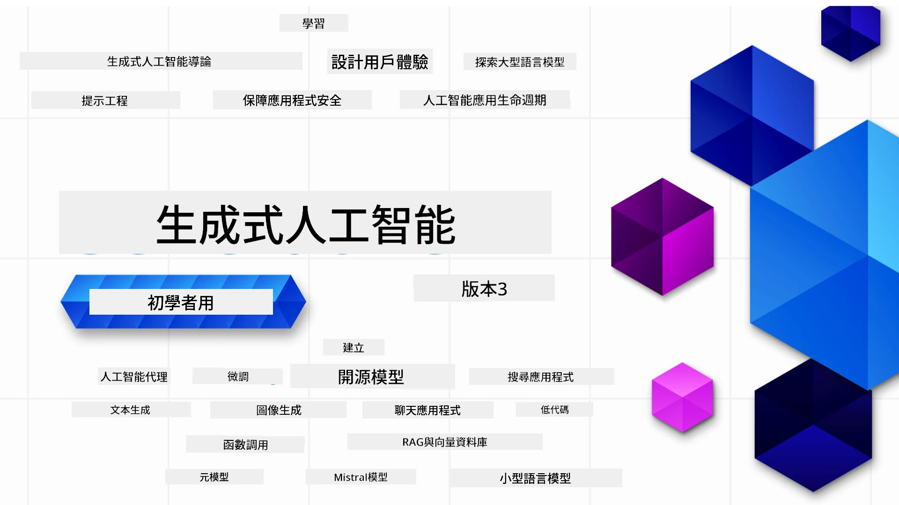

### 21 課教你建構生成式 AI 應用程式所需知道的一切

[](https://github.com/microsoft/Generative-AI-For-Beginners/blob/master/LICENSE?WT.mc_id=academic-105485-koreyst)
[](https://GitHub.com/microsoft/Generative-AI-For-Beginners/graphs/contributors/?WT.mc_id=academic-105485-koreyst)
[](https://GitHub.com/microsoft/Generative-AI-For-Beginners/issues/?WT.mc_id=academic-105485-koreyst)
[](https://GitHub.com/microsoft/Generative-AI-For-Beginners/pulls/?WT.mc_id=academic-105485-koreyst)
[](http://makeapullrequest.com?WT.mc_id=academic-105485-koreyst)

[](https://GitHub.com/microsoft/Generative-AI-For-Beginners/watchers/?WT.mc_id=academic-105485-koreyst)
[](https://GitHub.com/microsoft/Generative-AI-For-Beginners/network/?WT.mc_id=academic-105485-koreyst)
[](https://GitHub.com/microsoft/Generative-AI-For-Beginners/stargazers/?WT.mc_id=academic-105485-koreyst)

[](https://discord.gg/nTYy5BXMWG)

### 🌐 多語言支援

#### 透過 GitHub Action 支援（自動且始終保持最新）

<!-- CO-OP TRANSLATOR LANGUAGES TABLE START -->
[阿拉伯文](../ar/README.md) | [孟加拉文](../bn/README.md) | [保加利亞文](../bg/README.md) | [緬甸語](../my/README.md) | [中文（簡體）](../zh-CN/README.md) | [中文（繁體，香港）](../zh-HK/README.md) | [中文（繁體，澳門）](./README.md) | [中文（繁體，臺灣）](../zh-TW/README.md) | [克羅地亞文](../hr/README.md) | [捷克文](../cs/README.md) | [丹麥文](../da/README.md) | [荷蘭文](../nl/README.md) | [愛沙尼亞文](../et/README.md) | [芬蘭文](../fi/README.md) | [法文](../fr/README.md) | [德文](../de/README.md) | [希臘文](../el/README.md) | [希伯來文](../he/README.md) | [印地文](../hi/README.md) | [匈牙利文](../hu/README.md) | [印尼文](../id/README.md) | [義大利文](../it/README.md) | [日文](../ja/README.md) | [卡納達文](../kn/README.md) | [高棉文](../km/README.md) | [韓文](../ko/README.md) | [立陶宛文](../lt/README.md) | [馬來文](../ms/README.md) | [馬拉雅拉姆文](../ml/README.md) | [馬拉地文](../mr/README.md) | [尼泊爾文](../ne/README.md) | [奈及利亞皮欽語](../pcm/README.md) | [挪威文](../no/README.md) | [波斯文（法爾西語）](../fa/README.md) | [波蘭文](../pl/README.md) | [葡萄牙文 (巴西)](../pt-BR/README.md) | [葡萄牙文 (葡萄牙)](../pt-PT/README.md) | [旁遮普文（古魯穆奇）](../pa/README.md) | [羅馬尼亞文](../ro/README.md) | [俄文](../ru/README.md) | [塞爾維亞文（西里爾字母）](../sr/README.md) | [斯洛伐克文](../sk/README.md) | [斯洛文尼亞文](../sl/README.md) | [西班牙文](../es/README.md) | [斯瓦希里文](../sw/README.md) | [瑞典文](../sv/README.md) | [他加祿文（菲律賓語）](../tl/README.md) | [泰米爾文](../ta/README.md) | [泰盧固文](../te/README.md) | [泰文](../th/README.md) | [土耳其文](../tr/README.md) | [烏克蘭文](../uk/README.md) | [烏爾都文](../ur/README.md) | [越南文](../vi/README.md)

> **較喜歡本地複製？**
>
> 此儲存庫包含 50 多種語言翻譯，明顯增加了下載大小。若要不下載翻譯，請使用稀疏檢出：
>
> **Bash / macOS / Linux:**
> ```bash
> git clone --filter=blob:none --sparse https://github.com/microsoft/generative-ai-for-beginners.git
> cd generative-ai-for-beginners
> git sparse-checkout set --no-cone '/*' '!translations' '!translated_images'
> ```
>
> **CMD (Windows):**
> ```cmd
> git clone --filter=blob:none --sparse https://github.com/microsoft/generative-ai-for-beginners.git
> cd generative-ai-for-beginners
> git sparse-checkout set --no-cone "/*" "!translations" "!translated_images"
> ```
>
> 這會提供您完成課程所需的一切，且下載速度更快。
<!-- CO-OP TRANSLATOR LANGUAGES TABLE END -->

# 生成式 AI 初學者課程（第 3 版）

透過 Microsoft Cloud Advocates 的 21 課完整課程學習建構生成式 AI 應用程式的基礎。

## 🌱 開始學習

本課程共 21 課。每課涵蓋獨立主題，可依喜好開始學習！

課程分為「Learn」課程，說明生成式 AI 概念；及「Build」課程，說明概念並盡可能提供 **Python** 及 **TypeScript** 範例程式碼。

給 .NET 開發者，請參考 [生成式 AI 初學者 (.NET 版)](https://github.com/microsoft/Generative-AI-for-beginners-dotnet?WT.mc_id=academic-105485-koreyst)！

每課還包含「繼續學習」區域，提供更多學習工具。

## 您需要的條件
### 執行本課程程式碼，您可選擇： 
 - [Azure OpenAI 服務](https://aka.ms/genai-beginners/azure-open-ai?WT.mc_id=academic-105485-koreyst) - **課程：** "aoai-assignment"
 - [GitHub 市集模型目錄](https://aka.ms/genai-beginners/gh-models?WT.mc_id=academic-105485-koreyst) - **課程：** "githubmodels"
 - [OpenAI API](https://aka.ms/genai-beginners/open-ai?WT.mc_id=academic-105485-koreyst) - **課程：** "oai-assignment" 
   
- 具備基礎 Python 或 TypeScript 知識有幫助 - \*初學者可先參考這些 [Python](https://aka.ms/genai-beginners/python?WT.mc_id=academic-105485-koreyst) 與 [TypeScript](https://aka.ms/genai-beginners/typescript?WT.mc_id=academic-105485-koreyst) 課程
- 一個 GitHub 帳號，方便 [將此儲存庫分叉到您的 GitHub 帳號](https://aka.ms/genai-beginners/github?WT.mc_id=academic-105485-koreyst)

我們已製作一個 **[課程設定](./00-course-setup/README.md?WT.mc_id=academic-105485-koreyst)** 課程協助您設定開發環境。

別忘了幫此儲存庫 [加星 (🌟)](https://docs.github.com/en/get-started/exploring-projects-on-github/saving-repositories-with-stars?WT.mc_id=academic-105485-koreyst)，方便留存查找。

## 🧠 準備部署？

若想要更多進階程式碼範例，請參閱我們的 [生成式 AI 程式碼範例集](https://aka.ms/genai-beg-code?WT.mc_id=academic-105485-koreyst)，提供 **Python** 與 **TypeScript** 版本。

## 🗣️ 認識其他學員，獲得支援

加入我們的 [官方 Azure AI Foundry Discord 伺服器](https://aka.ms/genai-discord?WT.mc_id=academic-105485-koreyst)，與其他參加此課程的學員交流及取得支援。

在 Github [Azure AI Foundry 開發者論壇](https://aka.ms/azureaifoundry/forum) 提問或分享產品反饋。

## 🚀 創業中？

造訪 [Microsoft for Startups](https://www.microsoft.com/startups) 探索如何立即使用 Azure 點數開始建構。

## 🙏 希望幫助我們？

您有建議或發現拼寫或程式碼錯誤嗎？請 [提出議題](https://github.com/microsoft/generative-ai-for-beginners/issues?WT.mc_id=academic-105485-koreyst) 或 [建立拉取請求](https://github.com/microsoft/generative-ai-for-beginners/pulls?WT.mc_id=academic-105485-koreyst)

## 📂 每課包含：

- 主題短片介紹
- README 中的書面課程內容
- 支援 Azure OpenAI 與 OpenAI API 的 Python 及 TypeScript 範例程式碼
- 延伸資源連結供持續學習

## 🗃️ 課程列表

| #   | <strong>課程連結</strong>                                                                                                                              | <strong>說明</strong>                                                                                 | <strong>影片</strong>                                                                   | <strong>額外學習</strong>                                                             |
| --- | -------------------------------------------------------------------------------------------------------------------------------------------- | ---------------------------------------------------------------------------------------- | --------------------------------------------------------------------------- | ------------------------------------------------------------------------ |
| 00  | [課程設定](./00-course-setup/README.md?WT.mc_id=academic-105485-koreyst)                                                                     | **學習：** 如何設定您的開發環境                                                        | 影片即將推出                                                                 | [深入了解](https://aka.ms/genai-collection?WT.mc_id=academic-105485-koreyst) |
| 01  | [生成式 AI 與大型語言模型入門](./01-introduction-to-genai/README.md?WT.mc_id=academic-105485-koreyst)                                         | **學習：** 了解生成式 AI 是什麼以及大型語言模型 (LLM) 如何運作。                       | [影片](https://aka.ms/gen-ai-lesson-1-gh?WT.mc_id=academic-105485-koreyst) | [深入了解](https://aka.ms/genai-collection?WT.mc_id=academic-105485-koreyst) |
| 02  | [探索及比較不同的大型語言模型](./02-exploring-and-comparing-different-llms/README.md?WT.mc_id=academic-105485-koreyst)                         | **學習：** 如何為您的使用案例選擇合適的模型                                          | [影片](https://aka.ms/gen-ai-lesson2-gh?WT.mc_id=academic-105485-koreyst)  | [深入了解](https://aka.ms/genai-collection?WT.mc_id=academic-105485-koreyst) |
| 03  | [負責任地使用生成式 AI](./03-using-generative-ai-responsibly/README.md?WT.mc_id=academic-105485-koreyst)                                       | **學習：** 如何負責任地建構生成式 AI 應用程式                                        | [影片](https://aka.ms/gen-ai-lesson3-gh?WT.mc_id=academic-105485-koreyst)  | [深入了解](https://aka.ms/genai-collection?WT.mc_id=academic-105485-koreyst) |
| 04  | [了解提示工程基礎](./04-prompt-engineering-fundamentals/README.md?WT.mc_id=academic-105485-koreyst)             | **學習：** 實戰提示工程最佳實踐                                           | [影片](https://aka.ms/gen-ai-lesson4-gh?WT.mc_id=academic-105485-koreyst)  | [了解更多](https://aka.ms/genai-collection?WT.mc_id=academic-105485-koreyst) |
| 05  | [建立進階提示](./05-advanced-prompts/README.md?WT.mc_id=academic-105485-koreyst)                                                | **學習：** 如何應用提升提示效果的提示工程技術 | [影片](https://aka.ms/gen-ai-lesson5-gh?WT.mc_id=academic-105485-koreyst)  | [了解更多](https://aka.ms/genai-collection?WT.mc_id=academic-105485-koreyst) |
| 06  | [構建文本生成應用程式](./06-text-generation-apps/README.md?WT.mc_id=academic-105485-koreyst)                                | **構建：** 使用 Azure OpenAI / OpenAI API 的文本生成應用程式                                | [影片](https://aka.ms/gen-ai-lesson6-gh?WT.mc_id=academic-105485-koreyst)  | [了解更多](https://aka.ms/genai-collection?WT.mc_id=academic-105485-koreyst) |
| 07  | [構建聊天應用程式](./07-building-chat-applications/README.md?WT.mc_id=academic-105485-koreyst)                                     | **構建：** 高效構建及整合聊天應用的技術               | [影片](https://aka.ms/gen-ai-lessons7-gh?WT.mc_id=academic-105485-koreyst) | [了解更多](https://aka.ms/genai-collection?WT.mc_id=academic-105485-koreyst) |
| 08  | [構建搜索應用程式和向量資料庫](./08-building-search-applications/README.md?WT.mc_id=academic-105485-koreyst)                        | **構建：** 使用嵌入向量搜尋資料的搜索應用程式                        | [影片](https://aka.ms/gen-ai-lesson8-gh?WT.mc_id=academic-105485-koreyst)  | [了解更多](https://aka.ms/genai-collection?WT.mc_id=academic-105485-koreyst) |
| 09  | [構建圖像生成應用程式](./09-building-image-applications/README.md?WT.mc_id=academic-105485-koreyst)                        | **構建：** 圖像生成應用程式                                                       | [影片](https://aka.ms/gen-ai-lesson9-gh?WT.mc_id=academic-105485-koreyst)  | [了解更多](https://aka.ms/genai-collection?WT.mc_id=academic-105485-koreyst) |
| 10  | [構建低代碼 AI 應用程式](./10-building-low-code-ai-applications/README.md?WT.mc_id=academic-105485-koreyst)                       | **構建：** 使用低代碼工具的生成式 AI 應用程式                                     | [影片](https://aka.ms/gen-ai-lesson10-gh?WT.mc_id=academic-105485-koreyst) | [了解更多](https://aka.ms/genai-collection?WT.mc_id=academic-105485-koreyst) |
| 11  | [使用函數呼叫整合外部應用程式](./11-integrating-with-function-calling/README.md?WT.mc_id=academic-105485-koreyst) | **構建：** 什麼是函數呼叫及其應用案例                          | [影片](https://aka.ms/gen-ai-lesson11-gh?WT.mc_id=academic-105485-koreyst) | [了解更多](https://aka.ms/genai-collection?WT.mc_id=academic-105485-koreyst) |
| 12  | [為 AI 應用設計使用者體驗](./12-designing-ux-for-ai-applications/README.md?WT.mc_id=academic-105485-koreyst)                         | **學習：** 開發生成式 AI 應用時如何應用 UX 設計原則         | [影片](https://aka.ms/gen-ai-lesson12-gh?WT.mc_id=academic-105485-koreyst) | [了解更多](https://aka.ms/genai-collection?WT.mc_id=academic-105485-koreyst) |
| 13  | [保護你的生成式 AI 應用程式](./13-securing-ai-applications/README.md?WT.mc_id=academic-105485-koreyst)                         | **學習：** AI 系統的威脅與風險以及保護方法             | [影片](https://aka.ms/gen-ai-lesson13-gh?WT.mc_id=academic-105485-koreyst) | [了解更多](https://aka.ms/genai-collection?WT.mc_id=academic-105485-koreyst) |
| 14  | [生成式 AI 應用生命週期](./14-the-generative-ai-application-lifecycle/README.md?WT.mc_id=academic-105485-koreyst)           | **學習：** 管理大型語言模型生命週期與 LLMOps 的工具和指標                         | [影片](https://aka.ms/gen-ai-lesson14-gh?WT.mc_id=academic-105485-koreyst) | [了解更多](https://aka.ms/genai-collection?WT.mc_id=academic-105485-koreyst) |
| 15  | [檢索增強生成 (RAG) 與向量資料庫](./15-rag-and-vector-databases/README.md?WT.mc_id=academic-105485-koreyst)        | **構建：** 使用 RAG 框架從向量資料庫檢索嵌入的應用程式  | [影片](https://aka.ms/gen-ai-lesson15-gh?WT.mc_id=academic-105485-koreyst) | [了解更多](https://aka.ms/genai-collection?WT.mc_id=academic-105485-koreyst) |
| 16  | [開源模型與 Hugging Face](./16-open-source-models/README.md?WT.mc_id=academic-105485-koreyst)                                    | **構建：** 使用 Hugging Face 上可用的開源模型的應用程式                    | [影片](https://aka.ms/gen-ai-lesson16-gh?WT.mc_id=academic-105485-koreyst) | [了解更多](https://aka.ms/genai-collection?WT.mc_id=academic-105485-koreyst) |
| 17  | [AI 代理人](./17-ai-agents/README.md?WT.mc_id=academic-105485-koreyst)                                                                       | **構建：** 使用 AI 代理人框架的應用程式                                           | [影片](https://aka.ms/gen-ai-lesson17-gh?WT.mc_id=academic-105485-koreyst) | [了解更多](https://aka.ms/genai-collection?WT.mc_id=academic-105485-koreyst) |
| 18  | [微調大型語言模型](./18-fine-tuning/README.md?WT.mc_id=academic-105485-koreyst)                                                              | **學習：** 微調大型語言模型的內容、原因與方法                                            | [影片](https://aka.ms/gen-ai-lesson18-gh?WT.mc_id=academic-105485-koreyst) | [了解更多](https://aka.ms/genai-collection?WT.mc_id=academic-105485-koreyst) |
| 19  | [使用小型語言模型構建](./19-slm/README.md?WT.mc_id=academic-105485-koreyst)                                                              | **學習：** 使用小型語言模型構建的好處                                            | 影片即將推出 | [了解更多](https://aka.ms/genai-collection?WT.mc_id=academic-105485-koreyst) |
| 20  | [使用 Mistral 模型構建](./20-mistral/README.md?WT.mc_id=academic-105485-koreyst)                                                              | **學習：** Mistral 系列模型的特點與差異                                           | 影片即將推出 | [了解更多](https://aka.ms/genai-collection?WT.mc_id=academic-105485-koreyst) |
| 21  | [使用 Meta 模型構建](./21-meta/README.md?WT.mc_id=academic-105485-koreyst)                                                              | **學習：** Meta 系列模型的特點與差異                                           | 影片即將推出 | [了解更多](https://aka.ms/genai-collection?WT.mc_id=academic-105485-koreyst) |

### 🌟 特別感謝

特別感謝 [**John Aziz**](https://www.linkedin.com/in/john0isaac/) 創建所有的 GitHub Actions 和工作流程

[**Bernhard Merkle**](https://www.linkedin.com/in/bernhard-merkle-738b73/) 為每課帶來關鍵貢獻，提升學習體驗與程式碼品質。

## 🎒 其他課程

我們的團隊還製作其他課程！歡迎瀏覽：

<!-- CO-OP TRANSLATOR OTHER COURSES START -->
### LangChain
[](https://aka.ms/langchain4j-for-beginners)
[](https://aka.ms/langchainjs-for-beginners?WT.mc_id=m365-94501-dwahlin)
[](https://github.com/microsoft/langchain-for-beginners?WT.mc_id=m365-94501-dwahlin)
---

### Azure / Edge / MCP / Agents
[](https://github.com/microsoft/AZD-for-beginners?WT.mc_id=academic-105485-koreyst)
[](https://github.com/microsoft/edgeai-for-beginners?WT.mc_id=academic-105485-koreyst)
[](https://github.com/microsoft/mcp-for-beginners?WT.mc_id=academic-105485-koreyst)
[](https://github.com/microsoft/ai-agents-for-beginners?WT.mc_id=academic-105485-koreyst)

---
 
### 生成式 AI 系列
[](https://github.com/microsoft/generative-ai-for-beginners?WT.mc_id=academic-105485-koreyst)
[-9333EA?style=for-the-badge&labelColor=E5E7EB&color=9333EA)](https://github.com/microsoft/Generative-AI-for-beginners-dotnet?WT.mc_id=academic-105485-koreyst)
[-C084FC?style=for-the-badge&labelColor=E5E7EB&color=C084FC)](https://github.com/microsoft/generative-ai-for-beginners-java?WT.mc_id=academic-105485-koreyst)
[-E879F9?style=for-the-badge&labelColor=E5E7EB&color=E879F9)](https://github.com/microsoft/generative-ai-with-javascript?WT.mc_id=academic-105485-koreyst)

---
 
### 核心學習
[](https://aka.ms/ml-beginners?WT.mc_id=academic-105485-koreyst)
[](https://aka.ms/datascience-beginners?WT.mc_id=academic-105485-koreyst)
[](https://aka.ms/ai-beginners?WT.mc_id=academic-105485-koreyst)
[](https://github.com/microsoft/Security-101?WT.mc_id=academic-96948-sayoung)
[](https://aka.ms/webdev-beginners?WT.mc_id=academic-105485-koreyst)
[](https://aka.ms/iot-beginners?WT.mc_id=academic-105485-koreyst)
[](https://github.com/microsoft/xr-development-for-beginners?WT.mc_id=academic-105485-koreyst)

---
 
### Copilot 系列
[](https://aka.ms/GitHubCopilotAI?WT.mc_id=academic-105485-koreyst)
[](https://github.com/microsoft/mastering-github-copilot-for-dotnet-csharp-developers?WT.mc_id=academic-105485-koreyst)
[](https://github.com/microsoft/CopilotAdventures?WT.mc_id=academic-105485-koreyst)
<!-- CO-OP TRANSLATOR OTHER COURSES END -->

## 尋求協助

如果你遇到困難或有關於建立 AI 應用程序的任何問題，加入其他學習者和有經驗的開發者的討論吧。這是一個支持性的社群，歡迎提問，並自由分享知識。

[](https://discord.gg/nTYy5BXMWG)

如果你對產品有回饋或在開發中遇到錯誤，請訪問：

[](https://aka.ms/foundry/forum)

---

<!-- CO-OP TRANSLATOR DISCLAIMER START -->
**免責聲明**：  
本文件乃使用 AI 翻譯服務 [Co-op Translator](https://github.com/Azure/co-op-translator) 所翻譯。雖然我們致力於準確性，但請注意，自動翻譯可能包含錯誤或不準確之處。原始文件之母語版本應視為權威來源。對於關鍵資訊，建議採用專業人工翻譯。我們對因使用本翻譯所導致之任何誤解或誤譯概不負責。
<!-- CO-OP TRANSLATOR DISCLAIMER END -->