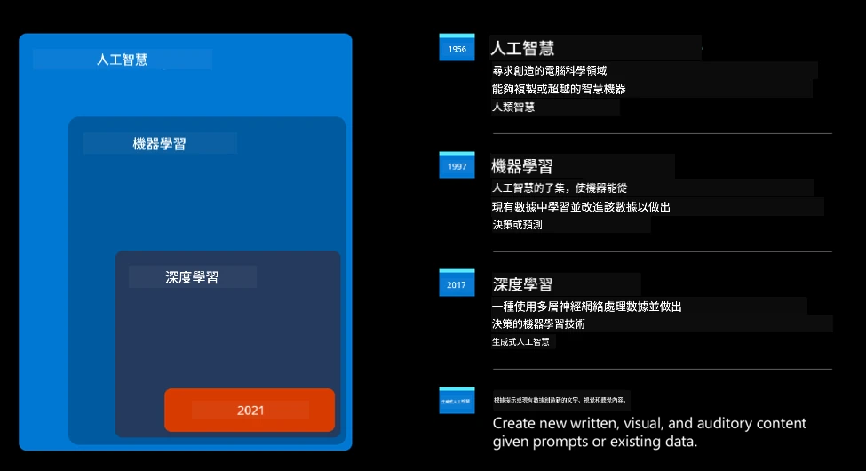
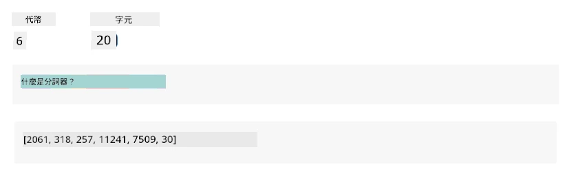
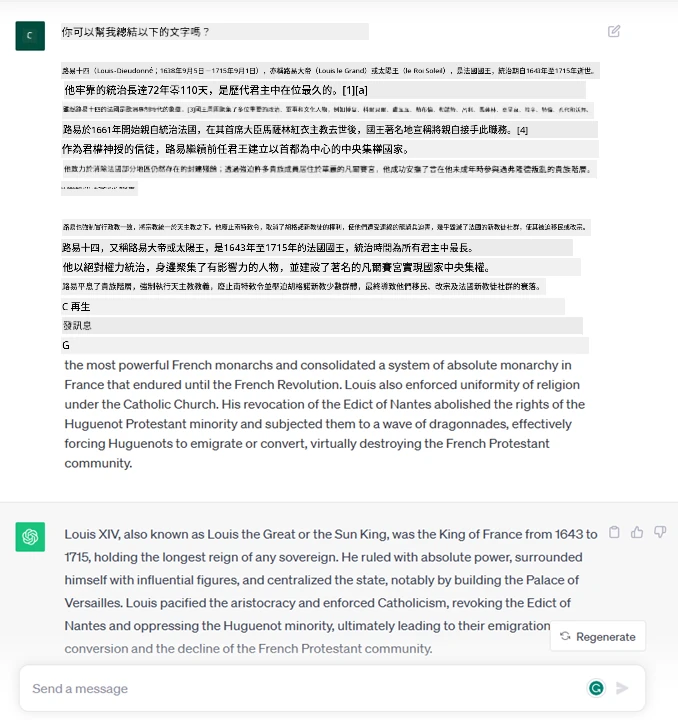
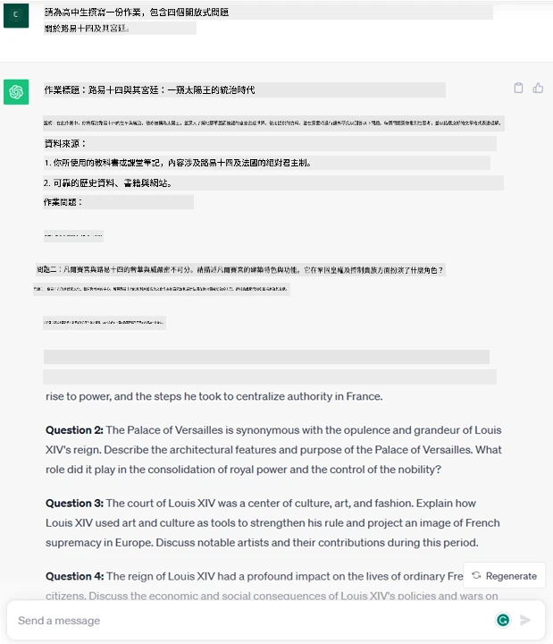
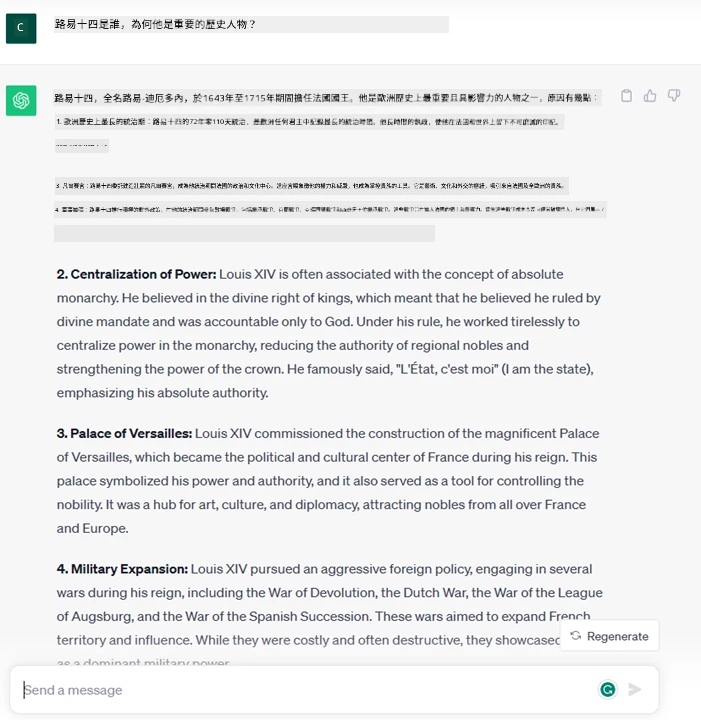
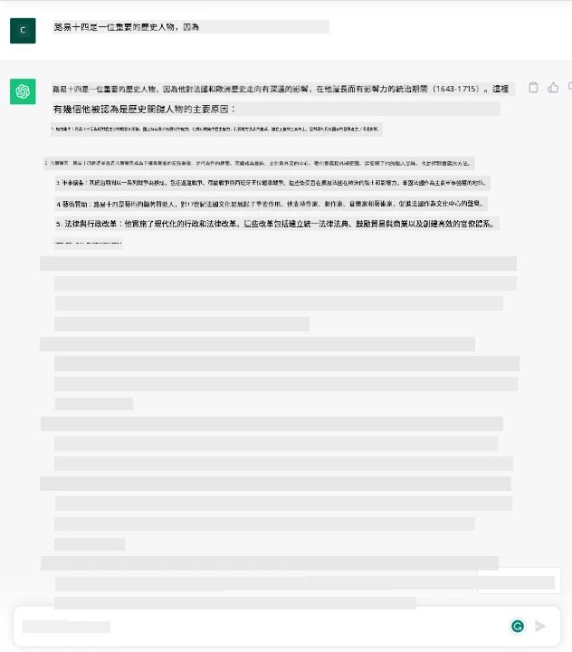
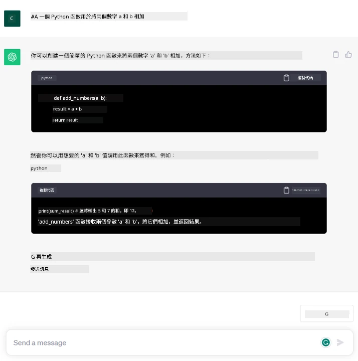

# 生成式 AI 與大型語言模型簡介

_(點擊上方圖片觀看本課程的影片)_

生成式 AI 是能夠生成文字、圖片及其他類型內容的人工智慧。使其成為一項優秀技術的原因是它民主化了 AI，任何人只需一句用自然語言撰寫的文字提示就能使用。你不需要學習 Java 或 SQL 等程式語言就能完成有價值的事情，只需使用你的語言，表達你的需求，即可從 AI 模型獲得建議。這項技術的應用與影響極為廣泛，你能在秒內撰寫或理解報告、撰寫應用程式等多種用途。

在本課程中，我們將探討我們的創業公司如何運用生成式 AI 來開啟教育領域的新情境，以及我們如何因應其應用帶來的社會問題與技術限制所面臨的挑戰。

## 簡介

本課程將涵蓋：

- 商業情境簡介：我們的創業構想與使命。
- 生成式 AI 以及我們如何走到目前的技術格局。
- 大型語言模型的內部運作原理。
- 大型語言模型的主要能力與實際應用案例。

## 學習目標

完成本課程後，你將理解：

- 什麼是生成式 AI，以及大型語言模型的運作方式。
- 如何運用大型語言模型於不同的使用情境，特別聚焦於教育場景。

## 情境：我們的教育新創公司

生成式人工智慧（AI）代表了 AI 技術的巔峰，打破了過去被認為不可能的界限。生成式 AI 模型具備多種能力與應用，這個課程中我們將探索它如何透過一個虛構的新創公司，徹底改革教育。該創業公司稱為 _我們的創業公司_，專注於教育領域，抱持著以下雄心壯志的使命宣言：

> _在全球範圍內提升學習的可及性，確保教育的公平性，並根據每位學習者的需求提供個人化學習經驗_。

我們的創業團隊知道，若沒有利用現代最強大的工具之一——大型語言模型（LLM），無法實現這一目標。

生成式 AI 預期將徹底改變我們今天的教學與學習方式，學生將可隨時隨地獲得虛擬教師的幫助，這些教師提供大量資訊與範例，而教師也能利用創新工具來評估學生並給予回饋。

首先，讓我們來定義幾個在本課程中會用到的基本概念與術語。

## 生成式 AI 是怎麼來的？

儘管最近生成式 AI 模型的發表引起了極大的 _熱潮_，但這項技術是歷經數十年的發展，其首批研究始於 60 年代。如今，AI 已具備人類認知能力，例如對話，像是 [OpenAI ChatGPT](https://openai.com/chatgpt) 或 [Microsoft Copilot](https://copilot.microsoft.com/?WT.mc_id=academic-105485-koreyst)（其對話式網路搜尋體驗同樣用 GPT 模型）即是例子。

回頭看，最早期的 AI 原型是打字聊天機器人，依賴從專家群中抽取的知識庫來支援運作。這些答案是由輸入文字中的關鍵字觸發。
但很快便發現這種依靠打字聊天機器人的方法擴展性不佳。

### 統計式 AI 方法：機器學習

90 年代出現了轉折點，將統計方法應用於文字分析。這衍生出「機器學習」新演算法，能在不需明確編程的情況下從資料中學習模式。此方法讓機器能模擬人類語言理解：模型在文字-標籤配對上訓練，使其能為未知輸入文字分類，標籤代表訊息意圖。

### 神經網路與現代虛擬助理

近年來硬體技術演進，能處理更多資料與複雜運算，促使 AI 研究發展，催生出深度學習演算法，也就是神經網路。

神經網路（尤其是遞迴神經網路 RNN）大幅提升自然語言處理能力，能以更有意義的方式表示文本含義，重視詞在句子中的語境。

這是首次世紀十年初期誕生虛擬助理的技術核心，它們能精準解讀人類語言、識別需求並執行滿足行動（如依預設腳本回覆或使用第三方服務）。

### 現今，生成式 AI

這就是我們如何到達今天的生成式 AI，它被視為深度學習的子集。

經過數十年 AI 研究後，一種稱為 _Transformer_ 的新模型架構突破了 RNN 的限制，能接受更長的文字序列作為輸入。Transformer 依賴注意力機制，使模型能對輸入賦予不同權重，‘更加關注’資訊最集中的地方，而非依序列順序。

大部分最新的生成式 AI 模型——也稱為大型語言模型（LLM），因它們以文字為輸入及輸出——的確是建立於此架構。這些模型受訓於來自書籍、文章與網站等多元資料、未標記的大量文本，具有可適應各式任務並產生文法正確且富有創意似的文字的能力。它們不僅大幅提升機器「理解」輸入文字的能力，還能創造人類語言的原創回應。

## 大型語言模型如何運作？

接下來章節會探討不同類型的生成式 AI 模型，但此刻，讓我們聚焦大型語言模型的運作原理，特別是 OpenAI 的 GPT（生成式預訓練 Transformer）模型。

- **分詞器，文字轉數字**：大型語言模型的輸入和輸出都是文字，但作為統計模型，它們更善於處理數字而非文字序列。因此模型接收輸入前會先由分詞器處理。分詞器的主要任務是將輸入拆分成一串串 token（文字片段），每個 token 包含變動數目的字元。每個 token 隨後會被映射成 token 索引，即對原始文字片段的整數編碼。

- **預測輸出 token**：輸入 n 個 token（最大 n 依模型而異）後，模型能預測下一個輸出 token。該 token 隨後被納入下一輪輸入，形成擴展的窗口模式，讓使用者體驗可得到一個或多個句子的回應。這也解釋了為什麼用 ChatGPT 時偶爾會遇到它在一句話中途停下的情況。

- **選擇過程，機率分布**：輸出 token 根據其在當前文字序列後出現的機率由模型選出。模型會預測所有可能「下一個 token」的機率分布，以訓練資料為基礎計算。然而，並非總是選擇機率最高的 token。為了模擬創造思考的過程，該選擇中加入隨機性，使模型以非決定性方式運作——同樣輸入不同結果會不同。該隨機程度可透過稱為「溫度」的參數調整。

## 我們的創業公司如何利用大型語言模型？

了解大型語言模型的內部運作後，讓我們看看它們如何在實務上執行最常見的任務，並參考我們的商業情境。
我們提到大型語言模型的主要能力是_從頭生成文字，基於自然語言的文字輸入_。

那麼輸入與輸出會是什麼樣的文字呢？
大型語言模型的文字輸入稱為提示（prompt），輸出稱為完成（completion），即模型生成下一 token 以補全當前文字的機制。我們將會深入探討什麼是提示，及如何設計提示以充分發揮模型。但目前來看，提示可能包含：

- 一則<strong>指令</strong>，說明我們期望模型產生何種輸出，有時會附帶範例或額外資料。

  1. 文章、書籍、產品評論等的摘要，以及從非結構化資料中萃取洞見。
    
    
  
  2. 創意構思與設計文章、論文、作業等內容。
      
     

- 一個<strong>問題</strong>，以與代理人的對話形式提出。
  
  

- 一段<strong>要補全的文字</strong>，暗示寫作方面的協助需求。
  
  

- 一段<strong>程式碼</strong>，伴隨解說和文件化的需求，或者要求產生一段執行特定任務的程式碼的註解。
  
  

上述示例都很簡單，並非想全面展示大型語言模型的能力，而是用以展示生成式 AI 的潛力，尤其適用於但不限於教育相關情境。

同時，生成式 AI 模型的輸出並不完美，有時模型的創意反而造成輸出文字令人難以理解或可能冒犯人。生成式 AI 並非真正智慧——至少在包含批判性、創意思考或情緒智慧的較廣義智慧定義中如此。它並非決定性的，也不具備可信度，因為虛假資訊（如錯誤引用、內容和言論）可能與正確資訊混雜並自信且有說服力地呈現。在接下來的課程中，我們將探討這些限制並討論如何減輕它們。

## 作業

請你閱讀更多關於 [生成式 AI](https://en.wikipedia.org/wiki/Generative_artificial_intelligence?WT.mc_id=academic-105485-koreyst) 的資料，並試著找出一個目前尚未利用生成式 AI 的領域。若導入生成式 AI，其影響會與「傳統方式」有何不同？你能否做以前無法做到的事情，或效率更快？撰寫一篇 300 字的摘要，說明你的理想 AI 新創公司模樣，並包含標題如「問題」、「我如何使用 AI」、「影響」及選擇性商業計畫。

若完成此任務，你甚至可以準備申請微軟的孵化器 [Microsoft for Startups Founders Hub](https://www.microsoft.com/startups?WT.mc_id=academic-105485-koreyst)，該平台提供 Azure、OpenAI、導師輔導等資源，非常值得一試！

## 知識檢測

以下關於大型語言模型何者正確？

1. 你每次都會得到完全相同的回答。
1. 它做事很完美，擅長加法運算、產生可執行的程式碼等。
1. 即使用同樣提示，回答可能不同。它也擅長提供第一稿的文本或程式碼，但你需要不斷改進結果。

答案：3，大型語言模型是非決定性的，回答會變異，但你可以透過溫度設置調控其變異度。你也不該期望它做到完美，但它能為你完成繁重初稿，後續你可逐步改進。

## 做得好！繼續學習之旅

完成本課程後，別忘了拜訪我們的 [生成式 AI 學習收藏](https://aka.ms/genai-collection?WT.mc_id=academic-105485-koreyst)，持續提升你的生成式 AI 知識！

請前往第二課，我們將探討如何[探索和比較不同的 LLM 類型](../02-exploring-and-comparing-different-llms/README.md?WT.mc_id=academic-105485-koreyst)！

---

<!-- CO-OP TRANSLATOR DISCLAIMER START -->
**免責聲明**：
此文件已使用 AI 翻譯服務 [Co-op Translator](https://github.com/Azure/co-op-translator) 進行翻譯。雖然我們努力追求準確性，但請注意自動翻譯可能包含錯誤或不準確之處。原始文件的母語版本應視為權威來源。對於關鍵資訊，建議採用專業人工翻譯。我們不對因使用此翻譯所產生的任何誤解或誤譯承擔責任。
<!-- CO-OP TRANSLATOR DISCLAIMER END -->