# 探索與比較不同的大型語言模型

[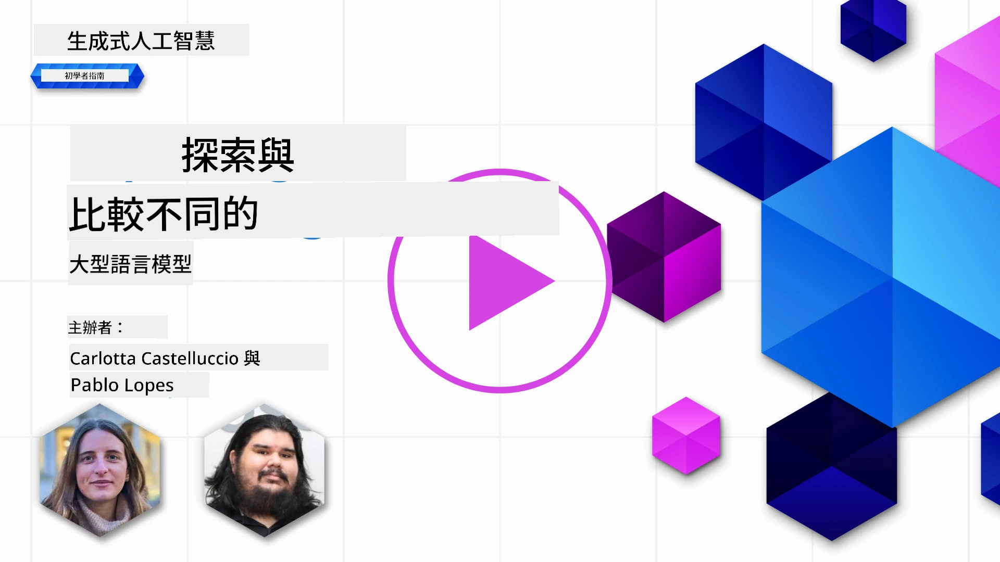](https://youtu.be/KIRUeDKscfI?si=8BHX1zvwzQBn-PlK)

> _點擊上方圖片觀看本課程影片_

在前一課中，我們已經了解生成式 AI 如何改變科技格局，了解大型語言模型（LLM）的運作方式，以及像我們的創業公司如何將它們應用到實際案例並成長！在本章中，我們將比較和對照不同類型的大型語言模型（LLM），以了解它們的優缺點。

我們創業公司的下一步是探索目前大型語言模型的現況，並了解哪些模型適合我們的使用案例。

## 介紹

本課程將涵蓋：

- 目前市場上不同類型的大型語言模型。
- 在 Azure 中測試、迭代和比較不同模型以符合您的使用案例。
- 如何部署大型語言模型。

## 學習目標

完成本課程後，您將能夠：

- 選擇適合您使用案例的正確模型。
- 了解如何測試、迭代並提升模型的效能。
- 知曉企業如何部署模型。

## 了解不同類型的大型語言模型

大型語言模型根據架構、訓練資料與使用案例可有多種分類。了解這些差異將幫助我們的創業公司選擇適合場景的模型，並了解如何測試、迭代與提升效能。

市場上有很多不同類型的 LLM，您選擇的模型取決於您打算如何使用、擁有的資料量、願意支付的費用等等。

根據您是否想用模型處理文字、音訊、影片、圖像生成等，也可能會選擇不同類型的模型。

- <strong>音訊與語音辨識</strong>。Whisper 類模型仍是通用的語音辨識模型，但生產環境的選擇也包含了較新的語音轉文字模型，如 `gpt-4o-transcribe`、`gpt-4o-mini-transcribe`，以及語者分離的變體。請評估您的場景對語言覆蓋、語者分離、即時支援、延遲和成本的需求。詳見 [OpenAI 語音轉文字文件](https://platform.openai.com/docs/guides/speech-to-text?WT.mc_id=academic-105485-koreyst)。

- <strong>圖像生成</strong>。DALL-E 與 Midjourney 是廣為人知的圖像生成選項，但目前 OpenAI 的圖像 API 著重於 GPT Image 類模型，如 `gpt-image-2`，而 Stable Diffusion、Imagen、Flux 及其他模型族群也常見。比較提示遵循度、編輯支援、風格控制、安全性需求與授權條款。詳見 [OpenAI 圖像生成指南](https://platform.openai.com/docs/guides/images?WT.mc_id=academic-105485-koreyst) 與本課程第九章。

- <strong>文字生成</strong>。文字模型現包含前沿模型、推理模型、小型低延遲模型以及開源權重模型。現存範例包括 OpenAI GPT-5.x 系列、Anthropic Claude 4.x 系列、Google Gemini 3.x 系列、Meta Llama 4 系列和 Mistral 系列。選擇模型不要只看發布日期或價格，也要比較任務表現、延遲、上下文窗口、工具使用、安全行為、區域可用性與總成本。[Microsoft Foundry 模型目錄](https://ai.azure.com/catalog?WT.mc_id=academic-105485-koreyst) 是在 Azure 上比較模型的好去處。

- <strong>多模態</strong>。許多現有模型能處理多於文字的輸入。有些可接受圖像、音訊或影片輸入；有些能呼叫工具；專門模型可生成圖像、音訊或影片。例如，現有 OpenAI 模型支持文字和圖像輸入，Gemini 模型依變體可支持文字、程式碼、圖像、音訊和影片輸入，Llama 4 Scout 和 Maverick 是開源權重的原生多模態模型。開發流程前請務必查看每個模型說明卡的輸入輸出類型支援。

選擇模型表示您擁有一些基本能力，但這可能還不夠。通常您會有公司特定資料需要傳達給 LLM。針對這點有幾種不同的方法，接下來章節會詳述。

### 基礎模型與大型語言模型之別

基礎模型一詞由 [史丹佛研究員創造](https://arxiv.org/abs/2108.07258?WT.mc_id=academic-105485-koreyst)，定義為符合某些標準的 AI 模型，例如：

- <strong>採用無監督學習或自我監督學習訓練</strong>，即在未標記的多模態資料上訓練，不需人類對資料標註或標籤。
- <strong>規模非常龐大</strong>，基於深層神經網路，訓練具數十億參數。
- **通常用作其他模型的「基礎」**，可透過微調做為其他模型的起點。

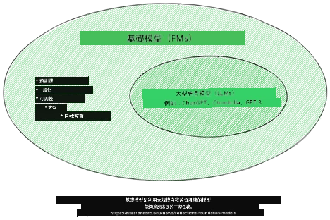

圖片來源：[Essential Guide to Foundation Models and Large Language Models | by Babar M Bhatti | Medium
](https://thebabar.medium.com/essential-guide-to-foundation-models-and-large-language-models-27dab58f7404)

為進一步說明這區別，我們以 ChatGPT 作為歷史範例。早期 ChatGPT 版本採用 GPT-3.5 作為基礎模型，OpenAI 之後使用聊天特定資料與調校技術，打造出在對話場景表現更佳的版本，例如聊天機器人。現代 AI 服務通常會在多種模型版本間調度，因此服務名稱與底層模型名稱不必然相同。

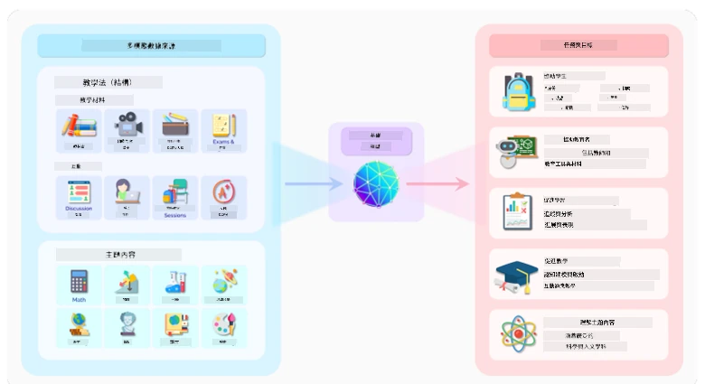

圖片來源：[2108.07258.pdf (arxiv.org)](https://arxiv.org/pdf/2108.07258.pdf?WT.mc_id=academic-105485-koreyst)

### 開源權重模型與專有模型之別

LLM 另一種分類方式是按是否為開源權重、開源或專有模型。

開源與開源權重模型可供檢視、下載或客製化模型構建產物，但授權類型不盡相同。有的完全開源，有的則有使用限制。當企業需掌控部署、資料本地性、成本或客製化時具有優勢。然而團隊仍須審核授權條款、服務成本、維護、安全更新及評測品質，方可用於生產環境。範例包含 [Meta Llama 4](https://ai.meta.com/blog/llama-4-multimodal-intelligence/?WT.mc_id=academic-105485-koreyst)、部分 [Mistral 模型](https://docs.mistral.ai/models/overview?WT.mc_id=academic-105485-koreyst) 及眾多模型托管於 [Hugging Face](https://huggingface.co/models?WT.mc_id=academic-105485-koreyst)。

專有模型由提供者擁有及托管。此類模型常優化為受控生產使用，可提供強大的支援、安全系統、工具整合及規模擴張能力，但用戶通常無法檢視或修改模型權重，且需審閱提供者條款涉及隱私、保存、合規及可接受使用規範。範例包含 [OpenAI 模型](https://platform.openai.com/docs/models?WT.mc_id=academic-105485-koreyst)、[Google Gemini](https://deepmind.google/models/gemini/pro/?WT.mc_id=academic-105485-koreyst) 以及 [Anthropic Claude](https://platform.claude.com/docs/en/about-claude/models/overview?WT.mc_id=academic-105485-koreyst)。

### 生成 Embedding、圖像與文字程式碼之別

LLM 也可依輸出分類。

Embedding 是一組能將文字轉為數值形式（embedding，即輸入文字的數值向量表示）的模型。Embedding 有助機器理解詞句間關係，也可作為其他模型輸入，例如分類模型或聚類模型，進而提升數值資料的表現。Embedding 模型常用於遷移學習，即先為擁有大量資料的模型建立代理任務，之後再重用該模型權重（embedding）於其他下游任務。這類範例有 [OpenAI embeddings](https://platform.openai.com/docs/models/embeddings?WT.mc_id=academic-105485-koreyst)。

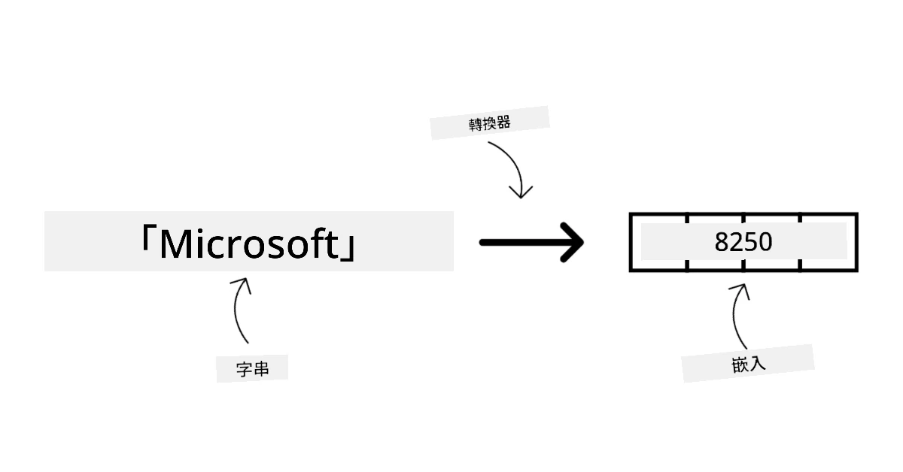

圖像生成模型為能生成圖像的模型。此類模型常用於圖像編輯、合成與轉換，通常基於大規模影像資料集訓練，如 [LAION-5B](https://laion.ai/blog/laion-5b/?WT.mc_id=academic-105485-koreyst)，並可利用修補、超解析、調色等技術生成新圖像或編輯既有圖像。範例有 [GPT Image models](https://platform.openai.com/docs/guides/images?WT.mc_id=academic-105485-koreyst)、[Stable Diffusion 模型](https://github.com/Stability-AI/StableDiffusion?WT.mc_id=academic-105485-koreyst) 與 Imagen 模型。

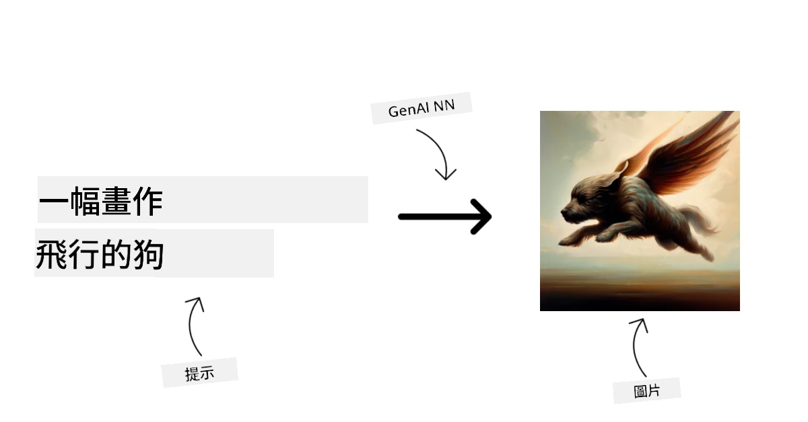

文字與程式碼生成模型用於生成文字或程式碼，常見應用包括文字摘要、翻譯與問答。文字生成模型多以大規模文字資料集訓練，如 [BookCorpus](https://www.cv-foundation.org/openaccess/content_iccv_2015/html/Zhu_Aligning_Books_and_ICCV_2015_paper.html?WT.mc_id=academic-105485-koreyst)，可用來生成新文字或回答問題。程式碼生成模型如 [CodeParrot](https://huggingface.co/codeparrot?WT.mc_id=academic-105485-koreyst) 多是在 GitHub 等大量程式碼資料集上訓練，可生成新程式碼或修補現有程式碼錯誤。

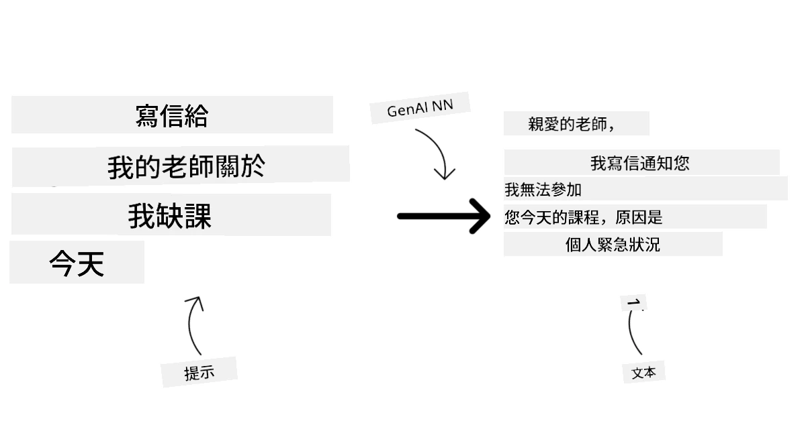

### 編碼器－解碼器模型與僅解碼器模型

談到 LLM 的不同架構類型，我們用一個比喻來說明。

假設你的主管交給你一個任務，要為學生出一份測驗。你有兩位同事，一位負責製作內容，另一位負責審閱。

內容製作者就像僅解碼器模型：他們可以根據題目和已寫內容，繼續產生新的內容。這類模型非常擅長生成吸引人且具資訊性的內容，但若任務是分類、檢索或編碼資訊，他們不一定是最佳選擇。解碼器模型家族的例子包括 GPT 與 Llama。

審閱者則像僅編碼器模型，他們查看所寫課程與答案，理解它們之間的關係與語境，但不擅長生成內容。僅編碼器模型的例子是 BERT。

假如有個人同時能製作與審閱測驗，這就是編碼器－解碼器模型。範例包括 BART 和 T5。

### 服務與模型的差異

接著談談服務與模型的不同。服務是由雲端服務供應商提供的產品，通常結合多個模型、資料與其他元件。模型是服務的核心元件，往往是基礎模型，如大型語言模型。

服務經常為生產環境優化，且多透過圖形使用者介面比模型更易使用。然而服務未必免費，可能須訂閱或付費，以利用服務主的設備與資源，優化費用並方便擴展。例如 [Azure OpenAI 服務](https://learn.microsoft.com/azure/ai-services/openai/overview?WT.mc_id=academic-105485-koreyst) 提供按使用量付費方案，用戶依使用量付費。Azure OpenAI 服務亦在模型功能基礎上提供企業級安全及負責任 AI 框架。

模型是神經網路產物，包括參數、權重、架構、分詞器和支援配置。於本地或私有環境執行模型需合適硬體、服務基礎設施、監控，以及符合的開源/開權重授權或商業授權。開權重模型如 Llama 4 或 Mistral 可自我托管，但仍須計算資源與運營專業知識。

## 如何在 Azure 上測試與迭代不同模型以了解效能

一旦我們的團隊探索了目前的 LLMs 生態並為他們的情境找出了合適的候選模型，下一步就是在他們的資料和工作負載上測試這些模型。這是一個透過實驗和測量進行的反覆過程。
我們在前面段落提到的大多數模型（OpenAI 模型、開放權重模型如 Llama 4 和 Mistral，以及 Hugging Face 模型）都可以在 [Microsoft Foundry Models](https://learn.microsoft.com/azure/foundry/concepts/foundry-models-overview?WT.mc_id=academic-105485-koreyst) 找到。

[Microsoft Foundry](https://learn.microsoft.com/azure/foundry/what-is-foundry?WT.mc_id=academic-105485-koreyst)，前身為 Azure AI Studio/Azure AI Foundry，是一個統一的 Azure 平台，用於建立 AI 應用程式和代理。它幫助開發者管理從實驗評估到部署、監控和治理的生命週期。Microsoft Foundry 中的模型目錄讓使用者能夠：

- 在目錄中尋找感興趣的基礎模型，包括 Azure 銷售的模型以及合作夥伴和社群提供的模型。使用者可以根據任務、供應商、許可、部署選項或名稱進行篩選。

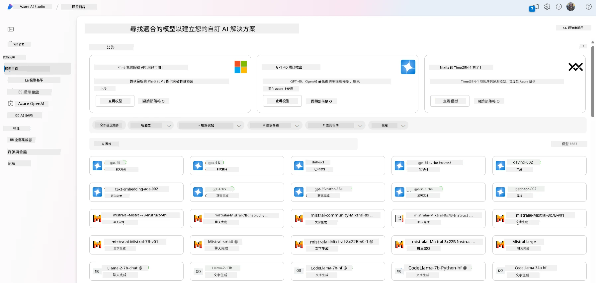

- 閱讀模型卡，包括對預期使用和訓練資料的詳細說明、程式碼範例及內部評估庫上的評測結果。

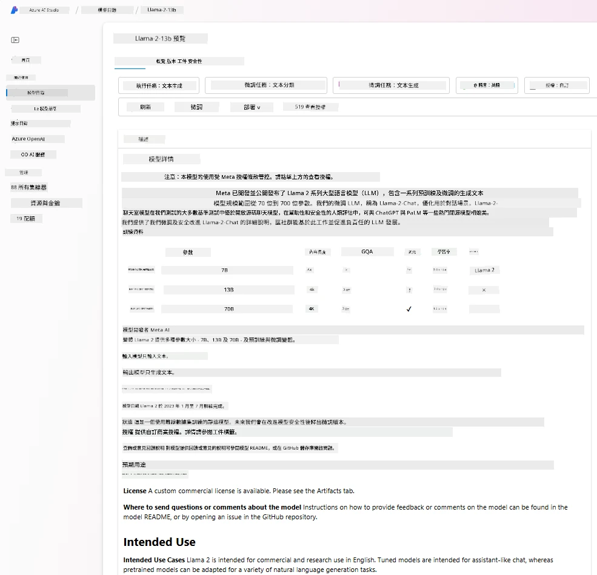

- 透過 [Model Benchmarks](https://learn.microsoft.com/azure/ai-studio/how-to/model-benchmarks?WT.mc_id=academic-105485-koreyst) 面板，對業界中可用的模型和數據集進行基準比對，以評估哪一個符合商業場景需求。

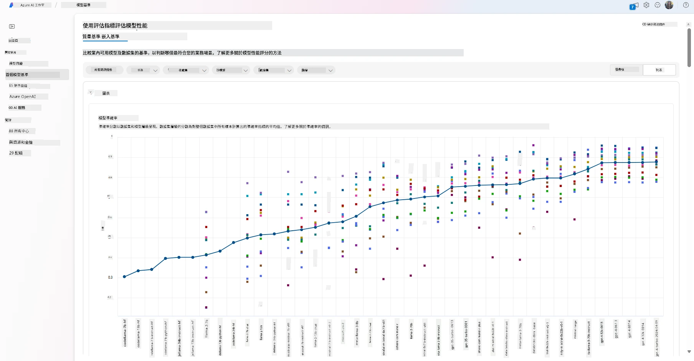

- 在支援的模型上使用自訂訓練資料進行微調，以提升模型在特定工作負載上的表現，並利用 Microsoft Foundry 的實驗和追蹤功能。

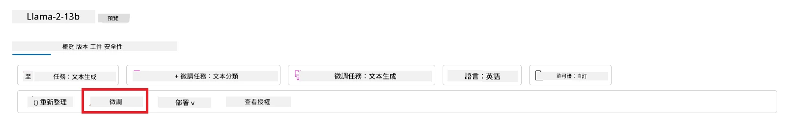

- 將原始的預訓練模型或微調版本部署到遠端即時推論端點，使用受管理的計算資源或無伺服器部署選項，使應用程式可以使用它。

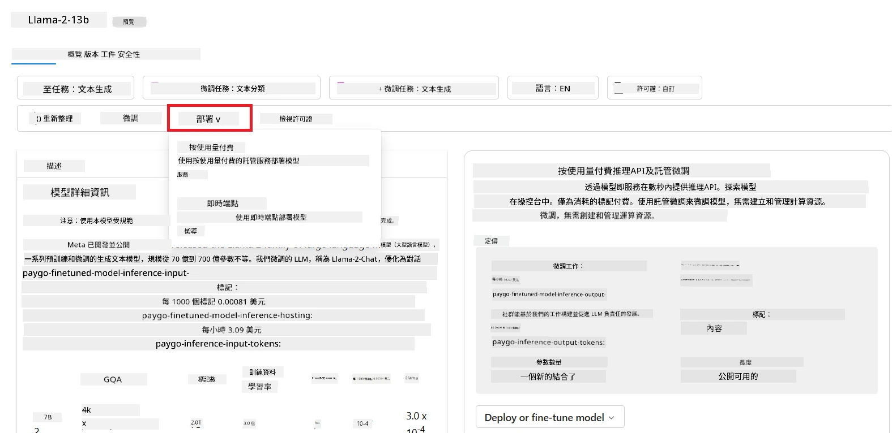

> [!NOTE]
> 目錄中的並非所有模型目前都可供微調及/或以按使用量付費的方式部署。請查看模型卡以了解該模型的功能及限制細節。

## 改善 LLM 結果

我們與創業團隊探索了不同類型的 LLMs 及一個雲端平台（Microsoft Foundry），該平台可協助我們比較不同模型、在測試資料上評估、提升性能，並部署到推論端點。

但什麼時候他們應該考慮微調模型，而非使用預訓練模型？還有什麼其他方法可以提升模型在特定工作負載上的表現？

商業可以採用多種方法從 LLM 獲取所需結果。部署 LLM 時，可以選用不同訓練程度的模型，具備不同複雜度、成本和品質。以下是一些不同的方法：

- <strong>帶有上下文的提示工程</strong>。目標是在提示中提供足夠的上下文，確保獲得所需回應。

- **檢索增強生成（RAG）**。例如，您的資料可能存在於資料庫或網路端點中，為確保在提示時包含這些資料或其子集，可以取得相關資料並成為使用者提示的一部分。

- <strong>微調模型</strong>。就是在您自己的資料上進一步訓練模型，使模型能更精確且更符合您的需求，但這可能成本較高。

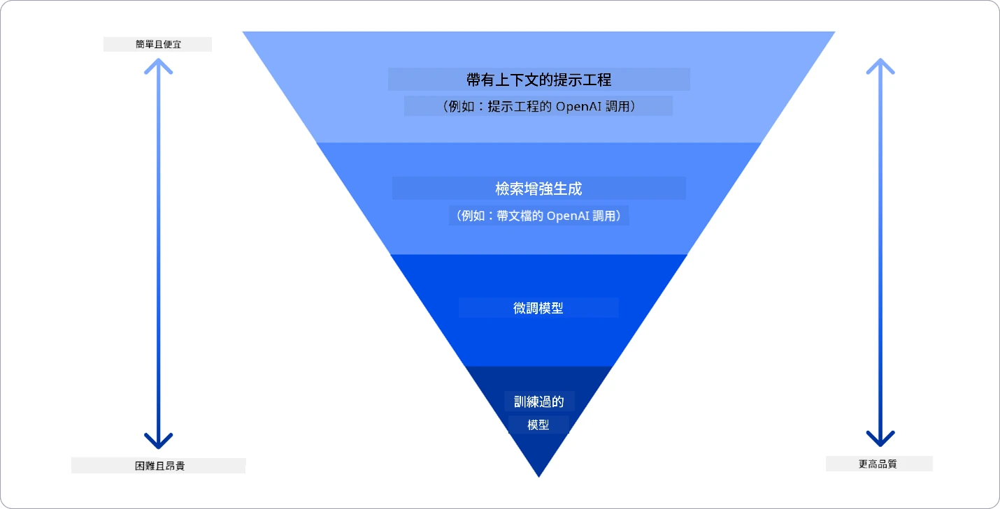

來源圖片：[Four Ways that Enterprises Deploy LLMs | Fiddler AI Blog](https://www.fiddler.ai/blog/four-ways-that-enterprises-deploy-llms?WT.mc_id=academic-105485-koreyst)

### 帶有上下文的提示工程

預訓練 LLMs 在通用自然語言任務上表現非常良好，即使只輸入簡短提示，如完成句子或提問——所謂「零樣本（zero-shot）」學習。

然而，使用者若能以詳盡請求與範例——即上下文——來架構查詢，回答將更準確且更符合使用者期望。若提示只含一個範例，稱為「單樣本（one-shot）」學習；含多個範例，則是「少樣本（few-shot）」學習。帶上下文的提示工程是最具成本效益的入門方式。

這可透過 RAG 技術解決，RAG 會將外部資料（以文件內容片段形式）添加至提示中，同時考慮提示長度限制。這得以透過向量資料庫工具（如 [Azure Vector Search](https://learn.microsoft.com/azure/search/vector-search-overview?WT.mc_id=academic-105485-koreyst)）實現，該工具從多個預定義資料源中檢索有用片段並加入提示上下文。

若符合以下條件，這會是首選做法：

- <strong>調整穩定行為</strong>。企業擁有許多高品質範例，並希望模型能持續遵循任務模式、輸出格式、語調或特定領域風格。如果主要問題是經常變動的新事實或私人知識，請使用 RAG 而非僅依賴微調。

### 已訓練模型

從頭開始訓練大型語言模型無疑是最困難且最複雜的方式，需大量資料、專業資源及適當的計算能力。此選項應僅在企業擁有特定領域使用案例和大量領域中心資料時考慮。

## 知識檢測

有哪些方式可以改善大型語言模型的完成結果？

1. 結合上下文的提示工程
1. RAG
1. 微調模型

答：三者皆可幫助。先從提示工程與上下文著手以快速改進，當模型需要最新事實或私人企業資料時使用 RAG。當你擁有足夠高質範例且需要模型持續遵循任務、格式、語調或領域模式時，選擇微調。

## 🚀 挑戰

進一步了解如何為你的企業[使用 RAG](https://learn.microsoft.com/azure/search/retrieval-augmented-generation-overview?WT.mc_id=academic-105485-koreyst)。

## 做得好，繼續學習

完成本課程後，請查看我們的[生成式 AI 學習合集](https://aka.ms/genai-collection?WT.mc_id=academic-105485-koreyst)，持續提升你的生成式 AI 知識！

前往第 3 課，我們將探討如何[負責任地使用生成式 AI](../03-using-generative-ai-responsibly/README.md?WT.mc_id=academic-105485-koreyst)！

---

<!-- CO-OP TRANSLATOR DISCLAIMER START -->
**免責聲明**：
此文件已使用 AI 翻譯服務 [Co-op Translator](https://github.com/Azure/co-op-translator) 進行翻譯。雖然我們努力追求準確性，但請注意自動翻譯可能包含錯誤或不準確之處。原始文件的母語版本應視為權威來源。對於關鍵資訊，建議採用專業人工翻譯。我們不對因使用此翻譯所產生的任何誤解或誤譯承擔責任。
<!-- CO-OP TRANSLATOR DISCLAIMER END -->