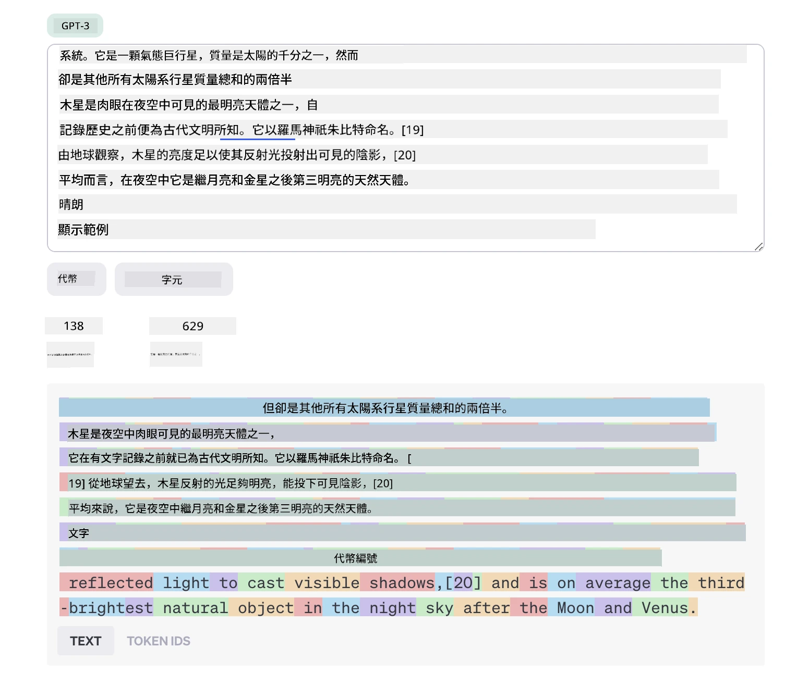
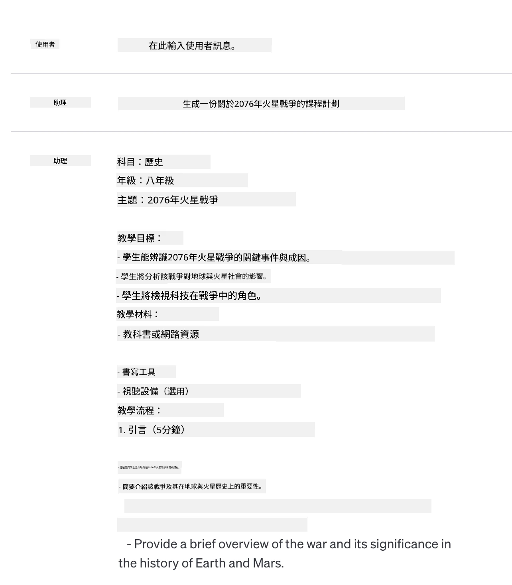
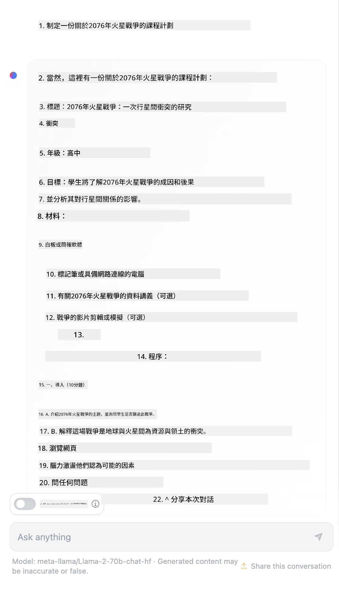

# 提示工程基礎

[](https://youtu.be/GElCu2kUlRs?si=qrXsBvXnCW12epb8)

## 介紹
本單元涵蓋在生成式 AI 模型中創建有效提示所需的基本概念和技術。你給大型語言模型 (LLM) 寫提示的方式也很重要。精心設計的提示可以獲得更好的回應品質。但「提示」和「提示工程」這些詞究竟是什麼意思？我該如何改進送給 LLM 的提示輸入？這些是我們在本章節及下一章將嘗試解答的問題。

_生成式 AI_ 能夠根據用戶請求創作新內容（例如文字、影像、音訊、程式碼等）。它是利用像 OpenAI 的 GPT（「生成式預訓練轉換器」）系列等 _大型語言模型_，訓練來理解自然語言和程式碼。

用戶現在可使用熟悉的交談模式與這些模型互動，無需任何技術專長或訓練。這些模型是基於提示的——用戶發送文字輸入（提示），並收到 AI 回應（完成）。他們可以多輪持續「與 AI 對話」，反覆調整他們的提示，直到回應符合期望。

「提示」現在成為生成式 AI 應用的主要 _程式設計介面_，指示模型要做什麼並影響回應品質。 「提示工程」是一門快速成長的領域，專注於 _提示的設計與優化_，以大規模交付穩定且優質的回應。

## 學習目標

在本課程中，我們將了解提示工程是什麼、為什麼重要，以及如何為給定模型和應用目標撰寫更有效的提示。我們將理解提示工程的核心概念與最佳實務，並學習使用互動式 Jupyter 筆記本「沙盒」環境，看到這些概念如何應用於真實範例。

課程結束時，我們將能夠：

1. 解釋什麼是提示工程以及為何重要。
2. 描述提示的組成與使用方式。
3. 學習提示工程的最佳實務與技術。
4. 使用 OpenAI 端點，將學習的技巧應用於真實範例。

## 關鍵詞彙

提示工程：設計與調整輸入提示以引導 AI 模型產出期望結果的實務。

分詞：將文字轉換成模型可理解和處理的較小單位（稱為標記 token）的過程。

指令微調的 LLM：經由特定指令微調的大型語言模型，提升回應的準確性和相關性。

## 學習沙盒

提示工程目前仍偏向藝術多於科學。提升直覺的最佳方式是 _多加練習_，並採用結合應用領域專業知識、推薦技術與模型特殊優化的試錯法。

本課程所附的 Jupyter 筆記本提供一個 _沙盒_ 環境，你可以隨時試用你所學的知識，也可以作為課後程式挑戰的一部分。要執行這些練習，你需要：

1. **Azure OpenAI API 金鑰**——一個已部署 LLM 的服務端點。
2. **Python 執行環境**——可執行筆記本。
3. **本地環境變數**——_請立即完成 [SETUP](./../00-course-setup/02-setup-local.md?WT.mc_id=academic-105485-koreyst) 步驟以做好準備_。

筆記本內建有 _入門_ 練習，但鼓勵你新增自己的 _Markdown_（描述）和 _Code_（提示請求）區塊，試驗更多範例或想法，培養提示設計的直覺。

## 圖解指南

想在深入學習前先一覽本課涵蓋的全貌？看看這個圖解指南，它能提供你主要議題的感知與每個主題的重點提醒。課程路線圖帶你從理解核心概念與挑戰，到使用相應的提示工程技術與最佳實務解決問題。請注意本指南中「進階技術」部分內容將在本課程的 _下一章節_ 講解。


## 我們的新創

現在，讓我們談談 _此主題_ 與我們致力於 [將 AI 創新帶入教育](https://educationblog.microsoft.com/2023/06/collaborating-to-bring-ai-innovation-to-education?WT.mc_id=academic-105485-koreyst) 的新創使命之間的關聯。我們想打造 AI 驅動的 _個人化學習_ 應用——想想看，我們應用的不同用戶可能如何「設計」提示：

- **管理者** 可能會請 AI _分析課程資料，找出涵蓋差距_。AI 可以總結結果或以程式碼視覺呈現。
- **教育者** 可能會請 AI _為特定受眾和主題生成課程計劃_。AI 可以以指定格式建立個人化計劃。
- **學生** 可能會請 AI _在困難科目上輔導他們_。AI 現在可以根據學生程度提供課程、提示與示例。

這僅是冰山一角。查閱 [Prompts For Education](https://github.com/microsoft/prompts-for-edu/tree/main?WT.mc_id=academic-105485-koreyst) ——由教育專家策劃的開源提示庫——獲得更豐富的可能性認識！ _試著在沙盒或使用 OpenAI Playground 執行這些提示看看會發生什麼！_

<!--
LESSON TEMPLATE:
This unit should cover core concept #1.
Reinforce the concept with examples and references.

CONCEPT #1:
Prompt Engineering.
Define it and explain why it is needed.
-->

## 什麼是提示工程？

我們這堂課從定義 **提示工程** 開始，將其視為 _設計和優化_ 文本輸入（提示）以針對特定應用目標和模型提供一致且優質回應（完成）的過程。我們可以把它看作兩個步驟：

- 為給定模型和目標 _設計_ 初始提示
- 反覆 _調整_ 提示以提升回應品質

這一定是一個試錯流程，需要用戶的直覺和努力，才能取得最佳效果。那為什麼它很重要？為了回答這個問題，我們先要理解三個概念：

- _分詞_ = 模型如何「看待」提示
- _基礎 LLM_ = 基礎模型如何「處理」提示
- _指令微調 LLM_ = 模型如何能「理解任務」

### 分詞

LLM 將提示視為一個 _標記序列_，不同模型（或同一模型的不同版本）會用不同方式對相同提示進行分詞。由於 LLM 是在標記（tokens）上訓練的（而非原始文字），提示的分詞方式會直接影響生成回應的品質。

想感受分詞如何工作的話，可以試試下面所示的 [OpenAI Tokenizer](https://platform.openai.com/tokenizer?WT.mc_id=academic-105485-koreyst) 工具。將提示貼上去，看它如何轉成標記，注意空白字元和標點符號的處理方式。請注意，此範例展示較舊的 LLM（GPT-3），用更新模型可能會有不同結果。



### 概念：基礎模型

一旦提示被分詞，["基礎 LLM"](https://blog.gopenai.com/an-introduction-to-base-and-instruction-tuned-large-language-models-8de102c785a6?WT.mc_id=academic-105485-koreyst)（或稱基礎模型）的主要功能是預測該序列中的下一個標記。由於 LLM 在龐大文本資料集訓練，具備標記間的統計關聯感知能力，能相當自信地做出這預測。請注意，它們並不理解提示中詞語的 _意義_；它們只是看見可「完成」的模式，可持續預測序列，直到用戶終止或符合預設條件。

想看提示完成怎麼操作嗎？將上述提示輸入 Azure OpenAI Studio [_Chat Playground_](https://oai.azure.com/playground?WT.mc_id=academic-105485-koreyst)，使用預設設定。系統設定成將提示視為資訊請求——你應該會看到符合此上下文的完成結果。

但若用戶想看符合某條件或任務目標的特定內容呢？這時指令微調 LLM 就派上用場了。


### 概念：指令微調 LLM

指令微調 [Instruction Tuned LLM](https://blog.gopenai.com/an-introduction-to-base-and-instruction-tuned-large-language-models-8de102c785a6?WT.mc_id=academic-105485-koreyst) 是以基礎模型為起點，並用範例或輸入/輸出對（例如多輪「訊息」）進行微調，這些範例包含明確指令，AI 嘗試依指令進行回應。

此技術採用人類回饋增強式學習（RLHF），能訓練模型 _遵從指令_ 和 _從反饋學習_，產生更符合實務應用且更貼近用戶目標的回應。

我們來試試——回到上方提示，但現在將 _系統訊息_ 修改為包含以下指令作為上下文：

> _將你提供的內容摘要給二年級學生。結果要限制在一段文字內，並包含3-5個重點列點。_

看看結果如何調整以反映期望目標和格式？教育者現在可以直接將此回應用於該堂課的簡報中。


## 為什麼我們需要提示工程？

了解 LLM 如何處理提示後，讓我們談談為什麼需要提示工程。原因在於目前的 LLM 面臨種種挑戰，如果不投入提示構建和優化，就難以達成 _可靠且一致的完成_。例如：

1. **模型回應具有隨機性。** _相同提示_ 很可能在不同模型或版本間產生不同回應，甚至同一模型在不同時間也可能有不一樣的結果。_提示工程技術能幫助我們透過更嚴謹的設計減少這些變異_。

2. **模型可能捏造回應。** 模型預訓練於 _大型但有限_ 的資料集，表示他們缺乏訓練範圍外的概念知識。因此，可能產生不準確、虛構或與已知事實直接矛盾的完成。_提示工程技巧可幫助用戶識別並降低捏造情況，例如要 AI 提供參考來源或推理過程_。

3. **模型能力差異顯著。** 新型或新一代模型功能更豐富，但也有獨特特性及在成本與複雜性上的取捨。_提示工程能助我們制定最佳實務與工作流程，以無縫擴展方式抽象差異並適應模型特定需求_。

讓我們在 OpenAI 或 Azure OpenAI Playground 親自嘗試：

- 用同一提示在不同 LLM 部署（如 OpenAI、Azure OpenAI、Hugging Face）試試——你發現了什麼變化？
- 在 _相同_ 的 LLM 部署（如 Azure OpenAI playground）反覆使用同一提示——這些差異有何不同？

### 捏造範例

在本課程中，我們用 **「捏造」** 這個詞來指 LLM 因訓練限制或其他限制，偶爾產生實際不正確資訊的現象。你可能也在文章或研究論文中聽過它被稱作 _「幻覺」_。不過我們強烈建議使用 _「捏造」_ 這個術語，以免將此行為擬人化，誤認為是一種具有人類特質的機器結果。這也從術語角度強化 [負責任的AI指導原則](https://www.microsoft.com/ai/responsible-ai?WT.mc_id=academic-105485-koreyst)，避免使用可能在某些語境中具冒犯性或排他性的詞彙。

想了解捏造的運作原理嗎？試想一個提示指示 AI 產生一個不存在主題的內容（確保訓練資料中沒有此內容）。例如——我嘗試了這個提示：

> **提示：** 產生有關2076年火星戰爭的課程計劃。
網路搜尋告訴我，有一些虛構的故事（例如，電視劇或書籍）描述火星戰爭──但沒有在 2076 年發生過的。常識也告訴我們，2076 年是在未來，因此無法與真實事件相關聯。

那麼，當我們用不同的 LLM 供應商執行此提示時會發生什麼？

> **回應 1**：OpenAI Playground (GPT-35)



> **回應 2**：Azure OpenAI Playground (GPT-35)


> **回應 3**：Hugging Face Chat Playground (LLama-2)



如預期，各模型（或模型版本）因隨機行為與模型能力差異，產生略有不同的回應。例如，一個模型的目標是八年級學生，而另一個則假設是高中生。但這三款模型都產生了足以讓未經知情的使用者相信該事件真實存在的回答。

提示工程技術如 _元提示（metaprompting）_ 與 _溫度設置（temperature configuration）_ 可在某種程度上減少模型編造。新的提示工程 _架構_ 也能將全新工具和技術無縫整合進提示流程，以緩解或降低部分這類影響。

## 案例研究：GitHub Copilot

本節末尾，我們以一個案例研究來了解提示工程在現實世界解決方案的應用：[GitHub Copilot](https://github.com/features/copilot?WT.mc_id=academic-105485-koreyst)。

GitHub Copilot 是你的「AI 組合程式設計師」──它將文字提示轉成程式碼補全，並整合進你的開發環境（例如 Visual Studio Code），帶來無縫的使用體驗。以下一系列部落格說明，最早版本是基於 OpenAI Codex 模型，工程師很快意識到需要微調模型並開發更好的提示工程技術來提升程式碼品質。今年 7 月，他們[推出超越 Codex 的改良 AI 模型](https://github.blog/2023-07-28-smarter-more-efficient-coding-github-copilot-goes-beyond-codex-with-improved-ai-model/?WT.mc_id=academic-105485-koreyst)，能更快地提供建議。

請依順序閱讀這些文章，以追蹤他們的學習歷程。

- **2023 年 5 月** | [GitHub Copilot 在理解你的程式碼方面越來越好](https://github.blog/2023-05-17-how-github-copilot-is-getting-better-at-understanding-your-code/?WT.mc_id=academic-105485-koreyst)
- **2023 年 5 月** | [GitHub 內部：與 GitHub Copilot 背後的 LLM 合作](https://github.blog/2023-05-17-inside-github-working-with-the-llms-behind-github-copilot/?WT.mc_id=academic-105485-koreyst)
- **2023 年 6 月** | [如何為 GitHub Copilot 撰寫更好的提示](https://github.blog/2023-06-20-how-to-write-better-prompts-for-github-copilot/?WT.mc_id=academic-105485-koreyst)
- **2023 年 7 月** | [GitHub Copilot 透過改良 AI 模型超越 Codex](https://github.blog/2023-07-28-smarter-more-efficient-coding-github-copilot-goes-beyond-codex-with-improved-ai-model/?WT.mc_id=academic-105485-koreyst)
- **2023 年 7 月** | [開發者的提示工程與 LLM 指南](https://github.blog/2023-07-17-prompt-engineering-guide-generative-ai-llms/?WT.mc_id=academic-105485-koreyst)
- **2023 年 9 月** | [如何打造企業等級的 LLM 應用程式：GitHub Copilot 的經驗教訓](https://github.blog/2023-09-06-how-to-build-an-enterprise-llm-application-lessons-from-github-copilot/?WT.mc_id=academic-105485-koreyst)

你也可以瀏覽他們的[工程部落格](https://github.blog/category/engineering/?WT.mc_id=academic-105485-koreyst)，查看更多像[這篇](https://github.blog/2023-09-27-how-i-used-github-copilot-chat-to-build-a-reactjs-gallery-prototype/?WT.mc_id=academic-105485-koreyst)的文章，說明這些模型與技術如何 _實際應用_ 於驅動真實世界的應用程式。

---

<!--
LESSON TEMPLATE:
This unit should cover core concept #2.
Reinforce the concept with examples and references.

CONCEPT #2:
Prompt Design.
Illustrated with examples.
-->

## 提示構建

我們已了解為何提示工程重要──現在來了解提示如何被 _構建_，以便我們評估不同的技術來設計更有效的提示。

### 基本提示

從基本提示開始：一段傳送給模型的純文字輸入，無其他上下文。以下範例──當我們送出美國國歌開頭幾個字到 OpenAI [Completion API](https://platform.openai.com/docs/api-reference/completions?WT.mc_id=academic-105485-koreyst)，它立即 _補全_ 接下來幾行，示範基本的預測行為。

| 提示（輸入）       | 補全（輸出）                                                                                                                        |
| :----------------- | :---------------------------------------------------------------------------------------------------------------------------------- |
| Oh say can you see | 聽起來你正在開始唱《星條旗永不落》（The Star-Spangled Banner），美國的國歌。完整歌詞是 ...                                 |

### 複雜提示

現在我們來為基本提示加上上下文與指令。[Chat Completion API](https://learn.microsoft.com/azure/ai-services/openai/how-to/chatgpt?WT.mc_id=academic-105485-koreyst)允許我們以多條 _訊息_ 組成複雜提示：

- 輸入/輸出對：反映 _用戶_ 輸入與 _助理_ 回應。
- 系統訊息：設定助理行為或個性的上下文。

請求格式如下，_斷詞（tokenization）_ 有效擷取上下文與對話中相關資訊。變更系統上下文對補全品質的影響，可能與提供用戶輸入一樣重要。

```python
response = openai.chat.completions.create(
    model="gpt-3.5-turbo",
    messages=[
        {"role": "system", "content": "You are a helpful assistant."},
        {"role": "user", "content": "Who won the world series in 2020?"},
        {"role": "assistant", "content": "The Los Angeles Dodgers won the World Series in 2020."},
        {"role": "user", "content": "Where was it played?"}
    ]
)
```

### 指令型提示

上述例子中，用戶提示是簡單的文字查詢，可視為訊息請求。使用 _指令型_ 提示，我們能用該文字更詳細指定任務，給 AI 更清楚的指引。範例如下：

| 提示（輸入）                                                                                                                                                                                                                     | 補全（輸出）                                                                                                        | 指令類型          |
| :------------------------------------------------------------------------------------------------------------------------------------------------------------------------------------------------------------------------------- | :----------------------------------------------------------------------------------------------------------------- | :---------------- |
| 撰寫一段關於南北戰爭的描述                                                                                                                                                                                                       | _回傳一個簡單段落_                                                                                                 | 簡單               |
| 撰寫一段關於南北戰爭的描述。附上重要日期與事件並說明其意義                                                                                                                                                                       | _回傳一段文字，接著列出重要事件日期與說明的清單_                                                                   | 複雜               |
| 用一段文字描述南北戰爭。提供 3 個重點項目列出關鍵日期及其意義，再提供 3 個重點列出重要歷史人物與其貢獻。將輸出格式化為 JSON 檔案                                             | _回傳較詳細文本，呈現為可複製貼上、方便驗證的 JSON 格式_                                                         | 複雜。格式化。      |

## 主要內容

在上述例子裡，提示仍然相當開放，允許 LLM 決定哪些預訓練資料相關。使用 _主要內容_ 設計模式時，輸入文字分成兩部分：

- 指令（動作）
- 相關內容（影響動作）

以下範例中，指令為「用兩句話摘要」。

| 提示（輸入）                                                                                                                                                                                                                                                                                                                      | 補全（輸出）                                                                                                                                                                                                                                                  |
| :------------------------------------------------------------------------------------------------------------------------------------------------------------------------------------------------------------------------------------------------------------------------------------------------------------------------------ | :----------------------------------------------------------------------------------------------------------------------------------------------------------------------------------------------------------------------------------------------------------- |
| 木星是太陽系第五顆行星，也是最大的一顆。它是一顆氣態巨行星，質量約為太陽的千分之一，但比太陽系其它所有行星質量總和還多兩倍半。木星是夜空中肉眼能見的最明亮天體之一，早在有記錄的歷史前，就被古文明所知曉。它以羅馬神祇木星命名。[19] 從地球觀測時，木星反射的光線強度足以投下可見的影子，[20] 它平均是繼月亮和金星後夜空中第三亮的天然物體。<br/>**用兩句簡短句子來摘要此內容** | 木星是距離太陽第五顆行星，也是太陽系最大的一顆，且是夜空中最明亮的天體之一。它以羅馬神祇木星命名，是質量約為太陽系其它所有行星質量總和兩倍半的氣態巨行星。                                                                                                        |

主要內容段落可用多種方式來驅動更有效的指令：

- **範例**──不直接告訴模型要做什麼，而是給予想要結果的範例，讓它推斷規則。
- **線索**──在指令後接「線索」啟動詞，讓模型往更相關的回答方向推進。
- **模板**──可重複使用的「食譜」，帶有變數（佔位符），可用資料客製化到具體應用。

接下來看看它們的實際操作。

### 使用範例

這是用主要內容「餵給模型」想要結果的一些範例，讓模型推論目標模式的方法。依範例數量，我們有零次（zero-shot）、一次（one-shot）、少次（few-shot）提示法。

提示通常包含三部份：

- 任務描述
- 數個想要的輸出範例
- 新範例的開頭（成為隱含任務描述）

| 學習類型 | 提示（輸入）                                                                                                                       | 補全（輸出）              |
| :-------- | :------------------------------------------------------------------------------------------------------------------------------- | :------------------------- |
| 零次提示  | "The Sun is Shining". 翻譯成西班牙語                                                                                              | "El Sol está brillando".   |
| 一次提示  | "The Sun is Shining" => "El Sol está brillando". <br> "It's a Cold and Windy Day" =>                                               | "Es un día frío y ventoso".|
| 少次提示  | 球員繞壘跑 => 棒球 <br/> 球員打出 Ace 球 => 網球 <br/> 球員擊出六分球 => 板球 <br/> 球員灌籃成功 => 籃球                                                               | 篮球                       |
|           |                                                                                                                                 |                            |

注意，我們在零次提示時需明確指示（「翻譯成西班牙語」），而在一次提示中，推論指令是隱含的。少次示範展示了提供更多範例能讓模型推斷更準確，且不需多餘指令。

### 提示線索（Prompt Cues）

另一種使用主要內容的方法是提供 _線索_，而非範例。這裡我們給模型一個「開頭」，示範想要的回答格式，模型「取得線索」，接著用相同風格續寫。

| 線索數量 | 提示（輸入）                                                                                                                                                                                                                                                                                                                                                                                                                                  | 補全（輸出）                                                                                                                                                                                                                                                                                 |
| :--------| :-------------------------------------------------------------------------------------------------------------------------------------------------------------------------------------------------------------------------------------------------------------------------------------------------------------------------------------------------------------------------------------------------------------------------------------------- | :-------------------------------------------------------------------------------------------------------------------------------------------------------------------------------------------------------------------------------------------------------------------------------------------- |
| 0        | 木星是太陽系第五顆行星，也是最大的一顆。它是一顆氣態巨星，質量約為太陽的千分之一，但比太陽系其它所有行星質量總和還多兩倍半。木星是夜空中肉眼可見的最明亮天體之一，早在有記錄的歷史前，就被古文明知道。<br/>**摘要此文**                                                                                                                                                                                     | 木星是太陽系中最大的行星，位於太陽的第五顆位置。它是一顆氣態巨星，質量雖為太陽的千分之一，卻比其它所有行星合計還要重。古文明早已知曉木星，且在夜空中顯得非常明亮。                                                                                                       |
| 1              | 木星是距離太陽第五顆行星，也是太陽系中最大的行星。它是一顆氣體巨星，質量約為太陽的千分之一，但卻是太陽系其他所有行星質量總和的兩倍半。木星是肉眼在夜空中可見的最亮天體之一，自有記錄的歷史以前，古代文明便已知曉它。<br/>**摘要**<br/> 我們了解到木星 | 是距離太陽第五顆行星，也是太陽系中最大的行星。它是一顆氣體巨星，質量約為太陽的千分之一，但卻是其他所有行星質量總和兩倍半的天體。它肉眼可輕易看見，自古代以來便已知曉。                        |
| 2              | 木星是距離太陽第五顆行星，也是太陽系中最大的行星。它是一顆氣體巨星，質量約為太陽的千分之一，但卻是太陽系其他所有行星質量總和的兩倍半。木星是肉眼在夜空中可見的最亮天體之一，自有記錄的歷史以前，古代文明便已知曉它。<br/>**摘要**<br/> 我們學到的前三大事實：         | 1. 木星是距離太陽第五顆行星，也是太陽系中最大的行星。<br/> 2. 它是一顆氣體巨星，質量約為太陽的千分之一...<br/> 3. 木星自古代以來就能以肉眼被看見...                                                                       |
|                |                                                                                                                                                                                                                                                                                                                                                                                                                                                              |                                                                                                                                                                                                                                                                                                           |

### Prompt Templates

提示模板是一個_事先定義好的提示配方_，可以儲存並依需求重複使用，以推動更一致的使用者體驗。在最簡單的形式中，它只是一組提示範例，如[這個來自 OpenAI 的範例](https://platform.openai.com/examples?WT.mc_id=academic-105485-koreyst)，提供互動提示組件（使用者和系統訊息）以及 API 請求格式，以支援重用。

在更複雜的形式中，如[這個來自 LangChain 的範例](https://python.langchain.com/docs/concepts/prompt_templates/?WT.mc_id=academic-105485-koreyst)，它包含可被多種來源（使用者輸入、系統上下文、外部資料來源等）替換的_占位符_，可動態產生提示。這讓我們能夠建立可**程式化**使用的重用提示庫，推動一致的使用者體驗。

最終，模板的真正價值在於能夠創建並發布_垂直應用領域的提示庫_，讓提示模板根據應用特定上下文或範例進行_最佳化_，使回應更相關且準確，針對目標使用者群。例如，[Prompts For Edu](https://github.com/microsoft/prompts-for-edu?WT.mc_id=academic-105485-koreyst)倉庫就是這種方法的優秀案例，為教育領域彙整一系列強調課程規劃、課程設計和學生輔導等重點目標的提示範例。

## Supporting Content

如果我們把提示構造想成有「指令（任務）」與「目標（主要內容）」，那麼_次要內容_就像是我們提供的附加上下文來**以某種方式影響輸出**。它可能是調整參數、格式指示、主題分類等，可協助模型_調整_回應以符合期望的使用者目的或期望。

例如：在擁有豐富元資料（名稱、描述、層級、元資料標籤、講師等）的課程目錄中：

- 我們可以定義一個指令：「為 2023 秋季學期摘要課程目錄」
- 使用主要內容來提供所期望輸出的一些範例
- 利用次要內容標明感興趣的前五大量標籤

現在模型可用範例的格式回傳摘要——但若結果包含多個標籤，則會優先前述在次要內容中指定的五個標籤。

---

<!--
LESSON TEMPLATE:
This unit should cover core concept #1.
Reinforce the concept with examples and references.

CONCEPT #3:
Prompt Engineering Techniques.
What are some basic techniques for prompt engineering?
Illustrate it with some exercises.
-->

## Prompting Best Practices

現在我們知道提示可以如何_構造_，接著開始思考如何設計它們以反映最佳實踐。我們可以分兩部分來看待這件事——擁有正確的_心態_，以及採用合適的_技巧_。

### Prompt Engineering Mindset

提示工程是個反覆試驗的過程，請銘記以下三大指導原則：

1. **領域理解至關重要。** 回應的準確度與相關性受限於應用或使用者所處的_領域_。運用您的直覺和領域專長，進一步**客製化技術**。例如，在系統提示中定義_領域特定的角色_，或在使用者提示中使用_領域專用模板_。提供反映領域上下文的次要內容，或利用_領域專用的提示及範例_，引導模型產生熟悉的用法。

2. **模型理解很重要。** 我們知道模型本質是隨機的，但模型實作可能因訓練資料（預訓練知識）、所提供的能力（例如 API 或 SDK）及最佳化內容類型（程式碼、影像或文本）而異。了解您使用的模型強項與限制，並依此_優先任務_或建立_自訂模板_，使其最佳配合模型能力。

3. **迭代與驗證不可忽略。** 模型與提示工程技術持續快速演進。作為領域專家，您可能有屬於自己應用的特殊上下文和標準，這些不一定適用於廣泛社群。利用提示工程工具與技術來「快速啟動」提示建構，然後以您的直覺與專業持續迭代並驗證結果。記錄您的見解並建立**知識庫**（如提示庫），以供他人更快循環優化。

## Best Practices

接下來看看[OpenAI](https://help.openai.com/en/articles/6654000-best-practices-for-prompt-engineering-with-openai-api?WT.mc_id=academic-105485-koreyst)與[Azure OpenAI](https://learn.microsoft.com/azure/ai-services/openai/concepts/prompt-engineering#best-practices?WT.mc_id=academic-105485-koreyst)專家的常見建議。

| 項目                              | 理由                                                                                                                                                                                                                                               |
| :-------------------------------- | :------------------------------------------------------------------------------------------------------------------------------------------------------------------------------------------------------------------------------------------------ |
| 評估最新模型。       | 新一代模型通常功能和品質提升，但可能成本更高。先評估影響範圍，再決定要不要遷移。                                                                                |
| 區分指令與上下文   | 檢查您使用的模型或服務是否定義_界定符_，以更清楚分隔指令、主要及次要內容，幫助模型更精準權重分配文字標記。                                                         |
| 具體明確             | 詳細描述期望的上下文、結果、長度、格式、風格等，將改善回應品質和一致性，並捕捉配方到可重用的模板。                                                          |
| 描述性、舉例      | 模型對“展示並告訴”的方式反應更佳。先用「零次示範」提供指令（無範例），再嘗試「少次示範」給予部分範例稱作優化。可使用類比說明。 |
| 使用線索啟動完成      | 透過提供起始詞句或短語，推進模型朝期望結果前進。                                                                                                               |
| 反覆強調                       | 有時您需要重複對模型說明。可在主要內容前後給予指令，或結合指令和線索，迭代並驗證效果。                                                         |
| 排序重要                     | 提供給模型的資訊順序可能影響輸出，甚至在示範範例中也會因近期偏見而有差異。試驗不同排列找到最佳方式。                                                               |
| 給模型「退路」           | 給模型一個_後備_回應方案，一旦無法完成任務時能回應避免給出錯誤或捏造的資訊。                                                         |
|                                   |                                                                                                                                                                                                                                                   |

任何最佳實踐都需謹記_依模型、任務和領域不同而異_。將它們視為起點並持續迭代，找出最適合您的做法。新模型與工具推出時，適時重新評估提示工程過程，重點是流程可擴展性與回應品質。

<!--
LESSON TEMPLATE:
This unit should provide a code challenge if applicable

CHALLENGE:
Link to a Jupyter Notebook with only the code comments in the instructions (code sections are empty).

SOLUTION:
Link to a copy of that Notebook with the prompts filled in and run, showing what one example could be.
-->

## Assignment

恭喜！您已完成本課！現在是時候把這些概念與技巧付諸實作，透過真實範例來測試！

本次作業，我們使用 Jupyter Notebook，裡面有您可以互動完成的練習。您也可以自行擴充 Notebook，加入自己的 Markdown 與程式碼儲存格，自主探索想法與技巧。

### 開始之前，先 fork 這個專案，然後：

- （推薦）啟動 GitHub Codespaces
- （或）將專案 clone 到本地端裝置並使用 Docker Desktop
- （或）用您偏好的 Notebook 執行環境打開 Notebook

### 接著，設定您的環境變數

- 將專案根目錄下的 `.env.copy` 複製成 `.env`，並填入 `AZURE_OPENAI_API_KEY`、`AZURE_OPENAI_ENDPOINT` 和 `AZURE_OPENAI_DEPLOYMENT`。然後回到[學習沙盒](../../../04-prompt-engineering-fundamentals)部分學習如何使用。

### 然後，開啟 Jupyter Notebook

- 選擇執行核心。如果使用方式 1 或 2，只需選用開發容器預設的 Python 3.10.x 核心。

一切就緒，可以開始執行練習。請注意這裡沒有「對或錯」的答案——只是透過反覆嘗試與摸索，建立對特定模型及應用領域適用方法的直觀認識。

_因此本課不包含程式碼解答段落。Notebook 裡會有題為「我的解答：」的 Markdown 儲存格，展示參考範例輸出。_

 <!--
LESSON TEMPLATE:
Wrap the section with a summary and resources for self-guided learning.
-->

## Knowledge check

以下哪個是依合理最佳實務設計的良好提示？

1. 顯示一張紅色汽車的圖片
2. 顯示一張在懸崖旁夕陽下停著沃爾沃 XC90 型紅色汽車的圖片
3. 顯示一張沃爾沃 XC90 型紅色汽車的圖片

答案：2，它是最好的提示，因為它說明「什麼」並提供具體細節（不只是任何車，而是特定品牌和車型），且描述整體場景。3 居次，它也包含很多描述。

## 🚀 Challenge

試著利用「線索」技巧，提示如下：「完成句子『顯示一張沃爾沃品牌且……的紅色汽車圖片』」。它會怎麼回應？您會如何改進？

## Great Work! Continue Your Learning

想了解更多提示工程概念？請前往[持續學習頁面](https://aka.ms/genai-collection?WT.mc_id=academic-105485-koreyst)，那裡有更多關於此主題的優秀資源。

接著前往第 5 課，我們將探討[進階提示技術](../05-advanced-prompts/README.md?WT.mc_id=academic-105485-koreyst)！

---

<!-- CO-OP TRANSLATOR DISCLAIMER START -->
**免責聲明**：  
本文件使用 AI 翻譯服務 [Co-op Translator](https://github.com/Azure/co-op-translator) 進行翻譯。雖然我們力求準確，但請注意自動翻譯可能包含錯誤或不精確之處。原始文件的母語版本應視為權威來源。對於重要資訊，建議採用專業人工翻譯。我們不對因使用本翻譯而產生的任何誤解或誤釋負責。
<!-- CO-OP TRANSLATOR DISCLAIMER END -->