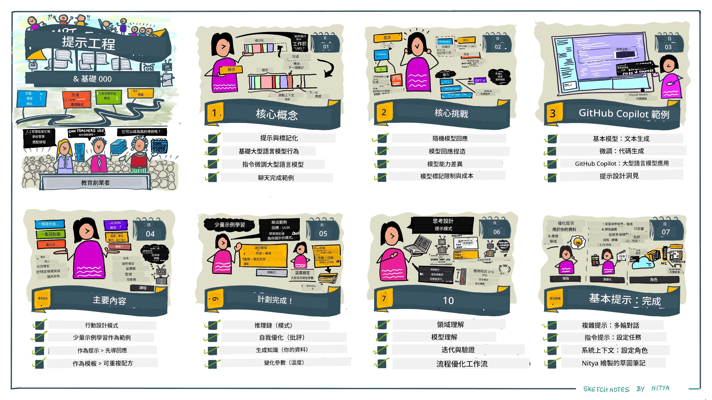
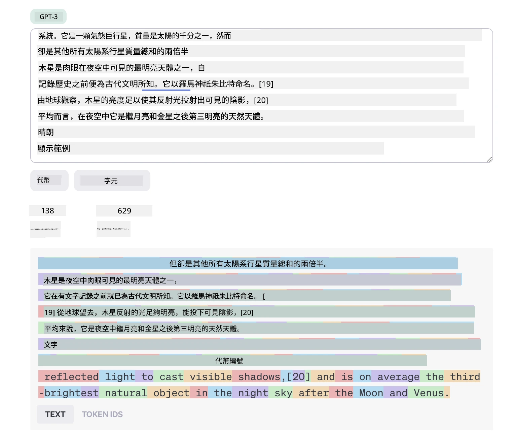
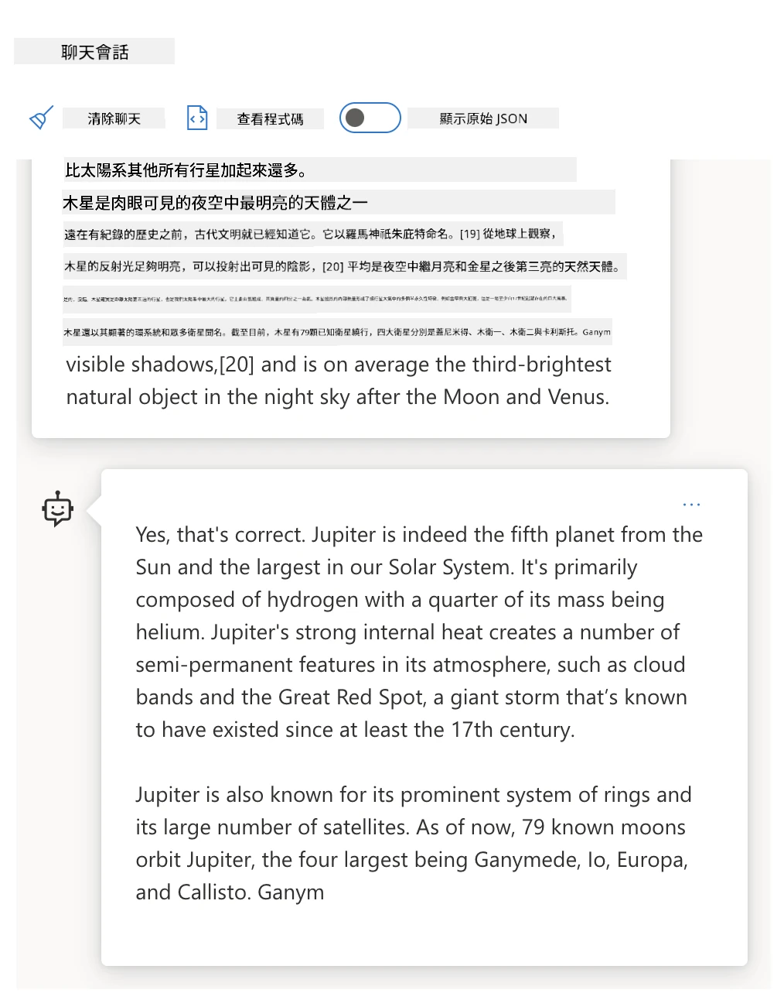
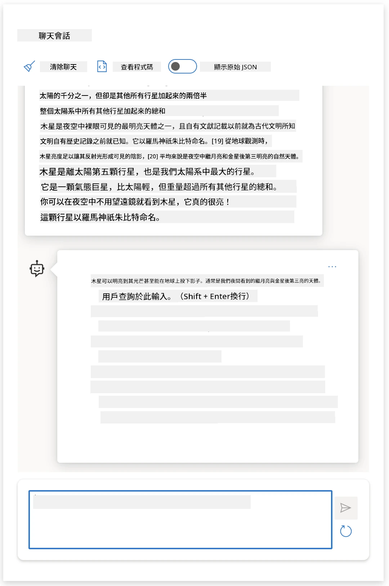
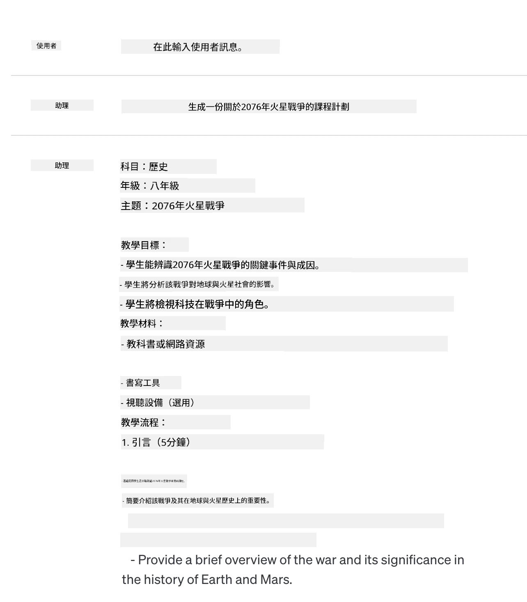
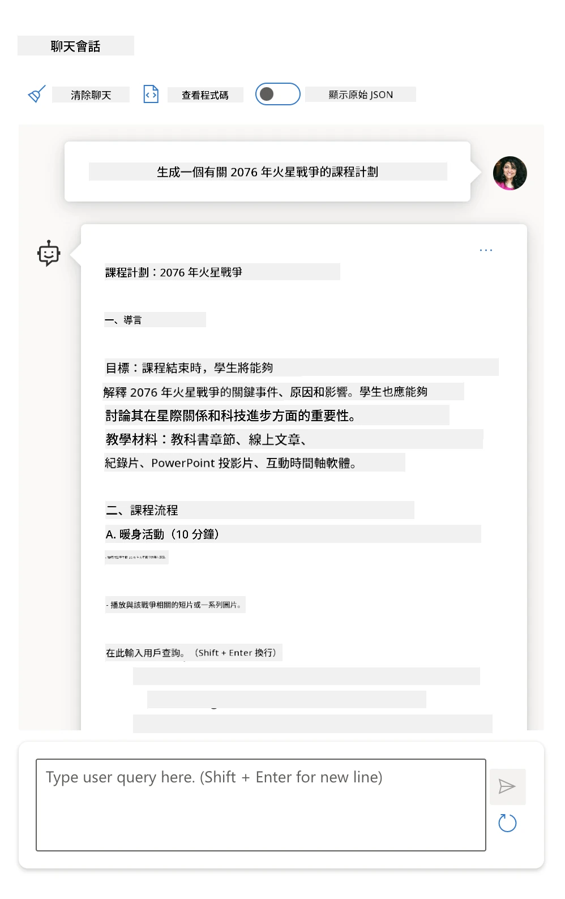
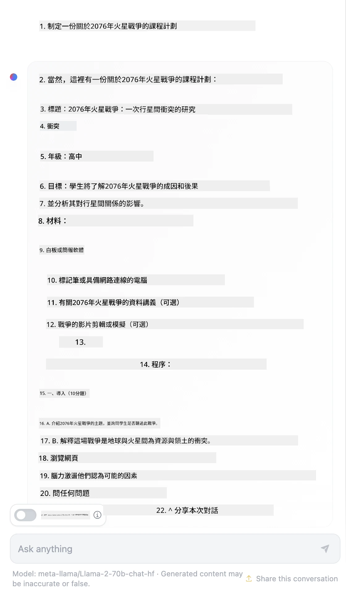

# 提示工程基礎

[](https://youtu.be/GElCu2kUlRs?si=qrXsBvXnCW12epb8)

## 介紹
本模組涵蓋在生成式 AI 模型中創建有效提示的基本概念和技術。你給大型語言模型 (LLM) 的提示寫法也很重要。經過精心設計的提示可以產生更高質量的回應。但像是「提示 (prompt)」和「提示工程 (prompt engineering)」這些詞究竟是什麼意思？我該如何改善送到 LLM 的提示輸入呢？這些是我們在本章和下一章會嘗試解答的問題。

_生成式 AI_ 能夠根據使用者請求創造新內容（例如文字、圖片、音訊、程式碼等）。它透過像是 OpenAI 的 GPT（「生成式預訓練轉換器」）系列大型語言模型，這些模型是經由自然語言和程式碼的訓練而成。

使用者現在可以用熟悉的對話方式與這些模型互動，無需任何技術專長或訓練。這些模型是基於「提示」的，使用者傳送文字輸入（提示），模型就會回應 AI 產生的結果（補全）。使用者能透過多回合對話「與 AI 聊天」，不斷微調其提示直到回應符合期望。

「提示」現在成為生成式 AI 應用的主要 _程式介面_，告訴模型要做什麼，並影響回應品質。「提示工程」是一個快速成長的研究領域，專注於設計和優化提示，旨在大規模地提供穩定且高品質的回應。

## 學習目標

本課程中，我們將學習什麼是提示工程、為什麼它重要，以及如何為給定的模型和應用目標設計更有效的提示。我們將理解提示工程的核心概念和最佳實務，並了解如何使用 Jupyter 筆記本的互動沙箱環境，將這些概念應用於真實範例。

在本課程結束時，我們將能夠：

1. 解釋什麼是提示工程及其重要性。
2. 描述提示的組成與使用方式。
3. 學習提示工程的最佳實務與技巧。
4. 運用所學技巧於真實範例，使用 OpenAI 端點。

## 關鍵詞彙

提示工程：設計與優化輸入，以引導 AI 模型產生期望輸出的方法。
分詞（Tokenization）：將文字轉換為模型可理解和處理的較小單位（稱為「token」）的過程。
指令微調的大型語言模型（Instruction-Tuned LLMs）：經過特定指令進行微調的大型語言模型，以提升回應準確性和相關度。

## 學習沙箱

提示工程目前較偏向藝術而非科學。提升直覺的最佳方法是_多練習_，並採用結合應用領域專業知識與推薦技巧和特定模型優化的嘗試錯誤方法。

本課程附帶的 Jupyter 筆記本提供一個_沙箱_環境，讓你可以邊學邊試，或作為結尾的程式挑戰。執行練習，你將需要：

1. **Azure OpenAI API 金鑰**--用於部署 LLM 的服務端點。
2. **Python 執行環境**--可執行筆記本。
3. <strong>本地環境變數</strong>--_請先完成 [SETUP](./../00-course-setup/02-setup-local.md?WT.mc_id=academic-105485-koreyst) 步驟準備_。

筆記本含有_入門_練習，但鼓勵您自行新增_Markdown_（說明）和_Code_（提示請求）區塊，嘗試更多範例或想法，培養提示設計直覺。

## 插圖指南

想在深入學習前先了解本課程涵蓋的全貌嗎？看看這份插圖指南，讓你了解主要主題與每個主題的關鍵重點。課程路線圖將帶你從理解核心概念與挑戰，到運用相關提示工程技巧和最佳實務來解決問題。請注意，本指南中「進階技巧」部分指的是本課程下一章將涵蓋的內容。



## 我們的新創公司

現在，讓我們談談_本主題_如何關聯於我們將 AI 創新帶入教育的初衷 ([bring AI innovation to education](https://educationblog.microsoft.com/2023/06/collaborating-to-bring-ai-innovation-to-education?WT.mc_id=academic-105485-koreyst))。我們想打造利用 AI 推動的_個人化學習_應用，讓我們思考不同使用者如何「設計」他們的提示：

- <strong>管理者</strong> 可能會請 AI _分析課程資料找出覆蓋不足之處_。AI 可以摘要結果或用程式碼來視覺化。
- <strong>教育工作者</strong> 可能會請 AI _為特定受眾及主題產生教案_。AI 可以依指定格式建立個人化計畫。
- <strong>學生</strong> 可能會請 AI _輔導他們在困難科目上的學習_。AI 現在能以學生的程度提供課程、提示和範例指引。

這只是冰山一角。看看 [Prompts For Education](https://github.com/microsoft/prompts-for-edu/tree/main?WT.mc_id=academic-105485-koreyst)—由教育專家策劃的開源提示庫，幫你更全面了解各種可能！_試著在沙箱或 OpenAI Playground 執行其中一些提示，看看結果！_

<!--
LESSON TEMPLATE:
本單元應涵蓋核心概念 #1。
以範例和參考資料加強概念。

核心概念 #1：
提示工程。
定義它，並說明為何需要。
-->

## 什麼是提示工程？

我們從定義<strong>提示工程</strong>開始，指的是為給定的應用目標和模型_設計與優化_文字輸入（提示），以產出一致且高品質的回應（補全）的過程。我們可以將其視為兩步驟：

- 為特定模型與目標_設計_初始提示
- 迭代_微調_提示以提升回應品質

這必然是一個試錯過程，需靠使用者直覺和努力以取得最佳效果。那為什麼它重要呢？為了解答，我們先來理解三個概念：

- _分詞_ = 模型如何「看到」提示
- _基礎 LLM_ = 基礎模型如何「處理」提示
- _指令微調 LLM_ = 模型如何「理解任務」

### 分詞

大型語言模型將提示視為_一連串的 token_，不同模型（或模型版本）對同一提示的分詞方式可能不同。由於 LLM 是以 token（而非原始文字）進行訓練，提示的分詞方式會直接影響生成回應的品質。

想要了解分詞的運作直覺嗎？試試下面示例的 [OpenAI Tokenizer](https://platform.openai.com/tokenizer?WT.mc_id=academic-105485-koreyst) 工具。貼上你的提示－看看它如何被轉換為 token，特別留意空白字元與標點符號的處理。此示例用的是舊版 LLM（GPT-3），用新版模型可能會得出不同結果。



### 概念：基礎模型

一旦提示被分詞，["基礎 LLM"](https://blog.gopenai.com/an-introduction-to-base-and-instruction-tuned-large-language-models-8de102c785a6?WT.mc_id=academic-105485-koreyst)（或稱基礎模型）的核心功能是預測序列中下一個 token。由於 LLM 是基於龐大文字資料集訓練，能很好地掌握 token 間統計關係，並以一定信心完成預測。請注意，模型並不「理解」提示或 token 的_意義_，它只是看到可「補完」的模式，並不斷預測序列直到使用者終止或達既定條件。

想看看基於提示的補全如何運作？將上面提示輸入 [Microsoft Foundry playground](https://ai.azure.com?WT.mc_id=academic-105485-koreyst) 的預設設定。系統把提示視為資訊請求，你應該會看到符合上下文的補全結果。

但如果使用者想要特定符合某些條件或任務目標的回應呢？這時候就需要用到_指令微調_的 LLM。



### 概念：指令微調 LLM

[指令微調 LLM](https://blog.gopenai.com/an-introduction-to-base-and-instruction-tuned-large-language-models-8de102c785a6?WT.mc_id=academic-105485-koreyst) 基於基礎模型，使用帶有明確指令的範例或輸入/輸出對（例如多回合「訊息」）進行微調，AI 的回應會嘗試遵循該指令。

它運用像是人類回饋強化學習 (RLHF) 的技術，可教模型_遵循指令_、_從回饋學習_，進而產生更切合實際應用、更符合使用者目標的回應。

我們試試看－回到上面提示，將 _系統訊息_ 改成以下指令作為上下文：

> _請將所提供內容為二年級學生做摘要。結果限定在一段文字，並以 3-5 個重點列出。_

看看結果如何調整為符合指定目標和格式？教育工作者現在可以直接使用這段回應於該堂課的簡報。



## 為什麼我們需要提示工程？

瞭解提示如何被 LLM 處理後，我們來談談_為何_需要提示工程。理由在於現有 LLM 存在一些挑戰，使得不花心力進行提示建構和優化，很難達成_可靠且一致的補全_。例如：

1. **模型回應具隨機性。**_相同的提示_在不同模型或版本中，可能產生不同回應。同一模型在不同時間也會有不同結果。_提示工程技巧有助於降低這些變異，提供更好的護欄_。

1. <strong>模型可能編造回應。</strong>模型是基於_龐大但有限_的資料集訓練，因此對超出訓練範圍的概念不甚了解。結果可能生成錯誤、虛構或與既知事實相反的補全。_提示工程可幫助使用者識別並減輕這類編造，例如向 AI 詢問引用來源或推理_。

1. <strong>模型能力各異。</strong>新版或新一代模型功能更豐富，但同時帶來獨特的特性及成本與複雜度的權衡。_提示工程能助我們發展最佳實務與工作流程，抽象化差異並適應特定模型需求，以規模化和無縫方式調整_。

讓我們在 OpenAI 或 Azure OpenAI Playground 中看看這些現象：

- 用相同提示嘗試不同 LLM 部署（如 OpenAI、Azure OpenAI、Hugging Face）－你看到變化了嗎？
- 用相同提示重複嘗試同一 LLM 部署（例如 Azure OpenAI playground）－這些變化有何不同？

### 編造範例

在本課程中，我們用<strong>「編造」</strong>一詞指代 LLM 有時因訓練限制或其他制約，產生事實不正確資訊的現象。你可能在流行文章或研究論文中聽過此現象被稱為_"幻覺"（hallucination）_。但我們強烈建議使用「編造」一詞，以避免不小心將此行為人格化，誤將機器生成結果視為人類特質。這同時強化了從用語角度出發的[負責任 AI 指南](https://www.microsoft.com/ai/responsible-ai?WT.mc_id=academic-105485-koreyst)，剔除可能被視為冒犯或不包容的詞彙。

想了解編造是如何運作嗎？想像一個要求 AI 產生不存在主題內容的提示（確保該主題未在訓練資料中）。例如－我試了這條提示：

> **提示：** 產生關於 2076 年火星戰爭的課程計畫。

網路搜尋顯示，有關火星戰爭的虛構作品（例如電視劇或書籍），但沒有發生在 2076 年的。常識也告訴我們，2076 年_屬於未來_，因此不可能是真實事件。


那當我們用不同的 LLM 供應商執行這個提示時會發生什麼？

> **回應 1**：OpenAI Playground (GPT-35)



> **回應 2**：Azure OpenAI Playground (GPT-35)



> **回應 3**：Hugging Face Chat Playground (LLama-2)



如預期，每個模型（或模型版本）因為隨機行為和模型能力的差異會產生略有不同的回應。例如，有一個模型針對 8 年級的觀眾，而另一個則假設是高中生。但這三個模型都確實產生了能讓未受資訊影響的使用者信服該事件是真實的回應。

提示工程技術如 _元提示（metaprompting）_ 和 _溫度設定（temperature configuration）_ 可能在一定程度上減少模型捏造。新的提示工程 _架構_ 也無縫整合新工具和技術進入提示流程，以緩解或減少部分這些效應。

## 案例研究：GitHub Copilot

讓我們以一個案例研究結束本節，了解提示工程如何在現實解決方案中使用—看看 [GitHub Copilot](https://github.com/features/copilot?WT.mc_id=academic-105485-koreyst)。

GitHub Copilot 是你的「AI 搭檔程式設計師」— 它將文字提示轉換成程式碼補完，並整合在你的開發環境（例如 Visual Studio Code）中，以實現無縫的使用者體驗。如下面一連串的部落格所記載，最早版本基於 OpenAI Codex 模型—工程師很快意識到需要微調模型並開發更佳的提示工程技術，以提升程式碼品質。今年七月，他們[推出超越 Codex 的改良 AI 模型](https://github.blog/2023-07-28-smarter-more-efficient-coding-github-copilot-goes-beyond-codex-with-improved-ai-model/?WT.mc_id=academic-105485-koreyst)，提供更快的建議。

請依序閱讀這些文章，追蹤他們的學習旅程。

- **2023 年 5 月** | [GitHub Copilot 在理解你的程式碼方面越來越好](https://github.blog/2023-05-17-how-github-copilot-is-getting-better-at-understanding-your-code/?WT.mc_id=academic-105485-koreyst)
- **2023 年 5 月** | [深入 GitHub：GitHub Copilot 背後的 LLM 運作原理](https://github.blog/2023-05-17-inside-github-working-with-the-llms-behind-github-copilot/?WT.mc_id=academic-105485-koreyst)
- **2023 年 6 月** | [如何為 GitHub Copilot 撰寫更好的提示](https://github.blog/2023-06-20-how-to-write-better-prompts-for-github-copilot/?WT.mc_id=academic-105485-koreyst)
- **2023 年 7 月** | [GitHub Copilot 透過改良的 AI 模型超越 Codex](https://github.blog/2023-07-28-smarter-more-efficient-coding-github-copilot-goes-beyond-codex-with-improved-ai-model/?WT.mc_id=academic-105485-koreyst)
- **2023 年 7 月** | [開發者指南：提示工程與大型語言模型（LLMs）](https://github.blog/2023-07-17-prompt-engineering-guide-generative-ai-llms/?WT.mc_id=academic-105485-koreyst)
- **2023 年 9 月** | [如何打造企業級大型語言模型應用：來自 GitHub Copilot 的教訓](https://github.blog/2023-09-06-how-to-build-an-enterprise-llm-application-lessons-from-github-copilot/?WT.mc_id=academic-105485-koreyst)

你也可以瀏覽其[工程部落格](https://github.blog/category/engineering/?WT.mc_id=academic-105485-koreyst)，尋找更多文章如[這篇](https://github.blog/2023-09-27-how-i-used-github-copilot-chat-to-build-a-reactjs-gallery-prototype/?WT.mc_id=academic-105485-koreyst)，展示這些模型和技術如何被 _應用_ 於驅動真實世界的應用。

---

<!--
LESSON TEMPLATE:
這單元應該涵蓋核心概念 #2。
透過範例和參考資料強化概念。

核心概念 #2：
提示設計。
用範例說明。
-->

## 提示構造

我們已了解為什麼提示工程重要—現在讓我們理解提示如何 _構造_，以便評估不同技術來設計更有效的提示。

### 基本提示

先從基本提示開始：一個沒有其他上下文的文字輸入送給模型。舉例來說，當我們將美國國歌開頭幾句送到 OpenAI [Completion API](https://platform.openai.com/docs/api-reference/completions?WT.mc_id=academic-105485-koreyst)，它會瞬間 _補完_ 接下來的幾句，展示基本的預測行為。

| 提示（輸入）       | 補完（輸出）                                                                                                                           |
| :----------------- | :------------------------------------------------------------------------------------------------------------------------------------- |
| Oh say can you see | 聽起來你是在開始唱《星條旗永不落》（The Star-Spangled Banner），美國的國歌。完整歌詞是 ...                                       |

### 複雜提示

現在讓我們在基本提示上加入上下文和指示。[Chat Completion API](https://learn.microsoft.com/azure/ai-services/openai/how-to/chatgpt?WT.mc_id=academic-105485-koreyst) 讓我們能建構為一組 _訊息_ 的複雜提示，包含：

- 反映 _使用者_ 輸入和 _助手_ 回應的輸入/輸出對。
- 設定助手行為或個性的系統訊息。

請求現在以下列形式呈現，其中 _分詞（tokenization）_ 有效擷取上下文和對話中的相關資訊。改變系統上下文對補完品質的影響，與提供的使用者輸入同等重要。

```python
response = client.responses.create(
    model="gpt-4o-mini",
    input=[
        {"role": "system", "content": "You are a helpful assistant."},
        {"role": "user", "content": "Who won the world series in 2020?"},
        {"role": "assistant", "content": "The Los Angeles Dodgers won the World Series in 2020."},
        {"role": "user", "content": "Where was it played?"}
    ]
)
```

### 指令提示

上述範例中，使用者提示是簡單的文字查詢，可詮釋為資訊請求。藉由 _指令_ 提示，我們能用文字更詳細規定任務，提供更佳指引給 AI。以下是範例：

| 提示（輸入）                                                                                                                                                                                                                         | 補完（輸出）                                                                                                        | 指令類型            |
| :------------------------------------------------------------------------------------------------------------------------------------------------------------------------------------------------------------------------------------- | :------------------------------------------------------------------------------------------------------------------------- | :------------------ |
| Write a description of the Civil War                                                                                                                                                                                                   | _回傳簡單段落_                                                                                                   | 簡單                |
| Write a description of the Civil War. Provide key dates and events and describe their significance                                                                                                                                     | _回傳段落後附重要事件日期與描述的列表_                                                                           | 複雜                |
| Write a description of the Civil War in 1 paragraph. Provide 3 bullet points with key dates and their significance. Provide 3 more bullet points with key historical figures and their contributions. Return the output as a JSON file | _回傳更詳盡的文字框內容，格式為 JSON，可複製貼上到檔案並視需要驗證_                                       | 複雜且格式化        |

## 主要內容

在上述範例中，提示仍相當開放，讓大型語言模型決定其預訓練資料中哪些部分是相關的。透過 _主要內容_ 設計模式，輸入文字分為兩部分：

- 指令（動作）
- 相關內容（影響動作的部分）

以下範例中，指令是「用兩句話摘要此內容」。

| 提示（輸入）                                                                                                                                                                                                                                                                                                                                                                                                                                                                                                                                                                                                                                                                             | 補完（輸出）                                                                                                                                                                                                                                                                           |
| :---------------------------------------------------------------------------------------------------------------------------------------------------------------------------------------------------------------------------------------------------------------------------------------------------------------------------------------------------------------------------------------------------------------------------------------------------------------------------------------------------------------------------------------------------------------------------------------------------------------------------------------------------------------------------------- | :------------------------------------------------------------------------------------------------------------------------------------------------------------------------------------------------------------------------------------------------------------------------------------ |
| 木星是太陽系中第五顆行星，也是最大的行星。它是一顆氣態巨星，質量是太陽的千分之一，但卻是太陽系其他所有行星質量總和的兩倍半。木星是夜空中裸眼可見的最亮天體之一，自有文字記錄以來便被古文明所知。它以羅馬神祇木星命名。[19] 從地球觀看時，木星的反射光足夠投影出可見的影子，[20] 且平均來說，它是繼月亮和金星之後夜空中第三亮的天然天體。 <br/> <strong>用兩句話摘要此內容</strong> | 木星是第五顆行星，是太陽系中最大的行星，且是夜空中最明亮的天體之一。它以羅馬神祇木星命名，是一顆氣態巨星，質量是其他所有行星總和的兩倍半。                                                    |

主要內容段可以用多種方式驅動更有效的指令：

- <strong>範例</strong> — 不直接告訴模型明確指令，而是給它要做的範例，讓它推斷模式。
- <strong>提示</strong> — 在指令後附上一個「提示」，引導補完，讓模型往更相關的回應方向走。
- <strong>模板</strong> — 這是可重複使用的提示「配方」，裡面有可用資料客製化的佔位符（變數）以適用特定情境。

讓我們看看這些在實務中的應用。

### 使用範例

這種做法是用主要內容「餵給模型」一些範例，展示該指令下期望的輸出，讓模型推理出期望輸出的模式。根據範例數量，我們有零示例（zero-shot）、單示例（one-shot）、多示例（few-shot）等提示方式。

提示現在包含三個成分：

- 任務描述
- 幾個期望輸出的範例
- 新範例的開頭（隱含任務描述）

| 學習類型    | 提示（輸入）                                                                                                 | 補完（輸出）              |
| :---------- | :----------------------------------------------------------------------------------------------------------- | :------------------------- |
| 零示例      | "The Sun is Shining". Translate to Spanish                                                                    | "El Sol está brillando".   |
| 單示例      | "The Sun is Shining" => ""El Sol está brillando". <br> "It's a Cold and Windy Day" =>                           | "Es un día frío y ventoso".|
| 多示例      | The player ran the bases => Baseball <br/> The player hit an ace => Tennis <br/> The player hit a six => Cricket <br/> The player made a slam-dunk => | Basketball                 |
|             |                                                                                                              |                           |

注意在零示例提示中，我們必須明確指令（「翻譯成西班牙文」），但在單示例提示中此指令是被推論出來的。多示例提示說明增加範例數量，模型能無需額外指令做出更精確推斷。

### 提示線索

使用主要內容的另一種技巧是提供 _線索（cue）_，而非範例。在此，我們給模型一個朝向正確方向的輕推，_以一段片段開頭_，反映期望的回應格式。模型接著「接收到線索」繼續產生該形式的內容。

| 線索數量 | 提示（輸入）                                                                                                                                                                                                                                                                                                                                                                                                                                               | 補完（輸出）                                                                                                                                                                                                                                                                                       |
| :------- | :----------------------------------------------------------------------------------------------------------------------------------------------------------------------------------------------------------------------------------------------------------------------------------------------------------------------------------------------------------------------------------------------------------------------------------------------------------- | :-------------------------------------------------------------------------------------------------------------------------------------------------------------------------------------------------------------------------------------------------------------------------------------------------- |
| 0        | 木星是太陽系中第五顆行星，也是最大的行星。它是一顆氣態巨星，質量是太陽的千分之一，但卻是太陽系其他所有行星質量總和的兩倍半。木星是夜空中裸眼可見的最亮天體之一，自有文字記錄以來便被古文明所知。 <br/><strong>摘要此內容</strong>                                                       | 木星是我們太陽系中最大的行星，位於太陽的第五顆位置。它是一顆氣態巨星，質量為太陽的千分之一，但比其它所有行星加起來還重。古文明早已知曉木星，且它在夜空中十分明亮。                                                                                                                                      |
| 1        | 木星是太陽系中第五顆行星，也是最大的行星。它是一顆氣態巨星，質量是太陽的千分之一，但卻是太陽系其他所有行星質量總和的兩倍半。木星是夜空中裸眼可見的最亮天體之一，自有文字記錄以來便被古文明所知。 <br/><strong>摘要此內容</strong> <br/> 我們知道木星 | 是太陽系中第五顆行星，也是最大的行星。它是一顆氣態巨星，質量是太陽的千分之一，但卻是其它所有行星質量總和的兩倍半。它肉眼可見，自古以來便被人知曉。                                                                                                                                              |

| 2              | 木星是太陽系中第五顆行星，也是最大的行星。它是一顆氣體巨星，質量約為太陽的千分之一，但相當於太陽系其他所有行星質量總和的兩倍半。木星是夜空中用肉眼可見的最明亮天體之一，自有歷史記錄之前便為古代文明所知。<br/><strong>總結這些</strong> <br/> 我們學到的三大要點：         | 1. 木星是太陽系中第五顆行星，也是最大的行星。<br/> 2. 它是一顆氣體巨星，質量約為太陽的千分之一……<br/> 3. 木星自古代以來就能用肉眼看見……                                                                       |
|                |                                                                                                                                                                                                                                                                                                                                                                                                                                                              |                                                                                                                                                                                                                                                                                                           |

### 提示範本

提示範本是 _預先定義好的提示_recipe_，可儲存並按需重複使用，以推動更具一致性的用戶體驗。在最簡單的形式中，它只是像[這個來自 OpenAI 的範例](https://cookbook.openai.com/examples/gpt4-1_prompting_guide?WT.mc_id=academic-105485-koreyst)一樣，提供互動式提示元件（用戶和系統訊息）和 API 請求格式－以支持重用。

在更複雜的形式中，如[這個來自 LangChain 的範例](https://python.langchain.com/docs/concepts/prompt_templates/?WT.mc_id=academic-105485-koreyst)，它包含 _可替換的佔位符_，可用來替換來自各種來源的資料（用戶輸入、系統上下文、外部資料來源等），從而動態生成提示。這讓我們能創建一個可重複使用的提示庫，<strong>以程式化方式</strong>規模化推動一致的用戶體驗。

最後，範本的最大價值在於能創建和發布 _垂直應用領域的提示庫_－提示範本被 _優化_ 以反映特定應用場景或範例，讓回應對特定用戶群更相關且準確。[Prompts For Edu](https://github.com/microsoft/prompts-for-edu?WT.mc_id=academic-105485-koreyst) 專案就是很好的示例，策畫了一個專注於教育領域提示的庫，強調課程規劃、課程設計、學生輔導等關鍵目標。

## 支援內容

如果我們把提示結構視為由指令（任務）和目標（主要內容）組成，那麼 _次要內容_ 就像是額外提供的上下文，能夠<strong>以某種方式影響輸出</strong>。它可能包括調整參數、格式指示、主題分類等，幫助模型 _調整_ 回應，使其更符合期望或用戶目標。

例如：給定一個課程目錄，內含豐富的元資料（名稱、描述、等級、元資料標籤、講師等）涵蓋整個課程：

- 我們可以定義一個指令叫「總結 2023 年秋季課程目錄」
- 我們可以用主要內容給出一些期望輸出的範例
- 我們可以用次要內容來辨識最關注的五個「標籤」

現在模型可以依據該範例格式去總結，但當結果包含多個標籤時，會優先考慮次要內容中識別出的五個標籤。

---

<!--
課程範本：
本單元應涵蓋核心概念 #1。
用範例和參考資料強化該概念。

概念 #3：
提示工程技術。
有哪些基本的提示工程技術？
用一些練習來說明。
-->

## 提示工程最佳實務

現在我們知道了提示如何被 _建構_，可以開始思考如何 _設計_ 它們以反映最佳實務。我們可以從兩個面向思考－具備正確的 _思維模式_ 和應用正確的 _技術_。

### 提示工程思維模式

提示工程是個反覆試錯的過程，請記住三大指導要點：

1. **領域理解很重要。** 回應的準確性和相關性取決於該應用或用戶運作的 _領域_。運用你的直覺和領域專業技術來<strong>針對技巧做客製化</strong>。例如，在系統提示中定義 _領域專屬人格_，或在用戶提示中使用 _領域專屬範本_。提供反映領域特定背景的次要內容，或用 _領域提示和範例_ 導引模型朝熟悉用法前進。

2. **模型理解很重要。** 我們知道模型本質上是隨機性的，但不同模型根據其訓練資料集（預訓練知識）、所提供的功能（例如透過 API 或 SDK）和優化內容類型（如程式碼、影像、文本）存在差異。了解你使用的模型優缺點，並利用這些認知去 _優先排序任務_ 或構建 _客製化範本_ 以發揮模型能力。

3. **迭代與驗證很重要。** 模型和提示工程技巧都在快速進步。作為領域專家，你可能擁有其他特定應用的背景或判斷標準，這些未必適用於更廣泛的社群。使用提示工程工具及方法來快速「起步」提示建構，然後用你的直覺和領域專業不斷迭代與驗證結果。記錄你的見解並建立 <strong>知識庫</strong>（如提示庫），供他人未來當作新基準使用，以加速迭代。

## 最佳實務

現在來看看 [OpenAI](https://help.openai.com/en/articles/6654000-best-practices-for-prompt-engineering-with-openai-api?WT.mc_id=academic-105485-koreyst) 和 [Azure OpenAI](https://learn.microsoft.com/azure/ai-services/openai/concepts/prompt-engineering#best-practices?WT.mc_id=academic-105485-koreyst) 實務者推薦的常見最佳做法。

| 做什麼                          | 為什麼                                                                                                                                                                                                                                               |
| :-------------------------------- | :------------------------------------------------------------------------------------------------------------------------------------------------------------------------------------------------------------------------------------------------ |
| 評估最新模型                    | 新一代模型可能有更好的功能與品質，但可能伴隨較高成本。評估其影響後再作遷移決策。                                                                                                              |
| 分離指令與上下文              | 檢查你的模型或服務提供者是否定義了 _分隔符_，用以更清楚區分指令、主要與次要內容。這能幫助模型更精準分配權重給詞元。                                                                           |
| 具體且清楚                    | 提供更多想要的上下文、結果、長度、格式、風格等細節。這會改善回應品質與一致性。將流程建成可重用範本。                                                                                         |
| 描述性強，使用範例            | 模型對「示範與說明」法回應可能更佳。先用 `零次學習`（給指令但不示範），再用 `少次學習` 精煉，提供數個期望範例。可用類比說明。                                                                |
| 使用提示詞引導完成            | 給模型一些引導詞或短語，作為回應的起點，推動其朝特定結果前進。                                                                                                                                |
| 重複強調                      | 有時需重複指令給模型。可在主要內容前後都放指令，或用指令加提示詞。透過迭代與驗證找出奏效做法。                                                                                              |
| 呈現順序很重要                | 你呈現給模型資訊的順序會影響輸出，包含學習範例的順序，這是因為近期偏向效應。嘗試不同選項找出最適合的。                                                                                          |
| 給模型「退路」                | 給模型一個 _備援_ 回應，以便無法完成任務時使用。這能減少模型生成錯誤或杜撰回應的機會。                                                                                                      |
|                              |                                                                                                                                                                                                                                                   |

和任何最佳實務一樣，請記住基於模型、任務和領域的不同，_你的情況可能會不同_。將這些作為起點，並不斷迭代以找出最適合你的做法。隨著新模型和工具的推出，要持續重新評估你的提示工程流程，聚焦流程擴展性和回應品質。

<!--
課程範本：
本單元若適用應提供程式碼挑戰

挑戰：
提供一個 Jupyter 筆記本的連結，指令中只有程式碼註解（程式碼區塊為空）。

解答：
提供一個筆記本的副本連結，裡面已填入並執行提示，展示一個可能的範例。
-->

## 作業

恭喜！你已經完成本課程！是時候用實際範例來測試這些概念和技術了！

這次作業我們將使用一個搭配可互動完成練習的 Jupyter 筆記本。你也可以在筆記本中新增自己的 Markdown 和程式碼單元，獨立探索想法和技術。

### 開始之前，先分叉這個倉庫，然後

- （推薦）啟動 GitHub Codespaces
- （替代方案）將倉庫克隆到本地裝置並配合 Docker Desktop 使用
- （替代方案）用你偏好的筆記本執行環境打開筆記本

### 接著，設定你的環境變數

- 將倉庫根目錄的 `.env.copy` 複製為 `.env`，並填入 `AZURE_OPENAI_API_KEY`、`AZURE_OPENAI_ENDPOINT` 和 `AZURE_OPENAI_DEPLOYMENT` 的值。再回來[學習沙盒章節](#學習沙箱)了解設定方法。

### 然後，打開 Jupyter 筆記本

- 選擇執行內核。若用方案 1 或 2，直接選 dev container 預設提供的 Python 3.10.x 內核即可。

你已準備好執行練習。注意這裡沒有「對錯」答案－只是透過試錯探索不同選項，建立對特定模型及應用領域的直覺。

_基於此，本課程沒有程式碼解答區塊。相反地，筆記本會有標題為「我的解答：」的 Markdown 單元，展示一個參考輸出範例。_

 <!--
課程範本：
用一段摘要和自學資源將本節包裹起來。
-->

## 知識檢核

以下哪一個是遵循合理最佳實務的好提示？

1. 給我一張紅色汽車的圖片
2. 給我一張在懸崖旁夕陽下停著的 Volvo XC90 型號紅色汽車圖片
3. 給我一張 Volvo XC90 型號紅色汽車的圖片

答案：2，是最佳提示，因為它說明「什麼樣的車」且細節具體（不是任何車，而是特定廠牌與型號），還描述了整體場景。3 次之，也具描述性。

## 🚀 挑戰

嘗試用「提示詞（cue）」技術完成句子：「給我一張 Volvo 牌和 」開頭的紅色汽車圖片。模型會回應什麼？你會如何改進？

## 很棒！繼續學習吧

想了解更多提示工程相關概念？前往[持續學習頁面](https://aka.ms/genai-collection?WT.mc_id=academic-105485-koreyst)尋找其他優質資源。

接著前往第 5 課，我們將探討[進階提示技術](../05-advanced-prompts/README.md?WT.mc_id=academic-105485-koreyst)！

---

<!-- CO-OP TRANSLATOR DISCLAIMER START -->
**免責聲明**：
此文件已使用 AI 翻譯服務 [Co-op Translator](https://github.com/Azure/co-op-translator) 進行翻譯。雖然我們努力追求準確性，但請注意自動翻譯可能包含錯誤或不準確之處。原始文件的母語版本應視為權威來源。對於關鍵資訊，建議採用專業人工翻譯。我們不對因使用此翻譯所產生的任何誤解或誤譯承擔責任。
<!-- CO-OP TRANSLATOR DISCLAIMER END -->