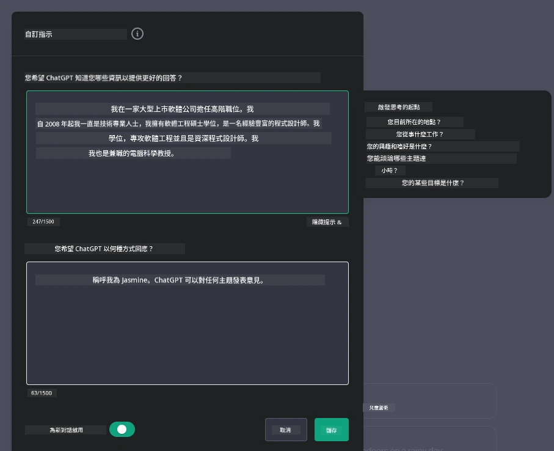
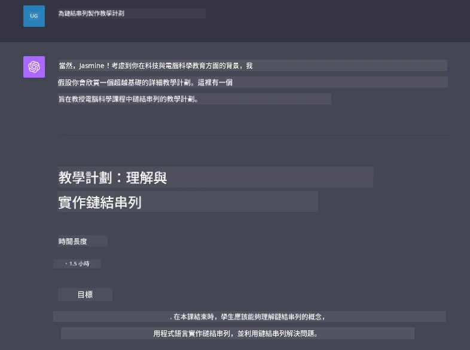

# 建立生成式 AI 驅動的聊天應用程式

[](https://youtu.be/R9V0ZY1BEQo?si=IHuU-fS9YWT8s4sA)

> _(點擊上方圖像以觀看本課程影片)_

現在我們已經了解如何構建文本生成應用程式，接下來來看看聊天應用程式。

聊天應用程式已經融入我們的日常生活，不僅是閒聊的工具，它們也是客戶服務、技術支持，甚至複雜諮詢系統的重要組成部分。很可能你不久前就曾從聊天應用程式獲得幫助。隨著我們將生成式 AI 這類更先進的技術融入這些平台，系統的複雜度和挑戰也隨之增加。

我們需要回答的一些問題包括：

- <strong>建立應用程式</strong>。我們如何有效構建並無縫整合這些 AI 驅動的應用程式來滿足特定用例？
- <strong>監控</strong>。應用部署後，我們該如何監控並確保應用程式在功能和遵守[負責任的 AI 六大原則](https://www.microsoft.com/ai/responsible-ai?WT.mc_id=academic-105485-koreyst)方面均達到最高品質？

隨著我們邁入自動化和人機無縫互動的時代，理解生成式 AI 如何改變聊天應用的範圍、深度和適應性變得至關重要。本課程將探討支援這些複雜系統的架構層面，深入調查領域特定任務的微調方法，並評估確保負責任 AI 部署的衡量標準與考量。

## 介紹

本課程涵蓋：

- 有效構建並整合聊天應用程式的技巧。
- 如何對應用程式進行自訂與微調。
- 有效監控聊天應用程式的策略與考量事項。

## 學習目標

課程結束後，你將能夠：

- 描述構建並整合聊天應用程式到現有系統中的考量。
- 針對特定用例自訂聊天應用程式。
- 識別關鍵指標和考量事項，以有效監控和維護 AI 驅動的聊天應用品質。
- 確保聊天應用能負責任地利用 AI。

## 將生成式 AI 整合到聊天應用程式中

利用生成式 AI 提升聊天應用不僅是讓系統更智慧，還需要優化其架構、效能與使用者介面，以提供優質的使用體驗。這包含調查架構基礎、API 整合方式，以及使用者界面的考量。本節旨在為你提供一條完整的路線圖，幫助你在既有系統整合或打造獨立平台時，應對這些複雜的領域。

本節結束時，你將具備高效構建及整合聊天應用程式所需的專業知識。

### 聊天機器人還是聊天應用程式？

在深入構建聊天應用程式前，先比較「聊天機器人」與「AI 驅動的聊天應用程式」，它們在角色與功能上有所不同。聊天機器人的主要目的是自動化特定對話任務，如回答常見問題或追蹤包裹，通常由基於規則的邏輯或複雜的 AI 演算法控制。相較之下，AI 驅動的聊天應用程式是一個更廣泛的環境，旨在促進人類用戶之間各種形式的數位溝通，如文字、語音及視訊聊天。其核心特色是整合生成式 AI 模型，以模擬細膩、類人對話，根據多種輸入與語境線索生成回應。生成式 AI 驅動的聊天應用能進行開放領域的討論，適應演變中的對話上下文，甚至可產生創意或複雜的對話。

下表列出兩者的主要差異與相似點，幫助我們理解它們在數位溝通舞台上的獨特角色。

| 聊天機器人                               | 生成式 AI 驅動的聊天應用程式                      |
| ------------------------------------- | -------------------------------------- |
| 專注任務且基於規則                   | 具語境感知能力                          |
| 通常整合於更大系統中                 | 可承載一個或多個聊天機器人               |
| 限於程式設定的功能                   | 整合生成式 AI 模型                      |
| 專業且結構化的互動                   | 能夠進行開放領域討論                     |

### 利用 SDK 和 API 的預建功能

在構建聊天應用程式時，評估已有的資源是一個很好的起點。使用 SDK 和 API 來建立聊天應用是一項有利策略，原因多樣。透過整合有完善文件的 SDK 和 API，可以為應用程式的長期成功打下策略基礎，解決擴展性和維護問題。

- <strong>加速開發過程並減少負擔</strong>：依賴預建功能，省去自行開發的昂貴成本，讓你可以專注於應用其他較重要的部分，如商業邏輯。
- <strong>效能更佳</strong>：自行從零打造功能時，難免要問「系統怎麼擴展？應用程式能否應付突然增加的使用者？」維護良好的 SDK 和 API 通常內建這些解決方案。
- <strong>維護更輕鬆</strong>：API 和 SDK 的更新與改進簡單，只要在新版本釋出時更新函式庫即可。
- <strong>接觸最新技術</strong>：利用在大量資料集上微調訓練的模型，為應用程式注入自然語言能力。

存取 SDK 或 API 功能通常需取得使用授權，往往是使用唯一金鑰或驗證令牌。我們將使用 OpenAI Python 函式庫來探索示範。你也可以在本課程的[OpenAI 筆記本](./python/oai-assignment.ipynb?WT.mc_id=academic-105485-koreyst)或[Azure OpenAI Services 筆記本](./python/aoai-assignment.ipynb?WT.mc_id=academic-105485-koreys)自行嘗試。

```python
import os
from openai import OpenAI

API_KEY = os.getenv("OPENAI_API_KEY","")

client = OpenAI(
    api_key=API_KEY
    )

response = client.responses.create(model="gpt-5-mini", input="Suggest two titles for an instructional lesson on chat applications for generative AI.", store=False)
print(response.output_text)
```

上述範例使用 GPT-5 mini 模型搭配 Responses API 完成提示，請注意 API 金鑰需事先設定，未設定將出現錯誤。

## 使用者體驗（UX）

聊天應用適用一般 UX 原則，但因涉及機器學習元件，有些額外考量特別重要。

- <strong>處理歧義的機制</strong>：生成式 AI 模型偶爾會產生模糊答案，設置能讓用戶請求澄清的功能會很有幫助。
- <strong>語境保留</strong>：先進生成式 AI 能在對話中記憶語境，這是提升用戶體驗的必要資產。讓用戶控制與管理語境能改善體驗，但也有保留敏感資訊的風險。須考慮資料儲存期限，如設置保留政策，平衡語境需求與隱私。
- <strong>個人化</strong>：AI 模型能學習並調整自身，提供個別化體驗。透過使用者資料設定等功能量身打造體驗，不僅讓用戶感受被理解，也有助於他們尋找特定答案，使互動更有效率且令人滿意。

其中一個個人化範例是 OpenAI ChatGPT 的「自訂指令」設定。它允許你提供關於自己的重要提示資訊。以下是一個自訂指令範例。



這個「個人檔案」提示 ChatGPT 建立有關鏈結串列的課程規劃。請注意 ChatGPT 會考慮用戶可能希望根據其經驗獲得更深入的課程計畫。



### 微軟針對大型語言模型的系統訊息框架

[微軟提供的指南](https://learn.microsoft.com/azure/ai-foundry/openai/concepts/system-message#define-the-models-output-format?WT.mc_id=academic-105485-koreyst)針對從大型語言模型生成回應的系統訊息撰寫，分為四個面向：

1. 定義模型的對象、能力與限制。
2. 定義模型的輸出格式。
3. 提供可展示預期行為的具體範例。
4. 提供額外的行為防護措施。

### 無障礙設計

無論用戶是否有視覺、聽覺、動作或認知障礙，設計良好的聊天應用都應能被所有人使用。下列清單分解針對各類障礙改善無障礙性的具體功能。

- <strong>視覺障礙功能</strong>：高對比主題與可調整文字大小、螢幕閱讀器相容性。
- <strong>聽覺障礙功能</strong>：文字轉語音與語音轉文字功能、音訊通知的視覺提示。
- <strong>動作障礙功能</strong>：鍵盤導航支援、語音指令。
- <strong>認知障礙功能</strong>：簡化語言選項。

## 領域專屬語言模型的自訂與微調

想像一個聊天應用能理解你公司的行話，並預測用戶群常提出的特定查詢。這裡有幾種重要做法：

- **利用 DSL 模型**。DSL 代表領域專屬語言。你可以利用一個在特定領域訓練過的 DSL 模型來理解其概念和情境。
- <strong>進行微調</strong>。微調是透過特定資料進一步訓練模型的過程。

## 自訂：使用 DSL

利用領域專屬語言模型 (DSL 模型) 可以提升用戶參與度，提供專業且符合語境的互動。這種模型是以特定領域、產業或主題為基礎訓練或微調以理解和產生相關文字。使用 DSL 模型的選項包括從零訓練、透過 SDK/API 使用現有模型，或微調既有預訓練模型以適應特定領域。

## 自訂：進行微調

當預訓練模型在專門領域或特定任務上表現不足時，常會考慮微調。

例如，醫療查詢複雜且需要大量語境。醫療專業人員為病患診斷時，會考量生活型態、既有病況，甚至依靠最新醫學文獻驗證診斷。在如此細緻的情況下，通用 AI 聊天應用無法成為可靠來源。

### 情境：醫療應用

想像一個聊天應用，設計協助醫療人員快速查詢治療指引、藥物相互作用或最新研究結果。

通用模型可能足以回答基本醫療問題或提供一般建議，但面對以下情況可能力有未逮：

- <strong>高度複雜或具體案例</strong>。例如，神經科醫師可能會問：「兒童病患抗藥性癲癇的最佳管理實踐是什麼？」
- <strong>缺乏最新進展</strong>。通用模型可能無法提供包含神經科學與藥理學最新進展的答案。

在這種情況下，使用專門醫療資料集微調模型能大幅提升其處理複雜醫療查詢的準確性與可靠性。這需要大量且相關的資料，反映特定領域的挑戰和問題。

## 高品質 AI 驅動聊天體驗的考量

本節列出「高品質」聊天應用的標準，包含可捕捉可行動指標及負責任利用 AI 技術的架構。

### 主要指標

為維持應用高品質表現，必須持續追蹤關鍵指標與考量。這些測量不僅確保應用功能，還評估 AI 模型與用戶體驗的品質。以下為基本、AI 與用戶體驗指標清單供參考。

| 指標                          | 定義                                                                                                             | 聊天開發者考量                                                     |
| ----------------------------- | ---------------------------------------------------------------------------------------------------------------------- | ----------------------------------------------------------------- |
| **正常運作時間（Uptime）**    | 測量應用可運作並可供用戶使用的時間長度。                                                                             | 如何將停機時間降至最低？                                           |
| <strong>回應時間</strong>                 | 應用對用戶查詢的回應所需時間。                                                                                         | 如何優化查詢處理以提升回應速度？                                 |
| <strong>精確度</strong>                   | 真陽性預測與正確預測總數的比例。                                                                                      | 如何驗證模型的精確度？                                             |
| **召回率（敏感度）**         | 真陽性預測與實際陽性總數的比例。                                                                                      | 如何衡量並提升召回率？                                             |
| **F1 分數**                  | 精確度和召回率的調和平均值，平衡兩者的權衡。                                                                           | 目標 F1 分數為何？如何平衡精確度與召回率？                       |
| <strong>困惑度</strong>                   | 測量模型預測的機率分佈與實際資料分佈的一致程度。                                                                        | 如何將困惑度降低？                                                 |
| <strong>用戶滿意度指標</strong>           | 測量用戶對應用的感知，通常透過調查收集。                                                                                | 多常收集用戶回饋？如何根據回饋調整？                             |
| <strong>錯誤率</strong>                   | 模型在理解或輸出過程中出錯的比率。                                                                                      | 有哪些策略可降低錯誤率？                                           |
| <strong>再訓練週期</strong>               | 模型更新以納入新資料與洞察的頻率。                                                                                        | 多常再訓練模型？什麼情況觸發再訓練？                           |

| <strong>異常偵測</strong>                 | 用於識別不符合預期行為的異常模式的工具與技術。                                            | 你將如何回應異常？                                                    |

### 在聊天應用中實施負責任的 AI 實踐

微軟對負責任 AI 的方法確定了六項應指導 AI 開發與使用的原則。以下是這些原則、它們的定義，以及聊天開發人員應考慮的事項與他們為何需嚴肅看待這些原則。

| 原則                   | 微軟定義                                               | 聊天開發人員的考慮事項                                            | 重要原因                                                                             |
| ---------------------- | ----------------------------------------------------- | ------------------------------------------------------------------ | ------------------------------------------------------------------------------------ |
| 公平性                 | AI 系統應公平對待所有人。                               | 確保聊天應用程式不基於使用者資料做出歧視。                           | 建立使用者信任與包容性；避免法律風險。                                             |
| 可靠性與安全性         | AI 系統應可靠且安全地運作。                             | 實施測試與故障安全機制以減少錯誤與風險。                            | 確保使用者滿意度並防止潛在傷害。                                                   |
| 隱私與安全             | AI 系統應安全且尊重隱私。                               | 實施強加密與資料保護措施。                                          | 保護敏感使用者資料及遵守隱私法規。                                                 |
| 包容性                 | AI 系統應賦能所有人並吸引大眾參與。                     | 設計使用者介面/使用者體驗，使其對不同族群都易於使用。               | 確保更廣泛的人群能有效使用應用程式。                                               |
| 透明性                 | AI 系統應易於理解。                                    | 提供清晰的文件與 AI 回應的推理說明。                                | 使用者若能理解決策過程，更可能信任系統。                                           |
| 問責制                 | 人們應對 AI 系統負有問責責任。                           | 建立明確稽核與改進 AI 決策的流程。                                  | 促進持續改進與在錯誤時採取矯正措施。                                             |

## 作業

請參閱 [assignment](../../../07-building-chat-applications/python)。它將帶領你完成一系列練習，從執行你的第一個聊天提示，到分類與摘要文本等等。請注意，這些作業有提供不同程式語言版本！

## 太棒了！繼續你的旅程

完成本課程後，查看我們的 [生成式 AI 學習系列](https://aka.ms/genai-collection?WT.mc_id=academic-105485-koreyst)，繼續提升你的生成式 AI 知識！

前往第 8 課，看看如何開始[構建搜尋應用程式](../08-building-search-applications/README.md?WT.mc_id=academic-105485-koreyst)！

---

<!-- CO-OP TRANSLATOR DISCLAIMER START -->
**免責聲明**：
此文件已使用 AI 翻譯服務 [Co-op Translator](https://github.com/Azure/co-op-translator) 進行翻譯。雖然我們努力追求準確性，但請注意自動翻譯可能包含錯誤或不準確之處。原始文件的母語版本應視為權威來源。對於關鍵資訊，建議採用專業人工翻譯。我們不對因使用此翻譯所產生的任何誤解或誤譯承擔責任。
<!-- CO-OP TRANSLATOR DISCLAIMER END -->