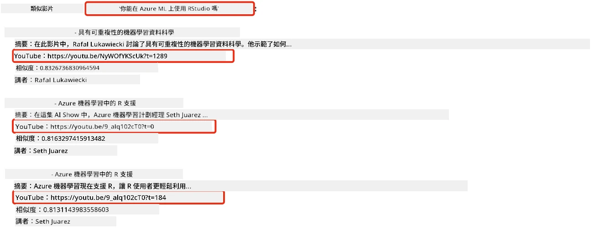
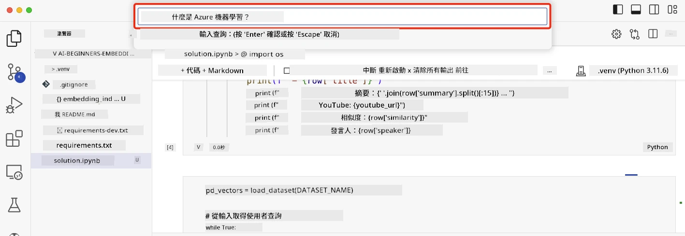

# 建立搜尋應用程式

[](https://youtu.be/W0-nzXjOjr0?si=GcsqiTTvd7RKbo7V)

> > _點擊上方圖片觀看本課程影片_

大型語言模型不僅是聊天機器人和文字生成，還可以利用嵌入（Embeddings）來建立搜尋應用程式。嵌入是資料的數值表示，也稱為向量，可用於語意搜尋資料。

在本課程中，您將為我們的教育新創公司建立一個搜尋應用程式。我們的新創公司是一個非營利組織，提供開發中國家學生免費教育。我們擁有大量 YouTube 影片，學生可用來學習 AI。我們想要建立一個搜尋應用程式，讓學生能透過打字問題來搜尋 YouTube 影片。

例如，學生可能輸入「什麼是 Jupyter 筆記本？」或「什麼是 Azure ML？」，該搜尋應用程式會回傳與問題相關的 YouTube 影片清單，更棒的是，搜尋應用會連結到影片中回答該問題的時間點。

## 介紹

在這堂課中，我們將涵蓋：

- 語意搜尋 vs 關鍵字搜尋。
- 什麼是文字嵌入（Text Embeddings）。
- 建立文字嵌入索引。
- 搜尋文字嵌入索引。

## 學習目標

完成本課程後，您將能夠：

- 區別語意搜尋和關鍵字搜尋。
- 解釋什麼是文字嵌入。
- 利用嵌入建立應用程式來搜尋資料。

## 為什麼要建立搜尋應用程式？

建立搜尋應用程式能讓您了解如何使用嵌入來搜尋資料，也學會如何建立可供學生快速找到資訊的搜尋應用程式。

本課程包含 Microsoft [AI Show](https://www.youtube.com/playlist?list=PLlrxD0HtieHi0mwteKBOfEeOYf0LJU4O1) YouTube 頻道中影片字幕的嵌入索引。AI Show 是教學 AI 與機器學習的 YouTube 頻道。嵌入索引包含直到 2023 年 10 月為止所有 YouTube 字幕的嵌入。您將使用嵌入索引為我們的新創公司建立搜尋應用程式。搜尋結果會連結到影片中回答問題的時間點，是幫助學生快速找到需要資訊的好方法。

下面是一個針對問題「可以用 RStudio 搭配 Azure ML 嗎？」的語意查詢範例。請看 YouTube 網址，您會發現網址裡含有時間戳，直接跳到影片回答問題的位置。



## 什麼是語意搜尋？

您可能會好奇什麼是語意搜尋？語意搜尋是一種利用查詢中詞語語意或含義來回傳相關結果的搜尋技術。

這裡有個語意搜尋範例。假設您想買一台車，可能會搜尋「我的夢想車」，語意搜尋會理解您不是在「夢想」一台車，而是在尋找您「理想」的車。語意搜尋了解您的意圖，回傳相關結果。相反地，關鍵字搜尋會只字面搜尋夢想和車，經常回傳不相關的結果。

## 什麼是文字嵌入？

[文字嵌入](https://en.wikipedia.org/wiki/Word_embedding?WT.mc_id=academic-105485-koreyst)是一種用於[自然語言處理](https://en.wikipedia.org/wiki/Natural_language_processing?WT.mc_id=academic-105485-koreyst)的文字表示技術。文字嵌入是文字的語意數值表示。嵌入用於以機器容易理解的方式表示資料。有許多建立文字嵌入的模型，本課程將專注於用 OpenAI 嵌入模型生成嵌入。

這裡有個範例，假設以下文字是 AI Show YouTube 頻道某集的字幕：

```text
Today we are going to learn about Azure Machine Learning.
```

我們會將文字傳給 OpenAI 嵌入 API，它會回傳由 1536 個數字組成的嵌入，也就是向量。向量中每個數字代表文字的不同面向。以下為簡略，顯示向量前 10 個數字。

```python
[-0.006655829958617687, 0.0026128944009542465, 0.008792596869170666, -0.02446001023054123, -0.008540431968867779, 0.022071078419685364, -0.010703742504119873, 0.003311325330287218, -0.011632772162556648, -0.02187200076878071, ...]
```

## 嵌入索引如何建立？

本課程的嵌入索引是透過一系列 Python 腳本建立。您會在本課程的 `scripts` 資料夾中找到腳本和說明的 [README](./scripts/README.md?WT.mc_id=academic-105485-koreyst)。完成本課程不需要執行這些腳本，因為嵌入索引已提供給您。

這些腳本完成的操作如下：

1. 下載 [AI Show](https://www.youtube.com/playlist?list=PLlrxD0HtieHi0mwteKBOfEeOYf0LJU4O1) 播放清單中每支影片的字幕。
2. 利用 [OpenAI 函數](https://learn.microsoft.com/azure/ai-foundry/openai/how-to/function-calling?WT.mc_id=academic-105485-koreyst)嘗試從 YouTube 字幕的前三分鐘擷取講者名稱。每支影片的講者名稱儲存在名為 `embedding_index_3m.json` 的嵌入索引中。
3. 將字幕文本切分為 **3 分鐘的文本片段**。片段與下一段約重疊 20 個字，以避免嵌入被截斷並提供更好的搜尋上下文。
4. 將每個文本片段傳給 OpenAI Chat API，將文字摘要為 60 字。摘要也儲存在 `embedding_index_3m.json` 中。
5. 最後，將片段文字傳給 OpenAI 嵌入 API。嵌入 API 回傳由 1536 個數字組成的向量，代表片段的語意含義。片段與 OpenAI 嵌入向量一併儲存在 `embedding_index_3m.json` 的嵌入索引中。

### 向量資料庫

為簡化課程，嵌入索引存於名為 `embedding_index_3m.json` 的 JSON 檔，並載入 Pandas DataFrame 中。但在真實場景，嵌入索引通常會存放於向量資料庫，如 [Azure Cognitive Search](https://learn.microsoft.com/training/modules/improve-search-results-vector-search?WT.mc_id=academic-105485-koreyst)、[Redis](https://cookbook.openai.com/examples/vector_databases/redis/readme?WT.mc_id=academic-105485-koreyst)、[Pinecone](https://cookbook.openai.com/examples/vector_databases/pinecone/readme?WT.mc_id=academic-105485-koreyst)、[Weaviate](https://cookbook.openai.com/examples/vector_databases/weaviate/readme?WT.mc_id=academic-105485-koreyst) 等等。

## 了解餘弦相似度

我們已學習文字嵌入，接著要學習如何利用文字嵌入搜尋資料，特別是如何使用餘弦相似度找出最接近查詢的嵌入向量。

### 什麼是餘弦相似度？

餘弦相似度是衡量兩個向量相似度的方法，也稱為「最近鄰搜尋」。進行餘弦相似度搜尋時，您需先使用 OpenAI 嵌入 API 將查詢文字向量化。然後計算查詢向量與嵌入索引中每個向量的餘弦相似度。請記得嵌入索引中有每個 YouTube 影片字幕文字片段的向量。最後，依餘弦相似度排序結果，得分最高的文字片段與查詢最相似。

從數學角度，餘弦相似度測量兩個向量在多維空間中投影夾角的餘弦值。這種測量很有用，因為即使兩份文件在歐氏距離上距離較遠（可能因大小差異），它們的夾角仍可能較小，因此餘弦相似度較高。更多餘弦相似度公式資訊請見 [餘弦相似度](https://en.wikipedia.org/wiki/Cosine_similarity?WT.mc_id=academic-105485-koreyst)。

## 建立您的第一個搜尋應用程式

接下來，我們將學習如何利用嵌入建立搜尋應用程式。此搜尋應用程式可讓學生透過輸入問題搜尋影片，回傳與問題相關的影片清單，並連結到影片中回答問題的時間點。

此解決方案已在 Windows 11、macOS 與 Ubuntu 22.04 上，使用 Python 3.10 以上版本開發與測試。您可從 [python.org](https://www.python.org/downloads/?WT.mc_id=academic-105485-koreyst) 下載 Python。

## 作業 - 建立搜尋應用程式，協助學生

我們在課程開頭介紹的新創公司，現在將讓學生為他們的評估作業建立搜尋應用程式。

在這次作業中，您將建立 Azure OpenAI 服務，用於建置搜尋應用程式。您需建立以下 Azure OpenAI 服務。需要 Azure 訂閱才能完成此作業。

### 啟動 Azure Cloud Shell

1. 登入 [Azure 入口網站](https://portal.azure.com/?WT.mc_id=academic-105485-koreyst)。
2. 點選 Azure 入口網站右上角的 Cloud Shell 圖示。
3. 選擇環境類型為 **Bash**。

#### 建立資源群組

> 本說明示範使用 "semantic-video-search" 名稱的資源群組，位置設定為 East US。
> 您可以更改資源群組名稱，但若要更改資源位置，
> 請查看 [模型可用性表格](https://aka.ms/oai/models?WT.mc_id=academic-105485-koreyst)。

```shell
az group create --name semantic-video-search --location eastus
```

#### 建立 Azure OpenAI 服務資源

從 Azure Cloud Shell 執行以下命令以建立 Azure OpenAI 服務資源。

```shell
az cognitiveservices account create --name semantic-video-openai --resource-group semantic-video-search \
    --location eastus --kind OpenAI --sku s0
```

#### 取得本應用程式使用的端點與金鑰

從 Azure Cloud Shell 執行以下命令以取得 Azure OpenAI 服務資源的端點與金鑰。

```shell
az cognitiveservices account show --name semantic-video-openai \
   --resource-group  semantic-video-search | jq -r .properties.endpoint
az cognitiveservices account keys list --name semantic-video-openai \
   --resource-group semantic-video-search | jq -r .key1
```

#### 部署 OpenAI 嵌入模型

從 Azure Cloud Shell 執行以下命令以部署 OpenAI 嵌入模型。

```shell
az cognitiveservices account deployment create \
    --name semantic-video-openai \
    --resource-group  semantic-video-search \
    --deployment-name text-embedding-ada-002 \
    --model-name text-embedding-ada-002 \
    --model-version "2"  \
    --model-format OpenAI \
    --sku-capacity 100 --sku-name "Standard"
```

## 解決方案

打開 GitHub Codespaces 的 [解決方案筆記本](./python/aoai-solution.ipynb?WT.mc_id=academic-105485-koreyst)，並依 Jupyter Notebook 中的說明進行。

執行筆記本時，系統會提示您輸入查詢。輸入框如下所示：



## 太棒了！繼續學習之路

完成本課程後，請參考我們的 [生成式 AI 學習系列](https://aka.ms/genai-collection?WT.mc_id=academic-105485-koreyst)，繼續提升您的生成式 AI 知識！

接著前往第 9 課，我們將探討如何[建立影像生成應用程式](../09-building-image-applications/README.md?WT.mc_id=academic-105485-koreyst)！

---

<!-- CO-OP TRANSLATOR DISCLAIMER START -->
**免責聲明**：
此文件已使用 AI 翻譯服務 [Co-op Translator](https://github.com/Azure/co-op-translator) 進行翻譯。雖然我們努力追求準確性，但請注意自動翻譯可能包含錯誤或不準確之處。原始文件的母語版本應視為權威來源。對於關鍵資訊，建議採用專業人工翻譯。我們不對因使用此翻譯所產生的任何誤解或誤譯承擔責任。
<!-- CO-OP TRANSLATOR DISCLAIMER END -->