# 建立低程式碼 AI 應用程式

> _(點擊上方圖片觀看本課程影片)_

## 介紹

現在我們已經學會如何建立影像生成應用程式，接下來讓我們談談低程式碼。生成式 AI 可用於多種不同領域，包括低程式碼，但什麼是低程式碼？我們又如何將 AI 加入其中呢？

使用低程式碼開發平台，讓傳統開發人員與非開發人員建置應用程式與解決方案變得更簡易。低程式碼開發平台能讓你以極少甚至不寫程式碼的方式建置應用程式與解決方案。這是藉由提供視覺化的開發環境，讓你拖放元件來構建應用程式與解決方案。這使你能更快、更省力地建置應用程式與解決方案。在本課程中，我們將深入探討如何使用低程式碼，以及如何利用 Power Platform 中的 AI 強化低程式碼開發。

Power Platform 為組織提供機會，讓團隊透過直覺的低程式碼或無程式碼環境打造自己的解決方案。這環境協助簡化建置解決方案的流程。借助 Power Platform，解決方案可在數天或數週內打造完成，而非數月或數年。Power Platform 由五個核心產品組成：Power Apps、Power Automate、Power BI、Power Pages 和 Copilot Studio。

本課程涵蓋：

- Power Platform 中的生成式 AI 介紹
- Copilot 介紹及使用方式
- 使用生成式 AI 建置 Power Platform 中的應用程式與流程
- 透過 AI Builder 了解 Power Platform 中的 AI 模型
- 利用 Microsoft Copilot Studio 建置智慧代理人

## 學習目標

完成本課程後，你將能夠：

- 了解 Copilot 在 Power Platform 中的運作方式。

- 為我們的教育新創公司建置學生作業追蹤應用程式。

- 建置一個使用 AI 從發票中擷取資訊的發票處理流程。

- 使用 Create Text with GPT AI 模型時，應用最佳實務。

- 了解什麼是 Microsoft Copilot Studio 以及如何用它建置智慧代理人。

本課程將使用的工具與技術如下：

- **Power Apps**，用於學生作業追蹤應用程式，提供低程式碼開發環境，建置用於追蹤、管理和互動資料的應用程式。

- **Dataverse**，用於儲存學生作業追蹤應用程式的資料，Dataverse 提供低程式碼數據平台，儲存應用程式資料。

- **Power Automate**，用於發票處理流程，提供低程式碼開發環境，建置自動化發票處理的工作流程。

- **AI Builder**，用於發票處理 AI 模型，使用預建 AI 模型來處理我們新創公司的發票。

## Power Platform 中的生成式 AI

利用生成式 AI 強化低程式碼開發和應用程式，是 Power Platform 的主要焦點之一。目標是讓每個人都能建置 AI 驅動的應用程式、網站、儀表板並自動化流程，_無需具備數據科學專業知識_。這一目標是透過將生成式 AI 融入 Power Platform 的低程式碼開發體驗，透過 Copilot 和 AI Builder 以達成。

### 這是如何運作的？

Copilot 是一個 AI 助手，允許你透過一系列自然語言的對話步驟描述需求，來建置 Power Platform 解決方案。例如，你可以指示 AI 助手說明應用程式會使用哪些欄位，它會根據描述建立應用程式及其底層資料模型，或者你可以指定如何在 Power Automate 中設定流程。

你可以在應用程式頁面中使用由 Copilot 驅動的功能，讓使用者透過對話式互動來發現洞見。

AI Builder 是 Power Platform 中可用的低程式碼 AI 能力，讓你利用 AI 模型協助自動化流程與預測結果。使用 AI Builder，你可以將 AI 應用於連接至 Dataverse 或其他雲端數據來源（如 SharePoint、OneDrive、Azure）的應用程式與流程中。

Copilot 在所有 Power Platform 產品中均可使用：Power Apps、Power Automate、Power BI、Power Pages 及 Copilot Studio（前身為 Power Virtual Agents）。AI Builder 可在 Power Apps 和 Power Automate 中使用。本課程將聚焦於如何在 Power Apps 和 Power Automate 中使用 Copilot 與 AI Builder，為我們的教育新創公司建置解決方案。

### Power Apps 中的 Copilot

作為 Power Platform 的一部分，Power Apps 提供低程式碼開發環境，用來建置追蹤、管理與互動資料的應用程式。它是一套包含可擴展數據平台與連接雲端服務及本地資料能力的應用程式開發服務。Power Apps 允許你建置可在瀏覽器、平板及手機上運行的應用程式，並能與同事共享。Power Apps 以簡單介面引導使用者進入應用程式開發，讓每個商務使用者或專業開發者都能建置自訂應用程式。透過 Copilot 的生成式 AI，使應用程式開發體驗更加出色。

Power Apps 中的 Copilot AI 助手功能允許你描述需要何種應用程式，及想要追蹤、收集或顯示哪些資訊。Copilot 會根據描述生成一個響應式的畫布應用程式。你接著可以自訂該應用程式以符合需求。AI Copilot 也會生成並建議一個 Dataverse 資料表，包含存放你想追蹤資料所需的欄位與範例資料。我們稍後會在本課程介紹 Dataverse 是什麼，以及如何在 Power Apps 中使用。你隨後可以透過 Copilot 助手的對話步驟自訂資料表，以符合需求。此功能可從 Power Apps 主畫面輕鬆取得。

### Power Automate 中的 Copilot

作為 Power Platform 的一部分，Power Automate 讓使用者建立應用程式與服務之間的自動化工作流程。它幫助自動化重複的商務流程，如溝通、資料收集與決策核准。其簡單介面讓所有技術程度的使用者（從初學者到資深開發者）都能自動化工作任務。借助 Copilot 的生成式 AI，工作流程開發體驗也更加優化。

Power Automate 中的 Copilot AI 助手功能讓你描述需要的流程種類與希望流程執行的動作。Copilot 根據描述生成流程。你可自訂此流程以符合需求。AI Copilot 也會生成並建議執行所需任務的動作。我們稍後會在本課程介紹流程是什麼，以及如何在 Power Automate 中使用。你可透過 Copilot 助手的對話步驟自訂動作以符合需求。此功能可從 Power Automate 主畫面輕鬆取得。

## 使用 Microsoft Copilot Studio 建置智慧代理人

[Microsoft Copilot Studio](https://learn.microsoft.com/microsoft-copilot-studio/fundamentals-what-is-copilot-studio?WT.mc_id=academic-105485-koreyst)（前稱 Power Virtual Agents）是 Power Platform 中的低程式碼成員，專門建置 **AI 代理人** — 對話式副駕駛員，能回答問題、執行操作並代表使用者自動化任務。與 Power Platform 其他工具相同，你在視覺化的自然語言優先體驗中建置這些代理人：描述你希望代理人執行的任務，Copilot Studio 協助架構其指令、知識與操作。

對於我們的教育新創公司，你可以建置一個代理人，回答學生對課程的問題，檢查作業截止日期，甚至寄郵件給講師 — 全部不需要撰寫程式碼。

以下是讓 Copilot Studio 強大的最新功能：

- <strong>從你的知識中生成答案</strong>。不用手動撰寫每段對話，你可以連接 <strong>知識來源</strong> — 公開網站、SharePoint、OneDrive、Dataverse、已上傳檔案，或透過連接器存取企業資料 — 代理人即可從中生成有根據的答案。

- <strong>生成式編排</strong>。代理人不再仰賴死板的觸發短語，而是使用 AI 理解請求，並動態決定結合哪些知識、主題與行動來完成任務，甚至串連多個步驟。

- <strong>動作與連接器</strong>。代理人能 <em>執行</em> 任務，而不只是聊天。你可以為代理人提供由 1,500 多個預建 Power Platform 連接器、Power Automate 流程、自訂 REST API、提示詞，或 **Model Context Protocol (MCP)** 伺服器支援的動作。

- <strong>自治代理人</strong>。代理人不限於在聊天視窗回應。你可建置 <strong>自治代理人</strong>，由事件觸發 — 例如新郵件、Dataverse 新紀錄或檔案上傳 — 並在背景中行動完成任務。

- <strong>多代理人編排</strong>。代理人可呼叫其他代理人。Copilot Studio 代理人能轉接給其他代理人，或由其他代理人擴充，包括發佈至 Microsoft 365 Copilot 的代理人，以及在 Microsoft Foundry 建置的代理人。

- <strong>模型選擇</strong>。除了內建模型外，你還能從 Microsoft Foundry 模型目錄引入模型，以自訂代理人的推理與回應方式。

- <strong>多處發佈</strong>。建置完成後，代理人能發佈至多種通路 — Microsoft Teams、Microsoft 365 Copilot、網站或自訂應用程式等 — 並透過 Power Platform 管理員體驗管理安全性、驗證及分析。

你可以在 [copilotstudio.microsoft.com](https://copilotstudio.microsoft.com?WT.mc_id=academic-105485-koreyst) 開始建置第一個代理人，並在 [Microsoft Copilot Studio 文件](https://learn.microsoft.com/microsoft-copilot-studio/?WT.mc_id=academic-105485-koreyst) 了解更多。

## 作業：使用 Copilot 管理我們新創公司的學生作業與發票

我們的新創公司為學生提供線上課程。這家公司成長迅速，目前難以應付課程需求。公司聘請你作為 Power Platform 開發人員，幫助他們建置低程式碼解決方案，以協助管理學生作業與發票。解決方案應能透過應用程式追蹤與管理學生作業，並透過工作流程自動化發票處理過程。你被要求利用生成式 AI 開發此解決方案。

在開始使用 Copilot 時，你可以利用 [Power Platform Copilot Prompt Library](https://github.com/pnp/powerplatform-prompts?WT.mc_id=academic-109639-somelezediko) 取得提示詞清單，此庫包含可用於透過 Copilot 建置應用與流程的提示詞。你也能參考這些提示詞，了解如何向 Copilot 描述需求。

### 為我們的新創公司建立學生作業追蹤應用程式

我們新創公司的教師一直難以追蹤學生作業。他們曾使用試算表追蹤，但隨學生人數增多，管理變困難。他們請你建置應用程式，幫助他們追蹤與管理學生作業。此應用程式應可新增作業、查看作業、更新作業及刪除作業，並讓教師與學生能查看已評分及未評分的作業。

你將使用 Power Apps 中的 Copilot 按以下步驟建置此應用程式：

1. 前往 [Power Apps](https://make.powerapps.com?WT.mc_id=academic-105485-koreyst) 主畫面。

1. 使用主畫面上的文字區描述你想建立的應用程式。例如，**_我想建置一個用於追蹤和管理學生作業的應用程式_**。點擊 <strong>發送</strong> 按鈕，將提示詞發送至 AI Copilot。

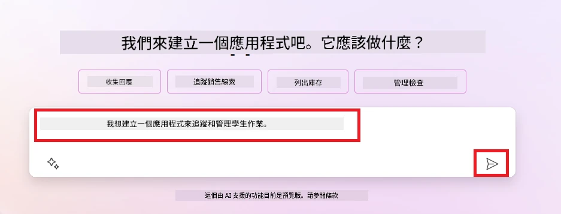

1. AI Copilot 會建議一個 Dataverse 資料表，含有你想追蹤資料所需欄位以及一些範例資料。你可以透過 Copilot 助手功能，利用對話步驟自訂資料表以符合需求。

   > <strong>重要</strong>：Dataverse 是 Power Platform 的底層資料平台。它是低程式碼資料平台，用來儲存應用程式的資料。這是一項完全受管理的服務，可安全地將資料儲存於 Microsoft 雲端，並在你的 Power Platform 環境中配置。它具備內建的資料治理能力，如資料分類、資料血統、細緻存取控制等等。你可在[此處](https://docs.microsoft.com/powerapps/maker/data-platform/data-platform-intro?WT.mc_id=academic-109639-somelezediko)了解更多關於 Dataverse 的資訊。

   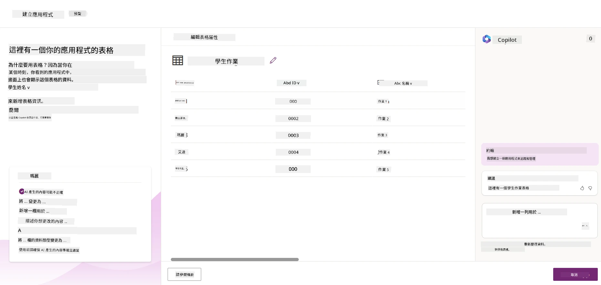

1. 教師希望能寄電子郵件給已提交作業的學生，告知其作業進度。你可以使用 Copilot 為資料表新增欄位，以儲存學生電郵地址。例如，你可以用以下提示詞新增欄位：**_我想新增一個欄位來儲存學生的電子郵件_**。點選 <strong>發送</strong> 按鈕，將提示詞發送至 AI Copilot。

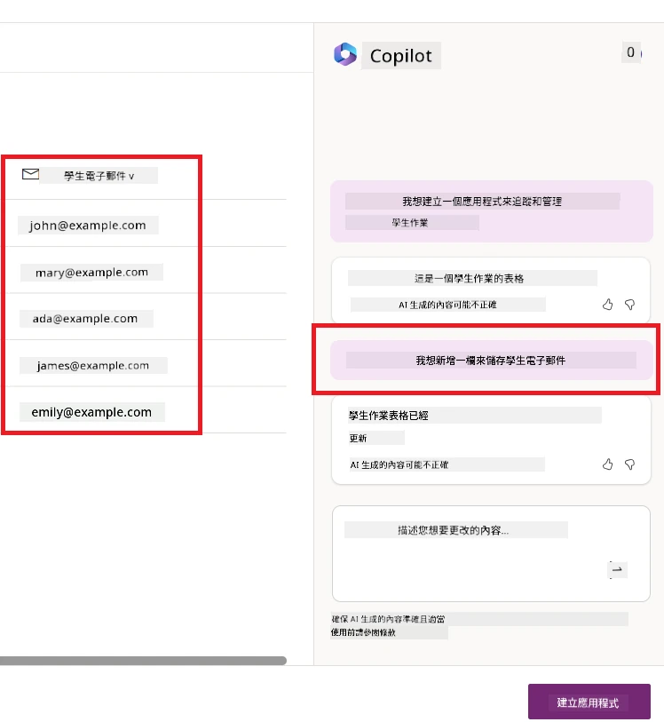

1. AI Copilot 將生成一個新欄位，你接著可以自訂該欄位以符合需求。

1. 完成資料表後，按一下 <strong>建立應用程式</strong> 按鈕以建立應用程式。

1. AI 助理將根據您的描述產生響應式 Canvas 應用程式。接著，您可以自訂應用程式以符合您的需求。

1. 對於教育工作者要向學生發送電子郵件，您可以使用助理將新畫面加入應用程式。例如，您可以使用以下提示來新增發送電子郵件給學生的畫面：**_我想新增一個畫面來發送電子郵件給學生_**。按一下 <strong>發送</strong> 按鈕以將提示發送給 AI 助理。

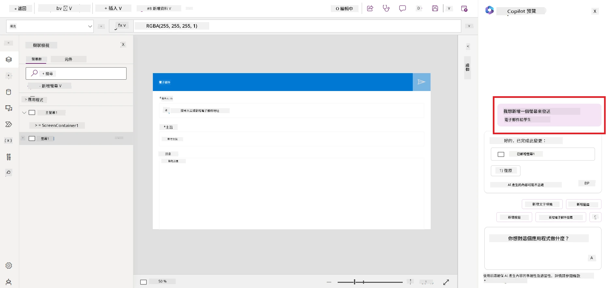

1. AI 助理會產生新的畫面，然後您可以根據需要進行自訂。

1. 完成應用程式後，按一下 <strong>儲存</strong> 按鈕以儲存應用程式。

1. 若要與教育工作者分享應用程式，按一下 <strong>分享</strong> 按鈕，接著再次按一下 <strong>分享</strong> 按鈕。您可以透過輸入他們的電子郵件地址來與教育工作者分享應用程式。

> <strong>您的作業</strong>：您剛建立的應用程式是個良好開端，但仍可改進。使用電子郵件功能時，教育工作者只能透過手動輸入電子郵件來發送郵件給學生。您能否使用助理建立自動化流程，讓教育工作者在學生提交作業時自動發送電子郵件給學生？提示是使用正確的提示詞，您可以在 Power Automate 中使用助理來建立這個自動化流程。

### 為我們的新創公司建立發票資訊資料表

我們新創公司的財務團隊在追蹤發票方面很困難。他們一直使用試算表來追蹤發票，但隨著發票量越來越大，管理起來變得更加困難。他們請您建立一個資料表，幫助他們儲存、追蹤和管理所收到的發票資訊。此資料表將用來建立一個自動化流程，從中擷取所有發票資訊並儲存到資料表內。該資料表也應讓財務團隊能查看已付款與未付款的發票。

Power Platform 擁有底層資料平台 Dataverse，可讓您為應用程式和解決方案儲存資料。Dataverse 提供低程式碼的資料平台來儲存應用程式資料。它是完全受管理服務，在 Microsoft 雲端安全地存放資料，並在您的 Power Platform 環境中設定。它內建資料治理功能，如資料分類、資料沿襲、細粒度存取控制等。您可在此處了解更多關於 [Dataverse](https://docs.microsoft.com/powerapps/maker/data-platform/data-platform-intro?WT.mc_id=academic-109639-somelezediko) 的資訊。

為什麼我們的新創公司應使用 Dataverse？Dataverse 中的標準與自訂資料表提供安全且基於雲端的資料儲存選項。資料表讓您能儲存不同類型的資料，類似於在 Excel 活頁簿中使用多個工作表一樣。您可以用資料表儲存符合組織或業務需求的特定資料。我們的新創公司使用 Dataverse 可獲得的好處包括但不限於：

- <strong>易於管理</strong>：元資料與資料皆存於雲端，無需擔心其儲存或管理細節，您可專注於建立應用程式與解決方案。

- <strong>安全</strong>：Dataverse 為您的資料提供安全且基於雲端的儲存選項。您可透過基於角色的安全性控管誰能存取資料表中的資料及存取方式。

- <strong>豐富的元資料</strong>：可在 Power Apps 中直接使用資料類型與關聯性。

- <strong>邏輯與驗證</strong>：可使用商業規則、計算欄位與驗證規則以強制執行商業邏輯並維持資料正確性。

現在您已了解 Dataverse 及其使用理由，讓我們看看如何使用助理在 Dataverse 中建立符合財務團隊需求的資料表。

> <strong>注意</strong>：您會在下一節裡使用此資料表建立一個自動化流程，從中擷取所有發票資訊並儲存於資料表。

使用助理在 Dataverse 建立資料表，請依照以下步驟：

1. 前往 [Power Apps](https://make.powerapps.com?WT.mc_id=academic-105485-koreyst) 首頁。

2. 在左側導覽列中選擇 <strong>資料表</strong>，然後點選 <strong>描述新資料表</strong>。

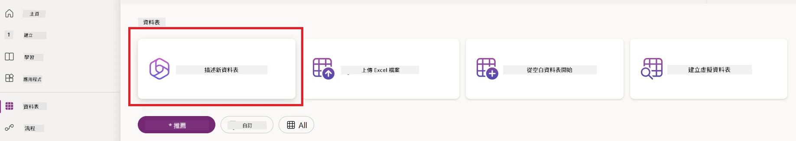

1. 在 <strong>描述新資料表</strong> 畫面中，使用文字區說明您想建立的資料表。例如：**_我想建立一個用於儲存發票資訊的資料表_**。按下 <strong>發送</strong> 按鈕將提示詞傳送至 AI 助理。

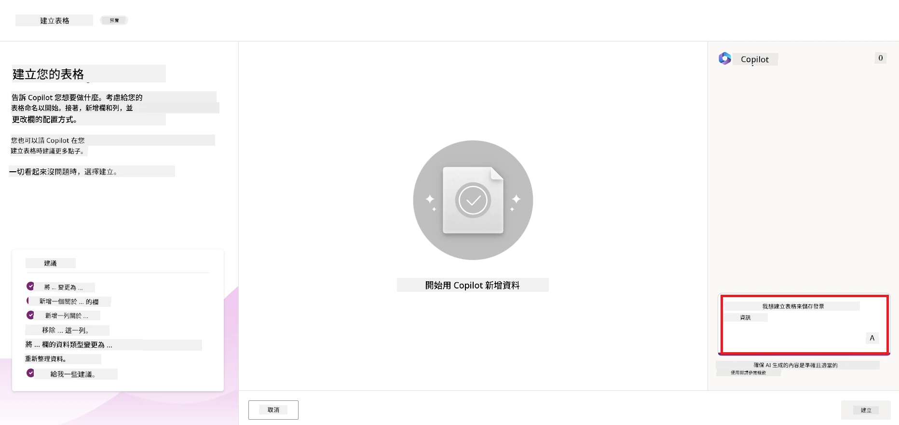

1. AI 助理會建議一個 Dataverse 資料表，其中包含您需要追蹤資料的欄位与一些範例資料。您之後可透過對話式步驟，使用 AI 助理功能自訂資料表以符合需求。

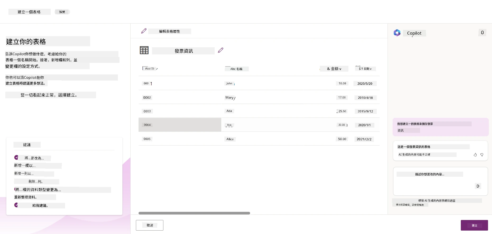

1. 財務團隊希望可寄電子郵件給供應商，告知他們當前發票狀態。您可以使用助理在資料表新增欄位以儲存供應商電子郵件。例如，您可以使用以下提示來新增欄位：**_我想新增一個欄位來儲存供應商電子郵件_**。按下 <strong>發送</strong> 按鈕將提示詞傳送至 AI 助理。

1. AI 助理會產生新的欄位，您隨後可依需求自訂此欄位。

1. 完成資料表後，點擊 <strong>建立</strong> 按鈕完成資料表建立。

## Power Platform 中的 AI Builder AI 模型

AI Builder 是 Power Platform 中的低程式碼 AI 功能，可讓您使用 AI 模型來幫助自動化流程和預測結果。透過 AI Builder，您可以將 AI 整合到連結 Dataverse 或其他雲端資料來源（如 SharePoint、OneDrive、Azure）的應用程式和流程中。

## 預建 AI 模型與自訂 AI 模型

AI Builder 提供兩種類型的 AI 模型：預建 AI 模型與自訂 AI 模型。預建 AI 模型是由 Microsoft 訓練，且在 Power Platform 中可直接使用，幫助您為應用程式和流程增添智慧，無需自行收集資料、建立、訓練並發佈模型。您可用它們來自動化流程和預測結果。

Power Platform 中部分可用的預建 AI 模型包括：

- <strong>關鍵片語擷取</strong>：此模型從文本中擷取關鍵片語。
- <strong>語言偵測</strong>：此模型偵測文字的語言。
- <strong>情感分析</strong>：此模型偵測文字中的正面、負面、中立或混合情感。
- <strong>名片讀取器</strong>：此模型從名片中擷取資訊。
- <strong>文字辨識</strong>：此模型從圖片中擷取文字。
- <strong>物件偵測</strong>：此模型偵測並擷取圖片中的物件。
- <strong>文件處理</strong>：此模型從表單中擷取資訊。
- <strong>發票處理</strong>：此模型從發票中擷取資訊。

自訂 AI 模型則允許您帶入自己的模型至 AI Builder，讓它像任何 AI Builder 自訂模型一樣，您可以使用自己資料訓練模型。這些模型能在 Power Apps 和 Power Automate 中用於自動化流程和預測結果。使用自訂模型時有相關限制，詳情請參閱這裡的 [限制說明](https://learn.microsoft.com/ai-builder/byo-model#limitations?WT.mc_id=academic-105485-koreyst)。

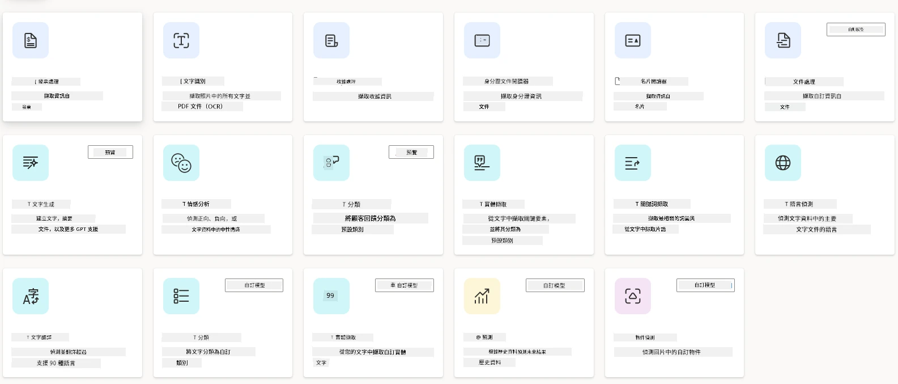

## 作業 #2 - 為我們的新創公司建立發票處理流程

財務團隊一直在發票處理方面遇到困難。他們使用試算表追蹤發票，但隨著發票數量增加，管理變得更加困難。他們請您建立一個工作流程，使用 AI 協助處理發票。工作流程應能擷取發票資料，並將資訊存入 Dataverse 資料表。此工作流程還應讓他們能向財務團隊發送含有擷取資訊的電子郵件。

現在您已了解什麼是 AI Builder 以及為何使用，讓我們來看看如何運用先前介紹的 AI Builder 中的發票處理 AI 模型建立工作流程，協助財務團隊處理發票。

要建立協助財務團隊使用 AI Builder 中的發票處理 AI 模型處理發票的工作流程，請依下列步驟操作：

1. 前往 [Power Automate](https://make.powerautomate.com?WT.mc_id=academic-105485-koreyst) 首頁。

2. 在首頁的文字區描述您想建立的工作流程。例如：**_當發票到達我的信箱時處理該發票_**。點擊 <strong>發送</strong> 將提示詞發送給 AI 助理。

   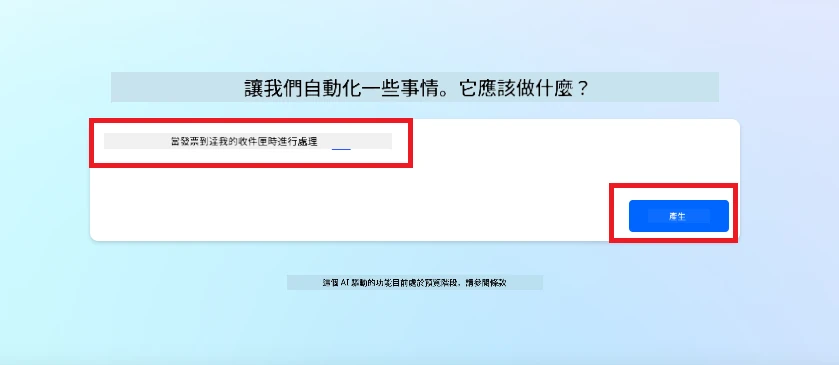

3. AI 助理將建議您完成任務所需的動作，您可以點擊 <strong>下一步</strong> 按鈕，繼續後續步驟。

4. 下一步，Power Automate 會提示您設置流程所需的連接。完成後，點擊 <strong>建立流程</strong> 按鈕建立流程。

5. AI 助理會產生流程，您可再自訂流程以符合需求。

6. 更新流程觸發器，將 <strong>資料夾</strong> 設定為存放發票的資料夾。例如，將資料夾設定成 <strong>收件匣</strong>。點選 <strong>顯示進階選項</strong>，將 <strong>僅限有附件</strong> 設定為 <strong>是</strong>。此設定可確保流程只在收到帶有附件的郵件時運作。

7. 移除流程中的以下操作：**HTML 轉文字**、<strong>合成</strong>、**合成 2**、**合成 3** 與 **合成 4**，因為您不會使用這些動作。

8. 移除流程中的 <strong>條件</strong> 動作，因為您不會使用它。畫面應如下截圖：

   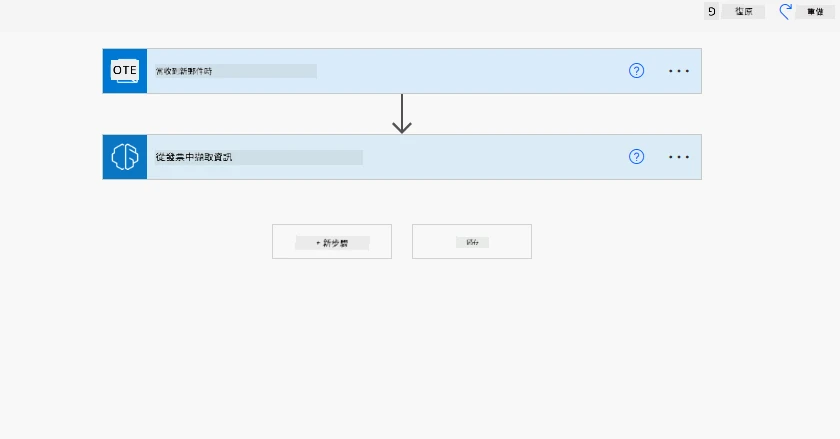

9. 點擊 <strong>新增動作</strong> 按鈕，搜尋 **Dataverse**。選擇 <strong>新增一筆列</strong> 動作。

10. 在 <strong>擷取發票資訊</strong> 動作中，將 <strong>發票檔案</strong> 更新為指向郵件中的 <strong>附件內容</strong>。此設定可確保流程從發票附件擷取資料。

11. 選擇您前面建立的 <strong>資料表</strong>。例如，您可以選擇 <strong>發票資訊</strong> 資料表。從之前的動作中選擇動態內容以填入下列欄位：

    - ID
    - 金額
    - 日期
    - 名稱
    - 狀態 - 將 <strong>狀態</strong> 設為 <strong>待處理</strong>。
    - 供應商電子郵件 - 使用 <strong>當有新電子郵件抵達</strong> 觸發器中的 <strong>寄件者</strong> 動態內容。

    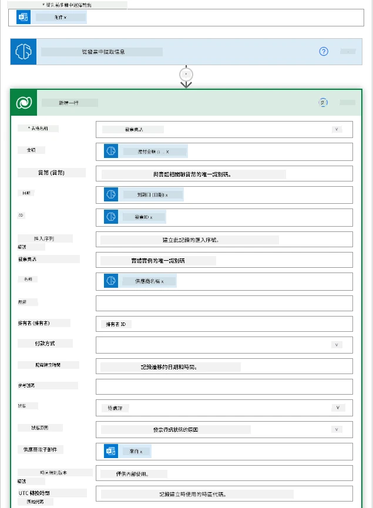

12. 完成流程後，點擊 <strong>儲存</strong> 按鈕保存流程。您可以透過寄送帶發票的郵件到觸發器中您指定的資料夾來測試流程。

> <strong>您的作業</strong>：您剛建立的流程是個良好開端，接下來您需要思考如何建立自動化，使我們的財務團隊能寄送電子郵件給供應商，通知他們發票當前狀態。提示：流程必須在發票狀態變更時運作。

## 在 Power Automate 中使用文本生成 AI 模型

AI Builder 中的 GPT 文字生成 AI 模型可讓您根據提示產生文字，並由 Microsoft Azure OpenAI 服務驅動。透過此功能，您可以將 GPT（生成式預訓練轉換器）技術整合到應用程式與流程中，建立各種自動化流程和智慧應用程式。

GPT 模型經過大量資料訓練，能在收到提示時產生近似人類語言的文本。結合工作流程自動化，AI 模型如 GPT 可用於簡化及自動執行廣泛任務。

例如，您可以建立流程，自動生成用於多種用途的文本，如電子郵件草稿、產品描述等。您也可以用該模型生成用於各類應用程式的文本，比如支持客服人員有效回應客戶查詢的聊天機器人及客戶服務應用程式。

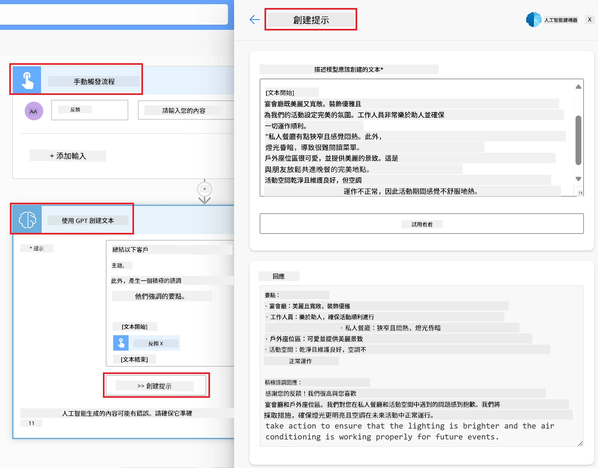

若要了解如何在 Power Automate 中使用此 AI 模型，請瀏覽 [利用 AI Builder 和 GPT 增強智能](https://learn.microsoft.com/training/modules/ai-builder-text-generation/?WT.mc_id=academic-109639-somelezediko) 課程。

## 幹得好！繼續您的學習

完成此課程後，請查看我們的 [生成式 AI 學習合集](https://aka.ms/genai-collection?WT.mc_id=academic-105485-koreyst)，持續提升您的生成式 AI 知識！

想要自訂並充分發揮 Copilot 的功能？探索 [Awesome Copilot](https://github.com/github/awesome-copilot?WT.mc_id=academic-105485-koreyst) — 這是一個由社群貢獻的指令、代理、技能和配置集合，助您最大化 GitHub Copilot 的能力。

前往第 11 課，我們將探討如何 [將生成式 AI 與功能呼叫結合](../11-integrating-with-function-calling/README.md?WT.mc_id=academic-105485-koreyst)！

---

<!-- CO-OP TRANSLATOR DISCLAIMER START -->
**免責聲明**：
此文件已使用 AI 翻譯服務 [Co-op Translator](https://github.com/Azure/co-op-translator) 進行翻譯。雖然我們努力追求準確性，但請注意自動翻譯可能包含錯誤或不準確之處。原始文件的母語版本應視為權威來源。對於關鍵資訊，建議採用專業人工翻譯。我們不對因使用此翻譯所產生的任何誤解或誤譯承擔責任。
<!-- CO-OP TRANSLATOR DISCLAIMER END -->