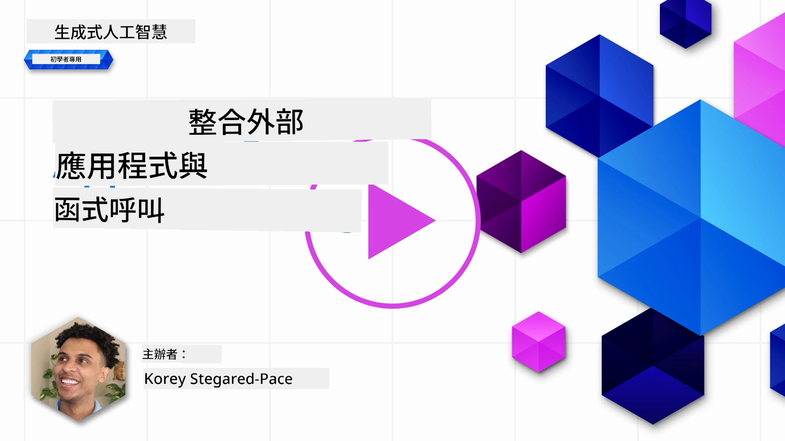
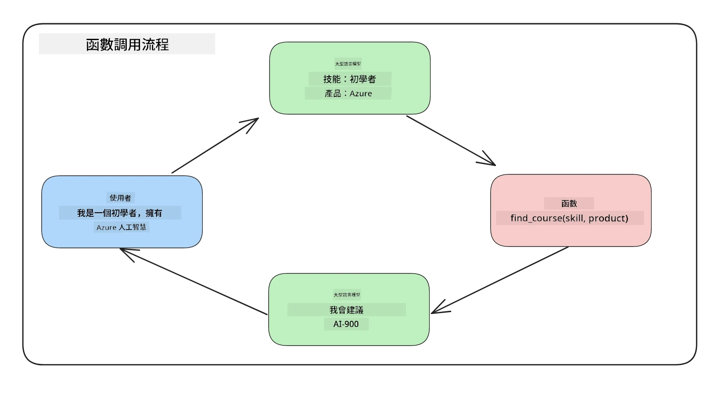
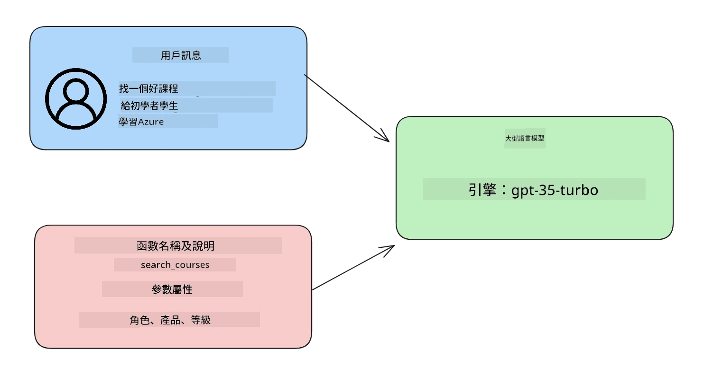

# 與函式呼叫整合

[](https://youtu.be/DgUdCLX8qYQ?si=f1ouQU5HQx6F8Gl2)

到目前為止，你已在之前的課程中學到不少內容。然而，我們仍可以進一步改進。有些問題我們可以著手解決，例如如何取得更一致的回應格式，以便後續處理回應會更容易。此外，我們可能還想從其他來源新增資料，以進一步豐富我們的應用程式。

上述問題正是本章節想要解決的。

## 簡介

本課程將涵蓋：

- 解釋什麼是函式呼叫以及其使用案例。
- 使用 Azure OpenAI 建立函式呼叫。
- 如何將函式呼叫整合到應用程式中。

## 學習目標

在本課程結束時，您將能夠：

- 解釋使用函式呼叫的目的。
- 使用 Azure OpenAI 服務設定函式呼叫。
- 設計符合應用場景的有效函式呼叫。

## 情境：利用函式改善我們的聊天機器人

本課程中，我們想為我們的教育新創公司建立一個功能，讓用戶能使用聊天機器人尋找技術課程。我們會根據用戶的技能水平、當前職位和感興趣的技術來推薦適合的課程。

要完成此情境，我們將結合使用：

- `Azure OpenAI` 為用戶建立聊天體驗。
- `Microsoft Learn Catalog API` 協助用戶根據需求找到課程。
- `函式呼叫` 將用戶查詢傳送給函式，以發出 API 請求。

先來看看為什麼我們會想使用函式呼叫：

## 為什麼使用函式呼叫

在函式呼叫出現之前，LLM 的回應往往是無結構且不一致的。開發者須撰寫複雜的驗證程式碼來因應各種回應變化。用戶無法得到像是「斯德哥爾摩現在的天氣如何？」此類即時的答案，因為模型的訓練資料有時間限制。

函式呼叫是 Azure OpenAI 服務的一項功能，能克服下列限制：

- <strong>一致的回應格式</strong>。如果我們能更好控制回應格式，整合回應到其他系統會更容易。
- <strong>外部資料</strong>。能在聊天環境中使用應用程式其他來源的資料。

## 透過情境說明問題

> 建議您使用 [附帶的筆記本檔案](./python/aoai-assignment.ipynb?WT.mc_id=academic-105485-koreyst) 來執行以下情境示範。您也可以直接閱讀，我們試著透過情境示範函式如何幫助解決問題。

來看一下說明回應格式問題的範例：

假設我們要建立一個學生資料庫，以便推薦適合的課程。下面有兩個學生描述，資料內容非常相似。

1. 對我們的 Azure OpenAI 資源建立連線：

   ```python
   import os
   import json
   from openai import OpenAI
   from dotenv import load_dotenv
   load_dotenv()

   # Responses API 是從 Azure OpenAI (Microsoft Foundry) v1 端點提供服務的
   # 所以我們將 OpenAI 客戶端指向 <your-endpoint>/openai/v1/。
   endpoint = os.environ['AZURE_OPENAI_ENDPOINT']
   client = OpenAI(
   api_key=os.environ['AZURE_OPENAI_API_KEY'],
   base_url=f"{endpoint.rstrip('/')}/openai/v1/",
   )

   deployment=os.environ['AZURE_OPENAI_DEPLOYMENT']
   ```

下方是設定我們與 Azure OpenAI 連線的 Python 程式碼。由於使用的是 v1 端點，只需設定 `api_key` 和 `base_url`（不需指定 `api_version`）。

1. 使用變數 `student_1_description` 和 `student_2_description` 建立兩個學生描述。

   ```python
   student_1_description="Emily Johnson is a sophomore majoring in computer science at Duke University. She has a 3.7 GPA. Emily is an active member of the university's Chess Club and Debate Team. She hopes to pursue a career in software engineering after graduating."

   student_2_description = "Michael Lee is a sophomore majoring in computer science at Stanford University. He has a 3.8 GPA. Michael is known for his programming skills and is an active member of the university's Robotics Club. He hopes to pursue a career in artificial intelligence after finishing his studies."
   ```

我們想將上面的學生描述資料傳送給 LLM 解析。這些資料稍後可以用於我們的應用程式，或送到 API 或存入資料庫。

1. 建立兩個相同的提示語，指示 LLM 我們感興趣的資訊為何：

   ```python
   prompt1 = f'''
   Please extract the following information from the given text and return it as a JSON object:

   name
   major
   school
   grades
   club

   This is the body of text to extract the information from:
   {student_1_description}
   '''

   prompt2 = f'''
   Please extract the following information from the given text and return it as a JSON object:

   name
   major
   school
   grades
   club

   This is the body of text to extract the information from:
   {student_2_description}
   '''
   ```

上面的提示語指示 LLM 擷取資訊並以 JSON 格式回傳。

1. 設定提示語及 Azure OpenAI 的連線後，我們用 `client.responses.create` 將提示語送給 LLM。我們將提示語存入 `input` 變數並指定角色為 `user`，模擬用戶發送訊息給聊天機器人。

   ```python
   # 來自提示一的回應
   openai_response1 = client.responses.create(
   model=deployment,
   input = [{'role': 'user', 'content': prompt1}],
   store=False,
   )
   openai_response1.output_text

   # 來自提示二的回應
   openai_response2 = client.responses.create(
   model=deployment,
   input = [{'role': 'user', 'content': prompt2}],
   store=False,
   )
   openai_response2.output_text
   ```

現在我們可以將兩個請求送至 LLM，並以 `openai_response1.output_text` 方式查看回應。

1. 最後，我們透過呼叫 `json.loads` 轉換回應為 JSON 格式：

   ```python
   # 將回應載入為 JSON 物件
   json_response1 = json.loads(openai_response1.output_text)
   json_response1
   ```

回應 1：

   ```json
   {
     "name": "Emily Johnson",
     "major": "computer science",
     "school": "Duke University",
     "grades": "3.7",
     "club": "Chess Club"
   }
   ```

回應 2：

   ```json
   {
     "name": "Michael Lee",
     "major": "computer science",
     "school": "Stanford University",
     "grades": "3.8 GPA",
     "club": "Robotics Club"
   }
   ```

雖然提示語相同，描述相似，但 `Grades` 屬性的值格式卻不同，有時候是 `3.7`，有時是 `3.7 GPA`。

這個結果是因為 LLM 接受了無結構的文字提示，也回傳無結構的資料。我們需要有結構化格式，才能知道儲存或使用資料時的期待。

那麼，我們如何解決格式問題呢？使用函式呼叫，我們可以確保收到結構化資料。使用函式呼叫時，LLM 不會真正呼叫或執行任何函式，而是我們為 LLM 回應創建結構，之後透過這些結構化回應，知道在應用程式中該呼叫哪個函式。



再將函式回傳的結果傳回 LLM，LLM 就會使用自然語言回答用戶的問題。

## 函式呼叫的使用案例

函式呼叫在許多不同場景能改善你的應用程式，例如：

- <strong>呼叫外部工具</strong>。聊天機器人擅長回答用戶問題，透過函式呼叫可用用戶訊息完成特定任務。例如，學生可要求「請寄信給我的導師，說我需要更多關於這個科目的協助」，這會呼叫函式 `send_email(to: string, body: string)`。

- **建立 API 或資料庫查詢**。用戶以自然語言搜尋資訊，轉換為格式化的查詢或 API 請求。例如，老師會問「哪些學生已完成上次作業？」這可呼叫名為 `get_completed(student_name: string, assignment: int, current_status: string)` 的函式。

- <strong>建立結構化資料</strong>。用戶可取一段文字或 CSV，利用 LLM 擷取重要資訊。比如，學生將維基百科有關和平協議的文章轉成 AI 問答卡，透過函式 `get_important_facts(agreement_name: string, date_signed: string, parties_involved: list)` 製作。

## 建立你的第一個函式呼叫

建立函式呼叫的流程包括三個主要步驟：

1. 使用函式（工具）列表和用戶訊息呼叫 Responses API。
2. 讀取模型回應以執行動作，如執行函式或 API 呼叫。
3. 使用函式回應再次呼叫 Responses API，利用此資訊建立回應予用戶。



### 步驟 1 - 建立訊息

第一步是建立用戶訊息。這可以動態指定，透過文字輸入取得，或你也可以直接指定一個值。如果你是第一次使用 Responses API，我們需要定義訊息的 `role` 和 `content`。

`role` 可設為 `system`（建立規則）、`assistant`（模型）或 `user`（最終用戶）。函式呼叫時，我們會指定為 `user` 並給一個問句範例。

```python
messages= [ {"role": "user", "content": "Find me a good course for a beginner student to learn Azure."} ]
```

指定不同的角色，讓 LLM 明確知道訊息是系統還是用戶的，這有助於建立對話歷史，讓 LLM 建構上下文。

### 步驟 2 - 建立函式

接下來定義函式及其參數。我們這裡只設定一個函式 `search_courses`，你也可以建立多個函式。

> <strong>重要提醒</strong> ：函式包含在發送給 LLM 的系統訊息中，會佔用可用的 Token 數量。

下方我們建立函式清單陣列。每個項目都是 Responses API 平台格式的工具，擁有 `type`、`name`、`description` 和 `parameters` 屬性：

```python
functions = [
   {
      "type":"function",
      "name":"search_courses",
      "description":"Retrieves courses from the search index based on the parameters provided",
      "parameters":{
         "type":"object",
         "properties":{
            "role":{
               "type":"string",
               "description":"The role of the learner (i.e. developer, data scientist, student, etc.)"
            },
            "product":{
               "type":"string",
               "description":"The product that the lesson is covering (i.e. Azure, Power BI, etc.)"
            },
            "level":{
               "type":"string",
               "description":"The level of experience the learner has prior to taking the course (i.e. beginner, intermediate, advanced)"
            }
         },
         "required":[
            "role"
         ]
      }
   }
]
```

以下詳細說明各函式實例：

- `name` - 欲被呼叫的函式名稱。
- `description` - 函式功能描述。務必明確清楚。
- `parameters` - 指定模型回應時要產生的值與格式。`parameters` 陣列包含項目，項目具有：
  1. `type` - 屬性資料類型。
  2. `properties` - 模型回應會用到的具體屬性。
      1. `name` - 屬性名稱，模型於格式化回應用此鍵名稱，例如 `product`。
      2. `type` - 屬性資料類型，例如 `string`。
      3. `description` - 屬性說明。

還有一可選屬性 `required` - 函式呼叫必須的必要屬性。

### 步驟 3 - 呼叫函式

定義完函式後，需將函式包含在呼叫 Responses API 時的請求中，以 `tools` 參數傳入。在這個例子中是 `tools=functions`。

你也可以設定 `tool_choice` 為 `auto`，讓 LLM 根據用戶訊息自動決定呼叫哪個函式，而非由我們指定。

以下程式碼示範呼叫 `client.responses.create`，特別注意設定 `tools=functions` 與 `tool_choice="auto"`，讓 LLM 自行決定何時呼叫我們提供的函式：

```python
response = client.responses.create(model=deployment,
                                        input=messages,
                                        tools=functions,
                                        tool_choice="auto",
                                        store=False)

print(response.output)
```

回應中現在會包含 `function_call` 項目在 `response.output`，內容如下：

```json
{
  "type": "function_call",
  "name": "search_courses",
  "call_id": "call_abc123",
  "arguments": "{\n  \"role\": \"student\",\n  \"product\": \"Azure\",\n  \"level\": \"beginner\"\n}"
}
```

這裡可看到函式 `search_courses` 被呼叫，並帶入 `arguments` 中所列的參數。

LLM 透過擷取 `input` 參數中所提供的值，成功找到符合函式參數的資料。以下是提醒你 `messages` 的值：

```python
messages= [ {"role": "user", "content": "Find me a good course for a beginner student to learn Azure."} ]
```

如你所見，`student`、`Azure` 和 `beginner` 從 `messages` 擷取並用作函式輸入。以函式方式使用此方法是從提示語中提取資訊的絕佳方式，且同時提供結構，並擁有可重用功能。

接下來，我們看看怎麼將此功能應用於我們的應用程式中。

## 將函式呼叫整合到應用程式

在測試完 LLM 的格式化回應之後，就可以將它整合到應用程式。

### 管理流程

要整合到應用程式，我們採取以下步驟：

1. 首先，呼叫 OpenAI 服務，從回應的 `output` 中擷取函式呼叫項目。

   ```python
   response_items = response.output
   tool_calls = [item for item in response_items if item.type == "function_call"]
   ```

1. 接著定義一個函式，呼叫 Microsoft Learn API 以取得課程清單：

   ```python
   import requests

   def search_courses(role, product, level):
     url = "https://learn.microsoft.com/api/catalog/"
     params = {
        "role": role,
        "product": product,
        "level": level
     }
     response = requests.get(url, params=params)
     modules = response.json()["modules"]
     results = []
     for module in modules[:5]:
        title = module["title"]
        url = module["url"]
        results.append({"title": title, "url": url})
     return str(results)
   ```

注意我們現在建立一個實際的 Python 函式，跟 `functions` 變數中函式名稱對應。同時也實際呼叫外部 API 來取得所需資料。這裡示範呼叫 Microsoft Learn API 以搜尋訓練模組。

好的，我們有了 `functions` 變數，也有對應的 Python 函式，那如何讓 LLM 知道兩者配對，進而呼叫此 Python 函式呢？

1. 要判斷是否需要呼叫 Python 函式，要查看 LLM 回應，是否包含 `function_call` 項，若有則呼叫指示的函式。下面示範如何檢查：

   ```python
   # 檢查模型是否想調用函式
   if tool_calls:
    for tool_call in tool_calls:
     print("Recommended Function call:")
     print(tool_call.name)
     print()

     # 呼叫該函式。
     function_name = tool_call.name

     available_functions = {
             "search_courses": search_courses,
     }
     function_to_call = available_functions[function_name]

     function_args = json.loads(tool_call.arguments)
     function_response = function_to_call(**function_args)

     print("Output of function call:")
     print(function_response)
     print(type(function_response))

     # 將函式調用及其結果加入對話中。
     # 必須在模型的輸出之前附加 function_call 項目。
     messages.append(tool_call)  # 助理的 function_call 項目
     messages.append( # 函式結果
         {
             "type": "function_call_output",
             "call_id": tool_call.call_id,
             "output": function_response,
         }
     )
   ```

這三行產生效果：抽取函式名稱與參數，並呼叫該函式：

   ```python
   function_to_call = available_functions[function_name]

   function_args = json.loads(tool_call.arguments)
   function_response = function_to_call(**function_args)
   ```

以下為執行程式碼的輸出：

<strong>輸出</strong>

   ```Recommended Function call:
   {
     "name": "search_courses",
     "arguments": "{\n  \"role\": \"student\",\n  \"product\": \"Azure\",\n  \"level\": \"beginner\"\n}"
   }

   Output of function call:
   [{'title': 'Describe concepts of cryptography', 'url': 'https://learn.microsoft.com/training/modules/describe-concepts-of-cryptography/?
   WT.mc_id=api_CatalogApi'}, {'title': 'Introduction to audio classification with TensorFlow', 'url': 'https://learn.microsoft.com/en-
   us/training/modules/intro-audio-classification-tensorflow/?WT.mc_id=api_CatalogApi'}, {'title': 'Design a Performant Data Model in Azure SQL
   Database with Azure Data Studio', 'url': 'https://learn.microsoft.com/training/modules/design-a-data-model-with-ads/?
   WT.mc_id=api_CatalogApi'}, {'title': 'Getting started with the Microsoft Cloud Adoption Framework for Azure', 'url':
   'https://learn.microsoft.com/training/modules/cloud-adoption-framework-getting-started/?WT.mc_id=api_CatalogApi'}, {'title': 'Set up the
   Rust development environment', 'url': 'https://learn.microsoft.com/training/modules/rust-set-up-environment/?WT.mc_id=api_CatalogApi'}]
   <class 'str'>
   ```

1. 現在我們將更新的 `messages` 再次送給 LLM，以獲得自然語言回應，而非 API JSON 格式回應。

   ```python
   print("Messages in next request:")
   print(messages)
   print()

   second_response = client.responses.create(
      input=messages,
      model=deployment,
      tool_choice="auto",
      tools=functions,
      temperature=0,
      store=False,
         )  # 從模型獲取一個新的回應，此回應可以看到函式的回傳內容


   print(second_response.output_text)
   ```

<strong>輸出</strong>

   ```text
   I found some good courses for beginner students to learn Azure:

   1. [Describe concepts of cryptography](https://learn.microsoft.com/training/modules/describe-concepts-of-cryptography/?WT.mc_id=api_CatalogApi)
   2. [Introduction to audio classification with TensorFlow](https://learn.microsoft.com/training/modules/intro-audio-classification-tensorflow/?WT.mc_id=api_CatalogApi)
   3. [Design a Performant Data Model in Azure SQL Database with Azure Data Studio](https://learn.microsoft.com/training/modules/design-a-data-model-with-ads/?WT.mc_id=api_CatalogApi)
   4. [Getting started with the Microsoft Cloud Adoption Framework for Azure](https://learn.microsoft.com/training/modules/cloud-adoption-framework-getting-started/?WT.mc_id=api_CatalogApi)
   5. [Set up the Rust development environment](https://learn.microsoft.com/training/modules/rust-set-up-environment/?WT.mc_id=api_CatalogApi)

   You can click on the links to access the courses.
   ```

## 作業

若想繼續學習 Azure OpenAI 函式呼叫，你可以擴展：

- 函式的更多參數，有助於學習者找到更多課程。

- 建立另一個函式呼叫以取得更多學習者的資訊，例如他們的母語
- 建立錯誤處理，當函式呼叫和/或 API 呼叫未回傳任何合適的課程時

提示：請參考 [Learn API 參考文件](https://learn.microsoft.com/training/support/catalog-api-developer-reference?WT.mc_id=academic-105485-koreyst) 頁面，了解這些資料如何以及在哪裡可用。

## 很棒的工作！繼續前進

完成本課程後，請查看我們的 [產生式 AI 學習收藏](https://aka.ms/genai-collection?WT.mc_id=academic-105485-koreyst)，持續提升您的產生式 AI 知識！

前往第 12 課，我們將探討如何為 AI 應用程式[設計使用者體驗](../12-designing-ux-for-ai-applications/README.md?WT.mc_id=academic-105485-koreyst)！

---

<!-- CO-OP TRANSLATOR DISCLAIMER START -->
**免責聲明**：
此文件已使用 AI 翻譯服務 [Co-op Translator](https://github.com/Azure/co-op-translator) 進行翻譯。雖然我們努力追求準確性，但請注意自動翻譯可能包含錯誤或不準確之處。原始文件的母語版本應視為權威來源。對於關鍵資訊，建議採用專業人工翻譯。我們不對因使用此翻譯所產生的任何誤解或誤譯承擔責任。
<!-- CO-OP TRANSLATOR DISCLAIMER END -->