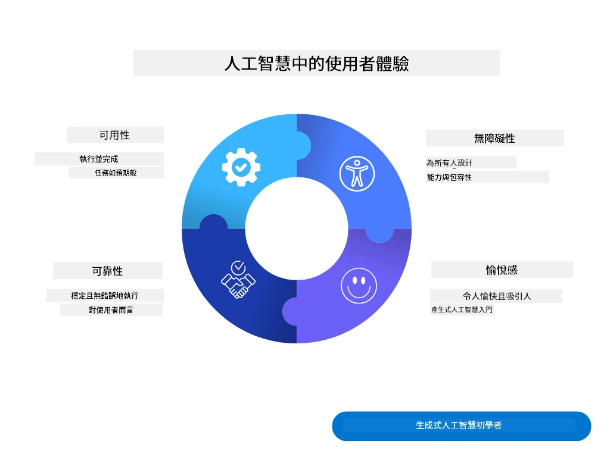
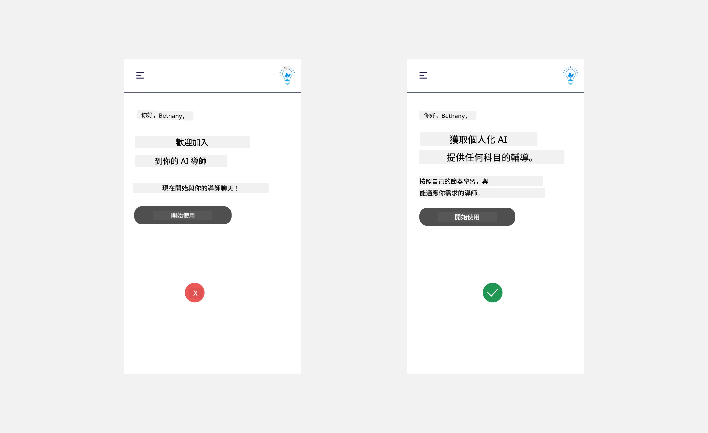
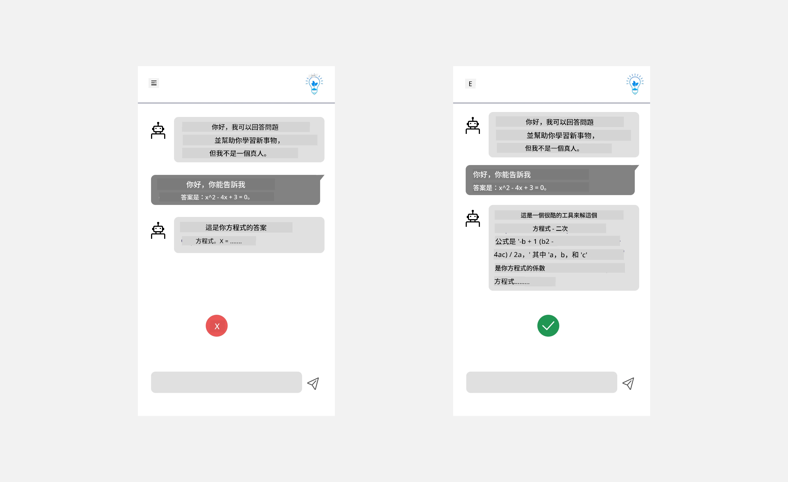
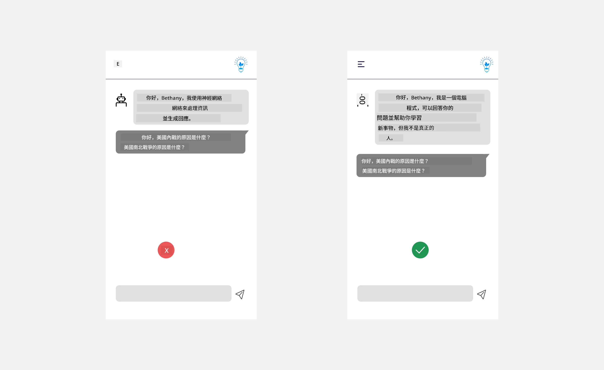
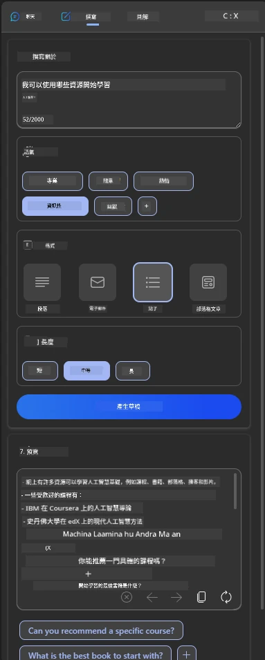
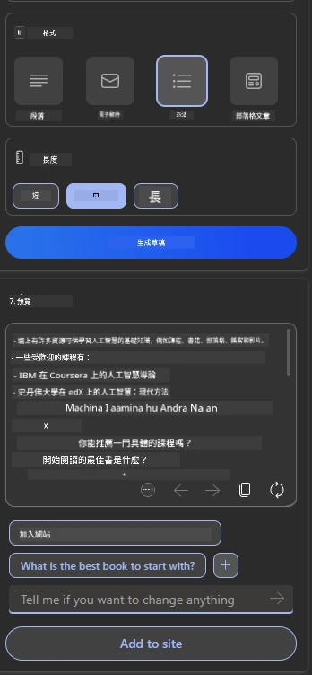
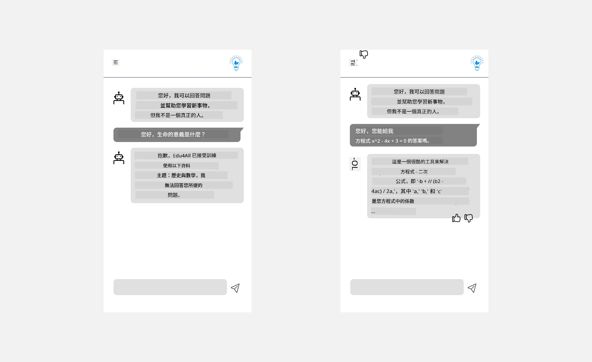

# 為 AI 應用程式設計使用者體驗

> _(點擊上方圖片觀看本課程影片)_

使用者體驗是構建應用程式中非常重要的部分。使用者需要能有效率地使用您的應用程式以完成任務。效率固然重要，但您也需要設計出人人都能使用的應用程式，讓它們具備_無障礙性_。本章將專注於該領域，期望您最終設計的應用程式能被人們使用並且願意使用。

## 介紹

使用者體驗是指使用者如何與特定產品或服務互動與使用，不論是系統、工具或設計。在開發 AI 應用程式時，開發人員不僅著重於確保使用者體驗有效，也注重倫理。本課程涵蓋如何建置符合使用者需求的人工智慧 (AI) 應用程式。

本課程將涵蓋以下主題：

- 使用者體驗介紹與理解使用者需求
- 為信任與透明度設計 AI 應用程式
- 為協作與回饋設計 AI 應用程式

## 學習目標

完成本課程後，您將能：

- 理解如何建置符合使用者需求的 AI 應用程式。
- 設計促進信任與協作的 AI 應用程式。

### 先備知識

花點時間閱讀更多關於[user experience and design thinking](https://learn.microsoft.com/training/modules/ux-design?WT.mc_id=academic-105485-koreyst)的內容。

## 使用者體驗介紹與理解使用者需求

在我們虛構的教育新創公司，主要有兩種使用者，教師和學生。這兩種使用者各有獨特需求。以使用者為中心的設計優先考慮使用者，確保產品對其目標群體是相關且有益的。

此應用程式應該具備 **有用、可靠、無障礙且令人愉快** 的特性，以提供良好的使用者體驗。

### 可用性

有用意味著應用程式功能符合其預期目的，例如自動化評分流程或生成複習用的抽認卡。自動化評分程序的應用程式應能依預設標準準確且有效率地給學生作業打分。相似地，產生複習抽認卡的應用程式應能根據資料生成相關且多樣化的問題。

### 可靠性

可靠意味著應用程式能持續且無誤地執行任務。但 AI 類似人類並非完美，也可能出錯。應用程式可能會遇到錯誤或非預期狀況，需要人工介入修正。您如何處理錯誤？本課程最後會討論 AI 系統和應用設計如何促進協作與回饋。

### 無障礙性

無障礙意味著延伸使用者體驗到不同能力的使用者，包括身心障礙者，確保沒有人被排除。遵守無障礙指導方針和原則，使 AI 解決方案更具包容性、可用性並對所有使用者有益。

### 愉悅感

愉悅感意味著應用程式讓人用起來開心。吸引人的使用者體驗能正面影響使用者，促使他們回訪應用程式並增加營收。

並非所有挑戰都能用 AI 解決。AI 是用來加強您的使用者體驗，比如自動化手動任務或個人化使用者體驗。

## 為信任與透明度設計 AI 應用程式

建立信任是設計 AI 應用程式時的關鍵。信任確保使用者有信心應用程式能完成工作，持續交付結果，且結果符合使用者需求。此領域的風險為不信任與過度信任。不信任發生在使用者對 AI 系統幾乎或完全不信任，導致拒絕應用程式。過度信任則是使用者過高評估 AI 系統能力，導致太信任 AI。例如，在自動評分系統中，過度信任可能使教師不會親自檢查部分試卷以確保評分系統運作良好，這可能造成不公平或不準確的分數，或錯失回饋及改進的機會。

確保信任置於設計核心的兩種方式為可解釋性與控制。

### 可解釋性

當 AI 協助決策，諸如將知識傳承給未來世代時，教師和家長理解 AI 決策原理至關重要。這即為可解釋性—理解 AI 應用如何做出決策。為可解釋性而設計包含增添細節，強調 AI 如何產生結果。觀眾需知該結果是 AI 產生的，而非人工。例如，不說「現在開始與您的導師聊天」，而說「使用能根據您需求調整並幫助您按自己步調學習的 AI 導師」。

另一例為 AI 如何使用使用者及個人資料。例如，具有學生角色的使用者可能因角色限制。AI 可能無法直接揭示答案，但能協助引導使用者思考解決問題的方法。

可解釋性的最後關鍵是簡化說明。學生與教師可能並非 AI 專家，因此對應用程式功能的說明應簡化且易於理解。

### 控制

生成式 AI 建立 AI 與使用者間的合作關係，例如使用者可修改提示詞以產生不同結果。此外，產生結果後，使用者應能修改結果，賦予其控制感。例如，使用 Microsoft Copilot（前身是 Bing Chat）時，您可依格式、語調和長度調整提示詞。並且您可對結果進行變更，如下所示：

Microsoft Copilot 的另一項讓使用者對應用程式有控制權的功能是能選擇同意或拒絕 AI 使用其資料。例如，學校應用中，學生可能想使用自己的筆記和教師資源作為複習材料。

> 設計 AI 應用時，意圖性是關鍵，確保使用者不會過度信任，導致對能力產生不切實際的期望。一種做法是在提示詞與結果間增加摩擦，提醒使用者這是 AI，而非同行的人類。

## 為協作與回饋設計 AI 應用程式

如前所述，生成式 AI 促成使用者與 AI 的合作。多數互動為使用者輸入提示詞，AI 生成結果。若結果不正確，應用程式如何處理錯誤？AI 是否會責怪使用者或花時間說明錯誤原因？

AI 應用程式應內建接收並提供回饋的功能。此不但有助 AI 系統改進，也建立使用者信任。設計中應包含回饋迴圈，例如簡單的讚或踩輸出結果。

另一種做法是明確溝通系統的能力與限制。當使用者提出超出 AI 能力的請求時，應該有相應的處理方式，如下所示。

系統錯誤在應用程式中常見，可能是因為使用者需要的資訊超出 AI 範圍，或應用程式對使用者生成摘要的問題數量／主題有限制。例如，僅有歷史和數學資料訓練的 AI 應用程式可能無法回答地理問題。為緩解此狀況，AI 系統可回覆：「抱歉，我們的產品僅訓練於以下科目……，無法回應您的問題。」

AI 應用程式不完美，勢必會出錯。設計應用程式時，應確保讓使用者有回饋空間且錯誤處理方式簡單且易說明。

## 作業

針對您迄今建置的 AI 應用程式，考慮在您的應用中實施以下步驟：

- **愉悅感：** 思考如何讓您的應用程式更令人愉快。您是否在各處加入解說？您是否鼓勵使用者探索？您的錯誤訊息用詞如何？

- **可用性：** 建置網頁應用程式。確保應用程式既可用滑鼠也可用鍵盤操作。

- **信任與透明度：** 不要完全信任 AI 及其結果，考慮如何加入人工流程以驗證結果。同時思考並實施其他方式以建立信任與透明度。

- **控制：** 賦予使用者對所提供資料的控制權。實施讓使用者能選擇同意或拒絕資料收集的機制於 AI 應用程式中。

<!-- ## [課後測驗](../../../12-designing-ux-for-ai-applications/quiz-url) -->

## 繼續學習！

完成本課程後，請查看我們的[生成式 AI 學習合輯](https://aka.ms/genai-collection?WT.mc_id=academic-105485-koreyst)，持續提升您的生成式 AI 知識！

接著前往第 13 課，我們將探討如何[保障 AI 應用程式安全](../13-securing-ai-applications/README.md?WT.mc_id=academic-105485-koreyst)！

---

<!-- CO-OP TRANSLATOR DISCLAIMER START -->
**免責聲明**：
此文件已使用 AI 翻譯服務 [Co-op Translator](https://github.com/Azure/co-op-translator) 進行翻譯。雖然我們努力追求準確性，但請注意自動翻譯可能包含錯誤或不準確之處。原始文件的母語版本應視為權威來源。對於關鍵資訊，建議採用專業人工翻譯。我們不對因使用此翻譯所產生的任何誤解或誤譯承擔責任。
<!-- CO-OP TRANSLATOR DISCLAIMER END -->