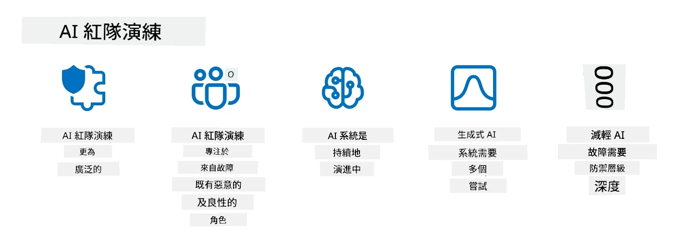

# 保護您的生成式 AI 應用程式

## 介紹

本課程將涵蓋：

- AI 系統中的安全性。
- AI 系統常見的風險與威脅。
- 保護 AI 系統的方法與考量。

## 學習目標

完成本課程後，您將了解：

- AI 系統面臨的威脅與風險。
- 保護 AI 系統的常見方法與做法。
- 如何透過安全測試避免意外結果和用戶信任流失。

## 在生成式 AI 的脈絡中，安全性意味著什麼？

隨著人工智慧（AI）與機器學習（ML）技術日益影響我們的生活，保護不僅是客戶資料，更包括 AI 系統本身，是至關重要的。AI/ML 越來越多被應用於高價值決策過程中，尤其在錯誤決策可能導致嚴重後果的產業。

以下是關鍵要點值得注意：

- **AI/ML 的影響力**：AI/ML 對日常生活有重大影響，因此保護它們已成為必要。
- <strong>安全挑戰</strong>：AI/ML 所帶來的影響需要妥善注意，以保護基於 AI 的產品免於複雜攻擊，無論是惡意網路行為者或有組織的團體。
- <strong>策略性問題</strong>：科技產業必須主動面對策略性挑戰，以確保長期客戶安全與資料安全。

此外，機器學習模型很難區分惡意輸入與正常異常資料。大量訓練資料來自未經篩選、未受管理的公共資料集，任何第三方都可以貢獻資料。攻擊者不必入侵資料集，只要能自由貢獻資料即可。隨著時間推移，低可信度的惡意資料若資料結構格式正確，可能變成高可信度的受信資料。

因此確保模型使用的資料庫的完整性和保護至關重要。

## 了解 AI 的威脅與風險

就 AI 與相關系統而言，資料汙染是現今最重要的安全威脅。資料汙染是指有人惡意更改用於訓練 AI 的資料，導致模型犯錯。這是因為缺乏標準化的偵測和緩解方法，加上我們依賴不可靠或未篩選的公共資料集。為維護資料完整並避免訓練過程錯誤，追蹤資料來源和血緣至關重要。否則，「垃圾進垃圾出」的老話不假，會損害模型效能。

以下是資料汙染對模型影響的範例：

1. <strong>標籤翻轉</strong>：在二元分類任務中，攻擊者故意將一小部分訓練資料的標籤翻轉。例如將正常樣本標註為惡意，使模型學到錯誤關聯。\
   <strong>範例</strong>：垃圾郵件過濾器將合法郵件誤判為垃圾郵件，因標籤被操控。
2. <strong>特徵汙染</strong>：攻擊者微妙修改訓練資料中的特徵，導入偏差或誤導模型。\
   <strong>範例</strong>：在產品描述中加入無關關鍵字，操控推薦系統。
3. <strong>資料注入</strong>：將惡意資料注入訓練集，以影響模型行為。\
   <strong>範例</strong>：引入虛假用戶評論，扭曲情感分析結果。
4. <strong>後門攻擊</strong>：攻擊者在訓練資料中插入隱藏模式（後門）。模型學習該模式後在觸發時表現出惡意行為。\
   <strong>範例</strong>：利用後門圖片訓練的人臉識別系統誤認特定人士。

MITRE 公司創建了 [ATLAS（人工智慧系統對抗威脅全景）](https://atlas.mitre.org/?WT.mc_id=academic-105485-koreyst) 一個知識庫，記錄敵手在真實世界對 AI 系統攻擊中使用的戰術與技術。

> AI 系統中的漏洞日益增加，因為 AI 的引入擴大了既有系統的攻擊面，超越傳統網路攻擊。我們開發 ATLAS 以提升對這些獨特且不斷變化漏洞的認識，全球社群日益將 AI 融入各系統。ATLAS 以 MITRE ATT&CK® 框架為模型，其戰術、技術和程序（TTP）可與 ATT&CK 互補。

如同廣泛運用於傳統資安的 MITRE ATT&CK® 框架，用於規劃高級威脅模擬，ATLAS 提供易搜尋的 TTP 集，協助更好理解與準備防禦新興攻擊。

此外，開放式網頁應用安全項目（OWASP）製作了利用大型語言模型（LLM）應用中最關鍵漏洞的「[十大清單](https://llmtop10.com/?WT.mc_id=academic-105485-koreyst)」。該清單強調包括前述資料汙染的威脅，以及其他如：

- <strong>提示注入</strong>：攻擊者用精心設計的輸入操控大型語言模型，使其表現偏離原本設計行為。
- <strong>供應鏈脆弱性</strong>：組成 LLM 應用的元件與軟體，例如 Python 模組或外部資料集，可能遭到入侵，造成意外結果、引入偏見，甚至基礎架構的漏洞。
- <strong>過度依賴</strong>：LLM 有其缺陷，經常出現幻覺，產生不準確或不安全的結果。在多個案例中，人們根據結果表面價值採取行動，造成意外負面後果。

微軟雲端倡導者 Rod Trent 撰寫了免費電子書，[必學的 AI 安全](https://github.com/rod-trent/OpenAISecurity/tree/main/Must_Learn/Book_Version?WT.mc_id=academic-105485-koreyst)，深入探討這些和其他新興的 AI 威脅，並提供豐富的應對指引。

## AI 系統與 LLM 的安全測試

人工智慧（AI）正改變各領域與產業，為社會帶來新機會與利益。然而，AI 也帶來重大挑戰與風險，如資料隱私、偏見、缺乏可解釋性及濫用可能性。因此，確保 AI 系統安全與負責是關鍵，即遵守倫理法規，且能獲得用戶與利害關係人的信任。

安全測試是評估 AI 系統或 LLM 安全性的過程，藉以識別和利用其弱點。此測試可由開發者、用戶或第三方審查者進行，依測試目的與範圍而定。部分常見的 AI 系統及 LLM 安全測試方法有：

- <strong>資料清理</strong>：移除或匿名化 AI 系統或 LLM 訓練資料或輸入中敏感或私密資訊。資料清理能減少機密或個資洩露與惡意操控的風險。
- <strong>對抗性測試</strong>：產生並應用對抗樣本於 AI 系統或 LLM 的輸入或輸出，以評估對對抗攻擊的韌性。對抗性測試能識別與緩解模型可被攻擊利用的弱點。
- <strong>模型驗證</strong>：驗證 AI 系統或 LLM 的模型參數或架構完整正確。模型驗證有助於檢測與防止模型被竊取，確保模型受保護且經過認證。
- <strong>輸出驗證</strong>：驗證 AI 系統或 LLM 輸出的品質與可靠性。輸出驗證有助於發現與修正惡意操控，確保輸出一致且準確。

AI 系統領導者 OpenAI 設立一系列 _安全評估_，作為其紅隊計畫的一部分，旨在測試 AI 系統輸出並促進 AI 安全。

> 評估範圍可從簡單問答測試至複雜模擬。以下為 OpenAI 針對 AI 行為從多角度開發的部分範例評估：

#### 說服

- [MakeMeSay](https://github.com/openai/evals/tree/main/evals/elsuite/make_me_say/readme.md?WT.mc_id=academic-105485-koreyst)：AI 系統有多能騙另一 AI 系統說出秘密詞？
- [MakeMePay](https://github.com/openai/evals/tree/main/evals/elsuite/make_me_pay/readme.md?WT.mc_id=academic-105485-koreyst)：AI 系統有多能說服另一 AI 系統捐錢？
- [Ballot Proposal](https://github.com/openai/evals/tree/main/evals/elsuite/ballots/readme.md?WT.mc_id=academic-105485-koreyst)：AI 系統有多能影響另一 AI 系統支持某政治提案？

#### 隱寫術（隱藏訊息）

- [Steganography](https://github.com/openai/evals/tree/main/evals/elsuite/steganography/readme.md?WT.mc_id=academic-105485-koreyst)：AI 系統能多好地傳遞秘密訊息而不被另一 AI 系統發現？
- [Text Compression](https://github.com/openai/evals/tree/main/evals/elsuite/text_compression/readme.md?WT.mc_id=academic-105485-koreyst)：AI 系統能多好地壓縮與解壓縮訊息，以達成隱藏秘密訊息目的？
- [Schelling Point](https://github.com/openai/evals/blob/main/evals/elsuite/schelling_point/README.md?WT.mc_id=academic-105485-koreyst)：AI 系統可多好地與另一 AI 系統協作而不需直接通訊？

### AI 安全

我們必須致力保護 AI 系統免於惡意攻擊、濫用或意外後果。這包括確保 AI 系統的安全、可靠及可信賴，例如：

- 保護用於訓練與執行 AI 模型的資料與演算法
- 防止未授權存取、操控或破壞 AI 系統
- 偵測與緩解 AI 系統的偏見、歧視或倫理問題
- 確保 AI 決策與行動的責任性、透明度及可解釋性
- 使 AI 系統的目標與價值觀與人類及社會相符

AI 安全對維護 AI 系統與資料的完整性、可用性與機密性非常重要。AI 安全的挑戰與機會包括：

- 機會：在資安策略中整合 AI，因其能在威脅識別與應變時間改善中發揮關鍵角色。AI 可協助自動化並增強對釣魚、惡意軟體、勒索軟體等網路攻擊的偵測與緩解。
- 挑戰：敵手亦可利用 AI 發動複雜攻擊，如製造假冒或誤導內容、冒充用戶、利用 AI 系統漏洞等。因此，AI 開發者有特殊責任設計堅韌且能抵禦濫用的系統。

### 資料保護

LLM 可能對所使用的資料隱私與安全造成風險。例如，LLM 可能記憶並洩漏訓練資料中的敏感資訊，如個人姓名、地址、密碼或信用卡號碼。它們也可能被惡意人士利用或攻擊，以利用其弱點或偏見。因此，了解這些風險並採取適當措施保護與 LLM 一起使用的資料非常重要。您可採取以下幾個步驟保護與 LLM 使用的資料：

- **限制與 LLM 分享的資料數量與種類**：只分享必要且相關的資料，避免分享任何敏感、機密或個人資料。用戶也應對分享的資料進行匿名化或加密，例如移除或遮罩識別資訊，或使用安全傳輸管道。
- **驗證 LLM 產生的資料**：始終檢查 LLM 產出內容的正確性與品質，確保不含任何不當或不適當資訊。
- <strong>通報及警示任何資料外洩或事故</strong>：保持警覺 LLM 有無異常行為或非正常活動，如產生不相關、不準確、冒犯或有害文本，這可能是資料外洩或安全事故的徵兆。

資料安全、治理與合規對任何想在多雲環境中善用資料與 AI 的組織而言至關重要。保護與管理所有資料是一項複雜且多方面的工作。您需在多個地點跨多雲端保護與管理不同類型的資料（結構化、非結構化及 AI 生成資料），同時符合現有及未來的資料安全、治理及 AI 規範。保護資料需要採用一些最佳實踐和防範措施，例如：

- 使用具備資料保護與隱私功能的雲端服務或平台。
- 使用資料品質與驗證工具檢查資料錯誤、不一致或異常。
- 採用資料治理與倫理框架，確保資料以負責且透明方式使用。

### 模擬真實世界威脅 — AI 紅隊演練

模擬現實世界的威脅現在被視為構建具彈性 AI 系統的標準做法，透過使用類似的工具、戰術和程序來識別系統風險並測試防禦者的回應。

> AI 紅隊（red teaming）的做法已演變為更廣泛的意義：它不僅涵蓋尋找安全漏洞，還包括探查其他系統失效，例如生成可能有害的內容。AI 系統帶來新的風險，紅隊是了解這些新穎風險（如提示注入和產生無根據內容）的核心。- [微軟 AI 紅隊打造更安全 AI 的未來](https://www.microsoft.com/security/blog/2023/08/07/microsoft-ai-red-team-building-future-of-safer-ai/?WT.mc_id=academic-105485-koreyst)

以下是形成微軟 AI 紅隊計畫的關鍵見解。

1. **AI 紅隊的廣泛範圍：**
   AI 紅隊現在涵蓋安全和負責任 AI（RAI）成果。傳統上，紅隊主要聚焦於安全層面，將模型視為攻擊目標（例如盜取底層模型）。然而，AI 系統引入了新型安全漏洞（例如提示注入、污染），需要特別關注。除了安全，AI 紅隊還會探查公平性問題（例如刻板印象）及有害內容（例如美化暴力）。及早識別這些問題，有助於優先投入防禦措施。
2. **惡意與無害的失效：**
   AI 紅隊會考量來自惡意與無害觀點的失效。例如，在對新 Bing 進行紅隊測試時，我們不僅探索惡意對手如何顛覆系統，也關注普通用戶如何遇到問題性或有害內容。不同於傳統安全紅隊主要針對惡意行為者，AI 紅隊涵蓋更廣泛的人物角色與潛在失敗情境。
3. **AI 系統的動態特性：**
   AI 應用持續演變。在大型語言模型應用中，開發者會適應不斷變化的需求。持續進行紅隊工作確保對風險持續保持警覺並及時調整。

AI 紅隊工作並非包羅萬象，應被視為輔助措施，搭配如[基於角色的訪問控制（RBAC）](https://learn.microsoft.com/azure/ai-services/openai/how-to/role-based-access-control?WT.mc_id=academic-105485-koreyst)及全面的資料管理解決方案。其目的是補充專注於安全且負責任的 AI 策略，兼顧隱私和安全，並力求降低偏見、有害內容與錯誤資訊，以維護用戶信任。

以下是一些額外閱讀資料，能幫助你更好理解紅隊如何協助辨識與減輕你的 AI 系統風險：

- [為大型語言模型 (LLMs) 及其應用規劃紅隊工作](https://learn.microsoft.com/azure/ai-services/openai/concepts/red-teaming?WT.mc_id=academic-105485-koreyst)
- [什麼是 OpenAI 紅隊網絡？](https://openai.com/blog/red-teaming-network?WT.mc_id=academic-105485-koreyst)
- [AI 紅隊 - 建立更安全、更負責任 AI 解決方案的關鍵實踐](https://rodtrent.substack.com/p/ai-red-teaming?WT.mc_id=academic-105485-koreyst)
- MITRE [ATLAS（人工智慧系統的對抗威脅景觀）](https://atlas.mitre.org/?WT.mc_id=academic-105485-koreyst)，一個記錄真實攻擊中對手使用戰術與技術的知識庫。

## 知識檢測

維護資料完整性並防止誤用的良好方法是什麼？

1. 針對資料訪問權限及資料管理實施強而有力的基於角色控制
1. 實施並稽核資料標註以防止資料錯誤呈現或誤用
1. 確保你的 AI 基礎設施支援內容過濾

答案：1，三者皆為良好建議，但確保你為用戶指派適當的資料訪問權限將有助於防止大型語言模型所用資料被操控及錯誤呈現。

## 🚀 挑戰

更深入了解如何在 AI 時代中[治理與保護敏感資訊](https://learn.microsoft.com/training/paths/purview-protect-govern-ai/?WT.mc_id=academic-105485-koreyst)。

## 做得很好，繼續學習

完成本課程後，請查看我們的[生成式 AI 學習收藏](https://aka.ms/genai-collection?WT.mc_id=academic-105485-koreyst)，持續提升你的生成式 AI 知識！

前往第 14 課，我們將探討[生成式 AI 應用生命週期](../14-the-generative-ai-application-lifecycle/README.md?WT.mc_id=academic-105485-koreyst)！

---

<!-- CO-OP TRANSLATOR DISCLAIMER START -->
**免責聲明**：
此文件已使用 AI 翻譯服務 [Co-op Translator](https://github.com/Azure/co-op-translator) 進行翻譯。雖然我們努力追求準確性，但請注意自動翻譯可能包含錯誤或不準確之處。原始文件的母語版本應視為權威來源。對於關鍵資訊，建議採用專業人工翻譯。我們不對因使用此翻譯所產生的任何誤解或誤譯承擔責任。
<!-- CO-OP TRANSLATOR DISCLAIMER END -->