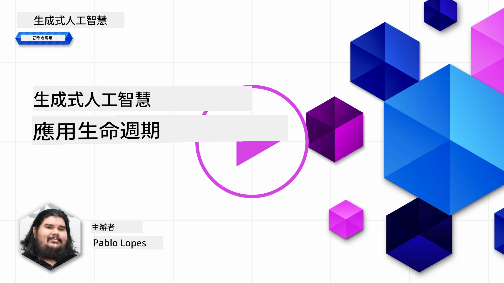
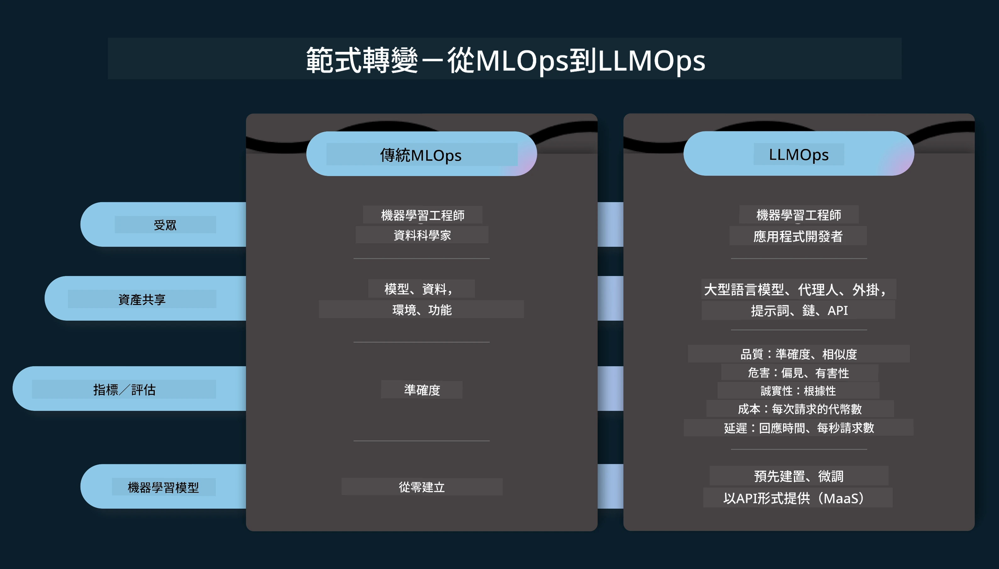
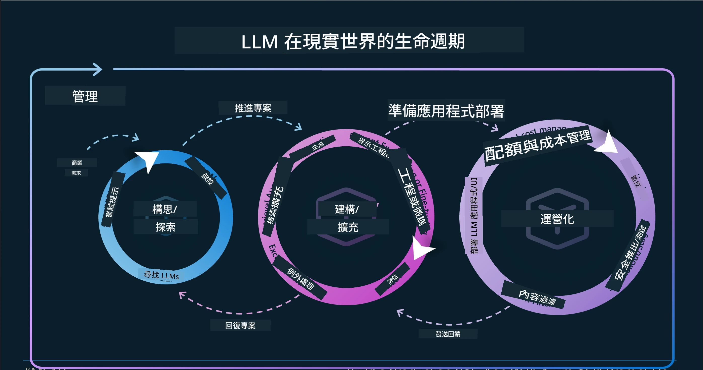
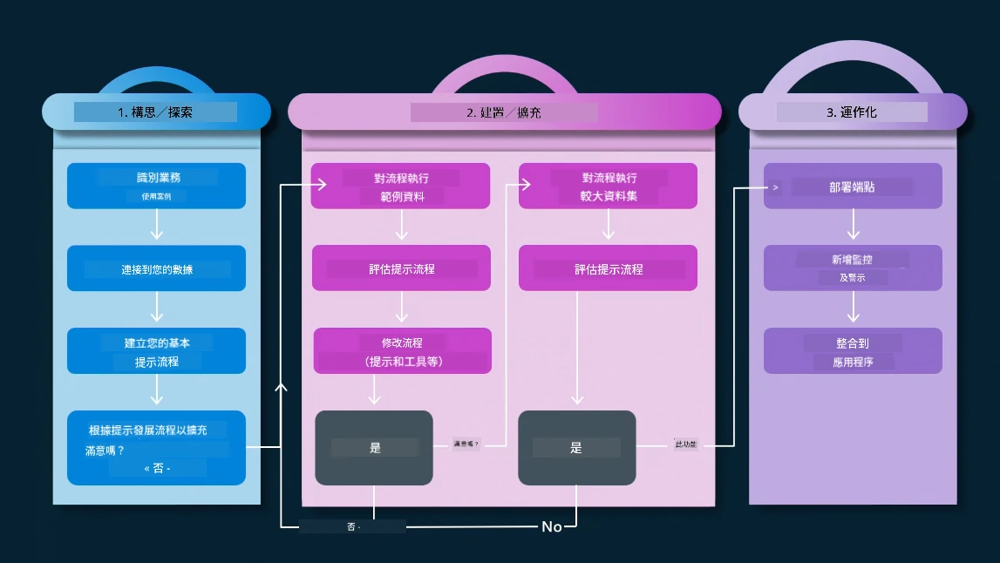
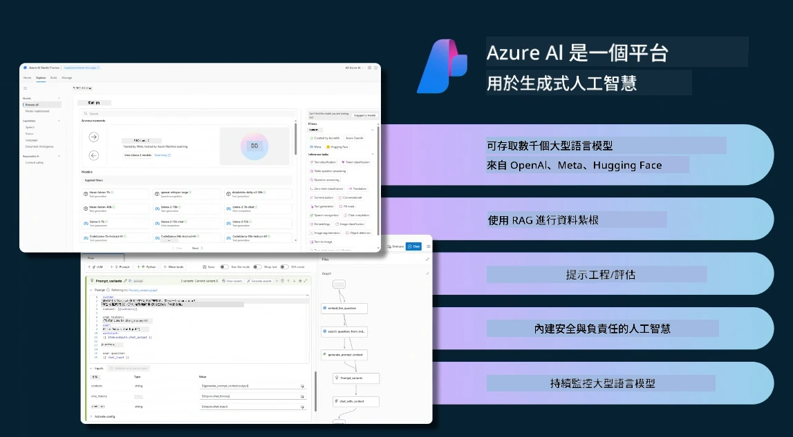
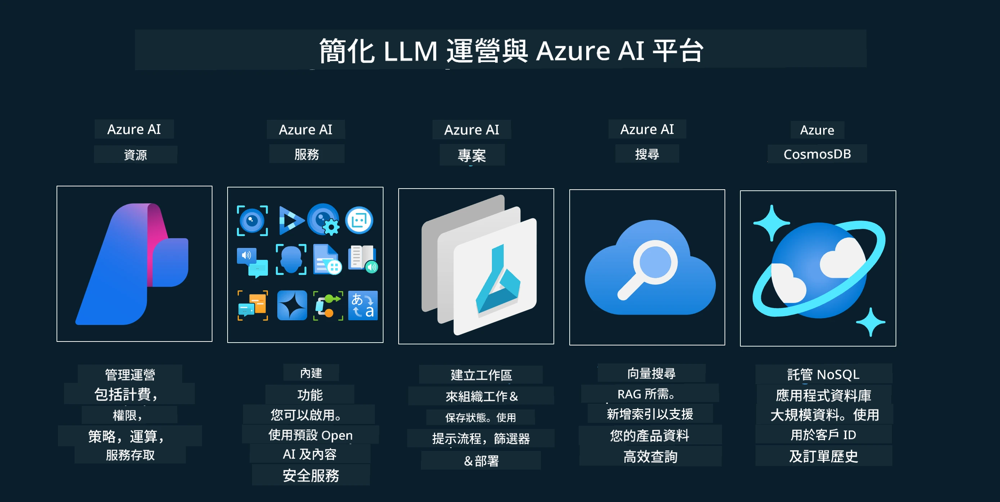
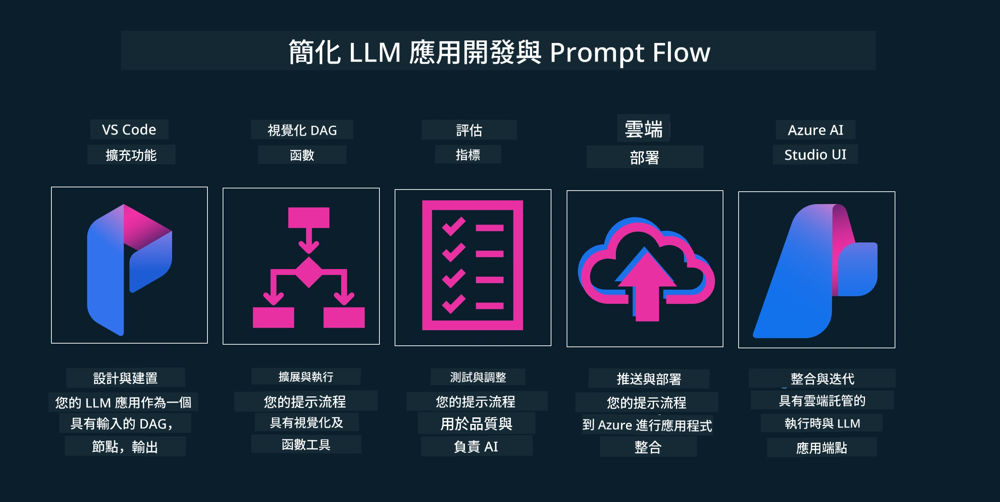

# 生成式 AI 應用程式生命週期

對於所有 AI 應用程式來說，一個重要的問題是 AI 功能的相關性，因為 AI 是一個快速發展的領域。為了確保您的應用程式保持相關、可靠且穩健，您需要持續監控、評估並改進它。這就是生成式 AI 生命週期的用武之地。

生成式 AI 生命週期是一個指導您開發、部署和維護生成式 AI 應用程式階段的框架。它幫助您定義目標、衡量表現、識別挑戰並實施解決方案。它還幫助您使您的應用程式符合您的領域和利益相關者的倫理與法律標準。透過遵循生成式 AI 生命週期，您可以確保您的應用程式始終提供價值並滿足使用者需求。

## 介紹

在本章中，您將會：

- 了解從 MLOps 到 LLMOps 的範式轉移
- 理解 LLM 生命週期
- 生命週期工具
- 生命週期的指標化與評估

## 了解從 MLOps 到 LLMOps 的範式轉移

LLM 是人工智慧武器庫中的新工具，它在應用程式的分析與生成任務中極其強大，但這種力量對我們如何簡化 AI 與傳統機器學習任務有一些影響。

因此，我們需要一個新的範式以動態地適應這項工具，並且有適當的激勵措施。我們可以將較舊的 AI 應用歸類為「ML 應用」，較新的 AI 應用稱為「生成式 AI 應用」或簡稱「AI 應用」，反映當前主流的技術與方法。在多方面改變了我們的敘事，請參考以下比較圖。

注意，在 LLMOps 中，我們更關注應用程式開發者，利用整合作為關鍵點，採用「模型即服務」，並在以下指標中思考。

- 品質：回應品質
- 風險：負責任的 AI
- 誠實：回應根據度（合理嗎？正確嗎？）
- 成本：解決方案預算
- 延遲：平均回應時間（以 tokens 計）

## LLM 生命週期

首先，為了理解生命週期及其變化，我們來看以下資訊圖。

如您所見，這與傳統 MLOps 生命週期不同。LLM 有許多新需求，如提示工程（Prompting）、用來提升品質的不同技術（微調、RAG、Meta-Prompts）、負責任 AI 的不同評估與責任，以及新的評估指標（品質、風險、誠實、成本與延遲）。

舉例來說，看看我們如何進行構思。我們透過提示工程，利用多種 LLM 進行實驗來探索可能性，測試假設是否正確。

請注意，這不是線性的流程，而是整合的循環，反覆迭代並且有一個整體的周期。

我們如何探索這些步驟？讓我們詳細說明如何建立生命週期。

這看起來有些複雜，我們先專注於三個主要步驟。

1. 構思／探索：探索階段，我們可以根據業務需求進行探索。製作原型，創建[PromptFlow](https://microsoft.github.io/promptflow/index.html?WT.mc_id=academic-105485-koreyst)並測試是否對我們的假設足夠有效。
1. 構建／增強：實施階段，我們開始對較大數據集進行評估，實施技術如微調和 RAG 來檢查解決方案的穩健性。如果效果不佳，可以重新實作、在流程中增加新步驟或重新結構數據作為改進。測試流程和規模後，如果效果符合預期並通過指標檢查，即可進入下一階段。
1. 運營化：整合階段，現在將監控與警報系統加入系統，進行部署並將應用程式整合到我們的應用中。

接著，我們有一個涵蓋安全、合規與治理的管理大循環。

恭喜，您的 AI 應用程式已準備就緒並可運營。若想實際操作，請參考[Contoso 聊天示範](https://nitya.github.io/contoso-chat/?WT.mc_id=academic-105485-koreyst)。

現在，我們可以使用哪些工具？

## 生命週期工具

在工具方面，Microsoft 提供了[Azure AI 平台](https://azure.microsoft.com/solutions/ai/?WT.mc_id=academic-105485-koreyst)與[PromptFlow](https://microsoft.github.io/promptflow/index.html?WT.mc_id=academic-105485-koreyst)，協助您輕鬆實施並快速啟動您的生命週期。

[Azure AI 平台](https://azure.microsoft.com/solutions/ai/?WT.mc_id=academic-105485-koreyst)讓您可以使用[AI Studio](https://ai.azure.com/?WT.mc_id=academic-105485-koreyst)。AI Studio 是一個網頁入口，允許您探索模型、範例和工具。管理您的資源、進行 UI 開發流程，以及透過 SDK/CLI 選項進行以程式碼為主的開發。

Azure AI 讓您使用多種資源，管理您的運營、服務、專案、向量搜尋及資料庫需求。

從概念驗證(POC)到大規模應用，利用 PromptFlow 進行建構：

- 在 VS Code 中使用視覺化與功能化工具設計和建置應用
- 輕鬆測試並微調您的應用，確保高品質 AI
- 使用 Azure AI Studio 進行整合與反覆迭代，利用雲端快速推送與部署

## 很棒！繼續學習吧！

太棒了，現在學習如何結構應用程式以使用這些概念，請參考[Contoso 聊天應用程式](https://nitya.github.io/contoso-chat/?WT.mc_id=academic-105485-koreyst)，了解雲端推廣如何在示範中運用這些概念。想了解更多內容，請參考我們的[Ignite 專題課程！](https://www.youtube.com/watch?v=DdOylyrTOWg)

接著，請查閱第 15 課，了解[檢索式增強生成與向量資料庫](../15-rag-and-vector-databases/README.md?WT.mc_id=academic-105485-koreyst)如何影響生成式 AI ，並打造更吸引人的應用程式！

---

<!-- CO-OP TRANSLATOR DISCLAIMER START -->
**免責聲明**：  
本文件係使用 AI 翻譯服務 [Co-op Translator](https://github.com/Azure/co-op-translator) 進行翻譯。儘管我們力求準確，但請注意，自動翻譯可能包含錯誤或不準確之處。原始文件的母語版本應視為權威來源。對於重要資訊，建議採用專業人工翻譯。本公司對因使用本翻譯所導致之任何誤解或誤用不負任何責任。
<!-- CO-OP TRANSLATOR DISCLAIMER END -->