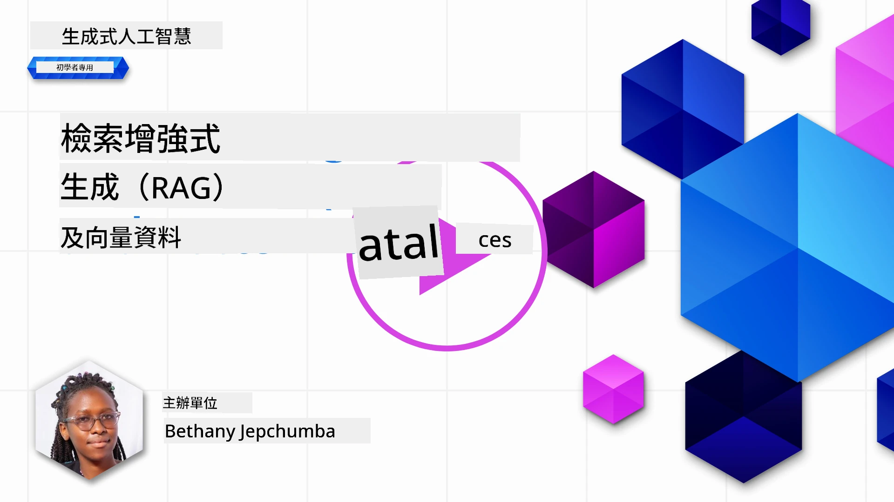
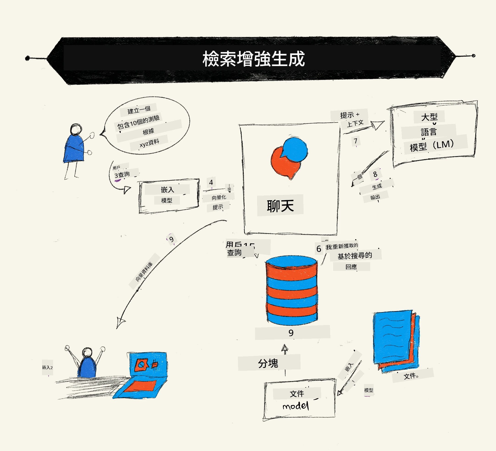

# 檢索增強生成 (RAG) 與向量資料庫

[](https://youtu.be/4l8zhHUBeyI?si=BmvDmL1fnHtgQYkL)

在搜尋應用課程中，我們曾簡單了解如何將自己的資料整合進大型語言模型 (LLMs)。在本課程中，我們將進一步探討如何在 LLM 應用中紮根你的資料，該過程的運作機制，以及存儲資料的方法，包括向量嵌入和文字本身的存放。

> <strong>影片即將上線</strong>

## 介紹

本課程將涵蓋以下內容：

- RAG 的介紹、其功能與為什麼在 AI (人工智慧) 中使用它。

- 了解什麼是向量資料庫並為我們的應用建立一個。

- 示範如何在應用程式中整合 RAG。

## 學習目標

完成本課程後，你將能夠：

- 解釋 RAG 在資料檢索和處理上的重要性。

- 設置 RAG 應用並將你的資料紮根於 LLM。

- 有效整合 RAG 與向量資料庫於 LLM 應用中。

## 我們的場景：用我們自己的資料強化 LLM

在本課程中，我們想將自己的筆記加入這個教育創業項目，讓聊天機器人能取得更多有關不同主題的資訊。透過我們的筆記，學習者能更有效率地學習和理解不同的主題，讓考試複習更加輕鬆。為建立此場景，我們將使用：

- `Azure OpenAI:` 我們用來建立聊天機器人的大型語言模型

- `AI for beginners' lesson on Neural Networks`: 這將是我們用來紮根 LLM 的資料

- `Azure AI Search` 和 `Azure Cosmos DB:` 向量資料庫，用於存儲資料並建立搜尋索引

使用者將能從自己的筆記建立練習小測驗、複習抽認卡，並將內容摘要成簡潔的概覽。讓我們先了解 RAG 是什麼以及它如何運作：

## 檢索增強生成 (RAG)

大型語言模型支援的聊天機器人會處理使用者提示來生成回答。它被設計為具互動性，能與使用者就多樣主題進行交流。然而其回答限於給定的上下文和其訓練時所用的基礎資料。例如 GPT-4 的知識截止於 2021 年 9 月，代表它不了解此日期之後發生的事件。此外，LLM 的訓練資料排除機密資訊，如個人筆記或公司產品手冊。

### RAG (檢索增強生成) 如何運作



假設你想部署一個聊天機器人，用來從你的筆記中產生小測驗，你就需要連結到知識庫。RAG 就是這個領域的利器。RAG 運作方式如下：

- **知識庫：** 在檢索之前，這些文檔需要被攝取並預處理，通常是將大型文檔拆分成較小片段，轉換為文字嵌入向量並儲存於資料庫中。

- **使用者查詢：** 使用者提出問題

- **檢索：** 當使用者提問時，嵌入模型會從知識庫檢索相關資訊，提供更多上下文以納入提示中。

- **增強生成：** LLM 基於檢索到的資料增強回應，使生成的回答不僅基於預訓練資料，也基於附加的相關上下文。再由 LLM 回傳答案給使用者。


RAG 的架構透過 transformer 實現，包含兩部分：編碼器和解碼器。例如使用者發問時，輸入文字被「編碼」成捕捉詞義的向量，這些向量再被「解碼」到我們的文件索引中，並根據使用者查詢生成新的文字。LLM 使用編碼器-解碼器模型來產生輸出。

根據論文：[Retrieval-Augmented Generation for Knowledge intensive NLP (natural language processing software) Tasks](https://arxiv.org/pdf/2005.11401.pdf?WT.mc_id=academic-105485-koreyst)，實作 RAG 有以下兩種方式：

- **_RAG-Sequence_** 使用取得的文件預測最佳答案以回應使用者查詢

- **RAG-Token** 利用文件生成下一個字元(Token)，並用它們回答使用者查詢

### 為什麼要使用 RAG？

- **資訊豐富性：** 確保文字回應最新且即時，藉此提升領域特定任務的效能，能存取內部知識庫。

- 降低虛假資訊，利用 knowledge base 中 <strong>可驗證資料</strong> 為使用者查詢提供背景。

- <strong>成本效益佳</strong>，相比調整大型語言模型，RAG 顯得更經濟。

## 建立知識庫

我們的應用主要基於個人資料，也就是 AI 初學者課程中的神經網路單元。

### 向量資料庫

向量資料庫不同於傳統資料庫，是一種專門設計來存儲、管理和搜尋嵌入向量的資料庫。它存放文件的數值化表示。將資料拆分為數值嵌入讓 AI 系統更容易理解和處理這些資料。

我們將嵌入存到向量資料庫，因為 LLM 對能接受的輸入字元數有限。你無法將整個嵌入直接傳給 LLM，因此需要將其拆分成多個片段，當使用者提問時，與問題最相符的嵌入片段會被回傳並與提示一同使用。拆分片段也能降低傳入 LLM 的字元數，節省成本。

常見的向量資料庫包括 Azure Cosmos DB、Clarifyai、Pinecone、Chromadb、ScaNN、Qdrant 和 DeepLake。你可以透過 Azure CLI 使用以下指令建立 Azure Cosmos DB 模型：

```bash
az login
az group create -n <resource-group-name> -l <location>
az cosmosdb create -n <cosmos-db-name> -r <resource-group-name>
az cosmosdb list-keys -n <cosmos-db-name> -g <resource-group-name>
```

### 從文字到嵌入向量

在儲存資料前，我們必須將資料先轉成向量嵌入。如果處理的是大型文件或長文章，可依預期查詢的需求來拆分成片段。拆分可在句子級或段落級進行。由於拆分依賴周遭文字的意涵，你也可以為一個片段添加額外上下文，例如附加文件標題、或加入該片段前後的部分文字。你可以如此拆分資料：

```python
def split_text(text, max_length, min_length):
    words = text.split()
    chunks = []
    current_chunk = []

    for word in words:
        current_chunk.append(word)
        if len(' '.join(current_chunk)) < max_length and len(' '.join(current_chunk)) > min_length:
            chunks.append(' '.join(current_chunk))
            current_chunk = []

    # 如果最後一塊未達到最小長度，仍然將其加入
    if current_chunk:
        chunks.append(' '.join(current_chunk))

    return chunks
```

一旦拆分完成，接著可以使用不同的嵌入模型來產生文字嵌入。一些可用模型有 word2vec、OpenAI 的 ada-002、Azure Computer Vision 等多種。模型選擇依據你使用的語言、編碼內容的類型（文字/圖片/音訊）、可編碼輸入的大小與輸出嵌入向量的長度而定。

以下是使用 OpenAI 的 `text-embedding-ada-002` 模型嵌入文字的例子：


## 檢索與向量搜尋

當使用者提問時，檢索器會先用查詢編碼器將問題轉成向量，然後在文件搜尋索引中尋找與輸入相關的向量。完成後會將輸入向量與文件向量轉換成文字，並傳給 LLM。

### 檢索

檢索發生在系統試圖快速找到索引中符合搜尋條件的文件。檢索目標是取得可用於提供上下文並將 LLM 紮根於你的資料的文件。

資料庫檢索有幾種方法，例如：

- <strong>關鍵字搜尋</strong> – 用於文字檢索

- <strong>向量搜尋</strong> – 使用嵌入模型將文件從文字轉為向量表示，允許利用詞義進行 <strong>語意搜尋</strong>。檢索時會查詢與使用者問題向量最接近的文件向量。

- <strong>混合搜尋</strong> – 結合關鍵字搜尋和向量搜尋。

檢索的挑戰出在資料庫中若找不到相似回答時，系統會回傳最佳資訊。但可以透過設定最大相似距離或使用混合搜尋（結合向量與關鍵字搜尋）來改善。在本課程中，我們將使用混合搜尋法，並將資料存到包含拆分片段及嵌入的資料框架中。

### 向量相似度

檢索器會從知識庫中尋找接近的嵌入，即最接近的鄰居，因為它們代表相似的文字。在情境中，使用者提問先被嵌入，接著與相似嵌入做匹配。常用的相似度衡量方法是餘弦相似度 (cosine similarity)，基於兩向量之間夾角。

其他測量相似度的方案還有歐氏距離 (Euclidean distance)，即向量端點間的直線距離和點積 (dot product)，用來計算兩向量對應元素乘積之和。

### 搜尋索引

進行檢索前，我們需先為知識庫建立搜尋索引。索引能儲存嵌入並快速取得最相似的片段，即使在大型資料庫中也能有效工作。我們可在本機建立索引，使用：

```python
from sklearn.neighbors import NearestNeighbors

embeddings = flattened_df['embeddings'].to_list()

# 建立搜尋索引
nbrs = NearestNeighbors(n_neighbors=5, algorithm='ball_tree').fit(embeddings)

# 要查詢索引，可以使用kneighbors方法
distances, indices = nbrs.kneighbors(embeddings)
```

### 重新排序

查詢資料庫後，可能需要將結果依相關性排序。重新排序的 LLM 利用機器學習提升搜尋結果的相關性，從最相關開始排序。以 Azure AI Search 為例，重新排序由語意重新排序器自動完成。以下是基於最近鄰重新排序的範例：

```python
# 找出最相似的文件
distances, indices = nbrs.kneighbors([query_vector])

index = []
# 列印最相似的文件
for i in range(3):
    index = indices[0][i]
    for index in indices[0]:
        print(flattened_df['chunks'].iloc[index])
        print(flattened_df['path'].iloc[index])
        print(flattened_df['distances'].iloc[index])
    else:
        print(f"Index {index} not found in DataFrame")
```

## 整合應用

最後一步是加入大型語言模型，讓回應能紮根於我們的資料。我們可這樣實作：

```python
user_input = "what is a perceptron?"

def chatbot(user_input):
    # 將問題轉換為查詢向量
    query_vector = create_embeddings(user_input)

    # 找出最相似的文件
    distances, indices = nbrs.kneighbors([query_vector])

    # 將文件添加到查詢中以提供上下文
    history = []
    for index in indices[0]:
        history.append(flattened_df['chunks'].iloc[index])

    # 結合歷史紀錄和用戶輸入
    history.append(user_input)

    # 建立訊息物件
    messages=[
        {"role": "system", "content": "You are an AI assistant that helps with AI questions."},
        {"role": "user", "content": "\n\n".join(history) }
    ]

    # 使用回應 API 生成回應
    response = client.responses.create(
        model="gpt-5-mini",
        max_output_tokens=800,
        input=messages,
        store=False,
    )

    return response.output_text

chatbot(user_input)
```

## 評估我們的應用

### 評估指標

- 回應品質：確保回答自然流暢且像人類。

- 資料紮根性：評估回答是否來自提供的文件。

- 相關性：評估回答是否符合並與問題相關。

- 流暢度：回答是否語法通順。

## RAG（檢索增強生成）與向量資料庫的應用案例

有許多不同用例中，函數調用可改善你的應用，例如：

- 問答系統：將企業資料紮根到能被員工問答使用的聊天系統中。

- 推薦系統：建立匹配相似條件的系統，像是電影、餐廳等。

- 聊天機器人服務：保留聊天紀錄並根據使用者資料個人化對話。

- 基於向量嵌入的影像搜尋，適用於圖像辨識與異常檢測。

## 總結

我們已介紹 RAG 的基本範疇，包含將資料加入應用、使用者查詢與輸出。為了簡化 RAG 的構建，你可以使用像 Semanti Kernel、Langchain 或 Autogen 等框架。

## 作業

為了繼續學習檢索增強生成 (RAG)，你可以建立：

- 使用你選擇的框架開發應用的前端介面

- 利用其中一套框架，LangChain 或 Semantic Kernel，重現你的應用。

恭喜你完成本課程 👏。

## 學習從此不止，繼續你的旅程

本課程結束後，可以查看我們的 [生成式 AI 學習資源合集](https://aka.ms/genai-collection?WT.mc_id=academic-105485-koreyst)，繼續提升你的生成式 AI 知識！

---

<!-- CO-OP TRANSLATOR DISCLAIMER START -->
**免責聲明**：
此文件已使用 AI 翻譯服務 [Co-op Translator](https://github.com/Azure/co-op-translator) 進行翻譯。雖然我們努力追求準確性，但請注意自動翻譯可能包含錯誤或不準確之處。原始文件的母語版本應視為權威來源。對於關鍵資訊，建議採用專業人工翻譯。我們不對因使用此翻譯所產生的任何誤解或誤譯承擔責任。
<!-- CO-OP TRANSLATOR DISCLAIMER END -->