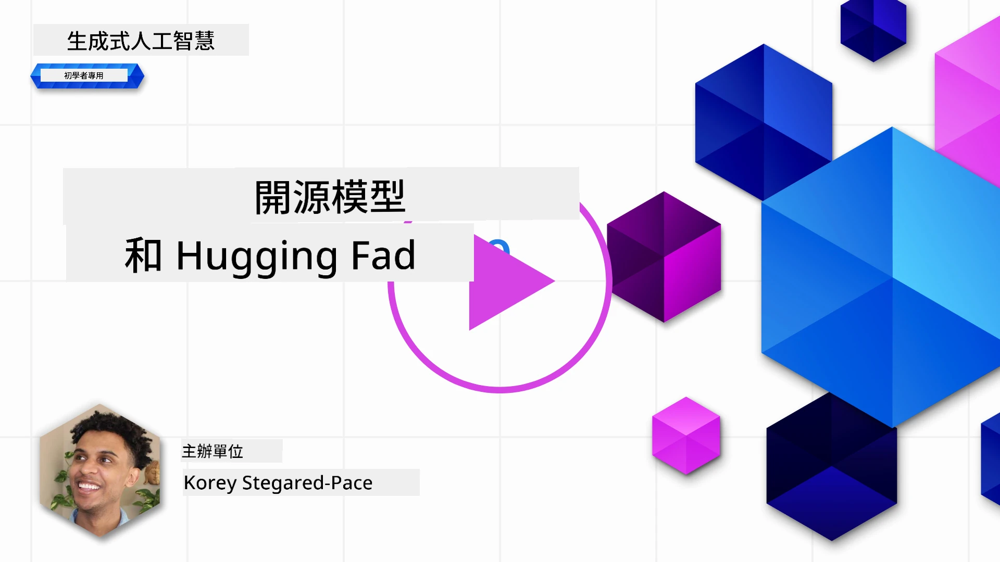
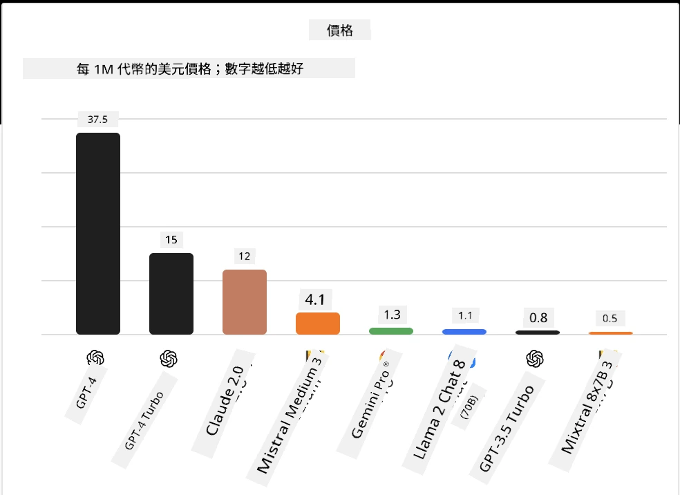
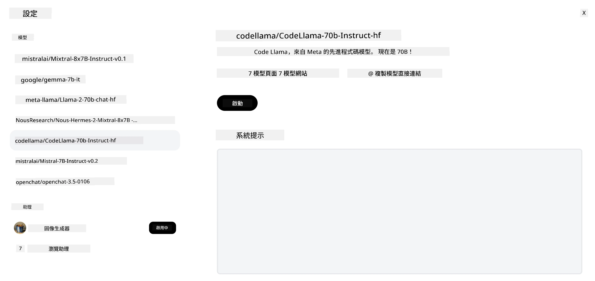
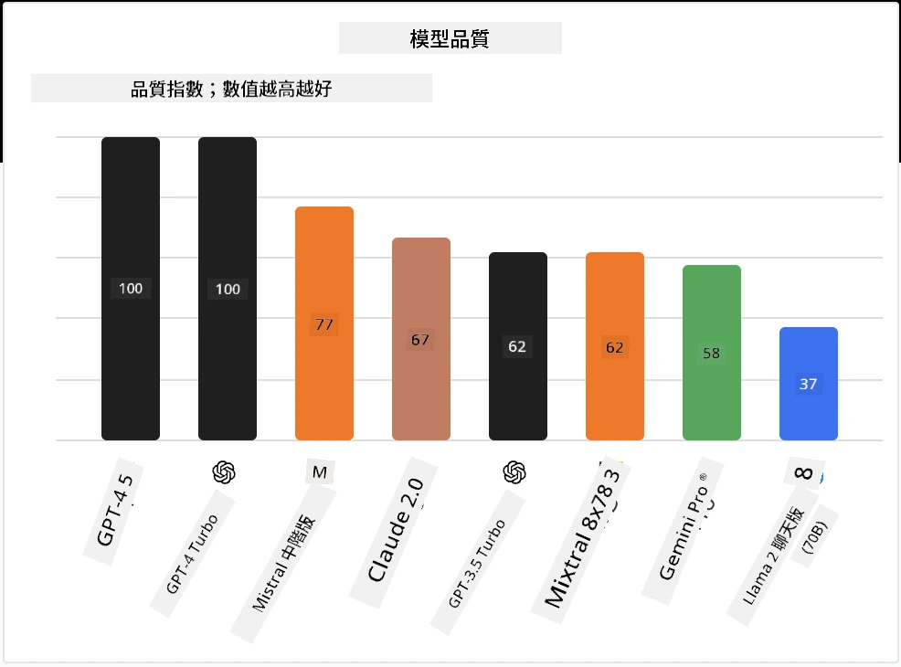

## 介紹

開放原始碼大型語言模型（LLM）的世界令人振奮且持續演進。本課程旨在深入探討開放原始碼模型。如果您想了解專有模型與開放原始碼模型的比較，請前往[「探索並比較不同的LLM」課程](../02-exploring-and-comparing-different-llms/README.md?WT.mc_id=academic-105485-koreyst)。本課程也會涵蓋微調主題，但更詳細的說明可參考[「LLM微調」課程](../18-fine-tuning/README.md?WT.mc_id=academic-105485-koreyst)。

## 學習目標

- 了解開放原始碼模型的基本概念
- 理解使用開放原始碼模型的優點
- 探索Hugging Face和Microsoft Foundry模型目錄上的開放模型

## 什麼是開放原始碼模型？

開放原始碼軟體在各種領域的技術發展中扮演了關鍵角色。開放原始碼倡議（OSI）定義了[軟體分類為開放原始碼的10項標準](https://web.archive.org/web/20241126001143/https://opensource.org/osd?WT.mc_id=academic-105485-koreyst)。原始碼必須在OSI批准的授權條款下公開分享。

雖然大型語言模型的開發與軟體開發有相似之處，但過程並不完全相同。這在社群中引發了許多關於LLM領域中開放原始碼定義的討論。若要讓一個模型符合傳統的開放原始碼定義，以下資訊應該公開可得：

- 用於訓練模型的資料集
- 完整的模型權重作為訓練的一部分
- 評估程式碼
- 微調程式碼
- 完整的模型權重與訓練指標

目前只有少數模型符合這些標準。由Allen人工智慧研究所（AllenAI）開發的[OLMo模型](https://huggingface.co/allenai/OLMo-7B?WT.mc_id=academic-105485-koreyst)即屬於此類。

在本課程中，我們將稱這些模型為「開放模型」，因為在撰寫時它們可能尚未完全符合上述標準。

## 開放模型的優點

<strong>高度可定制化</strong> - 由於開放模型附帶詳細的訓練資訊，研究人員與開發者可以修改模型內部結構，這使得能夠創造出專門微調以完成特定任務或研究領域的模型。例如程式碼生成、數學運算和生物領域的應用。

<strong>成本</strong> - 使用和部署這些模型的每個token成本低於專有模型。在建構生成型AI應用時，在您的用例中評估效能與價格的關係相當重要。

來源：Artificial Analysis

<strong>彈性</strong> - 使用開放模型可以靈活選擇不同模型或將它們結合。例如[HuggingChat助理](https://huggingface.co/chat?WT.mc_id=academic-105485-koreyst)中，使用者可直接在介面中選擇所使用的模型：

## 探索不同的開放模型

### Llama 2

由Meta開發的[LLama2](https://huggingface.co/meta-llama?WT.mc_id=academic-105485-koreyst)是一款針對聊天應用優化的開放模型。這是因為其微調方法包括大量對話和人類反饋，使模型輸出更符合人類期待，提供更佳使用者體驗。

一些Llama的微調版本範例包括專注於日語的[Japanese Llama](https://huggingface.co/elyza/ELYZA-japanese-Llama-2-7b?WT.mc_id=academic-105485-koreyst)和加強基礎模型的[Llama Pro](https://huggingface.co/TencentARC/LLaMA-Pro-8B?WT.mc_id=academic-105485-koreyst)。

### Mistral

[Mistral](https://huggingface.co/mistralai?WT.mc_id=academic-105485-koreyst)是一款強調高效能與效率的開放模型。它使用專家混合（Mixture-of-Experts）方法，將多個專精模型組合於一系統中，根據輸入動態選擇特定模型應用。這使計算更有效率，模型只處理自己專長的輸入。

Mistral的微調版本範例包括專注於醫療領域的[BioMistral](https://huggingface.co/BioMistral/BioMistral-7B?text=Mon+nom+est+Thomas+et+mon+principal?WT.mc_id=academic-105485-koreyst)和進行數學運算的[OpenMath Mistral](https://huggingface.co/nvidia/OpenMath-Mistral-7B-v0.1-hf?WT.mc_id=academic-105485-koreyst)。

### Falcon

[Falcon](https://huggingface.co/tiiuae?WT.mc_id=academic-105485-koreyst)是科技創新研究所（**TII**）推出的LLM。Falcon-40B使用400億參數進行訓練，已顯示出在較少運算預算下能勝過GPT-3。這得益於採用FlashAttention算法和多重查詢注意力，降低推理時的記憶體需求。較短的推理時間使Falcon-40B適合聊天應用。

Falcon的微調版本包括基於開放模型打造的[OpenAssistant](https://huggingface.co/OpenAssistant/falcon-40b-sft-top1-560?WT.mc_id=academic-105485-koreyst)助理，以及效能超越基礎模型的[GPT4ALL](https://huggingface.co/nomic-ai/gpt4all-falcon?WT.mc_id=academic-105485-koreyst)。

## 如何選擇

選擇開放模型沒有唯一答案。可以先從Microsoft Foundry模型目錄的任務篩選功能開始，這能幫助您了解模型所訓練的任務類型。Hugging Face也維護著LLM排行榜，基於特定指標展示最佳表現模型。

若要比較不同類型的LLM，[Artificial Analysis](https://artificialanalysis.ai/?WT.mc_id=academic-105485-koreyst)也是相當好的資源：

來源：Artificial Analysis

若針對特定用例，尋找專注同領域的微調版本可能更有效。嘗試多個開放模型，根據您和使用者的期待評估他們的表現，也是良好做法。

## 下一步

開放模型最大的優點是您能相當快速地開始使用。看看[Microsoft Foundry模型目錄](https://ai.azure.com?WT.mc_id=academic-105485-koreyst)，其中包含我們此處討論的模型在Hugging Face上的專區。

## 學習不止於此，繼續前行

完成本課程後，請參考我們的[生成型人工智慧學習收藏](https://aka.ms/genai-collection?WT.mc_id=academic-105485-koreyst)，持續提升您的生成型AI知識！

---

<!-- CO-OP TRANSLATOR DISCLAIMER START -->
**免責聲明**：
此文件已使用 AI 翻譯服務 [Co-op Translator](https://github.com/Azure/co-op-translator) 進行翻譯。雖然我們努力追求準確性，但請注意自動翻譯可能包含錯誤或不準確之處。原始文件的母語版本應視為權威來源。對於關鍵資訊，建議採用專業人工翻譯。我們不對因使用此翻譯所產生的任何誤解或誤譯承擔責任。
<!-- CO-OP TRANSLATOR DISCLAIMER END -->