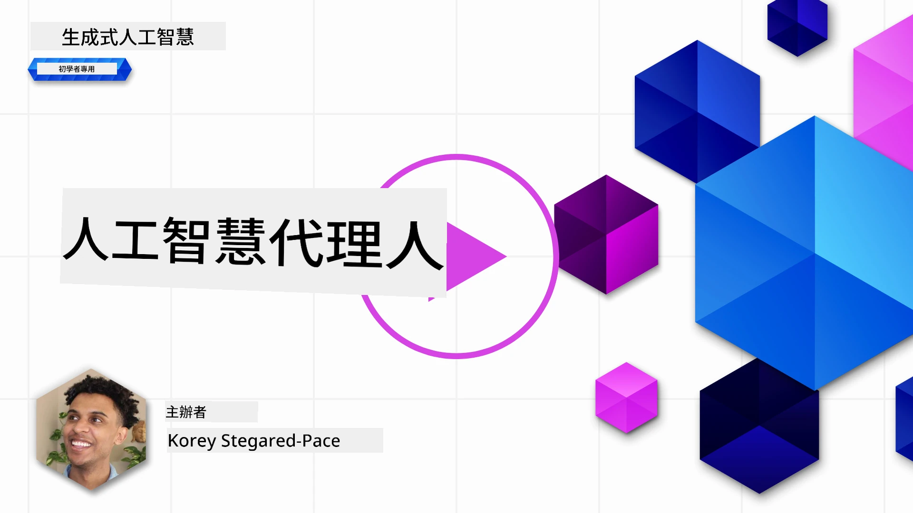
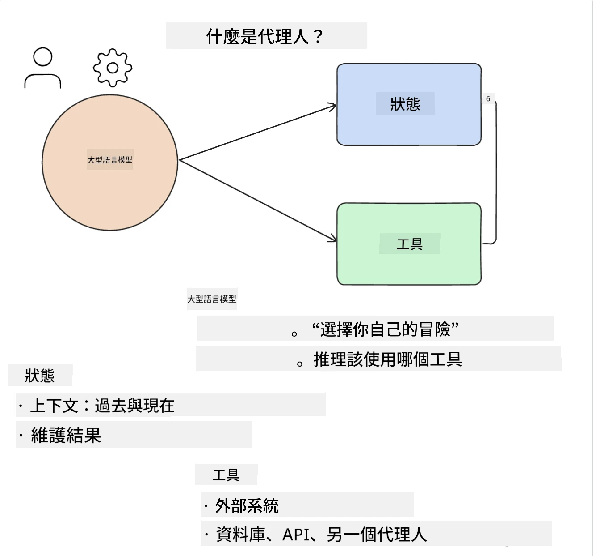
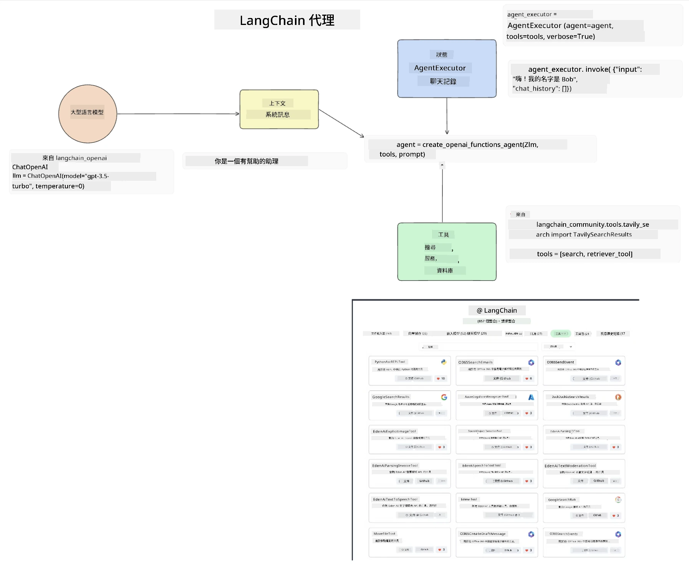
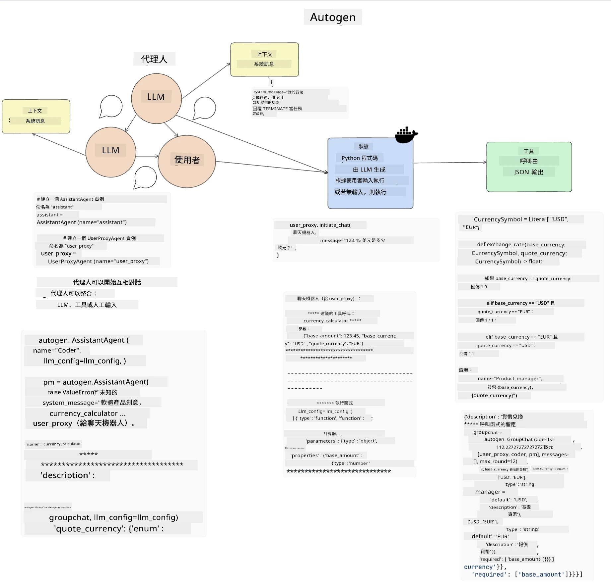
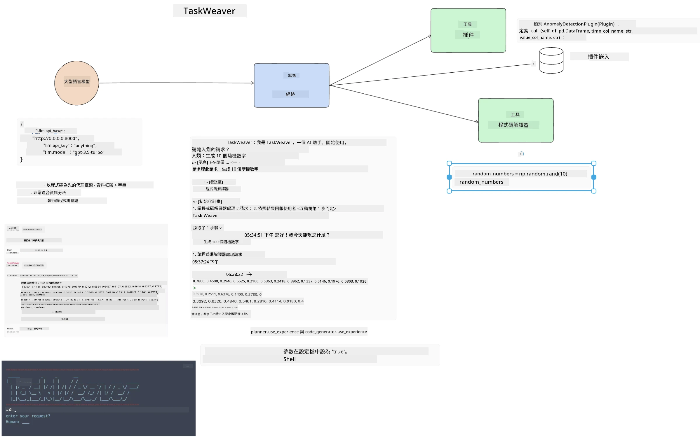
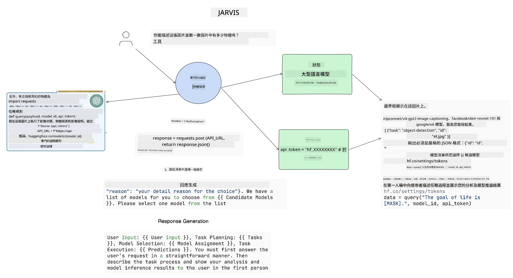

[](https://youtu.be/yAXVW-lUINc?si=bOtW9nL6jc3XJgOM)

## 介紹

AI 代理（AI Agents）代表生成式 AI 的一項令人振奮的發展，使大型語言模型（LLMs）能從助理進化為可執行操作的代理。AI 代理框架讓開發者得以創建讓 LLM 存取工具和狀態管理的應用程式。這些框架還提升了可見性，使用者和開發者可以監控 LLM 計劃的操作，從而改善體驗管理。

本課程將涵蓋以下內容：

- 了解什麼是 AI 代理——究竟什麼是 AI 代理？
- 探索四種不同的 AI 代理框架——它們有何獨特之處？
- 將這些 AI 代理應用於不同使用案例——在哪些情況下應使用 AI 代理？

## 學習目標

完成本課後，您將能：

- 解釋什麼是 AI 代理以及它們如何被使用。
- 了解一些流行的 AI 代理框架之間的差異及其不同之處。
- 理解 AI 代理的運作原理，並基於此建構應用程式。

## 什麼是 AI 代理？

AI 代理是生成式 AI 世界中一個令人振奮的領域。隨著興奮同時也帶來了術語和應用上的混淆。為了保持簡單且包容大多數自稱 AI 代理的工具，我們將使用以下定義：

AI 代理允許大型語言模型（LLMs）透過給予它們存取**狀態**和**工具**來執行任務。



讓我們定義這些術語：

**大型語言模型** — 指本課程中提及的模型，如 GPT-3.5、GPT-4、Llama-2 等。

**狀態** — 指 LLM 正在運作的上下文。LLM 利用過去操作的上下文以及當前狀態，來指導其後續行動的決策。AI 代理框架讓開發者更容易維護這些上下文。

**工具** — 為完成用戶請求且 LLM 已規劃的任務，LLM 需要存取工具。工具的例子可能是資料庫、API、外部應用甚至另一個 LLM！

這些定義希望能為您後續了解它們的實現提供良好基礎。現在讓我們來探索幾種不同的 AI 代理框架：

## LangChain 代理

[LangChain Agents](https://python.langchain.com/docs/how_to/#agents?WT.mc_id=academic-105485-koreyst) 是基於上述定義的實作。

它使用內建函式 `AgentExecutor` 來管理**狀態**。此函式接收已定義的 `agent` 與可用的 `tools`。

`Agent Executor` 還會儲存聊天紀錄，以提供對話的上下文。



LangChain 提供一個[工具目錄](https://integrations.langchain.com/tools?WT.mc_id=academic-105485-koreyst)，可匯入應用程式，讓 LLM 存取。這些工具由社群及 LangChain 團隊製作。

您可以定義這些工具並傳給 `Agent Executor`。

可見性是談論 AI 代理時另一重要面向。對應用開發者來說，了解 LLM 使用的是何種工具以及原因非常重要。為此，LangChain 團隊開發了 LangSmith。

## AutoGen

下一個我們將介紹的 AI 代理框架是 [AutoGen](https://microsoft.github.io/autogen/?WT.mc_id=academic-105485-koreyst)。AutoGen 主要聚焦於對話。代理既是**可對話**又是**可定製**的。

**可對話 —** LLM 可以與另一個 LLM 開始並持續對話來完成任務。這是透過建立 `AssistantAgents` 並給予它們特定的系統訊息實現的。

```python

autogen.AssistantAgent( name="Coder", llm_config=llm_config, ) pm = autogen.AssistantAgent( name="Product_manager", system_message="Creative in software product ideas.", llm_config=llm_config, )

```

**可定製** — 代理不僅可以定義為 LLM，也可以是用戶或工具。作為開發者，您可以定義一個負責與用戶互動以取得反饋以完成任務的 `UserProxyAgent`。該反饋可以用來繼續執行任務或終止任務。

```python
user_proxy = UserProxyAgent(name="user_proxy")
```

### 狀態與工具

為了改變及管理狀態，輔助代理會生成 Python 程式碼來完成任務。

下面是一個流程範例：



#### 使用系統訊息定義 LLM

```python
system_message="For weather related tasks, only use the functions you have been provided with. Reply TERMINATE when the task is done."
```

此系統訊息指示特定 LLM 哪些功能與其任務相關。請記得，在 AutoGen 中，您可以定義多個擁有不同系統訊息的 AssistantAgents。

#### 對話由用戶發起

```python
user_proxy.initiate_chat( chatbot, message="I am planning a trip to NYC next week, can you help me pick out what to wear? ", )

```

來自 user_proxy（人類）的此訊息會啟動代理探索應該執行的可能函數過程。

#### 執行函數

```bash
chatbot (to user_proxy):

***** Suggested tool Call: get_weather ***** Arguments: {"location":"New York City, NY","time_periond:"7","temperature_unit":"Celsius"} ******************************************************** --------------------------------------------------------------------------------

>>>>>>>> EXECUTING FUNCTION get_weather... user_proxy (to chatbot): ***** Response from calling function "get_weather" ***** 112.22727272727272 EUR ****************************************************************

```

初始對話處理完後，代理會送出建議要呼叫的工具。在此例中，是名為 `get_weather` 的函數。根據您的設定，此函數可以自動執行並由代理讀取，或是根據用戶輸入執行。

您可以參考一份[AutoGen 程式碼範例清單](https://microsoft.github.io/autogen/docs/Examples/?WT.mc_id=academic-105485-koreyst)，深入探索如何開始建置。

## Taskweaver

接著我們探索的代理框架是 [Taskweaver](https://microsoft.github.io/TaskWeaver/?WT.mc_id=academic-105485-koreyst)。它被稱為「程式碼優先」的代理，因為它不只處理 `strings`，還能操作 Python 的 DataFrame。這對於資料分析與生成任務非常有用，像是製作圖表或產生隨機數。

### 狀態與工具

TaskWeaver 透過 `Planner` 概念管理對話狀態。`Planner` 是一個 LLM，接收用戶請求並規劃出需完成的任務。

為了執行任務，`Planner` 可使用稱為 `Plugins` 的工具集合。這些可以是 Python 類別或通用程式碼解譯器。插件以嵌入向量形式存儲，以便 LLM 更佳地搜尋正確的插件。



以下是一個用於異常檢測的插件範例：

```python
class AnomalyDetectionPlugin(Plugin): def __call__(self, df: pd.DataFrame, time_col_name: str, value_col_name: str):
```

程式碼會先經過驗證再執行。Taskweaver 中另一個管理上下文的功能是 `experience`。Experience 允許將對話上下文長期保存於 YAML 檔案中。可設定讓 LLM 隨時間透過先前對話而持續改進某些任務。

## JARVIS

最後一個我們探討的代理框架是 [JARVIS](https://github.com/microsoft/JARVIS?tab=readme-ov-file&WT.mc_id=academic-105485-koreyst)。JARVIS 的特色在於它使用 LLM 來管理對話的 `state`，而其 `tools` 是其他 AI 模型。這些 AI 模型是專門處理某些任務的專用模型，如物件偵測、轉錄或影像說明。



作為通用模型的 LLM 接收用戶請求，識別具體任務和完成該任務所需的參數/資料。

```python
[{"task": "object-detection", "id": 0, "dep": [-1], "args": {"image": "e1.jpg" }}]
```

接著，LLM 會將請求格式化成專門 AI 模型能理解的格式，如 JSON。完成任務後，AI 模型返回預測結果給 LLM。

若任務需多個模型合作，LLM 也會解讀這些模型的回應，然後整合以生成對用戶的最終回應。

以下範例展示用戶請求描述及計算圖片中物件數量的運作流程：

## 作業

為持續學習 AI 代理，您可以嘗試使用 AutoGen 建立：

- 一個模擬教育新創公司不同部門商業會議的應用程式。
- 創建系統訊息，引導 LLM 理解不同角色與優先事項，並讓用戶提案新產品想法。
- LLM 接著應從各部門生成追問問題，進一步精煉與改良提案及產品想法。

## 學習不止於此，繼續旅程

完成本課後，請參閱我們的[生成式 AI 學習合集](https://aka.ms/genai-collection?WT.mc_id=academic-105485-koreyst)，持續提升您的生成式 AI 知識！

---

<!-- CO-OP TRANSLATOR DISCLAIMER START -->
**免責聲明**：  
本文件係使用 AI 翻譯服務 [Co-op Translator](https://github.com/Azure/co-op-translator) 進行翻譯。雖然我們致力於翻譯的準確性，但請注意，自動翻譯可能包含錯誤或不準確之處。原始文件以其母語版本為唯一權威來源。對於關鍵資訊，建議使用專業人工翻譯。對於因使用本翻譯而產生的任何誤解或錯誤詮釋，我們不承擔任何責任。
<!-- CO-OP TRANSLATOR DISCLAIMER END -->