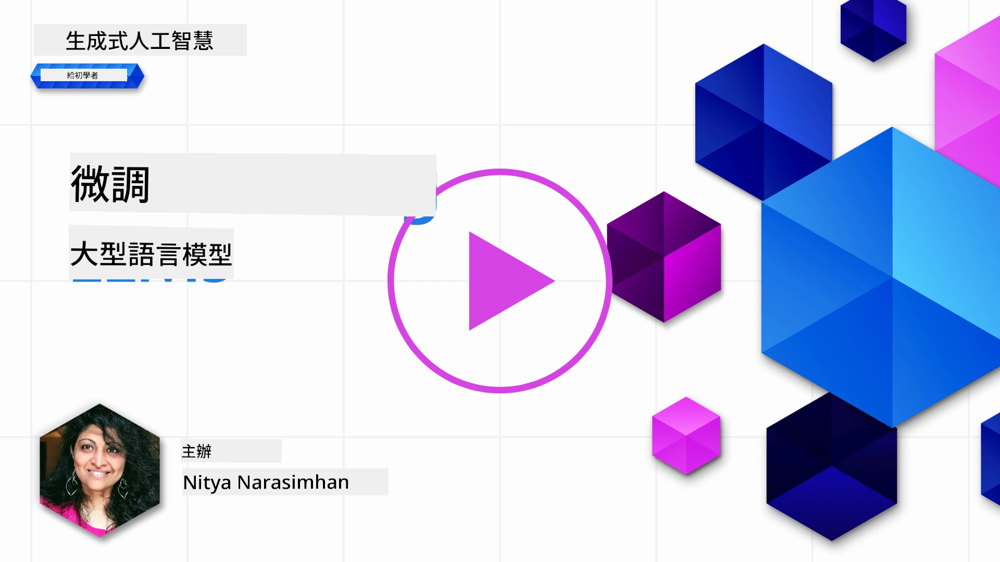
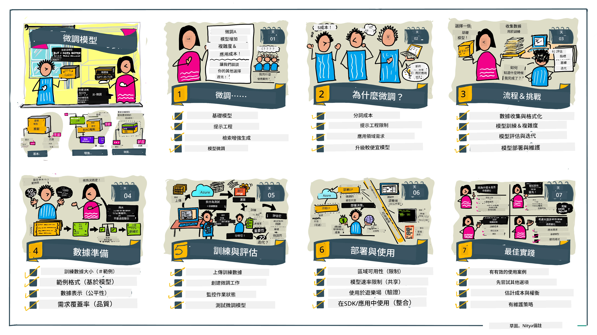

# 微調您的大型語言模型（LLM）

使用大型語言模型來建立生成式 AI 應用程式帶來了新的挑戰。一個關鍵問題是確保模型對特定使用者請求所生成內容的回應品質（準確性和相關性）。在之前的課程中，我們討論了類似提示工程（prompt engineering）和檢索增強生成（retrieval-augmented generation）這些技術，試圖透過_修改現有模型的提示輸入_來解決這個問題。

在今天的課程中，我們將討論第三種技術，**微調（fine-tuning）**，該技術試圖透過_使用額外資料再訓練模型本身_來解決挑戰。讓我們深入了解細節。

## 學習目標

本課程介紹了微調預訓練語言模型的概念，探討此方法的優點與挑戰，並提供指導說明何時及如何使用微調來提升生成式 AI 模型的效能。

完成本課程後，您應該能回答以下問題：

- 什麼是語言模型的微調？
- 什麼時候以及為何微調有用？
- 我該如何微調一個預訓練模型？
- 微調有什麼限制？

準備好了嗎？讓我們開始吧。

## 圖解指南

想在深入學習前先了解整體概要嗎？參考這份圖解指南，說明了本課程的學習旅程——從了解微調的核心概念與動機，到理解執行微調任務的流程與最佳實踐。這是一個相當有趣的主題，不要忘了查看[資源](./RESOURCES.md?WT.mc_id=academic-105485-koreyst)頁面，獲取更多支援您自學之旅的連結！

## 什麼是語言模型的微調？

按照定義，大型語言模型是透過大量來自網路等多元來源的文本進行_預訓練_。正如我們在先前課程中了解到的，我們需要提示工程和檢索增強生成等技術，來提升模型對使用者問題（「提示」）的回應品質。

一項常見的提示工程技巧是給模型更多指南以指定期望的回應形式，無論是透過提供_指示_（明確指導）還是_給予幾個範例_（隱含指導）。這稱為_少量示例學習（few-shot learning）_，但存在兩個限制：

- 模型的 token 限制會限制您能提供的示例數量，並影響效果。
- 模型 token 費用會讓每次提示添加示例變得昂貴，限制彈性。

微調是機器學習系統中的常見做法，我們會拿一個預訓練模型，並用新資料重新訓練，提升其在特定任務上的表現。在語言模型的情境中，我們可以透過_針對特定任務或應用領域精心挑選的範例進行微調_預訓練模型，從而建立一個**自訂模型**，使其在該特定任務或領域上更為準確且相關。微調的附帶好處還包括減少少量示例學習所需的範例數量，降低 token 使用與相關成本。

## 何時以及為何要微調模型？

在_這裡_所談的微調，是指**監督式**微調，也就是透過**新增原訓練資料集中未包含的資料**來重新訓練模型。這與一種非監督式微調不同，後者是對原始資料使用不同超參數進行重新訓練。

關鍵在於，微調是一項需要一定專業知識的進階技術，才能達成預期效果。若操作不當，可能不但無法改善，反而會降低模型在目標領域的表現。

因此，在您學習「如何」微調語言模型前，需先明白「為何」要採用這條路，以及「何時」開始微調的過程。先自問這些問題：

- **使用案例**：您的微調_使用案例_是什麼？您希望改善現有預訓練模型的哪部分？
- **替代方案**：您是否嘗試過_其他技術_來達成預期的效果？並用它們建立比較基準。
  - 提示工程：嘗試少量示例提示，提供相關提示回應範例，評估回應品質。
  - 檢索增強生成：嘗試利用檢索結果增強提示，並評估回應品質。
- **成本**：您是否評估過微調的成本？
  - 可調整性——預訓練模型是否支持微調？
  - 工作量——準備訓練資料、評估與優化模型所需的努力。
  - 計算資源——執行微調作業及部署微調後模型所需的計算能力。
  - 資料——是否有足夠且符合品質的範例來發揮微調效果。
- **效益**：您是否確認微調帶來的效益？
  - 品質——微調後的模型是否超越基準表現？
  - 成本——是否能透過簡化提示減少 token 使用？
  - 擴充性——是否可以用基礎模型拓展到新領域？

回答這些問題，您將能判斷微調是否適合您的使用案例。理想狀況下，只有當效益超過成本時，才應採用此法。決定進行後，接下來要思考_如何_微調預訓練模型。

想了解更多決策過程的洞見嗎？觀看[要不要微調？](https://www.youtube.com/watch?v=0Jo-z-MFxJs)

## 我們如何微調一個預訓練模型？

要微調一個預訓練模型，您需要具備：

- 一個可微調的預訓練模型
- 用於微調的資料集
- 用於執行微調作業的訓練環境
- 用於部署微調後模型的主機環境

## 微調實作

以下資源提供逐步教學，帶您使用精選模型和精心準備的資料集進行實際操作。要學習這些教學，您需要在特定服務商註冊帳號，並取得相關模型與資料集的存取權限。

| 服務商       | 教學連結                                                                                                                                                                    | 說明                                                                                                                                                                                                                                                                                                                                                                                                                             |
| ------------ | --------------------------------------------------------------------------------------------------------------------------------------------------------------------------- | -------------------------------------------------------------------------------------------------------------------------------------------------------------------------------------------------------------------------------------------------------------------------------------------------------------------------------------------------------------------------------------------------------------------------------- |
| OpenAI       | [如何微調聊天模型](https://github.com/openai/openai-cookbook/blob/main/examples/How_to_finetune_chat_models.ipynb?WT.mc_id=academic-105485-koreyst)                             | 學習如何針對特定領域（「食譜助理」）微調 `gpt-35-turbo`，包含準備訓練資料、執行微調作業與使用微調後模型進行推論。                                                                                                                                                                                                                                                              |
| Azure OpenAI | [GPT 3.5 Turbo 微調教學](https://learn.microsoft.com/azure/ai-services/openai/tutorials/fine-tune?tabs=python-new%2Ccommand-line&WT.mc_id=academic-105485-koreyst)               | 學習如何**在 Azure 上**微調 `gpt-35-turbo-0613` 模型，步驟涵蓋創建與上傳訓練資料、執行微調作業、部署及使用新模型。                                                                                                                                                                                                                                                       |
| Hugging Face | [使用 Hugging Face 微調大型語言模型](https://www.philschmid.de/fine-tune-llms-in-2024-with-trl?WT.mc_id=academic-105485-koreyst)                                               | 本篇部落格帶您使用 [transformers](https://huggingface.co/docs/transformers/index?WT.mc_id=academic-105485-koreyst) 函式庫與 [Transformer Reinforcement Learning (TRL)](https://huggingface.co/docs/trl/index?WT.mc_id=academic-105485-koreyst)，搭配 Hugging Face 上的開放[資料集](https://huggingface.co/docs/datasets/index?WT.mc_id=academic-105485-koreyst)，微調 _開放大型語言模型_（如 `CodeLlama 7B`）。 |
|              |                                                                                                                                                                           |                                                                                                                                                                                                                                                                                                                                                                                                                                  |
| 🤗 AutoTrain | [使用 AutoTrain 微調大型語言模型](https://github.com/huggingface/autotrain-advanced/?WT.mc_id=academic-105485-koreyst)                                                        | AutoTrain（或 AutoTrain Advanced）是 Hugging Face 開發的 Python 庫，能針對多種任務微調模型，包括大型語言模型微調。AutoTrain 提供免程式碼解決方案，微調可在您的私有雲、Hugging Face Spaces 或本機完成，支援網頁圖形介面、指令列介面及 yaml 配置文件訓練。                                                                                                       |
|              |                                                                                                                                                                           |                                                                                                                                                                                                                                                                                                                                                                                                                                  |
| 🦥 Unsloth   | [使用 Unsloth 微調大型語言模型](https://github.com/unslothai/unsloth)                                                                                                      | Unsloth 是一個支持大型語言模型微調與強化學習（RL）的開源框架。Unsloth 使本地訓練、評估和部署流程簡便，提供可用的[筆記本範例](https://github.com/unslothai/notebooks)。同時支持文字轉語音（TTS）、BERT 和多模態模型。若要開始，請閱讀他們的逐步[大型語言模型微調指南](https://docs.unsloth.ai/get-started/fine-tuning-llms-guide)。                                                                        |
|              |                                                                                                                                                                           |                                                                                                                                                                                                                                                                                                                                                                                                                                  |
## 作業

從上述教學中選擇一個，並跟著操作學習。_我們可能會在此 repo 內的 Jupyter 筆記本中重現部分教學以供參考，請直接使用原始來源以取得最新版本_。

## 做得很好！繼續您的學習。

完成本課程後，瀏覽我們的[生成式 AI 學習合集](https://aka.ms/genai-collection?WT.mc_id=academic-105485-koreyst)，持續提升您的生成式 AI 知識！

恭喜您！您已完成本課程 v2 系列的最後一課！別停止學習與實作。**請查看[資源](RESOURCES.md?WT.mc_id=academic-105485-koreyst)頁面，了解更多本主題的額外建議。**

我們的 v1 系列課程也已更新，包含更多作業與概念。花點時間重新複習您的知識，並歡迎[分享您的問題與回饋](https://github.com/microsoft/generative-ai-for-beginners/issues?WT.mc_id=academic-105485-koreyst) ，幫助我們為社群改進這些課程。

---

<!-- CO-OP TRANSLATOR DISCLAIMER START -->
**免責聲明**：  
本文件係使用 AI 翻譯服務 [Co-op Translator](https://github.com/Azure/co-op-translator) 進行翻譯。雖然我們致力於提供準確的翻譯，但自動翻譯結果可能包含錯誤或不準確之處。原始文件之母語版本應視為權威來源。對於重要資訊，建議尋求專業人工翻譯。我們不對因使用此翻譯而產生之任何誤解或誤釋承擔責任。
<!-- CO-OP TRANSLATOR DISCLAIMER END -->