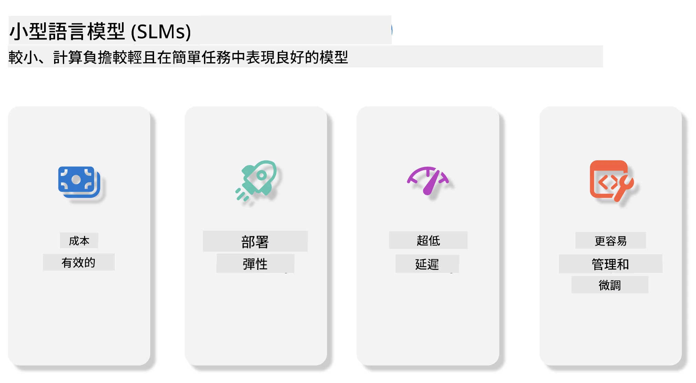
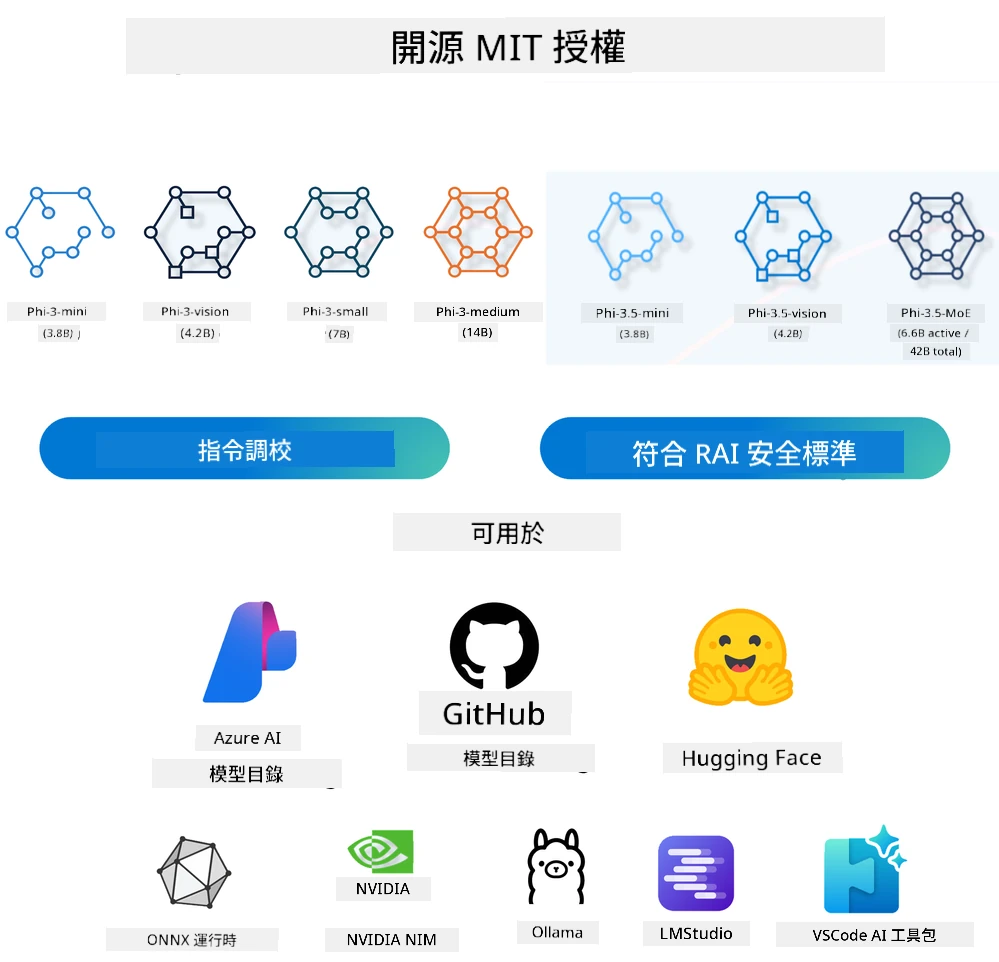
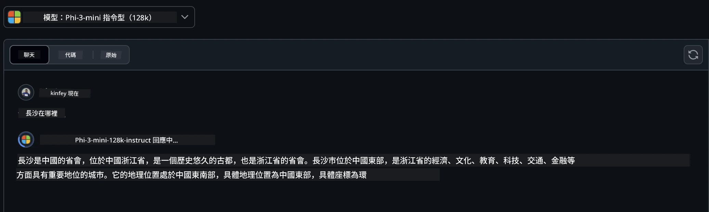
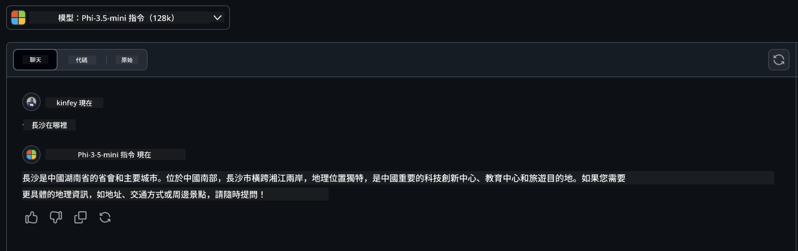

# 初學者的生成式 AI 小型語言模型介紹
生成式 AI 是人工智慧中一個迷人的領域，專注於創建能夠生成新內容的系統。這些內容可以涵蓋文字、圖片、音樂，甚至整個虛擬環境。生成式 AI 最令人興奮的應用之一即是在語言模型領域。

## 什麼是小型語言模型？

小型語言模型（SLM）代表大型語言模型（LLM）縮小版本，利用許多大型模型的架構原則與技術，但計算資源佔用顯著減少。

SLM 是為產生類似人類文本而設計的語言模型子集合。與其較大型的對手（如 GPT-4）不同，SLM 更為緊湊且高效，理想用於計算資源有限的應用場景。儘管體積較小，仍能執行各種任務。通常，SLM 是透過壓縮或蒸餾大型語言模型構建，旨在保留原模型大部分功能和語言能力。模型尺寸縮小降低整體複雜度，提高記憶體利用率和計算效率。即便如此，SLM 仍可執行廣泛的自然語言處理（NLP）任務：

- 文字生成：創建連貫且上下文相關的句子或段落。
- 文字補全：根據給定提示預測並補全句子。
- 翻譯：將文字從一種語言轉換至另一種語言。
- 摘要：將長篇內容濃縮成短小易讀的摘要。

雖然與大型模型相比，在性能或理解深度上有些許權衡。

## 小型語言模型如何運作？
SLM 基於大量文本資料訓練。訓練期間，模型學習語言的模式和結構，使其能生成語法正確且上下文恰當的文字。訓練流程包含：

- 資料收集：從多種來源蒐集大量文本資料。
- 預處理：清理並組織資料使其適合訓練。
- 訓練：運用機器學習演算法教模型理解與生成文字。
- 微調：調整模型以提升在特定任務的表現。

SLM 的開發回應了在如行動裝置或邊緣計算平台等資源受限環境中部署模型的需求，這些環境下全尺吋大型語言模型因資源需求龐大而不切實際。透過專注效率，SLM 在性能與易用性間找到平衡，使其得以廣泛應用於多個領域。



## 學習目標

本課程希望介紹 SLM 知識，並結合 Microsoft Phi-3，學習不同文字內容、視覺及 MoE 的應用場景。

課程結束後，你應能回答以下問題：

- 什麼是 SLM？
- SLM 與 LLM 有何不同？
- 什麼是 Microsoft Phi-3/3.5 系列？
- 如何使用 Microsoft Phi-3/3.5 系列進行推論？

準備好了嗎？讓我們開始吧。

## 大型語言模型 (LLM) 與小型語言模型 (SLM) 的區別

LLM 與 SLM 都建立於機率機器學習的基礎原理，並在架構設計、訓練方法、資料生成流程及模型評估技術等方面採用相似方法。然而，兩者在幾個關鍵面向上有所差異。

## 小型語言模型的應用

SLM 的應用範圍廣泛，包括：

- 聊天機器人：提供客戶支援，與用戶進行對話互動。
- 內容創作：協助作家產生點子，甚至草擬完整文章。
- 教育：幫助學生完成寫作作業或學習新語言。
- 無障礙輔助：為身心障礙者創建工具，如文字轉語音系統。

**規模**

LLM 與 SLM 最主要的區別在於模型規模。LLM 如 ChatGPT（GPT-4）估計包含約 1.76 兆參數，開源 SLM 如 Mistral 7B 則設計為約 70 億參數。這差異主要源於架構與訓練流程不同。例如，ChatGPT 採用編碼器-解碼器架構中的自注意力機制，而 Mistral 7B 則使用滑動視窗注意力，使其在純解碼器模型中實現更有效訓練。此架構差異深刻影響模型的複雜度與效能。

**理解能力**

SLM 通常針對特定領域進行優化，使其在該領域內高度專精，但可能限制了跨多領域的廣泛上下文理解能力。相反地，LLM 則致力於模擬更全面的人類智慧。LLM 透過多樣且龐大的資料集訓練，旨在於多個領域表現優異，具較佳通用性與適應性。因此，LLM 適合更廣泛的下游任務，如自然語言處理和程式設計。

**計算資源**

LLM 的訓練與部署通常資源密集，常需龐大計算基礎設施如大型 GPU 叢集。例如，要從頭訓練 ChatGPT 這類模型，可能需數千 GPU，且時間長久。而 SLM 由於參數較少，對計算資源的需求較低。譬如 Mistral 7B 可於配備中等 GPU 能力的本地機器上訓練和運行，雖然訓練仍需數小時且需多張 GPU 協作。

**偏差**

LLM 偏差問題眾所皆知，主要源於訓練數據的性質。模型多倚賴來自網路的原始公開資料，可能導致某些群體的代表性不足或誤導標記，或反映受方言、地理差異及語法規則影響的語言偏見。此外，LLM 複雜的架構亦可能無意中加劇偏見，且不易察覺，需謹慎微調。相較之下，SLM 基於較受限且域專屬的資料集訓練，本質上對偏見較不敏感，但仍無法完全免疫。

**推論效能**

SLM 尺寸縮小，在推論速度上具明顯優勢，可在本地硬體上高效生成輸出，無需大量平行運算資源。反觀 LLM 因體積大且複雜，往往需大量平行計算資源才能達到體驗良好的推論速度。而多重同時使用者更會降低 LLM 在大規模部署時的回應速度。

總結而言，LLM 與 SLM 雖同屬機器學習為基礎，但在模型規模、資源需求、上下文理解能力、偏差敏感度及推論效率上有顯著差異。這反映了其在不同使用情境的適用性，LLM 效能廣泛但需資源充裕，SLM 則提供領域專精且計算需求較低的效率。

***注意：本課程將以 Microsoft Phi-3 / 3.5 作為例子介紹 SLM。***

## 介紹 Phi-3 / Phi-3.5 系列

Phi-3 / 3.5 系列主要面向文字、視覺及代理（MoE）應用場景：

### Phi-3 / 3.5 指令型（Instruct）

主要用於文字生成、聊天補全及內容信息提取等。

**Phi-3-mini**

3.8B 參數模型可在 Microsoft Azure AI Studio、Hugging Face 及 Ollama 獲得。Phi-3 模型在關鍵基準測試上表現遠超同等及更大規模語言模型（見下方基準數據，數字越高越好）。Phi-3-mini 表現優於其兩倍規模的模型，Phi-3-small 與 Phi-3-medium 則超越包括 GPT-3.5 在內的更大模型。

**Phi-3-small 與 medium**

僅 70 億參數的 Phi-3-small 在語言、推理、編碼與數學多項基準上擊敗 GPT-3.5T。

擁有 140 億參數的 Phi-3-medium 繼續此趨勢，超越 Gemini 1.0 Pro。

**Phi-3.5-mini**

可視作 Phi-3-mini 的升級版。雖然參數不變，增強了多語言支持（支援 20 多種語言：阿拉伯語、中文、捷克語、丹麥語、荷蘭語、英語、芬蘭語、法語、德語、希伯來語、匈牙利語、義大利語、日語、韓語、挪威語、波蘭語、葡萄牙語、俄語、西班牙語、瑞典語、泰語、土耳其語、烏克蘭語）並增強長上下文能力。

Phi-3.5-mini（3.8B 參數）表現優於同尺寸語言模型，且能匹敵兩倍規模模型。

### Phi-3 / 3.5 視覺

可將 Phi-3/3.5 指令型模型視為 Phi 的理解能力，而視覺即賦予 Phi 觀察世界的「雙眼」。

**Phi-3-Vision**

Phi-3-Vision 僅有 42 億參數，延續其趨勢，在一般視覺推理、OCR 以及表格與圖表理解等任務上超越較大模型如 Claude-3 Haiku 與 Gemini 1.0 Pro V。

**Phi-3.5-Vision**

Phi-3.5-Vision 是 Phi-3-Vision 的升級版，支援多張圖片輸入。它不僅能看圖，還能看影片。

Phi-3.5-Vision 在 OCR、表格及圖表理解任務上優於較大模型如 Claude-3.5 Sonnet 與 Gemini 1.5 Flash，並在一般視覺知識推理任務表現相當。支援多幀輸入，即可對多張輸入圖片進行推理。

### Phi-3.5-MoE

***專家混合（MoE）*** 讓模型以更低的計算量進行預訓練，可在同計算預算下大幅擴充模型或資料集尺寸。尤其 MoE 模型在預訓練階段應能更快達成與其稠密對應模型相當的品質。

Phi-3.5-MoE 包含 16 個 3.8B 專家模組。Phi-3.5-MoE 活躍參數僅 66 億，卻達到與更大模型相當的推理、語言理解與數學能力。

Phi-3/3.5 系列模型可依不同場景使用。不像 LLM，可在邊緣裝置部署 Phi-3/3.5-mini 或 Phi-3/3.5-Vision。

## 如何使用 Phi-3/3.5 系列模型

我們希望在不同場景中使用 Phi-3/3.5。接下來，我們將根據不同情境使用 Phi-3/3.5。



### 透過雲端 API 推論

**GitHub Models**

GitHub Models 是最直接方式。你可快速透過 GitHub Models 存取 Phi-3/3.5-Instruct 模型。結合 Azure AI Inference SDK / OpenAI SDK，可透過程式碼呼叫 API，完成 Phi-3/3.5-Instruct 調用。你也能透過 Playground 測試不同效果。

- 範例演示：Phi-3-mini 與 Phi-3.5-mini 在中文場景中的效果比較






**Azure AI Studio**

若想使用視覺與 MoE 模型，可透過 Azure AI Studio 完成調用。若有興趣，可閱讀 Phi-3 Cookbook，瞭解如何透過 Azure AI Studio 呼叫 Phi-3/3.5 的 Instruct、Vision 與 MoE [點此連結](https://github.com/microsoft/Phi-3CookBook/blob/main/md/02.QuickStart/AzureAIStudio_QuickStart.md?WT.mc_id=academic-105485-koreyst)


**NVIDIA NIM**

除了 Azure 與 GitHub 提供的雲端模型目錄方案外，也可使用 [NVIDIA NIM](https://developer.nvidia.com/nim?WT.mc_id=academic-105485-koreyst) 進行相關調用。可造訪 NVIDIA NIM 執行 Phi-3/3.5 系列模型的 API 呼叫。NVIDIA NIM（NVIDIA 推論微服務）是一套加速推論微服務，幫助開發者有效部署 AI 模型於雲端、資料中心與工作站等多種環境。

以下為 NVIDIA NIM 的一些主要特點：
- **部署簡易性：** NIM 允許透過單一指令部署 AI 模型，使其能輕鬆整合進現有工作流程。
- **效能優化：** 它利用 NVIDIA 事先優化的推理引擎，例如 TensorRT 及 TensorRT-LLM，確保低延遲與高吞吐量。
- **擴展性：** NIM 支援 Kubernetes 的自動擴展，能有效應對不同工作負載。
- **安全性與控管：** 組織可透過自行托管 NIM 微服務於自有管理基礎設施，保持對資料與應用的控制權。
- **標準 API：** NIM 提供業界標準 API，方便建立及整合聊天機器人、AI 助理等 AI 應用。

NIM 屬於 NVIDIA AI Enterprise，旨在簡化 AI 模型的部署與運作，確保其在 NVIDIA GPU 上高效運行。

- 演示：使用 NVIDIA NIM 呼叫 Phi-3.5-Vision-API [[點此連結](./python/Phi-3-Vision-Nividia-NIM.ipynb?WT.mc_id=academic-105485-koreyst)]


### 本機執行 Phi-3/3.5
對於 Phi-3 或其他像 GPT-3 等語言模型來說，推理指的是根據輸入生成回應或預測的過程。當你提供提示或問題給 Phi-3 時，該模型會利用訓練好的神經網路，透過分析其訓練資料中的模式與關聯，推斷出最可能且相關的回應。

**Hugging Face Transformer**  
Hugging Face Transformers 是一個強大的函式庫，專為自然語言處理（NLP）及其他機器學習任務設計。以下是其主要特點：

1. **預訓練模型**：提供數千個預訓練模型，適用於文本分類、命名實體識別、問答、摘要、翻譯及文本生成等多種任務。

2. **框架互通性**：支援多種深度學習框架，包括 PyTorch、TensorFlow 和 JAX。讓你可在一種框架中訓練模型，並於另一種框架中使用。

3. **多模態能力**：除了 NLP，Hugging Face Transformers 也支援視覺任務（如影像分類、物件偵測）和音訊處理（如語音識別、音訊分類）。

4. **使用簡易**：提供 API 及工具，方便下載與微調模型，對新手及專家都相當友好。

5. **社群與資源**：Hugging Face 擁有活躍的社群及詳盡的文件、教學與指南，幫助使用者快速上手並充分利用函式庫。  
[官方文件](https://huggingface.co/docs/transformers/index?WT.mc_id=academic-105485-koreyst) 或 [GitHub 倉庫](https://github.com/huggingface/transformers?WT.mc_id=academic-105485-koreyst)。

這是最常用的方法，但也需要 GPU 加速。畢竟像 Vision 和 MoE 等場景需要大量運算，若未量化，執行在 CPU 上會非常緩慢。

- 演示：使用 Transformer 呼叫 Phi-3.5-Instruct [點此連結](./python/phi35-instruct-demo.ipynb?WT.mc_id=academic-105485-koreyst)

- 演示：使用 Transformer 呼叫 Phi-3.5-Vision [點此連結](./python/phi35-vision-demo.ipynb?WT.mc_id=academic-105485-koreyst)

- 演示：使用 Transformer 呼叫 Phi-3.5-MoE [點此連結](./python/phi35_moe_demo.ipynb?WT.mc_id=academic-105485-koreyst)

**Ollama**  
[Ollama](https://ollama.com/?WT.mc_id=academic-105485-koreyst) 是一個方便你在本機執行大型語言模型（LLM）的平台，支援 Llama 3.1、Phi 3、Mistral、Gemma 2 等多種模型。該平台將模型權重、配置和資料打包成單一套件，方便用戶自訂與打造自己的模型。Ollama 支援 macOS、Linux 及 Windows。如果你不想依賴雲端服務，想試驗或部署 LLM，這是最佳工具。Ollama 使用最直接，你只需執行以下指令。

```bash

ollama run phi3.5

```


**ONNX Runtime for GenAI**

[ONNX Runtime](https://github.com/microsoft/onnxruntime-genai?WT.mc_id=academic-105485-koreyst) 是一個跨平台推理與訓練的機器學習加速器。ONNX Runtime for Generative AI (GENAI) 是強大的工具，幫助你跨多平台高效執行生成式 AI 模型。

## 什麼是 ONNX Runtime?  
ONNX Runtime 是開源專案，支援高效的機器學習模型推理。它可處理以 Open Neural Network Exchange (ONNX) 格式表示的模型，該格式為機器學習模型的標準。ONNX Runtime 推理能加快用戶體驗並降低成本，支援來自深度學習框架如 PyTorch 和 TensorFlow/Keras，以及經典機器學習庫如 scikit-learn、LightGBM、XGBoost 等的模型。ONNX Runtime 兼容不同硬體、驅動與作業系統，並藉由硬體加速和圖形優化實現最佳效能。

## 什麼是生成式 AI?  
生成式 AI 指生成新內容（如文本、影像或音樂）的 AI 系統，基於訓練數據予以產出。舉例而言，有 GPT-3 這類語言模型與 Stable Diffusion 這類影像生成模型。ONNX Runtime for GenAI 函式庫提供 ONNX 模型的生成式 AI 循環，包含 ONNX Runtime 推理、logits 處理、搜尋與採樣，以及 KV 快取管理。

## ONNX Runtime for GENAI  
ONNX Runtime for GENAI 擴展了 ONNX Runtime 的功能以支援生成式 AI 模型。主要特點如下：

- **廣泛平台支援：** 支援 Windows、Linux、macOS、Android 及 iOS 等多平台。
- **模型支援：** 支援多種熱門生成式 AI 模型，如 LLaMA、GPT-Neo、BLOOM 等。
- **效能優化：** 包含對 NVIDIA GPU、AMD GPU 等硬體加速器的優化。
- **易用性：** 提供 API 可方便整合入應用，讓你以最低程式碼量生成文本、圖像與其他內容。
- 使用者可呼叫高階的 generate() 方法，或在迴圈中逐一執行模型每一輪產生單一 token，且可在迴圈中調整生成參數。
- ONNX Runtime 還支援貪婪搜尋/beam 搜尋以及 TopP、TopK 採樣生成 token 序列，並內建重複懲罰等 logits 處理，亦可輕鬆新增自訂評分。

## 快速開始  
若要開始使用 ONNX Runtime for GENAI，你可以依照以下步驟：

### 安裝 ONNX Runtime：
```Python
pip install onnxruntime
```


### 安裝生成式 AI 擴充套件：
```Python
pip install onnxruntime-genai
```


### 執行模型：以下為 Python 範例：
```Python
import onnxruntime_genai as og

model = og.Model('path_to_your_model.onnx')

tokenizer = og.Tokenizer(model)

input_text = "Hello, how are you?"

input_tokens = tokenizer.encode(input_text)

output_tokens = model.generate(input_tokens)

output_text = tokenizer.decode(output_tokens)

print(output_text) 
```


### 演示：使用 ONNX Runtime GenAI 呼叫 Phi-3.5-Vision
```python

import onnxruntime_genai as og

model_path = './Your Phi-3.5-vision-instruct ONNX Path'

img_path = './Your Image Path'

model = og.Model(model_path)

processor = model.create_multimodal_processor()

tokenizer_stream = processor.create_stream()

text = "Your Prompt"

prompt = "<|user|>\n"

prompt += "<|image_1|>\n"

prompt += f"{text}<|end|>\n"

prompt += "<|assistant|>\n"

image = og.Images.open(img_path)

inputs = processor(prompt, images=image)

params = og.GeneratorParams(model)

params.set_inputs(inputs)

params.set_search_options(max_length=3072)

generator = og.Generator(model, params)

while not generator.is_done():

    generator.compute_logits()
    
    generator.generate_next_token()

    new_token = generator.get_next_tokens()[0]
    
    output = tokenizer_stream.decode(new_token)
    
    print(tokenizer_stream.decode(new_token), end='', flush=True)

```


**其他**

除了 ONNX Runtime 與 Ollama 的參考方式外，亦可根據不同廠商提供的模型方式完成量化模型參考，如 Apple MLX 框架配合 Apple Metal、Qualcomm QNN 搭配 NPU、Intel OpenVINO 配合 CPU/GPU 等。你也可從 [Phi-3 Cookbook](https://github.com/microsoft/phi-3cookbook?WT.mc_id=academic-105485-koreyst) 獲得更多內容。


## 更多

我們已學習 Phi-3/3.5 家族的基礎，但若要深入了解 SLM 還需更多知識。你可以在 Phi-3 Cookbook 中找到解答。如想進一步瞭解，請造訪 [Phi-3 Cookbook](https://github.com/microsoft/phi-3cookbook?WT.mc_id=academic-105485-koreyst)。

---

<!-- CO-OP TRANSLATOR DISCLAIMER START -->
**免責聲明**：  
本文件是使用 AI 翻譯服務 [Co-op Translator](https://github.com/Azure/co-op-translator) 翻譯而成。雖然我們力求準確，但請注意自動翻譯可能會包含錯誤或不準確之處。原始文件的母語版本應視為權威來源。對於重要資訊，建議採用專業人工翻譯。我們對因使用本翻譯所引起的任何誤解或錯誤詮釋不承擔任何責任。
<!-- CO-OP TRANSLATOR DISCLAIMER END -->