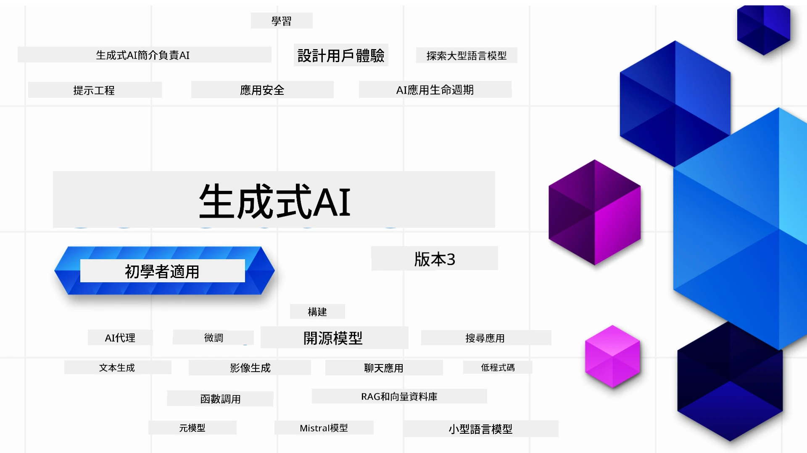

### 21課完整教學，帶你了解開始建立生成式 AI 應用所需的一切

[](https://github.com/microsoft/Generative-AI-For-Beginners/blob/master/LICENSE?WT.mc_id=academic-105485-koreyst)
[](https://GitHub.com/microsoft/Generative-AI-For-Beginners/graphs/contributors/?WT.mc_id=academic-105485-koreyst)
[](https://GitHub.com/microsoft/Generative-AI-For-Beginners/issues/?WT.mc_id=academic-105485-koreyst)
[](https://GitHub.com/microsoft/Generative-AI-For-Beginners/pulls/?WT.mc_id=academic-105485-koreyst)
[](http://makeapullrequest.com?WT.mc_id=academic-105485-koreyst)

[](https://GitHub.com/microsoft/Generative-AI-For-Beginners/watchers/?WT.mc_id=academic-105485-koreyst)
[](https://GitHub.com/microsoft/Generative-AI-For-Beginners/network/?WT.mc_id=academic-105485-koreyst)
[](https://GitHub.com/microsoft/Generative-AI-For-Beginners/stargazers/?WT.mc_id=academic-105485-koreyst)

[](https://discord.gg/nTYy5BXMWG)

### 🌐 多語言支援

#### 透過 GitHub Action 支援（自動化且永遠保持最新）

<!-- CO-OP TRANSLATOR LANGUAGES TABLE START -->
[阿拉伯語](../ar/README.md) | [孟加拉語](../bn/README.md) | [保加利亞語](../bg/README.md) | [緬甸語 (緬甸)](../my/README.md) | [中文 (簡體)](../zh-CN/README.md) | [中文 (繁體，香港)](../zh-HK/README.md) | [中文 (繁體，澳門)](../zh-MO/README.md) | [中文 (繁體，台灣)](./README.md) | [克羅埃西亞語](../hr/README.md) | [捷克語](../cs/README.md) | [丹麥語](../da/README.md) | [荷蘭語](../nl/README.md) | [愛沙尼亞語](../et/README.md) | [芬蘭語](../fi/README.md) | [法語](../fr/README.md) | [德語](../de/README.md) | [希臘語](../el/README.md) | [希伯來語](../he/README.md) | [印地語](../hi/README.md) | [匈牙利語](../hu/README.md) | [印尼語](../id/README.md) | [義大利語](../it/README.md) | [日語](../ja/README.md) | [坎那達語](../kn/README.md) | [高棉語](../km/README.md) | [韓語](../ko/README.md) | [立陶宛語](../lt/README.md) | [馬來語](../ms/README.md) | [馬拉雅拉姆語](../ml/README.md) | [馬拉地語](../mr/README.md) | [尼泊爾語](../ne/README.md) | [奈及利亞皮欽語](../pcm/README.md) | [挪威語](../no/README.md) | [波斯語 (法爾西語)](../fa/README.md) | [波蘭語](../pl/README.md) | [葡萄牙語 (巴西)](../pt-BR/README.md) | [葡萄牙語 (葡萄牙)](../pt-PT/README.md) | [旁遮普語 (古魯穆奇書寫)](../pa/README.md) | [羅馬尼亞語](../ro/README.md) | [俄語](../ru/README.md) | [塞爾維亞語 (西里爾字母)](../sr/README.md) | [斯洛伐克語](../sk/README.md) | [斯洛文尼亞語](../sl/README.md) | [西班牙語](../es/README.md) | [斯瓦希里語](../sw/README.md) | [瑞典語](../sv/README.md) | [他加祿語 (菲律賓語)](../tl/README.md) | [泰米爾語](../ta/README.md) | [泰盧固語](../te/README.md) | [泰語](../th/README.md) | [土耳其語](../tr/README.md) | [烏克蘭語](../uk/README.md) | [烏爾都語](../ur/README.md) | [越南語](../vi/README.md)

> **偏好本機複製？**
>
> 此存儲庫包含 50 多種語言翻譯，會顯著增加下載大小。若要不下載翻譯內容，可以使用稀疏結帳功能：
>
> **Bash / macOS / Linux：**
> ```bash
> git clone --filter=blob:none --sparse https://github.com/microsoft/generative-ai-for-beginners.git
> cd generative-ai-for-beginners
> git sparse-checkout set --no-cone '/*' '!translations' '!translated_images'
> ```
>
> **CMD (Windows)：**
> ```cmd
> git clone --filter=blob:none --sparse https://github.com/microsoft/generative-ai-for-beginners.git
> cd generative-ai-for-beginners
> git sparse-checkout set --no-cone "/*" "!translations" "!translated_images"
> ```
>
> 這樣可以讓你更快下載且擁有完成課程所需的所有內容。
<!-- CO-OP TRANSLATOR LANGUAGES TABLE END -->

# 初學者生成式 AI（版本 3）- 一門課程

透過 Microsoft Cloud Advocates 的 21 課全面課程，學習建立生成式 AI 應用的基礎知識。

## 🌱 入門指南

本課程有 21 課，每課涵蓋不同主題，可自由選擇起點！

課程分為「學習」課程，講解生成式 AI 概念，和「實作」課程，講解概念並提供 **Python** 和 **TypeScript** 程式範例（如果可能）。

.NET 開發者可查看 [初學者生成式 AI（.NET 版）](https://github.com/microsoft/Generative-AI-for-beginners-dotnet?WT.mc_id=academic-105485-koreyst)！

每課還包含「持續學習」區塊，提供額外學習資源。

## 你需要準備的
### 執行課程程式碼，你可以使用：
 - [Azure OpenAI 服務](https://aka.ms/genai-beginners/azure-open-ai?WT.mc_id=academic-105485-koreyst) - **課程適用：** "aoai-assignment"
 - [Microsoft Foundry 模型](https://ai.azure.com/catalog/models?WT.mc_id=academic-105485-koreyst) - **課程適用：** "githubmodels"（GitHub Models 於 2026 年 7 月底退役，請改用 Microsoft Foundry 模型）
 - [OpenAI API](https://aka.ms/genai-beginners/open-ai?WT.mc_id=academic-105485-koreyst) - **課程適用：** "oai-assignment"
 - [Foundry Local](https://foundrylocal.ai?WT.mc_id=academic-105485-koreyst) - 可在本機離線運行模型，無需雲端訂閱
   
- 具備基礎的 Python 或 TypeScript 知識有幫助 - \*初學者請參考這些 [Python](https://aka.ms/genai-beginners/python?WT.mc_id=academic-105485-koreyst) 和 [TypeScript](https://aka.ms/genai-beginners/typescript?WT.mc_id=academic-105485-koreyst) 課程
- 需有一個 GitHub 帳號，以便 [將整個存儲庫 fork](https://aka.ms/genai-beginners/github?WT.mc_id=academic-105485-koreyst) 至你的帳號

我們製作了 **[課程設定](./00-course-setup/README.md?WT.mc_id=academic-105485-koreyst)** 教學，協助你完成開發環境配置。

別忘了給這個 repo [點星 🌟](https://docs.github.com/en/get-started/exploring-projects-on-github/saving-repositories-with-stars?WT.mc_id=academic-105485-koreyst)，方便日後找到。

## 🧠 準備好部署了嗎？

若想要更進階的程式碼範例，請查看我們的 [生成式 AI 程式碼範例合集](https://aka.ms/genai-beg-code?WT.mc_id=academic-105485-koreyst)，包含 **Python** 和 **TypeScript** 範例。

## 🗣️ 交流學習、獲得支援

加入我們的 [官方 Microsoft Foundry Discord 伺服器](https://aka.ms/genai-discord?WT.mc_id=academic-105485-koreyst)，與其他學員交流與獲得支援。

在我們的 [Microsoft Foundry 開發者論壇](https://aka.ms/azureaifoundry/forum) （GitHub 上）提問或分享產品回饋。

## 🚀 想創業？

造訪 [Microsoft for Startups](https://www.microsoft.com/startups?WT.mc_id=academic-105485-koreyst)，了解如何利用 Azure 點數開始建置。

## 🙏 想幫忙？

有建議或發現拼字、程式錯誤嗎？請 [提出議題](https://github.com/microsoft/generative-ai-for-beginners/issues?WT.mc_id=academic-105485-koreyst) 或 [發送拉取請求](https://github.com/microsoft/generative-ai-for-beginners/pulls?WT.mc_id=academic-105485-koreyst)

## 📂 每課包含：

- 簡短的主題影片介紹
- 位於 README 的書面教學
- 支援 Azure OpenAI 及 OpenAI API 的 Python 和 TypeScript 程式範例
- 持續學習的額外資源連結

## 🗃️ 課程列表

| #   | <strong>課程連結</strong>                                                                                                                               | <strong>說明</strong>                                                                                      | <strong>影片</strong>                                                                    | <strong>額外學習</strong>                                                                   |
| --- | ------------------------------------------------------------------------------------------------------------------------------------------- | -------------------------------------------------------------------------------------------- | -------------------------------------------------------------------------- | ----------------------------------------------------------------------------- |
| 00  | [課程設定](./00-course-setup/README.md?WT.mc_id=academic-105485-koreyst)                                                                     | **學習：** 如何設置你的開發環境                                                              | 影片即將推出                                                                 | [深入了解](https://aka.ms/genai-collection?WT.mc_id=academic-105485-koreyst)   |
| 01  | [生成式 AI 與大型語言模型介紹](./01-introduction-to-genai/README.md?WT.mc_id=academic-105485-koreyst)                                         | **學習：** 了解什麼是生成式 AI 以及大型語言模型（LLMs）如何運作                               | [影片](https://aka.ms/gen-ai-lesson-1-gh?WT.mc_id=academic-105485-koreyst) | [深入了解](https://aka.ms/genai-collection?WT.mc_id=academic-105485-koreyst)   |
| 02  | [探索與比較不同的大型語言模型](./02-exploring-and-comparing-different-llms/README.md?WT.mc_id=academic-105485-koreyst)                        | **學習：** 如何為你的使用案例選擇合適模型                                                  | [影片](https://aka.ms/gen-ai-lesson2-gh?WT.mc_id=academic-105485-koreyst)  | [深入了解](https://aka.ms/genai-collection?WT.mc_id=academic-105485-koreyst)   |

| 03  | [負責任地使用生成式 AI](./03-using-generative-ai-responsibly/README.md?WT.mc_id=academic-105485-koreyst)                           | <strong>學習：</strong>如何負責任地構建生成式 AI 應用程式                                  | [影片](https://aka.ms/gen-ai-lesson3-gh?WT.mc_id=academic-105485-koreyst)  | [深入了解](https://aka.ms/genai-collection?WT.mc_id=academic-105485-koreyst) |
| 04  | [了解提示工程基礎](./04-prompt-engineering-fundamentals/README.md?WT.mc_id=academic-105485-koreyst)             | <strong>學習：</strong>實作提示工程最佳實務                                           | [影片](https://aka.ms/gen-ai-lesson4-gh?WT.mc_id=academic-105485-koreyst)  | [深入了解](https://aka.ms/genai-collection?WT.mc_id=academic-105485-koreyst) |
| 05  | [創建進階提示](./05-advanced-prompts/README.md?WT.mc_id=academic-105485-koreyst)                                                | <strong>學習：</strong>如何應用提示工程技術來提升提示的成果。 | [影片](https://aka.ms/gen-ai-lesson5-gh?WT.mc_id=academic-105485-koreyst)  | [深入了解](https://aka.ms/genai-collection?WT.mc_id=academic-105485-koreyst) |
| 06  | [建構文本生成應用程式](./06-text-generation-apps/README.md?WT.mc_id=academic-105485-koreyst)                                | <strong>建構：</strong>使用 Azure OpenAI / OpenAI API 的文本生成應用程式                                | [影片](https://aka.ms/gen-ai-lesson6-gh?WT.mc_id=academic-105485-koreyst)  | [深入了解](https://aka.ms/genai-collection?WT.mc_id=academic-105485-koreyst) |
| 07  | [建構聊天應用程式](./07-building-chat-applications/README.md?WT.mc_id=academic-105485-koreyst)                                     | <strong>建構：</strong>有效建構與整合聊天應用程式的技術               | [影片](https://aka.ms/gen-ai-lessons7-gh?WT.mc_id=academic-105485-koreyst) | [深入了解](https://aka.ms/genai-collection?WT.mc_id=academic-105485-koreyst) |
| 08  | [建構使用向量資料庫的搜尋應用程式](./08-building-search-applications/README.md?WT.mc_id=academic-105485-koreyst)                        | <strong>建構：</strong>使用嵌入技術來搜尋資料的搜尋應用程式                        | [影片](https://aka.ms/gen-ai-lesson8-gh?WT.mc_id=academic-105485-koreyst)  | [深入了解](https://aka.ms/genai-collection?WT.mc_id=academic-105485-koreyst) |
| 09  | [建構生成影像應用程式](./09-building-image-applications/README.md?WT.mc_id=academic-105485-koreyst)                        | <strong>建構：</strong>影像生成應用程式                                                       | [影片](https://aka.ms/gen-ai-lesson9-gh?WT.mc_id=academic-105485-koreyst)  | [深入了解](https://aka.ms/genai-collection?WT.mc_id=academic-105485-koreyst) |
| 10  | [建構低程式碼 AI 應用程式](./10-building-low-code-ai-applications/README.md?WT.mc_id=academic-105485-koreyst)                       | <strong>建構：</strong>使用低程式碼工具的生成式 AI 應用程式                                     | [影片](https://aka.ms/gen-ai-lesson10-gh?WT.mc_id=academic-105485-koreyst) | [深入了解](https://aka.ms/genai-collection?WT.mc_id=academic-105485-koreyst) |
| 11  | [與函式呼叫整合外部應用程式](./11-integrating-with-function-calling/README.md?WT.mc_id=academic-105485-koreyst) | <strong>建構：</strong>何謂函式呼叫及其應用程式使用案例                          | [影片](https://aka.ms/gen-ai-lesson11-gh?WT.mc_id=academic-105485-koreyst) | [深入了解](https://aka.ms/genai-collection?WT.mc_id=academic-105485-koreyst) |
| 12  | [設計 AI 應用程式的使用者體驗](./12-designing-ux-for-ai-applications/README.md?WT.mc_id=academic-105485-koreyst)                         | <strong>學習：</strong>開發生成式 AI 應用程式時如何應用 UX 設計原則         | [影片](https://aka.ms/gen-ai-lesson12-gh?WT.mc_id=academic-105485-koreyst) | [深入了解](https://aka.ms/genai-collection?WT.mc_id=academic-105485-koreyst) |
| 13  | [保護您的生成式 AI 應用程式](./13-securing-ai-applications/README.md?WT.mc_id=academic-105485-koreyst)                         | **學習：**AI 系統的威脅與風險及保護這些系統的方法             | [影片](https://aka.ms/gen-ai-lesson13-gh?WT.mc_id=academic-105485-koreyst) | [深入了解](https://aka.ms/genai-collection?WT.mc_id=academic-105485-koreyst) |
| 14  | [生成式 AI 應用程式的生命週期](./14-the-generative-ai-application-lifecycle/README.md?WT.mc_id=academic-105485-koreyst)           | <strong>學習：</strong>管理大型語言模型生命周期與 LLMOps 的工具和度量                         | [影片](https://aka.ms/gen-ai-lesson14-gh?WT.mc_id=academic-105485-koreyst) | [深入了解](https://aka.ms/genai-collection?WT.mc_id=academic-105485-koreyst) |
| 15  | [檢索增強生成 (RAG) 與向量資料庫](./15-rag-and-vector-databases/README.md?WT.mc_id=academic-105485-koreyst)        | <strong>建構：</strong>使用 RAG 架構從向量資料庫檢索嵌入的應用程式  | [影片](https://aka.ms/gen-ai-lesson15-gh?WT.mc_id=academic-105485-koreyst) | [深入了解](https://aka.ms/genai-collection?WT.mc_id=academic-105485-koreyst) |
| 16  | [開源模型與 Hugging Face](./16-open-source-models/README.md?WT.mc_id=academic-105485-koreyst)                                    | <strong>建構：</strong>使用 Hugging Face 上可用的開源模型的應用程式                    | [影片](https://aka.ms/gen-ai-lesson16-gh?WT.mc_id=academic-105485-koreyst) | [深入了解](https://aka.ms/genai-collection?WT.mc_id=academic-105485-koreyst) |
| 17  | [AI 智能代理](./17-ai-agents/README.md?WT.mc_id=academic-105485-koreyst)                                                                       | <strong>建構：</strong>使用 AI 代理框架的應用程式                                           | [影片](https://aka.ms/gen-ai-lesson17-gh?WT.mc_id=academic-105485-koreyst) | [深入了解](https://aka.ms/genai-collection?WT.mc_id=academic-105485-koreyst) |
| 18  | [微調大型語言模型](./18-fine-tuning/README.md?WT.mc_id=academic-105485-koreyst)                                                              | <strong>學習：</strong>微調大型語言模型的內容、原因及方法                                            | [影片](https://aka.ms/gen-ai-lesson18-gh?WT.mc_id=academic-105485-koreyst) | [深入了解](https://aka.ms/genai-collection?WT.mc_id=academic-105485-koreyst) |
| 19  | [使用小型語言模型建構](./19-slm/README.md?WT.mc_id=academic-105485-koreyst)                                                              | <strong>學習：</strong>使用小型語言模型建構的優勢                                            | 影片即將推出 | [深入了解](https://aka.ms/genai-collection?WT.mc_id=academic-105485-koreyst) |
| 20  | [使用 Mistral 模型建構](./20-mistral/README.md?WT.mc_id=academic-105485-koreyst)                                                              | **學習：**Mistral 系列模型的特點與差異                                           | 影片即將推出 | [深入了解](https://aka.ms/genai-collection?WT.mc_id=academic-105485-koreyst) |
| 21  | [使用 Meta 模型建構](./21-meta/README.md?WT.mc_id=academic-105485-koreyst)                                                              | **學習：**Meta 系列模型的特點與差異                                           | 影片即將推出 | [深入了解](https://aka.ms/genai-collection?WT.mc_id=academic-105485-koreyst) |

### 🌟 特別感謝

特別感謝 [**John Aziz**](https://www.linkedin.com/in/john0isaac/) 創建所有的 GitHub Actions 和工作流程

[**Bernhard Merkle**](https://www.linkedin.com/in/bernhard-merkle-738b73/) 對每一課程做出關鍵貢獻，提升學習者及程式碼體驗。

## 🎒 其他課程

我們團隊還製作了其他課程！歡迎參考：

<!-- CO-OP TRANSLATOR OTHER COURSES START -->
### LangChain
[](https://aka.ms/langchain4j-for-beginners)
[](https://aka.ms/langchainjs-for-beginners?WT.mc_id=m365-94501-dwahlin)
[](https://github.com/microsoft/langchain-for-beginners?WT.mc_id=m365-94501-dwahlin)
---

### Azure / Edge / MCP / 智能代理
[](https://github.com/microsoft/AZD-for-beginners?WT.mc_id=academic-105485-koreyst)
[](https://github.com/microsoft/edgeai-for-beginners?WT.mc_id=academic-105485-koreyst)
[](https://github.com/microsoft/mcp-for-beginners?WT.mc_id=academic-105485-koreyst)
[](https://github.com/microsoft/ai-agents-for-beginners?WT.mc_id=academic-105485-koreyst)

---
 
### 生成式 AI 系列課程
[](https://github.com/microsoft/generative-ai-for-beginners?WT.mc_id=academic-105485-koreyst)
[-9333EA?style=for-the-badge&labelColor=E5E7EB&color=9333EA)](https://github.com/microsoft/Generative-AI-for-beginners-dotnet?WT.mc_id=academic-105485-koreyst)

[-C084FC?style=for-the-badge&labelColor=E5E7EB&color=C084FC)](https://github.com/microsoft/generative-ai-for-beginners-java?WT.mc_id=academic-105485-koreyst)
[-E879F9?style=for-the-badge&labelColor=E5E7EB&color=E879F9)](https://github.com/microsoft/generative-ai-with-javascript?WT.mc_id=academic-105485-koreyst)

---
 
### 核心學習
[](https://aka.ms/ml-beginners?WT.mc_id=academic-105485-koreyst)
[](https://aka.ms/datascience-beginners?WT.mc_id=academic-105485-koreyst)
[](https://aka.ms/ai-beginners?WT.mc_id=academic-105485-koreyst)
[](https://github.com/microsoft/Security-101?WT.mc_id=academic-96948-sayoung)
[](https://aka.ms/webdev-beginners?WT.mc_id=academic-105485-koreyst)
[](https://aka.ms/iot-beginners?WT.mc_id=academic-105485-koreyst)
[](https://github.com/microsoft/xr-development-for-beginners?WT.mc_id=academic-105485-koreyst)

---
 
### Copilot 系列
[](https://aka.ms/GitHubCopilotAI?WT.mc_id=academic-105485-koreyst)
[](https://github.com/microsoft/mastering-github-copilot-for-dotnet-csharp-developers?WT.mc_id=academic-105485-koreyst)
[](https://github.com/microsoft/CopilotAdventures?WT.mc_id=academic-105485-koreyst)
<!-- CO-OP TRANSLATOR OTHER COURSES END -->

## 尋求幫助

如果您遇到困難或對構建 AI 應用程式有任何疑問，請加入其他學習者和經驗豐富的開發者，共同討論 MCP。這是一個支持性的社群，歡迎提出問題並自由分享知識。

[](https://discord.gg/nTYy5BXMWG)

如果您在建造過程中有產品反饋或錯誤，請造訪：

[](https://aka.ms/foundry/forum)

---

<!-- CO-OP TRANSLATOR DISCLAIMER START -->
**免責聲明**：
此文件已使用 AI 翻譯服務 [Co-op Translator](https://github.com/Azure/co-op-translator) 進行翻譯。雖然我們努力追求準確性，但請注意自動翻譯可能包含錯誤或不準確之處。原始文件的母語版本應視為權威來源。對於關鍵資訊，建議採用專業人工翻譯。我們不對因使用此翻譯所產生的任何誤解或誤譯承擔責任。
<!-- CO-OP TRANSLATOR DISCLAIMER END -->