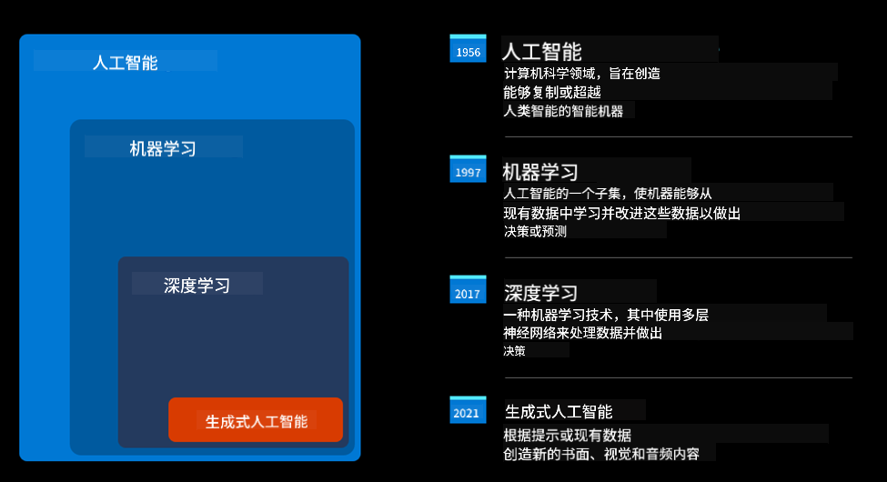
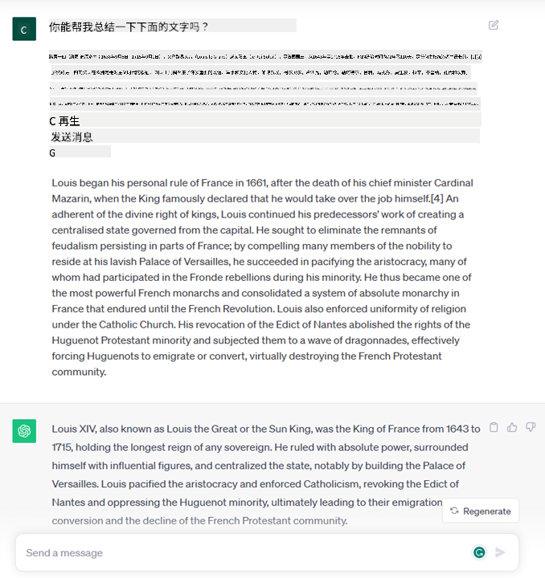
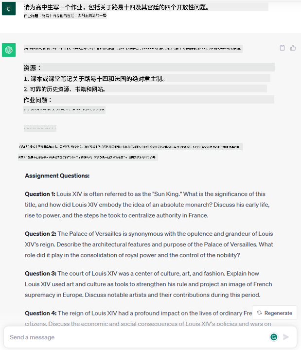
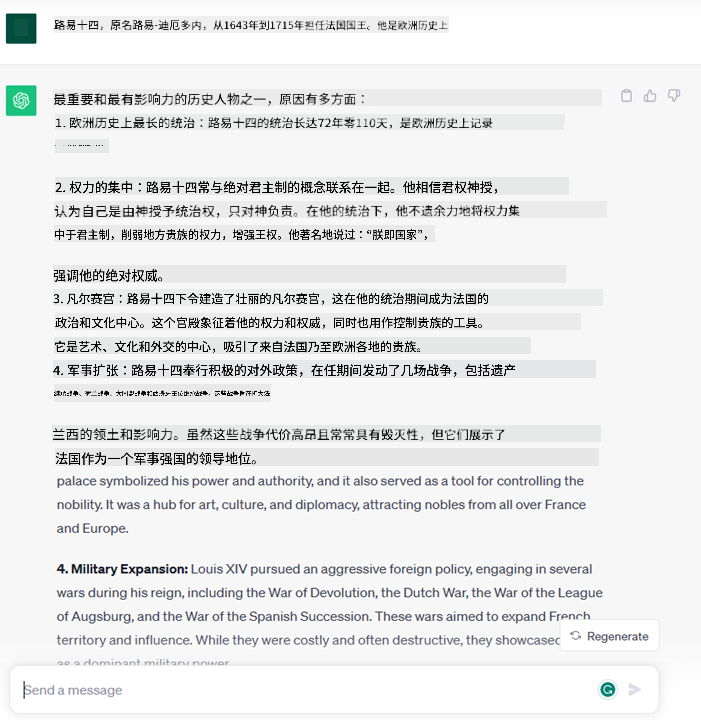
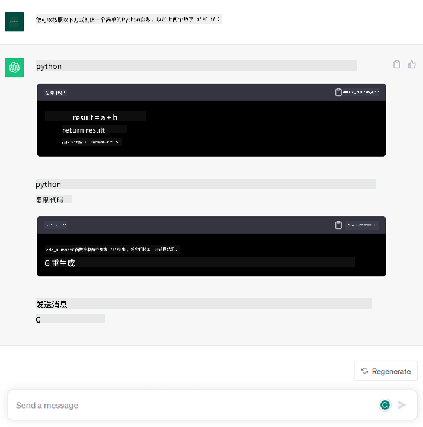

<!--
CO_OP_TRANSLATOR_METADATA:
{
  "original_hash": "f53ba0fa49164f9323043f1c6b11f2b1",
  "translation_date": "2025-05-19T09:11:32+00:00",
  "source_file": "01-introduction-to-genai/README.md",
  "language_code": "zh"
}
-->
# 生成式人工智能和大型语言模型简介

_（点击上方图片查看本课视频）_

生成式人工智能是一种能够生成文本、图像和其他类型内容的人工智能技术。其神奇之处在于它让人工智能变得普及，任何人都可以仅通过一个文本提示、用自然语言写的一句话来使用它。您不需要学习像Java或SQL这样的语言来实现有价值的事情，只需使用您的语言，说明您的需求，AI模型就会给出建议。其应用和影响巨大，您可以在几秒钟内撰写或理解报告、编写应用程序等等。

在本课程中，我们将探讨我们的创业公司如何利用生成式人工智能在教育领域解锁新场景，以及我们如何应对其应用的社会影响和技术限制所带来的不可避免的挑战。

## 介绍

本课将涵盖：

- 商业场景介绍：我们的创业想法和使命。
- 生成式人工智能及我们如何进入当前的技术领域。
- 大型语言模型的内部工作原理。
- 大型语言模型的主要能力和实际应用案例。

## 学习目标

完成本课后，您将了解：

- 什么是生成式人工智能以及大型语言模型如何工作。
- 如何利用大型语言模型应对不同的应用场景，重点是教育场景。

## 场景：我们的教育创业公司

生成式人工智能（AI）代表了人工智能技术的巅峰，突破了曾经被认为不可能的界限。生成式AI模型具有多种能力和应用，但在本课程中，我们将探讨它如何通过一个虚构的创业公司来革新教育。我们将其称为_我们的创业公司_。我们的创业公司在教育领域工作，抱有雄心勃勃的使命声明：

> _在全球范围内改善学习的可及性，确保教育的公平获取，并根据每个学习者的需求提供个性化的学习体验_。

我们的创业团队意识到，如果不利用现代最强大的工具之一——大型语言模型（LLM），我们将无法实现这一目标。

生成式人工智能预计将彻底改变我们今天的学习和教学方式，学生们可以随时获得虚拟教师提供的大量信息和示例，教师也可以利用创新工具评估学生并给予反馈。

首先，让我们定义一些我们将在整个课程中使用的基本概念和术语。

## 我们是如何获得生成式AI的？

尽管最近生成式AI模型的宣布引起了极大的_热潮_，但这项技术已经研发了数十年，最早的研究可以追溯到60年代。我们现在处于一个AI拥有类似人类认知能力的阶段，例如对话，如[OpenAI ChatGPT](https://openai.com/chatgpt)或[Bing Chat](https://www.microsoft.com/edge/features/bing-chat?WT.mc_id=academic-105485-koreyst)，它们也使用GPT模型进行网络搜索Bing对话。

回到过去，最早的AI原型是由打字聊天机器人组成的，依赖于从一组专家中提取的知识库并表示在计算机中。知识库中的答案是通过输入文本中出现的关键词来触发的。然而，很快就清楚了，这种使用打字聊天机器人的方法无法很好地扩展。

### AI的统计方法：机器学习

90年代，一个转折点到来，文本分析应用了统计方法。这导致了新算法的发展——即机器学习——能够从数据中学习模式而无需显式编程。这种方法使机器能够模拟人类语言理解：一个统计模型在文本-标签配对上进行训练，使模型能够用预定义的标签分类未知输入文本，代表信息的意图。

### 神经网络和现代虚拟助手

近年来，硬件技术的发展能够处理更大量的数据和更复杂的计算，推动了AI研究的发展，导致了高级机器学习算法的发展，被称为神经网络或深度学习算法。

神经网络（尤其是循环神经网络——RNNs）显著增强了自然语言处理，能够以更有意义的方式表示文本的含义，重视句子中单词的上下文。

这项技术推动了新世纪第一个十年诞生的虚拟助手，它们非常擅长理解人类语言，识别需求，并执行满足需求的动作——例如通过预定义的脚本回答或使用第三方服务。

### 现如今，生成式AI

这就是我们今天如何来到生成式AI，它可以看作是深度学习的一个子集。

经过数十年的AI领域研究，一种新的模型架构——称为_Transformer_——克服了RNNs的限制，能够接收更长的文本序列作为输入。Transformers基于注意力机制，使模型能够对接收到的输入赋予不同的权重，“更关注”最相关信息集中的地方，而不考虑它们在文本序列中的顺序。

大多数最近的生成式AI模型——也称为大型语言模型（LLM），因为它们处理文本输入和输出——确实基于这种架构。这些模型的有趣之处在于——它们在大量无标签的数据上进行训练，来自各种来源如书籍、文章和网站——它们可以适应多种任务，并生成语法正确且具有创造性的文本。因此，它们不仅极大地增强了机器“理解”输入文本的能力，还使其能够生成用人类语言表达的原创响应。

## 大型语言模型如何工作？

在下一章中，我们将探索不同类型的生成式AI模型，但现在让我们看看大型语言模型如何工作，重点是OpenAI GPT（生成预训练Transformer）模型。

- **分词器，文本转数字**：大型语言模型接收文本作为输入并生成文本作为输出。然而，作为统计模型，它们更擅长处理数字而非文本序列。这就是为什么每个输入在被核心模型使用之前都要经过分词器处理。一个token是文本的一个块——由可变数量的字符组成，因此分词器的主要任务是将输入拆分成token数组。然后，每个token与一个token索引映射，后者是原始文本块的整数编码。

- **预测输出token**：给定n个token作为输入（最大n因模型而异），模型能够预测一个token作为输出。然后，这个token被纳入下一次迭代的输入中，以扩展窗口模式进行，使用户体验更好，得到一个（或多个）句子作为答案。这解释了为什么，如果您曾玩过ChatGPT，您可能注意到有时它看起来像是在句子中间停下来。

- **选择过程，概率分布**：输出token由模型根据其在当前文本序列后出现的概率选择。这是因为模型根据其训练预测所有可能“下一个token”的概率分布。然而，并不总是从结果分布中选择概率最高的token。为了使模型以非确定性方式行动——我们不会每次都得到相同的输出——在这个选择中加入了一定程度的随机性。这个随机性程度通过称为温度的模型参数进行调节。

## 我们的创业公司如何利用大型语言模型？

现在我们对大型语言模型的内部工作原理有了更好的理解，让我们看看一些常见任务的实际例子，它们可以很好地执行，关注我们的商业场景。我们说大型语言模型的主要能力是_从头生成文本，从用自然语言写的文本输入开始_。

但是什么样的文本输入和输出？
大型语言模型的输入称为提示，而输出称为完成，这个术语指的是模型生成下一个token以完成当前输入的机制。我们将深入探讨什么是提示以及如何设计它以充分利用我们的模型。但现在，让我们简单说一下，一个提示可能包括：

- 一个**指令**，指定我们期望模型产生的输出类型。这个指令有时可能包含一些例子或一些额外的数据。

  1. 文章、书籍、产品评论等的总结，以及从非结构化数据中提取见解。
    
    
  
  2. 创意构思和文章、论文、作业等的设计。
      
     

- 一个**问题**，以与代理对话的形式提出。
  
  

- 一个需要**补全的文本块**，这隐含地请求写作协助。
  
  

- 一个**代码块**，以及请求解释和文档化，或一个要求生成执行特定任务的代码片段的注释。
  
  

上述示例相当简单，并不打算全面展示大型语言模型的能力。它们旨在展示使用生成式AI的潜力，尤其是在教育环境中，但不限于此。

此外，生成式AI模型的输出并不完美，有时模型的创造力可能适得其反，导致输出成为人类用户可以解释为现实扭曲的词语组合，或者可能具有冒犯性。生成式AI不具备智能——至少在更全面的智能定义中，包括批判性和创造性推理或情感智能；它不是确定性的，也不值得信赖，因为虚构内容，例如错误引用、内容和陈述，可能与正确信息结合，并以一种说服力和自信的方式呈现。在接下来的课程中，我们将处理所有这些限制，并看看我们可以做些什么来减轻它们。

## 作业

你的作业是更多地阅读[生成式AI](https://en.wikipedia.org/wiki/Generative_artificial_intelligence?WT.mc_id=academic-105485-koreyst)，并尝试找出一个今天还没有使用生成式AI的领域。与“旧方式”相比，影响会有何不同，你能做一些以前做不到的事情，或者你是否更快？写一篇300字的总结，描述你梦想的AI创业公司会是什么样子，并包括“问题”、“我将如何使用AI”、“影响”和可选的商业计划等标题。

如果你完成了这个任务，你甚至可能准备好申请微软的孵化器，[微软初创公司创始人中心](https://www.microsoft.com/startups?WT.mc_id=academic-105485-koreyst)，我们为Azure、OpenAI、指导等提供积分，快来看看吧！

## 知识检查

关于大型语言模型，哪些是正确的？

1. 每次都会得到完全相同的响应。
2. 它完美地做事情，非常擅长加法、生成工作代码等。
3. 尽管使用相同的提示，响应可能会有所不同。它也非常擅长给你一个初稿，无论是文本还是代码。但你需要改进结果。

A: 3，LLM是非确定性的，响应会有所不同，然而，你可以通过温度设置控制其变化。你也不应该期望它完美地做事情，它在这里为你做繁重的工作，这通常意味着你得到一个好的初步尝试，需要逐步改进。

## 干得好！继续学习之旅

完成本课后，请查看我们的[生成式AI学习集合](https://aka.ms/genai-collection?WT.mc_id=academic-105485-koreyst)，继续提升你的生成式AI知识！

前往第2课，我们将探讨如何[探索和比较不同的LLM类型](../02-exploring-and-comparing-different-llms/README.md?WT.mc_id=academic-105485-koreyst)！

**免责声明**：
本文档是使用AI翻译服务[Co-op Translator](https://github.com/Azure/co-op-translator)翻译的。虽然我们努力确保准确性，但请注意，自动翻译可能包含错误或不准确之处。应将原始文档的母语版本视为权威来源。对于关键信息，建议进行专业的人类翻译。我们不对因使用此翻译而产生的任何误解或误读负责。