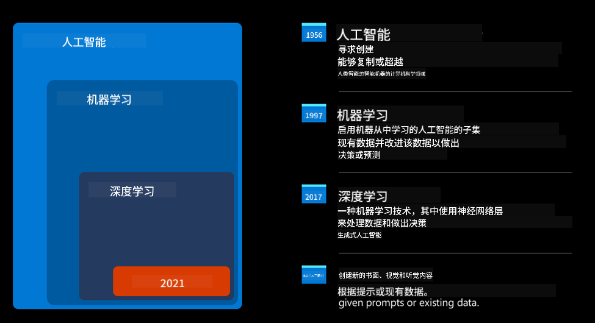
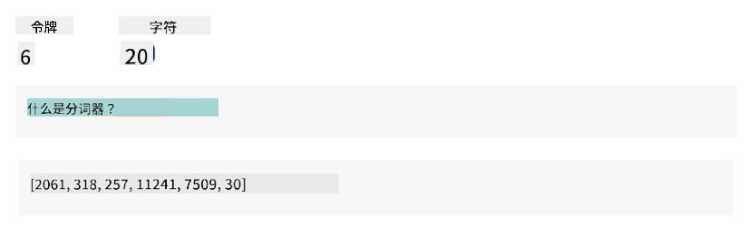
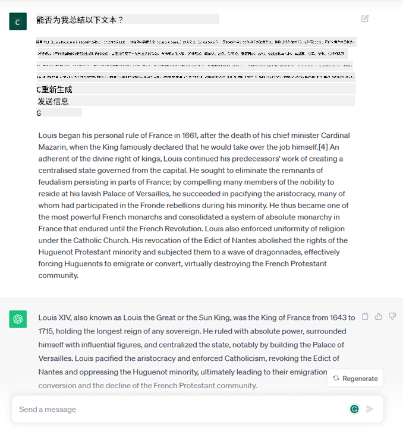
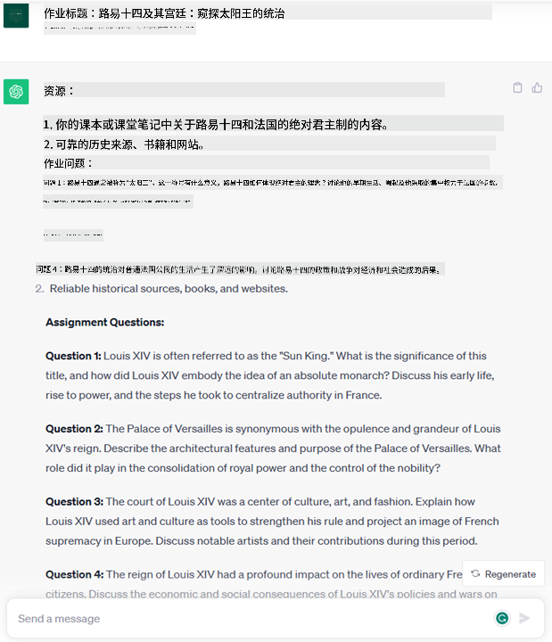
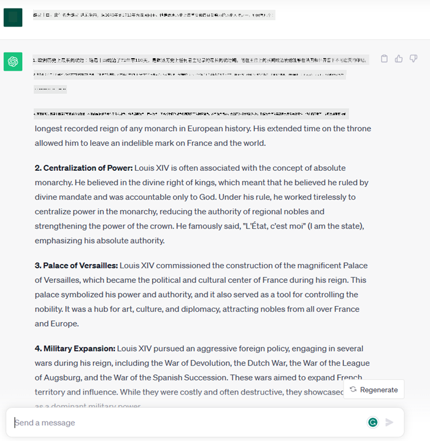
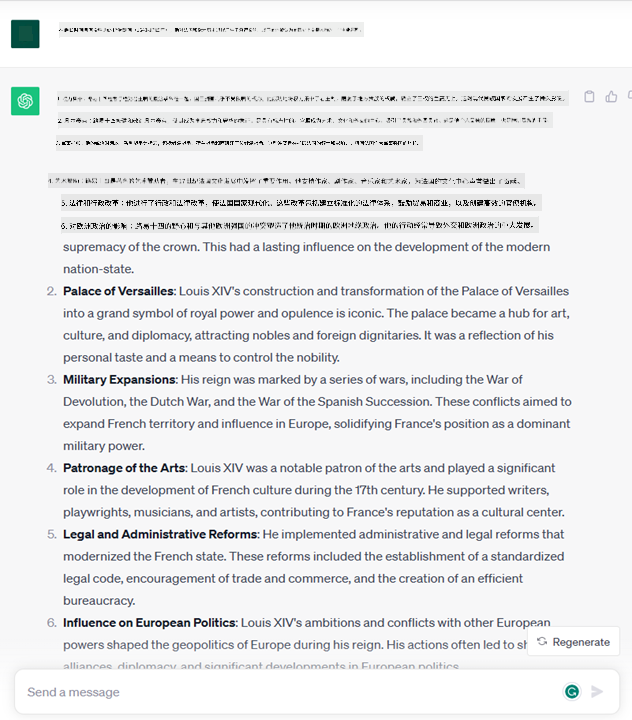
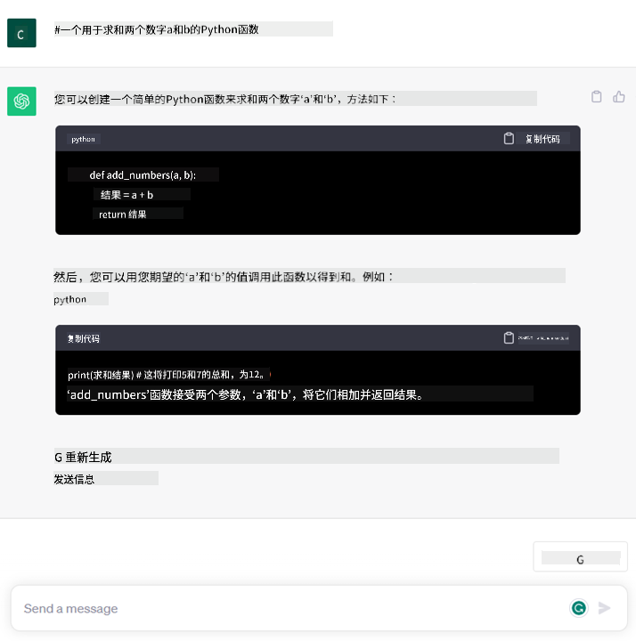

<!--
CO_OP_TRANSLATOR_METADATA:
{
  "original_hash": "f53ba0fa49164f9323043f1c6b11f2b1",
  "translation_date": "2025-06-25T09:39:47+00:00",
  "source_file": "01-introduction-to-genai/README.md",
  "language_code": "zh"
}
-->
# 生成式AI和大型语言模型简介

_(点击上面的图片查看本课的视频)_

生成式AI是一种能够生成文本、图像和其他类型内容的人工智能技术。它的奇妙之处在于它使得AI大众化，任何人只需一个文本提示，一个用自然语言写的句子就可以使用它。你无需学习Java或SQL这样的语言来实现有价值的事情，只需用你的语言表达你的需求，AI模型就会给出建议。其应用和影响巨大，您可以在几秒钟内撰写或理解报告、编写应用程序等等。

在本课程中，我们将探讨我们的初创公司如何利用生成式AI在教育领域中解锁新的场景，以及我们如何应对其应用的社会影响和技术限制所带来的不可避免的挑战。

## 简介

本课将涵盖：

- 商业场景介绍：我们的创业想法和使命。
- 生成式AI及我们如何进入当前的技术领域。
- 大型语言模型的内部运作。
- 大型语言模型的主要功能和实际应用案例。

## 学习目标

完成本课后，您将了解：

- 什么是生成式AI以及大型语言模型如何工作。
- 如何利用大型语言模型进行不同的应用，重点关注教育场景。

## 场景：我们的教育初创公司

生成式人工智能（AI）代表了AI技术的巅峰，推动了曾经被认为不可能的界限。生成式AI模型具有多种功能和应用，但在本课程中我们将探讨它如何通过一个虚构的初创公司来革新教育。我们将称这个初创公司为_我们的初创公司_。我们的初创公司在教育领域工作，其雄心勃勃的使命宣言是：

> _在全球范围内提高学习的可访问性，确保公平的教育机会，并根据每个学习者的需求提供个性化的学习体验_。

我们的初创公司团队意识到，若不利用现代最强大的工具之一——大型语言模型（LLM），我们将无法实现这一目标。

生成式AI预计将彻底改变我们今天的学习和教学方式，学生可以随时获得虚拟教师提供的大量信息和例子，教师可以利用创新工具来评估学生并提供反馈。

首先，让我们定义一些我们将在整个课程中使用的基本概念和术语。

## 我们是如何获得生成式AI的？

尽管最近生成式AI模型的宣布引发了非凡的_炒作_，但这项技术已经发展了几十年，最早的研究努力可以追溯到60年代。我们现在处于一个AI拥有类似人类认知能力的阶段，例如通过[OpenAI ChatGPT](https://openai.com/chatgpt)或[必应聊天](https://www.microsoft.com/edge/features/bing-chat?WT.mc_id=academic-105485-koreyst)展示的对话功能，后者也使用GPT模型进行网络搜索必应对话。

稍微回顾一下，最早的AI原型是由打字聊天机器人组成的，依赖于从一组专家提取的知识库并在计算机中表示。知识库中的答案通过输入文本中出现的关键词触发。然而，很快就发现这种使用打字聊天机器人的方法不能很好地扩展。

### AI的统计方法：机器学习

转折点出现在90年代，应用统计方法进行文本分析。这导致了新算法的开发——即机器学习——能够从数据中学习模式而无需明确编程。这种方法允许机器模拟人类语言理解：统计模型在文本标签配对上进行训练，使模型能够用预定义标签对未知输入文本进行分类，该标签代表消息的意图。

### 神经网络和现代虚拟助手

近年来，硬件技术的发展能够处理更大数据量和更复杂的计算，促进了AI研究，推动了高级机器学习算法的发展，即神经网络或深度学习算法。

神经网络（特别是循环神经网络 - RNNs）显著增强了自然语言处理，能够以更有意义的方式表示文本的含义，重视句子中单词的上下文。

这项技术推动了本世纪初诞生的虚拟助手，能够熟练地解释人类语言、识别需求并执行满足需求的动作——例如用预定义脚本回答或使用第三方服务。

### 现如今，生成式AI

这就是我们今天生成式AI的由来，它可以被视为深度学习的一个子集。

经过几十年的AI领域研究，一种新的模型架构——称为_Transformer_——克服了RNNs的限制，能够接受更长的文本序列作为输入。Transformers基于注意力机制，使模型能够对接收到的输入赋予不同权重，‘更加关注’最相关的信息集中处，而不考虑其在文本序列中的顺序。

最近的大多数生成式AI模型——也被称为大型语言模型（LLMs），因为它们处理文本输入和输出——确实基于这种架构。这些模型的有趣之处在于——它们经过大量未标记数据的训练，来源多样，如书籍、文章和网站——它们可以适应多种任务，并生成具有创造性倾向的语法正确的文本。因此，它们不仅极大地增强了机器‘理解’输入文本的能力，还使机器能够用人类语言生成原创响应。

## 大型语言模型如何工作？

在下一章中，我们将探讨不同类型的生成式AI模型，但现在让我们来看看大型语言模型如何工作，重点关注OpenAI GPT（生成预训练Transformer）模型。

- **分词器，文本转数字**：大型语言模型接收文本作为输入并生成文本作为输出。然而，作为统计模型，它们用数字比用文本序列工作得更好。这就是为什么每个输入在被核心模型使用之前都由分词器处理。一个token是一个文本块——由可变数量的字符组成，因此分词器的主要任务是将输入拆分为token数组。然后，每个token与一个token索引映射，这是原始文本块的整数编码。

- **预测输出token**：给定n个token作为输入（最大n因模型而异），模型能够预测一个token作为输出。这个token然后被合并到下一次迭代的输入中，以扩展窗口模式，使用户体验更好，得到一个（或多个）句子作为答案。这解释了为什么，如果您曾经玩过ChatGPT，您可能注意到有时它看起来像是在句子中间停下来。

- **选择过程，概率分布**：模型根据当前文本序列后发生的概率选择输出token。这是因为模型根据其训练预测所有可能‘下一个token’的概率分布。然而，并不总是从结果分布中选择概率最高的token。以一种模型非确定性行为的方式添加了一定程度的随机性——我们不会对相同输入得到完全相同的输出。这种随机性程度被添加来模拟创造性思维过程，可以通过一个称为温度的模型参数进行调整。

## 我们的初创公司如何利用大型语言模型？

现在我们对大型语言模型的内部工作有了更好的理解，让我们看看它们可以执行得非常好的最常见任务的一些实际例子，关注我们的商业场景。我们说大型语言模型的主要能力是_从头生成文本，从自然语言写的文本输入开始_。

但是什么样的文本输入和输出？
大型语言模型的输入被称为提示，而输出被称为完成，这个术语指的是生成下一个token以完成当前输入的模型机制。我们将深入探讨什么是提示以及如何设计提示以充分利用我们的模型。但现在，我们只说一个提示可能包括：

- 指定我们期望模型输出类型的**指令**。这个指令有时可能包含一些示例或一些附加数据。

  1. 文章、书籍、产品评论等的摘要，以及从非结构化数据中提取见解。
    
    
  
  2. 创意构思和设计文章、论文、作业等。
      
     

- 以与代理对话形式提出的**问题**。
  
  

- **待完成的文本块**，隐含的是请求写作帮助。
  
  

- 一段**代码**，要求解释和记录它，或者一条评论请求生成执行特定任务的代码片段。
  
  

以上示例相当简单，并不旨在全面展示大型语言模型的能力。它们旨在展示使用生成式AI的潜力，尤其是在但不限于教育背景下。

此外，生成式AI模型的输出并不完美，有时模型的创造性可能对其不利，导致输出是人类用户可以解释为现实扭曲或可能冒犯的词语组合。生成式AI不是智能的——至少在更全面的智能定义中，包括批判性和创造性推理或情感智能；它不是确定性的，也不是可信赖的，因为错误的引用、内容和陈述可能与正确的信息结合，并以令人信服和自信的方式呈现。在接下来的课程中，我们将处理所有这些限制，并看看我们可以做些什么来减轻它们。

## 作业

您的作业是更多地阅读[生成式AI](https://en.wikipedia.org/wiki/Generative_artificial_intelligence?WT.mc_id=academic-105485-koreyst)，并尝试识别一个您今天会添加生成式AI但没有的领域。与“旧方法”相比，影响会有什么不同，您能做些什么以前不能做的事情，或者您是否更快？写一个300字的总结，描述您的梦想AI初创公司会是什么样子，并包含标题如“问题”、“我将如何使用AI”、“影响”以及可选的商业计划。

如果您完成了这个任务，您甚至可能准备好申请微软的孵化器，[Microsoft for Startups Founders Hub](https://www.microsoft.com/startups?WT.mc_id=academic-105485-koreyst)，我们提供Azure、OpenAI、指导等方面的积分，快来看看吧！

## 知识检测

关于大型语言模型，什么是正确的？

1. 每次都会得到完全相同的响应。
1. 它完美无缺，擅长加法、生成可用代码等。
1. 尽管使用相同的提示，响应可能会有所不同。它也非常擅长给你一个初稿，无论是文本还是代码。但您需要改进结果。

A: 3，LLM是非确定性的，响应会有所不同，但您可以通过温度设置控制其变化。您也不应该期望它完美无缺，它在这里为您做繁重的工作，这通常意味着您得到的是一个好的初步尝试，您需要逐步改进。

## 干得好！继续旅程

完成本课后，查看我们的[生成式AI学习合集](https://aka.ms/genai-collection?WT.mc_id=academic-105485-koreyst)，继续提升您的生成式AI知识！

前往第二课，我们将探索如何[探索和比较不同的LLM类型](../02-exploring-and-comparing-different-llms/README.md?WT.mc_id=academic-105485-koreyst)！

**免责声明**：  
本文档使用AI翻译服务[Co-op Translator](https://github.com/Azure/co-op-translator)进行翻译。虽然我们努力确保准确性，但请注意，自动翻译可能包含错误或不准确之处。应将原始语言的文档视为权威来源。对于关键信息，建议进行专业人工翻译。对于因使用此翻译而产生的任何误解或误释，我们不承担责任。