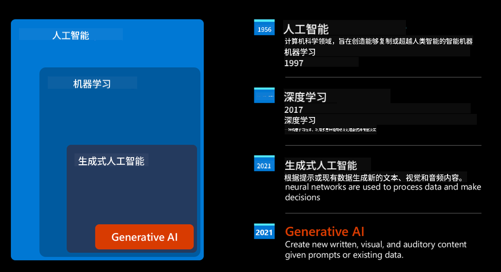
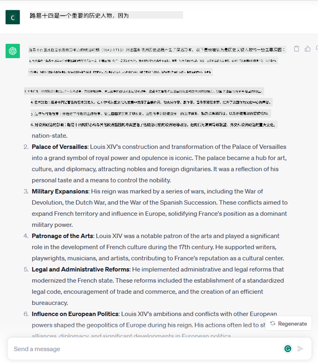
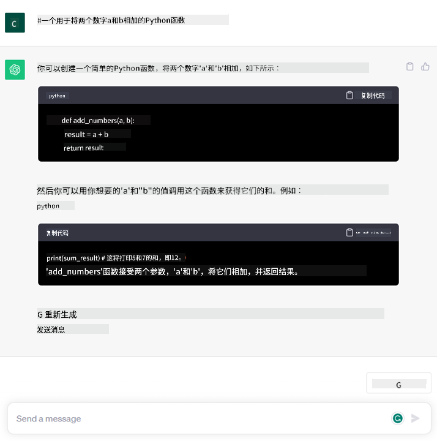

<!--
CO_OP_TRANSLATOR_METADATA:
{
  "original_hash": "f53ba0fa49164f9323043f1c6b11f2b1",
  "translation_date": "2025-07-09T07:44:01+00:00",
  "source_file": "01-introduction-to-genai/README.md",
  "language_code": "zh"
}
-->
# 生成式人工智能与大型语言模型简介

_(点击上方图片观看本课视频)_

生成式人工智能是一种能够生成文本、图像及其他类型内容的人工智能技术。它的魅力在于让人工智能变得大众化，任何人只需输入一段自然语言的文本提示，就能使用它。你无需学习Java或SQL等编程语言，只需用自己的语言表达需求，AI模型便会给出建议。它的应用和影响非常广泛，你可以在几秒钟内完成报告撰写、理解、应用开发等多种任务。

在本课程中，我们将探讨我们的创业公司如何利用生成式AI开拓教育领域的新场景，以及如何应对其应用带来的社会影响和技术限制等不可避免的挑战。

## 介绍

本课内容包括：

- 业务场景介绍：我们的创业想法和使命。
- 生成式AI及当前技术格局的形成。
- 大型语言模型的内部工作原理。
- 大型语言模型的主要能力及实际应用案例。

## 学习目标

完成本课后，你将了解：

- 什么是生成式AI以及大型语言模型的工作原理。
- 如何利用大型语言模型实现不同的应用场景，重点关注教育领域。

## 场景：我们的教育创业公司

生成式人工智能代表了AI技术的巅峰，突破了曾被认为不可能的界限。生成式AI模型具备多种能力和应用，但在本课程中，我们将通过一个虚构的创业公司来探讨它如何革新教育。我们称之为_我们的创业公司_。该公司专注于教育领域，怀揣着宏大的使命：

> _提升全球学习的可及性，确保教育公平，并根据每个学习者的需求提供个性化学习体验。_

我们的团队深知，若不借助现代最强大的工具之一——大型语言模型（LLMs），这一目标难以实现。

生成式AI有望彻底改变我们今天的学习和教学方式，学生可以全天候获得虚拟教师的支持，获取大量信息和示例，教师则能利用创新工具评估学生并提供反馈。

首先，让我们定义一些将在课程中反复使用的基本概念和术语。

## 生成式AI是如何诞生的？

尽管生成式AI模型最近引发了极大的_热潮_，但这项技术已有数十年历史，最早的研究可追溯到60年代。如今，AI已具备类似人类认知的能力，比如对话，正如[OpenAI ChatGPT](https://openai.com/chatgpt)或[Bing Chat](https://www.microsoft.com/edge/features/bing-chat?WT.mc_id=academic-105485-koreyst)所展示的，后者也使用了GPT模型来支持Bing搜索的对话功能。

回顾早期，最初的AI原型是基于打字机式聊天机器人，依赖从专家组提取并存储在计算机中的知识库。知识库中的答案通过输入文本中的关键词触发。然而，很快发现这种基于打字机式聊天机器人的方法难以扩展。

### 统计学方法：机器学习

90年代，文本分析引入了统计学方法，成为转折点。这催生了机器学习算法，能够从数据中学习模式，而无需显式编程。该方法使机器能够模拟人类语言理解：通过训练文本与标签的配对，模型可以对未知输入文本进行分类，标签代表信息的意图。

### 神经网络与现代虚拟助手

近年来，硬件技术的发展使得处理更大数据量和更复杂计算成为可能，推动了AI研究，催生了先进的机器学习算法——神经网络或深度学习算法。

神经网络（尤其是循环神经网络RNN）极大提升了自然语言处理能力，使文本意义的表达更具语境相关性，重视句中词语的上下文。

这项技术支撑了21世纪初诞生的虚拟助手，它们能精准理解人类语言，识别需求，并执行相应操作——如用预设脚本回答或调用第三方服务。

### 现今的生成式AI

这就是我们今天所说的生成式AI的由来，它可以看作是深度学习的一个子集。

经过数十年的AI研究，一种名为_Transformer_的新模型架构突破了RNN的限制，能够处理更长的文本序列。Transformer基于注意力机制，使模型能对输入信息赋予不同权重，“关注”最相关的信息，无论其在文本序列中的位置。

大多数近期的生成式AI模型——也称为大型语言模型（LLMs），因其处理文本输入和输出——均基于此架构。这些模型在海量未标注数据（如书籍、文章和网站）上训练，能适应多种任务，生成语法正确且富有创造性的文本。它们不仅极大提升了机器“理解”文本的能力，还能用人类语言生成原创回应。

## 大型语言模型如何工作？

下一章我们将探讨不同类型的生成式AI模型，但现在先了解大型语言模型的工作原理，重点关注OpenAI的GPT（生成式预训练Transformer）模型。

- **分词器，将文本转为数字**：大型语言模型以文本作为输入并生成文本输出。但作为统计模型，它们更擅长处理数字而非文本序列。因此，模型接收的每个输入都会先经过分词器处理。一个token是文本的一个片段，包含可变数量的字符，分词器的主要任务是将输入拆分成token数组。然后，每个token会映射为一个token索引，即原始文本片段的整数编码。

- **预测输出token**：给定n个token作为输入（最大n值因模型而异），模型能预测下一个token作为输出。该token随后被加入下一轮输入，形成扩展窗口模式，提升用户体验，使其能获得一句或多句连贯回答。这也解释了为什么使用ChatGPT时，有时它会在句中突然停止。

- **选择过程，概率分布**：模型根据当前文本序列后续token出现的概率分布选择输出token。模型预测所有可能“下一个token”的概率分布，基于训练结果计算。然而，输出token不总是概率最高的那个。模型会引入一定随机性，使其行为非确定性——同一输入不一定得到完全相同的输出。这种随机性模拟创造性思维过程，可通过名为temperature的参数调节。

## 我们的创业公司如何利用大型语言模型？

了解了大型语言模型的内部工作后，让我们看看它们在实际业务场景中的常见应用。大型语言模型的主要能力是_从零开始生成文本，基于自然语言的文本输入_。

那么，输入和输出是什么样的文本呢？大型语言模型的输入称为prompt（提示），输出称为completion（完成），指模型生成下一个token以补全当前输入的机制。我们将深入探讨prompt的设计方法，以最大化模型的效用。现在先简单介绍，prompt可能包括：

- 一个**指令**，说明我们期望模型输出的类型。指令有时会包含示例或额外数据。

  1. 对文章、书籍、产品评论等进行摘要，并从非结构化数据中提取洞见。
    
    
  
  2. 创意构思与设计文章、论文、作业等。
      
     

- 一个**问题**，以与代理对话的形式提出。
  
  

- 一段**待补全文本**，隐含请求写作辅助。
  
  

- 一段**代码**，并请求解释和注释，或要求生成执行特定任务的代码片段。
  
  

以上示例较为简单，非大型语言模型能力的全面展示，旨在展示生成式AI的潜力，尤其是在教育领域的应用。

此外，生成式AI的输出并非完美，有时模型的创造力反而带来负面效果，生成的内容可能被用户解读为对现实的误导，甚至带有冒犯性。生成式AI并非真正智能——至少不具备包括批判性和创造性推理或情感智能在内的广义智能；它非确定性且不完全可信，因其可能将错误的引用、内容和陈述与正确信息混合，并以自信的方式呈现。在后续课程中，我们将探讨这些局限，并学习如何减轻其影响。

## 任务

请阅读更多关于[生成式AI](https://en.wikipedia.org/wiki/Generative_artificial_intelligence?WT.mc_id=academic-105485-koreyst)的资料，尝试找出一个目前尚未应用生成式AI的领域。思考如果用生成式AI替代传统方式，影响会有哪些不同？你能做以前做不到的事，还是能更快完成任务？写一篇300字的总结，描述你理想中的AI创业公司，包含标题如“问题”、“我如何使用AI”、“影响”，以及可选的商业计划。

完成此任务后，你甚至可以申请微软的孵化器，[Microsoft for Startups Founders Hub](https://www.microsoft.com/startups?WT.mc_id=academic-105485-koreyst)，我们提供Azure、OpenAI、导师指导等多种资源，欢迎了解！

## 知识检测

关于大型语言模型，以下哪项正确？

1. 每次都会得到完全相同的回答。  
2. 它能完美执行任务，比如加法、生成可运行代码等。  
3. 即使使用相同的提示，回答也可能不同。它擅长给出文本或代码的初稿，但你需要对结果进行改进。

答案：3。大型语言模型是非确定性的，回答会有所不同，但你可以通过temperature参数控制其变化程度。你也不应期望它完美无缺，它的作用是帮你完成繁重工作，通常能给出一个不错的初稿，之后你再逐步完善。

## 干得好！继续前进

完成本课后，欢迎访问我们的[生成式AI学习合集](https://aka.ms/genai-collection?WT.mc_id=academic-105485-koreyst)，继续提升你的生成式AI知识！
前往第2课，我们将学习如何[探索和比较不同类型的LLM](../02-exploring-and-comparing-different-llms/README.md?WT.mc_id=academic-105485-koreyst)！

**免责声明**：  
本文件使用 AI 翻译服务 [Co-op Translator](https://github.com/Azure/co-op-translator) 进行翻译。虽然我们力求准确，但请注意，自动翻译可能包含错误或不准确之处。原始文件的母语版本应被视为权威来源。对于重要信息，建议采用专业人工翻译。对于因使用本翻译而产生的任何误解或误释，我们不承担任何责任。