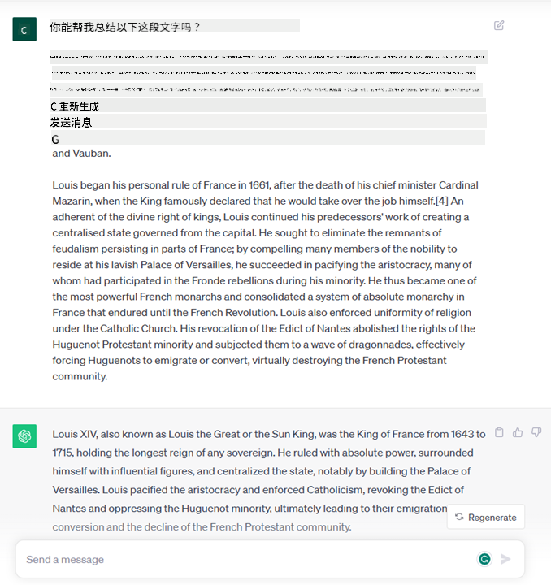
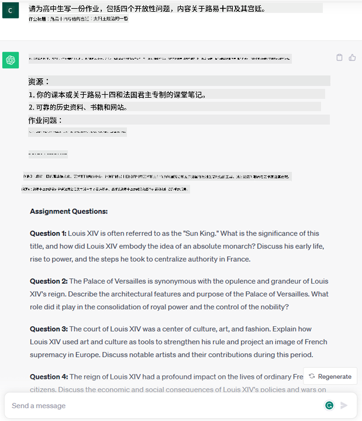
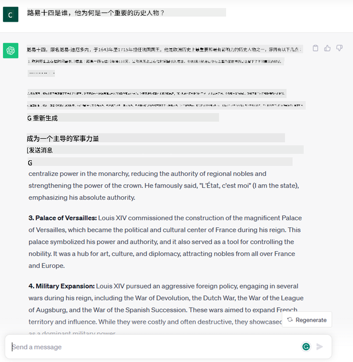

<!--
CO_OP_TRANSLATOR_METADATA:
{
  "original_hash": "bfb7901bdbece1ba3e9f35c400ca33e8",
  "translation_date": "2025-10-17T23:25:32+00:00",
  "source_file": "01-introduction-to-genai/README.md",
  "language_code": "zh"
}
-->
# 生成式人工智能和大型语言模型简介

_（点击上方图片观看本课视频）_

生成式人工智能是一种能够生成文本、图像及其他类型内容的人工智能技术。它的神奇之处在于，它让人工智能变得更加普及，任何人只需输入一个文本提示，即用自然语言写的一句话，就可以使用它。你不需要学习像Java或SQL这样的编程语言来完成有价值的事情，只需用自己的语言表达需求，人工智能模型就会给出建议。它的应用和影响是巨大的，你可以在几秒钟内撰写或理解报告、编写应用程序等等。

在本课程中，我们将探讨我们的初创公司如何利用生成式人工智能在教育领域解锁新的场景，以及我们如何应对其应用的社会影响和技术局限性所带来的不可避免的挑战。

## 介绍

本课将涵盖以下内容：

- 业务场景介绍：我们的初创公司理念和使命。
- 生成式人工智能及其在当前技术领域中的发展。
- 大型语言模型的内部工作原理。
- 大型语言模型的主要功能和实际应用场景。

## 学习目标

完成本课后，你将了解：

- 什么是生成式人工智能以及大型语言模型的工作原理。
- 如何利用大型语言模型实现不同的应用场景，特别是教育领域的应用。

## 场景：我们的教育初创公司

生成式人工智能（AI）代表了人工智能技术的巅峰，突破了曾经被认为不可能的界限。生成式人工智能模型具有多种功能和应用，但在本课程中，我们将通过一个虚构的初创公司来探讨它如何革新教育领域。我们将这个初创公司称为_我们的初创公司_。我们的初创公司致力于教育领域，拥有一个雄心勃勃的使命声明：

> _在全球范围内提高学习的可及性，确保教育的公平获取，并根据每个学习者的需求提供个性化的学习体验。_

我们的初创公司团队深知，如果不利用现代最强大的工具之一——大型语言模型（LLMs），我们将无法实现这一目标。

生成式人工智能有望彻底改变我们今天的学习和教学方式，学生可以随时随地通过虚拟教师获取大量信息和示例，而教师则可以利用创新工具评估学生并提供反馈。

首先，让我们定义一些将在整个课程中使用的基本概念和术语。

## 生成式人工智能是如何诞生的？

尽管最近生成式人工智能模型的发布引发了极大的_热潮_，但这项技术的研发已经历了数十年的时间，最早的研究可以追溯到20世纪60年代。如今，人工智能已经具备了类似人类的认知能力，例如对话功能，这可以通过 [OpenAI ChatGPT](https://openai.com/chatgpt) 或 [Bing Chat](https://www.microsoft.com/edge/features/bing-chat?WT.mc_id=academic-105485-koreyst) 等工具得以体现，后者也使用了GPT模型进行Bing搜索对话。

回顾一下，最早的人工智能原型是基于文本输入的聊天机器人，它们依赖于从专家组中提取的知识库，并将其表示为计算机可读的形式。知识库中的答案是通过输入文本中出现的关键词触发的。然而，很快就发现这种基于文本输入的聊天机器人方法并不具备良好的扩展性。

### 人工智能的统计方法：机器学习

转折点出现在20世纪90年代，当时统计方法被应用于文本分析。这促成了新算法的发展——即所谓的机器学习算法，它们能够从数据中学习模式，而无需明确编程。这种方法使机器能够模拟人类的语言理解：通过在文本和标签配对上训练统计模型，使其能够根据预定义的标签对未知输入文本进行分类。

### 神经网络和现代虚拟助手

近年来，硬件技术的进步使得处理更大规模的数据和更复杂的计算成为可能，这推动了人工智能领域的研究，催生了被称为神经网络或深度学习算法的先进机器学习算法。

神经网络（特别是循环神经网络——RNNs）显著提升了自然语言处理的能力，使得文本含义的表示更加有意义，能够更好地理解句子中单词的上下文。

这种技术推动了21世纪初诞生的虚拟助手的发展，这些助手非常擅长理解人类语言，识别需求，并采取行动满足需求——例如通过预定义的脚本回答问题或调用第三方服务。

### 现如今，生成式人工智能

这就是我们如何发展到今天的生成式人工智能，它可以被视为深度学习的一个子集。

经过数十年的人工智能领域研究，一种名为_Transformer_的新型模型架构克服了RNN的局限性，能够接受更长的文本序列作为输入。Transformer基于注意力机制，使模型能够对接收到的输入赋予不同的权重，“更加关注”文本序列中最相关的信息，而不受其顺序的影响。

大多数最近的生成式人工智能模型——也被称为大型语言模型（LLMs），因为它们处理的是文本输入和输出——实际上都是基于这种架构。这些模型的有趣之处在于，它们通过从书籍、文章和网站等多种来源的大量未标注数据中进行训练，可以适应各种任务，并生成语法正确且具有一定创造性的文本。因此，它们不仅极大地增强了机器“理解”输入文本的能力，还使其能够用人类语言生成原创的回答。

## 大型语言模型是如何工作的？

在下一章中，我们将探讨不同类型的生成式人工智能模型，但现在让我们先了解一下大型语言模型的工作原理，重点是OpenAI的GPT（生成式预训练Transformer）模型。

- **分词器，将文本转化为数字**：大型语言模型接收文本作为输入，并生成文本作为输出。然而，作为统计模型，它们处理数字比处理文本序列更为高效。这就是为什么模型在使用核心模型之前，每个输入都需要通过分词器处理。一个token是一个文本片段——由可变数量的字符组成，因此分词器的主要任务是将输入分割成一个个token数组。然后，每个token会被映射为一个token索引，即原始文本片段的整数编码。

- **预测输出token**：给定n个输入token（每个模型的最大n值不同），模型能够预测一个输出token。然后，这个token会被纳入下一次迭代的输入中，以扩展窗口的模式运行，从而提供更好的用户体验，生成一个（或多个）句子作为回答。这也解释了为什么如果你曾使用过ChatGPT，可能会注意到有时它会在句子中途停止。

- **选择过程，概率分布**：输出的token是根据其在当前文本序列之后出现的概率由模型选择的。这是因为模型基于其训练数据预测了所有可能“下一个token”的概率分布。然而，模型并不总是从结果分布中选择概率最高的token。为了模拟创造性思维的过程，选择中加入了一定程度的随机性，这种随机性可以通过一个名为温度的模型参数进行调整。

## 我们的初创公司如何利用大型语言模型？

现在我们对大型语言模型的内部工作原理有了更好的了解，让我们看看它们可以很好地执行的一些常见任务的实际示例，并结合我们的业务场景进行探讨。我们提到，大型语言模型的主要功能是_从零生成文本，从用自然语言编写的文本输入开始_。

但是什么样的文本输入和输出呢？  
大型语言模型的输入被称为提示（prompt），而输出被称为完成（completion），这个术语指的是模型通过生成下一个token来完成当前输入的机制。我们将在后续内容中深入探讨什么是提示以及如何设计提示以充分利用我们的模型。但现在，我们可以简单地说，提示可能包括：

- **指令**，指定我们期望模型生成的输出类型。这些指令有时可能包含一些示例或额外数据。

  1. 文章、书籍、产品评论等的摘要，以及从非结构化数据中提取见解。
    
    
  
  2. 创意构思和设计文章、论文、作业等。
      
     

- **问题**，以与代理对话的形式提出。
  
  

- 一段需要**补全的文本**，这隐含了对写作辅助的需求。
  
  

- 一段**代码**，同时要求解释和记录，或者一条要求生成执行特定任务代码的注释。
  
  

以上示例相对简单，并非旨在全面展示大型语言模型的能力。它们的目的是展示生成式人工智能的潜力，特别是在教育领域的应用，但不限于此。

此外，生成式人工智能模型的输出并不完美，有时模型的创造性可能适得其反，导致输出是人类用户可能解读为现实扭曲的词语组合，或者可能具有冒犯性。生成式人工智能并不智能——至少在更全面的智能定义中，包括批判性和创造性推理或情感智能；它不是确定性的，也不完全可信，因为错误的引用、内容和陈述可能与正确的信息混合在一起，并以一种令人信服和自信的方式呈现。在接下来的课程中，我们将处理所有这些局限性，并探讨如何减轻它们的影响。

## 作业

你的作业是进一步阅读关于[生成式人工智能](https://en.wikipedia.org/wiki/Generative_artificial_intelligence?WT.mc_id=academic-105485-koreyst)的内容，并尝试识别一个目前尚未应用生成式人工智能的领域，思考如何将其应用到该领域。与传统方式相比，影响会有何不同？你是否能够实现以前无法做到的事情，或者是否更高效？撰写一篇300字的总结，描述你梦想中的人工智能初创公司，并包括以下标题：“问题”、“我将如何使用人工智能”、“影响”，以及可选的“商业计划”。

如果你完成了这项任务，你甚至可以考虑申请微软的孵化器项目，[Microsoft for Startups Founders Hub](https://www.microsoft.com/startups?WT.mc_id=academic-105485-koreyst)。我们为Azure、OpenAI、指导等提供支持，快来了解更多吧！

## 知识检查

关于大型语言模型，以下哪些是正确的？

1. 每次都会得到完全相同的回答。  
2. 它能完美地完成任务，非常擅长计算、生成可用代码等。  
3. 回答可能会因相同的提示而有所不同。它也非常擅长为你提供某些内容的初稿，无论是文本还是代码。但你需要对结果进行改进。

答案：3，大型语言模型是非确定性的，回答会有所变化，但你可以通过调整温度设置来控制其变化程度。同时，你不应期望它能完美完成任务，它的作用是为你完成繁重的工作，通常意味着你会得到一个不错的初稿，然后需要逐步改进。

## 干得好！继续学习之旅

完成本课后，请查看我们的[生成式人工智能学习合集](https://aka.ms/genai-collection?WT.mc_id=academic-105485-koreyst)，继续提升你的生成式人工智能知识！
前往第2课，我们将学习如何[探索和比较不同类型的LLM](../02-exploring-and-comparing-different-llms/README.md?WT.mc_id=academic-105485-koreyst)!

---

**免责声明**：  
本文档使用AI翻译服务[Co-op Translator](https://github.com/Azure/co-op-translator)进行翻译。尽管我们努力确保翻译的准确性，但请注意，自动翻译可能包含错误或不准确之处。原始语言的文档应被视为权威来源。对于重要信息，建议使用专业人工翻译。我们不对因使用此翻译而产生的任何误解或误读承担责任。