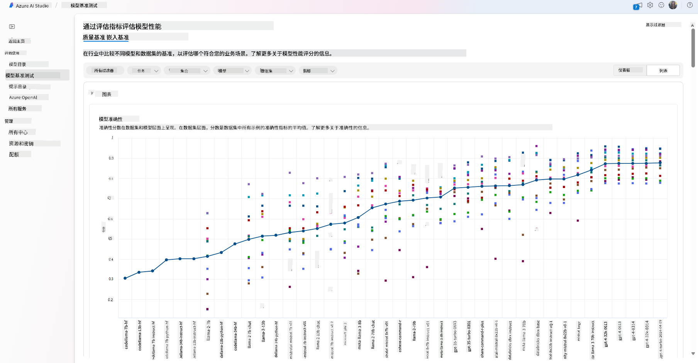
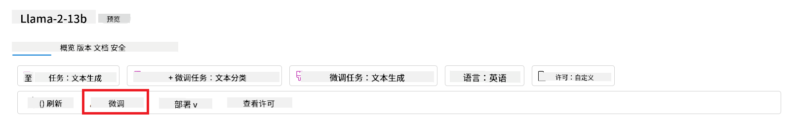
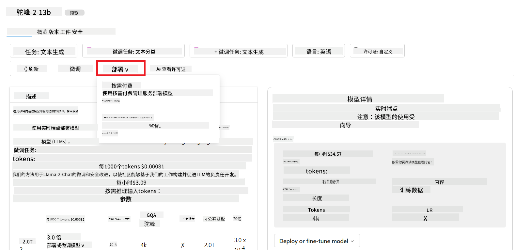
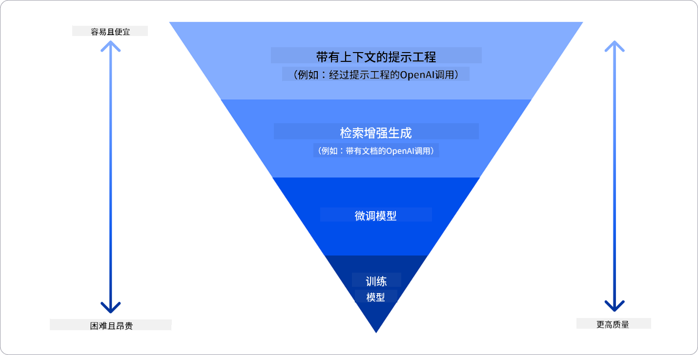

<!--
CO_OP_TRANSLATOR_METADATA:
{
  "original_hash": "e2f686f2eb794941761252ac5e8e090b",
  "translation_date": "2025-05-19T09:20:33+00:00",
  "source_file": "02-exploring-and-comparing-different-llms/README.md",
  "language_code": "zh"
}
-->
# 探索和比较不同的LLM

> _点击上方图片观看本课视频_

在上一课中，我们了解了生成式AI如何改变技术格局，了解了大型语言模型（LLM）是如何工作的，以及像我们这样的初创企业如何将其应用于业务场景并实现增长！在本章中，我们将比较和对比不同类型的大型语言模型（LLM），以理解它们的优缺点。

我们初创企业的下一步是探索当前的LLM格局，并理解哪些适合我们的用例。

## 介绍

本课将涵盖：

- 当前格局中不同类型的LLM。
- 在Azure中测试、迭代和比较不同模型以适应您的用例。
- 如何部署LLM。

## 学习目标

完成本课后，您将能够：

- 为您的用例选择合适的模型。
- 理解如何测试、迭代和提高模型的性能。
- 了解企业如何部署模型。

## 了解不同类型的LLM

LLM可以根据其架构、训练数据和用例进行多种分类。理解这些差异将帮助我们的初创企业为特定场景选择合适的模型，并理解如何测试、迭代和提高性能。

有很多不同类型的LLM模型，您选择的模型取决于您打算如何使用它们、您的数据、您愿意支付的金额等等。

根据您打算将模型用于文本、音频、视频、图像生成等，您可能会选择不同类型的模型。

- **音频和语音识别**。对于这个目的，Whisper类型的模型是一个很好的选择，因为它们是通用的，旨在进行语音识别。它们在多样的音频上进行训练，能够执行多语言语音识别。了解更多关于[Whisper类型模型](https://platform.openai.com/docs/models/whisper?WT.mc_id=academic-105485-koreyst)的信息。

- **图像生成**。对于图像生成，DALL-E和Midjourney是两个非常知名的选择。DALL-E由Azure OpenAI提供。[在此阅读更多关于DALL-E的信息](https://platform.openai.com/docs/models/dall-e?WT.mc_id=academic-105485-koreyst)以及本课程的第9章。

- **文本生成**。大多数模型都是针对文本生成进行训练的，您有多种选择，从GPT-3.5到GPT-4。它们的成本不同，GPT-4是最昂贵的。值得在[Azure OpenAI playground](https://oai.azure.com/portal/playground?WT.mc_id=academic-105485-koreyst)中评估哪些模型在能力和成本方面最适合您的需求。

- **多模态**。如果您希望在输入和输出中处理多种类型的数据，您可能需要查看诸如[gpt-4 turbo with vision or gpt-4o](https://learn.microsoft.com/azure/ai-services/openai/concepts/models#gpt-4-and-gpt-4-turbo-models?WT.mc_id=academic-105485-koreyst)这样的模型——OpenAI模型的最新版本——它们能够将自然语言处理与视觉理解结合在一起，从而通过多模态接口进行交互。

选择一个模型意味着您获得了一些基本功能，但这可能还不够。通常，您有一些公司特定的数据，您需要以某种方式告诉LLM。关于如何处理这一点，有几种不同的选择，更多内容将在接下来的章节中介绍。

### 基础模型与LLM

基础模型这一术语由[斯坦福大学研究人员提出](https://arxiv.org/abs/2108.07258?WT.mc_id=academic-105485-koreyst)，定义为符合某些标准的AI模型，例如：

- **它们是通过无监督学习或自监督学习训练的**，这意味着它们是在未标记的多模态数据上进行训练的，不需要人工注释或标记数据进行训练。
- **它们是非常大的模型**，基于非常深的神经网络，在数十亿参数上进行训练。
- **它们通常被设计为其他模型的“基础”**，这意味着它们可以作为其他模型的起点，其他模型可以在其基础上构建，这可以通过微调来实现。

为了进一步澄清这一区别，让我们以ChatGPT为例。为了构建ChatGPT的第一个版本，一个名为GPT-3.5的模型作为基础模型。这意味着OpenAI使用了一些聊天特定的数据来创建一个专门用于对话场景（如聊天机器人）的GPT-3.5的调优版本。

### 开源模型与专有模型

另一种对LLM进行分类的方法是看它们是开源的还是专有的。

开源模型是公开提供给公众的，任何人都可以使用的模型。它们通常由创建它们的公司或研究社区提供。这些模型可以被检查、修改和定制，以适应LLM中的各种用例。然而，它们并不总是为生产使用进行优化，性能可能不如专有模型。此外，开源模型的资金可能有限，可能不会长期维护或更新最新的研究。流行的开源模型包括[Alpaca](https://crfm.stanford.edu/2023/03/13/alpaca.html?WT.mc_id=academic-105485-koreyst)、[Bloom](https://huggingface.co/bigscience/bloom)和[LLaMA](https://llama.meta.com)。

专有模型是由公司拥有的模型，不公开提供给公众。这些模型通常为生产使用进行了优化。然而，它们不能被检查、修改或定制以适应不同的用例。此外，它们不总是免费提供的，可能需要订阅或付费使用。此外，用户无法控制用于训练模型的数据，这意味着他们需要信任模型所有者确保数据隐私和负责任的AI使用。流行的专有模型包括[OpenAI模型](https://platform.openai.com/docs/models/overview?WT.mc_id=academic-105485-koreyst)、[Google Bard](https://sapling.ai/llm/bard?WT.mc_id=academic-105485-koreyst)或[Claude 2](https://www.anthropic.com/index/claude-2?WT.mc_id=academic-105485-koreyst)。

### 嵌入与图像生成与文本和代码生成

LLM还可以根据其生成的输出进行分类。

嵌入是一组模型，可以将文本转换为数值形式，称为嵌入，这是输入文本的数值表示。嵌入使机器更容易理解单词或句子之间的关系，并且可以作为其他模型的输入，如分类模型或在数值数据上表现更好的聚类模型。嵌入模型通常用于迁移学习，即为数据丰富的替代任务构建模型，然后将模型权重（嵌入）重新用于其他下游任务。此类别的一个例子是[OpenAI嵌入](https://platform.openai.com/docs/models/embeddings?WT.mc_id=academic-105485-koreyst)。

图像生成模型是生成图像的模型。这些模型通常用于图像编辑、图像合成和图像翻译。图像生成模型通常在大型图像数据集上进行训练，如[LAION-5B](https://laion.ai/blog/laion-5b/?WT.mc_id=academic-105485-koreyst)，可以用于生成新图像或使用修补、超分辨率和上色技术编辑现有图像。示例包括[DALL-E-3](https://openai.com/dall-e-3?WT.mc_id=academic-105485-koreyst)和[Stable Diffusion模型](https://github.com/Stability-AI/StableDiffusion?WT.mc_id=academic-105485-koreyst)。

文本和代码生成模型是生成文本或代码的模型。这些模型通常用于文本摘要、翻译和问答。文本生成模型通常在大型文本数据集上进行训练，如[BookCorpus](https://www.cv-foundation.org/openaccess/content_iccv_2015/html/Zhu_Aligning_Books_and_ICCV_2015_paper.html?WT.mc_id=academic-105485-koreyst)，可以用于生成新文本或回答问题。代码生成模型，如[CodeParrot](https://huggingface.co/codeparrot?WT.mc_id=academic-105485-koreyst)，通常在大型代码数据集上进行训练，如GitHub，可以用于生成新代码或修复现有代码中的错误。

### 编码器-解码器与仅解码器

要讨论LLM的不同架构类型，让我们用一个比喻。

想象一下，您的经理给您布置了一个为学生编写测验的任务。您有两个同事；一个负责创建内容，另一个负责审核。

内容创作者就像一个仅解码器模型，他们可以查看主题，看看您已经写了什么，然后根据这些写出课程。他们非常擅长编写引人入胜且信息丰富的内容，但他们不太擅长理解主题和学习目标。仅解码器模型的例子包括GPT家族模型，如GPT-3。

审核员就像一个仅编码器模型，他们查看写好的课程和答案，注意到它们之间的关系并理解上下文，但他们不擅长生成内容。仅编码器模型的例子是BERT。

想象一下，我们还可以有一个既能创建又能审核测验的人，这就是一个编码器-解码器模型。例子包括BART和T5。

### 服务与模型

现在，让我们讨论服务与模型之间的区别。服务是由云服务提供商提供的产品，通常是模型、数据和其他组件的组合。模型是服务的核心组件，通常是一个基础模型，如LLM。

服务通常为生产使用进行了优化，通常比模型更容易使用，通过图形用户界面。然而，服务不总是免费提供的，可能需要订阅或付费使用，以换取使用服务所有者的设备和资源，优化开支并轻松扩展。服务的一个例子是[Azure OpenAI Service](https://learn.microsoft.com/azure/ai-services/openai/overview?WT.mc_id=academic-105485-koreyst)，它提供按使用量付费的计划，这意味着用户根据他们使用服务的多少来收费。此外，Azure OpenAI Service在模型能力之上提供企业级安全性和负责任的AI框架。

模型只是神经网络，带有参数、权重等。允许公司在本地运行，但需要购买设备、建立扩展结构并购买许可证或使用开源模型。像LLaMA这样的模型可以被使用，需要计算能力来运行模型。

## 如何在Azure上测试和迭代不同模型以了解性能

一旦我们的团队探索了当前的LLM格局并确定了一些适合其场景的候选者，下一步就是在他们的数据和工作负载上测试它们。这是一个通过实验和测量进行的迭代过程。
我们在前面段落中提到的大多数模型（OpenAI模型、开源模型如Llama2和Hugging Face transformers）都可以在[Azure AI Studio](https://ai.azure.com/?WT.mc_id=academic-105485-koreyst)的[模型目录](https://learn.microsoft.com/azure/ai-studio/how-to/model-catalog-overview?WT.mc_id=academic-105485-koreyst)中找到。

[Azure AI Studio](https://learn.microsoft.com/azure/ai-studio/what-is-ai-studio?WT.mc_id=academic-105485-koreyst)是一个为开发者设计的云平台，用于构建生成式AI应用程序并管理整个开发生命周期——从实验到评估——通过将所有Azure AI服务组合到一个带有便捷GUI的单一中心。Azure AI Studio中的模型目录使用户能够：

- 在目录中找到感兴趣的基础模型——无论是专有的还是开源的，可以按任务、许可证或名称进行过滤。为了提高可搜索性，模型被组织成集合，如Azure OpenAI集合、Hugging Face集合等。

- 查看模型卡，包括详细的使用说明和训练数据、代码示例以及内部评估库上的评估结果。
- 通过 [模型基准](https://learn.microsoft.com/azure/ai-studio/how-to/model-benchmarks?WT.mc_id=academic-105485-koreyst) 面板比较行业内的模型和数据集基准，以评估哪个模型符合业务场景。

- 在自定义训练数据上微调模型，以提高模型在特定工作负载中的性能，利用 Azure AI Studio 的实验和跟踪功能。

- 将原始预训练模型或微调版本部署到远程实时推理 - 托管计算 - 或无服务器 API 端点 - [按需付费](https://learn.microsoft.com/azure/ai-studio/how-to/model-catalog-overview#model-deployment-managed-compute-and-serverless-api-pay-as-you-go?WT.mc_id=academic-105485-koreyst) - 以便应用程序可以使用它。

> [!NOTE]
> 目录中的所有模型目前并不都可以进行微调和/或按需付费部署。请查看模型卡以了解模型的功能和限制。

## 改善 LLM 结果

我们与初创团队一起探索了不同类型的 LLM 和一个云平台（Azure 机器学习），使我们能够比较不同模型，在测试数据上评估它们，提高性能并在推理端点上部署它们。

但他们何时应该考虑微调模型而不是使用预训练模型？是否有其他方法可以提高模型在特定工作负载上的性能？

企业可以采用多种方法从 LLM 中获得所需结果。在生产中部署 LLM 时，可以选择不同类型的模型，具有不同的训练程度、复杂性、成本和质量。以下是一些不同的方法：

- **带上下文的提示工程**。想法是当你提示时提供足够的上下文，以确保你获得所需的响应。

- **检索增强生成（RAG）**。例如，你的数据可能存在于数据库或网页端点中，为确保这些数据或其子集在提示时包含在内，你可以获取相关数据并将其作为用户提示的一部分。

- **微调模型**。在这里，你在自己的数据上进一步训练模型，使其更加精确和响应你的需求，但可能成本较高。

图片来源：[企业部署 LLM 的四种方式 | Fiddler AI 博客](https://www.fiddler.ai/blog/four-ways-that-enterprises-deploy-llms?WT.mc_id=academic-105485-koreyst)

### 带上下文的提示工程

预训练的 LLM 在通用自然语言任务上表现非常好，即使只用一个简短的提示，比如一个要完成的句子或一个问题——所谓的“零样本”学习。

然而，用户越能框定他们的查询，提供详细请求和示例——上下文——答案就越准确和符合用户期望。在这种情况下，如果提示只包含一个示例，我们称之为“单样本”学习；如果包含多个示例，则称为“少样本学习”。带上下文的提示工程是最具成本效益的启动方法。

### 检索增强生成（RAG）

LLM 的限制在于它们只能使用训练过程中使用的数据来生成答案。这意味着它们对训练过程之后发生的事实一无所知，也无法访问非公开信息（如公司数据）。
可以通过 RAG 来克服这一限制，这是一种通过外部数据以文档块的形式增强提示的技术，考虑到提示长度限制。这由向量数据库工具（如 [Azure Vector Search](https://learn.microsoft.com/azure/search/vector-search-overview?WT.mc_id=academic-105485-koreyst)）支持，从各种预定义数据源中检索有用的块并将其添加到提示上下文中。

当企业没有足够的数据、时间或资源来微调 LLM，但仍希望提高特定工作负载的性能并减少虚构风险（即现实或有害内容的神秘化）时，这种技术非常有帮助。

### 微调模型

微调是利用迁移学习“适应”模型以完成下游任务或解决特定问题的过程。与少样本学习和 RAG 不同，它生成了一个新的模型，具有更新的权重和偏差。它需要一组训练示例，包括单个输入（提示）及其相关输出（完成）。
如果出现以下情况，这将是首选方法：

- **使用微调模型**。企业希望使用微调的低性能模型（如嵌入模型）而不是高性能模型，从而实现更具成本效益和快速的解决方案。

- **考虑延迟**。延迟对于特定用例很重要，因此无法使用非常长的提示或模型需要学习的示例数量与提示长度限制不符。

- **保持最新**。企业拥有大量高质量数据和真实标签，并拥有保持这些数据随时间更新所需的资源。

### 训练模型

从头开始训练 LLM无疑是最困难和最复杂的方法，需大量数据、专业资源和适当的计算能力。只有在企业有领域特定的用例和大量领域中心数据的情况下才应考虑这种选择。

## 知识检查

什么可能是提高 LLM 完成结果的好方法？

1. 带上下文的提示工程
1. RAG
1. 微调模型

A:3，如果你有时间、资源和高质量数据，微调是保持最新的更好选择。然而，如果你正在寻求改进且缺乏时间，值得首先考虑 RAG。

## 🚀 挑战

阅读更多关于如何为你的企业 [使用 RAG](https://learn.microsoft.com/azure/search/retrieval-augmented-generation-overview?WT.mc_id=academic-105485-koreyst)。

## 出色的工作，继续学习

完成此课程后，请查看我们的 [生成式 AI 学习合集](https://aka.ms/genai-collection?WT.mc_id=academic-105485-koreyst)，继续提升你的生成式 AI 知识！

前往第三课，我们将探讨如何 [负责任地使用生成式 AI](../03-using-generative-ai-responsibly/README.md?WT.mc_id=academic-105485-koreyst)！

**免责声明**：
本文档是使用AI翻译服务[Co-op Translator](https://github.com/Azure/co-op-translator)翻译的。虽然我们力求准确，但请注意自动翻译可能包含错误或不准确之处。应将原始文档视为权威来源。对于关键信息，建议进行专业人工翻译。我们不对因使用本翻译而产生的任何误解或误读承担责任。