<!--
CO_OP_TRANSLATOR_METADATA:
{
  "original_hash": "e2f686f2eb794941761252ac5e8e090b",
  "translation_date": "2025-06-25T10:20:04+00:00",
  "source_file": "02-exploring-and-comparing-different-llms/README.md",
  "language_code": "zh"
}
-->
# 探索和比较不同的LLM

[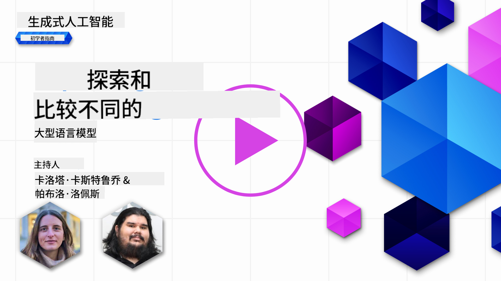](https://aka.ms/gen-ai-lesson2-gh?WT.mc_id=academic-105485-koreyst)

> _点击上方图片观看本课视频_

在前一课中，我们了解了生成式AI如何改变技术格局，大型语言模型（LLM）如何工作，以及企业（例如我们的初创公司）如何将其应用于使用场景并实现增长！在本章中，我们将比较和对比不同类型的大型语言模型（LLM），以了解它们的优缺点。

我们初创公司旅程的下一步是探索当前的LLM格局，并了解哪些适合我们的使用场景。

## 介绍

本课将涵盖：

- 当前格局中的不同类型的LLM。
- 在Azure中测试、迭代和比较不同模型以适应您的使用场景。
- 如何部署LLM。

## 学习目标

完成本课后，您将能够：

- 为您的使用场景选择合适的模型。
- 了解如何测试、迭代和提高模型性能。
- 了解企业如何部署模型。

## 了解不同类型的LLM

LLM可以根据其架构、训练数据和使用场景进行多种分类。了解这些差异将帮助我们的初创公司为特定场景选择合适的模型，并了解如何测试、迭代和提高性能。

LLM模型有很多不同类型，您选择的模型取决于您的使用目的、数据、预算等。

根据您是否计划将模型用于文本、音频、视频、图像生成等，您可能会选择不同类型的模型。

- **音频和语音识别**。对于此目的，Whisper类型模型是一个不错的选择，因为它们是通用的，专注于语音识别。它们经过多语言语音识别训练。了解更多关于[Whisper类型模型的信息](https://platform.openai.com/docs/models/whisper?WT.mc_id=academic-105485-koreyst)。

- **图像生成**。对于图像生成，DALL-E和Midjourney是两个非常知名的选择。DALL-E由Azure OpenAI提供。[在此处阅读更多关于DALL-E的信息](https://platform.openai.com/docs/models/dall-e?WT.mc_id=academic-105485-koreyst)以及本课程第9章。

- **文本生成**。大多数模型都经过文本生成训练，您有多种选择，从GPT-3.5到GPT-4。它们的成本各不相同，其中GPT-4是最昂贵的。值得一看[Azure OpenAI playground](https://oai.azure.com/portal/playground?WT.mc_id=academic-105485-koreyst)以评估哪些模型在能力和成本方面最适合您的需求。

- **多模态**。如果您希望处理输入和输出中的多种数据类型，您可能需要研究类似[gpt-4 turbo with vision或gpt-4o](https://learn.microsoft.com/azure/ai-services/openai/concepts/models#gpt-4-and-gpt-4-turbo-models?WT.mc_id=academic-105485-koreyst)的模型——OpenAI模型的最新发布版本——它们能够结合自然语言处理和视觉理解，通过多模态接口实现交互。

选择模型意味着您获得了一些基本能力，但这可能还不够。通常，您有公司特定的数据，需要某种方式告诉LLM。关于如何处理这一点，有几种不同的选择，更多信息将在后续章节中介绍。

### 基础模型与LLM

基础模型这个术语由[斯坦福研究人员提出](https://arxiv.org/abs/2108.07258?WT.mc_id=academic-105485-koreyst)，定义为满足某些标准的AI模型，例如：

- **它们使用无监督学习或自监督学习进行训练**，这意味着它们在未标记的多模态数据上进行训练，不需要人工标注或数据标签。
- **它们是非常大的模型**，基于训练了数十亿参数的非常深的神经网络。
- **它们通常旨在作为其他模型的‘基础’**，这意味着它们可以用作构建其他模型的起点，可以通过微调实现。

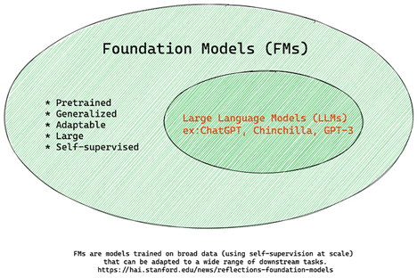

图片来源：[基础模型和大型语言模型的基本指南 | Babar M Bhatti | Medium](https://thebabar.medium.com/essential-guide-to-foundation-models-and-large-language-models-27dab58f7404)

为了进一步澄清这一区别，让我们以ChatGPT为例。为了构建ChatGPT的第一个版本，一个名为GPT-3.5的模型作为基础模型。这意味着OpenAI使用了一些特定于聊天的数据创建了一个经过调优的GPT-3.5版本，该版本专注于在对话场景（如聊天机器人）中表现良好。

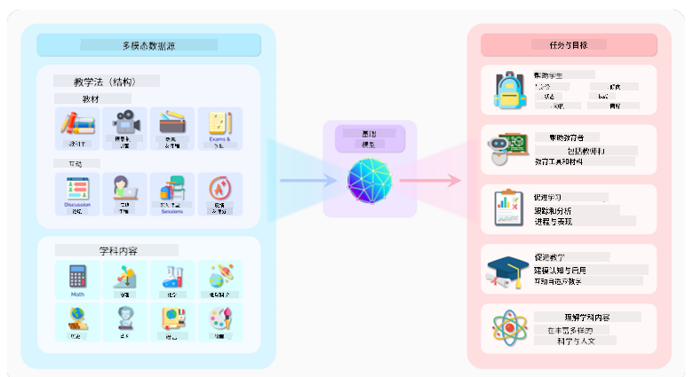

图片来源：[2108.07258.pdf (arxiv.org)](https://arxiv.org/pdf/2108.07258.pdf?WT.mc_id=academic-105485-koreyst)

### 开源模型与专有模型

另一种分类LLM的方法是它们是开源的还是专有的。

开源模型是向公众开放的模型，任何人都可以使用。它们通常由创建它们的公司或研究社区提供。这些模型可以被检查、修改和定制以适应LLM的各种使用场景。然而，它们并不总是针对生产用途进行优化，可能不如专有模型性能好。此外，开源模型的资金可能有限，可能不会长期维护或更新为最新研究。流行的开源模型示例包括[Alpaca](https://crfm.stanford.edu/2023/03/13/alpaca.html?WT.mc_id=academic-105485-koreyst)、[Bloom](https://huggingface.co/bigscience/bloom)和[LLaMA](https://llama.meta.com)。

专有模型是由公司拥有的模型，不向公众开放。这些模型通常针对生产用途进行了优化。然而，它们不允许被检查、修改或定制以适应不同的使用场景。此外，它们不总是免费提供，可能需要订阅或付费使用。此外，用户无法控制用于训练模型的数据，这意味着他们应该信任模型所有者以确保数据隐私和负责任的AI使用的承诺。流行的专有模型示例包括[OpenAI模型](https://platform.openai.com/docs/models/overview?WT.mc_id=academic-105485-koreyst)、[Google Bard](https://sapling.ai/llm/bard?WT.mc_id=academic-105485-koreyst)或[Claude 2](https://www.anthropic.com/index/claude-2?WT.mc_id=academic-105485-koreyst)。

### 嵌入、图像生成、文本和代码生成

LLM也可以根据生成的输出进行分类。

嵌入是一组可以将文本转换为数值形式的模型，称为嵌入，这是输入文本的数值表示。嵌入使机器更容易理解单词或句子之间的关系，并可以作为其他模型的输入，例如分类模型或在数值数据上性能更好的聚类模型。嵌入模型通常用于迁移学习，其中为数据丰富的替代任务构建模型，然后模型权重（嵌入）被重新用于其他下游任务。此类别的示例是[OpenAI嵌入](https://platform.openai.com/docs/models/embeddings?WT.mc_id=academic-105485-koreyst)。

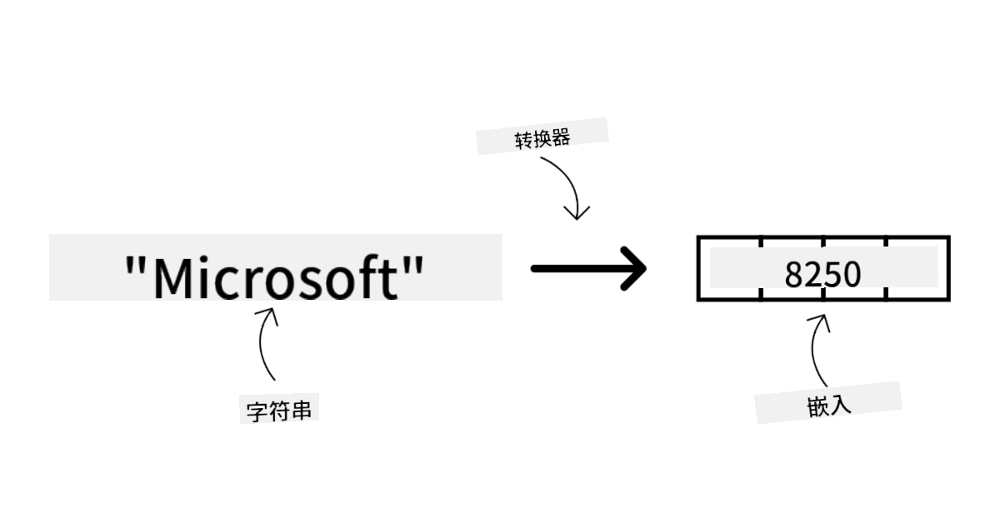

图像生成模型是生成图像的模型。这些模型通常用于图像编辑、图像合成和图像翻译。图像生成模型通常在大型图像数据集上进行训练，例如[LAION-5B](https://laion.ai/blog/laion-5b/?WT.mc_id=academic-105485-koreyst)，可以用于生成新图像或使用修补、超分辨率和着色技术编辑现有图像。示例包括[DALL-E-3](https://openai.com/dall-e-3?WT.mc_id=academic-105485-koreyst)和[Stable Diffusion模型](https://github.com/Stability-AI/StableDiffusion?WT.mc_id=academic-105485-koreyst)。

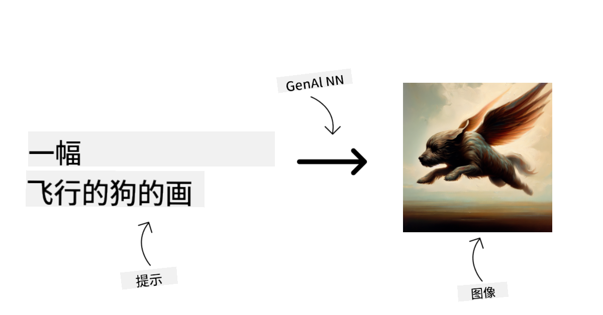

文本和代码生成模型是生成文本或代码的模型。这些模型通常用于文本摘要、翻译和问答。文本生成模型通常在大型文本数据集上进行训练，例如[BookCorpus](https://www.cv-foundation.org/openaccess/content_iccv_2015/html/Zhu_Aligning_Books_and_ICCV_2015_paper.html?WT.mc_id=academic-105485-koreyst)，可以用于生成新文本或回答问题。代码生成模型，如[CodeParrot](https://huggingface.co/codeparrot?WT.mc_id=academic-105485-koreyst)，通常在大型代码数据集上进行训练，例如GitHub，可以用于生成新代码或修复现有代码中的错误。

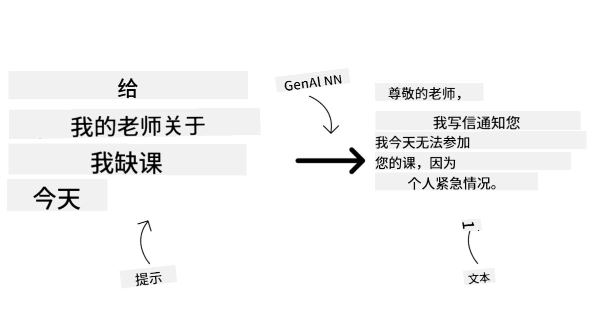

### 编码器-解码器与仅解码器

为了讨论LLM的不同架构类型，让我们用一个比喻来说明。

想象一下，您的经理给您分配了一个为学生编写测验的任务。您有两个同事，一个负责创建内容，另一个负责审核。

内容创建者就像一个仅解码器模型，他们可以查看主题，看到您已经写的内容，然后根据这些内容撰写课程。他们非常擅长编写引人入胜且信息丰富的内容，但不太擅长理解主题和学习目标。解码器模型的例子有GPT系列模型，如GPT-3。

审核者就像一个仅编码器模型，他们查看撰写的课程和答案，注意它们之间的关系并理解上下文，但不擅长生成内容。仅编码器模型的例子是BERT。

想象一下，我们也可以有一个既能创建又能审核测验的人，这就是编码器-解码器模型。示例有BART和T5。

### 服务与模型

现在，让我们谈谈服务和模型之间的区别。服务是由云服务提供商提供的产品，通常是模型、数据和其他组件的组合。模型是服务的核心组件，通常是一个基础模型，如LLM。

服务通常针对生产用途进行了优化，通常比模型更易于使用，通过图形用户界面。然而，服务并不总是免费提供，可能需要订阅或付费使用，以换取利用服务所有者的设备和资源，优化费用并轻松扩展。服务的一个例子是[Azure OpenAI服务](https://learn.microsoft.com/azure/ai-services/openai/overview?WT.mc_id=academic-105485-koreyst)，它提供按使用量付费的计划，这意味着用户按比例支付服务使用量。此外，Azure OpenAI服务在模型能力之上提供企业级安全性和负责任的AI框架。

模型只是神经网络，包括参数、权重等。允许公司在本地运行，但需要购买设备、构建扩展结构并购买许可证或使用开源模型。像LLaMA这样的模型可供使用，需要计算能力来运行模型。

## 如何测试和迭代不同模型以了解Azure上的性能

一旦我们的团队探索了当前的LLM格局并确定了一些适合其场景的候选模型，下一步就是在其数据和工作负载上测试它们。这是一个通过实验和测量进行的迭代过程。我们在前面段落中提到的大多数模型（如OpenAI模型、开源模型如Llama2和Hugging Face transformers）都可以在[Azure AI Studio](https://ai.azure.com/?WT.mc_id=academic-105485-koreyst)的[模型目录](https://learn.microsoft.com/azure/ai-studio/how-to/model-catalog-overview?WT.mc_id=academic-105485-koreyst)中找到。

[Azure AI Studio](https://learn.microsoft.com/azure/ai-studio/what-is-ai-studio?WT.mc_id=academic-105485-koreyst)是一个云平台，专为开发人员构建生成式AI应用程序并管理整个开发生命周期而设计——从实验到评估——通过将所有Azure AI服务结合到一个便捷的GUI中。Azure AI Studio中的模型目录使用户能够：

- 在目录中找到感兴趣的基础模型——无论是专有的还是开源的，按任务、许可证或名称进行筛选。为了提高可搜索性，模型被组织成集合，如Azure OpenAI集合、Hugging Face集合等。

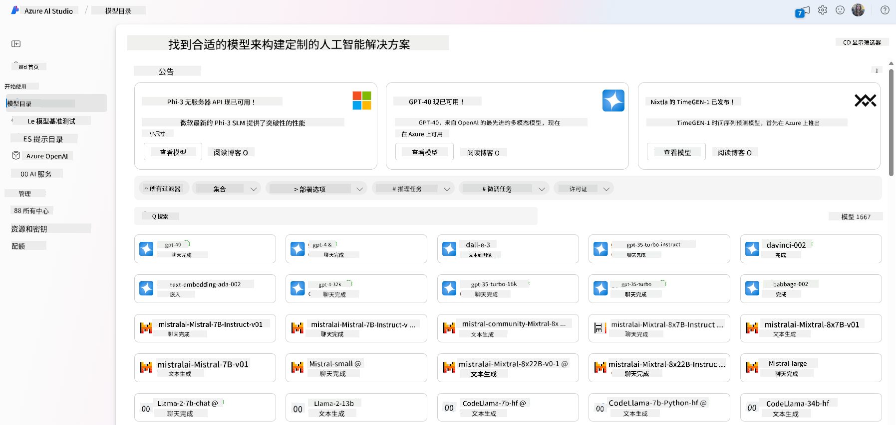

- 查看模型卡，包括预期用途和训练数据的详细描述、代码示例和内部评估库的评估结果。

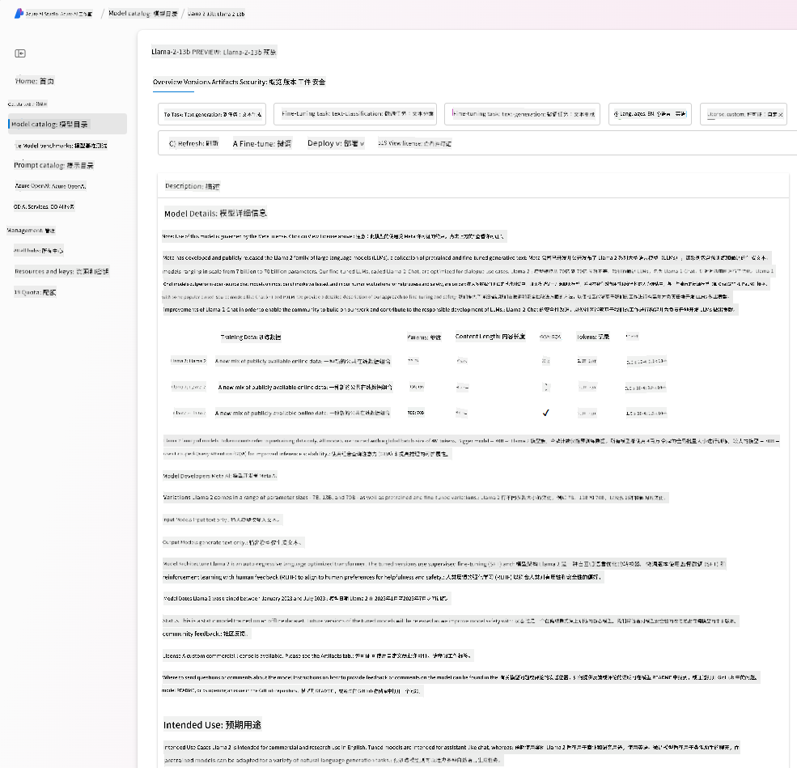
- 通过[模型基准测试](https://learn.microsoft.com/azure/ai-studio/how-to/model-benchmarks?WT.mc_id=academic-105485-koreyst)面板比较行业内的模型和数据集，以评估哪个最符合业务场景。

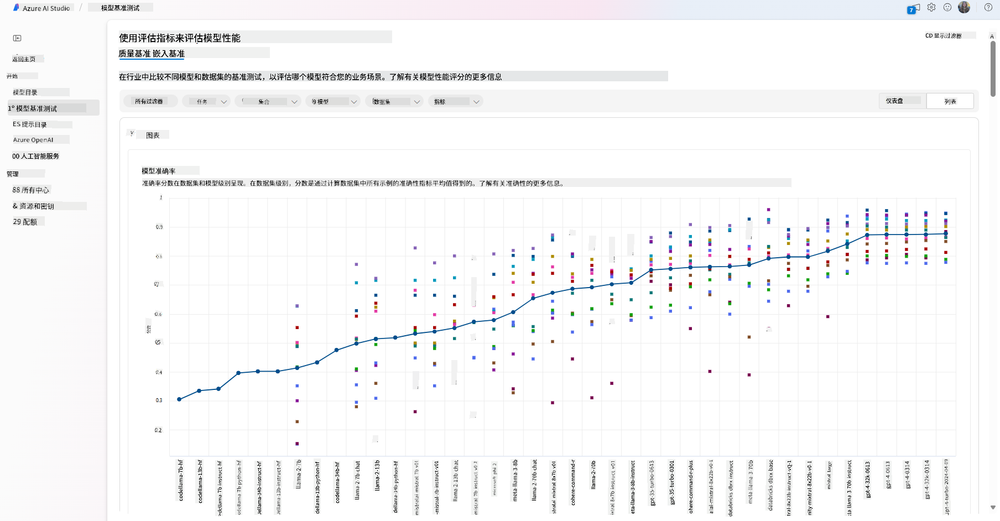

- 利用Azure AI Studio的实验和跟踪功能，在自定义训练数据上微调模型，以提高模型在特定工作负载中的性能。

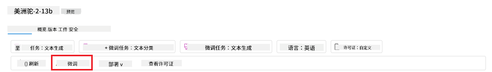

- 将原始预训练模型或微调版本部署到远程实时推理 - 托管计算 - 或无服务器API端点 - [按需付费](https://learn.microsoft.com/azure/ai-studio/how-to/model-catalog-overview#model-deployment-managed-compute-and-serverless-api-pay-as-you-go?WT.mc_id=academic-105485-koreyst) - 以便应用程序可以使用它。

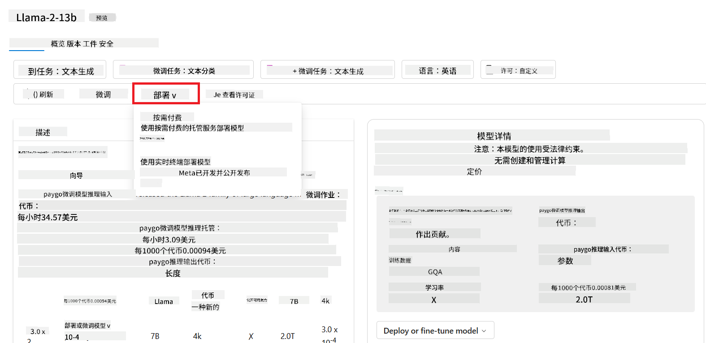

> [!NOTE]
> 目录中的所有模型目前并不都可以进行微调和/或按需付费部署。请查看模型卡以了解模型的功能和限制。

## 提高LLM结果

我们与初创团队探索了不同种类的LLM和云平台（Azure Machine Learning），使我们能够比较不同模型，在测试数据上评估它们，提高性能并在推理端点上部署它们。

但何时应该考虑微调模型而不是使用预训练模型呢？是否有其他方法可以提高模型在特定工作负载上的性能？

企业可以采用多种方法从LLM中获得所需结果。在生产中部署LLM时，可以选择不同类型的模型，具有不同程度的训练，复杂性、成本和质量不同。以下是一些不同的方法：

- **上下文提示工程**。这个想法是提供足够的上下文以确保获得所需的响应。

- **检索增强生成，RAG**。例如，您的数据可能存在于数据库或网络端点中，以确保在提示时包含这些数据或其子集，您可以获取相关数据并将其作为用户提示的一部分。

- **微调模型**。在这里，您在自己的数据上进一步训练模型，使其更加准确和响应您的需求，但可能成本较高。

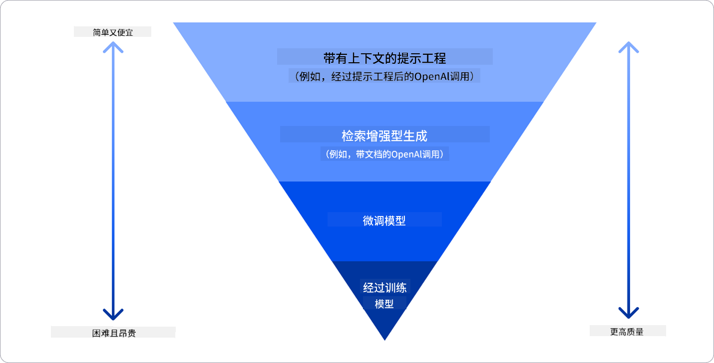

图片来源：[企业部署LLM的四种方式 | Fiddler AI博客](https://www.fiddler.ai/blog/four-ways-that-enterprises-deploy-llms?WT.mc_id=academic-105485-koreyst)

### 上下文提示工程

预训练的LLM在通用自然语言任务上表现非常好，即使只用一个简短的提示调用它们，比如要完成的句子或问题——所谓的“零样本”学习。

然而，用户越能框定他们的查询，提供详细的请求和示例——上下文——答案就会越准确，越符合用户的期望。在这种情况下，如果提示中只包含一个示例，我们称之为“一次样本”学习；如果包含多个示例，则称之为“少量样本”学习。上下文提示工程是启动最具成本效益的方法。

### 检索增强生成 (RAG)

LLM的限制在于它们只能使用训练期间使用的数据来生成答案。这意味着它们不了解训练过程后发生的事实，也无法访问非公开信息（如公司数据）。
这可以通过RAG来克服，这是一种通过外部数据块增强提示的技术，考虑提示长度限制。支持向量数据库工具（如[Azure Vector Search](https://learn.microsoft.com/azure/search/vector-search-overview?WT.mc_id=academic-105485-koreyst)）可以从各种预定义数据源中检索有用的数据块，并将它们添加到提示上下文中。

当企业没有足够的数据、时间或资源来微调LLM，但仍希望在特定工作负载上提高性能并减少虚构风险（即对现实的神秘化或有害内容）时，这种技术非常有帮助。

### 微调模型

微调是利用迁移学习来“适应”模型以执行下游任务或解决特定问题的过程。与少量样本学习和RAG不同，它会生成一个新模型，具有更新的权重和偏差。它需要一组训练示例，包括单个输入（提示）及其关联的输出（完成）。
如果符合以下情况，这是首选的方法：

- **使用微调模型**。企业希望使用微调的能力较弱的模型（如嵌入模型）而不是高性能模型，从而实现更具成本效益和快速的解决方案。

- **考虑延迟**。延迟对于特定用例很重要，因此无法使用非常长的提示或示例数量，因为模型学习的示例数量与提示长度限制不符。

- **保持更新**。企业拥有大量高质量数据和真实标签，并且具备保持这些数据随着时间更新所需的资源。

### 训练模型

从头开始训练LLM无疑是最困难和最复杂的方法，需要大量数据、熟练的资源和适当的计算能力。只有在企业具有特定领域的用例和大量领域集中数据的情况下才应考虑此选项。

## 知识检查

什么可能是提高LLM完成结果的好方法？

1. 上下文提示工程
1. RAG
1. 微调模型

A:3，如果您有时间和资源以及高质量数据，微调是保持更新的更好选择。然而，如果您希望改善情况并缺乏时间，值得首先考虑RAG。

## 🚀 挑战

阅读更多关于如何为您的企业[使用RAG](https://learn.microsoft.com/azure/search/retrieval-augmented-generation-overview?WT.mc_id=academic-105485-koreyst)。

## 出色的工作，继续学习

完成本课程后，请查看我们的[生成式AI学习集合](https://aka.ms/genai-collection?WT.mc_id=academic-105485-koreyst)，继续提升您的生成式AI知识！

前往第三课，我们将探讨如何[负责任地使用生成式AI](../03-using-generative-ai-responsibly/README.md?WT.mc_id=academic-105485-koreyst)！

**免责声明**：
本文档使用AI翻译服务[Co-op Translator](https://github.com/Azure/co-op-translator)进行翻译。尽管我们努力确保准确性，但请注意，自动翻译可能包含错误或不准确之处。应将原始文档视为权威来源。对于关键信息，建议使用专业人工翻译。对于因使用本翻译而引起的任何误解或误释，我们不承担责任。