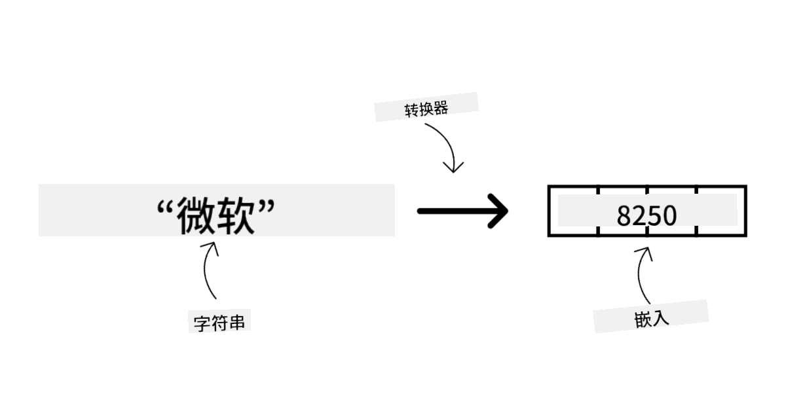
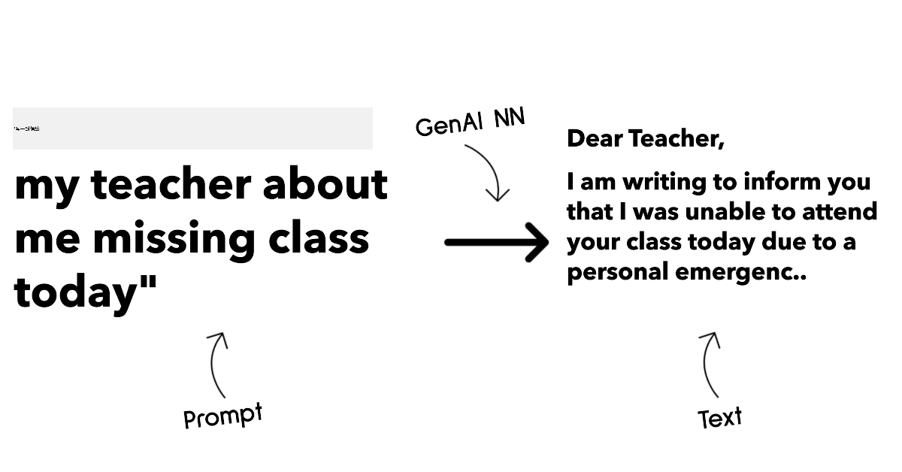
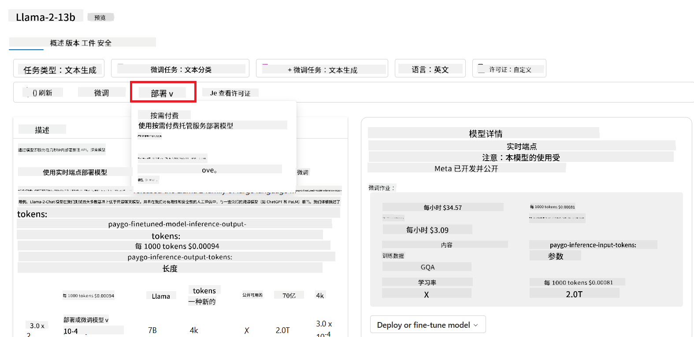

<!--
CO_OP_TRANSLATOR_METADATA:
{
  "original_hash": "6b7629b8ee4d7d874a27213e903d86a7",
  "translation_date": "2025-10-17T23:23:05+00:00",
  "source_file": "02-exploring-and-comparing-different-llms/README.md",
  "language_code": "zh"
}
-->
# 探索和比较不同的LLM

> _点击上方图片观看本课视频_

在上一课中，我们已经了解了生成式人工智能如何改变技术格局，了解了大型语言模型（LLM）的工作原理，以及企业（例如我们的初创公司）如何将其应用于实际案例并实现增长！在本章中，我们将比较和对比不同类型的大型语言模型（LLM），以了解它们的优缺点。

我们初创公司旅程的下一步是探索当前的LLM领域，并了解哪些模型适合我们的使用场景。

## 简介

本课将涵盖：

- 当前领域中不同类型的LLM。
- 在Azure中测试、迭代和比较不同模型以适应您的使用场景。
- 如何部署LLM。

## 学习目标

完成本课后，您将能够：

- 为您的使用场景选择合适的模型。
- 了解如何测试、迭代并提高模型的性能。
- 了解企业如何部署模型。

## 了解不同类型的LLM

LLM可以根据其架构、训练数据和使用场景进行多种分类。了解这些差异将帮助我们的初创公司选择适合场景的模型，并了解如何测试、迭代和提高性能。

LLM模型种类繁多，选择哪种模型取决于您的使用目的、数据类型、预算等因素。

根据您是希望将模型用于文本、音频、视频、图像生成等用途，您可能会选择不同类型的模型。

- **音频和语音识别**。对于此用途，Whisper类型的模型是一个很好的选择，因为它们是通用的，专注于语音识别。它基于多样化的音频数据进行训练，可以执行多语言语音识别。了解更多关于[Whisper类型模型的信息](https://platform.openai.com/docs/models/whisper?WT.mc_id=academic-105485-koreyst)。

- **图像生成**。对于图像生成，DALL-E和Midjourney是两个非常知名的选择。DALL-E由Azure OpenAI提供。[阅读更多关于DALL-E的信息](https://platform.openai.com/docs/models/dall-e?WT.mc_id=academic-105485-koreyst)，也可以在本课程的第9章中了解更多。

- **文本生成**。大多数模型都经过文本生成训练，您可以选择从GPT-3.5到GPT-4的多种模型。它们的成本各不相同，其中GPT-4最为昂贵。值得查看[Azure OpenAI playground](https://oai.azure.com/portal/playground?WT.mc_id=academic-105485-koreyst)，以评估哪些模型在能力和成本方面最适合您的需求。

- **多模态**。如果您希望处理输入和输出中的多种数据类型，可以考虑像[gpt-4 turbo with vision或gpt-4o](https://learn.microsoft.com/azure/ai-services/openai/concepts/models#gpt-4-and-gpt-4-turbo-models?WT.mc_id=academic-105485-koreyst)这样的模型——OpenAI最新发布的模型——它们能够将自然语言处理与视觉理解结合起来，从而实现通过多模态界面进行交互。

选择一个模型意味着您获得了一些基本功能，但这可能还不够。通常，您有公司特定的数据需要以某种方式告知LLM。关于如何处理这一点，有几种不同的选择，更多内容将在后续部分中介绍。

### 基础模型与LLM

“基础模型”这一术语由[斯坦福研究人员提出](https://arxiv.org/abs/2108.07258?WT.mc_id=academic-105485-koreyst)，定义为符合以下标准的AI模型，例如：

- **使用无监督学习或自监督学习进行训练**，即它们基于未标注的多模态数据进行训练，不需要人工注释或标注数据来完成训练过程。
- **它们是非常大的模型**，基于非常深的神经网络，训练了数十亿个参数。
- **通常旨在作为其他模型的“基础”**，即它们可以作为其他模型的起点，通过微调来构建其他模型。

图片来源：[基础模型和大型语言模型的基本指南 | 作者：Babar M Bhatti | Medium](https://thebabar.medium.com/essential-guide-to-foundation-models-and-large-language-models-27dab58f7404)

为了进一步澄清这一区别，让我们以ChatGPT为例。构建ChatGPT的第一个版本时，使用了一个名为GPT-3.5的模型作为基础模型。这意味着OpenAI使用了一些特定于聊天的数据来创建一个经过调优的GPT-3.5版本，使其在对话场景（如聊天机器人）中表现出色。

图片来源：[2108.07258.pdf (arxiv.org)](https://arxiv.org/pdf/2108.07258.pdf?WT.mc_id=academic-105485-koreyst)

### 开源模型与专有模型

另一种分类LLM的方法是看它们是开源的还是专有的。

开源模型是公开提供给公众使用的模型，任何人都可以使用。它们通常由创建它们的公司或研究社区提供。这些模型可以被检查、修改，并根据LLM的各种使用场景进行定制。然而，它们并不总是针对生产使用进行优化，性能可能不如专有模型。此外，开源模型的资金可能有限，可能无法长期维护或更新最新的研究成果。流行的开源模型包括[Alpaca](https://crfm.stanford.edu/2023/03/13/alpaca.html?WT.mc_id=academic-105485-koreyst)、[Bloom](https://huggingface.co/bigscience/bloom)和[LLaMA](https://llama.meta.com)。

专有模型是由公司拥有的模型，未向公众开放。这些模型通常针对生产使用进行了优化。然而，它们无法被检查、修改或根据不同的使用场景进行定制。此外，它们并不总是免费提供，可能需要订阅或支付费用才能使用。此外，用户无法控制用于训练模型的数据，这意味着他们需要信任模型所有者确保数据隐私和负责任的AI使用。流行的专有模型包括[OpenAI模型](https://platform.openai.com/docs/models/overview?WT.mc_id=academic-105485-koreyst)、[Google Bard](https://sapling.ai/llm/bard?WT.mc_id=academic-105485-koreyst)或[Claude 2](https://www.anthropic.com/index/claude-2?WT.mc_id=academic-105485-koreyst)。

### 嵌入、图像生成与文本和代码生成

LLM还可以根据其生成的输出进行分类。

嵌入模型是一组可以将文本转换为数值形式的模型，称为嵌入，即输入文本的数值表示。嵌入使机器更容易理解单词或句子之间的关系，并可以作为其他模型的输入，例如分类模型或在数值数据上性能更好的聚类模型。嵌入模型通常用于迁移学习，在这种情况下，模型为一个有大量数据的替代任务构建，然后模型权重（嵌入）被重新用于其他下游任务。此类别的一个示例是[OpenAI嵌入](https://platform.openai.com/docs/models/embeddings?WT.mc_id=academic-105485-koreyst)。

图像生成模型是生成图像的模型。这些模型通常用于图像编辑、图像合成和图像翻译。图像生成模型通常基于大型图像数据集进行训练，例如[LAION-5B](https://laion.ai/blog/laion-5b/?WT.mc_id=academic-105485-koreyst)，可以用于生成新图像或编辑现有图像，使用修复、超分辨率和上色技术。示例包括[DALL-E-3](https://openai.com/dall-e-3?WT.mc_id=academic-105485-koreyst)和[Stable Diffusion模型](https://github.com/Stability-AI/StableDiffusion?WT.mc_id=academic-105485-koreyst)。

文本和代码生成模型是生成文本或代码的模型。这些模型通常用于文本摘要、翻译和问答。文本生成模型通常基于大型文本数据集进行训练，例如[BookCorpus](https://www.cv-foundation.org/openaccess/content_iccv_2015/html/Zhu_Aligning_Books_and_ICCV_2015_paper.html?WT.mc_id=academic-105485-koreyst)，可以用于生成新文本或回答问题。代码生成模型，例如[CodeParrot](https://huggingface.co/codeparrot?WT.mc_id=academic-105485-koreyst)，通常基于大型代码数据集进行训练，例如GitHub，可以用于生成新代码或修复现有代码中的错误。

### 编码器-解码器与仅解码器

为了讨论LLM的不同架构类型，我们可以用一个类比来说明。

假设您的经理给您布置了一项任务，为学生编写一个测验。您有两位同事，一位负责创建内容，另一位负责审核内容。

内容创建者就像一个仅解码器模型，他们可以查看主题和您已经写的内容，然后根据这些内容编写课程。他们非常擅长编写引人入胜且信息丰富的内容，但他们不太擅长理解主题和学习目标。仅解码器模型的例子包括GPT系列模型，例如GPT-3。

审核者就像一个仅编码器模型，他们查看编写的课程和答案，注意它们之间的关系并理解上下文，但他们不擅长生成内容。仅编码器模型的一个例子是BERT。

想象一下，我们也可以有一个既能创建又能审核测验的人，这就是编码器-解码器模型。示例包括BART和T5。

### 服务与模型

现在，让我们讨论服务与模型之间的区别。服务是由云服务提供商提供的产品，通常是模型、数据和其他组件的组合。模型是服务的核心组件，通常是一个基础模型，例如LLM。

服务通常针对生产使用进行了优化，并且通常比模型更易于使用，通过图形用户界面进行操作。然而，服务并不总是免费提供，可能需要订阅或支付费用才能使用，以利用服务所有者的设备和资源，优化开销并轻松扩展。服务的一个示例是[Azure OpenAI Service](https://learn.microsoft.com/azure/ai-services/openai/overview?WT.mc_id=academic-105485-koreyst)，它提供按使用量付费的计划，这意味着用户根据使用服务的多少按比例收费。此外，Azure OpenAI Service在模型功能之上提供企业级安全性和负责任的AI框架。

模型只是神经网络，包括参数、权重等。允许公司本地运行，但需要购买设备、构建扩展结构并购买许可证或使用开源模型。像LLaMA这样的模型可以使用，但需要计算能力来运行模型。

## 如何在Azure上测试和迭代不同模型以了解性能

一旦我们的团队探索了当前的LLM领域并确定了一些适合其场景的候选模型，下一步就是在他们的数据和工作负载上测试这些模型。这是一个通过实验和测量完成的迭代过程。
我们在前面段落中提到的大多数模型（如OpenAI模型、开源模型Llama2和Hugging Face transformers）都可以在[Azure AI Studio](https://ai.azure.com/?WT.mc_id=academic-105485-koreyst)的[模型目录](https://learn.microsoft.com/azure/ai-studio/how-to/model-catalog-overview?WT.mc_id=academic-105485-koreyst)中找到。

[Azure AI Studio](https://learn.microsoft.com/azure/ai-studio/what-is-ai-studio?WT.mc_id=academic-105485-koreyst)是一个云平台，专为开发者设计，用于构建生成式AI应用并管理整个开发生命周期——从实验到评估——通过将所有Azure AI服务整合到一个便捷的图形用户界面中。Azure AI Studio中的模型目录使用户能够：

- 在目录中找到感兴趣的基础模型——无论是专有模型还是开源模型，可以按任务、许可证或名称进行筛选。为了提高搜索效率，模型被组织到不同的集合中，例如Azure OpenAI集合、Hugging Face集合等。

- 查看模型卡，包括关于预期用途和训练数据的详细描述、代码示例以及内部评估库的评估结果。

- 通过[模型基准测试](https://learn.microsoft.com/azure/ai-studio/how-to/model-benchmarks?WT.mc_id=academic-105485-koreyst)面板比较行业内可用的模型和数据集的基准测试，以评估哪个模型最符合业务场景。

- 利用Azure AI Studio的实验和跟踪功能，在自定义训练数据上微调模型，以提高模型在特定工作负载中的性能。

- 将原始预训练模型或微调版本部署到远程实时推理——托管计算——或无服务器API端点——[按需付费](https://learn.microsoft.com/azure/ai-studio/how-to/model-catalog-overview#model-deployment-managed-compute-and-serverless-api-pay-as-you-go?WT.mc_id=academic-105485-koreyst)——以便应用程序可以使用它。

> [!NOTE]
> 目录中的所有模型目前并不都支持微调和/或按需付费部署。请查看模型卡以了解模型的功能和限制。

## 提高LLM结果

我们与初创团队一起探索了不同类型的LLM以及一个云平台（Azure Machine Learning），该平台使我们能够比较不同的模型，在测试数据上进行评估，提升性能并将其部署到推理端点。

那么，什么时候应该考虑微调模型而不是使用预训练模型？是否还有其他方法可以提高模型在特定工作负载上的性能？

企业可以采用多种方法从LLM中获得所需的结果。在生产环境中部署LLM时，可以选择不同类型的模型，这些模型具有不同的训练程度、复杂性、成本和质量。以下是一些不同的方法：

- **带上下文的提示工程**。这个方法的核心思想是，在提示时提供足够的上下文，以确保获得所需的响应。

- **检索增强生成（RAG）**。例如，为了确保数据库或网络端点中的数据或其子集在提示时被包含，可以在提示时获取相关数据并将其作为用户提示的一部分。

- **微调模型**。通过在自己的数据上进一步训练模型，使其更加精确并满足需求，但可能成本较高。

图片来源：[企业部署LLM的四种方式 | Fiddler AI Blog](https://www.fiddler.ai/blog/four-ways-that-enterprises-deploy-llms?WT.mc_id=academic-105485-koreyst)

### 带上下文的提示工程

预训练的LLM在处理通用自然语言任务时表现非常出色，即使只用一个简短的提示调用它们，例如完成一个句子或回答一个问题——这被称为“零样本学习”。

然而，用户提供的查询越详细，包含的请求和示例越多——即上下文——模型的回答就越准确，越符合用户的期望。在这种情况下，如果提示中仅包含一个示例，我们称之为“一次样本学习”；如果包含多个示例，则称为“少样本学习”。带上下文的提示工程是启动的最具成本效益的方法。

### 检索增强生成（RAG）

LLM的局限性在于，它们只能使用训练过程中使用的数据来生成答案。这意味着它们对训练后发生的事实一无所知，也无法访问非公开信息（如公司数据）。
可以通过RAG来克服这一问题，这是一种通过文档片段形式的外部数据增强提示的技术，同时考虑到提示长度的限制。此技术由向量数据库工具（如[Azure Vector Search](https://learn.microsoft.com/azure/search/vector-search-overview?WT.mc_id=academic-105485-koreyst)）支持，这些工具从各种预定义数据源中检索有用的片段并将其添加到提示上下文中。

当企业没有足够的数据、时间或资源来微调LLM，但仍希望提高特定工作负载的性能并减少虚构风险（即对现实的误导或有害内容）时，这种技术非常有用。

### 微调模型

微调是一种利用迁移学习的过程，用于“适配”模型以完成下游任务或解决特定问题。与少样本学习和RAG不同，微调会生成一个新的模型，并更新权重和偏差。它需要一组训练示例，这些示例由单个输入（提示）及其相关输出（完成）组成。
以下情况适合采用这种方法：

- **使用微调模型**。企业希望使用微调后的能力较弱的模型（如嵌入模型），而不是高性能模型，从而实现更具成本效益和更快速的解决方案。

- **考虑延迟**。延迟对于某些特定用例非常重要，因此无法使用非常长的提示或超出提示长度限制的示例数量。

- **保持最新**。企业拥有大量高质量数据和真实标签，并且有资源能够随着时间推移保持这些数据的更新。

### 训练模型

从零开始训练一个LLM无疑是最困难和最复杂的方法，需要大量数据、专业资源和适当的计算能力。只有在企业拥有特定领域的用例和大量领域相关数据的情况下，才应考虑这种选项。

## 知识检查

什么是提高LLM完成结果的好方法？

1. 带上下文的提示工程  
1. RAG  
1. 微调模型  

A:3，如果您有时间、资源和高质量数据，微调是保持最新的更好选择。然而，如果您希望改进结果但缺乏时间，首先考虑RAG可能更值得。

## 🚀 挑战

阅读更多关于如何[使用RAG](https://learn.microsoft.com/azure/search/retrieval-augmented-generation-overview?WT.mc_id=academic-105485-koreyst)来为您的企业服务。

## 出色的工作，继续学习

完成本课程后，请查看我们的[生成式AI学习合集](https://aka.ms/genai-collection?WT.mc_id=academic-105485-koreyst)，继续提升您的生成式AI知识！

前往第3课，我们将探讨如何[负责任地使用生成式AI](../03-using-generative-ai-responsibly/README.md?WT.mc_id=academic-105485-koreyst)！

---

**免责声明**：  
本文档使用AI翻译服务[Co-op Translator](https://github.com/Azure/co-op-translator)进行翻译。尽管我们努力确保翻译的准确性，但请注意，自动翻译可能包含错误或不准确之处。原始语言的文档应被视为权威来源。对于重要信息，建议使用专业人工翻译。我们对因使用此翻译而产生的任何误解或误读不承担责任。