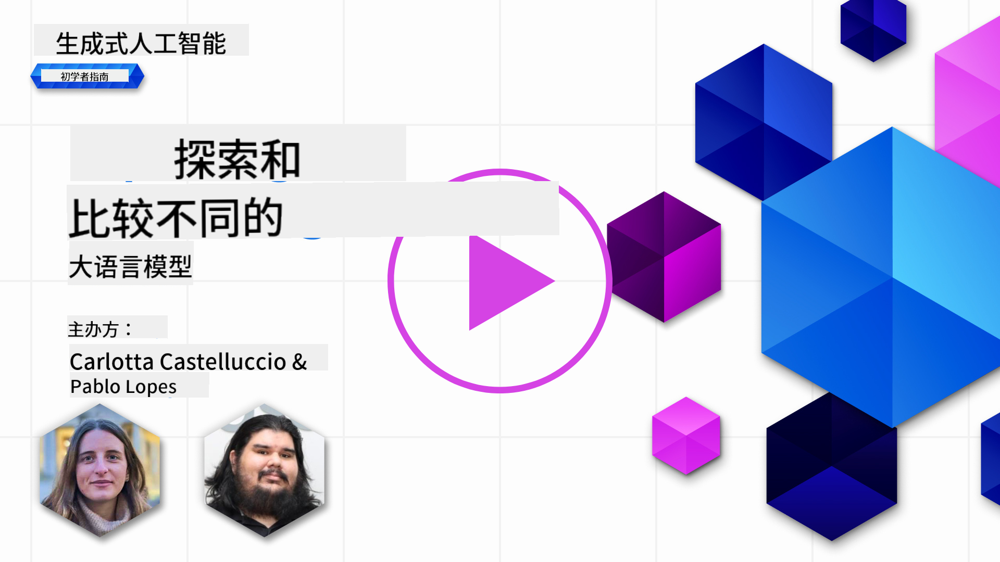
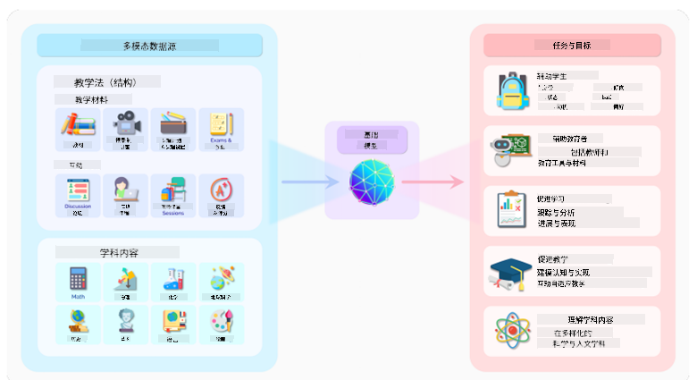
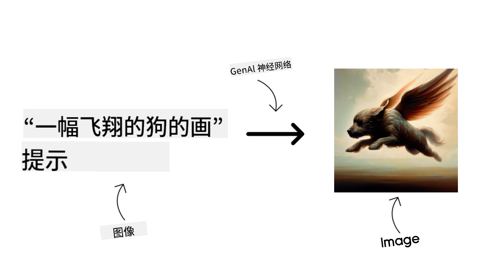
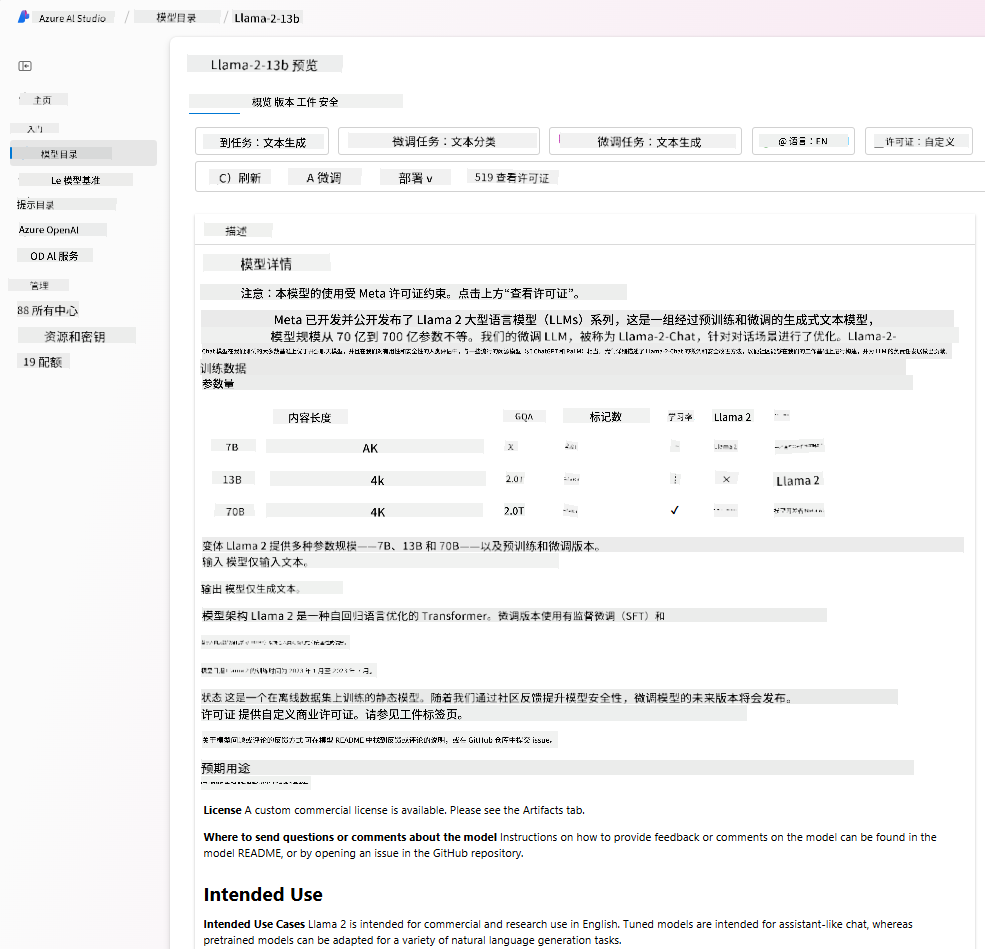
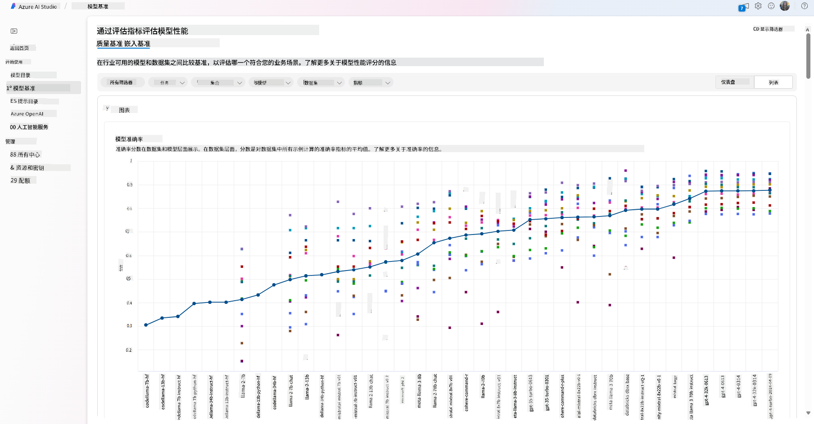

<!--
CO_OP_TRANSLATOR_METADATA:
{
  "original_hash": "e2f686f2eb794941761252ac5e8e090b",
  "translation_date": "2025-07-09T08:12:43+00:00",
  "source_file": "02-exploring-and-comparing-different-llms/README.md",
  "language_code": "zh"
}
-->
# 探索与比较不同的大型语言模型（LLMs）

> _点击上方图片观看本课视频_

在上一课中，我们了解了生成式人工智能如何改变技术格局，了解了大型语言模型（LLMs）的工作原理，以及像我们这样的初创企业如何将其应用于实际场景并实现增长！本章将对不同类型的大型语言模型进行比较和对比，帮助理解它们的优缺点。

我们初创企业的下一步是探索当前的LLM生态，了解哪些模型适合我们的应用场景。

## 介绍

本课内容包括：

- 当前生态中不同类型的LLM。
- 在Azure中测试、迭代和比较不同模型以适应你的应用场景。
- 如何部署LLM。

## 学习目标

完成本课后，你将能够：

- 为你的应用场景选择合适的模型。
- 理解如何测试、迭代并提升模型性能。
- 了解企业如何部署模型。

## 了解不同类型的LLM

LLM可以根据其架构、训练数据和应用场景进行多种分类。理解这些差异将帮助我们的初创企业为具体场景选择合适的模型，并掌握如何测试、迭代和提升性能。

LLM模型种类繁多，选择哪种模型取决于你的使用目标、数据情况、预算等因素。

根据你是想用模型处理文本、音频、视频、图像生成等不同任务，可能会选择不同类型的模型。

- **音频和语音识别**。Whisper类模型是这类任务的理想选择，它们是通用型的，专注于语音识别。Whisper模型训练于多样化的音频数据，支持多语言语音识别。了解更多关于[Whisper类模型](https://platform.openai.com/docs/models/whisper?WT.mc_id=academic-105485-koreyst)。

- **图像生成**。图像生成领域中，DALL-E和Midjourney是两个非常知名的选择。DALL-E由Azure OpenAI提供支持。[这里了解更多关于DALL-E](https://platform.openai.com/docs/models/dall-e?WT.mc_id=academic-105485-koreyst)，以及本课程第9章内容。

- **文本生成**。大多数模型都专注于文本生成，你可以从GPT-3.5到GPT-4中选择多种模型。它们的价格不同，GPT-4是最昂贵的。建议使用[Azure OpenAI playground](https://oai.azure.com/portal/playground?WT.mc_id=academic-105485-koreyst)来评估哪些模型在能力和成本上最适合你的需求。

- **多模态**。如果你需要处理多种类型的输入和输出数据，可以考虑像[gpt-4 turbo带视觉功能或gpt-4o](https://learn.microsoft.com/azure/ai-services/openai/concepts/models#gpt-4-and-gpt-4-turbo-models?WT.mc_id=academic-105485-koreyst)这样的最新OpenAI模型，它们能够结合自然语言处理和视觉理解，实现多模态交互。

选择模型意味着你获得了一些基础能力，但这往往还不够。通常你会有公司特定的数据需要让LLM了解。针对这一点，有几种不同的处理方式，后续章节会详细介绍。

### 基础模型与LLM的区别

“基础模型”一词由[斯坦福研究人员提出](https://arxiv.org/abs/2108.07258?WT.mc_id=academic-105485-koreyst)，定义为满足以下条件的AI模型：

- **采用无监督学习或自监督学习训练**，即在未标注的多模态数据上训练，无需人工注释或标注。
- **模型规模庞大**，基于深度神经网络，拥有数十亿参数。
- **通常作为其他模型的“基础”**，可作为构建其他模型的起点，通过微调实现特定任务。

图片来源：[Essential Guide to Foundation Models and Large Language Models | by Babar M Bhatti | Medium](https://thebabar.medium.com/essential-guide-to-foundation-models-and-large-language-models-27dab58f7404)

为了进一步说明区别，我们以ChatGPT为例。ChatGPT的第一个版本是基于GPT-3.5这一基础模型构建的。OpenAI利用一些特定的聊天数据对GPT-3.5进行了微调，使其在对话场景（如聊天机器人）中表现出色。

图片来源：[2108.07258.pdf (arxiv.org)](https://arxiv.org/pdf/2108.07258.pdf?WT.mc_id=academic-105485-koreyst)

### 开源模型与专有模型

另一种分类方式是根据模型是否开源。

开源模型是公开发布的，任何人都可以使用。它们通常由创建者公司或研究社区提供，允许用户查看、修改和定制以适应不同的LLM应用场景。但开源模型不一定针对生产环境进行了优化，性能可能不及专有模型。此外，开源模型的资金支持有限，可能缺乏长期维护和最新研究的更新。流行的开源模型示例包括[Alpaca](https://crfm.stanford.edu/2023/03/13/alpaca.html?WT.mc_id=academic-105485-koreyst)、[Bloom](https://huggingface.co/bigscience/bloom)和[LLaMA](https://llama.meta.com)。

专有模型由公司拥有，不对外公开。这些模型通常针对生产环境进行了优化，但不允许用户查看、修改或定制。它们通常不是免费的，可能需要订阅或付费使用。用户无法控制用于训练模型的数据，因此需要信任模型所有者在数据隐私和AI责任使用方面的承诺。流行的专有模型示例包括[OpenAI模型](https://platform.openai.com/docs/models/overview?WT.mc_id=academic-105485-koreyst)、[Google Bard](https://sapling.ai/llm/bard?WT.mc_id=academic-105485-koreyst)和[Claude 2](https://www.anthropic.com/index/claude-2?WT.mc_id=academic-105485-koreyst)。

### 嵌入模型、图像生成模型与文本及代码生成模型

LLM还可以根据输出类型进行分类。

嵌入模型能够将文本转换为数值形式，称为嵌入，是输入文本的数值表示。嵌入使机器更容易理解词语或句子之间的关系，并可作为其他模型（如分类模型或聚类模型）的输入，这些模型在处理数值数据时表现更好。嵌入模型常用于迁移学习，即先为数据丰富的代理任务训练模型，然后将模型权重（嵌入）用于其他下游任务。此类模型示例为[OpenAI embeddings](https://platform.openai.com/docs/models/embeddings?WT.mc_id=academic-105485-koreyst)。

图像生成模型用于生成图像，常用于图像编辑、合成和转换。它们通常在大型图像数据集（如[LAION-5B](https://laion.ai/blog/laion-5b/?WT.mc_id=academic-105485-koreyst)）上训练，可生成新图像或通过修补、超分辨率、上色等技术编辑现有图像。示例包括[DALL-E-3](https://openai.com/dall-e-3?WT.mc_id=academic-105485-koreyst)和[Stable Diffusion模型](https://github.com/Stability-AI/StableDiffusion?WT.mc_id=academic-105485-koreyst)。

文本和代码生成模型用于生成文本或代码，常用于文本摘要、翻译和问答。文本生成模型通常在大型文本数据集（如[BookCorpus](https://www.cv-foundation.org/openaccess/content_iccv_2015/html/Zhu_Aligning_Books_and_ICCV_2015_paper.html?WT.mc_id=academic-105485-koreyst)）上训练，可生成新文本或回答问题。代码生成模型，如[CodeParrot](https://huggingface.co/codeparrot?WT.mc_id=academic-105485-koreyst)，通常在大型代码库（如GitHub）上训练，可生成新代码或修复现有代码中的错误。

### 编码器-解码器架构与仅解码器架构

谈论LLM的不同架构时，我们用一个比喻来说明。

假设你的经理让你为学生设计一个测验。你有两个同事，一个负责内容创作，另一个负责审核。

内容创作者就像仅解码器模型，他们可以根据主题和已有内容写出课程。他们擅长写出引人入胜且信息丰富的内容，但不擅长理解主题和学习目标。仅解码器模型的例子有GPT系列模型，如GPT-3。

审核者就像仅编码器模型，他们查看已写课程和答案，理解它们之间的关系和上下文，但不擅长生成内容。仅编码器模型的例子有BERT。

如果有人既能创作又能审核测验，这就是编码器-解码器模型。示例包括BART和T5。

### 服务与模型的区别

现在，我们来谈谈服务和模型的区别。服务是云服务提供商提供的产品，通常是模型、数据和其他组件的组合。模型是服务的核心组件，通常是基础模型，如LLM。

服务通常针对生产环境进行了优化，使用起来比单独模型更方便，通常通过图形界面操作。但服务不一定免费，可能需要订阅或付费，用户通过使用服务享受服务提供商的设备和资源，优化成本并轻松扩展。示例服务有[Azure OpenAI Service](https://learn.microsoft.com/azure/ai-services/openai/overview?WT.mc_id=academic-105485-koreyst)，它采用按使用量付费的计费方式，并在模型能力基础上提供企业级安全和负责任的AI框架。

模型仅指神经网络本身，包括参数、权重等。企业若想本地运行模型，需要购买设备、搭建扩展架构，并购买许可或使用开源模型。像LLaMA这样的模型可供使用，但需要计算资源来运行。

## 如何在Azure上测试和迭代不同模型以评估性能

当团队探索完当前LLM生态并确定了一些适合场景的候选模型后，下一步是用自己的数据和工作负载对它们进行测试。这是一个通过实验和测量不断迭代的过程。
我们在前面章节提到的大多数模型（OpenAI 模型、开源模型如 Llama2 以及 Hugging Face transformers）都可以在 [Azure AI Studio](https://ai.azure.com/?WT.mc_id=academic-105485-koreyst) 的[模型目录](https://learn.microsoft.com/azure/ai-studio/how-to/model-catalog-overview?WT.mc_id=academic-105485-koreyst)中找到。

[Azure AI Studio](https://learn.microsoft.com/azure/ai-studio/what-is-ai-studio?WT.mc_id=academic-105485-koreyst) 是一个云平台，专为开发者设计，用于构建生成式 AI 应用并管理整个开发生命周期——从实验到评估——通过将所有 Azure AI 服务整合到一个带有便捷 GUI 的中心。Azure AI Studio 中的模型目录使用户能够：

- 在目录中找到感兴趣的基础模型——无论是专有模型还是开源模型，可以通过任务、许可证或名称进行筛选。为了提升搜索效率，模型被组织成多个集合，如 Azure OpenAI 集合、Hugging Face 集合等。

- 查看模型卡，包括详细的预期用途描述、训练数据、代码示例以及内部评估库中的评测结果。

- 通过[模型基准](https://learn.microsoft.com/azure/ai-studio/how-to/model-benchmarks?WT.mc_id=academic-105485-koreyst)面板，比较行业内不同模型和数据集的基准表现，以评估哪个模型更适合业务场景。

- 利用 Azure AI Studio 的实验和跟踪功能，在自定义训练数据上微调模型，以提升模型在特定工作负载下的表现。

- 将原始预训练模型或微调后的版本部署到远程实时推理环境——托管计算——或无服务器 API 端点——[按需付费](https://learn.microsoft.com/azure/ai-studio/how-to/model-catalog-overview#model-deployment-managed-compute-and-serverless-api-pay-as-you-go?WT.mc_id=academic-105485-koreyst)——以便应用程序调用。

> [!NOTE]
> 目录中的并非所有模型当前都支持微调和/或按需付费部署。请查看模型卡了解模型的功能和限制。

## 提升大型语言模型（LLM）结果

我们与创业团队一起探索了不同类型的 LLM 以及一个云平台（Azure Machine Learning），它使我们能够比较不同模型，在测试数据上评估它们，提升性能，并将其部署到推理端点。

那么，什么时候应该考虑微调模型，而不是直接使用预训练模型？是否有其他方法可以提升模型在特定工作负载上的表现？

企业可以采用多种方法来获得所需的 LLM 结果。部署 LLM 时，可以选择不同类型、不同训练程度的模型，权衡复杂度、成本和质量。以下是几种不同的方式：

- **带上下文的提示工程**。核心思想是在提示时提供足够的上下文，确保获得所需的回答。

- **检索增强生成（RAG）**。例如，您的数据可能存储在数据库或网络端点中，为确保在提示时包含这些数据或其子集，可以检索相关数据并将其作为用户提示的一部分。

- **微调模型**。在此情况下，您在自己的数据上进一步训练模型，使其更精准、更符合需求，但可能成本较高。

图片来源：[Four Ways that Enterprises Deploy LLMs | Fiddler AI Blog](https://www.fiddler.ai/blog/four-ways-that-enterprises-deploy-llms?WT.mc_id=academic-105485-koreyst)

### 带上下文的提示工程

预训练的 LLM 在通用自然语言任务上表现非常好，即使只用简短的提示调用，比如完成一句话或回答一个问题——这就是所谓的“零样本”学习。

然而，用户越能详细构建查询，提供具体请求和示例——即上下文——模型的回答就越准确，越符合用户预期。如果提示中只包含一个示例，我们称之为“一样本”学习；如果包含多个示例，则称为“少样本”学习。
带上下文的提示工程是启动项目时最具成本效益的方法。

### 检索增强生成（RAG）

LLM 的局限在于它们只能使用训练时所用的数据来生成答案。这意味着它们不了解训练后发生的事实，也无法访问非公开信息（如公司数据）。
RAG 技术通过将外部数据以文档片段的形式增强提示（考虑提示长度限制）来解决这一问题。该技术依赖向量数据库工具（如 [Azure Vector Search](https://learn.microsoft.com/azure/search/vector-search-overview?WT.mc_id=academic-105485-koreyst)），从多种预定义数据源中检索有用片段，并将其加入提示上下文。

当企业缺乏足够数据、时间或资源来微调 LLM，但仍希望提升特定工作负载的性能并降低虚假信息（如事实扭曲或有害内容）风险时，这种技术非常有用。

### 微调模型

微调是利用迁移学习将模型“适配”到下游任务或解决特定问题的过程。与少样本学习和 RAG 不同，微调会生成一个新的模型，更新权重和偏置。它需要一组训练样本，每个样本包含一个输入（提示）及其对应输出（完成内容）。
以下情况更适合采用微调：

- **使用微调模型**。企业希望使用微调后的低性能模型（如嵌入模型）而非高性能模型，从而获得更经济且快速的解决方案。

- **考虑延迟**。某些用例对延迟要求较高，无法使用过长的提示，或者模型需要学习的示例数量超出提示长度限制。

- **保持数据更新**。企业拥有大量高质量数据和真实标签，并具备持续维护数据更新的资源。

### 训练模型

从零开始训练 LLM 无疑是最困难、最复杂的方法，需要海量数据、专业人才和强大计算资源。只有在企业拥有领域特定用例和大量领域相关数据时，才应考虑此选项。

## 知识检测

什么方法适合提升 LLM 的完成结果？

1. 带上下文的提示工程  
2. RAG  
3. 微调模型

答：3。如果你有时间、资源和高质量数据，微调是保持模型更新的更好选择。但如果你想快速改进且时间有限，建议先考虑 RAG。

## 🚀 挑战

深入了解如何为您的业务[使用 RAG](https://learn.microsoft.com/azure/search/retrieval-augmented-generation-overview?WT.mc_id=academic-105485-koreyst)。

## 干得好，继续学习

完成本课后，查看我们的[生成式 AI 学习合集](https://aka.ms/genai-collection?WT.mc_id=academic-105485-koreyst)，继续提升您的生成式 AI 知识！

接下来进入第 3 课，我们将探讨如何[负责任地构建生成式 AI](../03-using-generative-ai-responsibly/README.md?WT.mc_id=academic-105485-koreyst)！

**免责声明**：  
本文件使用 AI 翻译服务 [Co-op Translator](https://github.com/Azure/co-op-translator) 进行翻译。虽然我们力求准确，但请注意，自动翻译可能包含错误或不准确之处。原始文件的母语版本应被视为权威来源。对于重要信息，建议使用专业人工翻译。对于因使用本翻译而产生的任何误解或误释，我们概不负责。