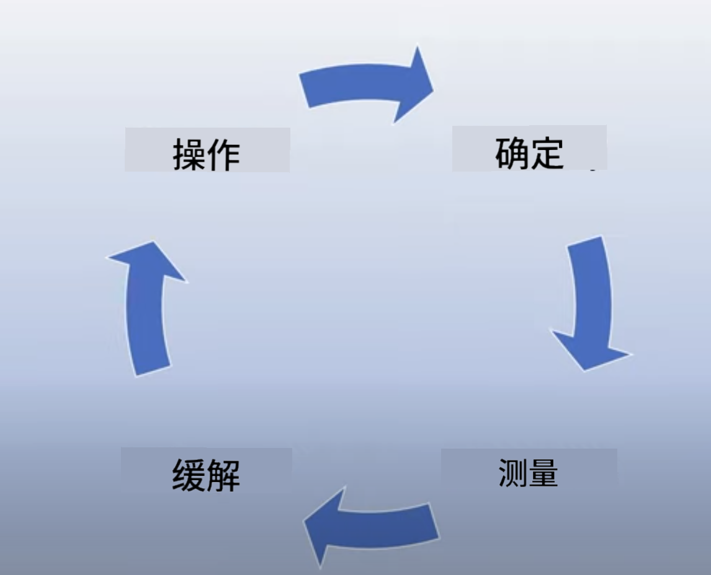

<!--
CO_OP_TRANSLATOR_METADATA:
{
  "original_hash": "13084c6321a2092841b9a081b29497ba",
  "translation_date": "2025-05-19T09:28:23+00:00",
  "source_file": "03-using-generative-ai-responsibly/README.md",
  "language_code": "zh"
}
-->
# 负责任地使用生成式 AI

> _点击上面的图片观看本课的视频_

AI，尤其是生成式 AI，令人着迷，但我们需要考虑如何负责任地使用它。你需要考虑如何确保输出的公平性、无害性等。本章旨在为你提供上述背景，考虑事项，以及如何采取积极步骤来改善你的 AI 使用。

## 介绍

本课将涵盖：

- 为什么在构建生成式 AI 应用程序时应该优先考虑负责任的 AI。
- 负责任的 AI 的核心原则及其与生成式 AI 的关系。
- 如何通过策略和工具将这些负责任的 AI 原则付诸实践。

## 学习目标

完成本课后，你将了解：

- 构建生成式 AI 应用程序时负责任的 AI 的重要性。
- 在构建生成式 AI 应用程序时何时考虑和应用负责任的 AI 的核心原则。
- 可用的工具和策略，以将负责任的 AI 的概念付诸实践。

## 负责任的 AI 原则

生成式 AI 的兴奋度从未如此高。这种兴奋吸引了许多新开发者、关注和资金进入这一领域。虽然这对任何希望使用生成式 AI 构建产品和公司的个人来说是非常积极的，但我们也需要负责任地推进。

在整个课程中，我们专注于构建我们的初创公司和 AI 教育产品。我们将使用负责任的 AI 原则：公平性、包容性、可靠性/安全性、安全性和隐私、透明度和问责制。通过这些原则，我们将探讨它们与我们在产品中使用生成式 AI 的关系。

## 为什么应该优先考虑负责任的 AI

在构建产品时，通过保持用户的最佳利益来采取以人为本的方法会带来最佳结果。

生成式 AI 的独特之处在于其能够为用户创造有用的答案、信息、指导和内容。这可以在没有太多人工步骤的情况下实现，从而产生非常令人印象深刻的结果。没有适当的规划和策略，也可能会导致对用户、产品和整个社会的某些有害结果。

让我们看看一些（但不是全部）这些潜在的有害结果：

### 幻觉

幻觉是指当 LLM 生成的内容完全无意义或根据其他信息来源我们知道是事实错误时使用的术语。

举个例子，我们为我们的初创公司构建了一个功能，让学生可以向模型询问历史问题。学生提出问题 `Who was the sole survivor of Titanic?`

模型产生了如下响应：

> _(来源：[Flying bisons](https://flyingbisons.com?WT.mc_id=academic-105485-koreyst))_

这是一个非常自信和详尽的答案。不幸的是，这是错误的。即使进行最少量的研究，也会发现泰坦尼克号灾难中有不止一个幸存者。对于刚开始研究这一主题的学生来说，这个答案可能足够有说服力，不被质疑并被视为事实。这种后果可能导致 AI 系统不可靠，并对我们的初创公司的声誉产生负面影响。

随着每次 LLM 的迭代，我们已经看到在最小化幻觉方面的性能改进。即使有这种改进，我们作为应用程序构建者和用户仍需意识到这些限制。

### 有害内容

我们在前一节中讨论了当 LLM 生成错误或无意义的响应时。我们需要注意的另一个风险是模型响应有害内容。

有害内容可以定义为：

- 提供指示或鼓励自我伤害或伤害某些群体。
- 仇恨或贬低内容。
- 指导任何类型的攻击或暴力行为的计划。
- 提供有关如何找到非法内容或实施非法行为的指示。
- 显示性露骨内容。

对于我们的初创公司，我们希望确保我们拥有合适的工具和策略，以防止学生看到这种类型的内容。

### 缺乏公平性

公平性被定义为“确保 AI 系统没有偏见和歧视，并且它们公平和平等地对待每个人。”在生成式 AI 的世界中，我们希望确保边缘化群体的排他性世界观不会被模型的输出所强化。

这些类型的输出不仅对构建用户的积极产品体验具有破坏性，还会造成进一步的社会伤害。作为应用程序构建者，我们在使用生成式 AI 构建解决方案时应始终考虑广泛和多样化的用户群体。

## 如何负责任地使用生成式 AI

既然我们已经确定了负责任生成式 AI 的重要性，让我们看看我们可以采取的 4 个步骤，以负责任地构建我们的 AI 解决方案：

### 测量潜在危害

在软件测试中，我们测试用户在应用程序上的预期操作。同样，测试用户最可能使用的多样化提示集是衡量潜在危害的好方法。

由于我们的初创公司正在构建一个教育产品，准备一份与教育相关的提示列表会很好。这可以涵盖某个主题、历史事实以及关于学生生活的提示。

### 减轻潜在危害

现在是时候找到我们可以防止或限制模型及其响应造成潜在危害的方法了。我们可以从 4 个不同的层面来看待这个问题：

- **模型**。为正确的使用案例选择正确的模型。像 GPT-4 这样更大更复杂的模型在应用于较小和更具体的使用案例时可能会导致更多有害内容的风险。使用你的训练数据进行微调也可以减少有害内容的风险。

- **安全系统**。安全系统是在提供模型的平台上帮助减轻危害的一套工具和配置。一个例子是 Azure OpenAI 服务上的内容过滤系统。系统还应检测越狱攻击和不需要的活动，如来自机器人的请求。

- **元提示**。元提示和基础是我们可以根据某些行为和信息引导或限制模型的方法。这可以使用系统输入来定义模型的某些限制。此外，提供更相关于系统范围或领域的输出。

也可以使用像检索增强生成（RAG）这样的技术，让模型仅从一组选定的可信来源中提取信息。本课程后面有一节课是关于[构建搜索应用程序](../08-building-search-applications/README.md?WT.mc_id=academic-105485-koreyst)

- **用户体验**。最后一层是用户通过我们的应用程序界面以某种方式直接与模型交互。在这种方式中，我们可以设计 UI/UX 来限制用户可以发送给模型的输入类型，以及显示给用户的文本或图像。在部署 AI 应用程序时，我们也必须透明地说明我们的生成式 AI 应用程序可以做什么以及不能做什么。

我们有一个专门的课程是关于[设计 AI 应用程序的 UX](../12-designing-ux-for-ai-applications/README.md?WT.mc_id=academic-105485-koreyst)

- **评估模型**。使用 LLM 可能具有挑战性，因为我们并不总是能控制模型训练的数据。无论如何，我们应该始终评估模型的性能和输出。仍然需要衡量模型的准确性、相似性、基础性和输出的相关性。这有助于为利益相关者和用户提供透明度和信任。

### 操作负责任的生成式 AI 解决方案

围绕你的 AI 应用程序构建一个运营实践是最后阶段。这包括与我们初创公司其他部分（如法律和安全）合作，以确保我们符合所有监管政策。在推出之前，我们还希望围绕交付、处理事件和回滚制定计划，以防止对用户的任何伤害增长。

## 工具

虽然开发负责任的 AI 解决方案的工作似乎很多，但这是值得努力的工作。随着生成式 AI 领域的增长，帮助开发者高效地将责任整合到他们的工作流程中的工具将会成熟。例如，[Azure AI 内容安全](https://learn.microsoft.com/azure/ai-services/content-safety/overview?WT.mc_id=academic-105485-koreyst)可以通过 API 请求帮助检测有害内容和图像。

## 知识检查

确保负责任 AI 使用需要关注哪些事项？

1. 答案是否正确。
2. 有害使用，确保 AI 不用于犯罪目的。
3. 确保 AI 没有偏见和歧视。

A：2 和 3 是正确的。负责任的 AI 帮助你考虑如何减轻有害影响和偏见等。

## 🚀 挑战

阅读[Azure AI 内容安全](https://learn.microsoft.com/azure/ai-services/content-safety/overview?WT.mc_id=academic-105485-koreyst)并查看你可以为你的使用采用什么。

## 做得好，继续学习

完成本课后，请查看我们的[生成式 AI 学习合集](https://aka.ms/genai-collection?WT.mc_id=academic-105485-koreyst)，继续提升你的生成式 AI 知识！

前往第 4 课，我们将探讨[提示工程基础](../04-prompt-engineering-fundamentals/README.md?WT.mc_id=academic-105485-koreyst)！

**免责声明**：
本文档使用AI翻译服务[Co-op Translator](https://github.com/Azure/co-op-translator)进行翻译。虽然我们努力确保准确性，但请注意自动翻译可能包含错误或不准确之处。应将原始文档视为权威来源。对于重要信息，建议进行专业人工翻译。对于因使用本翻译而产生的任何误解或误读，我们不承担责任。