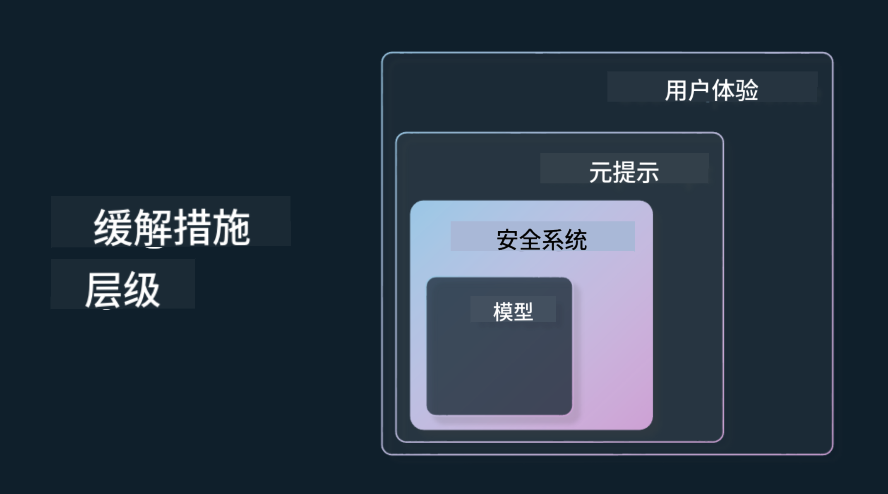

<!--
CO_OP_TRANSLATOR_METADATA:
{
  "original_hash": "7f8f4c11f8c1cb6e1794442dead414ea",
  "translation_date": "2025-07-09T08:48:37+00:00",
  "source_file": "03-using-generative-ai-responsibly/README.md",
  "language_code": "zh"
}
-->
# 负责任地使用生成式 AI

> _点击上方图片观看本课视频_

生成式 AI 很容易让人着迷，但你需要考虑如何负责任地使用它。你需要考虑如何确保输出公平、无害等方面。本章旨在为你提供相关背景、需要考虑的事项，以及如何采取积极措施来提升你的 AI 使用水平。

## 介绍

本课将涵盖：

- 为什么在构建生成式 AI 应用时应优先考虑负责任的 AI。
- 负责任 AI 的核心原则及其与生成式 AI 的关系。
- 如何通过策略和工具将这些负责任 AI 原则付诸实践。

## 学习目标

完成本课后，你将了解：

- 在构建生成式 AI 应用时负责任 AI 的重要性。
- 在构建生成式 AI 应用时何时思考并应用负责任 AI 的核心原则。
- 可用来将负责任 AI 概念付诸实践的工具和策略。

## 负责任 AI 原则

生成式 AI 的热度前所未有。这股热潮吸引了大量新开发者、关注和资金。虽然这对任何希望利用生成式 AI 构建产品和公司的人员来说都是积极的，但我们也必须负责任地前进。

在本课程中，我们专注于构建我们的初创企业和 AI 教育产品。我们将采用负责任 AI 的原则：公平性、包容性、可靠性/安全性、安全与隐私、透明度和问责制。基于这些原则，我们将探讨它们与我们产品中生成式 AI 使用的关系。

## 为什么要优先考虑负责任 AI

构建产品时，采取以人为本的方法，始终把用户的最大利益放在心上，才能取得最佳效果。

生成式 AI 的独特之处在于它能够为用户创造有用的答案、信息、指导和内容。这些都可以在无需大量人工干预的情况下完成，效果令人印象深刻。但如果没有适当的规划和策略，也可能对用户、产品乃至整个社会造成伤害。

让我们看看一些（但不是全部）潜在的有害结果：

### 幻觉

“幻觉”是指大型语言模型（LLM）生成的内容完全无意义，或与其他信息来源的事实明显不符。

举例来说，假设我们为初创企业开发了一个功能，允许学生向模型提问历史问题。学生问：“泰坦尼克号的唯一幸存者是谁？”

模型给出了如下回答：

> _(来源：[Flying bisons](https://flyingbisons.com?WT.mc_id=academic-105485-koreyst))_

这是一个非常自信且详尽的回答，但不幸的是，它是错误的。稍加查证就会发现，泰坦尼克号事故中有多名幸存者。对于刚开始研究该话题的学生来说，这个答案可能足够有说服力，不会被质疑，甚至被当作事实。其后果可能导致 AI 系统不可靠，进而影响我们初创企业的声誉。

随着每一代 LLM 的迭代，我们都看到在减少幻觉方面的性能提升。即便如此，作为应用开发者和用户，我们仍需保持对这些局限性的警觉。

### 有害内容

前面提到 LLM 可能产生错误或无意义的回答，另一个需要注意的风险是模型可能生成有害内容。

有害内容可定义为：

- 提供自残或伤害特定群体的指令或鼓励。
- 仇恨或贬低性的内容。
- 指导策划任何形式的攻击或暴力行为。
- 提供查找非法内容或实施非法行为的指令。
- 展示色情内容。

对于我们的初创企业来说，我们希望确保拥有合适的工具和策略，防止学生看到此类内容。

### 缺乏公平性

公平性指“确保 AI 系统无偏见和歧视，公平平等地对待每个人”。在生成式 AI 领域，我们要确保模型输出不会强化对边缘群体的排斥性世界观。

这类输出不仅破坏用户的积极产品体验，还会对社会造成更大伤害。作为应用开发者，我们应始终考虑广泛且多样化的用户群体，构建包容的生成式 AI 解决方案。

## 如何负责任地使用生成式 AI

既然我们已经认识到负责任生成式 AI 的重要性，接下来看看我们可以采取的 4 个步骤来负责任地构建 AI 解决方案：

### 评估潜在危害

在软件测试中，我们会测试用户对应用的预期操作。同样，测试用户最可能使用的多样化提示，是评估潜在危害的好方法。

由于我们的初创企业正在构建教育产品，准备一份与教育相关的提示列表会很有帮助。内容可以涵盖某个学科、历史事实以及学生生活相关的提示。

### 减轻潜在危害

现在是时候寻找方法，防止或限制模型及其响应可能带来的潜在危害。我们可以从四个层面来考虑：

- **模型层**。为合适的用例选择合适的模型。像 GPT-4 这样更大更复杂的模型，在应用于较小且更具体的用例时，可能带来更多有害内容的风险。利用训练数据进行微调也能降低有害内容的风险。

- **安全系统层**。安全系统是平台上为模型服务的一套工具和配置，帮助减轻危害。例如 Azure OpenAI 服务中的内容过滤系统。系统还应能检测越狱攻击和机器人请求等不良行为。

- **元提示层**。元提示和基础设定是我们引导或限制模型行为和信息的方式。比如使用系统输入定义模型的某些限制，或提供更符合系统范围或领域的输出。

还可以使用检索增强生成（RAG）等技术，让模型仅从可信来源中提取信息。本课程后面有一节课专门讲解[构建搜索应用](../08-building-search-applications/README.md?WT.mc_id=academic-105485-koreyst)。

- **用户体验层**。最后一层是用户通过我们应用界面直接与模型交互。我们可以设计 UI/UX，限制用户发送给模型的输入类型，以及向用户展示的文本或图像。在部署 AI 应用时，也必须透明告知用户生成式 AI 应用的能力和局限。

我们有整节课专门讲解[为 AI 应用设计用户体验](../12-designing-ux-for-ai-applications/README.md?WT.mc_id=academic-105485-koreyst)。

- **评估模型**。使用 LLM 具有挑战性，因为我们无法完全控制模型训练数据。无论如何，我们应始终评估模型的性能和输出。测量模型的准确性、相似度、基础性和相关性仍然很重要，这有助于向利益相关者和用户提供透明度和信任。

### 运营负责任的生成式 AI 解决方案

围绕 AI 应用建立运营实践是最后阶段。这包括与初创企业的法律和安全部门合作，确保遵守所有监管政策。上线前，还需制定交付计划、事件处理和回滚方案，防止用户受到持续伤害。

## 工具

虽然开发负责任 AI 解决方案的工作看似繁重，但非常值得投入。随着生成式 AI 领域的发展，越来越多帮助开发者高效将责任融入工作流程的工具将逐渐成熟。例如，[Azure AI Content Safety](https://learn.microsoft.com/azure/ai-services/content-safety/overview?WT.mc_id=academic-105485-koreyst) 可以通过 API 请求帮助检测有害内容和图像。

## 知识检测

为了确保负责任地使用 AI，你需要关注哪些方面？

1. 答案是否正确。
1. 防止有害使用，确保 AI 不被用于犯罪目的。
1. 确保 AI 无偏见和歧视。

答：2 和 3 正确。负责任 AI 帮助你考虑如何减轻有害影响和偏见等问题。

## 🚀 挑战

阅读[Azure AI Content Safety](https://learn.microsoft.com/azure/ai-services/content-safety/overview?WT.mc_id=academic-105485-koreyst)，看看你能为自己的使用采纳哪些措施。

## 干得好，继续学习

完成本课后，查看我们的[生成式 AI 学习合集](https://aka.ms/genai-collection?WT.mc_id=academic-105485-koreyst)，继续提升你的生成式 AI 知识！

前往第 4 课，我们将学习[提示工程基础](../04-prompt-engineering-fundamentals/README.md?WT.mc_id=academic-105485-koreyst)！

**免责声明**：  
本文件使用 AI 翻译服务 [Co-op Translator](https://github.com/Azure/co-op-translator) 进行翻译。虽然我们力求准确，但请注意，自动翻译可能包含错误或不准确之处。原始文件的母语版本应被视为权威来源。对于重要信息，建议采用专业人工翻译。对于因使用本翻译而产生的任何误解或误释，我们概不负责。