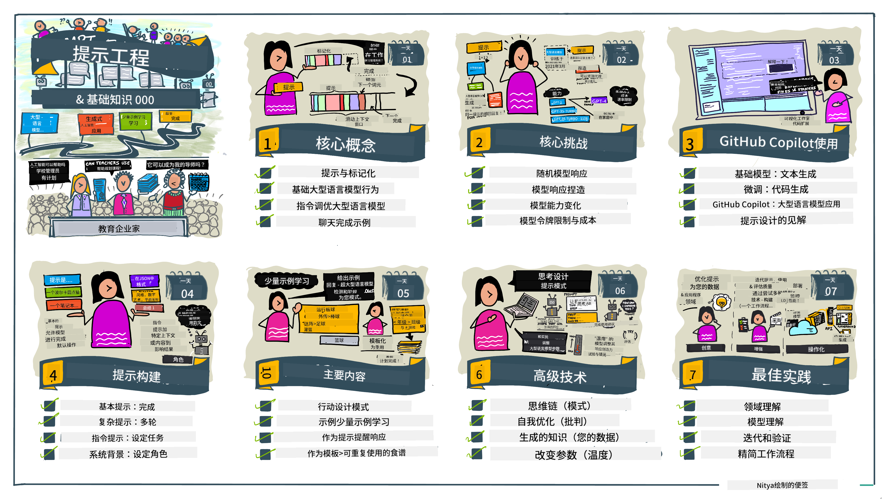
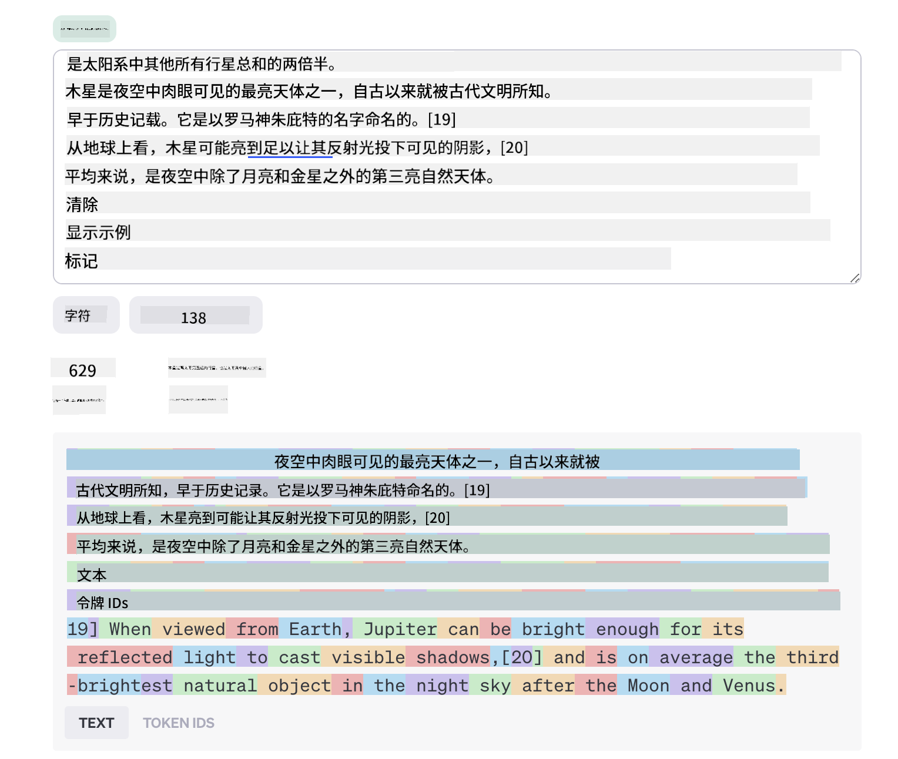
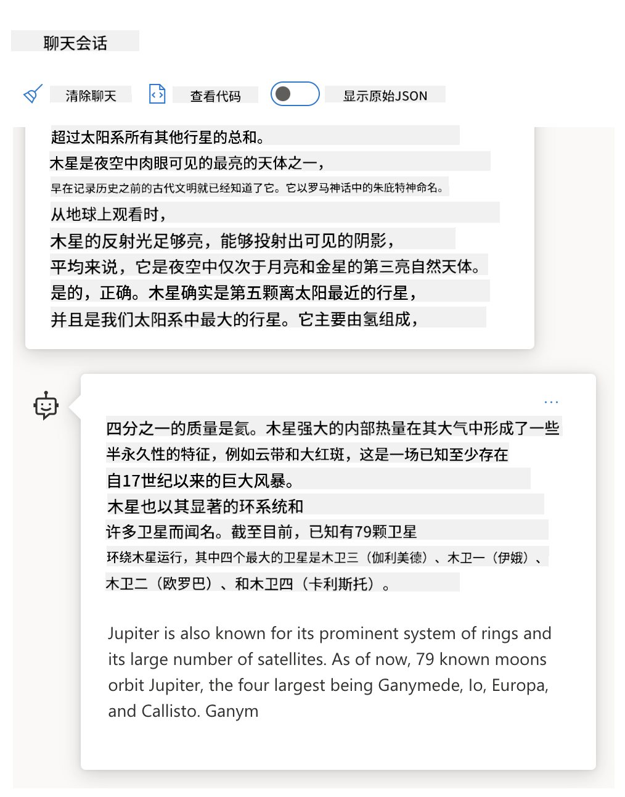
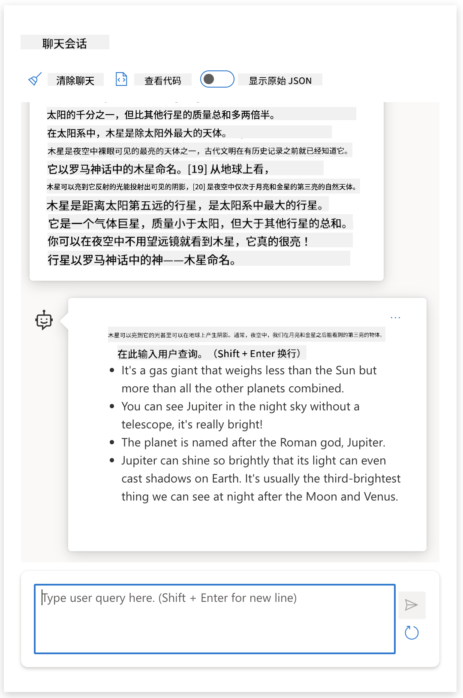
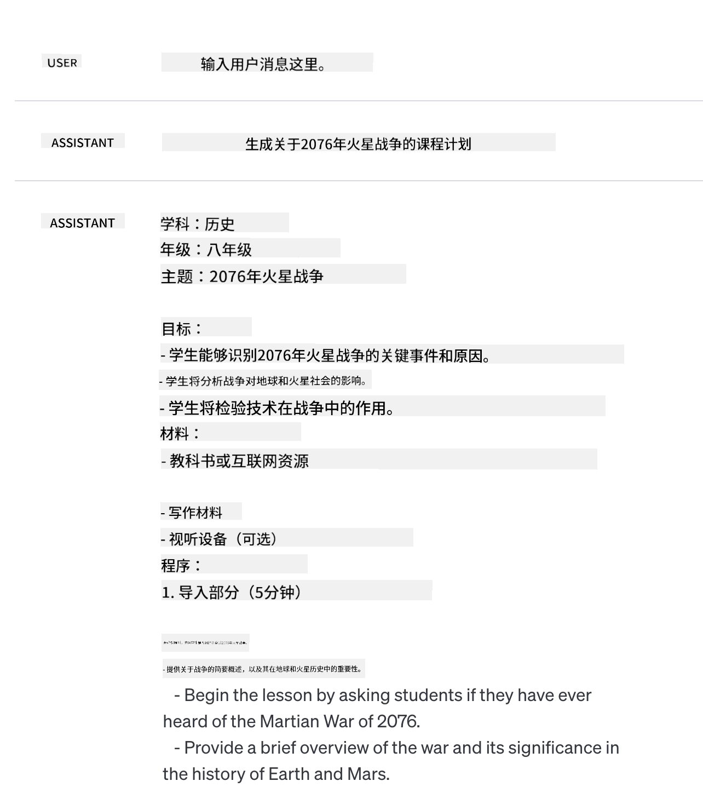
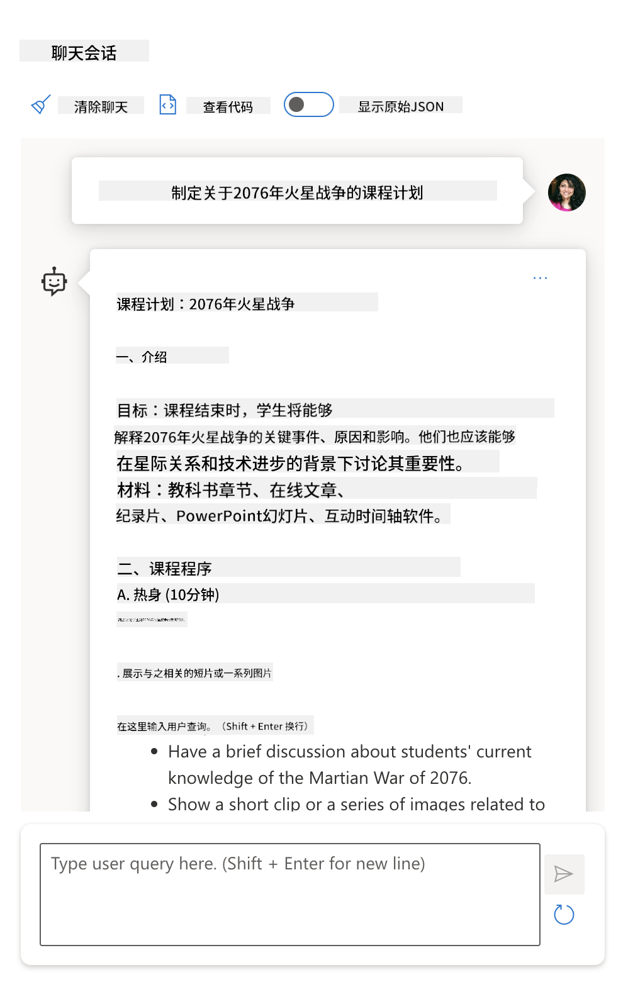
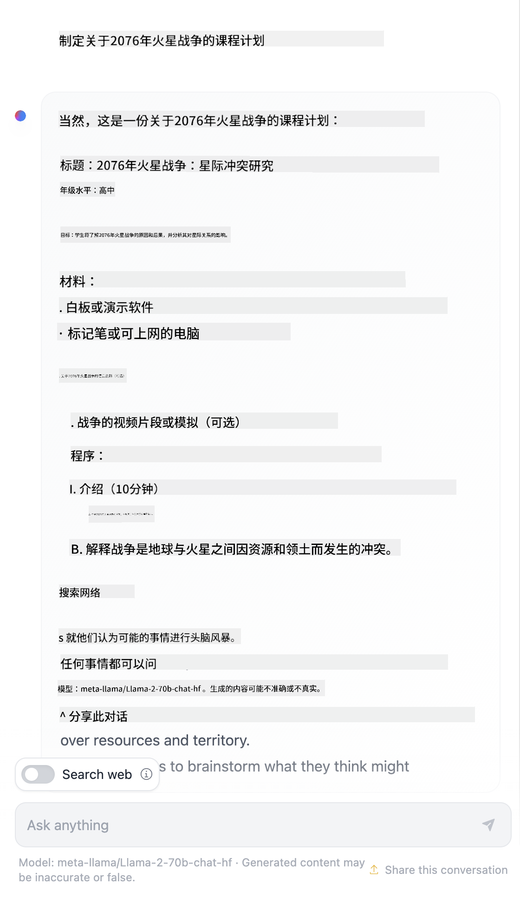

<!--
CO_OP_TRANSLATOR_METADATA:
{
  "original_hash": "a45c318dc6ebc2604f35b8b829f93af2",
  "translation_date": "2025-07-09T09:30:13+00:00",
  "source_file": "04-prompt-engineering-fundamentals/README.md",
  "language_code": "zh"
}
-->
# Prompt Engineering Fundamentals

[](https://aka.ms/gen-ai-lesson4-gh?WT.mc_id=academic-105485-koreyst)

## 介绍
本模块涵盖了在生成式 AI 模型中创建有效提示词的基本概念和技巧。你向大型语言模型（LLM）编写提示词的方式同样重要。精心设计的提示词能够获得更高质量的回复。但“提示词”和“提示工程”这些术语到底是什么意思？我该如何改进发送给 LLM 的提示词输入？这些问题将在本章及下一章中为你解答。

_生成式 AI_ 能够根据用户请求创造新的内容（例如文本、图像、音频、代码等）。它通过使用像 OpenAI 的 GPT（“生成式预训练变换器”）系列这样的大型语言模型实现，这些模型经过自然语言和代码的训练。

用户现在可以通过类似聊天的熟悉方式与这些模型交互，无需任何技术专长或培训。这些模型是基于_提示词_的——用户发送文本输入（提示词），模型返回 AI 回复（完成内容）。用户可以通过多轮对话不断“与 AI 聊天”，不断优化提示词，直到回复符合预期。

“提示词”现已成为生成式 AI 应用的主要_编程接口_，告诉模型该做什么，并影响返回回复的质量。“提示工程”是一个快速发展的研究领域，专注于_设计和优化_提示词，以实现规模化的稳定且高质量的回复。

## 学习目标

本课将介绍什么是提示工程、它为何重要，以及如何为特定模型和应用目标设计更有效的提示词。我们将理解提示工程的核心概念和最佳实践，并了解一个交互式 Jupyter Notebook “沙盒”环境，在那里可以看到这些概念如何应用于实际示例。

完成本课后，你将能够：

1. 解释什么是提示工程及其重要性。
2. 描述提示词的组成部分及其用途。
3. 学习提示工程的最佳实践和技巧。
4. 使用 OpenAI 端点将所学技巧应用于实际示例。

## 关键词

提示工程：设计和优化输入以引导 AI 模型生成期望输出的实践。  
分词（Tokenization）：将文本转换为模型可以理解和处理的更小单元（称为“token”）的过程。  
指令调优大型语言模型（Instruction-Tuned LLMs）：经过特定指令微调以提升回复准确性和相关性的大型语言模型。

## 学习沙盒

提示工程目前更多是一门艺术而非科学。提升直觉的最佳方式是_多加练习_，采用结合应用领域专业知识、推荐技巧和模型特定优化的反复试验方法。

本课配套的 Jupyter Notebook 提供了一个_沙盒_环境，你可以在学习过程中或课后代码挑战中尝试所学内容。执行练习需要：

1. **Azure OpenAI API 密钥**——已部署 LLM 的服务端点。  
2. **Python 运行环境**——用于执行 Notebook。  
3. **本地环境变量**——请先完成[SETUP](./../00-course-setup/SETUP.md?WT.mc_id=academic-105485-koreyst)步骤以准备环境。

Notebook 附带了_入门_练习，但鼓励你添加自己的_Markdown_（描述）和_代码_（提示请求）部分，尝试更多示例或想法，培养提示设计的直觉。

## 图解指南

想在深入学习前先了解本课的整体内容吗？看看这份图解指南，它帮助你把握主要主题和每个主题的关键要点。课程路线图将带你从理解核心概念和挑战，到用相关提示工程技巧和最佳实践应对这些挑战。请注意，本指南中的“高级技巧”部分涉及本课程_下一章_的内容。



## 我们的创业项目

现在，让我们谈谈_本主题_如何与我们创业项目的使命相关——[将 AI 创新带入教育](https://educationblog.microsoft.com/2023/06/collaborating-to-bring-ai-innovation-to-education?WT.mc_id=academic-105485-koreyst)。我们希望构建基于 AI 的_个性化学习_应用——所以让我们思考不同用户如何“设计”提示词：

- **管理员**可能会让 AI_分析课程数据以识别覆盖的空白点_。AI 可以总结结果或用代码进行可视化。  
- **教育者**可能会让 AI_为特定受众和主题生成课程计划_。AI 可以以指定格式构建个性化计划。  
- **学生**可能会让 AI_辅导他们攻克难题_。AI 现在可以根据学生水平提供课程、提示和示例。

这只是冰山一角。查看[教育提示词库](https://github.com/microsoft/prompts-for-edu/tree/main?WT.mc_id=academic-105485-koreyst)——由教育专家策划的开源提示词库，了解更多可能性！_试着在沙盒或 OpenAI Playground 中运行这些提示词，看看效果！_

<!--
LESSON TEMPLATE:
This unit should cover core concept #1.
Reinforce the concept with examples and references.

CONCEPT #1:
Prompt Engineering.
Define it and explain why it is needed.
-->

## 什么是提示工程？

我们从定义**提示工程**开始，它是为特定应用目标和模型_设计和优化_文本输入（提示词），以提供稳定且高质量回复（完成内容）的过程。可以把它看作一个两步走的过程：

- 为特定模型和目标_设计_初始提示词  
- 反复_优化_提示词以提升回复质量

这必然是一个反复试验的过程，需要用户的直觉和努力才能获得最佳结果。那么它为何重要？为回答这个问题，我们先了解三个概念：

- _分词_ = 模型如何“看待”提示词  
- _基础 LLM_ = 基础模型如何“处理”提示词  
- _指令调优 LLM_ = 模型如何“理解任务”

### 分词

LLM 将提示词视为_一串 token_，不同模型（或同一模型的不同版本）对同一提示词的分词方式可能不同。由于 LLM 是基于 token（而非原始文本）训练的，提示词的分词方式直接影响生成回复的质量。

想了解分词如何工作，可以试试下面的[OpenAI Tokenizer](https://platform.openai.com/tokenizer?WT.mc_id=academic-105485-koreyst)工具。复制你的提示词，观察它如何被转换成 token，注意空格和标点的处理方式。请注意，此示例使用的是较旧的 LLM（GPT-3），用新模型测试可能结果不同。



### 概念：基础模型

提示词分词后，["基础 LLM"](https://blog.gopenai.com/an-introduction-to-base-and-instruction-tuned-large-language-models-8de102c785a6?WT.mc_id=academic-105485-koreyst)（或基础模型）的主要功能是预测序列中的下一个 token。由于 LLM 训练于海量文本数据，它们对 token 之间的统计关系有较好把握，能较自信地做出预测。请注意，它们并不理解提示词或 token 的_含义_，只是看到一个可以“补全”的模式。它们会持续预测序列，直到用户干预或达到预设条件。

想看看基于提示词的完成是如何工作的吗？将上述提示词输入 Azure OpenAI Studio 的[_Chat Playground_](https://oai.azure.com/playground?WT.mc_id=academic-105485-koreyst)，使用默认设置。系统将提示词视为信息请求，你应该会看到符合该上下文的回复。

但如果用户想看到符合某些条件或任务目标的特定内容呢？这时就需要用到_指令调优_的 LLM。



### 概念：指令调优 LLM

[指令调优 LLM](https://blog.gopenai.com/an-introduction-to-base-and-instruction-tuned-large-language-models-8de102c785a6?WT.mc_id=academic-105485-koreyst)是在基础模型基础上，通过示例或输入/输出对（例如多轮“消息”）进行微调，这些示例包含明确指令，AI 的回复尝试遵循这些指令。

这采用了如人类反馈强化学习（RLHF）等技术，训练模型_遵循指令_并_从反馈中学习_，使其生成更适合实际应用且更符合用户目标的回复。

我们来试试——回到上面的提示词，将_系统消息_改为以下指令作为上下文：

> _为二年级学生总结你收到的内容。结果保持为一段话，包含3-5个要点。_

看看结果如何调整以反映期望的目标和格式？教育者现在可以直接将此回复用于课堂幻灯片。



## 为什么需要提示工程？

既然我们知道提示词是如何被 LLM 处理的，接下来谈谈_为什么_需要提示工程。原因在于当前 LLM 存在一些挑战，使得_可靠且一致的完成内容_难以在不投入提示构建和优化工作的情况下实现。例如：

1. **模型回复具有随机性。**_相同的提示词_在不同模型或模型版本中可能产生不同回复，甚至同一模型在不同时间也可能产生不同结果。_提示工程技巧能帮助我们通过更好的约束减少这些差异_。

1. **模型可能编造回复。**模型预训练于_庞大但有限_的数据集，缺乏训练范围外的知识。因此，它们可能生成不准确、虚构或与已知事实直接矛盾的内容。_提示工程技巧帮助用户识别并减轻此类编造，例如要求 AI 提供引用或推理_。

1. **模型能力各异。**新模型或新一代模型功能更强，但也带来成本和复杂性的独特权衡。_提示工程能帮助我们制定最佳实践和工作流程，抽象差异并适应模型特定需求，实现可扩展且无缝的应用_。

让我们在 OpenAI 或 Azure OpenAI Playground 中实际体验：

- 用相同提示词测试不同 LLM 部署（如 OpenAI、Azure OpenAI、Hugging Face）——你发现了哪些差异？  
- 用相同提示词多次测试_同一_ LLM 部署（如 Azure OpenAI Playground）——这些差异如何变化？

### 编造示例

在本课程中，我们用**“编造”**一词指代 LLM 有时因训练限制或其他约束而生成事实错误信息的现象。你可能在流行文章或研究论文中听过“幻觉”（hallucinations）一词，但我们强烈建议使用“编造”，以避免将机器行为拟人化，赋予其人类特质。这也符合[负责任 AI 指南](https://www.microsoft.com/ai/responsible-ai?WT.mc_id=academic-105485-koreyst)的术语规范，避免使用在某些语境下可能被视为冒犯或不包容的词汇。

想了解编造是如何发生的吗？想象一个提示词，指示 AI 生成一个不存在主题的内容（确保该主题不在训练数据中）。例如——我尝试了这个提示词：
# 火星战争2076年课程计划

## 课程目标
- 了解2076年火星战争的背景和起因
- 分析战争的主要事件和关键战役
- 探讨战争对地球和火星社会的影响
- 培养学生的批判性思维和历史分析能力

## 课程大纲

### 第一课：火星战争的背景
- 火星殖民的发展历程
- 地球与火星之间的政治经济关系
- 导致战争爆发的主要因素

### 第二课：战争的爆发与初期战况
- 2076年战争爆发的导火索
- 主要参战方介绍
- 初期战役的战略与战术分析

### 第三课：关键战役与转折点
- 重要战役回顾
- 技术与武器的应用
- 战争进程中的重大转折

### 第四课：战争的结束与后果
- 和平协议的签订过程
- 战争对火星和地球的影响
- 战争遗留的问题与未来展望

## 教学活动建议
- 小组讨论：战争爆发的原因及其合理性
- 角色扮演：模拟和平谈判
- 资料分析：研究战争期间的新闻报道和官方文件

## 评估方式
- 课堂参与和讨论表现
- 书面报告：分析某一关键战役
- 期末考试：涵盖战争背景、过程及影响的综合题目
网络搜索显示，有关于火星战争的虚构故事（例如电视剧或书籍）存在，但没有发生在2076年。常识也告诉我们，2076年是_未来_，因此不可能与真实事件相关联。

那么，当我们用不同的LLM提供商运行这个提示时，会发生什么？

> **Response 1**: OpenAI Playground (GPT-35)



> **Response 2**: Azure OpenAI Playground (GPT-35)



> **Response 3**: : Hugging Face Chat Playground (LLama-2)



正如预期，每个模型（或模型版本）由于随机性行为和模型能力的差异，产生了略有不同的回答。例如，一个模型面向8年级学生，而另一个则假设是高中生。但这三个模型都生成了可能让不了解情况的用户相信该事件真实存在的回答。

像_元提示_和_温度配置_这样的提示工程技术，可能在一定程度上减少模型的虚构内容。新的提示工程_架构_也将新工具和技术无缝集成到提示流程中，以缓解或减少这些影响。

## 案例研究：GitHub Copilot

让我们通过一个案例研究来了解提示工程在现实解决方案中的应用：[GitHub Copilot](https://github.com/features/copilot?WT.mc_id=academic-105485-koreyst)。

GitHub Copilot 是你的“AI 编程搭档”——它将文本提示转换为代码补全，并集成在你的开发环境中（例如 Visual Studio Code），提供无缝的用户体验。正如下面一系列博客所述，最早的版本基于 OpenAI Codex 模型——工程师们很快意识到需要微调模型并开发更好的提示工程技术，以提升代码质量。今年7月，他们[推出了超越 Codex 的改进型 AI 模型](https://github.blog/2023-07-28-smarter-more-efficient-coding-github-copilot-goes-beyond-codex-with-improved-ai-model/?WT.mc_id=academic-105485-koreyst)，以实现更快的建议。

请按顺序阅读这些文章，跟随他们的学习历程。

- **2023年5月** | [GitHub Copilot 在理解你的代码方面变得更好](https://github.blog/2023-05-17-how-github-copilot-is-getting-better-at-understanding-your-code/?WT.mc_id=academic-105485-koreyst)
- **2023年5月** | [GitHub 内部揭秘：与 GitHub Copilot 背后的 LLMs 合作](https://github.blog/2023-05-17-inside-github-working-with-the-llms-behind-github-copilot/?WT.mc_id=academic-105485-koreyst)
- **2023年6月** | [如何为 GitHub Copilot 编写更好的提示](https://github.blog/2023-06-20-how-to-write-better-prompts-for-github-copilot/?WT.mc_id=academic-105485-koreyst)
- **2023年7月** | [GitHub Copilot 通过改进的 AI 模型超越 Codex](https://github.blog/2023-07-28-smarter-more-efficient-coding-github-copilot-goes-beyond-codex-with-improved-ai-model/?WT.mc_id=academic-105485-koreyst)
- **2023年7月** | [开发者的提示工程与 LLM 指南](https://github.blog/2023-07-17-prompt-engineering-guide-generative-ai-llms/?WT.mc_id=academic-105485-koreyst)
- **2023年9月** | [如何构建企业级 LLM 应用：GitHub Copilot 的经验教训](https://github.blog/2023-09-06-how-to-build-an-enterprise-llm-application-lessons-from-github-copilot/?WT.mc_id=academic-105485-koreyst)

你还可以浏览他们的[工程博客](https://github.blog/category/engineering/?WT.mc_id=academic-105485-koreyst)，阅读更多类似[这篇](https://github.blog/2023-09-27-how-i-used-github-copilot-chat-to-build-a-reactjs-gallery-prototype/?WT.mc_id=academic-105485-koreyst)的文章，了解这些模型和技术如何_应用_于推动现实世界的项目。

---

<!--
LESSON TEMPLATE:
This unit should cover core concept #2.
Reinforce the concept with examples and references.

CONCEPT #2:
Prompt Design.
Illustrated with examples.
-->

## 提示构建

我们已经了解了提示工程为何重要——现在让我们理解提示是如何_构建_的，以便评估不同技术，实现更有效的提示设计。

### 基础提示

先从基础提示开始：向模型发送一段没有其他上下文的文本输入。举个例子——当我们将美国国歌的开头几句发送给 OpenAI 的[Completion API](https://platform.openai.com/docs/api-reference/completions?WT.mc_id=academic-105485-koreyst)，它会立即_补全_接下来的几句，展示了基本的预测行为。

| Prompt (输入)       | Completion (输出)                                                                                                                        |
| :----------------- | :----------------------------------------------------------------------------------------------------------------------------------------- |
| Oh say can you see | 听起来你正在开始唱《星条旗永不落》（The Star-Spangled Banner），这是美国的国歌。完整歌词是... |

### 复杂提示

现在让我们在基础提示上添加上下文和指令。[Chat Completion API](https://learn.microsoft.com/azure/ai-services/openai/how-to/chatgpt?WT.mc_id=academic-105485-koreyst)允许我们将复杂提示构建为一组_消息_，包括：

- 反映_用户_输入和_助手_回复的输入/输出对。
- 设置助手行为或个性的系统消息。

请求现在采用如下形式，其中_分词_有效捕捉了上下文和对话中的相关信息。改变系统上下文对补全质量的影响，可能和用户输入一样显著。

```python
response = openai.chat.completions.create(
    model="gpt-3.5-turbo",
    messages=[
        {"role": "system", "content": "You are a helpful assistant."},
        {"role": "user", "content": "Who won the world series in 2020?"},
        {"role": "assistant", "content": "The Los Angeles Dodgers won the World Series in 2020."},
        {"role": "user", "content": "Where was it played?"}
    ]
)
```

### 指令提示

在上述示例中，用户提示是一个简单的文本查询，可以被理解为信息请求。使用_指令_提示，我们可以用文本更详细地指定任务，为AI提供更好的指导。举个例子：

| Prompt (输入)                                                                                                                                                                                                                         | Completion (输出)                                                                                                        | 指令类型            |
| :------------------------------------------------------------------------------------------------------------------------------------------------------------------------------------------------------------------------------------- | :------------------------------------------------------------------------------------------------------------------------- | :------------------ |
| Write a description of the Civil War                                                                                                                                                                                                   | _返回了一个简单段落_                                                                                              | 简单                |
| Write a description of the Civil War. Provide key dates and events and describe their significance                                                                                                                                     | _返回了一个段落，后面跟着关键事件日期及描述的列表_                                             | 复杂                |
| Write a description of the Civil War in 1 paragraph. Provide 3 bullet points with key dates and their significance. Provide 3 more bullet points with key historical figures and their contributions. Return the output as a JSON file | _返回了更详细的内容，格式为JSON文本框，你可以复制粘贴到文件中并根据需要验证_ | 复杂，格式化        |

## 主要内容

在上述示例中，提示仍然相当开放，允许LLM决定其预训练数据集中哪些部分相关。使用_主要内容_设计模式，输入文本被分为两部分：

- 指令（动作）
- 相关内容（影响动作）

下面是一个示例，指令是“用两句话总结这段内容”。

| Prompt (输入)                                                                                                                                                                                                                                                                                                                                                                                                                                                                                                                                                                                                                                                                                      | Completion (输出)                                                                                                                                                                                                                                                                             |
| :-------------------------------------------------------------------------------------------------------------------------------------------------------------------------------------------------------------------------------------------------------------------------------------------------------------------------------------------------------------------------------------------------------------------------------------------------------------------------------------------------------------------------------------------------------------------------------------------------------------------------------------------------------------------------------------------------- | :---------------------------------------------------------------------------------------------------------------------------------------------------------------------------------------------------------------------------------------------------------------------------------------------- |
| Jupiter is the fifth planet from the Sun and the largest in the Solar System. It is a gas giant with a mass one-thousandth that of the Sun, but two-and-a-half times that of all the other planets in the Solar System combined. Jupiter is one of the brightest objects visible to the naked eye in the night sky, and has been known to ancient civilizations since before recorded history. It is named after the Roman god Jupiter.[19] When viewed from Earth, Jupiter can be bright enough for its reflected light to cast visible shadows,[20] and is on average the third-brightest natural object in the night sky after the Moon and Venus. <br/> **Summarize this in 2 short sentences** | 木星是太阳系中第五颗行星，也是最大的行星。它是一颗气态巨行星，质量是太阳的千分之一，但却是太阳系其他所有行星质量总和的两倍半。木星是夜空中肉眼可见的最亮天体之一，自古代文明以来就为人所知。它以罗马神朱庇特命名。[19] 从地球观察，木星反射的光线足够明亮，甚至能投下可见的影子，[20] 平均而言，它是夜空中继月亮和金星之后第三亮的自然天体。<br/>**用两句话简短总结这段内容** | 木星是太阳系中第五颗行星，也是最大的行星，夜空中最亮的天体之一。它以罗马神朱庇特命名，是一颗质量相当于其他所有行星总和两倍半的气态巨行星。 |

主要内容部分可以用多种方式来驱动更有效的指令：

- **示例**——不是直接告诉模型该做什么，而是给出示例，让模型推断模式。
- **提示**——在指令后跟一个“提示”，引导模型生成更相关的回答。
- **模板**——可重复使用的“配方”，带有占位符（变量），可用具体数据定制以满足特定需求。

让我们来看看这些方法的实际应用。

### 使用示例

这是一种用主要内容“喂给模型”一些期望输出示例的方法，让模型推断出期望输出的模式。根据示例数量不同，可以有零样本提示、一样本提示、少样本提示等。

提示现在包含三个部分：

- 任务描述
- 一些期望输出的示例
- 新示例的开头（隐含的任务描述）

| 学习类型       | Prompt (输入)                                                                                                                                        | Completion (输出)         |
| :------------ | :---------------------------------------------------------------------------------------------------------------------------------------------------- | :-------------------------- |
| 零样本         | "The Sun is Shining". Translate to Spanish                                                                                                            | "El Sol está brillando".    |
| 一样本         | "The Sun is Shining" => ""El Sol está brillando". <br> "It's a Cold and Windy Day" =>                                                                 | "Es un día frío y ventoso". |
| 少样本         | The player ran the bases => Baseball <br/> The player hit an ace => Tennis <br/> The player hit a six => Cricket <br/> The player made a slam-dunk => | Basketball                  |
|               |                                                                                                                                                       |                             |

注意，在零样本提示中我们必须明确指令（“Translate to Spanish”），但在一样本提示中，模型能推断出指令。少样本示例显示，增加更多示例可以让模型在没有额外指令的情况下做出更准确的推断。

### 提示线索

另一种使用主要内容的技巧是提供_线索_而非示例。在这种情况下，我们通过_先给出_一个反映期望回答格式的片段，给模型一个正确方向的提示。模型随后“接住线索”，继续以相同风格生成内容。

| 线索数量       | Prompt (输入)                                                                                                                                                                                                                                                                                                                                                                                                                                               | Completion (输出)                                                                                                                                                                                                                                                                                       |
| :------------- | :----------------------------------------------------------------------------------------------------------------------------------------------------------------------------------------------------------------------------------------------------------------------------------------------------------------------------------------------------------------------------------------------------------------------------------------------------------- | :-------------------------------------------------------------------------------------------------------------------------------------------------------------------------------------------------------------------------------------------------------------------------------------------------------- |
| 0              | 木星是太阳系中第五颗行星，也是最大的行星。它是一颗气态巨行星，质量是太阳的千分之一，但却是太阳系其他所有行星质量总和的两倍半。木星是夜空中肉眼可见的最亮天体之一，自古代文明以来就为人所知。

**Summarize This**                                       | 木星是太阳系中最大的行星，也是距离太阳第五远的行星。它是一颗气态巨行星，质量约为太阳的千分之一，但比其他所有行星的总和还要重。古代文明早已知晓木星，它在夜空中非常容易被看到。 |
| 1              | 木星是距离太阳第五的行星，也是太阳系中最大的行星。它是一颗气态巨行星，质量约为太阳的千分之一，但比太阳系中所有其他行星的总和还要重两倍半。木星是夜空中肉眼可见的最亮天体之一，自有文字记载之前就已为古代文明所知。<br/>**Summarize This** <br/> 我们了解到，木星 | 是距离太阳第五的行星，也是太阳系中最大的行星。它是一颗气态巨行星，质量约为太阳的千分之一，但比所有其他行星的总和还要重两倍半。它肉眼可见，自古以来就为人所知。                        |
| 2              | 木星是距离太阳第五的行星，也是太阳系中最大的行星。它是一颗气态巨行星，质量约为太阳的千分之一，但比太阳系中所有其他行星的总和还要重两倍半。木星是夜空中肉眼可见的最亮天体之一，自有文字记载之前就已为古代文明所知。<br/>**Summarize This** <br/> 我们学到的三大事实：         | 1. 木星是距离太阳第五的行星，也是太阳系中最大的行星。<br/> 2. 它是一颗气态巨行星，质量约为太阳的千分之一……<br/> 3. 木星自古以来就能用肉眼看到……                                                                       |
|                |                                                                                                                                                                                                                                                                                                                                                                                                                                                              |                                                                                                                                                                                                                                                                                                           |

### Prompt Templates

提示模板是一种_预定义的提示配方_，可以存储并根据需要重复使用，以实现更一致的大规模用户体验。最简单的形式，就是像[OpenAI的这个示例](https://platform.openai.com/examples?WT.mc_id=academic-105485-koreyst)那样，提供交互式提示组件（用户和系统消息）以及基于API的请求格式——支持重复使用。

更复杂的形式，如[LangChain的示例](https://python.langchain.com/docs/concepts/prompt_templates/?WT.mc_id=academic-105485-koreyst)，包含_占位符_，可以用来自各种来源的数据（用户输入、系统上下文、外部数据源等）动态替换，从而生成提示。这使我们能够创建可编程的可重用提示库，用于驱动一致的用户体验。

最终，模板的真正价值在于能够为垂直应用领域创建和发布_提示库_——提示模板经过_优化_，反映特定应用的上下文或示例，使响应对目标用户更相关、更准确。[Prompts For Edu](https://github.com/microsoft/prompts-for-edu?WT.mc_id=academic-105485-koreyst)仓库就是一个很好的例子，专注于教育领域，强调课程规划、课程设计、学生辅导等关键目标，策划了一系列提示。

## Supporting Content

如果我们把提示构建看作包含指令（任务）和目标（主要内容），那么_次要内容_就像是我们提供的额外上下文，用来**以某种方式影响输出**。它可以是调优参数、格式说明、主题分类等，帮助模型_调整_响应以满足期望的用户目标或需求。

例如：给定一个包含丰富元数据（名称、描述、级别、元数据标签、讲师等）的课程目录：

- 我们可以定义一个指令“总结2023年秋季课程目录”
- 用主要内容提供几个期望输出的示例
- 用次要内容确定最关注的5个“标签”

这样，模型可以按照示例格式给出总结——如果结果包含多个标签，则优先考虑次要内容中确定的5个标签。

---

<!--
LESSON TEMPLATE:
本单元应涵盖核心概念#1。
通过示例和参考资料强化该概念。

概念#3：
提示工程技术。
有哪些基本的提示工程技术？
通过练习进行说明。
-->

## Prompting Best Practices

既然我们知道了提示如何_构建_，接下来可以开始思考如何_设计_提示以体现最佳实践。可以从两个方面考虑——拥有正确的_心态_和应用合适的_技巧_。

### Prompt Engineering Mindset

提示工程是一个反复试验的过程，请牢记以下三大指导原则：

1. **领域理解很重要。** 响应的准确性和相关性取决于应用或用户所处的_领域_。运用你的直觉和领域专业知识，进一步**定制技巧**。例如，在系统提示中定义_领域特定的角色_，或在用户提示中使用_领域特定的模板_。提供反映领域上下文的次要内容，或用_领域特定的线索和示例_引导模型采用熟悉的用法。

2. **模型理解很重要。** 我们知道模型本质上是随机的。但不同模型在训练数据（预训练知识）、提供的能力（如API或SDK）以及优化内容类型（代码、图像、文本等）方面可能不同。了解你所用模型的优势和局限，利用这些知识_优先安排任务_或构建_针对模型能力优化的定制模板_。

3. **迭代与验证很重要。** 模型和提示工程技术都在快速发展。作为领域专家，你可能有特定应用的其他背景或标准，这些可能不适用于更广泛的社区。利用提示工程工具和技术“快速启动”提示构建，然后用你的直觉和领域专业知识迭代验证结果。记录你的见解，创建一个**知识库**（如提示库），供他人作为新基线，加快未来迭代。

## Best Practices

下面是[OpenAI](https://help.openai.com/en/articles/6654000-best-practices-for-prompt-engineering-with-openai-api?WT.mc_id=academic-105485-koreyst)和[Azure OpenAI](https://learn.microsoft.com/azure/ai-services/openai/concepts/prompt-engineering#best-practices?WT.mc_id=academic-105485-koreyst)实践者推荐的常见最佳实践。

| 内容                              | 原因                                                                                                                                                                                                                                               |
| :-------------------------------- | :------------------------------------------------------------------------------------------------------------------------------------------------------------------------------------------------------------------------------------------------ |
| 评估最新模型                     | 新一代模型通常功能更强、质量更高，但可能成本更高。评估其影响后再决定是否迁移。                                                                                                                                                |
| 分离指令与上下文                 | 检查你的模型/服务是否定义了_分隔符_，以更清晰地区分指令、主要内容和次要内容。这有助于模型更准确地为各部分分配权重。                                                                                                                         |
| 具体且清晰                       | 提供更多关于期望上下文、结果、长度、格式、风格等细节，有助于提升响应质量和一致性。将配方记录在可复用模板中。                                                                                                                          |
| 详细描述，使用示例               | 模型对“示范加说明”的方式反应更好。先用“零样本”方式给出指令（无示例），再用“少样本”方式提供几个期望输出示例进行优化。可用类比辅助说明。                                                                                                   |
| 用线索启动完成                 | 通过给出一些引导词或短语，帮助模型从期望的方向开始生成响应。                                                                                                               |
| 反复强调                         | 有时需要对模型重复说明。可在主要内容前后都给出指令，或同时使用指令和线索。不断迭代验证，找出有效方法。                                                                                                                         |
| 顺序很重要                       | 向模型呈现信息的顺序可能影响输出，尤其是示例中，因近期偏好效应。尝试不同顺序，找出最佳方案。                                                               |
| 给模型“退路”                   | 给模型一个_备用_的完成响应，以防无法完成任务。这能减少模型生成错误或虚假信息的概率。                                                         |
|                                   |                                                                                                                                                                                                                                                   |

和任何最佳实践一样，记住_实际效果因模型、任务和领域而异_。将这些作为起点，反复调整，找到最适合你的方法。随着新模型和工具的出现，持续重新评估你的提示工程流程，重点关注流程的可扩展性和响应质量。

<!--
LESSON TEMPLATE:
本单元如适用，应提供代码挑战

挑战：
链接到一个Jupyter Notebook，指令中只有代码注释（代码部分为空）。

解决方案：
链接到该Notebook的一个副本，填充并运行提示，展示一个示例输出。
-->

## Assignment

恭喜你完成本课！现在是时候用真实示例检验所学的概念和技巧了！

本次作业将使用一个Jupyter Notebook，里面有可交互完成的练习。你也可以在Notebook中添加自己的Markdown和代码单元，探索更多想法和技巧。

### 开始前，先fork仓库，然后

- （推荐）启动GitHub Codespaces
- （或者）将仓库克隆到本地设备，配合Docker Desktop使用
- （或者）用你喜欢的Notebook运行环境打开Notebook

### 接下来，配置环境变量

- 将仓库根目录下的`.env.copy`文件复制为`.env`，填写`AZURE_OPENAI_API_KEY`、`AZURE_OPENAI_ENDPOINT`和`AZURE_OPENAI_DEPLOYMENT`的值。然后回到[学习沙盒部分](../../../04-prompt-engineering-fundamentals/04-prompt-engineering-fundamentals)了解具体操作。

### 然后，打开Jupyter Notebook

- 选择运行内核。如果使用方案1或2，直接选择开发容器提供的默认Python 3.10.x内核即可。

你已经准备好运行练习了。请注意，这里没有“对错”答案——只是通过反复试验探索选项，培养对特定模型和应用领域有效方法的直觉。

_因此本课没有代码解决方案部分。Notebook中会有标题为“我的解决方案：”的Markdown单元，展示一个示例输出供参考。_

 <!--
LESSON TEMPLATE:
用总结和自学资源结束本节。
-->

## Knowledge check

以下哪个提示符合合理的最佳实践？

1. 给我一张红色汽车的图片
2. 给我一张红色沃尔沃XC90汽车停在悬崖边，夕阳西下的图片
3. 给我一张红色沃尔沃XC90汽车的图片

答：2是最佳提示，因为它详细说明了“什么”，并具体到车型，还描述了整体场景。3次之，也包含了较多描述。

## 🚀 Challenge

试试用“线索”技巧完成提示：“Complete the sentence 'Show me an image of red car of make Volvo and '”。它会如何回应？你会如何改进？

## Great Work! Continue Your Learning

想了解更多提示工程的概念？请访问[继续学习页面](https://aka.ms/genai-collection?WT.mc_id=academic-105485-koreyst)，这里有更多优质资源。

接下来进入第5课，我们将学习[高级提示技巧](../05-advanced-prompts/README.md?WT.mc_id=academic-105485-koreyst)！

**免责声明**：  
本文件使用 AI 翻译服务 [Co-op Translator](https://github.com/Azure/co-op-translator) 进行翻译。虽然我们力求准确，但请注意，自动翻译可能包含错误或不准确之处。原始语言的文档应被视为权威来源。对于重要信息，建议使用专业人工翻译。对于因使用本翻译而产生的任何误解或误释，我们不承担任何责任。