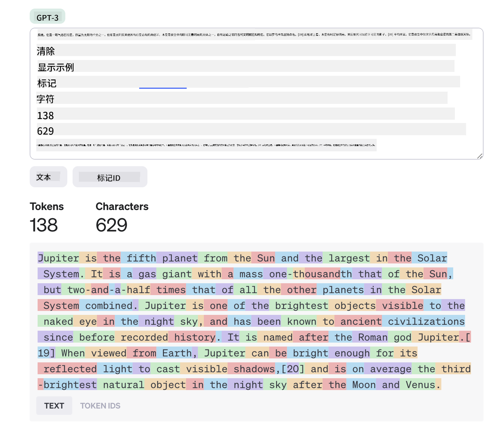
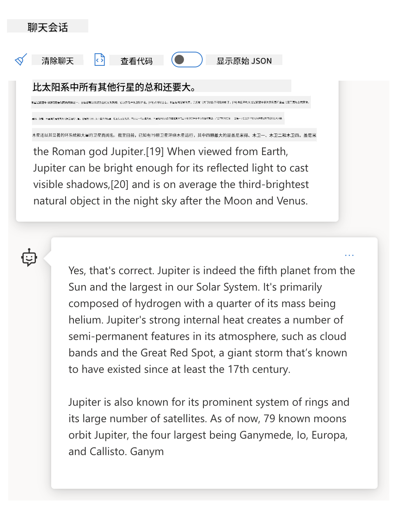
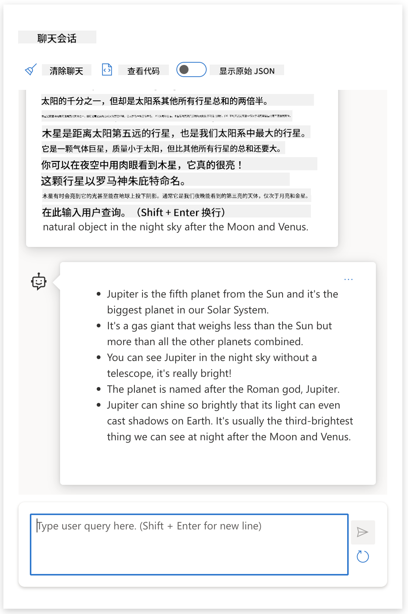
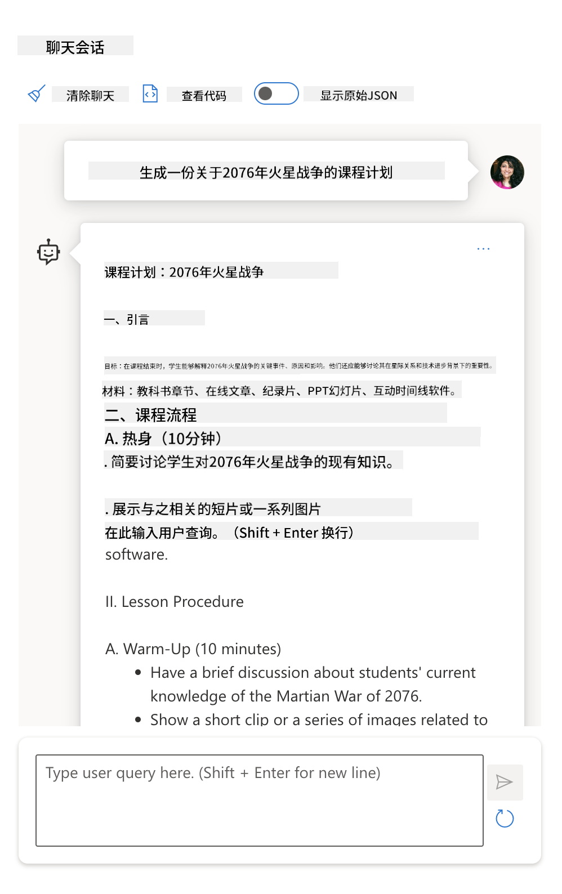

<!--
CO_OP_TRANSLATOR_METADATA:
{
  "original_hash": "dcbaaae026cb50fee071e690685b5843",
  "translation_date": "2025-08-26T14:34:16+00:00",
  "source_file": "04-prompt-engineering-fundamentals/README.md",
  "language_code": "zh"
}
-->
# 提示工程基础

[](https://aka.ms/gen-ai-lesson4-gh?WT.mc_id=academic-105485-koreyst)

## 简介
本模块介绍了在生成式 AI 模型中创建高效提示的基本概念和技巧。你向 LLM 提交提示的方式同样重要。精心设计的提示可以获得更高质量的回复。那么，_提示_ 和 _提示工程_ 这些术语到底是什么意思？我该如何改进发给 LLM 的提示 _输入_？这些问题将在本章和下一章中为你解答。

_生成式 AI_ 能够根据用户请求生成新的内容（如文本、图片、音频、代码等）。它依赖于像 OpenAI 的 GPT（“生成式预训练变换器”）系列这样的 _大型语言模型_，这些模型专为处理自然语言和代码而训练。

现在，用户可以通过熟悉的聊天等方式与这些模型互动，无需任何技术背景或培训。这些模型是 _基于提示_ 的——用户发送文本输入（提示），AI 返回响应（补全）。用户可以多轮与 AI 对话，不断调整提示，直到获得满意的回复。

“提示”已经成为生成式 AI 应用的主要 _编程接口_，用来告诉模型要做什么，并影响返回结果的质量。“提示工程”是一个快速发展的研究领域，专注于提示的 _设计与优化_，以实现大规模、高质量的输出。

## 学习目标

在本课中，我们将了解什么是提示工程、它为何重要，以及如何为特定模型和应用目标设计更有效的提示。你将掌握提示工程的核心概念和最佳实践，并了解一个交互式 Jupyter Notebooks “沙盒”环境，亲自体验这些概念在实际案例中的应用。

学完本课后，你将能够：

1. 解释什么是提示工程及其重要性。
2. 描述提示的组成部分及其用法。
3. 学习提示工程的最佳实践和技巧。
4. 运用所学技巧，通过 OpenAI 接口应用到实际案例中。

## 关键词

提示工程：设计和优化输入，引导 AI 模型生成期望输出的实践。
分词（Tokenization）：将文本转换为模型可理解和处理的小单元（token）的过程。
指令微调 LLM：通过特定指令进行微调，以提升响应准确性和相关性的大型语言模型（LLM）。

## 学习沙盒

目前，提示工程更像是一门艺术而非科学。提升直觉的最佳方式就是 _多练习_，采用试错法，将领域知识与推荐技巧和模型优化结合起来。

本课配套的 Jupyter Notebook 提供了一个 _沙盒_ 环境，你可以边学边练，或在最后的代码挑战中实践。要运行这些练习，你需要：

1. **Azure OpenAI API 密钥** —— 已部署 LLM 的服务端点。
2. **Python 运行环境** —— 用于执行 Notebook。
3. **本地环境变量** —— _现在完成 [SETUP](./../00-course-setup/02-setup-local.md?WT.mc_id=academic-105485-koreyst) 步骤，做好准备_。

Notebook 内置了 _入门_ 练习，但鼓励你添加自己的 _Markdown_（描述）和 _Code_（提示请求）部分，尝试更多案例或想法，培养对提示设计的直觉。

## 图解指南

想在深入学习前先了解本课的整体内容吗？看看这份图解指南，帮你把握主要主题和每部分的关键要点。课程路线图将带你从理解核心概念和挑战，到用相关的提示工程技巧和最佳实践加以应对。注意，指南中的“高级技巧”部分将在本课程的 _下一章_ 详细讲解。


## 我们的创业项目

现在，让我们聊聊 _这个主题_ 如何与我们“[将 AI 创新带入教育](https://educationblog.microsoft.com/2023/06/collaborating-to-bring-ai-innovation-to-education?WT.mc_id=academic-105485-koreyst)”的创业使命相关。我们希望打造基于 AI 的 _个性化学习_ 应用——思考一下，不同用户如何“设计”提示：

- **管理员** 可能让 AI _分析课程数据，找出覆盖的空白_。AI 可以总结结果，甚至用代码可视化。
- **教师** 可能让 AI _为特定受众和主题生成课程计划_。AI 能按指定格式生成个性化方案。
- **学生** 可能让 AI _辅导他们攻克难题_。AI 可以根据学生水平，提供定制的课程、提示和示例。

这只是冰山一角。欢迎访问 [Prompts For Education](https://github.com/microsoft/prompts-for-edu/tree/main?WT.mc_id=academic-105485-koreyst) —— 由教育专家整理的开源提示库，了解更多可能性！_试着在沙盒或 OpenAI Playground 里运行其中的一些提示，看看效果如何！_

<!--
LESSON TEMPLATE:
This unit should cover core concept #1.
Reinforce the concept with examples and references.

CONCEPT #1:
Prompt Engineering.
Define it and explain why it is needed.
-->

## 什么是提示工程？

本课一开始，我们将 **提示工程** 定义为 _设计和优化_ 文本输入（提示），以便针对特定应用目标和模型，获得一致且高质量的回复（补全）的过程。可以将其看作两个步骤：

- 针对特定模型和目标 _设计_ 初始提示
- 通过反复 _优化_ 提示，提升回复质量

这本质上是一个需要用户直觉和努力的试错过程。那么，为什么它很重要？要回答这个问题，首先需要理解三个概念：

- _分词（Tokenization）_ = 模型如何“看待”提示
- _基础 LLM_ = 基础模型如何“处理”提示
- _指令微调 LLM_ = 模型如何理解“任务”

### 分词（Tokenization）

LLM 将提示视为 _一串 token_，不同模型（或同一模型的不同版本）对同一提示的分词方式可能不同。由于 LLM 是基于 token（而非原始文本）训练的，提示的分词方式会直接影响生成回复的质量。

想直观感受分词原理，可以试试 [OpenAI Tokenizer](https://platform.openai.com/tokenizer?WT.mc_id=academic-105485-koreyst) 这样的工具。把你的提示粘贴进去，看看它如何被拆分成 token，注意空格和标点的处理方式。注意，这个例子用的是较老的 LLM（GPT-3），用新模型可能会有不同结果。



### 概念：基础模型

提示被分词后，["基础 LLM"](https://blog.gopenai.com/an-introduction-to-base-and-instruction-tuned-large-language-models-8de102c785a6?WT.mc_id=academic-105485-koreyst)（或称基础模型）的主要功能就是预测序列中的下一个 token。由于 LLM 在海量文本数据集上训练，对 token 之间的统计关系有很好的把握，因此能较有信心地做出预测。需要注意的是，模型并不理解提示或 token 的 _含义_，它只是根据模式“补全”下一个预测。模型会不断预测下一个 token，直到用户终止或达到预设条件。

想体验基于提示的补全效果？把上面的提示输入 Azure OpenAI Studio 的 [_Chat Playground_](https://oai.azure.com/playground?WT.mc_id=academic-105485-koreyst)，用默认设置。系统会把提示当作信息请求，你应该能看到一个符合上下文的补全。

但如果用户希望看到满足特定标准或任务目标的内容呢？这时就需要 _指令微调_ 的 LLM。



### 概念：指令微调 LLM

[指令微调 LLM](https://blog.gopenai.com/an-introduction-to-base-and-instruction-tuned-large-language-models-8de102c785a6?WT.mc_id=academic-105485-koreyst) 是在基础模型的基础上，通过示例或输入/输出对（如多轮“消息”）进行微调，这些对中包含明确的指令，AI 的回复会尝试遵循这些指令。

这类模型采用了如人类反馈强化学习（RLHF）等技术，训练模型 _遵循指令_ 并 _从反馈中学习_，从而生成更适合实际应用、更加贴合用户目标的回复。

来试试吧——还是用上面的提示，但这次把 _system message_ 改成如下指令作为上下文：

> _请将你收到的内容为二年级学生做摘要。结果控制在一段话内，并用 3-5 个要点列出。_

你会发现，结果已经根据目标和格式进行了调整。教师可以直接把这个回复用在课堂的幻灯片中。



## 为什么需要提示工程？

现在我们了解了 LLM 如何处理提示，接下来聊聊 _为什么_ 需要提示工程。原因在于，目前的 LLM 存在一些挑战，如果不在提示构建和优化上下功夫，很难获得 _可靠且一致的补全_。例如：

1. **模型回复具有随机性。** _同一个提示_ 在不同模型或模型版本下，往往会得到不同的回复。即使是 _同一模型_，不同时间也可能有不同结果。_提示工程技巧可以通过更好的约束，帮助我们减少这些差异_。

1. **模型可能编造内容。** 模型虽然用 _大但有限_ 的数据集训练，但对训练范围外的知识并不了解。因此，可能会生成不准确、虚构，甚至与已知事实相矛盾的内容。_提示工程技巧可以帮助用户识别并减少这类编造，比如让 AI 给出引用或推理过程_。

1. **模型能力各异。** 新一代模型功能更强大，但也带来成本、复杂性等新问题。_提示工程可以帮助我们形成最佳实践和工作流，屏蔽差异，灵活适配不同模型的需求，实现可扩展、无缝的应用_。

让我们在 OpenAI 或 Azure OpenAI Playground 里实际体验一下：

- 用同一个提示，分别在不同 LLM 部署（如 OpenAI、Azure OpenAI、Hugging Face）下试试——你发现了哪些差异？
- 用同一个提示，在 _同一个_ LLM 部署（如 Azure OpenAI playground）下多次运行——这些差异又有哪些？

### 编造内容示例

在本课程中，我们用 **“编造内容”** 来指代 LLM 有时会因训练或其他限制，生成事实错误信息的现象。你可能在文章或论文中见过 _“幻觉”_ 这个说法。但我们强烈建议用 _“编造内容”_ 这个术语，以免把机器行为拟人化，赋予其人类特质。这也符合 [负责任的 AI 指南](https://www.microsoft.com/ai/responsible-ai?WT.mc_id=academic-105485-koreyst) 的术语规范，避免在某些语境下使用可能冒犯或不够包容的词汇。

想体验编造内容的现象吗？可以设计一个让 AI 生成不存在主题内容的提示（确保训练数据集中没有）。例如——我尝试了这个提示：
# 火星战争 2076 年课程计划

## 课程目标
- 了解火星战争的起因、过程和影响
- 分析战争对地球和火星社会的影响
- 培养批判性思维和历史分析能力

## 课程简介
本课程将带领学生深入探讨 2076 年爆发的火星战争。学生将学习战争的背景、主要事件、关键人物，以及战争结束后对人类社会的深远影响。

## 课程内容

### 1. 背景介绍
- 火星殖民地的发展历程
- 地球与火星之间的关系紧张
- 资源争夺与政治冲突

### 2. 战争爆发
- 导火索事件
- 主要参战方及其目标
- 战争初期的战略与战术

### 3. 关键战役
- 红沙谷之战
- 奥林匹斯山围攻
- 火星轨道封锁行动

### 4. 重要人物
- 地球联盟指挥官
- 火星自治政府领袖
- 中立方代表

### 5. 战争影响
- 火星社会的变革
- 地球政治格局的变化
- 科技进步与伦理挑战

### 6. 反思与讨论
- 战争是否可以避免？
- 战争对人类未来的启示
- 如何建立持久和平？

## 教学活动

- 小组讨论：分析战争的根本原因
- 角色扮演：模拟和平谈判
- 研究报告：选择一个关键战役进行深入研究
- 课堂辩论：战争的正当性与后果

## 评估方式

- 课堂参与
- 小组项目
- 个人研究报告
- 期末考试

## 推荐资源

- 《火星战争编年史》
- 2076 年火星战争纪录片
- 相关学术论文与新闻报道

## 课后作业

- 阅读指定资料，写一篇关于火星战争影响的短文
- 准备下一节课的小组讨论内容

---

> 本课程计划旨在帮助学生全面了解火星战争的历史，并培养分析和批判性思维能力。
一次网络搜索让我发现，关于火星战争的虚构作品（比如电视剧或书籍）确实存在——但没有发生在2076年。常识也告诉我们，2076年是_未来_，因此不可能与真实事件相关。

那么，当我们用不同的LLM提供商运行这个提示时会发生什么？

> **回应 1**：OpenAI Playground（GPT-35）


> **回应 2**：Azure OpenAI Playground（GPT-35）



> **回应 3**：Hugging Face Chat Playground（LLama-2）


正如预期，每个模型（或模型版本）由于随机性和能力差异，都会生成略有不同的回答。例如，一个模型面向八年级学生，另一个则假定用户是高中生。但三者都生成了足以让不了解情况的用户相信事件真实发生的回答。

像 _元提示_ 和 _温度配置_ 这样的提示工程技术，或许能在一定程度上减少模型的虚构内容。新的提示工程_架构_也在不断将新工具和技术无缝集成到提示流程中，以减轻或减少这些影响。

## 案例分析：GitHub Copilot

我们用一个案例来结束本节，看看提示工程在实际解决方案中的应用：[GitHub Copilot](https://github.com/features/copilot?WT.mc_id=academic-105485-koreyst)。

GitHub Copilot 就是你的“AI 编程搭档”——它能把文本提示转化为代码补全，并集成到你的开发环境（如 Visual Studio Code）中，带来流畅的用户体验。正如下面系列博客所记录，最早的版本基于 OpenAI Codex 模型——工程师们很快意识到需要对模型进行微调，并开发更好的提示工程技术，以提升代码质量。到了七月，他们[推出了超越 Codex 的改进版 AI 模型](https://github.blog/2023-07-28-smarter-more-efficient-coding-github-copilot-goes-beyond-codex-with-improved-ai-model/?WT.mc_id=academic-105485-koreyst)，建议速度更快。

建议按顺序阅读这些文章，了解他们的学习历程。

- **2023年5月** | [GitHub Copilot 正在变得更懂你的代码](https://github.blog/2023-05-17-how-github-copilot-is-getting-better-at-understanding-your-code/?WT.mc_id=academic-105485-koreyst)
- **2023年5月** | [GitHub 内部：与 GitHub Copilot 背后的 LLMs 协作](https://github.blog/2023-05-17-inside-github-working-with-the-llms-behind-github-copilot/?WT.mc_id=academic-105485-koreyst)
- **2023年6月** | [如何为 GitHub Copilot 编写更好的提示](https://github.blog/2023-06-20-how-to-write-better-prompts-for-github-copilot/?WT.mc_id=academic-105485-koreyst)
- **2023年7月** | [.. GitHub Copilot 用改进的 AI 模型超越 Codex](https://github.blog/2023-07-28-smarter-more-efficient-coding-github-copilot-goes-beyond-codex-with-improved-ai-model/?WT.mc_id=academic-105485-koreyst)
- **2023年7月** | [开发者的提示工程与 LLMs 指南](https://github.blog/2023-07-17-prompt-engineering-guide-generative-ai-llms/?WT.mc_id=academic-105485-koreyst)
- **2023年9月** | [如何构建企业级 LLM 应用：GitHub Copilot 的经验教训](https://github.blog/2023-09-06-how-to-build-an-enterprise-llm-application-lessons-from-github-copilot/?WT.mc_id=academic-105485-koreyst)

你也可以浏览他们的[工程博客](https://github.blog/category/engineering/?WT.mc_id=academic-105485-koreyst)，获取更多类似[这篇](https://github.blog/2023-09-27-how-i-used-github-copilot-chat-to-build-a-reactjs-gallery-prototype/?WT.mc_id=academic-105485-koreyst)的文章，展示这些模型和技术如何_实际应用_于真实世界项目。

---

## 提示构建

我们已经了解了提示工程为何重要——现在来看看提示是如何_构建_的，这样我们就能评估不同的技术，从而设计更有效的提示。

### 基础提示

先从最基础的提示开始：只发送一段文本给模型，没有其他上下文。举个例子——当我们把美国国歌的开头几个词发送给 OpenAI 的 [Completion API](https://platform.openai.com/docs/api-reference/completions?WT.mc_id=academic-105485-koreyst) 时，模型会立刻用后续歌词进行_补全_，展示了基本的预测行为。

| 提示（输入）         | 补全（输出）                                                                                                                        |
| :------------------ | :----------------------------------------------------------------------------------------------------------------------------------- |
| Oh say can you see  | 看起来你是在唱“星条旗”，这是美国的国歌。完整歌词是…… |

### 复杂提示

现在我们在基础提示上加入上下文和指令。[Chat Completion API](https://learn.microsoft.com/azure/ai-services/openai/how-to/chatgpt?WT.mc_id=academic-105485-koreyst) 允许我们把复杂提示构建为一组_消息_，包括：

- 输入/输出对，反映_用户_输入和_助手_回复。
- 系统消息，用于设定助手的行为或个性。

请求格式如下，_分词_过程会有效提取上下文和对话中的关键信息。此时，改变系统上下文对补全质量的影响，甚至可以和用户输入一样大。

```python
response = openai.chat.completions.create(
    model="gpt-3.5-turbo",
    messages=[
        {"role": "system", "content": "You are a helpful assistant."},
        {"role": "user", "content": "Who won the world series in 2020?"},
        {"role": "assistant", "content": "The Los Angeles Dodgers won the World Series in 2020."},
        {"role": "user", "content": "Where was it played?"}
    ]
)
```

### 指令提示

在上面的例子中，用户提示只是一个简单的文本查询，可以理解为信息请求。使用_指令_提示时，我们可以用文本更详细地指定任务，为 AI 提供更明确的指导。举个例子：

| 提示（输入）                                                                                                                                                                                                                         | 补全（输出）                                                                                                        | 指令类型           |
| :----------------------------------------------------------------------------------------------------------------------------------------------------------------------------------------------------------------------------------- | :------------------------------------------------------------------------------------------------------------------- | :----------------- |
| 写一段关于内战的描述                                                                                                                                                                           | _返回一个简单的段落_                                                                                                | 简单               |
| 写一段关于内战的描述。请提供关键日期和事件，并说明其意义                                                                                                                                         | _返回一个段落，后面列出关键事件日期及说明_                                                                           | 复杂               |
| 用一段话描述内战。用3个要点列出关键日期及其意义。再用3个要点列出重要历史人物及其贡献。请以 JSON 文件格式返回结果。                                                                             | _返回更详细的信息，格式为 JSON，可以直接复制粘贴到文件并进行校验_                                                    | 复杂，格式化       |

## 主要内容

在上述例子中，提示还是比较开放的，让 LLM 自行决定哪些预训练数据相关。而采用_主要内容_设计模式时，输入文本分为两部分：

- 指令（动作）
- 相关内容（影响动作）

比如下面这个例子，指令是“用两句话总结”。

| 提示（输入）                                                                                                                                                                                                                                                                                                                                                                                                                                                                                                                                                                                                                                                                                      | 补全（输出）                                                                                                                                                                                                                                                                             |
| :-------------------------------------------------------------------------------------------------------------------------------------------------------------------------------------------------------------------------------------------------------------------------------------------------------------------------------------------------------------------------------------------------------------------------------------------------------------------------------------------------------------------------------------------------------------------------------------------------------------------------------------------------------------------------------------------------- | :---------------------------------------------------------------------------------------------------------------------------------------------------------------------------------------------------------------------------------------------------------------------------------------------- |
| Jupiter is the fifth planet from the Sun and the largest in the Solar System. It is a gas giant with a mass one-thousandth that of the Sun, but two-and-a-half times that of all the other planets in the Solar System combined. Jupiter is one of the brightest objects visible to the naked eye in the night sky, and has been known to ancient civilizations since before recorded history. It is named after the Roman god Jupiter.[19] When viewed from Earth, Jupiter can be bright enough for its reflected light to cast visible shadows,[20] and is on average the third-brightest natural object in the night sky after the Moon and Venus. <br/> **Summarize this in 2 short sentences** | 木星是太阳系中距离太阳第五、体积最大的行星，也是夜空中最亮的天体之一。它以罗马神 Jupiter 命名，是一个气体巨星，质量是其他所有行星总和的两倍半。 |

主要内容部分可以用多种方式提升指令效果：

- **示例**——不用明确告诉模型要做什么，而是给出一些期望输出的例子，让模型自己归纳规律。
- **提示词**——在指令后加一个“提示”，引导模型生成更相关的回答。
- **模板**——可复用的“配方”，带有占位符（变量），可以用具体数据定制，适用于特定场景。

下面来具体看看这些方法。

### 使用示例

这种方法是用主要内容“喂给模型”一些期望输出的例子，让它自己归纳出输出模式。根据示例数量，可以分为零样本、单样本、少样本等提示。

提示现在包含三个部分：

- 任务描述
- 若干期望输出的示例
- 新示例的开头（隐含任务描述）

| 学习类型   | 提示（输入）                                                                                                                                        | 补全（输出）         |
| :-------- | :--------------------------------------------------------------------------------------------------------------------------------------------------- | :------------------- |
| 零样本     | "The Sun is Shining". Translate to Spanish                                                                                                          | "El Sol está brillando".    |
| 单样本     | "The Sun is Shining" => ""El Sol está brillando". <br> "It's a Cold and Windy Day" =>                                                               | "Es un día frío y ventoso". |
| 少样本     | The player ran the bases => Baseball <br/> The player hit an ace => Tennis <br/> The player hit a six => Cricket <br/> The player made a slam-dunk => | Basketball                  |
|           |                                                                                                                                                      |                         |

可以看到，零样本提示需要明确指令（“Translate to Spanish”），而单样本提示中模型能自动推断任务。少样本提示则展示了，增加示例数量能让模型在没有额外指令的情况下做出更准确的推断。

### 提示词

另一种利用主要内容的技巧是提供_提示词_而不是示例。这种情况下，我们用一个反映期望输出格式的片段“开头”，给模型一个方向。模型会“接着提示”继续生成类似内容。

| 提示词数量 | 提示（输入）                                                                                                                                                                                                                                                                                                                                                                                                                                               | 补全（输出）                                                                                                                                                                                                                                                                                       |
| :--------- | :--------------------------------------------------------------------------------------------------------------------------------------------------------------------------------------------------------------------------------------------------------------------------------------------------------------------------------------------------------------------------------------------------------------------------------------------------------- | :-------------------------------------------------------------------------------------------------------------------------------------------------------------------------------------------------------------------------------------------------------------------------------------------------- |
| 0          | Jupiter is the fifth planet from the Sun and the largest in the Solar System. It is a gas giant with a mass one-thousandth that of the Sun, but two-and-a-half times that of all the other planets in the Solar System combined. Jupiter is one of the brightest objects visible to the naked eye in the night sky, and has been known to ancient civilizations since before recorded history.

**总结如下**                                       | 木星是太阳系中最大的行星，也是距离太阳第五远的行星。它是一颗气体巨星，质量约为太阳的千分之一，但比其他所有行星的总质量还要大。古代文明很早就发现了木星，在夜空中很容易看到。 |
| 1              | 木星是距离太阳第五远的行星，也是太阳系中最大的行星。它是一颗气体巨星，质量约为太阳的千分之一，但比太阳系其他所有行星的总质量还要多两倍半。木星是夜空中肉眼可见最亮的天体之一，自有记载之前的古代文明就已经认识到它的存在。<br/>**总结如下** <br/> 我们了解到木星 | 是距离太阳第五远的行星，也是太阳系中最大的行星。它是一颗气体巨星，质量约为太阳的千分之一，但比其他所有行星的总质量还要多两倍半。它肉眼可见，自古以来就被人类认识。                        |
| 2              | 木星是距离太阳第五远的行星，也是太阳系中最大的行星。它是一颗气体巨星，质量约为太阳的千分之一，但比太阳系其他所有行星的总质量还要多两倍半。木星是夜空中肉眼可见最亮的天体之一，自有记载之前的古代文明就已经认识到它的存在。<br/>**总结如下** <br/> 我们学到的三大事实：         | 1. 木星是距离太阳第五远的行星，也是太阳系中最大的行星。<br/> 2. 它是一颗气体巨星，质量约为太阳的千分之一……<br/> 3. 木星自古以来就能被肉眼看到……                                                                       |
|                |                                                                                                                                                                                                                                                                                                                                                                                                                                                              |                                                                                                                                                                                                                                                                                                           |

### 提示模板

提示模板是_预先定义好的提示配方_，可以存储并按需复用，从而在大规模场景下带来更一致的用户体验。最简单的形式，就是像[OpenAI这个例子](https://platform.openai.com/examples?WT.mc_id=academic-105485-koreyst)一样，收集一组提示示例，既包含交互式提示组件（用户和系统消息），也包含API请求格式，方便复用。

更复杂的形式，比如[LangChain这个例子](https://python.langchain.com/docs/concepts/prompt_templates/?WT.mc_id=academic-105485-koreyst)，它包含_占位符_，可以用来自不同来源的数据（用户输入、系统上下文、外部数据源等）动态生成提示。这样我们就能创建可复用的提示库，程序化地驱动一致的用户体验。

最后，模板的真正价值在于能够为垂直应用领域创建和发布_提示库_——此时提示模板会针对特定应用场景进行_优化_，用更贴合目标用户的上下文或示例，让响应更相关、更准确。[Prompts For Edu](https://github.com/microsoft/prompts-for-edu?WT.mc_id=academic-105485-koreyst) 仓库就是这种做法的典型，专为教育领域整理了提示库，重点关注课程规划、教学设计、学生辅导等关键目标。

## 支持性内容

如果我们把提示构建看作是有一个指令（任务）和一个目标（主要内容），那么_次要内容_就是我们提供的额外上下文，用来**影响输出结果**。它可以是调优参数、格式要求、主题分类等，帮助模型_定制_响应，更好地满足用户目标或期望。

举个例子：假设有一个包含丰富元数据（名称、描述、难度、标签、讲师等）的课程目录：

- 我们可以定义一个指令：“请总结2023年秋季课程目录”
- 用主要内容给出几个期望输出的示例
- 用次要内容指定最关注的5个“标签”

这样，模型就能按照示例的格式给出总结——如果某个结果有多个标签，还能优先突出次要内容里指定的5个标签。

---

<!--
课程模板：
本单元应覆盖核心概念#1。
用示例和参考资料强化概念。

概念#3：
提示工程技巧。
有哪些基础的提示工程技巧？
用练习题说明。
-->

## 提示最佳实践

现在我们知道了提示可以如何_构建_，接下来可以思考如何_设计_提示，遵循最佳实践。可以分为两部分：树立正确的_思维方式_，并应用合适的_技巧_。

### 提示工程思维方式

提示工程是一个反复试验的过程，记住三大指导原则：

1. **领域理解很重要。** 响应的准确性和相关性取决于应用或用户所处的_领域_。发挥你的直觉和领域专长，进一步**定制技巧**。比如，在系统提示中定义_领域专属角色_，或在用户提示中用_领域专属模板_。提供反映领域背景的次要内容，或用_领域相关的线索和示例_引导模型贴近实际用法。

2. **模型理解很重要。** 我们知道模型本质上是随机的。但不同模型实现也会因训练数据（预训练知识）、功能（API或SDK）、优化内容类型（代码、图片、文本等）而异。了解你所用模型的优势和局限，利用这些信息_优先安排任务_或构建_定制模板_，让其更适合模型能力。

3. **迭代与验证很重要。** 模型和提示工程技巧都在快速发展。作为领域专家，你可能有其他上下文或标准，适用于你的应用但未必适用于大众。用提示工程工具和技巧“快速启动”提示构建，然后用自己的直觉和领域知识反复迭代和验证结果。记录你的见解，创建**知识库**（如提示库），让他人能以此为新起点，加快后续迭代。

## 最佳实践

下面来看[OpenAI](https://help.openai.com/en/articles/6654000-best-practices-for-prompt-engineering-with-openai-api?WT.mc_id=academic-105485-koreyst)和[Azure OpenAI](https://learn.microsoft.com/azure/ai-services/openai/concepts/prompt-engineering#best-practices?WT.mc_id=academic-105485-koreyst)专家推荐的常见最佳实践。

| 做法                              | 原因                                                                                                                                                                                                                                               |
| :-------------------------------- | :------------------------------------------------------------------------------------------------------------------------------------------------------------------------------------------------------------------------------------------------ |
| 评估最新模型。       | 新一代模型通常功能更强、质量更高——但可能成本更高。评估其影响后再决定是否迁移。                                                                                |
| 区分指令和上下文   | 看你的模型/服务商是否定义了_分隔符_，能更清晰地区分指令、主要内容和次要内容。这样模型能更准确地为不同token分配权重。                                                         |
| 明确具体             | 详细说明期望的上下文、结果、长度、格式、风格等，有助于提升响应质量和一致性。把配方整理成可复用模板。                                                          |
| 描述清楚，举例说明      | 模型对“演示+讲解”方式响应更好。先用`零样本`方法只给指令（不举例），再用`少样本`方法补充几个期望输出的示例。可以用类比。 |
| 用线索引导补全 | 给模型一些开头词或短语，帮助它朝着期望结果发展。                                                                                                               |
| 重申重点                       | 有时需要对模型重复说明。可以在主要内容前后都给指令，或同时用指令和线索等。反复迭代和验证，找到有效方法。                                                         |
| 信息顺序重要                     | 呈现信息的顺序会影响输出，甚至在学习示例中也有“新近偏好”。多试几种顺序，找出最佳方案。                                                               |
| 给模型留“后路”           | 给模型一个_备用_补全方案，如果因某种原因无法完成任务，可以用这个方案。这样能减少模型生成虚假或编造内容的概率。                                                         |
|                                   |                                                                                                                                                                                                                                                   |

和所有最佳实践一样，记住_实际效果因模型、任务和领域而异_。把这些作为起点，反复迭代，找到最适合自己的方法。随着新模型和工具的出现，持续优化你的提示工程流程，关注流程可扩展性和响应质量。

<!--
课程模板：
本单元如适用应提供代码挑战

挑战：
链接到一个Jupyter Notebook，指令只在代码注释里（代码部分为空）。

解决方案：
链接到Notebook副本，填好并运行了提示，展示一个示例结果。
-->

## 作业

恭喜你！已经完成了本课的全部内容！现在可以用真实例子来检验这些概念和技巧了！

本次作业我们会用一个Jupyter Notebook，里面有可以交互完成的练习题。你也可以自己添加Markdown和代码单元，探索更多想法和技巧。

### 开始前，请先fork仓库，然后

- （推荐）启动GitHub Codespaces
- （可选）把仓库克隆到本地设备，用Docker Desktop运行
- （可选）用你喜欢的Notebook环境打开Notebook

### 接下来，配置环境变量

- 把仓库根目录下的`.env.copy`文件复制为`.env`，并填写`AZURE_OPENAI_API_KEY`、`AZURE_OPENAI_ENDPOINT`和`AZURE_OPENAI_DEPLOYMENT`。具体方法见[学习沙盒部分](../../../04-prompt-engineering-fundamentals/04-prompt-engineering-fundamentals)。

### 然后，打开Jupyter Notebook

- 选择运行内核。如果用方案1或2，直接选dev容器自带的Python 3.10.x默认内核即可。

现在可以开始做练习了。注意这里没有_标准答案_，只是通过反复试验探索各种可能，培养对模型和应用领域的直觉。

_因此本课没有代码解决方案部分。Notebook里会有标题为“My Solution:”的Markdown单元，展示一个参考输出示例。_

 <!--
课程模板：
用总结和自学资源收尾。
-->

## 知识检测

下面哪个提示更符合合理的最佳实践？

1. Show me an image of red car
2. Show me an image of red car of make Volvo and model XC90 parked by a cliff with the sun setting
3. Show me an image of red car of make Volvo and model XC90

A: 2，它是最好的提示，因为不仅说明了“是什么”，还具体到品牌和型号，并描述了整体场景。3也不错，因为描述也很详细。

## 🚀 挑战

试试用“线索”技巧，提示：Complete the sentence "Show me an image of red car of make Volvo and "。看看模型会怎么补全，你会如何改进？

## 很棒！继续学习吧

想了解更多提示工程相关概念？请访问[继续学习页面](https://aka.ms/genai-collection?WT.mc_id=academic-105485-koreyst)，这里有更多优质资源。

接下来进入第5课，我们将学习[高级提示技巧](../05-advanced-prompts/README.md?WT.mc_id=academic-105485-koreyst)！

---

**免责声明**：  
本文件由 AI 翻译服务 [Co-op Translator](https://github.com/Azure/co-op-translator) 翻译。我们尽力确保准确性，但请注意，自动翻译可能包含错误或不准确之处。原始语言的文件应被视为权威来源。对于关键信息，建议使用专业人工翻译。因使用本翻译而产生的任何误解或误读，我们概不负责。