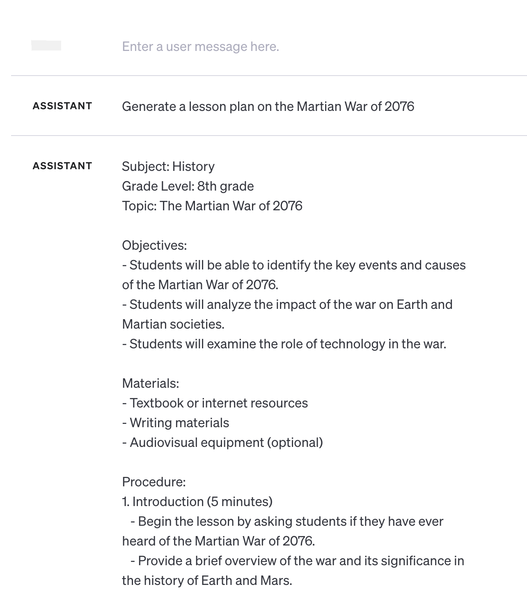
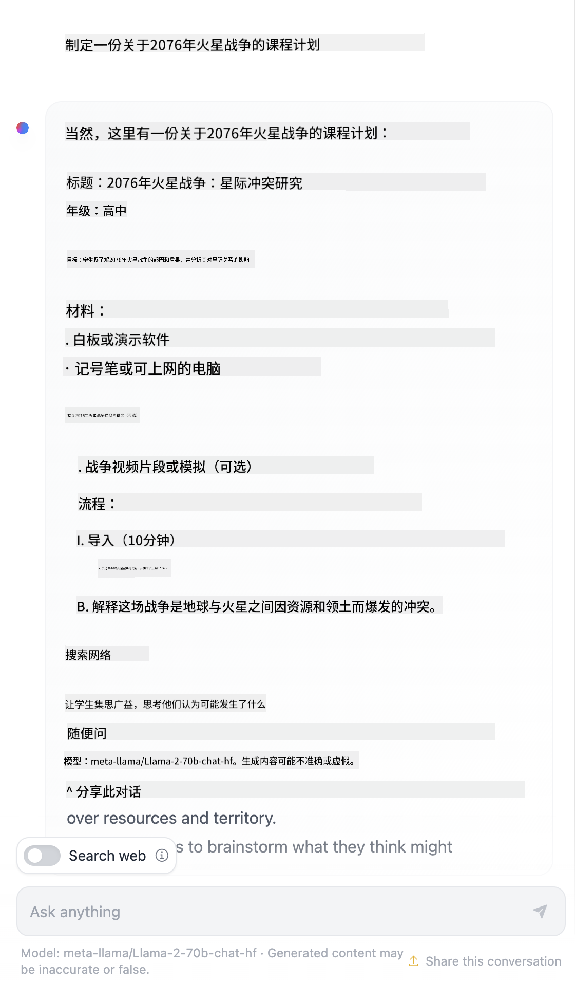

<!--
CO_OP_TRANSLATOR_METADATA:
{
  "original_hash": "8b3cb38518cf4fe7714d2f5e74dfa3eb",
  "translation_date": "2025-10-03T08:29:54+00:00",
  "source_file": "04-prompt-engineering-fundamentals/README.md",
  "language_code": "zh"
}
-->
# 提示工程基础

[](https://aka.ms/gen-ai-lesson4-gh?WT.mc_id=academic-105485-koreyst)

## 简介
本模块涵盖了在生成式 AI 模型中创建有效提示的基本概念和技术。向 LLM（大型语言模型）发送提示的方式非常重要。精心设计的提示可以获得更高质量的响应。那么，像 _提示_ 和 _提示工程_ 这样的术语到底是什么意思？如何改进发送给 LLM 的提示 _输入_？这些问题将在本章及下一章中得到解答。

_生成式 AI_ 能够根据用户请求创建新的内容（例如文本、图像、音频、代码等）。它通过使用像 OpenAI 的 GPT（"生成式预训练变换器"）系列这样的 _大型语言模型_ 来实现，这些模型经过训练可以处理自然语言和代码。

用户现在可以通过熟悉的交互方式（如聊天）与这些模型进行互动，而无需任何技术专长或培训。这些模型是 _基于提示_ 的——用户发送文本输入（提示），然后获得 AI 的响应（完成）。用户可以通过多轮对话与 AI 进行迭代交流，逐步优化提示，直到响应符合预期。

"提示" 现在成为生成式 AI 应用的主要 _编程接口_，用于告诉模型该做什么，并影响返回响应的质量。"提示工程" 是一个快速发展的研究领域，专注于提示的 _设计和优化_，以实现规模化的一致性和高质量响应。

## 学习目标

在本课程中，我们将学习什么是提示工程、它的重要性，以及如何为特定模型和应用目标设计更有效的提示。我们将理解提示工程的核心概念和最佳实践，并了解一个交互式 Jupyter Notebook "沙盒" 环境，在其中可以看到这些概念应用于实际示例。

在课程结束时，我们将能够：

1. 解释什么是提示工程及其重要性。
2. 描述提示的组成部分及其用途。
3. 学习提示工程的最佳实践和技术。
4. 使用 OpenAI 端点将所学技术应用于实际示例。

## 关键术语

提示工程：设计和优化输入以引导 AI 模型生成所需输出的实践。
分词：将文本转换为模型可以理解和处理的小单元（称为令牌）的过程。
指令调优的 LLM：通过特定指令进行微调以提高响应准确性和相关性的 _大型语言模型_（LLM）。

## 学习沙盒

提示工程目前更像是一门艺术而非科学。提高直觉的最佳方法是 _多练习_，并采用结合应用领域专业知识、推荐技术和模型特定优化的试错方法。

本课程配套的 Jupyter Notebook 提供了一个 _沙盒_ 环境，您可以在学习过程中或课程结束的代码挑战中尝试所学内容。要执行练习，您需要：

1. **Azure OpenAI API 密钥** - 部署的 LLM 的服务端点。
2. **Python 运行环境** - 用于执行 Notebook。
3. **本地环境变量** - _完成 [SETUP](./../00-course-setup/02-setup-local.md?WT.mc_id=academic-105485-koreyst) 步骤以准备好环境_。

Notebook 提供了 _入门_ 练习，但我们鼓励您添加自己的 _Markdown_（描述）和 _代码_（提示请求）部分，以尝试更多示例或想法，并建立提示设计的直觉。

## 图解指南

想在深入学习之前了解本课程的整体内容吗？查看这个图解指南，它可以让您了解主要主题以及每个主题的关键要点。课程路线图将带您从理解核心概念和挑战到通过相关提示工程技术和最佳实践解决这些问题。请注意，指南中的 "高级技术" 部分指的是本课程下一章的内容。


## 我们的初创公司

现在，让我们谈谈 _这个主题_ 如何与我们初创公司的使命——[将 AI 创新带入教育](https://educationblog.microsoft.com/2023/06/collaborating-to-bring-ai-innovation-to-education?WT.mc_id=academic-105485-koreyst)——相关联。我们希望构建 AI 驱动的 _个性化学习_ 应用程序，因此让我们思考不同用户如何为我们的应用设计提示：

- **管理员** 可能会要求 AI _分析课程数据以识别覆盖范围的不足_。AI 可以总结结果或通过代码进行可视化。
- **教育工作者** 可能会要求 AI _为目标受众和主题生成课程计划_。AI 可以以指定格式构建个性化计划。
- **学生** 可能会要求 AI _辅导他们学习困难科目_。AI 可以根据学生的水平提供课程、提示和示例。

这只是冰山一角。查看 [教育领域的提示](https://github.com/microsoft/prompts-for-edu/tree/main?WT.mc_id=academic-105485-koreyst)——一个由教育专家策划的开源提示库——以更广泛地了解可能性！_尝试在沙盒中运行这些提示或使用 OpenAI Playground，看看会发生什么！_

<!--
课程模板：
本单元应涵盖核心概念 #1。
通过示例和参考资料强化概念。

概念 #1：
提示工程。
定义并解释其必要性。
-->

## 什么是提示工程？

我们在本课程开始时将 **提示工程** 定义为 _设计和优化_ 文本输入（提示）的过程，以实现给定应用目标和模型的一致性和高质量响应（完成）。我们可以将其视为一个两步过程：

- 为给定模型和目标 _设计_ 初始提示
- 通过迭代 _优化_ 提示以提高响应质量

这必然是一个需要用户直觉和努力的试错过程，以获得最佳结果。那么为什么它很重要？要回答这个问题，我们首先需要理解三个概念：

- _分词_ = 模型如何 "看待" 提示
- _基础 LLM_ = 基础模型如何 "处理" 提示
- _指令调优的 LLM_ = 模型如何理解 "任务"

### 分词

LLM 将提示视为 _令牌序列_，不同的模型（或模型版本）可能以不同方式对同一提示进行分词。由于 LLM 是基于令牌（而不是原始文本）进行训练的，因此提示的分词方式会直接影响生成响应的质量。

为了理解分词的工作原理，可以尝试使用 [OpenAI 分词器](https://platform.openai.com/tokenizer?WT.mc_id=academic-105485-koreyst) 等工具。将您的提示复制进去，看看它如何转换为令牌，并注意空白字符和标点符号的处理方式。请注意，此示例显示的是较旧的 LLM（GPT-3）——使用较新的模型可能会产生不同的结果。


### 概念：基础模型

一旦提示被分词，["基础 LLM"](https://blog.gopenai.com/an-introduction-to-base-and-instruction-tuned-large-language-models-8de102c785a6?WT.mc_id=academic-105485-koreyst)（或基础模型）的主要功能是预测该序列中的下一个令牌。由于 LLM 是基于海量文本数据集进行训练的，它们对令牌之间的统计关系有很好的理解，并可以有一定信心地进行预测。请注意，它们并不理解提示或令牌中的单词 _含义_；它们只是看到可以通过下一次预测 "完成" 的模式。它们可以继续预测序列，直到用户干预或某些预设条件终止。

想看看基于提示的完成如何工作？将上述提示输入 Azure OpenAI Studio [_聊天 Playground_](https://oai.azure.com/playground?WT.mc_id=academic-105485-koreyst)，使用默认设置。系统配置为将提示视为信息请求，因此您应该看到一个满足此上下文的完成。

但如果用户希望看到满足某些标准或任务目标的特定内容呢？这就是 _指令调优_ 的 LLM 的作用。


### 概念：指令调优的 LLM

[指令调优的 LLM](https://blog.gopenai.com/an-introduction-to-base-and-instruction-tuned-large-language-models-8de102c785a6?WT.mc_id=academic-105485-koreyst) 从基础模型开始，并通过示例或输入/输出对（例如多轮 "消息"）进行微调，这些对可以包含明确的指令——AI 的响应尝试遵循这些指令。

这使用了诸如人类反馈强化学习（RLHF）等技术，可以训练模型 _遵循指令_ 并 _从反馈中学习_，从而生成更适合实际应用且更符合用户目标的响应。

让我们试试——重新访问上述提示，但现在将 _系统消息_ 更改为提供以下指令作为上下文：

> _总结提供的内容，面向二年级学生。将结果限制为一个段落，包含 3-5 个要点。_

看看结果如何调整以反映所需的目标和格式？教育工作者现在可以直接在他们的课堂幻灯片中使用此响应。


## 为什么需要提示工程？

现在我们知道 LLM 如何处理提示，让我们谈谈 _为什么_ 需要提示工程。答案在于当前的 LLM 存在一些挑战，使得 _可靠和一致的完成_ 更难以实现，除非在提示构建和优化上投入努力。例如：

1. **模型响应具有随机性。** _相同的提示_ 在不同的模型或模型版本中可能会产生不同的响应。甚至在 _相同的模型_ 中，不同时间也可能产生不同结果。_提示工程技术可以通过提供更好的约束来帮助我们减少这些变化_。

1. **模型可能会捏造响应。** 模型是基于 _庞大但有限_ 的数据集进行预训练的，这意味着它们缺乏关于训练范围之外概念的知识。因此，它们可能会生成不准确、虚构或与已知事实直接矛盾的完成。_提示工程技术可以帮助用户识别并减轻这些捏造，例如通过要求 AI 提供引用或推理_。

1. **模型能力会有所不同。** 较新的模型或模型版本将具有更丰富的功能，但也会带来成本和复杂性方面的独特问题。_提示工程可以帮助我们开发最佳实践和工作流程，以抽象掉差异，并以可扩展、无缝的方式适应模型特定需求_。

让我们在 OpenAI 或 Azure OpenAI Playground 中看看这些问题的实际表现：

- 使用相同的提示在不同的 LLM 部署（例如 OpenAI、Azure OpenAI、Hugging Face）中运行——您是否看到变化？
- 在 _相同_ 的 LLM 部署（例如 Azure OpenAI Playground）中重复使用相同的提示——这些变化有何不同？

### 捏造示例

在本课程中，我们使用术语 **"捏造"** 来指代 LLM 有时由于训练限制或其他约束生成事实错误信息的现象。您可能在流行文章或研究论文中听到过 _"幻觉"_ 这一术语。然而，我们强烈建议使用 _"捏造"_ 这一术语，以避免通过将人类特性归因于机器行为而使其拟人化。这也从术语角度强化了 [负责任的 AI 指南](https://www.microsoft.com/ai/responsible-ai?WT.mc_id=academic-105485-koreyst)，去除可能在某些语境中被认为具有冒犯性或不包容的术语。

想了解捏造如何发生？想一个提示，指示 AI 为一个不存在的主题生成内容（确保它不在训练数据集中）。例如——我尝试了以下提示：

> **提示：** 为 2076 年的火星战争生成课程计划。
一次网络搜索显示，有关于火星战争的虚构故事（例如电视连续剧或书籍）——但没有发生在2076年。常识告诉我们，2076年是_未来_，因此不能与真实事件相关联。

那么，当我们使用不同的LLM提供商运行这个提示时会发生什么？

> **回应1**：OpenAI Playground (GPT-35)



> **回应2**：Azure OpenAI Playground (GPT-35)


> **回应3**：Hugging Face Chat Playground (LLama-2)



正如预期的那样，由于随机行为和模型能力的差异，每个模型（或模型版本）生成的响应略有不同。例如，一个模型针对八年级学生，而另一个则假定目标是高中生。但所有三个模型都生成了可能让不知情用户相信事件是真实的回应。

像_元提示_和_温度配置_这样的提示工程技术可能在一定程度上减少模型的虚构内容。新的提示工程_架构_也将新工具和技术无缝集成到提示流程中，以减轻或减少这些影响。

## 案例研究：GitHub Copilot

让我们通过一个案例研究来了解提示工程在实际解决方案中的应用： [GitHub Copilot](https://github.com/features/copilot?WT.mc_id=academic-105485-koreyst)。

GitHub Copilot是你的“AI编程助手”——它将文本提示转换为代码补全，并集成到你的开发环境（例如Visual Studio Code）中，为用户提供无缝体验。正如以下系列博客中记录的那样，最早的版本基于OpenAI Codex模型——工程师们很快意识到需要对模型进行微调并开发更好的提示工程技术，以提高代码质量。在7月，他们[推出了一个超越Codex的改进AI模型](https://github.blog/2023-07-28-smarter-more-efficient-coding-github-copilot-goes-beyond-codex-with-improved-ai-model/?WT.mc_id=academic-105485-koreyst)，以提供更快的建议。

按顺序阅读以下文章，了解他们的学习历程。

- **2023年5月** | [GitHub Copilot正在更好地理解你的代码](https://github.blog/2023-05-17-how-github-copilot-is-getting-better-at-understanding-your-code/?WT.mc_id=academic-105485-koreyst)
- **2023年5月** | [GitHub内部：与GitHub Copilot背后的LLM合作](https://github.blog/2023-05-17-inside-github-working-with-the-llms-behind-github-copilot/?WT.mc_id=academic-105485-koreyst)
- **2023年6月** | [如何为GitHub Copilot编写更好的提示](https://github.blog/2023-06-20-how-to-write-better-prompts-for-github-copilot/?WT.mc_id=academic-105485-koreyst)
- **2023年7月** | [GitHub Copilot超越Codex，采用改进的AI模型](https://github.blog/2023-07-28-smarter-more-efficient-coding-github-copilot-goes-beyond-codex-with-improved-ai-model/?WT.mc_id=academic-105485-koreyst)
- **2023年7月** | [开发者的提示工程和LLM指南](https://github.blog/2023-07-17-prompt-engineering-guide-generative-ai-llms/?WT.mc_id=academic-105485-koreyst)
- **2023年9月** | [如何构建企业级LLM应用：GitHub Copilot的经验教训](https://github.blog/2023-09-06-how-to-build-an-enterprise-llm-application-lessons-from-github-copilot/?WT.mc_id=academic-105485-koreyst)

你还可以浏览他们的[工程博客](https://github.blog/category/engineering/?WT.mc_id=academic-105485-koreyst)，了解更多类似[这篇文章](https://github.blog/2023-09-27-how-i-used-github-copilot-chat-to-build-a-reactjs-gallery-prototype/?WT.mc_id=academic-105485-koreyst)的内容，展示这些模型和技术如何_应用_于推动实际应用。

---

## 提示构建

我们已经了解了提示工程的重要性——现在让我们理解提示是如何_构建_的，以便评估不同技术的有效性，从而设计更高效的提示。

### 基础提示

让我们从基础提示开始：发送给模型的文本输入，没有其他上下文。以下是一个示例——当我们将美国国歌的开头几句话发送到OpenAI [Completion API](https://platform.openai.com/docs/api-reference/completions?WT.mc_id=academic-105485-koreyst)时，它会立即用接下来的几句完成响应，展示了基本的预测行为。

| 提示（输入）     | 完成（输出）                                                                                                                        |
| :-------------- | :---------------------------------------------------------------------------------------------------------------------------------- |
| Oh say can you see | 看起来你正在开始美国国歌《星条旗》的歌词。完整歌词是... |

### 复杂提示

现在让我们在基础提示中添加上下文和指令。[Chat Completion API](https://learn.microsoft.com/azure/ai-services/openai/how-to/chatgpt?WT.mc_id=academic-105485-koreyst)允许我们将复杂提示构建为一系列_消息_，包括：

- 反映_用户_输入和_助手_响应的输入/输出对。
- 系统消息，用于设置助手行为或个性化的上下文。

请求现在的形式如下，其中_标记化_有效地捕获了上下文和对话中的相关信息。现在，改变系统上下文对完成质量的影响可能与用户输入提供的内容一样显著。

```python
response = openai.chat.completions.create(
    model="gpt-3.5-turbo",
    messages=[
        {"role": "system", "content": "You are a helpful assistant."},
        {"role": "user", "content": "Who won the world series in 2020?"},
        {"role": "assistant", "content": "The Los Angeles Dodgers won the World Series in 2020."},
        {"role": "user", "content": "Where was it played?"}
    ]
)
```


### 指令提示

在上述示例中，用户提示是一个简单的文本查询，可以被解释为信息请求。通过_指令_提示，我们可以使用文本更详细地指定任务，为AI提供更好的指导。以下是一个示例：

| 提示（输入）                                                                                                                                                                                                                         | 完成（输出）                                                                                                        | 指令类型            |
| :--------------------------------------------------------------------------------------------------------------------------------------------------------------------------------------------------------------------------------- | :----------------------------------------------------------------------------------------------------------------- | :------------------ |
| 写一段关于内战的描述                                                                                                                                                                                                   | _返回了一个简单的段落_                                                                                              | 简单                |
| 写一段关于内战的描述。提供关键日期和事件并描述其重要性                                                                                                                                     | _返回了一个段落，后面是关键事件日期和描述的列表_                                             | 复杂                |
| 写一段关于内战的描述，用1段话概括。提供3个关键日期及其重要性的要点。再提供3个关键历史人物及其贡献的要点。以JSON文件格式返回输出。 | _返回了更详细的信息，格式为JSON，可以复制粘贴到文件中并根据需要验证_ | 复杂。格式化。       |

## 主要内容

在上述示例中，提示仍然相当开放，允许LLM决定其预训练数据集中哪些内容是相关的。通过_主要内容_设计模式，输入文本分为两部分：

- 指令（动作）
- 相关内容（影响动作）

以下是一个示例，其中指令是“用两句话总结”。

| 提示（输入）                                                                                                                                                                                                                                                                                                                                                                                                                                                                                                                                                                                                                                                                                      | 完成（输出）                                                                                                                                                                                                                                                                             |
| :-------------------------------------------------------------------------------------------------------------------------------------------------------------------------------------------------------------------------------------------------------------------------------------------------------------------------------------------------------------------------------------------------------------------------------------------------------------------------------------------------------------------------------------------------------------------------------------------------------------------------------------------------------------------------------------------------- | :---------------------------------------------------------------------------------------------------------------------------------------------------------------------------------------------------------------------------------------------------------------------------------------------- |
| 木星是太阳系中距离太阳第五颗行星，也是最大的行星。它是一颗气体巨星，其质量是太阳的千分之一，但却是太阳系中所有其他行星质量总和的两倍半。木星是夜空中肉眼可见的最亮天体之一，自古代文明以来就已被人类所知。它以罗马神朱庇特命名。[19] 从地球上看，木星的反射光亮度足以投射出可见的阴影，[20] 平均来说，它是夜空中仅次于月亮和金星的第三亮自然天体。<br/> **用两句话总结** | 木星是太阳系中距离太阳第五颗行星，也是最大的行星，以罗马神朱庇特命名。它是一颗气体巨星，其质量是太阳系中所有其他行星质量总和的两倍半，也是夜空中最亮的天体之一。 |

主要内容部分可以以多种方式用于驱动更有效的指令：

- **示例** - 不通过显式指令告诉模型该做什么，而是提供示例，让它推断模式。
- **提示** - 在指令后提供一个“提示”，引导模型生成更相关的响应。
- **模板** - 这些是可重复使用的提示“配方”，带有占位符（变量），可以根据具体用例用数据进行定制。

让我们通过实际操作来探索这些方法。

### 使用示例

这是一个使用主要内容“向模型提供”一些所需输出示例的方法，以便让它推断所需输出的模式。根据提供的示例数量，我们可以有零样本提示、单样本提示、少样本提示等。

提示现在由三个部分组成：

- 任务描述
- 所需输出的几个示例
- 一个新示例的开头（成为隐式任务描述）

| 学习类型 | 提示（输入）                                                                                                                                        | 完成（输出）         |
| :------ | :---------------------------------------------------------------------------------------------------------------------------------------------------- | :------------------ |
| 零样本   | "太阳正在照耀"。翻译成西班牙语                                                                                                            | "El Sol está brillando".    |
| 单样本   | "太阳正在照耀" => ""El Sol está brillando". <br> "今天寒冷又有风" =>                                                                 | "Es un día frío y ventoso". |
| 少样本   | 球员跑过垒包 => 棒球 <br/> 球员打出一记发球得分 => 网球 <br/> 球员打出一个六分球 => 板球 <br/> 球员完成了一次扣篮 => | 篮球                  |

注意，在零样本提示中我们必须提供显式指令（“翻译成西班牙语”），但在单样本提示中它被推断出来了。少样本示例显示，添加更多示例可以让模型在没有额外指令的情况下做出更准确的推断。

### 提示线索

使用主要内容的另一种技术是提供_线索_而不是示例。在这种情况下，我们通过_开头_一个反映所需响应格式的片段来“引导”模型。模型随后“接受线索”，继续以类似的方式生成内容。

| 线索数量 | 提示（输入）                                                                                                                                                                                                                                                                                                                                                                                                                                               | 完成（输出）                                                                                                                                                                                                                                                                                       |
| :------ | :----------------------------------------------------------------------------------------------------------------------------------------------------------------------------------------------------------------------------------------------------------------------------------------------------------------------------------------------------------------------------------------------------------------------------------------------------------- | :------------------------------------------------------------------------------------------------------------------------------------------------------------------------------------------------------------------------------------------------------------------------------------------------ |
| 0       | 木星是太阳系中距离太阳第五颗行星，也是最大的行星。它是一颗气体巨星，其质量是太阳的千分之一，但却是太阳系中所有其他行星质量总和的两倍半。木星是夜空中肉眼可见的最亮天体之一，自古代文明以来就已被人类所知。<br/>**总结一下**                                       | 木星是太阳系中最大的行星，也是距离太阳第五颗行星。它是一颗气体巨星，其质量是太阳的千分之一，但却比所有其他行星的质量总和还要重。古代文明早已知道木星，它在夜空中非常明亮。 |
| 1              | 木星是距离太阳第五颗行星，也是太阳系中最大的行星。它是一颗气体巨星，质量是太阳的千分之一，但却是太阳系中其他所有行星质量总和的两倍半。木星是夜空中肉眼可见的最亮天体之一，自古代文明时期就已被人类所知。<br/>**总结**<br/>我们了解到木星 | 是距离太阳第五颗行星，也是太阳系中最大的行星。它是一颗气体巨星，质量是太阳的千分之一，但却是其他所有行星质量总和的两倍半。它肉眼可见，自古以来就被人类所知。 |
| 2              | 木星是距离太阳第五颗行星，也是太阳系中最大的行星。它是一颗气体巨星，质量是太阳的千分之一，但却是太阳系中其他所有行星质量总和的两倍半。木星是夜空中肉眼可见的最亮天体之一，自古代文明时期就已被人类所知。<br/>**总结**<br/>我们学到的三大事实： | 1. 木星是距离太阳第五颗行星，也是太阳系中最大的行星。<br/>2. 它是一颗气体巨星，质量是太阳的千分之一...<br/>3. 木星自古以来就肉眼可见... |
|                |                                                                                                                                                                                                                                                                                                                                                                                                                                                              |                                                                                                                                                                                                                                                                                                           |

### 提示模板

提示模板是一个_预定义的提示配方_，可以根据需要存储并重复使用，以便在大规模应用中提供更一致的用户体验。最简单的形式是一个提示示例集合，例如[OpenAI的这个示例](https://platform.openai.com/examples?WT.mc_id=academic-105485-koreyst)，它提供了交互式提示组件（用户和系统消息）以及基于API的请求格式，以支持重复使用。

更复杂的形式如[LangChain的这个示例](https://python.langchain.com/docs/concepts/prompt_templates/?WT.mc_id=academic-105485-koreyst)，它包含_占位符_，可以用来自各种来源的数据（用户输入、系统上下文、外部数据源等）替换，以动态生成提示。这使我们能够创建可重复使用的提示库，用于以编程方式在大规模应用中提供一致的用户体验。

最后，模板的真正价值在于能够为垂直应用领域创建和发布_提示库_，其中提示模板经过_优化_以反映应用特定的上下文或示例，从而使响应更符合目标用户群体的需求和准确性。[Prompts For Edu](https://github.com/microsoft/prompts-for-edu?WT.mc_id=academic-105485-koreyst)库是这种方法的一个很好的例子，它为教育领域策划了一个提示库，重点关注课程规划、课程设计、学生辅导等关键目标。

## 支持内容

如果我们将提示构建视为包含指令（任务）和目标（主要内容），那么_次要内容_就像我们提供的额外上下文，用于**以某种方式影响输出**。它可以是调整参数、格式说明、主题分类等，帮助模型_定制_其响应以满足所需的用户目标或期望。

例如：给定一个课程目录，其中包含所有课程的详细元数据（名称、描述、级别、元数据标签、讲师等）：

- 我们可以定义一个指令“总结2023年秋季课程目录”
- 我们可以使用主要内容提供一些所需输出的示例
- 我们可以使用次要内容来识别最感兴趣的5个“标签”。

现在，模型可以按照示例中显示的格式提供摘要——但如果结果有多个标签，它可以优先考虑次要内容中识别的5个标签。

---

<!--
课程模板：
本单元应涵盖核心概念#1。
通过示例和参考资料强化概念。

概念#3：
提示工程技术。
提示工程有哪些基本技术？
通过一些练习来说明。
-->

## 提示设计最佳实践

现在我们知道了提示可以如何_构建_，我们可以开始思考如何_设计_它们以反映最佳实践。我们可以将其分为两部分——拥有正确的_思维方式_并应用正确的_技术_。

### 提示工程思维方式

提示工程是一个试验和错误的过程，因此请牢记以下三个广泛的指导因素：

1. **领域理解很重要。** 响应的准确性和相关性取决于应用或用户所在的_领域_。运用你的直觉和领域专业知识进一步**定制技术**。例如，在系统提示中定义_领域特定的个性_，或在用户提示中使用_领域特定的模板_。提供反映领域特定上下文的次要内容，或使用_领域特定的线索和示例_引导模型朝着熟悉的使用模式发展。

2. **模型理解很重要。** 我们知道模型本质上是随机的。但模型实现也可能因其使用的训练数据集（预训练知识）、提供的功能（例如，通过API或SDK）以及优化的内容类型（例如代码、图像或文本）而有所不同。了解你所使用模型的优势和局限性，并利用这些知识_优先安排任务_或构建_定制模板_以优化模型的能力。

3. **迭代和验证很重要。** 模型正在快速发展，提示工程技术也是如此。作为领域专家，你可能拥有其他上下文或标准，这些可能不适用于更广泛的社区。使用提示工程工具和技术“快速启动”提示构建，然后使用自己的直觉和领域专业知识迭代并验证结果。记录你的见解并创建一个**知识库**（例如提示库），供其他人使用，作为未来更快迭代的新基线。

## 最佳实践

现在让我们看看[OpenAI](https://help.openai.com/en/articles/6654000-best-practices-for-prompt-engineering-with-openai-api?WT.mc_id=academic-105485-koreyst)和[Azure OpenAI](https://learn.microsoft.com/azure/ai-services/openai/concepts/prompt-engineering#best-practices?WT.mc_id=academic-105485-koreyst)实践者推荐的一些常见最佳实践。

| 内容                              | 原因                                                                                                                                                                                                                                               |
| :-------------------------------- | :------------------------------------------------------------------------------------------------------------------------------------------------------------------------------------------------------------------------------------------------ |
| 评估最新模型。                   | 新一代模型可能具有改进的功能和质量，但也可能会产生更高的成本。评估其影响，然后做出迁移决策。                                                                                                                |
| 分离指令和上下文。               | 检查你的模型/提供者是否定义了_分隔符_以更清晰地区分指令、主要内容和次要内容。这可以帮助模型更准确地为标记分配权重。                                                                                          |
| 具体且清晰。                     | 提供更多关于所需上下文、结果、长度、格式、风格等的细节。这将提高响应的质量和一致性。将配方捕获到可重复使用的模板中。                                                                                          |
| 描述性并使用示例。               | 模型可能对“展示和讲解”方法响应更好。从`零样本`方法开始，给出指令（但没有示例），然后尝试`少样本`作为改进，提供一些所需输出的示例。使用类比。                                                               |
| 使用线索启动补全。               | 通过提供一些引导词或短语，引导模型朝着所需结果发展，这些词或短语可以作为响应的起点。                                                                                                                        |
| 加倍强调。                       | 有时你可能需要对模型重复指令。在主要内容之前和之后给出指令，使用指令和线索等。迭代并验证以查看效果。                                                                                                        |
| 顺序很重要。                     | 向模型呈现信息的顺序可能会影响输出，即使是在学习示例中，由于最近性偏差。尝试不同选项以查看最佳效果。                                                                                                        |
| 给模型一个“退路”。               | 如果模型因任何原因无法完成任务，请提供一个_备用_补全响应。这可以减少模型生成错误或虚假响应的可能性。                                                                                                        |
|                                   |                                                                                                                                                                                                                                                   |

与任何最佳实践一样，请记住_你的实际效果可能会有所不同_，具体取决于模型、任务和领域。将这些作为起点，并迭代以找到最适合你的方法。随着新模型和工具的出现，持续重新评估你的提示工程过程，重点关注过程的可扩展性和响应质量。

<!--
课程模板：
本单元应提供代码挑战（如果适用）

挑战：
链接到一个Jupyter Notebook，其中只有代码注释在指令中（代码部分为空）。

解决方案：
链接到该Notebook的副本，其中提示已填写并运行，显示一个示例。
-->

## 作业

恭喜！你完成了课程的学习！现在是时候通过实际示例测试这些概念和技术了！

在作业中，我们将使用一个Jupyter Notebook，完成一些可以交互式完成的练习。你还可以扩展Notebook，添加自己的Markdown和代码单元，以探索自己的想法和技术。

### 开始之前，请fork仓库，然后

- （推荐）启动GitHub Codespaces
- （可选）将仓库克隆到本地设备并使用Docker Desktop
- （可选）使用你喜欢的Notebook运行环境打开Notebook。

### 接下来，配置你的环境变量

- 将仓库根目录中的`.env.copy`文件复制为`.env`，并填写`AZURE_OPENAI_API_KEY`、`AZURE_OPENAI_ENDPOINT`和`AZURE_OPENAI_DEPLOYMENT`值。返回[学习沙盒部分](../../../04-prompt-engineering-fundamentals/04-prompt-engineering-fundamentals)了解如何操作。

### 然后，打开Jupyter Notebook

- 选择运行时内核。如果使用选项1或2，只需选择开发容器提供的默认Python 3.10.x内核。

你已经准备好运行练习了。请注意，这里没有_正确或错误_的答案——只是通过试验和错误探索选项，并建立对给定模型和应用领域有效的直觉。

_因此，本课程中没有代码解决方案部分。相反，Notebook将包含标题为“我的解决方案”的Markdown单元，显示一个示例输出供参考。_

 <!--
课程模板：
用总结和自学资源结束本节。
-->

## 知识检查

以下哪个提示符合一些合理的最佳实践？

1. 给我看一辆红色汽车的图片
2. 给我看一辆红色汽车，品牌为沃尔沃，型号为XC90，停在悬崖边，夕阳西下
3. 给我看一辆红色汽车，品牌为沃尔沃，型号为XC90

答案：2，它是最好的提示，因为它提供了“什么”的细节，并且非常具体（不仅仅是任何汽车，而是特定品牌和型号），还描述了整体场景。3是次优选择，因为它也包含了很多描述。

## 🚀 挑战

试试能否利用“线索”技术完成以下提示：“完成句子‘给我看一辆红色汽车，品牌为沃尔沃，型号为’”。它的响应是什么？你会如何改进？

## 出色的工作！继续学习

想了解更多不同的提示工程概念？访问[继续学习页面](https://aka.ms/genai-collection?WT.mc_id=academic-105485-koreyst)，找到关于该主题的其他优秀资源。

前往第5课，我们将探讨[高级提示技术](../05-advanced-prompts/README.md?WT.mc_id=academic-105485-koreyst)！

---

**免责声明**：  
本文档使用AI翻译服务 [Co-op Translator](https://github.com/Azure/co-op-translator) 进行翻译。尽管我们努力确保翻译的准确性，但请注意，自动翻译可能包含错误或不准确之处。原始语言的文档应被视为权威来源。对于关键信息，建议使用专业人工翻译。我们对因使用此翻译而产生的任何误解或误读不承担责任。