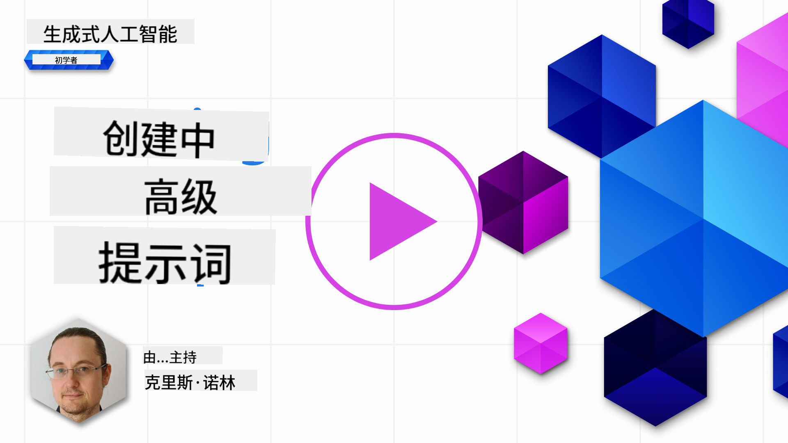

<!--
CO_OP_TRANSLATOR_METADATA:
{
  "original_hash": "b2651fb16bcfbc62b8e518751ed90fdb",
  "translation_date": "2025-10-17T23:19:26+00:00",
  "source_file": "05-advanced-prompts/README.md",
  "language_code": "zh"
}
-->
# 创建高级提示

[](https://youtu.be/BAjzkaCdRok?si=NmUIyRf7-cDgbjtt)

让我们回顾一下上一章的学习内容：

> 提示 _工程_ 是通过提供更有用的指令或上下文来**引导模型生成更相关的响应**的过程。

编写提示有两个步骤：构建提示，通过提供相关的上下文；以及_优化_，即逐步改进提示。

到目前为止，我们已经对如何编写提示有了一些基本的了解，但我们需要更深入地学习。在本章中，您将从尝试各种提示到理解为什么一个提示比另一个提示更好。您将学习如何遵循一些基本技术来构建适用于任何 LLM 的提示。

## 简介

在本章中，我们将涵盖以下主题：

- 通过对提示应用不同的技术来扩展您对提示工程的知识。
- 配置您的提示以改变输出。

## 学习目标

完成本课后，您将能够：

- 应用提示工程技术以改善提示的结果。
- 执行多样化或确定性的提示。

## 提示工程

提示工程是创建能够生成所需结果的提示的过程。提示工程不仅仅是编写一个文本提示，它更像是一组技术，您可以应用这些技术来获得所需的结果。

### 提示示例

让我们来看一个基本的提示示例：

> 生成 10 个关于地理的问题。

在这个提示中，您实际上应用了一组不同的提示技术。

让我们来拆解一下。

- **上下文**，您指定了它应该是关于“地理”的。
- **限制输出**，您希望不超过 10 个问题。

### 简单提示的局限性

您可能会或可能不会得到所需的结果。您会得到生成的问题，但地理是一个很大的主题，您可能无法得到您想要的结果，原因如下：

- **主题广泛**，您不知道它会是关于国家、首都、河流等。
- **格式**，如果您希望问题以某种特定格式呈现怎么办？

正如您所看到的，创建提示时需要考虑很多因素。

到目前为止，我们已经看到了一个简单的提示示例，但生成式 AI 能够做得更多，可以帮助各种角色和行业的人们。接下来让我们探索一些基本技术。

### 提示技术

首先，我们需要理解提示是 LLM 的一种_涌现_属性，这意味着这不是模型内置的功能，而是我们在使用模型时发现的。

我们可以使用一些基本技术来提示 LLM。让我们来探索它们。

- **零样本提示**，这是最基本的提示形式。它是一个单一的提示，仅基于 LLM 的训练数据请求响应。
- **少样本提示**，这种提示通过提供一个或多个示例来指导 LLM，以生成其响应。
- **思维链**，这种提示告诉 LLM 如何将问题分解为步骤。
- **生成知识**，为了改善提示的响应，您可以在提示中额外提供生成的事实或知识。
- **从少到多**，类似于思维链，这种技术是将问题分解为一系列步骤，然后按顺序执行这些步骤。
- **自我优化**，这种技术是对 LLM 的输出进行批评，然后要求其改进。
- **助产式提示**，这里的目标是确保 LLM 的答案是正确的，并要求其解释答案的各个部分。这是一种自我优化的形式。

### 零样本提示

这种提示风格非常简单，它由一个单一的提示组成。这种技术可能是您在开始学习 LLM 时使用的。以下是一个示例：

- 提示：“什么是代数？”
- 回答：“代数是数学的一个分支，研究数学符号及其操作规则。”

### 少样本提示

这种提示风格通过提供一些示例来帮助模型完成请求。它由一个单一的提示和额外的任务特定数据组成。以下是一个示例：

- 提示：“用莎士比亚的风格写一首诗。以下是一些莎士比亚十四行诗的示例：
  十四行诗 18：‘我是否应将你比作夏日？你更可爱更温和……’
  十四行诗 116：‘我不承认真心结合的婚姻有障碍。爱不是爱，当它发现变化时会改变……’
  十四行诗 132：‘我爱你的眼睛，它们怜悯我，知道你的心折磨我，带着轻蔑……’
  现在，写一首关于月亮美丽的十四行诗。”
- 回答：“在天空中，月亮柔和地闪耀，银色的光芒投射出温柔的优雅……”

示例为 LLM 提供了所需输出的上下文、格式或风格。它们帮助模型理解具体任务并生成更准确和相关的响应。

### 思维链

思维链是一种非常有趣的技术，因为它是关于通过一系列步骤引导 LLM。其理念是以一种让 LLM 理解如何完成任务的方式进行指令。以下是一个有和没有思维链的示例：

    - 提示：“爱丽丝有 5 个苹果，扔掉了 3 个苹果，给了鲍勃 2 个苹果，鲍勃又还了一个，爱丽丝还有多少个苹果？”
    - 回答：5

LLM 的回答是 5，这是错误的。正确答案是 1 个苹果，计算如下：(5 - 3 - 2 + 1 = 1)。

那么我们如何教 LLM 正确计算呢？

让我们尝试使用思维链。应用思维链意味着：

1. 给 LLM 一个类似的示例。
2. 显示计算过程，以及如何正确计算。
3. 提供原始提示。

以下是具体操作：

- 提示：“丽莎有 7 个苹果，扔掉了 1 个苹果，给了巴特 4 个苹果，巴特又还了一个：
  7 - 1 = 6
  6 - 4 = 2
  2 + 1 = 3  
  爱丽丝有 5 个苹果，扔掉了 3 个苹果，给了鲍勃 2 个苹果，鲍勃又还了一个，爱丽丝还有多少个苹果？”
  回答：1

注意我们如何通过另一个示例、计算过程以及原始提示来编写更长的提示，最终得到了正确答案 1。

正如您所看到的，思维链是一种非常强大的技术。

### 生成知识

很多时候，当您想要构建一个提示时，您希望使用自己公司的数据。您希望提示的一部分来自公司，另一部分是您感兴趣的实际提示。

例如，如果您从事保险业务，您的提示可能如下所示：

```text
{{company}}: {{company_name}}
{{products}}:
{{products_list}}
Please suggest an insurance given the following budget and requirements:
Budget: {{budget}}
Requirements: {{requirements}}
```

上面您可以看到提示是如何使用模板构建的。在模板中，有一些变量，用 `{{variable}}` 表示，这些变量将被公司 API 的实际值替换。

以下是替换变量后提示的示例：

```text
Insurance company: ACME Insurance
Insurance products (cost per month):
- Car, cheap, 500 USD
- Car, expensive, 1100 USD
- Home, cheap, 600 USD
- Home, expensive, 1200 USD
- Life, cheap, 100 USD

Please suggest an insurance given the following budget and requirements:
Budget: $1000
Requirements: Car, Home, and Life insurance
```

将此提示输入 LLM 后会生成如下响应：

```output
Given the budget and requirements, we suggest the following insurance package from ACME Insurance:
- Car, cheap, 500 USD
- Home, cheap, 600 USD
- Life, cheap, 100 USD
Total cost: $1,200 USD
```

如您所见，它还建议了人寿保险，这是不应该的。这个结果表明我们需要通过更清晰地表达提示来优化它。经过一些_试验和错误_后，我们得到了以下提示：

```text
Insurance company: ACME Insurance
Insurance products (cost per month):
- type: Car, cheap, cost: 500 USD
- type: Car, expensive, cost: 1100 USD
- type: Home, cheap, cost: 600 USD
- type: Home, expensive, cost: 1200 USD
- type: Life, cheap, cost: 100 USD

Please suggest an insurance given the following budget and requirements:
Budget: $1000 restrict choice to types: Car, Home
```

注意，添加了 _类型_ 和 _成本_，并使用了关键字 _限制_，这有助于 LLM 理解我们的需求。

现在我们得到了以下响应：

```output
Given the budget and requirements, we suggest the Car, Cheap insurance product which costs 500 USD per month.
```

这个示例的重点是展示即使我们使用了像_生成知识_这样的基本技术，在大多数情况下我们仍然需要优化提示以获得所需的结果。

### 从少到多

从少到多提示的理念是将一个较大的问题分解为子问题。这样，您可以帮助指导 LLM 如何“攻克”更大的问题。一个很好的示例可以是数据科学领域，您可以要求 LLM 将问题分解如下：

> 提示：如何用 5 个步骤进行数据科学？

您的 AI 助手回答：

1. 收集数据
2. 清理数据
3. 分析数据
4. 绘制数据
5. 展示数据

### 自我优化，批评结果

对于生成式 AI 和 LLM，您不能完全信任其输出。您需要验证它。毕竟，LLM 只是向您展示最可能的下一句话，而不是正确的内容。因此，一个好主意是要求 LLM 批评自己，这引出了自我优化技术。

其工作原理如下：

1. 初始提示要求 LLM 解决问题
2. LLM 给出答案
3. 您对答案进行批评并要求 AI 改进
4. LLM 再次回答，这次考虑了批评并提出了改进建议

您可以根据需要多次重复此过程。

以下是使用此技术的示例：

> 提示：“创建一个带有产品和客户路由的 Python Web API”

AI 回答：

```python
import flask
app = Flask(__name__)

@app.route('/products')
def products():
    return 'Products'

@app.route('/customers')
def customers():
    return 'Customers'
```

> 提示：建议上述代码的 3 个改进

AI 回答：

```text
Sure, here are three suggestions to improve the code:

Import the correct module: The first line should import Flask instead of flask. The correct import statement should be from flask import Flask.

Add a main function: Add a if __name__ == '__main__': block to the end of the file to run the application when the file is executed.

Use f-strings: Use f-strings to format the return statements in the route functions. For example, return 'Products' can be changed to return f'This is the {request.path} page'.
```

```python
from flask import Flask, request

app = Flask(__name__)

@app.route('/products')
def products():
    return f'This is the {request.path} page'

@app.route('/customers')
def customers():
    return f'This is the {request.path} page'

if __name__ == '__main__':
    app.run()
```

如您所见，上述 AI 响应通过对第一个答案的批评改进了最初建议的代码。

### 助产式提示

助产式提示是一种类似于自我优化的技术，但它更多是关于要求 LLM 解释自己。其目标是减少 LLM 输出中的不一致性，以确保其得出正确答案。需要遵循的工作流程是：

1. 要求 LLM 回答一个问题
2. 对答案的每个部分要求 LLM 进行更深入的解释。
3. 如果有不一致的地方，舍弃不一致的部分。

重复步骤 2 和 3，直到您对答案满意。

以下是一个提示示例：

> 提示：如何通过 5 个步骤创建一个危机计划以应对疫情？
> LLM 回答：

```text
1. Identify the risks
1. Identify the stakeholders
1. Identify the resources
1. Identify the actions
1. Identify the communication channels
```

它识别了 5 个步骤，但我们能否确定这是正确的？让我们要求 LLM 详细解释每个步骤：

> 提示：详细解释第一步，疫情的详细风险是什么？

```text
The risks are the following:

- Loss of life
- Loss of business
- Loss of reputation
- Loss of customers
- Loss of employees
```

此时，我们希望确保 LLM 是正确的，因此我们要求它更详细地解释第一个风险，并希望它与上述答案一致：

> 提示：在疫情中，最大的风险是什么，为什么？

```text
The biggest risk is loss of life because it's the most important thing to protect.
```

> 疫情中最大的两个风险是什么？

```text
The two biggest risks are loss of life and loss of business.
```

此时，LLM 是一致的，并提到了“生命”和“业务”是两个最大的风险。我们现在可以继续下一步，并感到相当有信心。然而，我们不应该盲目相信 LLM，我们应该始终验证其输出。

## 改变您的输出

LLM 本质上是非确定性的，这意味着每次运行相同的提示时，您都会得到不同的结果。试试以下提示：

> “生成一个 Python Web API 的代码”

```python
# Import necessary modules
import flask
from flask import request, jsonify

# Create a Flask app
app = flask.Flask(__name__)

# Create a route for the API
@app.route('/api', methods=['GET'])
def api():
    # Get the data from the request
    data = request.args

    # Process the data
    result = process_data(data)

    # Return the result as JSON
    return jsonify(result)

# Function to process the data
def process_data(data):
    # Do something with the data
    result = data + 1

    # Return the result
    return result

# Run the app
if __name__ == '__main__':
    app.run()

```

再次运行相同的提示会生成稍微不同的响应：

```python
#import necessary packages
import flask
from flask import request, jsonify

#create the Flask application
app = flask.Flask(__name__)
app.config["DEBUG"] = True

#create a list of books
books = [
    {'id': 0,
     'title': 'A Fire Upon the Deep',
     'author': 'Vernor Vinge',
     'first_sentence': 'The coldsleep itself was dreamless.',
     'year_published': '1992'},
    {'id': 1,
     'title': 'The Ones Who Walk Away From Omelas',
     'author': 'Ursula K. Le Guin',
     'first_sentence': 'With a clamor of bells that set the swallows soaring, the Festival of Summer came to the city Omelas, bright-towered by the sea.',
     'published': '1973'},
    {'id': 2,
     'title': 'Dhalgren',
     'author': 'Samuel R. Delany',
     'first_sentence': 'to wound the autumnal city.',
     'published': '1975'}
]

#create an endpoint for the API
@app.route('/', methods=['GET'])
def home():
    return '''<h1>Books API</h1>
<p>A prototype API for retrieving books.</p>'''

#create an endpoint to return all books
@app.route('/api/v1/resources/books/all', methods=['GET'])
def api_all():
    return jsonify(books)

#create an endpoint to return a single book
@app.route('/api/v1/resources/books', methods=['GET'])
def api_id():
    #check if an ID was provided as part of the URL
    #if ID is provided, assign it to a variable
    #if no ID is provided, display an error
    if 'id' in request.args:
        id = int(request.args['id'])
    else:
        return "Error: No id field provided. Please specify an id."

    #create an empty list for our results
    results = []

    #loop through the data and match results that fit the requested ID
    #IDs are unique, but other fields might return many results
    for book in books:
        if book['id'] == id:
            results.append(book)

    #use the jsonify function from Flask to convert our list of
    #Python dictionaries to the JSON format
    return jsonify(results)

app.run()
```

> 那么输出的变化是问题吗？

这取决于您想要实现的目标。如果您希望获得特定的响应，那么这就是一个问题。如果您对变化的输出感到满意，比如“生成关于地理的任意 3 个问题”，那么这就不是问题。

### 使用温度来改变输出

好的，我们已经决定希望限制输出，使其更可预测，也就是更具确定性。我们该怎么做呢？

温度是一个介于 0 和 1 之间的值，其中 0 是最确定的，1 是最变化的。默认值是 0.7。让我们看看当温度设置为 0.1 时，同一提示的两次运行会发生什么：

> “生成一个 Python Web API 的代码”

```python
#import necessary libraries
import flask
from flask import request, jsonify

#create an instance of the Flask class
app = flask.Flask(__name__)

#create an endpoint for the API
@app.route('/api/v1/endpoint', methods=['GET'])
def api_endpoint():
    #get the request data
    data = request.get_json()

    #process the data
    result = process_data(data)

    #return the result
    return jsonify(result)

#function to process the data
def process_data(data):
    #process the data
    result = {'result': 'success'}

    #return the result
    return result

#run the Flask app
if __name__ == '__main__':
    app.run()

```

再次运行提示会得到以下结果：

```python
#import necessary libraries
import flask
from flask import request, jsonify

#create a Flask app
app = flask.Flask(__name__)

#create a route for the API
@app.route('/api', methods=['GET'])
def api_call():
    #get the data from the request
    data = request.get_json()

    #process the data
    result = process_data(data)

    #return the result
    return jsonify(result)

#define the process_data function
def process_data(data):
    #do something with the data
    result = data + 1

    #return the result
    return result

#run the app
if __name__ == '__main__':
    app.run()

```

这两个输出之间只有很小的差异。这次我们做相反的事情，将温度设置为 0.9：

```python
# Import necessary libraries
import flask
from flask import request, jsonify

# Create a Flask app
app = flask.Flask(__name__)

# Create a route for the API
@app.route('/api', methods=['GET'])
def api_call():
    # Get the data from the request
    data = request.args

    # Process the data
    result = process_data(data)

    # Return the result
    return jsonify(result)

# Function to process the data
def process_data(data):
    # Do something with the data
    result = data + 1

    # Return the result
    return result

# Run the app
if __name__ == '__main__':
    app.run()

```

第二次尝试，温度值为 0.9：

```python
import flask
from flask import request, jsonify

# create the Flask app
app = flask.Flask(__name__)
app.config['DEBUG'] = True

# create some test data
books = [
    {'id': 0, 'title': 'A Fire Upon The Deep', 'author': 'Vernor Vinge', 'first_sentence': 'The coldsleep itself was dreamless.', 'year_published': '1992'},
    {'id': 1, 'title': 'The Ones Who Walk Away From Omelas', 'author': 'Ursula K. Le Guin', 'first_sentence': 'With a clamor of bells that set the swallows soaring, the Festival of Summer came to the city Omelas, bright-towered by the sea.', 'published': '1973'},
    {'id': 2, 'title': 'Dhalgren', 'author': 'Samuel R. Delany', 'first_sentence': 'to wound the autumnal city.', 'published': '1975'}
]

# create an endpoint
@app.route('/', methods=['GET'])
def home():
    return '''<h1>Welcome to our book API!</h1>'''

@app.route('/api/v1/resources/books

```

正如你所见，结果可能会非常多样化。

> 请注意，还有更多参数可以调整以改变输出，例如 top-k、top-p、重复惩罚、长度惩罚和多样性惩罚，但这些内容超出了本课程的范围。

## 良好实践

有许多实践方法可以帮助你获得想要的结果。随着你越来越多地使用提示，你会找到自己的风格。

除了我们已经讨论过的技术之外，还有一些在提示 LLM 时需要考虑的良好实践。

以下是一些需要考虑的良好实践：

- **指定上下文**。上下文很重要，越能具体说明领域、主题等，效果越好。
- 限制输出。如果你需要特定数量的项目或特定长度，请明确说明。
- **明确说明内容和方式**。记得同时说明你想要什么以及如何实现，例如“创建一个包含产品和客户路由的 Python Web API，并将其分为三个文件”。
- **使用模板**。通常，你会希望用公司数据来丰富你的提示。可以使用模板来实现这一点。模板可以包含变量，你可以用实际数据替换这些变量。
- **拼写正确**。虽然 LLM 可能会提供正确的响应，但如果拼写正确，你会得到更好的响应。

## 作业

以下是使用 Flask 构建简单 API 的 Python 代码：

```python
from flask import Flask, request

app = Flask(__name__)

@app.route('/')
def hello():
    name = request.args.get('name', 'World')
    return f'Hello, {name}!'

if __name__ == '__main__':
    app.run()
```
  
使用像 GitHub Copilot 或 ChatGPT 这样的 AI 助手，并应用“自我优化”技术来改进代码。

## 解决方案

请尝试通过向代码添加合适的提示来完成作业。

> [!TIP]  
> 提出一个提示来要求改进，限制改进的数量是个好主意。你也可以要求以某种方式改进，例如架构、性能、安全性等。

[解决方案](../../../05-advanced-prompts/python/aoai-solution.py)

## 知识检查

为什么要使用链式思维提示？请给出一个正确答案和两个错误答案。

1. 教 LLM 如何解决问题。  
1. B，教 LLM 找出代码中的错误。  
1. C，指示 LLM 提出不同的解决方案。  

A: 1，因为链式思维提示是通过提供一系列步骤以及类似问题及其解决方法，向 LLM 展示如何解决问题。

## 🚀 挑战

你刚刚在作业中使用了自我优化技术。选择你构建的任何程序，考虑你想对其进行哪些改进。现在使用自我优化技术来应用这些建议的更改。你认为结果如何，是更好还是更差？

## 出色的工作！继续学习

完成本课后，请查看我们的 [生成式 AI 学习合集](https://aka.ms/genai-collection?WT.mc_id=academic-105485-koreyst)，继续提升你的生成式 AI 知识！

前往第 6 课，我们将应用提示工程知识来[构建文本生成应用](../06-text-generation-apps/README.md?WT.mc_id=academic-105485-koreyst)。

---

**免责声明**：  
本文档使用AI翻译服务[Co-op Translator](https://github.com/Azure/co-op-translator)进行翻译。尽管我们努力确保翻译的准确性，但请注意，自动翻译可能包含错误或不准确之处。原始语言的文档应被视为权威来源。对于重要信息，建议使用专业人工翻译。我们不对因使用此翻译而产生的任何误解或误读承担责任。