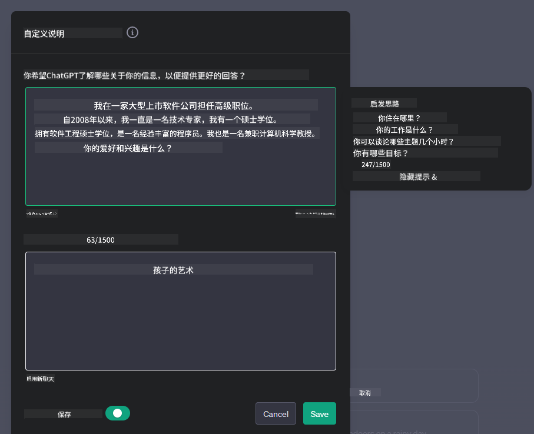
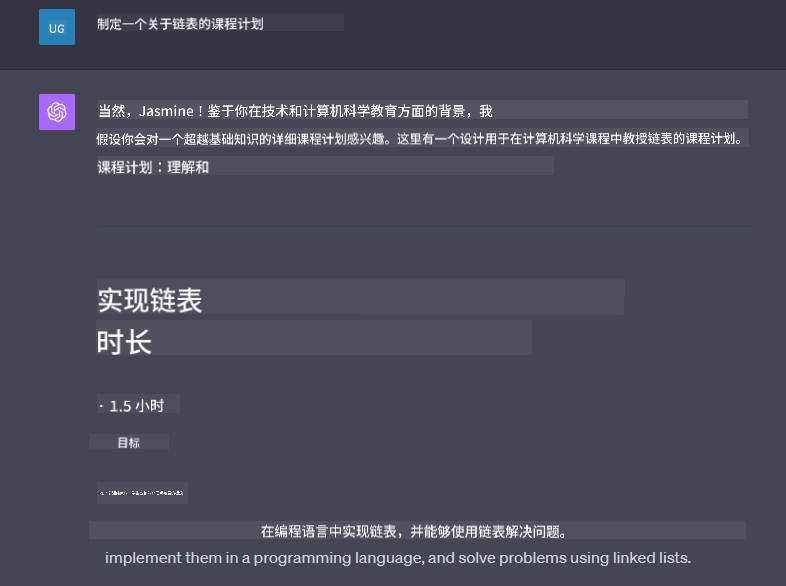

<!--
CO_OP_TRANSLATOR_METADATA:
{
  "original_hash": "ea4bbe640847aafbbba14dae4625e9af",
  "translation_date": "2025-05-19T10:15:34+00:00",
  "source_file": "07-building-chat-applications/README.md",
  "language_code": "zh"
}
-->
# 构建生成式 AI 驱动的聊天应用程序

[](https://aka.ms/gen-ai-lessons7-gh?WT.mc_id=academic-105485-koreyst)

> _(点击上图观看本课视频)_

现在我们已经了解了如何构建文本生成应用程序，让我们来看看聊天应用程序。

聊天应用程序已经融入我们的日常生活，不仅仅是闲聊的工具。它们是客户服务、技术支持甚至复杂建议系统的重要组成部分。很可能不久前你就从聊天应用程序中获得过帮助。随着我们将更先进的技术如生成式 AI 集成到这些平台中，复杂性增加，挑战也随之增加。

我们需要回答的一些问题是：

- **构建应用程序**。如何高效地构建并无缝集成这些 AI 驱动的应用程序以满足特定用例？
- **监控**。应用程序部署后，如何监控并确保其在功能性和遵循[负责任的 AI 六大原则](https://www.microsoft.com/ai/responsible-ai?WT.mc_id=academic-105485-koreyst)方面保持最高质量？

随着我们进一步进入自动化和无缝人机交互定义的时代，了解生成式 AI 如何改变聊天应用程序的范围、深度和适应性变得至关重要。本课将探讨支持这些复杂系统的架构方面，深入研究针对特定领域任务的微调方法，并评估确保负责任 AI 部署的相关指标和考虑。

## 介绍

本课涵盖：

- 高效构建和集成聊天应用程序的技术。
- 如何对应用程序进行定制和微调。
- 有效监控聊天应用程序的策略和考虑。

## 学习目标

通过学习本课，你将能够：

- 描述将聊天应用程序构建并集成到现有系统中的考虑因素。
- 为特定用例定制聊天应用程序。
- 确定关键指标和考虑因素，以有效监控和维护 AI 驱动聊天应用程序的质量。
- 确保聊天应用程序负责任地利用 AI。

## 将生成式 AI 集成到聊天应用程序中

通过生成式 AI 提升聊天应用程序不仅仅是让它们更智能；而是优化其架构、性能和用户界面，以提供优质的用户体验。这涉及到调查架构基础、API 集成和用户界面考虑。本节旨在为你提供一份全面的路线图，无论是将它们集成到现有系统中还是将它们构建为独立平台。

通过本节，你将具备高效构建和整合聊天应用程序所需的专业知识。

### 聊天机器人还是聊天应用程序？

在我们深入构建聊天应用程序之前，让我们比较一下“聊天机器人”和“AI 驱动的聊天应用程序”，它们扮演着不同的角色和功能。聊天机器人的主要目的是自动化特定的对话任务，例如回答常见问题或跟踪包裹。它通常由基于规则的逻辑或复杂的 AI 算法控制。相比之下，AI 驱动的聊天应用程序是一个更广泛的环境，旨在促进各种形式的数字通信，如文本、语音和视频聊天。其定义特征是集成了生成式 AI 模型，可以模拟细致入微的、类似人类的对话，根据各种输入和上下文线索生成响应。生成式 AI 驱动的聊天应用程序可以进行开放域讨论，适应不断变化的对话上下文，甚至产生创造性或复杂的对话。

下表概述了关键的差异和相似之处，以帮助我们理解它们在数字通信中的独特角色。

| 聊天机器人                           | 生成式 AI 驱动的聊天应用程序           |
| ------------------------------------- | -------------------------------------- |
| 任务专注和基于规则                   | 上下文感知                              |
| 通常集成到更大的系统中               | 可以托管一个或多个聊天机器人           |
| 限于编程功能                         | 集成生成式 AI 模型                     |
| 专业化和结构化的交互                 | 能够进行开放域讨论                     |

### 利用 SDK 和 API 的预构建功能

在构建聊天应用程序时，首先评估已有的功能是一个很好的第一步。使用 SDK 和 API 构建聊天应用程序是一个有利的策略，原因多种多样。通过集成文档齐全的 SDK 和 API，你可以战略性地定位你的应用程序，以长期成功解决可扩展性和维护问题。

- **加快开发过程并减少开销**：依赖预构建功能而不是自己构建这些昂贵的过程，可以让你专注于应用程序的其他方面，例如业务逻辑。
- **更好的性能**：从头构建功能时，你最终会问自己“它如何扩展？这个应用程序是否能够处理用户的突然涌入？”维护良好的 SDK 和 API 通常对这些问题有内置解决方案。
- **更容易维护**：更新和改进更容易管理，因为大多数 API 和 SDK 只需在发布新版本时更新库。
- **访问前沿技术**：利用经过微调和训练的大型数据集的模型为你的应用程序提供自然语言能力。

访问 SDK 或 API 的功能通常涉及获得使用所提供服务的权限，这通常是通过使用唯一密钥或身份验证令牌来实现的。我们将使用 OpenAI Python 库来探索这是什么样子。你也可以在以下[OpenAI 笔记本](../../../07-building-chat-applications/python/oai-assignment.ipynb)或[Azure OpenAI 服务笔记本](../../../07-building-chat-applications/python/aoai-assignment.ipynb)中尝试。

```python
import os
from openai import OpenAI

API_KEY = os.getenv("OPENAI_API_KEY","")

client = OpenAI(
    api_key=API_KEY
    )

chat_completion = client.chat.completions.create(model="gpt-3.5-turbo", messages=[{"role": "user", "content": "Suggest two titles for an instructional lesson on chat applications for generative AI."}])
```

上面的示例使用 GPT-3.5 Turbo 模型来完成提示，但请注意在执行此操作之前已设置 API 密钥。如果未设置密钥，则会收到错误。

## 用户体验 (UX)

一般的 UX 原则适用于聊天应用程序，但由于涉及到机器学习组件，这里有一些额外的考虑变得尤为重要。

- **处理歧义的机制**：生成式 AI 模型有时会生成模棱两可的答案。允许用户请求澄清的功能可以帮助他们解决这个问题。
- **上下文保留**：先进的生成式 AI 模型具有在对话中记住上下文的能力，这可能是用户体验的必要资产。让用户能够控制和管理上下文可以改善用户体验，但也带来了保留敏感用户信息的风险。对信息存储时间的考虑，例如引入保留策略，可以在上下文需求与隐私之间取得平衡。
- **个性化**：借助学习和适应能力，AI 模型为用户提供了个性化体验。通过用户档案等功能定制用户体验不仅让用户感到被理解，还帮助他们找到具体答案，创造更高效和满意的互动。

个性化的一个例子是 OpenAI 的 ChatGPT 中的“自定义指令”设置。它允许你提供关于自己的信息，这可能是提示的重要上下文。以下是一个自定义指令的示例。



这个“档案”提示 ChatGPT 创建一个关于链表的课程计划。请注意，ChatGPT 考虑到用户可能希望根据她的经验获得更深入的课程计划。



### 微软的大型语言模型系统消息框架

[微软提供了指导](https://learn.microsoft.com/azure/ai-services/openai/concepts/system-message#define-the-models-output-format?WT.mc_id=academic-105485-koreyst)，用于在生成 LLM 响应时撰写有效的系统消息，分为四个领域：

1. 定义模型的目标用户以及其能力和局限性。
2. 定义模型的输出格式。
3. 提供展示模型预期行为的具体示例。
4. 提供额外的行为保护措施。

### 可访问性

无论用户是视觉、听觉、运动还是认知障碍，一个设计良好的聊天应用程序应该对所有人都可用。以下列表详细介绍了针对各种用户障碍的增强可访问性的具体功能。

- **视觉障碍功能**：高对比度主题和可调整大小的文本，屏幕阅读器兼容性。
- **听觉障碍功能**：文本转语音和语音转文本功能，音频通知的视觉提示。
- **运动障碍功能**：键盘导航支持，语音命令。
- **认知障碍功能**：简化语言选项。

## 针对领域特定语言模型的定制和微调

想象一个聊天应用程序，能够理解你公司的术语并预测其用户群通常会有的特定查询。有几种值得一提的方法：

- **利用 DSL 模型**。DSL 代表领域特定语言。你可以利用所谓的 DSL 模型训练一个特定领域以理解其概念和场景。
- **应用微调**。微调是通过特定数据进一步训练模型的过程。

## 定制：使用 DSL

利用领域特定语言模型（DSL 模型）可以通过提供专业的、上下文相关的互动来增强用户参与度。它是一个经过训练或微调的模型，能够理解和生成与特定领域、行业或主题相关的文本。使用 DSL 模型的选项可以从头训练一个，到通过 SDK 和 API 使用现有的模型。另一种选择是微调，即将现有的预训练模型适应特定领域。

## 定制：应用微调

当预训练模型在特定领域或任务中表现不佳时，通常会考虑微调。

例如，医疗查询复杂且需要大量上下文。当医疗专业人员诊断患者时，通常基于各种因素，如生活方式或既往病史，甚至可能依赖最近的医学期刊来验证诊断。在如此复杂的场景中，通用 AI 聊天应用程序无法成为可靠的来源。

### 场景：医疗应用程序

考虑一个设计用于帮助医疗专业人员的聊天应用程序，通过提供治疗指南、药物相互作用或最新研究结果的快速参考。

通用模型可能足以回答基本医疗问题或提供一般建议，但在以下方面可能会遇到困难：

- **高度具体或复杂的案例**。例如，神经科医生可能会问应用程序：“目前管理药物耐药性癫痫的最佳实践是什么？”
- **缺乏最新进展**。通用模型可能难以提供包含神经学和药理学最新进展的当前答案。

在这些情况下，通过专门的医疗数据集微调模型可以显著提高其处理这些复杂医疗查询的能力和可靠性。这需要访问一个大型且相关的数据集，该数据集代表需要解决的领域特定挑战和问题。

## 高质量 AI 驱动聊天体验的考虑

本节概述了“高质量”聊天应用程序的标准，包括可操作指标的捕获和遵循负责任地利用 AI 技术的框架。

### 关键指标

为了保持应用程序的高质量性能，跟踪关键指标和考虑因素至关重要。这些测量不仅确保应用程序的功能，还评估 AI 模型和用户体验的质量。以下是考虑的基本、AI 和用户体验指标列表。

| 指标                           | 定义                                                                                                             | 聊天开发者的考虑                                                         |
| ----------------------------- | ------------------------------------------------------------------------------------------------------------------ | ------------------------------------------------------------------------- |
| **正常运行时间**               | 衡量应用程序可操作和用户可访问的时间。                                              | 你将如何最大限度地减少停机时间？                                           |
| **响应时间**                   | 应用程序回复用户查询所需的时间。                                                          | 你如何优化查询处理以改善响应时间？                                        |
| **精准度**                     | 正确预测的正例与正预测总数的比率                                     | 你将如何验证模型的精准度？                                                |
| **召回率（敏感度）**           | 正确预测的正例与实际正例的比率                                               | 你将如何测量和改善召回率？                                                |
| **F1 分数**                    | 精准度和召回率的调和平均值，平衡两者之间的权衡。                                   | 你的目标 F1 分数是多少？你将如何平衡精准度和召回率？                      |
| **困惑度**                     | 衡量模型预测的概率分布与实际数据分布的吻合程度。 | 你将如何最小化困惑度？                                                   |
| **用户满意度指标**             | 衡量用户对应用程序的感知。通常通过调查收集。                                     | 你将如何频繁收集用户反馈？你将如何根据反馈进行调整？                      |
| **错误率**                     | 模型在理解或输出中犯错的比率。                                                 | 你有什么策略来减少错误率？                                                |
| **重训练周期**                 | 更新模型以合并新数据和见解的频率。                                    | 你将如何频繁地重训练模型？是什么触发了重训练周期？                        |
| **异常检测**                   | 用于识别不符合预期行为的异常模式的工具和技术。                        | 你将如何应对异常？                                                        |

### 在聊天应用程序中实施负责任的 AI 实践

微软的负责任 AI 方法确定了六项原则，应指导 AI 的开发和使用。以下是这些原则、它们的定义、聊天开发者应该考虑的事项以及为什么它们重要。

| 原则                           | 微软的定义                                | 聊天开发者的考虑                                                         | 为什么重要                                                                             |
| ----------------------------- | ------------------------------------------ | ------------------------------------------------------------------------- | -------------------------------------------------------------------------------------- |
| 公平性                        | AI 系统应该公平对待所有人。                | 确保聊天应用程序不基于用户数据进行歧视。                                 | 建立用户信任和包容性；避免法律后果。                                                   |
| 可靠性和安全性                | AI 系统应该可靠安全地运行。                | 实施测试和故障保护措施以最大限度减少错误和风险。                         | 确保用户满意度并防止潜在伤害。                                                         |
| 隐私和安全性                  | AI 系统应该是安全的并尊重隐私。            | 实施强大的加密和数据保护措施。                                           | 保护敏感用户数据并遵守隐私法律。                                                       |
| 包容性                        | AI 系统应该赋予每个人权力并吸引人们。      | 设计可访问且易于使用的多样化用户界面的 UI/UX。                           | 确保更多人能够有效地使用应用程序。                                                     |
| 透明性                        | AI 系统应该是可理解的。                    | 提供清晰的文档和 AI 响应的理由。                                         | 用户更有可能信任一个系统，如果他们能理解决策是如何做出的。                           |
| 责任性                        | 人们应该对 AI 系统负责。                   | 建立明确的流程来审计和改进 AI 决策。                                     | 允许持续改进和在出现错误时采取纠正措施。                                               |

## 作业

查看[作业](../../../07-building-chat-applications/python)，它将带你完成一系列练习，从运行你的第一个聊天提示，到分类和总结文本等等。请注意，作业有不同的编程语言可供选择！

## 做得好！继续学习之旅

完成本课后，请查看我们的[生成式 AI 学习集合](https://aka.ms/genai-collection?WT.mc_id=academic-105485-koreyst)，继续提升你的生成式 AI 知识！

前往第 8 课，看看如何开始[构建搜索应用程序](../08-building-search-applications/README.md?WT.mc_id=academic-105485-koreyst)！

**免责声明**：  
本文档已使用 AI 翻译服务 [Co-op Translator](https://github.com/Azure/co-op-translator) 翻译。尽管我们努力确保准确性，但请注意，自动翻译可能包含错误或不准确之处。应将原始语言的文档视为权威来源。对于关键信息，建议进行专业人工翻译。我们对因使用此翻译而产生的任何误解或误读不承担责任。