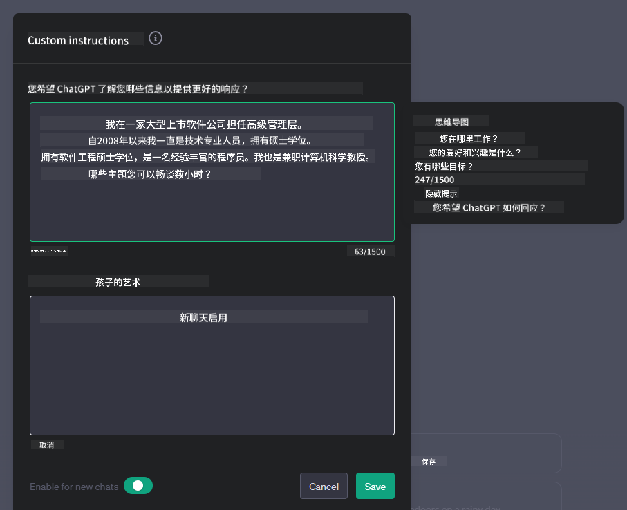
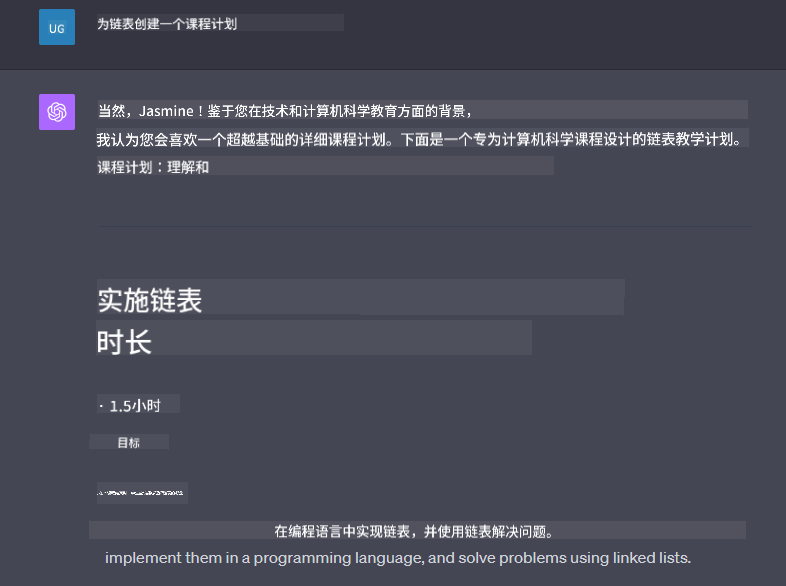

<!--
CO_OP_TRANSLATOR_METADATA:
{
  "original_hash": "ea4bbe640847aafbbba14dae4625e9af",
  "translation_date": "2025-06-25T15:10:52+00:00",
  "source_file": "07-building-chat-applications/README.md",
  "language_code": "zh"
}
-->
# 构建生成式 AI 驱动的聊天应用程序

[](https://aka.ms/gen-ai-lessons7-gh?WT.mc_id=academic-105485-koreyst)

> _(点击上方图片观看本课视频)_

现在我们已经了解了如何构建文本生成应用程序，让我们来看看聊天应用程序。

聊天应用程序已经融入我们的日常生活，不仅仅是休闲对话的工具。它们是客户服务、技术支持，甚至复杂咨询系统的重要组成部分。你很可能不久前就从聊天应用程序中获得了一些帮助。随着我们将更先进的技术如生成式 AI 集成到这些平台中，复杂性增加，挑战也随之而来。

我们需要回答的一些问题是：

- **构建应用程序**。我们如何有效地构建并无缝集成这些 AI 驱动的应用程序以适应特定的用例？
- **监控**。一旦部署，我们如何监控并确保应用程序在功能和遵循[负责任 AI 的六项原则](https://www.microsoft.com/ai/responsible-ai?WT.mc_id=academic-105485-koreyst)方面保持最高质量？

随着我们进入一个以自动化和无缝人机交互为特征的时代，理解生成式 AI 如何改变聊天应用程序的范围、深度和适应性变得至关重要。本课将探讨支持这些复杂系统的架构方面，深入研究为特定领域任务进行微调的方法，并评估确保负责任 AI 部署的指标和考虑因素。

## 介绍

本课涵盖：

- 高效构建和集成聊天应用程序的技术。
- 如何对应用程序进行定制和微调。
- 有效监控聊天应用程序的策略和考虑因素。

## 学习目标

在本课结束时，你将能够：

- 描述将聊天应用程序构建和集成到现有系统中的考虑因素。
- 针对特定用例定制聊天应用程序。
- 识别有效监控和维护 AI 驱动的聊天应用程序质量的关键指标和考虑因素。
- 确保聊天应用程序负责任地利用 AI。

## 将生成式 AI 集成到聊天应用程序中

通过生成式 AI 提升聊天应用程序不仅仅是让它们更智能；它是关于优化它们的架构、性能和用户界面，以提供高质量的用户体验。这涉及研究架构基础、API 集成和用户界面考虑因素。本节旨在为您提供一个全面的路线图，以便在这些复杂的环境中导航，无论您是将它们集成到现有系统中，还是将其构建为独立平台。

在本节结束时，您将具备高效构建和整合聊天应用程序的专业知识。

### 聊天机器人还是聊天应用程序？

在我们深入构建聊天应用程序之前，让我们比较一下“聊天机器人”和“AI 驱动的聊天应用程序”，它们具有不同的角色和功能。聊天机器人的主要目的是自动化特定的对话任务，例如回答常见问题或跟踪包裹。它通常由基于规则的逻辑或复杂的 AI 算法控制。相比之下，AI 驱动的聊天应用程序是一个更广泛的环境，旨在促进人类用户之间的各种形式的数字通信，如文本、语音和视频聊天。其定义特征是集成了一个生成式 AI 模型，该模型模拟细致入微的类人对话，根据各种输入和上下文线索生成响应。生成式 AI 驱动的聊天应用程序可以进行开放领域的讨论，适应不断变化的对话环境，甚至产生创造性或复杂的对话。

下表列出了它们在数字通信中独特角色的关键区别和相似之处。

| 聊天机器人                         | 生成式 AI 驱动的聊天应用程序         |
| -------------------------------- | -------------------------------- |
| 任务导向和基于规则                  | 上下文感知                            |
| 通常集成到更大的系统中               | 可以托管一个或多个聊天机器人          |
| 限于编程功能                        | 包含生成式 AI 模型                    |
| 专门化和结构化互动                  | 能够进行开放领域讨论                   |

### 利用 SDK 和 API 的预构建功能

在构建聊天应用程序时，一个很好的第一步是评估现有的内容。使用 SDK 和 API 构建聊天应用程序是一种有利的策略，原因多种多样。通过集成文档完善的 SDK 和 API，您可以战略性地为应用程序的长期成功奠定基础，解决可扩展性和维护问题。

- **加速开发过程并减少开销**：依赖预构建功能而不是自己构建这些昂贵的过程，让您可以专注于应用程序的其他方面，例如业务逻辑。
- **更好的性能**：在从头构建功能时，您最终会问自己“它如何扩展？这个应用程序能否处理突然的用户激增？” 维护良好的 SDK 和 API 通常内置了解决这些问题的解决方案。
- **更容易维护**：更新和改进更易于管理，因为大多数 API 和 SDK 只需在发布新版本时更新库。
- **接触尖端技术**：利用经过微调和在广泛数据集上训练的模型为您的应用程序提供自然语言能力。

访问 SDK 或 API 的功能通常涉及获得使用所提供服务的权限，通常是通过使用唯一密钥或身份验证令牌。我们将使用 OpenAI Python 库来探索这是什么样子。您也可以在以下 [OpenAI 笔记本](../../../07-building-chat-applications/python/oai-assignment.ipynb) 或 [Azure OpenAI 服务笔记本](../../../07-building-chat-applications/python/aoai-assignment.ipynb) 中尝试一下。

```python
import os
from openai import OpenAI

API_KEY = os.getenv("OPENAI_API_KEY","")

client = OpenAI(
    api_key=API_KEY
    )

chat_completion = client.chat.completions.create(model="gpt-3.5-turbo", messages=[{"role": "user", "content": "Suggest two titles for an instructional lesson on chat applications for generative AI."}])
```

上面的示例使用 GPT-3.5 Turbo 模型来完成提示，但请注意，在此之前需要设置 API 密钥。如果不设置密钥，您将收到错误。

## 用户体验 (UX)

通用 UX 原则适用于聊天应用程序，但由于涉及机器学习组件，这里有一些额外的考虑因素变得尤为重要。

- **解决歧义的机制**：生成式 AI 模型偶尔会生成模棱两可的答案。一个允许用户要求澄清的功能可能会在他们遇到此问题时提供帮助。
- **上下文保留**：高级生成式 AI 模型能够记住对话中的上下文，这可能是用户体验的必要资产。让用户能够控制和管理上下文可以改善用户体验，但也引入了保留敏感用户信息的风险。对信息存储时间的考虑，例如引入保留政策，可以在上下文需求与隐私之间取得平衡。
- **个性化**：具有学习和适应能力的 AI 模型为用户提供了个性化体验。通过用户配置文件等功能定制用户体验不仅让用户感到被理解，还可以帮助他们寻找特定答案，从而创造更高效和令人满意的互动。

OpenAI 的 ChatGPT 中的“自定义说明”设置就是个性化的一个例子。它允许您提供有关自己的信息，这些信息可能是您的提示的重要上下文。以下是自定义说明的一个示例。



此“配置文件”提示 ChatGPT 创建一个关于链表的课程计划。请注意，ChatGPT 考虑到用户可能希望根据她的经验获得更深入的课程计划。



### 微软的大型语言模型系统消息框架

[微软提供了指导](https://learn.microsoft.com/azure/ai-services/openai/concepts/system-message#define-the-models-output-format?WT.mc_id=academic-105485-koreyst)，帮助编写有效的系统消息以从 LLMs 生成响应，分为四个方面：

1. 定义模型的目标用户及其能力和局限性。
2. 定义模型的输出格式。
3. 提供演示模型预期行为的具体示例。
4. 提供额外的行为护栏。

### 无障碍性

无论用户是否有视觉、听觉、运动或认知障碍，设计良好的聊天应用程序都应可供所有人使用。以下列表分解了针对各种用户障碍增强无障碍性的具体功能。

- **视觉障碍的功能**：高对比度主题和可调整大小的文本、屏幕阅读器兼容性。
- **听觉障碍的功能**：文本到语音和语音到文本功能、音频通知的视觉提示。
- **运动障碍的功能**：键盘导航支持、语音命令。
- **认知障碍的功能**：简化语言选项。

## 针对领域特定语言模型的定制和微调

想象一个聊天应用程序，它了解您公司的术语，并预测其用户群常见的特定查询。有几种方法值得一提：

- **利用 DSL 模型**。DSL 代表领域特定语言。您可以利用所谓的 DSL 模型，该模型在特定领域进行训练，以理解其概念和场景。
- **应用微调**。微调是使用特定数据进一步训练模型的过程。

## 定制：使用 DSL

利用领域特定语言模型（DSL 模型）可以通过提供专业的、上下文相关的互动来增强用户参与度。这是一个经过训练或微调以理解和生成与特定领域、行业或主题相关文本的模型。使用 DSL 模型的选项可以从从头开始训练，到通过 SDK 和 API 使用现有模型。另一种选择是微调，它涉及采用现有的预训练模型并将其适应特定领域。

## 定制：应用微调

当预训练模型在特定领域或特定任务中表现不佳时，通常会考虑微调。

例如，医疗查询是复杂的，需要大量的上下文。当医疗专业人员诊断患者时，这是基于多种因素，如生活方式或既存条件，甚至可能依赖于最近的医学期刊来验证他们的诊断。在此类复杂场景中，通用 AI 聊天应用程序不能成为可靠的来源。

### 场景：医疗应用程序

考虑一个旨在协助医疗从业者的聊天应用程序，它可以快速参考治疗指南、药物相互作用或最近的研究发现。

通用模型可能足以回答基本的医疗问题或提供一般建议，但在以下方面可能会遇到困难：

- **高度具体或复杂的案例**。例如，神经科医生可能会问应用程序：“当前管理儿童患者药物耐药性癫痫的最佳实践是什么？”
- **缺乏最新进展**。通用模型可能难以提供包含神经学和药理学最新进展的当前答案。

在这些情况下，使用专业的医疗数据集对模型进行微调可以显著提高其处理这些复杂医疗查询的准确性和可靠性。这需要访问一个大型且相关的数据集，代表需要解决的领域特定挑战和问题。

## 高质量 AI 驱动聊天体验的考虑因素

本节概述了“高质量”聊天应用程序的标准，包括可操作指标的捕获和负责任地利用 AI 技术的框架。

### 关键指标

为了保持应用程序的高质量性能，跟踪关键指标和考虑因素至关重要。这些测量不仅确保应用程序的功能，还评估 AI 模型和用户体验的质量。以下是涵盖基本、AI 和用户体验指标的列表供参考。

| 指标                          | 定义                                                                                                               | 聊天开发者的考虑因素                                                  |
| --------------------------- | ---------------------------------------------------------------------------------------------------------------- | ------------------------------------------------------------------- |
| **正常运行时间**                | 测量应用程序可操作和用户可访问的时间。                                                                                 | 您将如何最大限度地减少停机时间？                                           |
| **响应时间**                  | 应用程序回复用户查询所需的时间。                                                                                       | 您如何优化查询处理以提高响应时间？                                        |
| **准确率**                    | 真正阳性预测与阳性预测总数的比率                                                                                         | 您将如何验证模型的准确性？                                              |
| **召回率（灵敏度）**            | 真正阳性预测与实际阳性数的比率                                                                                          | 您将如何测量和提高召回率？                                              |
| **F1 分数**                  | 精确度和召回率的调和平均数，平衡两者之间的权衡。                                                                             | 您的目标 F1 分数是多少？您将如何平衡精度和召回率？                             |
| **困惑度**                    | 测量模型预测的概率分布与数据实际分布的对齐程度。                                                                            | 您将如何最小化困惑度？                                                 |
| **用户满意度指标**              | 测量用户对应用程序的感知。通常通过调查捕获。                                                                                  | 您将多久收集一次用户反馈？您将如何根据反馈进行调整？                               |
| **错误率**                    | 模型在理解或输出中出错的比率。                                                                                           | 您有什么策略来降低错误率？                                               |
| **重新训练周期**               | 更新模型以纳入新数据和见解的频率。                                                                                        | 您将多久重新训练模型？是什么触发重新训练周期？                                  |
| **异常检测**                  | 用于识别不符合预期行为的异常模式的工具和技术。                                                                                | 您将如何应对异常？                                                    |

### 在聊天应用程序中实施负责任的 AI 实践

微软的负责任 AI 方法确定了六项原则，应指导 AI 的开发和使用。以下是原则、定义以及聊天开发者应考虑的事项和原因。

| 原则                     | 微软的定义                                            | 聊天开发者的考虑因素                                             | 重要性                                                                         |
| ---------------------- | -------------------------------------------------- | ------------------------------------------------------------- | ---------------------------------------------------------------------------- |
| 公平性                     | AI 系统应公平对待所有人。                                    | 确保聊天应用程序不基于用户数据进行歧视。                                | 建立用户信任和包容性；避免法律后果。                                                  |
| 可靠性和安全性                | AI 系统应可靠和安全地运行。                                   | 实施测试和故障保护措施以最大限度地减少错误和风险。                            | 确保用户满意度并防止潜在伤害。                                                      |
| 隐私和安全                  | AI 系统应安全并尊重隐私。                                    | 实施强加密和数据保护措施。                                       | 保护用户敏感数据并遵守隐私法律。                                                     |
| 包容性                    | AI 系统应赋予所有人权力并与人们互动。                             | 设计的 UI/UX 应易于使用且适合多元化受众。                               | 确保更多人能够有效地使用应用程序。                                                   |
| 透明度                    | AI 系统应易于理解。                                        | 提供清晰的文档和 AI 响应的理由。                                    | 如果用户能理解系统如何做出决策，他们更可能信任系统。                                      |
| 问责制                    | 人们应对 AI 系统负责。                                      | 建立明确的流程以审计和改进 AI 决策。                                  | 启用持续改进和在出现错误时采取纠正措施。                                                 |

## 作业

请参阅[作业](../../../07-building-chat-applications/python)，它将带您完成一系列练习，从运行您的第一个聊天提示，到分类和总结文本等等。请注意，作业提供了不同的编程语言版本！

## 干得好！继续学习之旅

完成本课后，查看我们的[生成式 AI 学习集合](https://aka.ms/genai-collection?WT.mc_id=academic-105485-koreyst)，继续提升您的生成式 AI 知识！

前往第 8 课，看看您如何开始[构建搜索应用程序](../08-building-search-applications/README.md?WT.mc_id=academic-105485-koreyst)！

**免责声明**：
本文档使用AI翻译服务[Co-op Translator](https://github.com/Azure/co-op-translator)进行翻译。虽然我们努力确保准确性，但请注意，自动翻译可能包含错误或不准确之处。应将原始语言的文档视为权威来源。对于关键信息，建议使用专业人工翻译。对于因使用此翻译而产生的任何误解或误读，我们不承担责任。