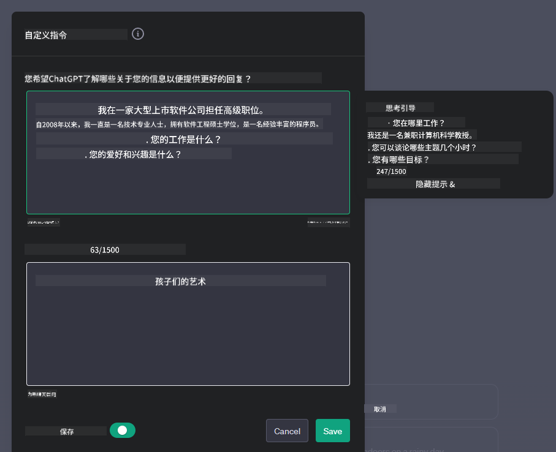

<!--
CO_OP_TRANSLATOR_METADATA:
{
  "original_hash": "ea4bbe640847aafbbba14dae4625e9af",
  "translation_date": "2025-07-09T12:17:59+00:00",
  "source_file": "07-building-chat-applications/README.md",
  "language_code": "zh"
}
-->
# 构建生成式 AI 驱动的聊天应用

[](https://aka.ms/gen-ai-lessons7-gh?WT.mc_id=academic-105485-koreyst)

> _(点击上方图片观看本课视频)_

既然我们已经了解了如何构建文本生成应用，接下来让我们来看看聊天应用。

聊天应用已经融入我们的日常生活，不仅仅是简单的闲聊工具。它们是客户服务、技术支持，甚至复杂咨询系统的重要组成部分。很可能你不久前就通过聊天应用获得过帮助。随着我们将生成式 AI 等更先进的技术整合到这些平台中，系统的复杂性和挑战也随之增加。

我们需要回答的一些问题包括：

- **构建应用**。如何高效构建并无缝集成这些 AI 驱动的应用以满足特定场景需求？
- **监控**。应用部署后，如何监控并确保其在功能和遵守[负责任 AI 六大原则](https://www.microsoft.com/ai/responsible-ai?WT.mc_id=academic-105485-koreyst)方面都保持最高质量？

随着自动化和人机无缝交互时代的到来，理解生成式 AI 如何改变聊天应用的范围、深度和适应性变得至关重要。本课将探讨支持这些复杂系统的架构要素，深入研究针对特定领域任务的微调方法，并评估确保负责任 AI 部署的相关指标和考量。

## 介绍

本课内容包括：

- 高效构建和集成聊天应用的技术。
- 如何对应用进行定制和微调。
- 有效监控聊天应用的策略和注意事项。

## 学习目标

完成本课后，你将能够：

- 描述构建和集成聊天应用到现有系统时的考虑因素。
- 针对特定用例定制聊天应用。
- 识别关键指标和注意事项，有效监控和维护 AI 驱动聊天应用的质量。
- 确保聊天应用负责任地利用 AI 技术。

## 将生成式 AI 集成到聊天应用中

通过生成式 AI 提升聊天应用，不仅仅是让它们更智能，更是优化其架构、性能和用户界面，以提供优质的用户体验。这涉及到架构基础、API 集成和用户界面设计的探讨。本节旨在为你提供一条全面的路线图，帮助你在将聊天应用接入现有系统或构建独立平台时游刃有余。

本节结束时，你将掌握高效构建和集成聊天应用所需的专业知识。

### 聊天机器人还是聊天应用？

在深入构建聊天应用之前，我们先比较一下“聊天机器人”和“AI 驱动的聊天应用”，它们在角色和功能上有明显区别。聊天机器人的主要目的是自动化特定的对话任务，比如回答常见问题或跟踪包裹。它通常基于规则逻辑或复杂的 AI 算法。而 AI 驱动的聊天应用则是一个更广泛的环境，支持多种数字通信形式，如文本、语音和视频聊天。其核心特点是集成了生成式 AI 模型，能够模拟细腻、类人对话，根据多样的输入和上下文线索生成回复。生成式 AI 驱动的聊天应用可以进行开放领域的讨论，适应不断变化的对话上下文，甚至生成创造性或复杂的对话内容。

下表列出了两者的主要区别和相似点，帮助我们理解它们在数字通信中的独特角色。

| 聊天机器人                             | 生成式 AI 驱动的聊天应用                   |
| ------------------------------------- | -------------------------------------- |
| 任务导向且基于规则                     | 具备上下文感知能力                      |
| 通常集成于更大的系统                   | 可能包含一个或多个聊天机器人            |
| 功能受限于预设程序                     | 融合生成式 AI 模型                      |
| 专业且结构化的交互                     | 支持开放领域的对话                      |

### 利用 SDK 和 API 的预构建功能

构建聊天应用时，评估现有资源是一个很好的起点。使用 SDK 和 API 构建聊天应用有多方面优势。通过集成文档完善的 SDK 和 API，你的应用在长期发展中更具竞争力，同时解决了可扩展性和维护性的问题。

- **加快开发进度，降低负担**：依赖预构建功能，避免了自行开发的高昂成本，让你能专注于应用中更重要的部分，比如业务逻辑。
- **性能更优**：从零开始构建功能时，你会关心“它能扩展吗？能否应对用户激增？”而维护良好的 SDK 和 API 通常内置了这些解决方案。
- **维护更简便**：大多数 API 和 SDK 只需更新库版本即可获得最新改进，管理更轻松。
- **接入前沿技术**：利用经过微调和大规模数据训练的模型，为应用提供自然语言处理能力。

访问 SDK 或 API 功能通常需要获得使用权限，通常通过唯一密钥或认证令牌实现。我们将使用 OpenAI Python 库来演示这一过程。你也可以在本课的[OpenAI 笔记本](python/oai-assignment.ipynb)或[Azure OpenAI 服务笔记本](python/aoai-assignment.ipynb)中自行尝试。

```python
import os
from openai import OpenAI

API_KEY = os.getenv("OPENAI_API_KEY","")

client = OpenAI(
    api_key=API_KEY
    )

chat_completion = client.chat.completions.create(model="gpt-3.5-turbo", messages=[{"role": "user", "content": "Suggest two titles for an instructional lesson on chat applications for generative AI."}])
```

上例使用 GPT-3.5 Turbo 模型完成提示，但请注意，API 密钥必须先设置，否则会报错。

## 用户体验（UX）

聊天应用适用通用的用户体验原则，但由于涉及机器学习组件，以下几点尤为重要：

- **处理歧义的机制**：生成式 AI 模型有时会产生模糊答案。提供用户请求澄清的功能能有效应对这一问题。
- **上下文保持**：先进的生成式 AI 模型能记忆对话上下文，这对用户体验至关重要。允许用户控制和管理上下文能提升体验，但也带来敏感信息保留的风险。制定信息存储时长的策略（如保留政策）可以在上下文需求和隐私保护间取得平衡。
- **个性化**：AI 模型具备学习和适应能力，能为用户提供个性化体验。通过用户档案等功能定制体验，不仅让用户感到被理解，还能帮助他们更高效地找到答案，提升互动满意度。

OpenAI ChatGPT 中的“自定义指令”设置就是个性化的典型例子。它允许你提供关于自己的信息，作为提示的重要上下文。以下是一个自定义指令示例。



该“档案”促使 ChatGPT 制定关于链表的课程计划。注意 ChatGPT 会根据用户经验，考虑提供更深入的课程内容。


### 微软的大型语言模型系统消息框架

[微软提供了指导](https://learn.microsoft.com/azure/ai-services/openai/concepts/system-message#define-the-models-output-format?WT.mc_id=academic-105485-koreyst)，帮助编写有效的系统消息以生成 LLM 响应，涵盖四个方面：

1. 定义模型的目标用户、能力和限制。
2. 定义模型的输出格式。
3. 提供展示模型预期行为的具体示例。
4. 设定额外的行为规范。

### 无障碍设计

无论用户有视觉、听觉、运动或认知障碍，设计良好的聊天应用都应确保所有人都能使用。以下列出了针对不同障碍的无障碍功能：

- **视觉障碍**：高对比度主题、可调节字体大小、屏幕阅读器兼容。
- **听觉障碍**：文本转语音和语音转文本功能、音频通知的视觉提示。
- **运动障碍**：键盘导航支持、语音命令。
- **认知障碍**：简化语言选项。

## 针对领域特定语言模型的定制与微调

想象一个聊天应用，能理解你公司的行话，并预测用户常见的具体问题。这里有几种值得关注的方法：

- **利用领域特定语言模型（DSL）**。DSL 是指针对特定领域训练的语言模型，能理解该领域的概念和场景。
- **应用微调**。微调是用特定数据对模型进行进一步训练的过程。

## 定制：使用领域特定语言模型（DSL）

利用领域特定语言模型（DSL 模型）可以通过提供专业且上下文相关的交互，提升用户参与度。DSL 模型是针对某一领域、行业或主题训练或微调的模型。使用 DSL 模型的方式多样，可以从零开始训练，也可以通过 SDK 和 API 使用现成模型。另一种选择是微调，即在已有预训练模型基础上，针对特定领域进行适配。

## 定制：应用微调

当预训练模型在某个专业领域或特定任务上表现不足时，通常会考虑微调。

例如，医疗问题复杂且需要大量上下文。医生诊断患者时，会考虑生活习惯、既往病史，甚至参考最新医学文献。在这种细致入微的场景下，通用 AI 聊天应用难以成为可靠来源。

### 场景示例：医疗应用

设想一个聊天应用，旨在帮助医疗人员快速查询治疗指南、药物相互作用或最新研究成果。

通用模型可能能回答基础医疗问题或提供一般建议，但在以下方面可能力不从心：

- **高度专业或复杂的病例**。例如，神经科医生可能会问：“目前治疗儿童耐药性癫痫的最佳实践是什么？”
- **缺乏最新进展**。通用模型可能无法提供涵盖神经学和药理学最新进展的答案。

在这些情况下，使用专业医疗数据集对模型进行微调，能显著提升其处理复杂医疗问题的准确性和可靠性。这需要获取大量且相关的领域数据，涵盖需解决的专业挑战和问题。

## 高质量 AI 驱动聊天体验的考量

本节概述“高质量”聊天应用的标准，包括可操作指标的采集和负责任利用 AI 技术的框架遵循。

### 关键指标

为了保持应用的高质量表现，必须持续跟踪关键指标和注意事项。这些指标不仅确保应用功能正常，还评估 AI 模型和用户体验的质量。以下列表涵盖了基础指标、AI 指标和用户体验指标。

| 指标                         | 定义                                                                                                                | 聊天开发者的考虑点                                                    |
| ---------------------------- | ------------------------------------------------------------------------------------------------------------------- | -------------------------------------------------------------------- |
| **正常运行时间（Uptime）**   | 测量应用可用且可被用户访问的时间比例。                                                                              | 如何最大限度减少停机时间？                                            |
| **响应时间**                 | 应用回复用户查询所需的时间。                                                                                        | 如何优化查询处理以提升响应速度？                                      |
| **精确率（Precision）**      | 真阳性预测数占所有阳性预测数的比例。                                                                                | 如何验证模型的精确率？                                                |
| **召回率（Recall/敏感度）** | 真阳性预测数占实际阳性数的比例。                                                                                    | 如何衡量并提升召回率？                                                |
| **F1 分数**                  | 精确率和召回率的调和平均数，平衡两者的权衡。                                                                        | 目标 F1 分数是多少？如何平衡精确率和召回率？                          |
| **困惑度（Perplexity）**     | 衡量模型预测的概率分布与实际数据分布的匹配程度。                                                                    | 如何降低困惑度？                                                      |
| **用户满意度指标**           | 衡量用户对应用的感知，通常通过调查收集。                                                                            | 多久收集一次用户反馈？如何根据反馈调整？                              |
| **错误率**                   | 模型在理解或输出时出错的频率。                                                                                      | 有哪些策略用来降低错误率？                                            |
| **重训练周期**               | 模型更新以纳入新数据和见解的频率。                                                                                  | 多久重训练一次模型？什么情况触发重训练？                              |
| **异常检测**               | 用于识别不符合预期行为的异常模式的工具和技术。                                      | 你将如何应对异常情况？                                                      |

### 在聊天应用中实施负责任的 AI 实践

微软的负责任 AI 方法确定了六项指导 AI 开发和使用的原则。以下是这些原则、它们的定义，以及聊天开发者应考虑的事项和重视它们的原因。

| 原则                   | 微软的定义                                            | 聊天开发者的考虑事项                                                  | 重要性说明                                                                           |
| ---------------------- | ----------------------------------------------------- | -------------------------------------------------------------------- | ------------------------------------------------------------------------------------ |
| 公平性                 | AI 系统应公平对待所有人。                              | 确保聊天应用不会基于用户数据进行歧视。                                | 建立用户信任和包容性；避免法律风险。                                                |
| 可靠性和安全性         | AI 系统应可靠且安全地运行。                            | 实施测试和故障保护以减少错误和风险。                                  | 确保用户满意度，防止潜在伤害。                                                      |
| 隐私和安全             | AI 系统应安全且尊重隐私。                              | 实施强加密和数据保护措施。                                            | 保护敏感用户数据，遵守隐私法规。                                                    |
| 包容性                 | AI 系统应赋能所有人并吸引用户参与。                    | 设计适合多样化用户群体的无障碍且易用的 UI/UX。                      | 确保更多人能够有效使用该应用。                                                      |
| 透明度                 | AI 系统应易于理解。                                    | 提供清晰的文档和 AI 响应的理由说明。                                | 用户更容易信任能够理解其决策过程的系统。                                            |
| 责任制                 | 人们应对 AI 系统负责。                                | 建立明确的审计和改进 AI 决策的流程。                                | 促进持续改进和在出现错误时采取纠正措施。                                            |

## 任务

请查看 [assignment](../../../07-building-chat-applications/python)，它将带你完成一系列练习，从运行你的第一个聊天提示，到文本分类和摘要等。注意，任务支持多种编程语言！

## 干得好！继续前进

完成本课后，访问我们的 [Generative AI Learning collection](https://aka.ms/genai-collection?WT.mc_id=academic-105485-koreyst)，继续提升你的生成式 AI 知识！

前往第 8 课，了解如何开始[构建搜索应用](../08-building-search-applications/README.md?WT.mc_id=academic-105485-koreyst)！

**免责声明**：  
本文件使用 AI 翻译服务 [Co-op Translator](https://github.com/Azure/co-op-translator) 进行翻译。虽然我们力求准确，但请注意，自动翻译可能包含错误或不准确之处。原始文件的母语版本应被视为权威来源。对于重要信息，建议使用专业人工翻译。对于因使用本翻译而产生的任何误解或误释，我们不承担任何责任。