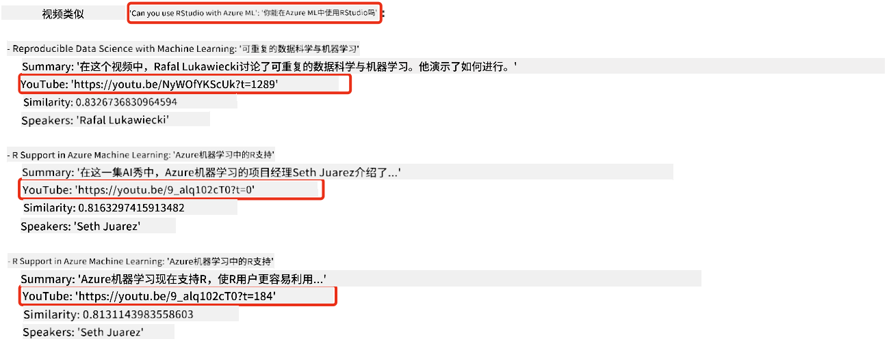

<!--
CO_OP_TRANSLATOR_METADATA:
{
  "original_hash": "d46aad0917a1a342d613e2c13d457da5",
  "translation_date": "2025-05-19T10:23:01+00:00",
  "source_file": "08-building-search-applications/README.md",
  "language_code": "zh"
}
-->
# 构建搜索应用程序

[](https://aka.ms/gen-ai-lesson8-gh?WT.mc_id=academic-105485-koreyst)

> > _点击上方图片观看本课视频_

大型语言模型不仅仅用于聊天机器人和文本生成。还可以使用嵌入来构建搜索应用程序。嵌入是数据的数值表示，也称为向量，可以用于数据的语义搜索。

在本课中，你将为我们的教育初创公司构建一个搜索应用程序。我们的初创公司是一家非营利组织，旨在为发展中国家的学生提供免费教育。我们公司有大量的YouTube视频供学生学习AI。我们希望构建一个搜索应用程序，让学生通过输入问题来搜索相关的YouTube视频。

例如，学生可能会输入“什么是Jupyter Notebooks？”或“什么是Azure ML”，搜索应用程序将返回与问题相关的YouTube视频列表，更好的是，搜索应用程序将返回视频中回答问题的具体位置链接。

## 介绍

在本课中，我们将涵盖：

- 语义搜索与关键词搜索的区别。
- 什么是文本嵌入。
- 创建文本嵌入索引。
- 搜索文本嵌入索引。

## 学习目标

完成本课后，你将能够：

- 区分语义搜索和关键词搜索。
- 解释什么是文本嵌入。
- 使用嵌入创建一个用于数据搜索的应用程序。

## 为什么要构建搜索应用程序？

创建搜索应用程序将帮助你理解如何使用嵌入来搜索数据。你还将学习如何构建一个学生可以快速查找信息的搜索应用程序。

课程包括一个微软[AI Show](https://www.youtube.com/playlist?list=PLlrxD0HtieHi0mwteKBOfEeOYf0LJU4O1) YouTube频道的转录嵌入索引。AI Show是一个教授AI和机器学习的YouTube频道。嵌入索引包含截至2023年10月的每个YouTube转录的嵌入。你将使用嵌入索引为我们的初创公司构建搜索应用程序。搜索应用程序返回视频中回答问题的具体位置链接。这是学生快速查找所需信息的好方法。

以下是关于“你能否使用rstudio与Azure ML”的语义查询示例。查看YouTube链接，你会看到链接包含一个时间戳，带你到视频中回答问题的具体位置。



## 什么是语义搜索？

现在你可能想知道，什么是语义搜索？语义搜索是一种使用查询中词语的语义或意义来返回相关结果的搜索技术。

以下是语义搜索的一个例子。假设你想买车，你可能会搜索“我的梦想车”，语义搜索理解你不是`dreaming`关于一辆车，而是你想买你的`ideal`车。语义搜索理解你的意图并返回相关结果。替代方法是`keyword search`，它会字面上搜索关于车的梦想，通常返回不相关的结果。

## 什么是文本嵌入？

[文本嵌入](https://en.wikipedia.org/wiki/Word_embedding?WT.mc_id=academic-105485-koreyst)是一种用于[自然语言处理](https://en.wikipedia.org/wiki/Natural_language_processing?WT.mc_id=academic-105485-koreyst)的文本表示技术。文本嵌入是文本的语义数值表示。嵌入用于以机器易于理解的方式表示数据。构建文本嵌入有许多模型，在本课中，我们将专注于使用OpenAI嵌入模型生成嵌入。

以下是一个例子，假设以下文本是AI Show YouTube频道某一集的转录：

```text
Today we are going to learn about Azure Machine Learning.
```

我们将文本传递给OpenAI嵌入API，它将返回由1536个数字组成的嵌入，也就是一个向量。向量中的每个数字代表文本的不同方面。为了简洁，这里是向量的前10个数字。

```python
[-0.006655829958617687, 0.0026128944009542465, 0.008792596869170666, -0.02446001023054123, -0.008540431968867779, 0.022071078419685364, -0.010703742504119873, 0.003311325330287218, -0.011632772162556648, -0.02187200076878071, ...]
```

## 嵌入索引是如何创建的？

本课的嵌入索引是通过一系列Python脚本创建的。你可以在“scripts”文件夹的[README](./scripts/README.md?WT.mc_id=academic-105485-koreyst)中找到这些脚本及说明。你不需要运行这些脚本来完成本课，因为嵌入索引已经为你提供。

这些脚本执行以下操作：

1. 下载[AI Show](https://www.youtube.com/playlist?list=PLlrxD0HtieHi0mwteKBOfEeOYf0LJU4O1)播放列表中每个YouTube视频的转录。
2. 使用[OpenAI Functions](https://learn.microsoft.com/azure/ai-services/openai/how-to/function-calling?WT.mc_id=academic-105485-koreyst)，尝试从YouTube转录的前3分钟中提取演讲者名称。每个视频的演讲者名称存储在名为`embedding_index_3m.json`的嵌入索引中。
3. 然后将转录文本分块为**3分钟的文本段**。段包括大约20个单词与下一个段重叠，以确保段的嵌入不会被截断并提供更好的搜索上下文。
4. 每个文本段传递给OpenAI Chat API，将文本总结为60个单词。总结也存储在嵌入索引`embedding_index_3m.json`中。
5. 最后，段文本传递给OpenAI嵌入API。嵌入API返回一个由1536个数字组成的向量，代表段的语义意义。段与OpenAI嵌入向量一起存储在嵌入索引`embedding_index_3m.json`中。

### 向量数据库

为了简化课程，嵌入索引存储在一个名为`embedding_index_3m.json`的JSON文件中，并加载到Pandas DataFrame中。然而，在生产中，嵌入索引将存储在向量数据库中，如[Azure Cognitive Search](https://learn.microsoft.com/training/modules/improve-search-results-vector-search?WT.mc_id=academic-105485-koreyst)、[Redis](https://cookbook.openai.com/examples/vector_databases/redis/readme?WT.mc_id=academic-105485-koreyst)、[Pinecone](https://cookbook.openai.com/examples/vector_databases/pinecone/readme?WT.mc_id=academic-105485-koreyst)、[Weaviate](https://cookbook.openai.com/examples/vector_databases/weaviate/readme?WT.mc_id=academic-105485-koreyst)等。

## 理解余弦相似性

我们已经了解了文本嵌入，下一步是学习如何使用文本嵌入来搜索数据，特别是使用余弦相似性找到与给定查询最相似的嵌入。

### 什么是余弦相似性？

余弦相似性是两个向量之间相似性的度量，你也会听到它被称为`nearest neighbor search`。要执行余弦相似性搜索，你需要使用OpenAI嵌入API为查询文本进行_向量化_。然后计算查询向量与嵌入索引中每个向量之间的_余弦相似性_。记住，嵌入索引为每个YouTube转录文本段都有一个向量。最后，根据余弦相似性排序结果，余弦相似性最高的文本段与查询最相似。

从数学角度来看，余弦相似性测量两个向量在多维空间中投影之间的角度的余弦。这种测量是有益的，因为如果两个文档因大小而在欧几里得距离上相距较远，它们仍然可能有较小的角度，因此余弦相似性更高。有关余弦相似性方程的更多信息，请参见[余弦相似性](https://en.wikipedia.org/wiki/Cosine_similarity?WT.mc_id=academic-105485-koreyst)。

## 构建你的第一个搜索应用程序

接下来，我们将学习如何使用嵌入构建搜索应用程序。搜索应用程序将允许学生通过输入问题来搜索视频。搜索应用程序将返回与问题相关的视频列表。搜索应用程序还将返回视频中回答问题的具体位置链接。

该解决方案已在Windows 11、macOS和Ubuntu 22.04上使用Python 3.10或更高版本进行构建和测试。你可以从[python.org](https://www.python.org/downloads/?WT.mc_id=academic-105485-koreyst)下载Python。

## 作业 - 构建一个搜索应用程序，帮助学生

我们在本课开始时介绍了我们的初创公司。现在是时候帮助学生为他们的评估构建搜索应用程序。

在本次作业中，你将创建用于构建搜索应用程序的Azure OpenAI服务。你将创建以下Azure OpenAI服务。完成本次作业需要一个Azure订阅。

### 启动Azure Cloud Shell

1. 登录[Azure门户](https://portal.azure.com/?WT.mc_id=academic-105485-koreyst)。
2. 选择Azure门户右上角的Cloud Shell图标。
3. 选择**Bash**作为环境类型。

#### 创建资源组

> 在这些说明中，我们使用名为“semantic-video-search”的资源组位于美国东部。
> 你可以更改资源组的名称，但在更改资源位置时，
> 请查看[模型可用性表](https://aka.ms/oai/models?WT.mc_id=academic-105485-koreyst)。

```shell
az group create --name semantic-video-search --location eastus
```

#### 创建Azure OpenAI服务资源

在Azure Cloud Shell中运行以下命令以创建Azure OpenAI服务资源。

```shell
az cognitiveservices account create --name semantic-video-openai --resource-group semantic-video-search \
    --location eastus --kind OpenAI --sku s0
```

#### 获取此应用程序使用的终端和密钥

在Azure Cloud Shell中运行以下命令以获取Azure OpenAI服务资源的终端和密钥。

```shell
az cognitiveservices account show --name semantic-video-openai \
   --resource-group  semantic-video-search | jq -r .properties.endpoint
az cognitiveservices account keys list --name semantic-video-openai \
   --resource-group semantic-video-search | jq -r .key1
```

#### 部署OpenAI嵌入模型

在Azure Cloud Shell中运行以下命令以部署OpenAI嵌入模型。

```shell
az cognitiveservices account deployment create \
    --name semantic-video-openai \
    --resource-group  semantic-video-search \
    --deployment-name text-embedding-ada-002 \
    --model-name text-embedding-ada-002 \
    --model-version "2"  \
    --model-format OpenAI \
    --sku-capacity 100 --sku-name "Standard"
```

## 解决方案

在GitHub Codespaces中打开[解决方案笔记本](../../../08-building-search-applications/python/aoai-solution.ipynb)并按照Jupyter Notebook中的说明进行操作。

当你运行笔记本时，你将被提示输入一个查询。输入框将如下所示：


## 出色的工作！继续你的学习

完成本课后，请查看我们的[生成式AI学习合集](https://aka.ms/genai-collection?WT.mc_id=academic-105485-koreyst)，继续提升你的生成式AI知识！

前往第9课，我们将探讨如何[构建图像生成应用程序](../09-building-image-applications/README.md?WT.mc_id=academic-105485-koreyst)！

**免责声明**：
本文档已使用AI翻译服务[Co-op Translator](https://github.com/Azure/co-op-translator)进行翻译。虽然我们努力确保准确性，但请注意，自动翻译可能包含错误或不准确之处。应将原始语言的文档视为权威来源。对于关键信息，建议进行专业人工翻译。我们不对因使用此翻译而引起的任何误解或误释承担责任。